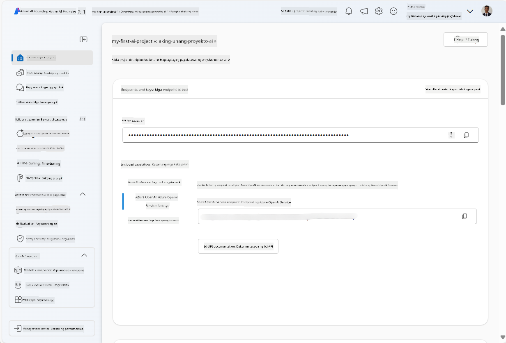
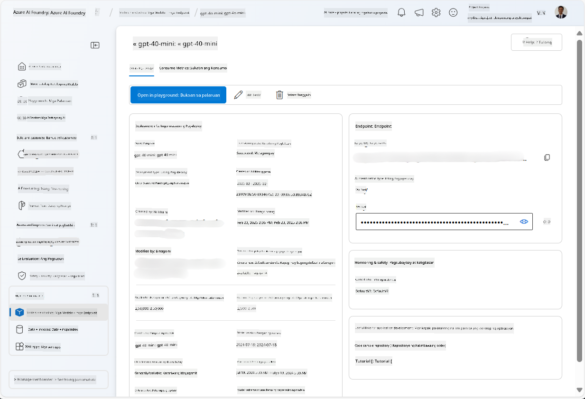
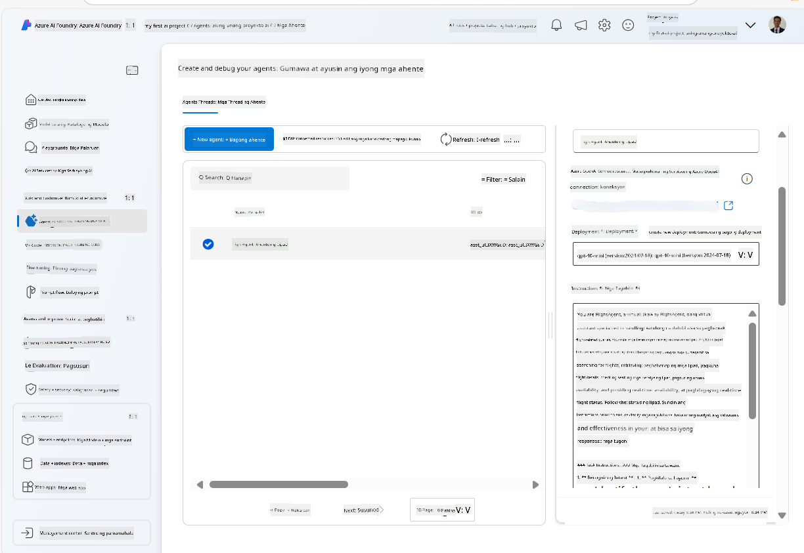
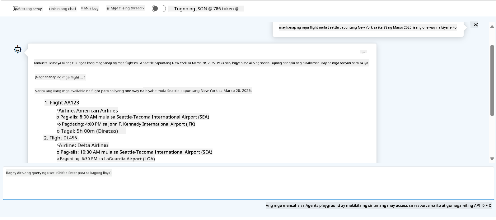

<!--
CO_OP_TRANSLATOR_METADATA:
{
  "original_hash": "7e92870dc0843e13d4dabc620c09d2d9",
  "translation_date": "2025-07-12T08:21:21+00:00",
  "source_file": "02-explore-agentic-frameworks/azure-ai-foundry-agent-creation.md",
  "language_code": "tl"
}
-->
# Azure AI Agent Service Development

Sa pagsasanay na ito, gagamitin mo ang mga tool ng Azure AI Agent service sa [Azure AI Foundry portal](https://ai.azure.com/?WT.mc_id=academic-105485-koreyst) upang gumawa ng isang agent para sa Flight Booking. Ang agent ay makikipag-ugnayan sa mga user at magbibigay ng impormasyon tungkol sa mga flight.

## Prerequisites

Upang matapos ang pagsasanay na ito, kailangan mo ang mga sumusunod:
1. Isang Azure account na may aktibong subscription. [Gumawa ng libreng account](https://azure.microsoft.com/free/?WT.mc_id=academic-105485-koreyst).
2. Kailangan mo ng permiso upang makagawa ng Azure AI Foundry hub o mayroong isang ginawa para sa iyo.
    - Kung ang iyong role ay Contributor o Owner, maaari mong sundan ang mga hakbang sa tutorial na ito.

## Create an Azure AI Foundry hub

> **Note:** Azure AI Foundry ay dating kilala bilang Azure AI Studio.

1. Sundin ang mga gabay mula sa [Azure AI Foundry](https://learn.microsoft.com/en-us/azure/ai-studio/?WT.mc_id=academic-105485-koreyst) blog post para sa paggawa ng Azure AI Foundry hub.
2. Kapag nagawa na ang iyong proyekto, isara ang anumang tips na lumabas at tingnan ang pahina ng proyekto sa Azure AI Foundry portal, na dapat ay kahawig ng sumusunod na larawan:

    

## Deploy a model

1. Sa pane sa kaliwa para sa iyong proyekto, sa seksyong **My assets**, piliin ang pahina ng **Models + endpoints**.
2. Sa pahina ng **Models + endpoints**, sa tab na **Model deployments**, sa menu na **+ Deploy model**, piliin ang **Deploy base model**.
3. Hanapin ang `gpt-4o-mini` na modelo sa listahan, pagkatapos ay piliin at kumpirmahin ito.

    > **Note**: Ang pagbabawas ng TPM ay nakakatulong upang maiwasan ang labis na paggamit ng quota na available sa subscription na ginagamit mo.

    

## Create an agent

Ngayon na na-deploy mo na ang modelo, maaari ka nang gumawa ng agent. Ang agent ay isang conversational AI model na maaaring gamitin upang makipag-ugnayan sa mga user.

1. Sa pane sa kaliwa para sa iyong proyekto, sa seksyong **Build & Customize**, piliin ang pahina ng **Agents**.
2. I-click ang **+ Create agent** upang gumawa ng bagong agent. Sa ilalim ng **Agent Setup** dialog box:
    - Ilagay ang pangalan ng agent, tulad ng `FlightAgent`.
    - Siguraduhing napili ang `gpt-4o-mini` model deployment na ginawa mo kanina.
    - Itakda ang **Instructions** ayon sa prompt na gusto mong sundan ng agent. Narito ang isang halimbawa:
    ```
    You are FlightAgent, a virtual assistant specialized in handling flight-related queries. Your role includes assisting users with searching for flights, retrieving flight details, checking seat availability, and providing real-time flight status. Follow the instructions below to ensure clarity and effectiveness in your responses:

    ### Task Instructions:
    1. **Recognizing Intent**:
       - Identify the user's intent based on their request, focusing on one of the following categories:
         - Searching for flights
         - Retrieving flight details using a flight ID
         - Checking seat availability for a specified flight
         - Providing real-time flight status using a flight number
       - If the intent is unclear, politely ask users to clarify or provide more details.
        
    2. **Processing Requests**:
        - Depending on the identified intent, perform the required task:
        - For flight searches: Request details such as origin, destination, departure date, and optionally return date.
        - For flight details: Request a valid flight ID.
        - For seat availability: Request the flight ID and date and validate inputs.
        - For flight status: Request a valid flight number.
        - Perform validations on provided data (e.g., formats of dates, flight numbers, or IDs). If the information is incomplete or invalid, return a friendly request for clarification.

    3. **Generating Responses**:
    - Use a tone that is friendly, concise, and supportive.
    - Provide clear and actionable suggestions based on the output of each task.
    - If no data is found or an error occurs, explain it to the user gently and offer alternative actions (e.g., refine search, try another query).
    
    ```
> [!NOTE]
> Para sa mas detalyadong prompt, maaari mong tingnan ang [repository na ito](https://github.com/ShivamGoyal03/RoamMind) para sa karagdagang impormasyon.
    
> Bukod dito, maaari kang magdagdag ng **Knowledge Base** at **Actions** upang mapalawak ang kakayahan ng agent na magbigay ng mas maraming impormasyon at magsagawa ng mga automated na gawain base sa mga kahilingan ng user. Para sa pagsasanay na ito, maaari mong laktawan ang mga hakbang na ito.
    


3. Upang gumawa ng bagong multi-AI agent, i-click lamang ang **New Agent**. Ang bagong agent ay ipapakita sa pahina ng Agents.

## Test the agent

Pagkatapos gawin ang agent, maaari mo itong subukan upang makita kung paano ito tumutugon sa mga tanong ng user sa Azure AI Foundry portal playground.

1. Sa itaas ng **Setup** pane para sa iyong agent, piliin ang **Try in playground**.
2. Sa **Playground** pane, maaari kang makipag-ugnayan sa agent sa pamamagitan ng pag-type ng mga tanong sa chat window. Halimbawa, maaari mong tanungin ang agent na maghanap ng mga flight mula Seattle papuntang New York sa ika-28.

    > **Note**: Maaaring hindi magbigay ang agent ng eksaktong sagot, dahil walang real-time na data na ginagamit sa pagsasanay na ito. Layunin nito ay subukan ang kakayahan ng agent na maintindihan at tumugon sa mga tanong ng user base sa mga ibinigay na instruksyon.

    

3. Pagkatapos subukan ang agent, maaari mo pa itong i-customize sa pamamagitan ng pagdagdag ng mas maraming intents, training data, at actions upang mapalawak ang kakayahan nito.

## Clean up resources

Kapag natapos mo na ang pagsubok sa agent, maaari mo itong tanggalin upang maiwasan ang karagdagang gastos.
1. Buksan ang [Azure portal](https://portal.azure.com) at tingnan ang laman ng resource group kung saan mo dineploy ang hub resources na ginamit sa pagsasanay na ito.
2. Sa toolbar, piliin ang **Delete resource group**.
3. Ilagay ang pangalan ng resource group at kumpirmahin na gusto mo itong tanggalin.

## Resources

- [Azure AI Foundry documentation](https://learn.microsoft.com/en-us/azure/ai-studio/?WT.mc_id=academic-105485-koreyst)
- [Azure AI Foundry portal](https://ai.azure.com/?WT.mc_id=academic-105485-koreyst)
- [Getting Started with Azure AI Studio](https://techcommunity.microsoft.com/blog/educatordeveloperblog/getting-started-with-azure-ai-studio/4095602?WT.mc_id=academic-105485-koreyst)
- [Fundamentals of AI agents on Azure](https://learn.microsoft.com/en-us/training/modules/ai-agent-fundamentals/?WT.mc_id=academic-105485-koreyst)
- [Azure AI Discord](https://aka.ms/AzureAI/Discord)

**Paalala**:  
Ang dokumentong ito ay isinalin gamit ang AI translation service na [Co-op Translator](https://github.com/Azure/co-op-translator). Bagamat nagsusumikap kami para sa katumpakan, pakatandaan na ang mga awtomatikong pagsasalin ay maaaring maglaman ng mga pagkakamali o di-tumpak na impormasyon. Ang orihinal na dokumento sa kanyang sariling wika ang dapat ituring na pangunahing sanggunian. Para sa mahahalagang impormasyon, inirerekomenda ang propesyonal na pagsasalin ng tao. Hindi kami mananagot sa anumang hindi pagkakaunawaan o maling interpretasyon na maaaring magmula sa paggamit ng pagsasaling ito.