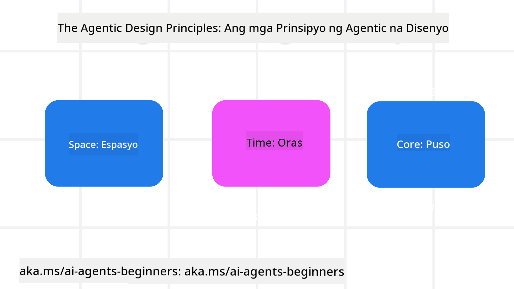

<!--
CO_OP_TRANSLATOR_METADATA:
{
  "original_hash": "4c46e4ff9e349c521e2b0b17f51afa64",
  "translation_date": "2025-08-29T09:53:29+00:00",
  "source_file": "03-agentic-design-patterns/README.md",
  "language_code": "tl"
}
-->

> _(I-click ang larawan sa itaas upang mapanood ang video ng araling ito)_
# Mga Prinsipyo sa Disenyo ng AI Agentic

## Panimula

Maraming paraan upang mag-isip tungkol sa paggawa ng mga AI Agentic Systems. Dahil ang kalabuan ay isang tampok at hindi isang bug sa disenyo ng Generative AI, minsan mahirap para sa mga inhinyero na malaman kung saan magsisimula. Nilikha namin ang isang hanay ng mga prinsipyo sa disenyo ng UX na nakasentro sa tao upang bigyang-kakayahan ang mga developer na bumuo ng mga agentic system na nakatuon sa customer upang matugunan ang kanilang mga pangangailangan sa negosyo. Ang mga prinsipyong ito sa disenyo ay hindi isang tiyak na arkitektura kundi isang panimulang punto para sa mga koponan na nagde-define at bumubuo ng mga karanasan sa agent.

Sa pangkalahatan, ang mga agent ay dapat:

- Palawakin at palakihin ang kakayahan ng tao (pag-iisip ng mga ideya, paglutas ng problema, awtomasyon, atbp.)
- Punan ang mga puwang sa kaalaman (tulungan akong makasabay sa mga larangan ng kaalaman, pagsasalin, atbp.)
- Pasilitahin at suportahan ang pakikipagtulungan sa mga paraang gusto nating makipagtulungan sa iba
- Gawing mas mabuting bersyon ng ating sarili (hal., life coach/task master, pagtulong sa atin na matutunan ang mga kasanayan sa emosyonal na regulasyon at pagninilay, pagbuo ng katatagan, atbp.)

## Tatalakayin sa Araling Ito

- Ano ang mga Prinsipyo sa Disenyo ng Agentic
- Ano ang mga alituntunin na dapat sundin habang ipinatutupad ang mga prinsipyong ito sa disenyo
- Ano ang mga halimbawa ng paggamit ng mga prinsipyong ito sa disenyo

## Mga Layunin sa Pagkatuto

Pagkatapos makumpleto ang araling ito, magagawa mong:

1. Ipaliwanag kung ano ang mga Prinsipyo sa Disenyo ng Agentic
2. Ipaliwanag ang mga alituntunin para sa paggamit ng mga Prinsipyo sa Disenyo ng Agentic
3. Maunawaan kung paano bumuo ng isang agent gamit ang mga Prinsipyo sa Disenyo ng Agentic

## Ang Mga Prinsipyo sa Disenyo ng Agentic

### Agent (Espasyo)

Ito ang kapaligiran kung saan gumagana ang agent. Ang mga prinsipyong ito ay nagbibigay ng gabay kung paano magdisenyo ng mga agent para sa pakikisalamuha sa pisikal at digital na mundo.

- **Nag-uugnay, hindi nagwawasak** – tumutulong na mag-ugnay ng mga tao sa iba pang tao, mga kaganapan, at actionable na kaalaman upang paganahin ang pakikipagtulungan at koneksyon.
- Ang mga agent ay tumutulong na mag-ugnay ng mga kaganapan, kaalaman, at tao.
- Ang mga agent ay nagdadala ng mga tao na mas malapit sa isa't isa. Hindi sila idinisenyo upang palitan o maliitin ang mga tao.
- **Madaling ma-access ngunit paminsan-minsang hindi nakikita** – ang agent ay pangunahing gumagana sa background at nagbibigay lamang ng pansin kapag ito ay may kaugnayan at naaangkop.
  - Ang agent ay madaling mahanap at ma-access ng mga awtorisadong gumagamit sa anumang device o platform.
  - Ang agent ay sumusuporta sa multimodal na input at output (tunog, boses, teksto, atbp.).
  - Ang agent ay maaaring walang putol na lumipat sa pagitan ng foreground at background; sa pagitan ng proactive at reactive, depende sa sensing ng mga pangangailangan ng gumagamit.
  - Ang agent ay maaaring gumana sa hindi nakikitang anyo, ngunit ang proseso nito sa background at pakikipagtulungan sa iba pang mga agent ay malinaw at kontrolado ng gumagamit.

### Agent (Oras)

Ito ay kung paano gumagana ang agent sa paglipas ng panahon. Ang mga prinsipyong ito ay nagbibigay ng gabay kung paano magdisenyo ng mga agent na nakikipag-ugnayan sa nakaraan, kasalukuyan, at hinaharap.

- **Nakaraan**: Pagninilay sa kasaysayan na kinabibilangan ng parehong estado at konteksto.
  - Ang agent ay nagbibigay ng mas may kaugnayang resulta batay sa pagsusuri ng mas mayamang makasaysayang data na lampas sa kaganapan, tao, o estado.
  - Ang agent ay lumilikha ng mga koneksyon mula sa mga nakaraang kaganapan at aktibong nagmumuni-muni sa memorya upang makisali sa mga kasalukuyang sitwasyon.
- **Ngayon**: Nagbibigay ng direksyon kaysa sa simpleng abiso.
  - Ang agent ay nagtataglay ng komprehensibong diskarte sa pakikipag-ugnayan sa mga tao. Kapag may nangyari, ang agent ay higit pa sa static na abiso o iba pang pormalidad. Ang agent ay maaaring magpasimple ng mga daloy o dynamic na bumuo ng mga pahiwatig upang idirekta ang atensyon ng gumagamit sa tamang sandali.
  - Ang agent ay naghahatid ng impormasyon batay sa kontekstwal na kapaligiran, mga pagbabago sa lipunan at kultura, at iniangkop sa layunin ng gumagamit.
  - Ang pakikipag-ugnayan ng agent ay maaaring unti-unti, umuunlad/nagiging mas kumplikado upang bigyang-kapangyarihan ang mga gumagamit sa mahabang panahon.
- **Hinaharap**: Umaangkop at umuunlad.
  - Ang agent ay umaangkop sa iba't ibang mga device, platform, at modality.
  - Ang agent ay umaangkop sa pag-uugali ng gumagamit, mga pangangailangan sa accessibility, at malayang nako-customize.
  - Ang agent ay hinuhubog at umuunlad sa pamamagitan ng tuloy-tuloy na pakikipag-ugnayan ng gumagamit.

### Agent (Core)

Ito ang mga pangunahing elemento sa disenyo ng isang agent.

- **Tanggapin ang kawalan ng katiyakan ngunit magtatag ng tiwala**.
  - Ang isang tiyak na antas ng kawalan ng katiyakan sa agent ay inaasahan. Ang kawalan ng katiyakan ay isang pangunahing elemento ng disenyo ng agent.
  - Ang tiwala at transparency ay mga pundasyong layer ng disenyo ng agent.
  - Ang mga tao ang may kontrol kung kailan naka-on/naka-off ang agent at ang status ng agent ay malinaw na nakikita sa lahat ng oras.

## Mga Alituntunin sa Pagpapatupad ng Mga Prinsipyong Ito

Kapag ginagamit ang mga prinsipyong disenyo na nabanggit, sundin ang mga sumusunod na alituntunin:

1. **Transparency**: Ipabatid sa gumagamit na may AI na kasangkot, kung paano ito gumagana (kabilang ang mga nakaraang aksyon), at kung paano magbigay ng feedback at baguhin ang sistema.
2. **Control**: Bigyang-kakayahan ang gumagamit na i-customize, tukuyin ang mga kagustuhan at i-personalize, at magkaroon ng kontrol sa sistema at mga katangian nito (kabilang ang kakayahang makalimutan).
3. **Consistency**: Sikaping magkaroon ng pare-parehong, multi-modal na karanasan sa iba't ibang device at endpoint. Gumamit ng mga pamilyar na elemento ng UI/UX kung maaari (hal., icon ng mikropono para sa pakikipag-ugnayan sa boses) at bawasan ang cognitive load ng customer hangga't maaari (hal., magbigay ng maikli at malinaw na mga sagot, mga visual aid, at nilalaman na 'Matuto Pa').

## Paano Magdisenyo ng Isang Travel Agent gamit ang Mga Prinsipyong Ito at Alituntunin

Isipin na ikaw ay nagdidisenyo ng isang Travel Agent, narito kung paano mo maaaring isipin ang paggamit ng mga Prinsipyo sa Disenyo at Alituntunin:

1. **Transparency** – Ipabatid sa gumagamit na ang Travel Agent ay isang AI-enabled na Agent. Magbigay ng ilang pangunahing tagubilin kung paano magsimula (hal., isang “Hello” na mensahe, mga sample na prompt). Malinaw na idokumento ito sa pahina ng produkto. Ipakita ang listahan ng mga prompt na tinanong ng gumagamit sa nakaraan. Gawing malinaw kung paano magbigay ng feedback (thumbs up at down, Send Feedback button, atbp.). Malinaw na ipaliwanag kung may mga limitasyon sa paggamit o paksa ang Agent.
2. **Control** – Siguraduhing malinaw kung paano maaaring baguhin ng gumagamit ang Agent pagkatapos itong malikha gamit ang mga bagay tulad ng System Prompt. Bigyang-kakayahan ang gumagamit na pumili kung gaano kahaba ang sagot ng Agent, ang istilo ng pagsusulat nito, at anumang mga limitasyon sa kung ano ang hindi dapat pag-usapan ng Agent. Payagan ang gumagamit na tingnan at tanggalin ang anumang nauugnay na mga file o data, mga prompt, at mga nakaraang pag-uusap.
3. **Consistency** – Siguraduhing ang mga icon para sa Share Prompt, magdagdag ng file o larawan, at mag-tag ng isang tao o bagay ay pamantayan at madaling makilala. Gumamit ng icon ng paperclip upang ipahiwatig ang pag-upload/pagbabahagi ng file sa Agent, at isang icon ng larawan upang ipahiwatig ang pag-upload ng graphics.

### May Higit Pang Katanungan Tungkol sa Mga Pattern ng Disenyo ng AI Agentic?

Sumali sa [Azure AI Foundry Discord](https://aka.ms/ai-agents/discord) upang makipagkita sa iba pang mga nag-aaral, dumalo sa mga office hour, at masagot ang iyong mga tanong tungkol sa AI Agents.

## Karagdagang Mga Mapagkukunan

- ## Nakaraang Aralin

[Paggalugad sa Mga Framework ng Agentic](../02-explore-agentic-frameworks/README.md)

## Susunod na Aralin

[Pattern ng Disenyo para sa Paggamit ng Tool](../04-tool-use/README.md)

---

**Paunawa**:  
Ang dokumentong ito ay isinalin gamit ang AI translation service na [Co-op Translator](https://github.com/Azure/co-op-translator). Bagama't sinisikap naming maging tumpak, pakitandaan na ang mga awtomatikong pagsasalin ay maaaring maglaman ng mga pagkakamali o hindi pagkakatugma. Ang orihinal na dokumento sa orihinal nitong wika ang dapat ituring na opisyal na sanggunian. Para sa mahalagang impormasyon, inirerekomenda ang propesyonal na pagsasalin ng tao. Hindi kami mananagot sa anumang hindi pagkakaunawaan o maling interpretasyon na maaaring magmula sa paggamit ng pagsasaling ito.