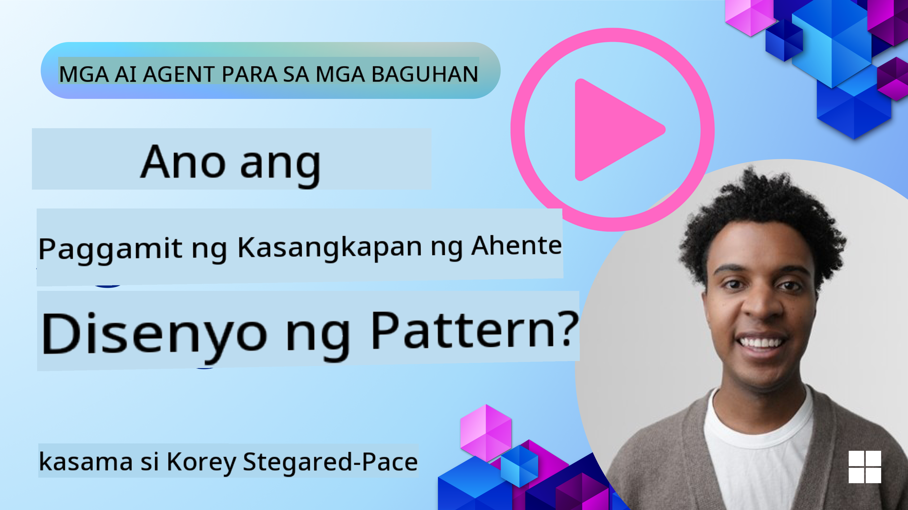
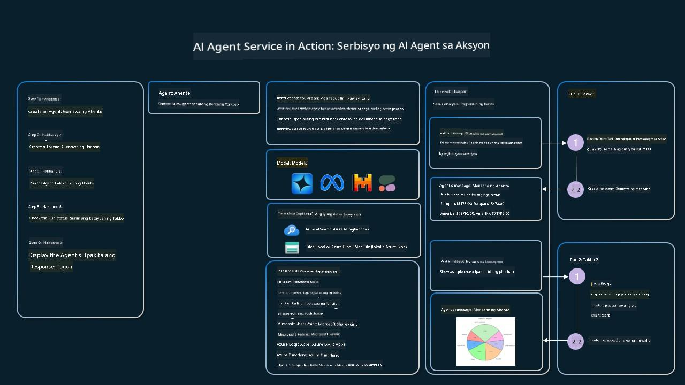

<!--
CO_OP_TRANSLATOR_METADATA:
{
  "original_hash": "88258b03f2893aa2e69eb8fb24baabbc",
  "translation_date": "2025-07-12T09:40:32+00:00",
  "source_file": "04-tool-use/README.md",
  "language_code": "tl"
}
-->
[](https://youtu.be/vieRiPRx-gI?si=cEZ8ApnT6Sus9rhn)

> _(I-click ang larawan sa itaas upang panoorin ang video ng araling ito)_

# Tool Use Design Pattern

Kawili-wili ang mga tools dahil nagbibigay ito sa mga AI agents ng mas malawak na kakayahan. Sa halip na limitado lang ang mga aksyon na kaya ng agent, sa pamamagitan ng pagdagdag ng tool, maaari na nitong gawin ang mas maraming uri ng gawain. Sa kabanatang ito, tatalakayin natin ang Tool Use Design Pattern, na naglalarawan kung paano magagamit ng mga AI agents ang mga partikular na tools upang makamit ang kanilang mga layunin.

## Panimula

Sa araling ito, sisikapin nating sagutin ang mga sumusunod na tanong:

- Ano ang tool use design pattern?
- Sa anong mga kaso ito maaaring gamitin?
- Ano ang mga elemento o bahagi na kailangan upang maipatupad ang design pattern?
- Ano ang mga espesyal na konsiderasyon sa paggamit ng Tool Use Design Pattern para makabuo ng mapagkakatiwalaang AI agents?

## Mga Layunin sa Pagkatuto

Pagkatapos makumpleto ang araling ito, magagawa mong:

- Ilarawan ang Tool Use Design Pattern at ang layunin nito.
- Tukuyin ang mga kaso kung saan ang Tool Use Design Pattern ay angkop gamitin.
- Maunawaan ang mga pangunahing elemento na kailangan upang maipatupad ang design pattern.
- Kilalanin ang mga konsiderasyon para matiyak ang pagiging mapagkakatiwalaan ng AI agents na gumagamit ng design pattern na ito.

## Ano ang Tool Use Design Pattern?

Ang **Tool Use Design Pattern** ay nakatuon sa pagbibigay sa LLMs ng kakayahang makipag-ugnayan sa mga panlabas na tools upang makamit ang mga partikular na layunin. Ang mga tools ay mga code na maaaring patakbuhin ng isang agent upang magsagawa ng mga aksyon. Ang isang tool ay maaaring simpleng function tulad ng calculator, o isang API call sa third-party na serbisyo tulad ng pagkuha ng presyo ng stock o forecast ng panahon. Sa konteksto ng AI agents, ang mga tools ay idinisenyo upang patakbuhin ng mga agent bilang tugon sa **model-generated function calls**.

## Sa anong mga kaso ito maaaring gamitin?

Maaaring gamitin ng AI Agents ang mga tools upang tapusin ang mga komplikadong gawain, kumuha ng impormasyon, o gumawa ng mga desisyon. Madalas gamitin ang tool use design pattern sa mga sitwasyon na nangangailangan ng dynamic na pakikipag-ugnayan sa mga panlabas na sistema, tulad ng databases, web services, o code interpreters. Ang kakayahang ito ay kapaki-pakinabang sa iba't ibang mga kaso tulad ng:

- **Dynamic Information Retrieval:** Maaaring mag-query ang mga agent sa mga panlabas na API o database para kumuha ng pinakabagong datos (hal., pag-query sa SQLite database para sa data analysis, pagkuha ng presyo ng stock o impormasyon ng panahon).
- **Code Execution and Interpretation:** Maaaring magpatakbo ang mga agent ng code o script upang lutasin ang mga problemang matematika, gumawa ng mga ulat, o magsagawa ng mga simulation.
- **Workflow Automation:** Pag-automate ng mga paulit-ulit o multi-step na workflow sa pamamagitan ng integrasyon ng mga tools tulad ng task schedulers, email services, o data pipelines.
- **Customer Support:** Maaaring makipag-ugnayan ang mga agent sa mga CRM system, ticketing platform, o knowledge base upang sagutin ang mga tanong ng user.
- **Content Generation and Editing:** Maaaring gamitin ng mga agent ang mga tools tulad ng grammar checkers, text summarizers, o content safety evaluators upang tumulong sa paggawa ng nilalaman.

## Ano ang mga elemento o bahagi na kailangan upang maipatupad ang tool use design pattern?

Ang mga bahaging ito ang nagpapahintulot sa AI agent na magsagawa ng malawak na hanay ng mga gawain. Tingnan natin ang mga pangunahing elemento na kailangan upang maipatupad ang Tool Use Design Pattern:

- **Function/Tool Schemas**: Detalyadong mga depinisyon ng mga available na tools, kabilang ang pangalan ng function, layunin, mga kinakailangang parameter, at inaasahang output. Pinapahintulutan ng mga schema na ito ang LLM na maunawaan kung anong mga tools ang pwede gamitin at kung paano bumuo ng wastong mga request.

- **Function Execution Logic**: Namamahala kung paano at kailan tatawagin ang mga tools base sa intensyon ng user at konteksto ng pag-uusap. Maaaring kabilang dito ang mga planner module, routing mechanism, o conditional flows na nagdedesisyon ng paggamit ng tool nang dynamic.

- **Message Handling System**: Mga bahagi na nag-aasikaso ng daloy ng pag-uusap sa pagitan ng input ng user, sagot ng LLM, pagtawag sa tool, at output ng tool.

- **Tool Integration Framework**: Impraestruktura na nag-uugnay sa agent sa iba't ibang tools, maging ito man ay simpleng function o komplikadong panlabas na serbisyo.

- **Error Handling & Validation**: Mga mekanismo para hawakan ang mga pagkakamali sa pagpapatakbo ng tool, pag-validate ng mga parameter, at pamamahala sa mga hindi inaasahang tugon.

- **State Management**: Nagtatala ng konteksto ng pag-uusap, mga naunang interaksyon sa tool, at persistent na datos upang matiyak ang pagkakapare-pareho sa mga multi-turn na interaksyon.

Susunod, titingnan natin nang mas detalyado ang Function/Tool Calling.

### Function/Tool Calling

Ang function calling ang pangunahing paraan para payagan ang Large Language Models (LLMs) na makipag-ugnayan sa mga tools. Madalas gamitin nang palitan ang 'Function' at 'Tool' dahil ang mga 'functions' (mga reusable na code block) ang mga 'tools' na ginagamit ng mga agent para gawin ang mga gawain. Para mapatakbo ang code ng isang function, kailangang ikumpara ng LLM ang request ng user sa paglalarawan ng function. Ginagawa ito sa pamamagitan ng pagpapadala ng schema na naglalaman ng mga paglalarawan ng lahat ng available na functions sa LLM. Pipili ang LLM ng pinakaangkop na function para sa gawain at ibabalik ang pangalan nito at mga argumento. Tatawagin ang napiling function, at ang tugon nito ay ipapasa pabalik sa LLM, na gagamitin ang impormasyong iyon upang sagutin ang request ng user.

Para sa mga developer na gustong mag-implement ng function calling para sa mga agent, kakailanganin mo:

1. Isang LLM model na sumusuporta sa function calling
2. Isang schema na naglalaman ng mga paglalarawan ng function
3. Ang code para sa bawat function na inilalarawan

Gamitin natin ang halimbawa ng pagkuha ng kasalukuyang oras sa isang lungsod upang ipakita:

1. **I-initialize ang LLM na sumusuporta sa function calling:**

    Hindi lahat ng modelo ay sumusuporta sa function calling, kaya mahalagang tiyakin na ang LLM na ginagamit mo ay may ganitong kakayahan. <a href="https://learn.microsoft.com/azure/ai-services/openai/how-to/function-calling" target="_blank">Sinusuportahan ng Azure OpenAI</a> ang function calling. Maaari tayong magsimula sa pag-initialize ng Azure OpenAI client.

    ```python
    # Initialize the Azure OpenAI client
    client = AzureOpenAI(
        azure_endpoint = os.getenv("AZURE_OPENAI_ENDPOINT"), 
        api_key=os.getenv("AZURE_OPENAI_API_KEY"),  
        api_version="2024-05-01-preview"
    )
    ```

1. **Gumawa ng Function Schema:**

    Susunod, magde-define tayo ng JSON schema na naglalaman ng pangalan ng function, paglalarawan ng ginagawa ng function, at mga pangalan at paglalarawan ng mga parameter ng function. Ipasa natin ang schema na ito sa client na ginawa kanina, kasama ang request ng user para malaman ang oras sa San Francisco. Mahalaga tandaan na ang **tool call** ang ibinabalik, **hindi** ang huling sagot sa tanong. Tulad ng nabanggit, ibinabalik ng LLM ang pangalan ng function na pinili nito para sa gawain, pati na rin ang mga argumentong ipapasa dito.

    ```python
    # Function description for the model to read
    tools = [
        {
            "type": "function",
            "function": {
                "name": "get_current_time",
                "description": "Get the current time in a given location",
                "parameters": {
                    "type": "object",
                    "properties": {
                        "location": {
                            "type": "string",
                            "description": "The city name, e.g. San Francisco",
                        },
                    },
                    "required": ["location"],
                },
            }
        }
    ]
    ```
   
    ```python
  
    # Initial user message
    messages = [{"role": "user", "content": "What's the current time in San Francisco"}] 
  
    # First API call: Ask the model to use the function
      response = client.chat.completions.create(
          model=deployment_name,
          messages=messages,
          tools=tools,
          tool_choice="auto",
      )
  
      # Process the model's response
      response_message = response.choices[0].message
      messages.append(response_message)
  
      print("Model's response:")  

      print(response_message)
  
    ```

    ```bash
    Model's response:
    ChatCompletionMessage(content=None, role='assistant', function_call=None, tool_calls=[ChatCompletionMessageToolCall(id='call_pOsKdUlqvdyttYB67MOj434b', function=Function(arguments='{"location":"San Francisco"}', name='get_current_time'), type='function')])
    ```
  
1. **Ang code ng function na kailangan para isagawa ang gawain:**

    Ngayong napili na ng LLM kung aling function ang dapat patakbuhin, kailangang ipatupad at patakbuhin ang code na magsasagawa ng gawain. Maaari nating ipatupad ang code para makuha ang kasalukuyang oras gamit ang Python. Kailangan din nating isulat ang code para kunin ang pangalan at mga argumento mula sa response_message upang makuha ang huling resulta.

    ```python
      def get_current_time(location):
        """Get the current time for a given location"""
        print(f"get_current_time called with location: {location}")  
        location_lower = location.lower()
        
        for key, timezone in TIMEZONE_DATA.items():
            if key in location_lower:
                print(f"Timezone found for {key}")  
                current_time = datetime.now(ZoneInfo(timezone)).strftime("%I:%M %p")
                return json.dumps({
                    "location": location,
                    "current_time": current_time
                })
      
        print(f"No timezone data found for {location_lower}")  
        return json.dumps({"location": location, "current_time": "unknown"})
    ```

    ```python
     # Handle function calls
      if response_message.tool_calls:
          for tool_call in response_message.tool_calls:
              if tool_call.function.name == "get_current_time":
     
                  function_args = json.loads(tool_call.function.arguments)
     
                  time_response = get_current_time(
                      location=function_args.get("location")
                  )
     
                  messages.append({
                      "tool_call_id": tool_call.id,
                      "role": "tool",
                      "name": "get_current_time",
                      "content": time_response,
                  })
      else:
          print("No tool calls were made by the model.")  
  
      # Second API call: Get the final response from the model
      final_response = client.chat.completions.create(
          model=deployment_name,
          messages=messages,
      )
  
      return final_response.choices[0].message.content
     ```

    ```bash
      get_current_time called with location: San Francisco
      Timezone found for san francisco
      The current time in San Francisco is 09:24 AM.
     ```

Ang Function Calling ang sentro ng karamihan, kung hindi man lahat, ng agent tool use design, ngunit minsan ay mahirap itong ipatupad mula sa simula. Tulad ng natutunan natin sa [Lesson 2](../../../02-explore-agentic-frameworks), nagbibigay ang mga agentic frameworks ng mga pre-built na bahagi para maipatupad ang tool use.

## Mga Halimbawa ng Tool Use gamit ang Agentic Frameworks

Narito ang ilang halimbawa kung paano mo maipapatupad ang Tool Use Design Pattern gamit ang iba't ibang agentic frameworks:

### Semantic Kernel

<a href="https://learn.microsoft.com/azure/ai-services/agents/overview" target="_blank">Semantic Kernel</a> ay isang open-source AI framework para sa mga .NET, Python, at Java developer na nagtatrabaho gamit ang Large Language Models (LLMs). Pinapadali nito ang proseso ng paggamit ng function calling sa pamamagitan ng awtomatikong paglalarawan ng iyong mga function at mga parameter sa model sa pamamagitan ng prosesong tinatawag na <a href="https://learn.microsoft.com/semantic-kernel/concepts/ai-services/chat-completion/function-calling/?pivots=programming-language-python#1-serializing-the-functions" target="_blank">serializing</a>. Pinamamahalaan din nito ang komunikasyon pabalik-balik sa pagitan ng model at ng iyong code. Isa pang benepisyo ng paggamit ng agentic framework tulad ng Semantic Kernel ay ang pagkakaroon ng access sa mga pre-built na tools tulad ng <a href="https://github.com/microsoft/semantic-kernel/blob/main/python/samples/getting_started_with_agents/openai_assistant/step4_assistant_tool_file_search.py" target="_blank">File Search</a> at <a href="https://github.com/microsoft/semantic-kernel/blob/main/python/samples/getting_started_with_agents/openai_assistant/step3_assistant_tool_code_interpreter.py" target="_blank">Code Interpreter</a>.

Ipinapakita ng sumusunod na diagram ang proseso ng function calling gamit ang Semantic Kernel:


Sa Semantic Kernel, ang mga functions/tools ay tinatawag na <a href="https://learn.microsoft.com/semantic-kernel/concepts/plugins/?pivots=programming-language-python" target="_blank">Plugins</a>. Maaari nating gawing plugin ang `get_current_time` function na nakita natin kanina sa pamamagitan ng pag-convert nito sa isang class na may function sa loob. Maaari rin nating i-import ang `kernel_function` decorator, na tumatanggap ng paglalarawan ng function. Kapag gumawa ka ng kernel gamit ang GetCurrentTimePlugin, awtomatikong isi-serialize ng kernel ang function at mga parameter nito, na lumilikha ng schema na ipapadala sa LLM.

```python
from semantic_kernel.functions import kernel_function

class GetCurrentTimePlugin:
    async def __init__(self, location):
        self.location = location

    @kernel_function(
        description="Get the current time for a given location"
    )
    def get_current_time(location: str = ""):
        ...

```

```python 
from semantic_kernel import Kernel

# Create the kernel
kernel = Kernel()

# Create the plugin
get_current_time_plugin = GetCurrentTimePlugin(location)

# Add the plugin to the kernel
kernel.add_plugin(get_current_time_plugin)
```
  
### Azure AI Agent Service

<a href="https://learn.microsoft.com/azure/ai-services/agents/overview" target="_blank">Azure AI Agent Service</a> ay isang bagong agentic framework na idinisenyo upang bigyang kapangyarihan ang mga developer na ligtas na makabuo, makapag-deploy, at makapag-scale ng mataas na kalidad at extensible na AI agents nang hindi na kailangang pamahalaan ang mga underlying compute at storage resources. Partikular itong kapaki-pakinabang para sa mga enterprise application dahil ito ay isang fully managed service na may enterprise grade security.

Kung ikukumpara sa direktang pag-develop gamit ang LLM API, nag-aalok ang Azure AI Agent Service ng ilang mga benepisyo, kabilang ang:

- Awtomatikong pagtawag ng tool – hindi na kailangang i-parse ang tool call, tawagin ang tool, at hawakan ang tugon; lahat ng ito ay ginagawa na sa server-side
- Ligtas na pamamahala ng data – sa halip na pamahalaan ang sariling estado ng pag-uusap, maaari kang umasa sa threads para itago ang lahat ng impormasyong kailangan mo
- Mga out-of-the-box na tools – Mga tools na maaari mong gamitin upang makipag-ugnayan sa iyong mga data source, tulad ng Bing, Azure AI Search, at Azure Functions.

Ang mga tools na available sa Azure AI Agent Service ay nahahati sa dalawang kategorya:

1. Knowledge Tools:
    - <a href="https://learn.microsoft.com/azure/ai-services/agents/how-to/tools/bing-grounding?tabs=python&pivots=overview" target="_blank">Grounding gamit ang Bing Search</a>
    - <a href="https://learn.microsoft.com/azure/ai-services/agents/how-to/tools/file-search?tabs=python&pivots=overview" target="_blank">File Search</a>
    - <a href="https://learn.microsoft.com/azure/ai-services/agents/how-to/tools/azure-ai-search?tabs=azurecli%2Cpython&pivots=overview-azure-ai-search" target="_blank">Azure AI Search</a>

2. Action Tools:
    - <a href="https://learn.microsoft.com/azure/ai-services/agents/how-to/tools/function-calling?tabs=python&pivots=overview" target="_blank">Function Calling</a>
    - <a href="https://learn.microsoft.com/azure/ai-services/agents/how-to/tools/code-interpreter?tabs=python&pivots=overview" target="_blank">Code Interpreter</a>
    - <a href="https://learn.microsoft.com/azure/ai-services/agents/how-to/tools/openapi-spec?tabs=python&pivots=overview" target="_blank">Mga tool na tinukoy ng OpenAI</a>
    - <a href="https://learn.microsoft.com/azure/ai-services/agents/how-to/tools/azure-functions?pivots=overview" target="_blank">Azure Functions</a>

Pinapayagan tayo ng Agent Service na magamit ang mga tools na ito nang sabay bilang isang `toolset`. Ginagamit din nito ang `threads` na nagtatala ng kasaysayan ng mga mensahe mula sa isang partikular na pag-uusap.

Isipin na ikaw ay isang sales agent sa isang kumpanya na tinatawag na Contoso. Nais mong bumuo ng isang conversational agent na kayang sumagot ng mga tanong tungkol sa iyong sales data.

Ipinapakita ng sumusunod na larawan kung paano mo magagamit ang Azure AI Agent Service upang suriin ang iyong sales data:



Para magamit ang alinman sa mga tools na ito sa serbisyo, maaari tayong gumawa ng client at magdeklara ng tool o toolset. Para maipatupad ito nang praktikal, maaari nating gamitin ang sumusunod na Python code. Magagawa ng LLM na tingnan ang toolset at magdesisyon kung gagamitin ang user-created function na `fetch_sales_data_using_sqlite_query`, o ang pre-built Code Interpreter depende sa request ng user.

```python 
import os
from azure.ai.projects import AIProjectClient
from azure.identity import DefaultAzureCredential
from fecth_sales_data_functions import fetch_sales_data_using_sqlite_query # fetch_sales_data_using_sqlite_query function which can be found in a fetch_sales_data_functions.py file.
from azure.ai.projects.models import ToolSet, FunctionTool, CodeInterpreterTool

project_client = AIProjectClient.from_connection_string(
    credential=DefaultAzureCredential(),
    conn_str=os.environ["PROJECT_CONNECTION_STRING"],
)

# Initialize function calling agent with the fetch_sales_data_using_sqlite_query function and adding it to the toolset
fetch_data_function = FunctionTool(fetch_sales_data_using_sqlite_query)
toolset = ToolSet()
toolset.add(fetch_data_function)

# Initialize Code Interpreter tool and adding it to the toolset. 
code_interpreter = code_interpreter = CodeInterpreterTool()
toolset = ToolSet()
toolset.add(code_interpreter)

agent = project_client.agents.create_agent(
    model="gpt-4o-mini", name="my-agent", instructions="You are helpful agent", 
    toolset=toolset
)
```

## Ano ang mga espesyal na konsiderasyon sa paggamit ng Tool Use Design Pattern para makabuo ng mapagkakatiwalaang AI agents?

Isang karaniwang alalahanin sa SQL na dynamic na ginagawa ng LLMs ay ang seguridad, lalo na ang panganib ng SQL injection o mga malisyosong aksyon, tulad ng pag-drop o pag-manipula ng database. Bagamat makatwiran ang mga alalahaning ito, maaari itong epektibong mapigilan sa pamamagitan ng tamang pag-configure ng mga permiso sa database. Para sa karamihan ng mga database, nangangahulugan ito ng pag-configure ng database bilang read-only. Para sa mga database service tulad ng PostgreSQL o Azure SQL, dapat bigyan ang app ng read-only (SELECT) na role.

Ang pagpapatakbo ng app sa isang secure na kapaligiran ay lalo pang nagpapalakas ng proteksyon. Sa mga enterprise na sitwasyon, karaniwang kinukuha at binabago ang data mula sa mga operational system papunta sa isang read-only database o data warehouse na may user-friendly na schema. Tinitiyak ng pamamaraang ito na ang data ay ligtas, optimized para sa performance at accessibility, at may limitadong read-only access ang app.

## Karagdagang Mga Sanggunian

-

Azure AI Agents Service Workshop</a>
- <a href="https://github.com/Azure-Samples/contoso-creative-writer/tree/main/docs/workshop" target="_blank">Contoso Creative Writer Multi-Agent Workshop</a>
- <a href="https://learn.microsoft.com/semantic-kernel/concepts/ai-services/chat-completion/function-calling/?pivots=programming-language-python#1-serializing-the-functions" target="_blank">Tutorial sa Semantic Kernel Function Calling</a>
- <a href="https://github.com/microsoft/semantic-kernel/blob/main/python/samples/getting_started_with_agents/openai_assistant/step3_assistant_tool_code_interpreter.py" target="_blank">Semantic Kernel Code Interpreter</a>
- <a href="https://microsoft.github.io/autogen/dev/user-guide/core-user-guide/components/tools.html" target="_blank">Autogen Tools</a>

## Nakaraang Aralin

[Pag-unawa sa Agentic Design Patterns](../03-agentic-design-patterns/README.md)

## Susunod na Aralin

[Agentic RAG](../05-agentic-rag/README.md)

**Paalala**:  
Ang dokumentong ito ay isinalin gamit ang AI translation service na [Co-op Translator](https://github.com/Azure/co-op-translator). Bagamat nagsusumikap kami para sa katumpakan, pakatandaan na ang mga awtomatikong pagsasalin ay maaaring maglaman ng mga pagkakamali o di-tumpak na impormasyon. Ang orihinal na dokumento sa orihinal nitong wika ang dapat ituring na pangunahing sanggunian. Para sa mahahalagang impormasyon, inirerekomenda ang propesyonal na pagsasalin ng tao. Hindi kami mananagot sa anumang hindi pagkakaunawaan o maling interpretasyon na maaaring magmula sa paggamit ng pagsasaling ito.