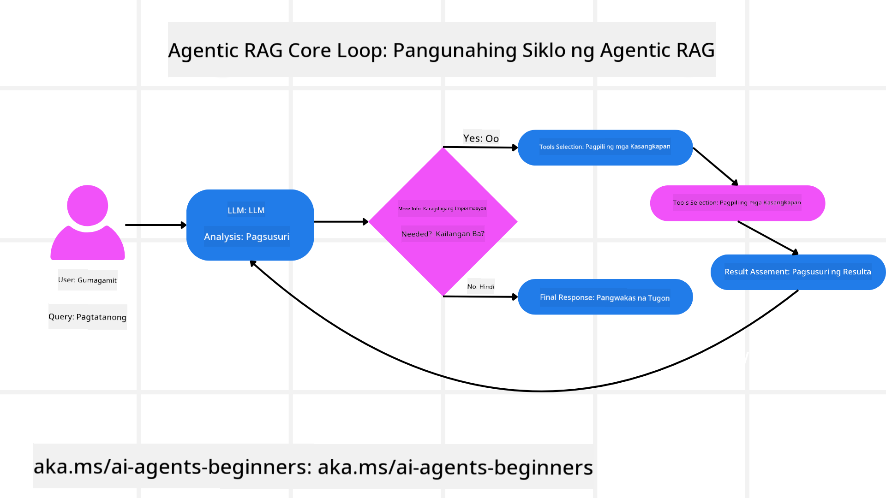
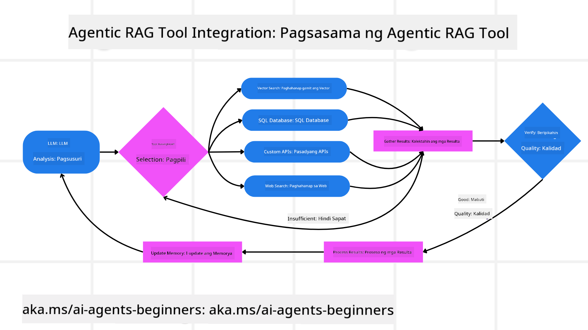
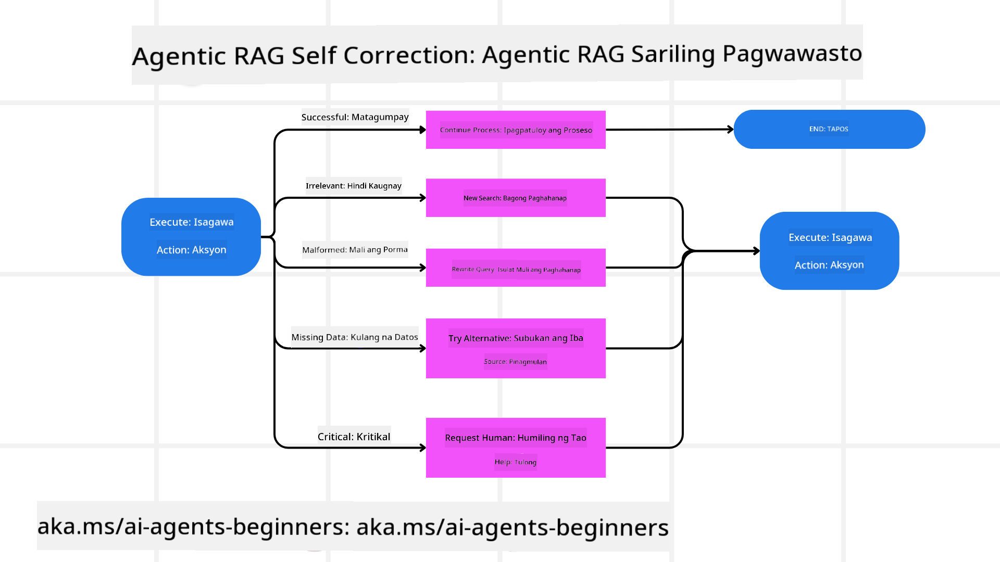

<!--
CO_OP_TRANSLATOR_METADATA:
{
  "original_hash": "7622aa72f9e676e593339f5f694ecd7d",
  "translation_date": "2025-07-12T10:09:17+00:00",
  "source_file": "05-agentic-rag/README.md",
  "language_code": "tl"
}
-->

> _(I-click ang larawan sa itaas para mapanood ang video ng araling ito)_

# Agentic RAG

Ang araling ito ay nagbibigay ng malawakang pangkalahatang-ideya tungkol sa Agentic Retrieval-Augmented Generation (Agentic RAG), isang bagong paradigma sa AI kung saan ang malalaking language model (LLMs) ay kusang nagpaplano ng kanilang mga susunod na hakbang habang kumukuha ng impormasyon mula sa mga panlabas na pinagkukunan. Hindi tulad ng mga static na retrieval-then-read na pattern, ang Agentic RAG ay gumagamit ng paulit-ulit na pagtawag sa LLM, na may kasamang mga tawag sa tool o function at mga istrukturadong output. Sinusuri ng sistema ang mga resulta, pinapino ang mga query, tumatawag ng karagdagang mga tool kung kinakailangan, at ipinagpapatuloy ang siklong ito hanggang makamit ang kasiya-siyang solusyon.

## Panimula

Tatalakayin sa araling ito ang mga sumusunod:

- **Unawain ang Agentic RAG:** Alamin ang bagong paradigma sa AI kung saan ang malalaking language model (LLMs) ay kusang nagpaplano ng kanilang mga susunod na hakbang habang kumukuha ng impormasyon mula sa mga panlabas na pinagkukunan ng datos.
- **Maunawaan ang Iterative Maker-Checker Style:** Intindihin ang siklo ng paulit-ulit na pagtawag sa LLM, na may kasamang mga tawag sa tool o function at mga istrukturadong output, na idinisenyo upang mapabuti ang katumpakan at matugunan ang mga maling query.
- **Suriin ang Mga Praktikal na Aplikasyon:** Tukuyin ang mga sitwasyon kung saan namumukod-tangi ang Agentic RAG, tulad ng mga kapaligirang prayoridad ang katumpakan, kumplikadong interaksyon sa database, at pinalawig na mga workflow.

## Mga Layunin sa Pagkatuto

Pagkatapos makumpleto ang araling ito, malalaman mo kung paano/unawain ang mga sumusunod:

- **Pag-unawa sa Agentic RAG:** Alamin ang bagong paradigma sa AI kung saan ang malalaking language model (LLMs) ay kusang nagpaplano ng kanilang mga susunod na hakbang habang kumukuha ng impormasyon mula sa mga panlabas na pinagkukunan ng datos.
- **Iterative Maker-Checker Style:** Maunawaan ang konsepto ng siklo ng paulit-ulit na pagtawag sa LLM, na may kasamang mga tawag sa tool o function at mga istrukturadong output, na idinisenyo upang mapabuti ang katumpakan at matugunan ang mga maling query.
- **Pagmamay-ari sa Proseso ng Pangangatwiran:** Intindihin ang kakayahan ng sistema na kontrolin ang sariling proseso ng pangangatwiran, na gumagawa ng mga desisyon kung paano haharapin ang mga problema nang hindi umaasa sa mga paunang itinakdang landas.
- **Workflow:** Unawain kung paano ang isang agentic na modelo ay kusang nagpapasya na kumuha ng mga ulat tungkol sa mga uso sa merkado, tukuyin ang datos ng mga kakumpitensya, iugnay ang mga panloob na sukatan ng benta, pagsamahin ang mga natuklasan, at suriin ang estratehiya.
- **Iterative Loops, Integrasyon ng Tool, at Memorya:** Alamin ang tungkol sa pag-asa ng sistema sa isang paulit-ulit na pattern ng interaksyon, pagpapanatili ng estado at memorya sa bawat hakbang upang maiwasan ang paulit-ulit na siklo at makagawa ng mas maalam na mga desisyon.
- **Pagtugon sa Mga Failure Mode at Pagwawasto sa Sarili:** Suriin ang matibay na mekanismo ng pagwawasto sa sarili ng sistema, kabilang ang pag-uulit at muling pagtatanong, paggamit ng mga diagnostic tool, at pagbalik sa pangangasiwa ng tao.
- **Mga Hangganan ng Ahensya:** Unawain ang mga limitasyon ng Agentic RAG, na nakatuon sa domain-specific autonomy, pag-asa sa imprastruktura, at paggalang sa mga guardrail.
- **Mga Praktikal na Gamit at Halaga:** Tukuyin ang mga sitwasyon kung saan namumukod-tangi ang Agentic RAG, tulad ng mga kapaligirang prayoridad ang katumpakan, kumplikadong interaksyon sa database, at pinalawig na mga workflow.
- **Pamamahala, Transparency, at Tiwala:** Alamin ang kahalagahan ng pamamahala at transparency, kabilang ang maipaliwanag na pangangatwiran, kontrol sa bias, at pangangasiwa ng tao.

## Ano ang Agentic RAG?

Ang Agentic Retrieval-Augmented Generation (Agentic RAG) ay isang bagong paradigma sa AI kung saan ang malalaking language model (LLMs) ay kusang nagpaplano ng kanilang mga susunod na hakbang habang kumukuha ng impormasyon mula sa mga panlabas na pinagkukunan. Hindi tulad ng mga static na retrieval-then-read na pattern, ang Agentic RAG ay gumagamit ng paulit-ulit na pagtawag sa LLM, na may kasamang mga tawag sa tool o function at mga istrukturadong output. Sinusuri ng sistema ang mga resulta, pinapino ang mga query, tumatawag ng karagdagang mga tool kung kinakailangan, at ipinagpapatuloy ang siklong ito hanggang makamit ang kasiya-siyang solusyon. Ang paulit-ulit na “maker-checker” na estilo na ito ay nagpapabuti sa katumpakan, tumutugon sa mga maling query, at nagsisiguro ng mataas na kalidad ng mga resulta.

Aktibong kinokontrol ng sistema ang sariling proseso ng pangangatwiran, nire-rewrite ang mga nabigong query, pumipili ng iba't ibang paraan ng retrieval, at nagsasama ng maraming tool—tulad ng vector search sa Azure AI Search, mga SQL database, o custom na API—bago tapusin ang sagot. Ang natatanging katangian ng isang agentic na sistema ay ang kakayahan nitong kontrolin ang sariling proseso ng pangangatwiran. Ang mga tradisyunal na implementasyon ng RAG ay umaasa sa mga paunang itinakdang landas, ngunit ang isang agentic na sistema ay kusang nagpapasya sa pagkakasunod-sunod ng mga hakbang batay sa kalidad ng impormasyong natagpuan nito.

## Pagpapakahulugan sa Agentic Retrieval-Augmented Generation (Agentic RAG)

Ang Agentic Retrieval-Augmented Generation (Agentic RAG) ay isang bagong paradigma sa pag-unlad ng AI kung saan ang LLMs ay hindi lamang kumukuha ng impormasyon mula sa mga panlabas na pinagkukunan ng datos kundi kusang nagpaplano rin ng kanilang mga susunod na hakbang. Hindi tulad ng mga static na retrieval-then-read na pattern o maingat na isinulat na mga prompt sequence, ang Agentic RAG ay gumagamit ng siklo ng paulit-ulit na pagtawag sa LLM, na may kasamang mga tawag sa tool o function at mga istrukturadong output. Sa bawat hakbang, sinusuri ng sistema ang mga resulta na nakuha nito, nagpapasya kung kailangan pang pinuhin ang mga query, tumatawag ng karagdagang mga tool kung kinakailangan, at ipinagpapatuloy ang siklong ito hanggang makamit ang kasiya-siyang solusyon.

Ang paulit-ulit na “maker-checker” na estilo ng operasyon ay idinisenyo upang mapabuti ang katumpakan, tugunan ang mga maling query sa mga istrukturadong database (hal. NL2SQL), at matiyak ang balanseng, mataas na kalidad na mga resulta. Sa halip na umasa lamang sa maingat na inhenyeriyang mga prompt chain, aktibong kinokontrol ng sistema ang sariling proseso ng pangangatwiran. Maaari nitong i-rewrite ang mga query na nabigo, pumili ng iba't ibang paraan ng retrieval, at isama ang maraming tool—tulad ng vector search sa Azure AI Search, mga SQL database, o custom na API—bago tapusin ang sagot. Inaalis nito ang pangangailangan para sa masyadong komplikadong mga framework ng orchestration. Sa halip, isang medyo simpleng siklo ng “LLM call → tool use → LLM call → …” ang maaaring maghatid ng sopistikado at matibay na mga output.

## Pagmamay-ari sa Proseso ng Pangangatwiran

Ang natatanging katangian na nagpapakilala sa isang sistema bilang “agentic” ay ang kakayahan nitong kontrolin ang sariling proseso ng pangangatwiran. Kadalasang umaasa ang mga tradisyunal na implementasyon ng RAG sa mga tao na magtakda ng landas para sa modelo: isang chain-of-thought na naglalahad kung ano ang kukunin at kailan.
Ngunit kapag tunay na agentic ang isang sistema, ito ay kusang nagpapasya kung paano haharapin ang problema. Hindi lang ito sumusunod sa isang script; kusang tinutukoy nito ang pagkakasunod-sunod ng mga hakbang batay sa kalidad ng impormasyong natagpuan nito.
Halimbawa, kung hihilingin itong gumawa ng estratehiya para sa paglulunsad ng produkto, hindi ito umaasa lamang sa isang prompt na naglalahad ng buong proseso ng pananaliksik at paggawa ng desisyon. Sa halip, ang agentic na modelo ay kusang nagpapasya na:

1. Kumuha ng mga kasalukuyang ulat tungkol sa mga uso sa merkado gamit ang Bing Web Grounding
2. Tukuyin ang mga kaugnay na datos ng kakumpitensya gamit ang Azure AI Search.
3. Iugnay ang mga historikal na panloob na sukatan ng benta gamit ang Azure SQL Database.
4. Pagsamahin ang mga natuklasan sa isang magkakaugnay na estratehiya na pinamamahalaan sa pamamagitan ng Azure OpenAI Service.
5. Suriin ang estratehiya para sa mga puwang o hindi pagkakatugma, at magpatuloy sa isa pang siklo ng retrieval kung kinakailangan.
Lahat ng mga hakbang na ito—pagpino ng mga query, pagpili ng mga pinagkukunan, pag-uulit hanggang sa maging “kontento” sa sagot—ay pinapasiya ng modelo, hindi isinulat nang pauna ng tao.

## Iterative Loops, Integrasyon ng Tool, at Memorya

Ang isang agentic na sistema ay umaasa sa isang paulit-ulit na pattern ng interaksyon:

- **Paunang Tawag:** Ipinapasa ang layunin ng gumagamit (aka. user prompt) sa LLM.
- **Pagtawag sa Tool:** Kung natukoy ng modelo na may kulang na impormasyon o malabong mga tagubilin, pipili ito ng tool o paraan ng retrieval—tulad ng vector database query (hal. Azure AI Search Hybrid search sa pribadong datos) o isang istrukturadong SQL call—upang makakuha ng karagdagang konteksto.
- **Pagsusuri at Pagpino:** Pagkatapos suriin ang ibinalik na datos, nagpapasya ang modelo kung sapat na ang impormasyon. Kung hindi, pinapino nito ang query, sumusubok ng ibang tool, o inaayos ang pamamaraan.
- **Ulitin Hanggang Maging Kontento:** Ipinagpapatuloy ang siklong ito hanggang matukoy ng modelo na mayroon na itong sapat na kalinawan at ebidensya upang magbigay ng pinal na, maayos na pangangatwirang sagot.
- **Memorya at Estado:** Dahil pinananatili ng sistema ang estado at memorya sa bawat hakbang, naaalala nito ang mga naunang pagtatangka at resulta, iniiwasan ang paulit-ulit na siklo, at gumagawa ng mas maalam na mga desisyon habang nagpapatuloy.

Sa paglipas ng panahon, lumilikha ito ng pakiramdam ng umuunlad na pag-unawa, na nagpapahintulot sa modelo na mag-navigate sa mga kumplikadong gawain na may maraming hakbang nang hindi kinakailangang palaging makialam ang tao o baguhin ang prompt.

## Pagtugon sa Mga Failure Mode at Pagwawasto sa Sarili

Kasama rin sa awtonomiya ng Agentic RAG ang matibay na mga mekanismo ng pagwawasto sa sarili. Kapag naabot ng sistema ang mga dead end—tulad ng pagkuha ng mga hindi kaugnay na dokumento o pagharap sa mga maling query—maaari nitong gawin ang mga sumusunod:

- **Pag-uulit at Muling Pagtatanong:** Sa halip na magbalik ng mababang halaga ng mga sagot, sinusubukan ng modelo ang mga bagong estratehiya sa paghahanap, nire-rewrite ang mga query sa database, o tinitingnan ang mga alternatibong set ng datos.
- **Paggamit ng Mga Diagnostic Tool:** Maaaring tumawag ang sistema ng karagdagang mga function na idinisenyo upang tulungan itong i-debug ang mga hakbang ng pangangatwiran o kumpirmahin ang katumpakan ng nakuha nitong datos. Mahalaga ang mga tool tulad ng Azure AI Tracing upang mapadali ang matibay na obserbabilidad at pagmamanman.
- **Pagbalik sa Pangangasiwa ng Tao:** Para sa mga sensitibo o paulit-ulit na nabibigo na mga sitwasyon, maaaring mag-flag ang modelo ng kawalang-katiyakan at humiling ng gabay mula sa tao. Kapag nagbigay ang tao ng corrective feedback, maaaring isama ng modelo ang aral na iyon sa mga susunod na hakbang.

Ang paulit-ulit at dinamiko na pamamaraang ito ay nagpapahintulot sa modelo na patuloy na umunlad, na tinitiyak na hindi ito isang one-shot na sistema lamang kundi isang sistema na natututo mula sa mga pagkakamali sa loob ng isang session.

## Mga Hangganan ng Ahensya

Sa kabila ng awtonomiya nito sa loob ng isang gawain, ang Agentic RAG ay hindi katulad ng Artificial General Intelligence. Ang mga “agentic” na kakayahan nito ay limitado sa mga tool, pinagkukunan ng datos, at mga patakaran na ibinigay ng mga developer na tao. Hindi nito kayang imbentuhin ang sarili nitong mga tool o lumabas sa mga hangganan ng domain na itinakda. Sa halip, mahusay ito sa dinamiko at mahusay na pag-oorganisa ng mga mapagkukunan na nasa kamay.
Ang mga pangunahing pagkakaiba mula sa mas advanced na anyo ng AI ay kinabibilangan ng:

1. **Domain-Specific Autonomy:** Nakatuon ang mga Agentic RAG system sa pagtamo ng mga layuning itinakda ng gumagamit sa loob ng kilalang domain, gamit ang mga estratehiya tulad ng pag-rewrite ng query o pagpili ng tool upang mapabuti ang mga resulta.
2. **Pag-asa sa Imprastruktura:** Nakadepende ang kakayahan ng sistema sa mga tool at datos na isinama ng mga developer. Hindi nito kayang lampasan ang mga hangganang ito nang walang interbensyon ng tao.
3. **Paggalang sa Guardrails:** Mahalaga pa rin ang mga etikal na gabay, mga patakaran sa pagsunod, at mga polisiya sa negosyo. Ang kalayaan ng ahente ay palaging nililimitahan ng mga panukalang pangkaligtasan at mga mekanismo ng pangangasiwa (sana).

## Mga Praktikal na Gamit at Halaga

Namumukod-tangi ang Agentic RAG sa mga sitwasyong nangangailangan ng paulit-ulit na pagpino at katumpakan:

1. **Mga Kapaligirang Prayoridad ang Katumpakan:** Sa mga pagsusuri ng pagsunod, regulasyon, o pananaliksik sa batas, maaaring paulit-ulit na beripikahin ng agentic na modelo ang mga katotohanan, kumonsulta sa maraming pinagkukunan, at i-rewrite ang mga query hanggang makabuo ng lubos na nasuring sagot.
2. **Kumplikadong Interaksyon sa Database:** Kapag humaharap sa mga istrukturadong datos kung saan madalas mabigo o kailangang ayusin ang mga query, maaaring kusang pinuhin ng sistema ang mga query gamit ang Azure SQL o Microsoft Fabric OneLake, na tinitiyak na ang huling retrieval ay naaayon sa intensyon ng gumagamit.
3. **Pinalawig na Workflow:** Ang mga mas mahabang session ay maaaring umunlad habang lumalabas ang bagong impormasyon. Patuloy na maisasama ng Agentic RAG ang bagong datos, binabago ang mga estratehiya habang natututo pa tungkol sa problema.

## Pamamahala, Transparency, at Tiwala

Habang nagiging mas awtonomo ang mga sistemang ito sa kanilang pangangatwiran, mahalaga ang pamamahala at transparency:

- **Maipaliwanag na Pangangatwiran:** Maaaring magbigay ang modelo ng audit trail ng mga query na ginawa nito, mga pinagkunan na kinonsulta, at mga hakbang ng pangangatwiran na ginawa upang marating ang konklusyon. Makakatulong ang mga tool tulad ng Azure AI Content Safety at Azure AI Tracing / GenAIOps upang mapanatili ang transparency at mabawasan ang panganib.
- **Kontrol sa Bias at Balanseng Retrieval:** Maaaring i-tune ng mga developer ang mga estratehiya sa retrieval upang matiyak na balanseng, kinatawan ang mga pinagkukunan ng datos, at regular na i-audit ang mga output upang matukoy ang bias o skewed na pattern gamit ang mga custom na modelo para sa mga advanced na organisasyon sa data science gamit ang Azure Machine Learning.
- **Pangangasiwa ng Tao at Pagsunod:** Para sa mga sensitibong gawain, mahalaga pa rin ang pagsusuri ng tao. Hindi pinapalitan ng Agentic RAG ang paghuhusga ng tao sa mga desisyong may mataas na panganib—pinapalakas nito iyon sa pamamagitan ng paghahatid ng mas lubos na nasuring mga opsyon.

Mahalaga ang pagkakaroon ng mga tool na nagbibigay ng malinaw na talaan ng mga aksyon. Kung wala ito, magiging napakahirap i-debug ang isang multi-step na proseso. Tingnan ang

- <a href="https://learn.microsoft.com/azure/ai-studio/concepts/evaluation-approach-gen-ai" target="_blank">Pagsusuri ng mga generative AI application gamit ang Azure AI Foundry: Tinalakay sa artikulong ito ang pagsusuri at paghahambing ng mga modelo gamit ang mga pampublikong dataset, kabilang ang Agentic AI application at RAG architectures</a>
- <a href="https://weaviate.io/blog/what-is-agentic-rag" target="_blank">Ano ang Agentic RAG | Weaviate</a>
- <a href="https://ragaboutit.com/agentic-rag-a-complete-guide-to-agent-based-retrieval-augmented-generation/" target="_blank">Agentic RAG: Kumpletong Gabay sa Agent-Based Retrieval Augmented Generation – Balita mula sa generation RAG</a>
- <a href="https://huggingface.co/learn/cookbook/agent_rag" target="_blank">Agentic RAG: paspasan ang iyong RAG gamit ang query reformulation at self-query! Hugging Face Open-Source AI Cookbook</a>
- <a href="https://youtu.be/aQ4yQXeB1Ss?si=2HUqBzHoeB5tR04U" target="_blank">Pagdaragdag ng Agentic Layers sa RAG</a>
- <a href="https://www.youtube.com/watch?v=zeAyuLc_f3Q&t=244s" target="_blank">Ang Kinabukasan ng Knowledge Assistants: Jerry Liu</a>
- <a href="https://www.youtube.com/watch?v=AOSjiXP1jmQ" target="_blank">Paano Gumawa ng Agentic RAG Systems</a>
- <a href="https://ignite.microsoft.com/sessions/BRK102?source=sessions" target="_blank">Paggamit ng Azure AI Foundry Agent Service para palawakin ang iyong AI agents</a>

### Mga Akademikong Papel

- <a href="https://arxiv.org/abs/2303.17651" target="_blank">2303.17651 Self-Refine: Paulit-ulit na Pagpapahusay gamit ang Self-Feedback</a>
- <a href="https://arxiv.org/abs/2303.11366" target="_blank">2303.11366 Reflexion: Language Agents na may Verbal Reinforcement Learning</a>
- <a href="https://arxiv.org/abs/2305.11738" target="_blank">2305.11738 CRITIC: Malalaking Language Models na Kayang Mag-Self-Correct gamit ang Tool-Interactive Critiquing</a>
- <a href="https://arxiv.org/abs/2501.09136" target="_blank">2501.09136 Agentic Retrieval-Augmented Generation: Isang Survey tungkol sa Agentic RAG</a>

## Nakaraang Aralin

[Tool Use Design Pattern](../04-tool-use/README.md)

## Susunod na Aralin

[Pagbuo ng Mapagkakatiwalaang AI Agents](../06-building-trustworthy-agents/README.md)

**Paalala**:  
Ang dokumentong ito ay isinalin gamit ang AI translation service na [Co-op Translator](https://github.com/Azure/co-op-translator). Bagamat nagsusumikap kami para sa katumpakan, pakatandaan na ang mga awtomatikong pagsasalin ay maaaring maglaman ng mga pagkakamali o di-tumpak na impormasyon. Ang orihinal na dokumento sa orihinal nitong wika ang dapat ituring na pangunahing sanggunian. Para sa mahahalagang impormasyon, inirerekomenda ang propesyonal na pagsasalin ng tao. Hindi kami mananagot sa anumang hindi pagkakaunawaan o maling interpretasyon na maaaring magmula sa paggamit ng pagsasaling ito.