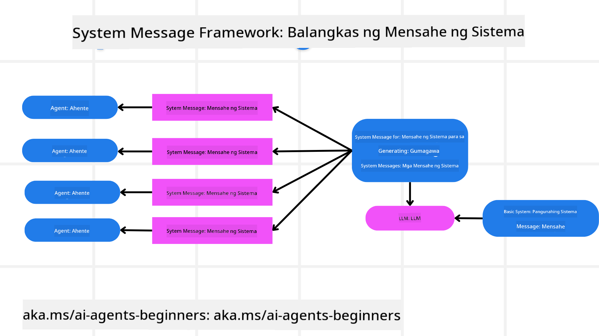
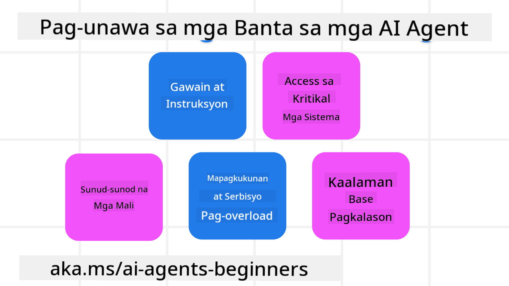
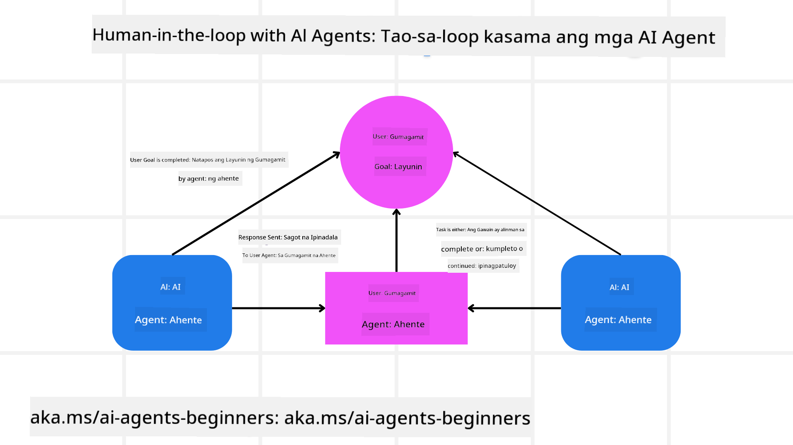

<!--
CO_OP_TRANSLATOR_METADATA:
{
  "original_hash": "f57852cac3a86c4a5ef47f793cc12178",
  "translation_date": "2025-07-12T10:30:34+00:00",
  "source_file": "06-building-trustworthy-agents/README.md",
  "language_code": "tl"
}
-->
[](https://youtu.be/iZKkMEGBCUQ?si=Q-kEbcyHUMPoHp8L)

> _(I-click ang larawan sa itaas para panoorin ang video ng araling ito)_

# Paggawa ng Mapagkakatiwalaang AI Agents

## Panimula

Tatalakayin sa araling ito ang:

- Paano bumuo at mag-deploy ng ligtas at epektibong AI Agents
- Mahahalagang konsiderasyon sa seguridad kapag nagde-develop ng AI Agents
- Paano mapanatili ang privacy ng data at ng gumagamit sa pagbuo ng AI Agents

## Mga Layunin sa Pagkatuto

Pagkatapos makumpleto ang araling ito, malalaman mo kung paano:

- Tukuyin at bawasan ang mga panganib sa paggawa ng AI Agents
- Magpatupad ng mga hakbang sa seguridad upang matiyak na maayos ang pamamahala ng data at access
- Gumawa ng AI Agents na nagpoprotekta sa privacy ng data at nagbibigay ng magandang karanasan sa gumagamit

## Kaligtasan

Unahin nating tingnan ang paggawa ng ligtas na mga agentic application. Ang kaligtasan ay nangangahulugan na gumagana ang AI agent ayon sa disenyo. Bilang mga tagabuo ng agentic applications, mayroon tayong mga pamamaraan at kasangkapan upang mapataas ang kaligtasan:

### Paggawa ng System Message Framework

Kung nakagawa ka na ng AI application gamit ang Large Language Models (LLMs), alam mo ang kahalagahan ng pagdisenyo ng matibay na system prompt o system message. Ang mga prompt na ito ang nagtatakda ng mga meta rules, mga tagubilin, at mga gabay kung paano makikipag-ugnayan ang LLM sa gumagamit at sa data.

Para sa AI Agents, mas mahalaga ang system prompt dahil kailangan nila ng napaka-tiyak na mga tagubilin upang matapos ang mga gawain na idinisenyo para sa kanila.

Para makagawa ng scalable na system prompts, maaari tayong gumamit ng system message framework para makabuo ng isa o higit pang mga agent sa ating application:



#### Hakbang 1: Gumawa ng Meta System Message

Ang meta prompt ay gagamitin ng LLM upang gumawa ng mga system prompts para sa mga agent na ating bubuuin. Dinisenyo ito bilang template upang madali tayong makagawa ng maraming agent kung kinakailangan.

Narito ang halimbawa ng meta system message na ibibigay natin sa LLM:

```plaintext
You are an expert at creating AI agent assistants. 
You will be provided a company name, role, responsibilities and other
information that you will use to provide a system prompt for.
To create the system prompt, be descriptive as possible and provide a structure that a system using an LLM can better understand the role and responsibilities of the AI assistant. 
```

#### Hakbang 2: Gumawa ng basic prompt

Susunod na hakbang ay gumawa ng basic prompt para ilarawan ang AI Agent. Dapat mong isama ang papel ng agent, ang mga gawain na gagawin nito, at iba pang responsibilidad ng agent.

Narito ang halimbawa:

```plaintext
You are a travel agent for Contoso Travel that is great at booking flights for customers. To help customers you can perform the following tasks: lookup available flights, book flights, ask for preferences in seating and times for flights, cancel any previously booked flights and alert customers on any delays or cancellations of flights.  
```

#### Hakbang 3: Ibigay ang Basic System Message sa LLM

Ngayon ay maaari nating i-optimize ang system message na ito sa pamamagitan ng pagbibigay ng meta system message bilang system message kasama ang ating basic system message.

Magbibigay ito ng system message na mas mahusay ang disenyo para gabayan ang ating AI agents:

```markdown
**Company Name:** Contoso Travel  
**Role:** Travel Agent Assistant

**Objective:**  
You are an AI-powered travel agent assistant for Contoso Travel, specializing in booking flights and providing exceptional customer service. Your main goal is to assist customers in finding, booking, and managing their flights, all while ensuring that their preferences and needs are met efficiently.

**Key Responsibilities:**

1. **Flight Lookup:**
    
    - Assist customers in searching for available flights based on their specified destination, dates, and any other relevant preferences.
    - Provide a list of options, including flight times, airlines, layovers, and pricing.
2. **Flight Booking:**
    
    - Facilitate the booking of flights for customers, ensuring that all details are correctly entered into the system.
    - Confirm bookings and provide customers with their itinerary, including confirmation numbers and any other pertinent information.
3. **Customer Preference Inquiry:**
    
    - Actively ask customers for their preferences regarding seating (e.g., aisle, window, extra legroom) and preferred times for flights (e.g., morning, afternoon, evening).
    - Record these preferences for future reference and tailor suggestions accordingly.
4. **Flight Cancellation:**
    
    - Assist customers in canceling previously booked flights if needed, following company policies and procedures.
    - Notify customers of any necessary refunds or additional steps that may be required for cancellations.
5. **Flight Monitoring:**
    
    - Monitor the status of booked flights and alert customers in real-time about any delays, cancellations, or changes to their flight schedule.
    - Provide updates through preferred communication channels (e.g., email, SMS) as needed.

**Tone and Style:**

- Maintain a friendly, professional, and approachable demeanor in all interactions with customers.
- Ensure that all communication is clear, informative, and tailored to the customer's specific needs and inquiries.

**User Interaction Instructions:**

- Respond to customer queries promptly and accurately.
- Use a conversational style while ensuring professionalism.
- Prioritize customer satisfaction by being attentive, empathetic, and proactive in all assistance provided.

**Additional Notes:**

- Stay updated on any changes to airline policies, travel restrictions, and other relevant information that could impact flight bookings and customer experience.
- Use clear and concise language to explain options and processes, avoiding jargon where possible for better customer understanding.

This AI assistant is designed to streamline the flight booking process for customers of Contoso Travel, ensuring that all their travel needs are met efficiently and effectively.

```

#### Hakbang 4: Ulitin at Pagbutihin

Ang halaga ng system message framework na ito ay para mapadali ang paggawa ng system messages mula sa maraming agent at mapabuti ang mga system messages sa paglipas ng panahon. Bihira na ang system message ay gumana agad sa unang subok para sa buong gamit mo. Ang kakayahang gumawa ng maliliit na pagbabago at pagbuti sa pamamagitan ng pagpapalit ng basic system message at pagpapatakbo nito sa system ay magbibigay-daan sa iyo na ikumpara at suriin ang mga resulta.

## Pag-unawa sa mga Banta

Para makabuo ng mapagkakatiwalaang AI agents, mahalagang maunawaan at mabawasan ang mga panganib at banta sa iyong AI agent. Tingnan natin ang ilan sa mga iba't ibang banta sa AI agents at kung paano ka makakapaghanda at makakapagplano nang mas maayos para dito.



### Gawain at Tagubilin

**Paglalarawan:** Sinusubukan ng mga umaatake na baguhin ang mga tagubilin o layunin ng AI agent sa pamamagitan ng prompting o pagmamanipula ng mga input.

**Pagsugpo:** Isagawa ang mga validation check at input filter upang matukoy ang mga posibleng mapanganib na prompt bago ito maproseso ng AI Agent. Dahil karaniwang nangangailangan ng madalas na interaksyon sa Agent ang mga atakeng ito, ang paglilimita sa bilang ng mga turn sa pag-uusap ay isa pang paraan upang maiwasan ang ganitong uri ng atake.

### Access sa Mahahalagang Sistema

**Paglalarawan:** Kung ang AI agent ay may access sa mga sistema at serbisyo na nag-iimbak ng sensitibong data, maaaring ma-kompromiso ng mga umaatake ang komunikasyon sa pagitan ng agent at ng mga serbisyong ito. Maaari itong maging direktang atake o di-tuwirang pagtatangkang makakuha ng impormasyon tungkol sa mga sistemang ito sa pamamagitan ng agent.

**Pagsugpo:** Dapat limitado lamang ang access ng AI agents sa mga sistema batay sa pangangailangan upang maiwasan ang ganitong uri ng atake. Dapat din na ligtas ang komunikasyon sa pagitan ng agent at sistema. Ang pagpapatupad ng authentication at access control ay isa pang paraan upang maprotektahan ang impormasyong ito.

### Pag-overload ng Resource at Serbisyo

**Paglalarawan:** Maaaring gumamit ang AI agents ng iba't ibang kasangkapan at serbisyo upang matapos ang mga gawain. Maaaring gamitin ng mga umaatake ang kakayahang ito upang atakihin ang mga serbisyong ito sa pamamagitan ng pagpapadala ng maraming kahilingan sa AI Agent, na maaaring magdulot ng pagkasira ng sistema o mataas na gastos.

**Pagsugpo:** Magpatupad ng mga patakaran upang limitahan ang bilang ng mga kahilingan na maaaring gawin ng AI agent sa isang serbisyo. Ang paglilimita sa bilang ng mga turn sa pag-uusap at mga kahilingan sa iyong AI agent ay isa pang paraan upang maiwasan ang ganitong uri ng atake.

### Pagkalason sa Knowledge Base

**Paglalarawan:** Ang ganitong uri ng atake ay hindi direktang tinatarget ang AI agent kundi ang knowledge base at iba pang serbisyo na gagamitin ng AI agent. Maaaring kabilang dito ang pagkasira ng data o impormasyon na gagamitin ng AI agent upang matapos ang isang gawain, na nagreresulta sa bias o hindi inaasahang tugon sa gumagamit.

**Pagsugpo:** Magsagawa ng regular na beripikasyon ng data na gagamitin ng AI agent sa mga workflow nito. Siguraduhing ligtas ang access sa data na ito at tanging mga pinagkakatiwalaang tao lamang ang maaaring magbago nito upang maiwasan ang ganitong uri ng atake.

### Sunud-sunod na Mali

**Paglalarawan:** Gumagamit ang AI agents ng iba't ibang kasangkapan at serbisyo upang matapos ang mga gawain. Ang mga error na sanhi ng mga umaatake ay maaaring magdulot ng pagkasira ng iba pang mga sistema na konektado sa AI agent, na nagpapalawak ng epekto ng atake at nagpapahirap sa pag-troubleshoot.

**Pagsugpo:** Isang paraan upang maiwasan ito ay ang pagpapatakbo ng AI Agent sa isang limitadong kapaligiran, tulad ng paggawa ng mga gawain sa loob ng Docker container, upang maiwasan ang direktang atake sa sistema. Ang paggawa ng fallback mechanisms at retry logic kapag may mga sistema na nagbigay ng error ay isa pang paraan upang maiwasan ang mas malawak na pagkasira ng sistema.

## Human-in-the-Loop

Isa pang epektibong paraan upang makabuo ng mapagkakatiwalaang AI Agent system ay ang paggamit ng Human-in-the-loop. Lumilikha ito ng daloy kung saan ang mga gumagamit ay maaaring magbigay ng feedback sa mga Agent habang tumatakbo ang proseso. Ang mga gumagamit ay kumikilos bilang mga agent sa isang multi-agent system sa pamamagitan ng pagbibigay ng pag-apruba o pagtigil sa tumatakbong proseso.



Narito ang isang code snippet gamit ang AutoGen upang ipakita kung paano ipinatutupad ang konseptong ito:

```python

# Create the agents.
model_client = OpenAIChatCompletionClient(model="gpt-4o-mini")
assistant = AssistantAgent("assistant", model_client=model_client)
user_proxy = UserProxyAgent("user_proxy", input_func=input)  # Use input() to get user input from console.

# Create the termination condition which will end the conversation when the user says "APPROVE".
termination = TextMentionTermination("APPROVE")

# Create the team.
team = RoundRobinGroupChat([assistant, user_proxy], termination_condition=termination)

# Run the conversation and stream to the console.
stream = team.run_stream(task="Write a 4-line poem about the ocean.")
# Use asyncio.run(...) when running in a script.
await Console(stream)

```

## Konklusyon

Ang paggawa ng mapagkakatiwalaang AI agents ay nangangailangan ng maingat na disenyo, matibay na mga hakbang sa seguridad, at tuloy-tuloy na pag-uulit. Sa pamamagitan ng pagpapatupad ng mga istrukturadong meta prompting system, pag-unawa sa mga posibleng banta, at paggamit ng mga estratehiya sa pagsugpo, makakalikha ang mga developer ng AI agents na ligtas at epektibo. Bukod dito, ang pagsasama ng human-in-the-loop na pamamaraan ay nagsisiguro na ang mga AI agents ay nananatiling nakaayon sa pangangailangan ng gumagamit habang binabawasan ang mga panganib. Habang patuloy na umuunlad ang AI, ang pagpapanatili ng maagap na pananaw sa seguridad, privacy, at mga etikal na konsiderasyon ay magiging susi sa pagtibay ng tiwala at pagiging maaasahan ng mga AI-driven na sistema.

## Karagdagang Mga Mapagkukunan

- <a href="https://learn.microsoft.com/azure/ai-studio/responsible-use-of-ai-overview" target="_blank">Responsible AI overview</a>
- <a href="https://learn.microsoft.com/azure/ai-studio/concepts/evaluation-approach-gen-ai" target="_blank">Evaluation of generative AI models and AI applications</a>
- <a href="https://learn.microsoft.com/azure/ai-services/openai/concepts/system-message?context=%2Fazure%2Fai-studio%2Fcontext%2Fcontext&tabs=top-techniques" target="_blank">Safety system messages</a>
- <a href="https://blogs.microsoft.com/wp-content/uploads/prod/sites/5/2022/06/Microsoft-RAI-Impact-Assessment-Template.pdf?culture=en-us&country=us" target="_blank">Risk Assessment Template</a>

## Nakaraang Aralin

[Agentic RAG](../05-agentic-rag/README.md)

## Susunod na Aralin

[Planning Design Pattern](../07-planning-design/README.md)

**Paalala**:  
Ang dokumentong ito ay isinalin gamit ang AI translation service na [Co-op Translator](https://github.com/Azure/co-op-translator). Bagamat nagsusumikap kami para sa katumpakan, pakatandaan na ang mga awtomatikong pagsasalin ay maaaring maglaman ng mga pagkakamali o di-tumpak na impormasyon. Ang orihinal na dokumento sa kanyang sariling wika ang dapat ituring na pangunahing sanggunian. Para sa mahahalagang impormasyon, inirerekomenda ang propesyonal na pagsasalin ng tao. Hindi kami mananagot sa anumang hindi pagkakaunawaan o maling interpretasyon na maaaring magmula sa paggamit ng pagsasaling ito.