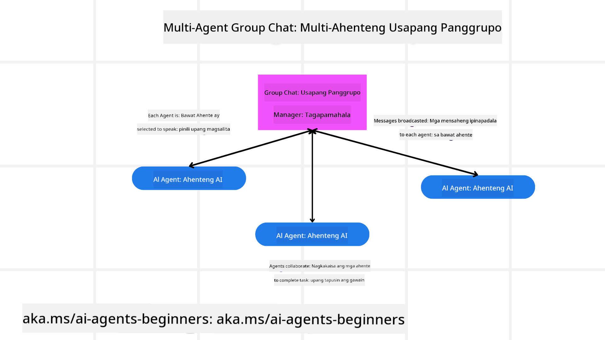
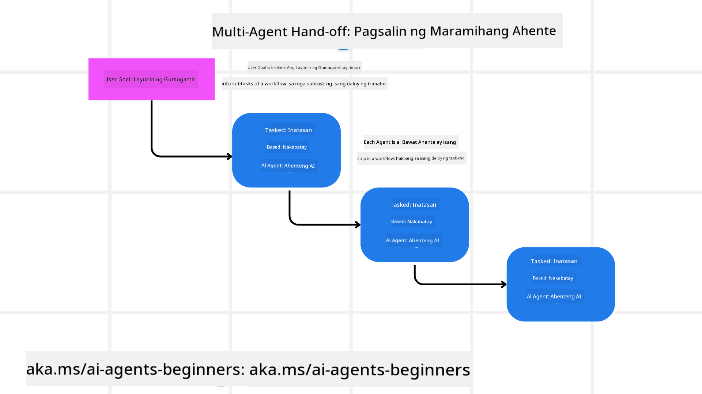

<!--
CO_OP_TRANSLATOR_METADATA:
{
  "original_hash": "c692a8975d7d5b99575a553de1c5e8a7",
  "translation_date": "2025-07-12T11:21:13+00:00",
  "source_file": "08-multi-agent/README.md",
  "language_code": "tl"
}
-->

> _(I-click ang larawan sa itaas upang panoorin ang video ng araling ito)_

# Mga disenyo ng multi-agent

Kapag nagsimula kang magtrabaho sa isang proyekto na may kasamang maraming agent, kailangan mong isaalang-alang ang multi-agent design pattern. Gayunpaman, maaaring hindi agad malinaw kung kailan dapat lumipat sa multi-agents at ano ang mga benepisyo nito.

## Panimula

Sa araling ito, susubukan nating sagutin ang mga sumusunod na tanong:

- Ano ang mga sitwasyon kung saan ang multi-agents ay angkop gamitin?
- Ano ang mga kalamangan ng paggamit ng multi-agents kumpara sa isang agent lang na gumagawa ng maraming gawain?
- Ano ang mga pangunahing bahagi sa pagpapatupad ng multi-agent design pattern?
- Paano natin makikita kung paano nagkaka-interact ang mga iba't ibang agent sa isa’t isa?

## Mga Layunin sa Pagkatuto

Pagkatapos ng araling ito, dapat mong magawa ang mga sumusunod:

- Matukoy ang mga sitwasyon kung saan ang multi-agents ay angkop gamitin
- Makilala ang mga kalamangan ng paggamit ng multi-agents kumpara sa isang agent lang.
- Maunawaan ang mga pangunahing bahagi sa pagpapatupad ng multi-agent design pattern.

Ano ang mas malawak na konteksto?

*Ang multi agents ay isang disenyo na nagpapahintulot sa maraming agent na magtulungan upang makamit ang isang pangkaraniwang layunin*.

Malawak itong ginagamit sa iba't ibang larangan, kabilang ang robotics, autonomous systems, at distributed computing.

## Mga Sitwasyon Kung Saan Angkop Gamitin Ang Multi-Agents

Ano nga ba ang mga sitwasyon na magandang gamitin ang multi-agents? Maraming sitwasyon kung saan kapaki-pakinabang ang paggamit ng maraming agent, lalo na sa mga sumusunod:

- **Malalaking gawain**: Ang malalaking gawain ay maaaring hatiin sa mas maliliit na bahagi at ipamahagi sa iba't ibang agent, na nagpapahintulot sa sabayang pagproseso at mas mabilis na pagkumpleto. Halimbawa nito ay sa malawakang pagproseso ng datos.
- **Komplikadong gawain**: Tulad ng malalaking gawain, ang mga komplikadong gawain ay maaaring hatiin sa mas maliliit na subtasks at ipamahagi sa mga agent na may espesyalisasyon sa partikular na bahagi ng gawain. Halimbawa nito ay sa mga autonomous na sasakyan kung saan ang iba't ibang agent ay namamahala sa pag-navigate, pagtukoy ng mga hadlang, at komunikasyon sa ibang sasakyan.
- **Iba’t ibang espesyalisasyon**: Ang iba't ibang agent ay maaaring may kanya-kanyang espesyalisasyon, kaya mas epektibo nilang mahawakan ang iba't ibang aspeto ng gawain kumpara sa isang agent lang. Halimbawa nito ay sa healthcare kung saan ang mga agent ay maaaring mag-manage ng diagnostics, treatment plans, at monitoring ng pasyente.

## Mga Kalamangan ng Paggamit ng Multi-Agents Kumpara sa Isang Agent Lang

Maaaring gumana nang maayos ang isang agent para sa mga simpleng gawain, ngunit para sa mas komplikadong gawain, maraming benepisyo ang paggamit ng maraming agent:

- **Espesyalisasyon**: Ang bawat agent ay maaaring maging espesyalisado sa isang partikular na gawain. Kapag walang espesyalisasyon ang isang agent, maaaring malito ito sa mga komplikadong gawain at gawin ang hindi nito pinakamainam na trabaho.
- **Scalability**: Mas madali ang pagpapalawak ng sistema sa pamamagitan ng pagdagdag ng mga agent kaysa sa pagbibigay ng sobrang dami ng gawain sa isang agent lang.
- **Fault Tolerance**: Kapag may isang agent na nagka-problema, patuloy pa rin ang operasyon ng iba, kaya mas matatag ang sistema.

Halimbawa, mag-book tayo ng biyahe para sa isang user. Sa isang single agent system, kailangang hawakan ng isang agent ang lahat ng aspeto ng booking, mula sa paghahanap ng flights hanggang sa pag-book ng hotel at rental car. Para magawa ito, kailangang may kakayahan ang agent sa lahat ng ito, na maaaring magresulta sa isang komplikado at mahirap i-maintain na sistema. Sa multi-agent system naman, may mga agent na espesyalisado sa paghahanap ng flights, pag-book ng hotel, at pag-aasikaso ng rental cars. Ginagawa nitong mas modular, madaling i-maintain, at scalable ang sistema.

Ihambing ito sa isang travel bureau na pinapatakbo ng isang maliit na tindahan kumpara sa isang franchise. Sa maliit na tindahan, isang agent lang ang humahawak sa lahat ng aspeto ng booking, habang sa franchise, may iba't ibang agent na humahawak sa iba't ibang bahagi ng proseso.

## Mga Pangunahing Bahagi sa Pagpapatupad ng Multi-Agent Design Pattern

Bago mo maipatupad ang multi-agent design pattern, kailangan mong maunawaan ang mga pangunahing bahagi nito.

Gamitin natin muli ang halimbawa ng pag-book ng biyahe para sa isang user. Sa kasong ito, kabilang sa mga pangunahing bahagi ang:

- **Agent Communication**: Kailangang mag-communicate ang mga agent na naghahanap ng flights, nagbo-book ng hotel, at nag-aasikaso ng rental cars upang magbahagi ng impormasyon tungkol sa mga kagustuhan at limitasyon ng user. Kailangan mong tukuyin ang mga protocol at paraan ng komunikasyon. Halimbawa, kailangang makipag-ugnayan ang agent na naghahanap ng flights sa agent na nagbo-book ng hotel upang matiyak na pareho ang mga petsa ng booking. Ibig sabihin nito, kailangang magbahagi ang mga agent ng impormasyon tungkol sa mga petsa ng biyahe ng user, kaya kailangan mong tukuyin *kung aling mga agent ang magbabahagi ng impormasyon at paano nila ito gagawin*.
- **Coordination Mechanisms**: Kailangang mag-coordinate ang mga agent upang matiyak na natutugunan ang mga kagustuhan at limitasyon ng user. Halimbawa, maaaring gusto ng user na malapit ang hotel sa airport, habang ang rental cars ay available lang sa airport. Kaya kailangang mag-coordinate ang agent na nagbo-book ng hotel sa agent na nag-aasikaso ng rental cars upang matugunan ang mga ito. Kailangan mong tukuyin *paano nagko-coordinate ang mga agent sa kanilang mga aksyon*.
- **Agent Architecture**: Kailangang may internal na istruktura ang mga agent upang makagawa ng desisyon at matuto mula sa kanilang interaksyon sa user. Halimbawa, ang agent na naghahanap ng flights ay kailangang may kakayahang magdesisyon kung aling flights ang ire-rekomenda base sa mga nakaraang kagustuhan ng user. Kailangan mong tukuyin *paano gumagawa ng desisyon at natututo ang mga agent mula sa kanilang interaksyon sa user*. Halimbawa, maaaring gumamit ang flight agent ng machine learning model upang magrekomenda ng flights base sa mga nakaraang preference ng user.
- **Visibility into Multi-Agent Interactions**: Kailangan mong makita kung paano nagkaka-interact ang mga agent sa isa’t isa. Nangangahulugan ito na kailangan mong magkaroon ng mga tools at teknik para subaybayan ang mga aktibidad at interaksyon ng mga agent. Maaaring ito ay sa anyo ng logging at monitoring tools, visualization tools, at performance metrics.
- **Multi-Agent Patterns**: May iba't ibang pattern sa pagpapatupad ng multi-agent systems, tulad ng centralized, decentralized, at hybrid architectures. Kailangan mong piliin ang pattern na pinakaangkop sa iyong use case.
- **Human in the loop**: Kadalasan, may tao na kasali sa proseso at kailangan mong ituro sa mga agent kung kailan sila dapat humingi ng tulong o interbensyon mula sa tao. Halimbawa, kapag may user na humiling ng partikular na hotel o flight na hindi nirerekomenda ng mga agent, o kapag kailangan ng kumpirmasyon bago mag-book ng flight o hotel.

## Visibility sa Interaksyon ng Multi-Agent

Mahalaga na makita mo kung paano nagkaka-interact ang mga agent sa isa’t isa. Mahalaga ito para sa pag-debug, pag-optimize, at pagtitiyak ng kabuuang bisa ng sistema. Para magawa ito, kailangan mong magkaroon ng mga tools at teknik para subaybayan ang mga aktibidad at interaksyon ng mga agent. Maaaring ito ay sa anyo ng logging at monitoring tools, visualization tools, at performance metrics.

Halimbawa, sa kaso ng pag-book ng biyahe para sa user, maaari kang magkaroon ng dashboard na nagpapakita ng status ng bawat agent, mga kagustuhan at limitasyon ng user, at ang mga interaksyon sa pagitan ng mga agent. Ipinapakita ng dashboard ang mga petsa ng biyahe ng user, ang mga flight na nirerekomenda ng flight agent, ang mga hotel na nirerekomenda ng hotel agent, at ang mga rental car na nirerekomenda ng rental car agent. Nagbibigay ito ng malinaw na pananaw kung paano nagkaka-interact ang mga agent at kung natutugunan ba ang mga kagustuhan at limitasyon ng user.

Tingnan natin nang mas detalyado ang bawat aspeto.

- **Logging at Monitoring Tools**: Gusto mong magkaroon ng logging para sa bawat aksyon na ginagawa ng isang agent. Ang log entry ay maaaring maglaman ng impormasyon tungkol sa agent na gumawa ng aksyon, ang aksyon mismo, oras ng aksyon, at resulta ng aksyon. Magagamit ang impormasyong ito para sa pag-debug, pag-optimize, at iba pa.

- **Visualization Tools**: Makakatulong ang visualization tools upang makita ang interaksyon ng mga agent sa mas madaling maintindihang paraan. Halimbawa, maaari kang magkaroon ng graph na nagpapakita ng daloy ng impormasyon sa pagitan ng mga agent. Makakatulong ito upang matukoy ang mga bottleneck, hindi epektibong bahagi, at iba pang isyu sa sistema.

- **Performance Metrics**: Makakatulong ang performance metrics upang subaybayan ang bisa ng multi-agent system. Halimbawa, maaari mong subaybayan ang oras na ginugol sa pagkumpleto ng isang gawain, bilang ng mga gawain na natapos kada yunit ng oras, at ang katumpakan ng mga rekomendasyon ng mga agent. Makakatulong ito upang matukoy ang mga lugar na kailangang pagbutihin at i-optimize ang sistema.

## Mga Pattern ng Multi-Agent

Tingnan natin ang ilang konkretong pattern na maaaring gamitin sa paggawa ng multi-agent apps. Narito ang ilang mga pattern na kapaki-pakinabang:

### Group chat

Ang pattern na ito ay kapaki-pakinabang kapag gusto mong gumawa ng group chat application kung saan maraming agent ang maaaring mag-communicate sa isa’t isa. Karaniwang gamit nito ay para sa team collaboration, customer support, at social networking.

Sa pattern na ito, bawat agent ay kumakatawan sa isang user sa group chat, at nagpapalitan ng mga mensahe gamit ang messaging protocol. Maaaring magpadala ang mga agent ng mensahe sa group chat, tumanggap ng mensahe mula sa group chat, at tumugon sa mga mensahe mula sa ibang agent.

Maaaring ipatupad ito gamit ang centralized architecture kung saan lahat ng mensahe ay dumadaan sa isang central server, o decentralized architecture kung saan direktang nagpapalitan ng mensahe ang mga agent.

### Hand-off

Ang pattern na ito ay kapaki-pakinabang kapag gusto mong gumawa ng application kung saan maraming agent ang maaaring magpasa-pasa ng mga gawain sa isa’t isa.

Karaniwang gamit nito ay sa customer support, task management, at workflow automation.

Sa pattern na ito, bawat agent ay kumakatawan sa isang gawain o hakbang sa workflow, at maaaring ipasa ng mga agent ang mga gawain sa ibang agent base sa mga paunang itinakdang patakaran.

### Collaborative filtering

Ang pattern na ito ay kapaki-pakinabang kapag gusto mong gumawa ng application kung saan maraming agent ang nagtutulungan upang magbigay ng mga rekomendasyon sa mga user.

Bakit kailangan ng maraming agent na magtulungan? Dahil bawat agent ay maaaring may iba’t ibang espesyalisasyon at maaaring mag-ambag sa proseso ng rekomendasyon sa iba't ibang paraan.

Halimbawa, gusto ng user ng rekomendasyon sa pinakamagandang stock na bibilhin sa stock market.

- **Industry expert**: Isang agent ang maaaring eksperto sa isang partikular na industriya.
- **Technical analysis**: Isa pang agent ang maaaring eksperto sa technical analysis.
- **Fundamental analysis**: At isa pang agent ang maaaring eksperto sa fundamental analysis. Sa pagtutulungan, makakapagbigay sila ng mas kumpletong rekomendasyon sa user.

## Scenario: Proseso ng Refund

Isipin ang isang sitwasyon kung saan ang customer ay nag-aapply ng refund para sa isang produkto. Maraming agent ang maaaring kasali sa prosesong ito, ngunit hatiin natin ito sa mga agent na espesipiko para sa refund process at mga general agent na maaaring gamitin sa iba pang proseso.

**Mga agent na espesipiko para sa refund process**:

Narito ang ilang mga agent na maaaring kasali sa refund process:

- **Customer agent**: Kumakatawan sa customer at responsable sa pagsisimula ng refund process.
- **Seller agent**: Kumakatawan sa seller at responsable sa pagproseso ng refund.
- **Payment agent**: Kumakatawan sa proseso ng pagbabayad at responsable sa pag-refund ng bayad ng customer.
- **Resolution agent**: Kumakatawan sa proseso ng paglutas at responsable sa pagresolba ng anumang isyu na lumitaw sa refund process.
- **Compliance agent**: Kumakatawan sa proseso ng pagsunod sa regulasyon at responsable sa pagtitiyak na ang refund process ay sumusunod sa mga patakaran at regulasyon.

**Mga general agent**:

Maaaring gamitin ang mga agent na ito sa iba pang bahagi ng iyong negosyo.

- **Shipping agent**: Kumakatawan sa proseso ng pagpapadala at responsable sa pagpapadala ng produkto pabalik sa seller. Maaari itong gamitin sa refund process at sa pangkalahatang pagpapadala ng produkto mula sa isang pagbili.
- **Feedback agent**: Kumakatawan sa proseso ng pagkuha ng feedback at responsable sa pagkolekta ng feedback mula sa customer. Maaaring mangyari ito anumang oras, hindi lang sa refund process.
- **Escalation agent**: Kumakatawan sa proseso ng pag-escalate ng mga isyu sa mas mataas na antas ng suporta. Maaari itong gamitin sa anumang proseso kung saan kailangan ng pag-escalate ng isyu.
- **Notification agent**: Kumakatawan sa proseso ng pagpapadala ng mga abiso sa customer sa iba't ibang yugto ng refund process.
- **Analytics agent**: Kumakatawan sa proseso ng pagsusuri ng datos na may kaugnayan sa refund process.
- **Audit agent**: Kumakatawan sa proseso ng pag-audit at responsable sa pagtiyak na ang refund process ay isinasagawa nang tama.
- **Reporting agent**: Kumakatawan sa proseso ng paggawa ng mga ulat tungkol sa refund process.
- **Knowledge agent**: Kumakatawan sa proseso ng pagpapanatili ng knowledge base ng impormasyon tungkol sa refund process. Maaaring may kaalaman ito tungkol sa refund at iba pang bahagi ng negosyo.
- **Security agent**: Kumakatawan sa proseso ng seguridad at responsable sa pagtitiyak ng seguridad ng refund process.
- **Quality agent**: Kumakatawan sa proseso ng kalidad at responsable sa pagtitiyak ng kalidad ng refund process.

Maraming mga agent ang nabanggit para sa espesipikong refund process pati na rin sa mga general agent na maaaring gamitin sa iba pang bahagi ng negosyo. Sana ay nakatulong ito upang magkaroon ka ng ideya kung paano pumili ng mga agent para sa iyong multi-agent system.

## Assignment
## Nakaraang Aralin

[Pagpaplano ng Disenyo](../07-planning-design/README.md)

## Susunod na Aralin

[Metacognition sa AI Agents](../09-metacognition/README.md)

**Paalala**:  
Ang dokumentong ito ay isinalin gamit ang AI translation service na [Co-op Translator](https://github.com/Azure/co-op-translator). Bagamat nagsusumikap kami para sa katumpakan, pakatandaan na ang mga awtomatikong pagsasalin ay maaaring maglaman ng mga pagkakamali o di-tumpak na impormasyon. Ang orihinal na dokumento sa orihinal nitong wika ang dapat ituring na pangunahing sanggunian. Para sa mahahalagang impormasyon, inirerekomenda ang propesyonal na pagsasalin ng tao. Hindi kami mananagot sa anumang hindi pagkakaunawaan o maling interpretasyon na maaaring magmula sa paggamit ng pagsasaling ito.