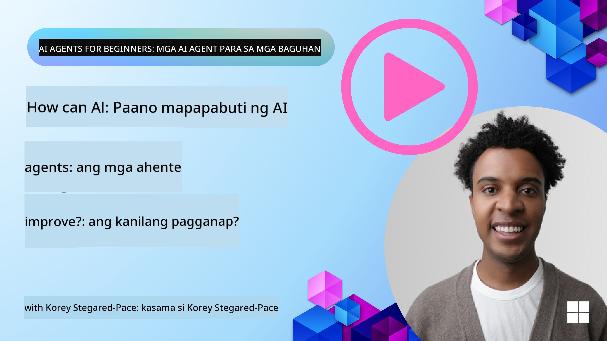
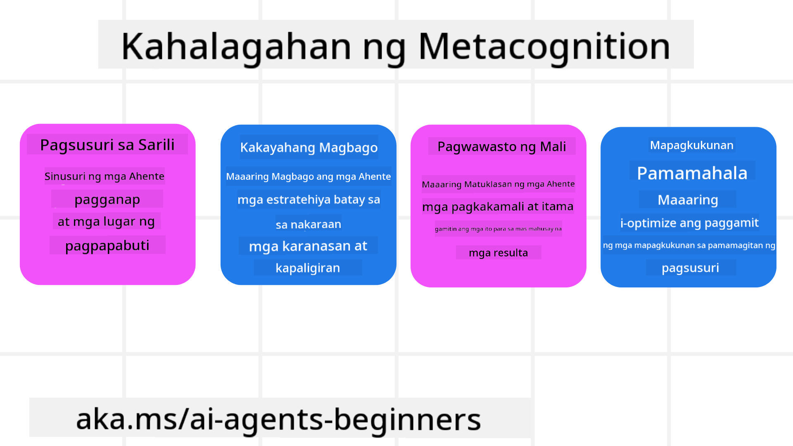
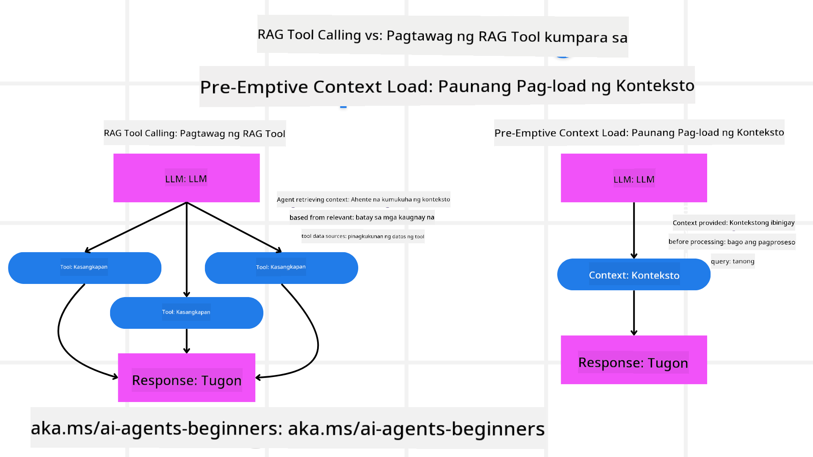

<!--
CO_OP_TRANSLATOR_METADATA:
{
  "original_hash": "8cbf460468c802c7994aa62e0e0779c9",
  "translation_date": "2025-07-12T13:04:02+00:00",
  "source_file": "09-metacognition/README.md",
  "language_code": "tl"
}
-->
[](https://youtu.be/His9R6gw6Ec?si=3_RMb8VprNvdLRhX)

> _(I-click ang larawan sa itaas para mapanood ang video ng araling ito)_
# Metakognisyon sa mga AI Agent

## Panimula

Maligayang pagdating sa aralin tungkol sa metakognisyon sa mga AI agent! Ang kabanatang ito ay ginawa para sa mga baguhan na nais malaman kung paano iniisip ng mga AI agent ang kanilang sariling proseso ng pag-iisip. Sa pagtatapos ng araling ito, mauunawaan mo ang mga pangunahing konsepto at magkakaroon ng mga praktikal na halimbawa upang magamit ang metakognisyon sa disenyo ng AI agent.

## Mga Layunin sa Pagkatuto

Pagkatapos makumpleto ang araling ito, magagawa mong:

1. Maunawaan ang mga epekto ng reasoning loops sa mga depinisyon ng agent.
2. Gamitin ang mga teknik sa pagpaplano at pagsusuri upang tulungan ang mga self-correcting na agent.
3. Gumawa ng sarili mong mga agent na kayang manipulahin ang code upang magawa ang mga gawain.

## Panimula sa Metakognisyon

Ang metakognisyon ay tumutukoy sa mga mas mataas na antas ng proseso ng pag-iisip na kinabibilangan ng pag-iisip tungkol sa sariling pag-iisip. Para sa mga AI agent, nangangahulugan ito ng kakayahang suriin at ayusin ang kanilang mga aksyon batay sa kamalayan sa sarili at mga nakaraang karanasan. Ang metakognisyon, o "pag-iisip tungkol sa pag-iisip," ay isang mahalagang konsepto sa pagbuo ng mga agentic AI system. Kasama rito ang pagiging mulat ng AI system sa kanilang sariling panloob na proseso at ang kakayahang subaybayan, kontrolin, at iangkop ang kanilang kilos nang naaayon. Katulad ng ginagawa natin kapag binabasa natin ang sitwasyon o tinitingnan ang isang problema. Ang ganitong kamalayan sa sarili ay makatutulong sa AI system na gumawa ng mas mahusay na desisyon, matukoy ang mga pagkakamali, at pagbutihin ang kanilang pagganap sa paglipas ng panahon—na muling bumabalik sa Turing test at ang debate kung sakaling sakupin ng AI ang mundo.

Sa konteksto ng mga agentic AI system, makatutulong ang metakognisyon sa paglutas ng ilang mga hamon, tulad ng:
- Transparency: Pagtiyak na kayang ipaliwanag ng AI system ang kanilang mga dahilan at desisyon.
- Reasoning: Pagpapahusay ng kakayahan ng AI system na pagsamahin ang impormasyon at gumawa ng matalinong desisyon.
- Adaptation: Pagbibigay-daan sa AI system na mag-adjust sa mga bagong kapaligiran at nagbabagong kondisyon.
- Perception: Pagpapabuti ng katumpakan ng AI system sa pagkilala at pag-interpret ng datos mula sa kanilang paligid.

### Ano ang Metakognisyon?

Ang metakognisyon, o "pag-iisip tungkol sa pag-iisip," ay isang mas mataas na antas ng proseso ng pag-iisip na kinabibilangan ng kamalayan sa sarili at sariling regulasyon ng mga proseso ng pag-iisip. Sa larangan ng AI, binibigyan ng kapangyarihan ang mga agent na suriin at iangkop ang kanilang mga estratehiya at aksyon, na nagreresulta sa mas mahusay na kakayahan sa paglutas ng problema at paggawa ng desisyon. Sa pag-unawa sa metakognisyon, makakagawa ka ng mga AI agent na hindi lamang mas matalino kundi mas nababagay at epektibo rin. Sa tunay na metakognisyon, makikita mo ang AI na malinaw na nagrereason tungkol sa sariling reasoning.

Halimbawa: “Pinili ko ang mas murang flight dahil… maaaring may mga direct flight na hindi ko napansin, kaya susuriin ko muli.”
Pagsubaybay kung paano o bakit pinili ang isang partikular na ruta.
- Napapansin na nagkamali dahil masyadong umasa sa mga hilig ng user mula sa nakaraan, kaya binabago ang estratehiya sa paggawa ng desisyon, hindi lang ang huling rekomendasyon.
- Pagsusuri ng mga pattern tulad ng, “Tuwing naririnig ko ang user na nagsasabing ‘masyadong siksikan,’ hindi lang dapat tanggalin ang ilang atraksyon kundi dapat ding pag-isipan na mali ang paraan ko sa pagpili ng ‘top attractions’ kung palagi kong inuuna ang popularidad.”

### Kahalagahan ng Metakognisyon sa mga AI Agent

Mahalaga ang metakognisyon sa disenyo ng AI agent dahil sa mga sumusunod na dahilan:



- Pagsusuri sa Sarili: Kayang suriin ng mga agent ang kanilang sariling pagganap at tukuyin ang mga dapat pagbutihin.
- Kakayahang Mag-adapt: Kayang baguhin ng mga agent ang kanilang mga estratehiya batay sa mga nakaraang karanasan at nagbabagong kapaligiran.
- Pagwawasto ng Mali: Kayang tuklasin at itama ng mga agent ang mga pagkakamali nang mag-isa, na nagreresulta sa mas tumpak na resulta.
- Pamamahala ng Mga Yaman: Kayang i-optimize ng mga agent ang paggamit ng mga yaman, tulad ng oras at computational power, sa pamamagitan ng pagpaplano at pagsusuri ng kanilang mga aksyon.

## Mga Bahagi ng isang AI Agent

Bago sumabak sa mga metakognitibong proseso, mahalagang maunawaan ang mga pangunahing bahagi ng isang AI agent. Karaniwang binubuo ang isang AI agent ng:

- Persona: Ang personalidad at mga katangian ng agent, na nagtatakda kung paano ito nakikipag-ugnayan sa mga user.
- Tools: Ang mga kakayahan at function na kayang gawin ng agent.
- Skills: Ang kaalaman at kasanayan na taglay ng agent.

Ang mga bahaging ito ay nagtutulungan upang makabuo ng isang "expertise unit" na kayang magsagawa ng mga partikular na gawain.

**Halimbawa**:
Isipin ang isang travel agent, isang serbisyo ng agent na hindi lang nagpaplano ng iyong bakasyon kundi inaayos din ang ruta nito batay sa real-time na datos at mga karanasan ng mga nakaraang customer.

### Halimbawa: Metakognisyon sa Serbisyo ng Travel Agent

Isipin na gumagawa ka ng isang travel agent service na pinapagana ng AI. Ang agent na ito, "Travel Agent," ay tumutulong sa mga user sa pagpaplano ng kanilang bakasyon. Para maisama ang metakognisyon, kailangang suriin at ayusin ng Travel Agent ang mga aksyon nito batay sa kamalayan sa sarili at mga nakaraang karanasan. Ganito ang maaaring papel ng metakognisyon:

#### Kasalukuyang Gawain

Ang kasalukuyang gawain ay tulungan ang user na magplano ng biyahe sa Paris.

#### Mga Hakbang para Matapos ang Gawain

1. **Kunin ang Mga Hilig ng User**: Tanungin ang user tungkol sa kanilang mga petsa ng biyahe, budget, interes (hal. museo, pagkain, pamimili), at iba pang partikular na pangangailangan.
2. **Kunin ang Impormasyon**: Maghanap ng mga flight option, tirahan, atraksyon, at mga restawran na tugma sa mga hilig ng user.
3. **Gumawa ng Mga Rekomendasyon**: Magbigay ng personalisadong itinerary na may detalye ng flight, hotel reservation, at mga mungkahing aktibidad.
4. **Ayusin Batay sa Feedback**: Tanungin ang user tungkol sa kanilang opinyon sa mga rekomendasyon at gumawa ng kinakailangang pagbabago.

#### Mga Kinakailangang Yaman

- Access sa mga flight at hotel booking database.
- Impormasyon tungkol sa mga atraksyon at restawran sa Paris.
- Datos ng feedback mula sa mga nakaraang interaksyon ng user.

#### Karanasan at Pagsusuri sa Sarili

Ginagamit ng Travel Agent ang metakognisyon upang suriin ang pagganap nito at matuto mula sa mga nakaraang karanasan. Halimbawa:

1. **Pagsusuri ng Feedback ng User**: Tinitingnan ng Travel Agent ang feedback ng user upang malaman kung alin sa mga rekomendasyon ang nagustuhan at alin ang hindi. Inaayos nito ang mga susunod na mungkahi batay dito.
2. **Kakayahang Mag-adapt**: Kung nabanggit ng user na ayaw niya sa masyadong mataong lugar, iiwasan ng Travel Agent ang pagrekomenda ng mga sikat na tourist spot sa mga peak hours sa susunod.
3. **Pagwawasto ng Mali**: Kung nagkamali ang Travel Agent sa isang booking dati, tulad ng pagrekomenda ng hotel na puno na, natututo itong mas maingat na suriin ang availability bago magbigay ng mungkahi.

#### Praktikal na Halimbawa para sa Developer

Narito ang isang pinasimpleng halimbawa ng code ng Travel Agent na may metakognisyon:

```python
class Travel_Agent:
    def __init__(self):
        self.user_preferences = {}
        self.experience_data = []

    def gather_preferences(self, preferences):
        self.user_preferences = preferences

    def retrieve_information(self):
        # Search for flights, hotels, and attractions based on preferences
        flights = search_flights(self.user_preferences)
        hotels = search_hotels(self.user_preferences)
        attractions = search_attractions(self.user_preferences)
        return flights, hotels, attractions

    def generate_recommendations(self):
        flights, hotels, attractions = self.retrieve_information()
        itinerary = create_itinerary(flights, hotels, attractions)
        return itinerary

    def adjust_based_on_feedback(self, feedback):
        self.experience_data.append(feedback)
        # Analyze feedback and adjust future recommendations
        self.user_preferences = adjust_preferences(self.user_preferences, feedback)

# Example usage
travel_agent = Travel_Agent()
preferences = {
    "destination": "Paris",
    "dates": "2025-04-01 to 2025-04-10",
    "budget": "moderate",
    "interests": ["museums", "cuisine"]
}
travel_agent.gather_preferences(preferences)
itinerary = travel_agent.generate_recommendations()
print("Suggested Itinerary:", itinerary)
feedback = {"liked": ["Louvre Museum"], "disliked": ["Eiffel Tower (too crowded)"]}
travel_agent.adjust_based_on_feedback(feedback)
```

#### Bakit Mahalaga ang Metakognisyon

- **Pagsusuri sa Sarili**: Kayang suriin ng mga agent ang kanilang pagganap at tukuyin ang mga dapat pagbutihin.
- **Kakayahang Mag-adapt**: Kayang baguhin ng mga agent ang mga estratehiya batay sa feedback at nagbabagong kondisyon.
- **Pagwawasto ng Mali**: Kayang tuklasin at itama ng mga agent ang mga pagkakamali nang mag-isa.
- **Pamamahala ng Mga Yaman**: Kayang i-optimize ng mga agent ang paggamit ng mga yaman, tulad ng oras at computational power.

Sa pamamagitan ng pagsasama ng metakognisyon, makakapagbigay ang Travel Agent ng mas personalisado at tumpak na mga rekomendasyon sa paglalakbay, na nagpapabuti sa kabuuang karanasan ng user.

---

## 2. Pagpaplano sa mga Agent

Ang pagpaplano ay isang mahalagang bahagi ng kilos ng AI agent. Kasama rito ang pagbalangkas ng mga hakbang na kailangan upang makamit ang isang layunin, isinasaalang-alang ang kasalukuyang kalagayan, mga yaman, at posibleng mga hadlang.

### Mga Elemento ng Pagpaplano

- **Kasalukuyang Gawain**: Malinaw na tukuyin ang gawain.
- **Mga Hakbang para Matapos ang Gawain**: Hatiin ang gawain sa mga kayang hakbang.
- **Kinakailangang Yaman**: Tukuyin ang mga kailangang yaman.
- **Karanasan**: Gamitin ang mga nakaraang karanasan upang gabayan ang pagpaplano.

**Halimbawa**:
Narito ang mga hakbang na kailangang gawin ng Travel Agent upang epektibong matulungan ang user sa pagpaplano ng kanilang biyahe:

### Mga Hakbang para sa Travel Agent

1. **Kunin ang Mga Hilig ng User**
   - Tanungin ang user tungkol sa mga detalye ng kanilang petsa ng biyahe, budget, interes, at iba pang partikular na pangangailangan.
   - Mga halimbawa: "Kailan mo balak maglakbay?" "Magkano ang budget mo?" "Anong mga aktibidad ang gusto mo sa bakasyon?"

2. **Kunin ang Impormasyon**
   - Maghanap ng mga opsyon sa paglalakbay batay sa mga hilig ng user.
   - **Mga Flight**: Hanapin ang mga available na flight na pasok sa budget at petsa ng user.
   - **Tirahan**: Maghanap ng mga hotel o paupahang lugar na tugma sa lokasyon, presyo, at amenities na gusto ng user.
   - **Atraksyon at Restawran**: Tukuyin ang mga sikat na atraksyon, aktibidad, at kainan na naaayon sa interes ng user.

3. **Gumawa ng Mga Rekomendasyon**
   - Ibuod ang nakuhang impormasyon sa isang personalisadong itinerary.
   - Magbigay ng detalye tulad ng mga flight option, hotel booking, at mga mungkahing aktibidad, na nakaayon sa mga hilig ng user.

4. **Ipakita ang Itinerary sa User**
   - Ibahagi ang iminungkahing itinerary para sa pagsusuri ng user.
   - Halimbawa: "Narito ang mungkahing itinerary para sa iyong biyahe sa Paris. Kasama dito ang detalye ng flight, booking ng hotel, at listahan ng mga inirerekomendang aktibidad at restawran. Sabihin mo lang kung ano ang palagay mo!"

5. **Kunin ang Feedback**
   - Tanungin ang user tungkol sa kanilang opinyon sa iminungkahing itinerary.
   - Mga halimbawa: "Nagustuhan mo ba ang mga flight option?" "Ayos ba ang hotel para sa iyong pangangailangan?" "May gusto ka bang idagdag o alisin na aktibidad?"

6. **Ayusin Batay sa Feedback**
   - Baguhin ang itinerary batay sa feedback ng user.
   - Gawin ang mga kinakailangang pagbabago sa flight, tirahan, at mga rekomendasyon ng aktibidad upang mas umayon sa gusto ng user.

7. **Panghuling Kumpirmasyon**
   - Ipakita ang na-update na itinerary para sa huling kumpirmasyon ng user.
   - Halimbawa: "Inayos ko na ang itinerary base sa iyong feedback. Narito ang updated na plano. Ayos ba ito sa iyo?"

8. **Mag-book at Kumpirmahin ang mga Reserbasyon**
   - Kapag inaprubahan ng user ang itinerary, magpatuloy sa pag-book ng mga flight, tirahan, at mga pre-planned na aktibidad.
   - Ipadala ang mga detalye ng kumpirmasyon sa user.

9. **Magbigay ng Patuloy na Suporta**
   - Manatiling available upang tulungan ang user sa anumang pagbabago o karagdagang kahilingan bago at habang naglalakbay.
   - Halimbawa: "Kung kailangan mo ng karagdagang tulong habang naglalakbay, huwag mag-atubiling kontakin ako anumang oras!"

### Halimbawa ng Interaksyon

```python
class Travel_Agent:
    def __init__(self):
        self.user_preferences = {}
        self.experience_data = []

    def gather_preferences(self, preferences):
        self.user_preferences = preferences

    def retrieve_information(self):
        flights = search_flights(self.user_preferences)
        hotels = search_hotels(self.user_preferences)
        attractions = search_attractions(self.user_preferences)
        return flights, hotels, attractions

    def generate_recommendations(self):
        flights, hotels, attractions = self.retrieve_information()
        itinerary = create_itinerary(flights, hotels, attractions)
        return itinerary

    def adjust_based_on_feedback(self, feedback):
        self.experience_data.append(feedback)
        self.user_preferences = adjust_preferences(self.user_preferences, feedback)

# Example usage within a booing request
travel_agent = Travel_Agent()
preferences = {
    "destination": "Paris",
    "dates": "2025-04-01 to 2025-04-10",
    "budget": "moderate",
    "interests": ["museums", "cuisine"]
}
travel_agent.gather_preferences(preferences)
itinerary = travel_agent.generate_recommendations()
print("Suggested Itinerary:", itinerary)
feedback = {"liked": ["Louvre Museum"], "disliked": ["Eiffel Tower (too crowded)"]}
travel_agent.adjust_based_on_feedback(feedback)
```

## 3. Corrective RAG System

Una, simulan natin sa pag-unawa sa pagkakaiba ng RAG Tool at Pre-emptive Context Load



### Retrieval-Augmented Generation (RAG)

Pinagsasama ng RAG ang retrieval system at generative model. Kapag may query, kinukuha ng retrieval system ang mga kaugnay na dokumento o datos mula sa panlabas na pinagmulan, at ginagamit ang impormasyong ito upang dagdagan ang input sa generative model. Nakakatulong ito sa modelong makabuo ng mas tumpak at kontekstwal na tugon.

Sa isang RAG system, kumukuha ang agent ng kaugnay na impormasyon mula sa knowledge base at ginagamit ito upang makabuo ng angkop na tugon o aksyon.

### Corrective RAG Approach

Nakatuon ang Corrective RAG approach sa paggamit ng mga teknik ng RAG upang itama ang mga pagkakamali at pagbutihin ang katumpakan ng mga AI agent. Kasama rito ang:

1. **Prompting Technique**: Paggamit ng mga partikular na prompt upang gabayan ang agent sa pagkuha ng kaugnay na impormasyon.
2. **Tool**: Pagpapatupad ng mga algorithm at mekanismo na nagpapahintulot sa agent na suriin ang kaugnayan ng nakuha nitong impormasyon at makabuo ng tumpak na tugon.
3. **Evaluation**: Patuloy na pagsusuri sa pagganap ng agent at paggawa ng mga pagbabago upang mapabuti ang katumpakan at kahusayan nito.

#### Halimbawa: Corrective RAG sa isang Search Agent

Isipin ang isang search agent na kumukuha ng impormasyon mula sa web upang sagutin ang mga tanong ng user. Maaaring kabilang sa Corrective RAG approach ang:

1. **Prompting Technique**: Pagbuo ng mga search query batay sa input ng user.
2. **Tool**: Paggamit ng natural language processing at machine learning algorithm upang i-rank at i-filter ang mga resulta ng paghahanap.
3. **Evaluation**: Pagsusuri ng feedback ng user upang matukoy at itama ang mga kamalian sa nakuha na impormasyon.

### Corrective RAG sa Travel Agent

Pinapalakas ng Corrective RAG (Retrieval-Augmented Generation) ang kakayahan ng AI na kumuha at makabuo ng impormasyon habang inaayos ang anumang kamalian. Tingnan natin kung paano magagamit ng Travel Agent ang Corrective RAG approach upang magbigay ng mas tumpak at kaugnay na mga rekomendasyon sa paglalakbay.

Kasama rito ang:

- **Prompting Technique:** Paggamit ng mga partikular na prompt upang gabayan ang agent sa pagkuha ng kaugnay na impormasyon.
- **Tool:** Pagpapatupad ng mga algorithm at mekanismo na nagpapahintulot sa agent na suriin ang kaugnayan ng nakuha nitong impormasyon at makabuo ng tumpak na tugon.
- **Evaluation:** Patuloy na pagsusuri sa pagganap ng agent at paggawa ng mga pagbabago upang mapabuti ang katumpakan at kahusayan nito.

#### Mga Hakbang sa Pagpapatupad ng Corrective RAG sa Travel Agent

1. **Paunang Interaksyon sa User**
   - Kinokolekta ng Travel Agent ang mga paunang hilig ng user, tulad ng destinasyon, petsa ng biyahe, budget, at interes.
   - Halimbawa:

     ```python
     preferences = {
         "destination": "Paris",
         "dates": "2025-04-01 to 2025-04-10",
         "budget": "moderate",
         "interests": ["museums", "cuisine"]
     }
     ```

2. **Pagkuha ng Impormasyon**
   - Kinukuha ng Travel Agent ang impormasyon tungkol sa mga flight, tirahan, atraksyon, at restawran batay sa mga hilig ng user.
   - Halimbawa:

     ```python
     flights = search_flights(preferences)
     hotels = search_hotels(preferences)
     attractions = search_attractions(preferences)
     ```

3. **Pagbuo ng Paunang Mga Rekomendasyon**
   - Ginagamit ng Travel Agent ang nakuha na impormasyon upang makabuo ng personalisadong itinerary.
   - Halimbawa:

     ```python
     itinerary = create_itinerary(flights, hotels, attractions)
     print("Suggested Itinerary:", itinerary)
     ```

4. **Pagkuha ng Feedback ng User**
   - Tinanong ng Travel Agent ang user tungkol sa paunang mga rekomendasyon.
   - Halimbawa:

     ```python
     feedback = {
         "liked": ["Louvre Museum"],
         "disliked": ["Eiffel Tower (too crowded)"]
     }
     ```

5
### Pre-emptive Context Load

Ang Pre-emptive Context Load ay ang pag-load ng mga kaugnay na konteksto o impormasyon bago pa man iproseso ang isang query. Ibig sabihin, may access ang modelo sa impormasyong ito mula sa simula, na makakatulong upang makabuo ito ng mas may kaalamang mga sagot nang hindi na kailangang kumuha pa ng dagdag na datos habang nagpapatuloy ang proseso.

Narito ang isang pinasimpleng halimbawa kung paano maaaring gawin ang pre-emptive context load para sa isang travel agent application gamit ang Python:

#### Paliwanag

1. **Initialization (`__init__` method)**: Ang klase na `TravelAgent` ay nag-pre-load ng isang dictionary na naglalaman ng impormasyon tungkol sa mga sikat na destinasyon tulad ng Paris, Tokyo, New York, at Sydney. Kasama sa dictionary na ito ang mga detalye gaya ng bansa, pera, wika, at mga pangunahing atraksyon ng bawat destinasyon.

2. **Pagkuha ng Impormasyon (`get_destination_info` method)**: Kapag nagtanong ang user tungkol sa isang partikular na destinasyon, kinukuha ng `get_destination_info` method ang kaugnay na impormasyon mula sa pre-loaded na context dictionary.

Sa pamamagitan ng pag-pre-load ng konteksto, mabilis na nakakasagot ang travel agent application sa mga tanong ng user nang hindi na kailangang kumuha ng impormasyon mula sa panlabas na source sa real-time. Ginagawa nitong mas epektibo at mabilis ang aplikasyon.

### Bootstrapping the Plan with a Goal Before Iterating

Ang pag-bootstrap ng plano na may malinaw na layunin ay nangangahulugan ng pagsisimula sa isang tiyak na target o objective. Sa pamamagitan ng pagtukoy ng layuning ito mula sa simula, nagagamit ito bilang gabay sa buong proseso ng pag-uulit. Nakakatulong ito upang matiyak na bawat pag-uulit ay papalapit sa nais na resulta, kaya mas epektibo at nakatuon ang proseso.

Narito ang halimbawa kung paano mag-bootstrap ng travel plan na may layunin bago mag-iterate para sa isang travel agent gamit ang Python:

### Scenario

Nais ng isang travel agent na magplano ng customized na bakasyon para sa isang kliyente. Ang layunin ay makagawa ng travel itinerary na pinakamataas ang kasiyahan ng kliyente base sa kanilang mga hilig at budget.

### Mga Hakbang

1. Tukuyin ang mga hilig at budget ng kliyente.
2. I-bootstrap ang unang plano base sa mga hilig na ito.
3. Ulitin ang plano upang mapabuti ito, na ini-optimize para sa kasiyahan ng kliyente.

#### Python Code

#### Paliwanag ng Code

1. **Initialization (`__init__` method)**: Ang klase na `TravelAgent` ay ini-initialize gamit ang listahan ng mga posibleng destinasyon, bawat isa ay may mga katangian tulad ng pangalan, gastos, at uri ng aktibidad.

2. **Bootstrapping the Plan (`bootstrap_plan` method)**: Gumagawa ito ng unang travel plan base sa mga hilig at budget ng kliyente. Iniikot nito ang listahan ng mga destinasyon at idinadagdag ang mga ito sa plano kung tugma sa hilig ng kliyente at pasok sa budget.

3. **Pagtutugma ng Hilig (`match_preferences` method)**: Sinusuri nito kung tugma ang isang destinasyon sa mga hilig ng kliyente.

4. **Pag-uulit ng Plano (`iterate_plan` method)**: Pinapabuti nito ang unang plano sa pamamagitan ng pagsubok na palitan ang bawat destinasyon ng mas angkop na tugma, isinasaalang-alang ang hilig at limitasyon sa budget ng kliyente.

5. **Pagkalkula ng Gastos (`calculate_cost` method)**: Kinakalkula nito ang kabuuang gastos ng kasalukuyang plano, kasama na ang posibleng bagong destinasyon.

#### Halimbawa ng Paggamit

- **Unang Plano**: Gumawa ang travel agent ng unang plano base sa hilig ng kliyente sa sightseeing at budget na $2000.
- **Pinahusay na Plano**: Inulit ng travel agent ang plano, ini-optimize ito para sa hilig at budget ng kliyente.

Sa pamamagitan ng pag-bootstrap ng plano na may malinaw na layunin (halimbawa, pinakamataas na kasiyahan ng kliyente) at pag-uulit upang mapabuti ito, makakagawa ang travel agent ng customized at optimized na travel itinerary para sa kliyente. Tinitiyak ng paraang ito na ang plano ay nakaayon sa hilig at budget ng kliyente mula sa simula at patuloy na bumubuti sa bawat pag-uulit.

### Paggamit ng LLM para sa Re-ranking at Scoring

Maaaring gamitin ang Large Language Models (LLMs) para sa re-ranking at scoring sa pamamagitan ng pagsusuri sa kaugnayan at kalidad ng mga nakuha o nabuo na sagot o dokumento. Ganito ang proseso:

**Retrieval:** Kinukuha muna ang mga kandidato na dokumento o sagot base sa query.

**Re-ranking:** Sinusuri ng LLM ang mga kandidato at nire-rerank ito base sa kaugnayan at kalidad. Tinitiyak nito na ang pinaka-angkop at mataas ang kalidad na impormasyon ang unang lumalabas.

**Scoring:** Nagbibigay ang LLM ng mga score sa bawat kandidato na nagpapakita ng kaugnayan at kalidad. Nakakatulong ito sa pagpili ng pinakamahusay na sagot o dokumento para sa user.

Sa paggamit ng LLM para sa re-ranking at scoring, mas naibibigay ng sistema ang mas tumpak at kontekstwal na impormasyon, na nagpapabuti sa karanasan ng user.

Narito ang halimbawa kung paano maaaring gamitin ng travel agent ang LLM para sa re-ranking at scoring ng mga destinasyon base sa hilig ng user gamit ang Python:

#### Scenario - Paglalakbay base sa Hilig

Nais ng travel agent na irekomenda ang pinakamahusay na mga destinasyon sa kliyente base sa kanilang mga hilig. Tutulungan ng LLM na i-re-rank at i-score ang mga destinasyon upang matiyak na ang pinaka-angkop na mga opsyon ang maipapakita.

#### Mga Hakbang:

1. Kolektahin ang mga hilig ng user.
2. Kunin ang listahan ng mga posibleng destinasyon.
3. Gamitin ang LLM para i-re-rank at i-score ang mga destinasyon base sa hilig ng user.

Narito kung paano mo maa-update ang naunang halimbawa para gamitin ang Azure OpenAI Services:

#### Mga Kinakailangan

1. Kailangan mong magkaroon ng Azure subscription.
2. Gumawa ng Azure OpenAI resource at kunin ang iyong API key.

#### Halimbawa ng Python Code

#### Paliwanag ng Code - Preference Booker

1. **Initialization**: Ang klase na `TravelAgent` ay ini-initialize gamit ang listahan ng mga posibleng destinasyon, bawat isa ay may mga katangian tulad ng pangalan at deskripsyon.

2. **Pagkuha ng Rekomendasyon (`get_recommendations` method)**: Gumagawa ito ng prompt para sa Azure OpenAI service base sa hilig ng user at nagsasagawa ng HTTP POST request sa Azure OpenAI API upang makuha ang mga re-ranked at scored na destinasyon.

3. **Pagbuo ng Prompt (`generate_prompt` method)**: Gumagawa ito ng prompt para sa Azure OpenAI, kasama ang hilig ng user at listahan ng mga destinasyon. Ginagabayan ng prompt ang modelo na i-re-rank at i-score ang mga destinasyon base sa mga ibinigay na hilig.

4. **API Call**: Ginagamit ang `requests` library para gumawa ng HTTP POST request sa Azure OpenAI API endpoint. Ang sagot ay naglalaman ng mga re-ranked at scored na destinasyon.

5. **Halimbawa ng Paggamit**: Kinokolekta ng travel agent ang hilig ng user (halimbawa, interes sa sightseeing at magkakaibang kultura) at ginagamit ang Azure OpenAI service para makakuha ng mga re-ranked at scored na rekomendasyon para sa mga destinasyon.

Siguraduhing palitan ang `your_azure_openai_api_key` ng iyong totoong Azure OpenAI API key at ang `https://your-endpoint.com/...` ng aktwal na endpoint URL ng iyong Azure OpenAI deployment.

Sa paggamit ng LLM para sa re-ranking at scoring, makakapagbigay ang travel agent ng mas personalisado at angkop na mga rekomendasyon sa paglalakbay para sa mga kliyente, na nagpapabuti sa kanilang kabuuang karanasan.

### RAG: Prompting Technique vs Tool

Ang Retrieval-Augmented Generation (RAG) ay maaaring maging isang prompting technique o isang tool sa pagbuo ng AI agents. Ang pag-unawa sa pagkakaiba ng dalawa ay makakatulong upang mas epektibong magamit ang RAG sa iyong mga proyekto.

#### RAG bilang Prompting Technique

**Ano ito?**

- Bilang prompting technique, ang RAG ay kinabibilangan ng paggawa ng mga tiyak na query o prompt upang gabayan ang pagkuha ng kaugnay na impormasyon mula sa malaking koleksyon o database. Ginagamit ang impormasyong ito upang makabuo ng mga sagot o aksyon.

**Paano ito gumagana:**

1. **Pagbuo ng Prompts**: Gumawa ng maayos na istrukturang mga prompt o query base sa gawain o input ng user.
2. **Pagkuha ng Impormasyon**: Gamitin ang mga prompt upang maghanap ng kaugnay na datos mula sa umiiral na knowledge base o dataset.
3. **Pagbuo ng Sagot**: Pagsamahin ang nakuha na impormasyon sa mga generative AI models upang makabuo ng komprehensibo at magkakaugnay na sagot.

**Halimbawa sa Travel Agent**:

- Input ng User: "Gusto kong bumisita sa mga museo sa Paris."
- Prompt: "Hanapin ang mga nangungunang museo sa Paris."
- Nakuha na Impormasyon: Mga detalye tungkol sa Louvre Museum, Musée d'Orsay, atbp.
- Nabuo na Sagot: "Narito ang ilang mga nangungunang museo sa Paris: Louvre Museum, Musée d'Orsay, at Centre Pompidou."

#### RAG bilang Tool

**Ano ito?**

- Bilang tool, ang RAG ay isang integrated system na awtomatikong pinamamahalaan ang proseso ng retrieval at generation, na nagpapadali sa mga developer na magpatupad ng kumplikadong AI functionalities nang hindi mano-manong gumagawa ng mga prompt para sa bawat query.

**Paano ito gumagana:**

1. **Integrasyon**: Isinama ang RAG sa arkitektura ng AI agent, na nagpapahintulot dito na awtomatikong hawakan ang retrieval at generation tasks.
2. **Awtomasyon**: Pinamamahalaan ng tool ang buong proseso, mula sa pagtanggap ng input ng user hanggang sa pagbuo ng huling sagot, nang hindi nangangailangan ng tiyak na prompt sa bawat hakbang.
3. **Epektibidad**: Pinapahusay ang performance ng agent sa pamamagitan ng pagpapadali ng retrieval at generation process, na nagbibigay ng mas mabilis at mas tumpak na mga sagot.

**Halimbawa sa Travel Agent**:

- Input ng User: "Gusto kong bumisita sa mga museo sa Paris."
- RAG Tool: Awtomatikong kinukuha ang impormasyon tungkol sa mga museo at bumubuo ng sagot.
- Nabuo na Sagot: "Narito ang ilang mga nangungunang museo sa Paris: Louvre Museum, Musée d'Orsay, at Centre Pompidou."

### Paghahambing

| Aspeto                 | Prompting Technique                                        | Tool                                                  |
|------------------------|-------------------------------------------------------------|-------------------------------------------------------|
| **Mano-mano vs Awtomatik** | Mano-manong paggawa ng mga prompt para sa bawat query.       | Awtomatikong proseso para sa retrieval at generation. |
| **Kontrol**            | Mas maraming kontrol sa proseso ng retrieval.               | Pinapadali at ina-awtomatiko ang retrieval at generation.|
| **Kakayahang Mag-adapt** | Pinapayagan ang customized na mga prompt base sa pangangailangan. | Mas epektibo para sa malakihang implementasyon.       |
| **Kumplikado**         | Nangangailangan ng paggawa at pag-aayos ng mga prompt.       | Mas madaling isama sa arkitektura ng AI agent.         |

### Mga Praktikal na Halimbawa

**Halimbawa ng Prompting Technique:**

**Halimbawa ng Tool:**

### Pagsusuri ng Kaugnayan

Mahalaga ang pagsusuri ng kaugnayan sa performance ng AI agent. Tinitiyak nito na ang impormasyong nakuha at nabuo ng agent ay angkop, tama, at kapaki-pakinabang sa user. Tingnan natin kung paano suriin ang kaugnayan sa AI agents, kasama ang mga praktikal na halimbawa at teknik.

#### Mga Pangunahing Konsepto sa Pagsusuri ng Kaugnayan

1. **Pagkaalam sa Konteksto**:
   - Dapat maintindihan ng agent ang konteksto ng query ng user upang makakuha at makabuo ng angkop na impormasyon.
   - Halimbawa: Kapag nagtanong ang user ng "pinakamagandang mga restaurant sa Paris," dapat isaalang-alang ng agent ang mga hilig ng user tulad ng uri ng pagkain at budget.

2. **Katumpakan**:
   - Dapat tama at napapanahon ang impormasyong ibinibigay ng agent.
   - Halimbawa: Magrekomenda ng mga bukas na restaurant na may magagandang review, hindi mga luma o saradong lugar.

3. **Intensyon ng User**:
   - Dapat mahinuha ng agent ang intensyon ng user sa likod ng query upang makapagbigay ng pinaka-angkop na impormasyon.
   - Halimbawa: Kapag humiling ang user ng "murang hotel," dapat unahin ng agent ang mga abot-kayang opsyon.

4. **Feedback Loop**:
   - Patuloy na pagkolekta at pagsusuri ng feedback ng user upang mapabuti ang proseso ng pagsusuri ng kaugnayan.
   - Halimbawa: Isama ang mga rating at feedback ng user sa mga naunang rekomendasyon upang mapabuti ang mga susunod na sagot.

#### Mga Praktikal na Teknik sa Pagsusuri ng Kaugnayan

1. **Relevance Scoring**:
   - Magbigay ng score sa bawat nakuha na item base sa kung gaano ito kaangkop sa query at hilig ng user.
   - Halimbawa:

2. **Filtering at Ranking**:
   - Alisin ang mga hindi kaugnay na item at i-rank ang natitirang mga item base sa kanilang relevance score.
   - Halimbawa:

3. **Natural Language Processing (NLP)**:
   - Gamitin ang NLP upang maintindihan ang query ng user at makakuha ng kaugnay na impormasyon.
   - Halimbawa:

4. **Pagsasama ng Feedback ng User**:
   - Kolektahin ang feedback ng user sa mga ibinigay na rekomendasyon at gamitin ito upang ayusin ang mga susunod na pagsusuri ng kaugnayan.
   - Halimbawa:

#### Halimbawa: Pagsusuri ng Kaugnayan sa Travel Agent

Narito ang praktikal na halimbawa kung paano sinusuri ng Travel Agent ang kaugnayan ng mga rekomendasyon sa paglalakbay:

### Search with Intent

Ang paghahanap na may intensyon ay nangangahulugan ng pag-unawa at pag-interpret sa tunay na layunin o hangarin sa likod ng query ng user upang makakuha at makabuo ng pinaka-angkop at kapaki-pakinabang na impormasyon. Hindi lang ito basta pagtutugma ng mga keyword kundi pagkuha ng tunay na pangangailangan at konteksto ng user.

#### Mga Pangunahing Konsepto sa Paghahanap na may Intensyon

1. **Pag-unawa sa Intensyon ng User**:
   - Maaaring hatiin ang intensyon ng user sa tatlong pangunahing uri: informational, navigational, at transactional.
     - **Informational Intent**: Naghahanap ang user ng impormasyon tungkol sa isang paksa (halimbawa, "Ano ang mga pinakamahusay na museo sa Paris?").
     - **Navigational Intent**: Nais ng user na pumunta sa isang partikular na website o pahina (halimbawa, "Opisyal na website ng Louvre Museum").
     - **Transactional Intent**: Layunin ng user na magsagawa ng transaksyon, tulad ng pag-book ng flight o pagbili (halimbawa, "Mag-book ng flight papuntang Paris").

2. **Pagkaalam sa Konteksto**:
   - Ang pagsusuri sa konteksto ng query ng user ay tumutulong upang tama ang pagkilala sa kanilang intensyon. Kasama dito ang pagtingin sa mga naunang interaksyon, hilig ng user, at mga detalye ng kasalukuyang query.

3. **Natural Language Processing (NLP)**:
   - Ginagamit ang mga teknik ng NLP upang maintindihan at ma-interpret ang mga natural na wika na query ng user. Kasama dito ang entity recognition, sentiment analysis, at query parsing.

4. **Personalization**:
   - Ang pag-personalize ng mga resulta ng paghahanap base sa kasaysayan, hilig, at feedback ng user ay nagpapahusay sa kaugnayan ng impormasyong nakuha.
#### Praktikal na Halimbawa: Paghahanap na may Layunin sa Travel Agent

Gamitin natin ang Travel Agent bilang halimbawa upang makita kung paano maipapatupad ang paghahanap na may layunin.

1. **Pagkuha ng Mga Kagustuhan ng User**

   ```python
   class Travel_Agent:
       def __init__(self):
           self.user_preferences = {}

       def gather_preferences(self, preferences):
           self.user_preferences = preferences
   ```

2. **Pag-unawa sa Layunin ng User**

   ```python
   def identify_intent(query):
       if "book" in query or "purchase" in query:
           return "transactional"
       elif "website" in query or "official" in query:
           return "navigational"
       else:
           return "informational"
   ```

3. **Pagkamulat sa Konteksto**

   ```python
   def analyze_context(query, user_history):
       # Combine current query with user history to understand context
       context = {
           "current_query": query,
           "user_history": user_history
       }
       return context
   ```

4. **Paghahanap at Personalizing ng Resulta**

   ```python
   def search_with_intent(query, preferences, user_history):
       intent = identify_intent(query)
       context = analyze_context(query, user_history)
       if intent == "informational":
           search_results = search_information(query, preferences)
       elif intent == "navigational":
           search_results = search_navigation(query)
       elif intent == "transactional":
           search_results = search_transaction(query, preferences)
       personalized_results = personalize_results(search_results, user_history)
       return personalized_results

   def search_information(query, preferences):
       # Example search logic for informational intent
       results = search_web(f"best {preferences['interests']} in {preferences['destination']}")
       return results

   def search_navigation(query):
       # Example search logic for navigational intent
       results = search_web(query)
       return results

   def search_transaction(query, preferences):
       # Example search logic for transactional intent
       results = search_web(f"book {query} to {preferences['destination']}")
       return results

   def personalize_results(results, user_history):
       # Example personalization logic
       personalized = [result for result in results if result not in user_history]
       return personalized[:10]  # Return top 10 personalized results
   ```

5. **Halimbawa ng Paggamit**

   ```python
   travel_agent = Travel_Agent()
   preferences = {
       "destination": "Paris",
       "interests": ["museums", "cuisine"]
   }
   travel_agent.gather_preferences(preferences)
   user_history = ["Louvre Museum website", "Book flight to Paris"]
   query = "best museums in Paris"
   results = search_with_intent(query, preferences, user_history)
   print("Search Results:", results)
   ```

---

## 4. Pagbuo ng Code bilang Isang Kasangkapan

Ang mga code generating agents ay gumagamit ng AI models upang magsulat at magpatakbo ng code, na nakakatulong sa paglutas ng mga komplikadong problema at pag-automate ng mga gawain.

### Mga Code Generating Agents

Ang mga code generating agents ay gumagamit ng generative AI models upang magsulat at magpatakbo ng code. Kaya nilang lutasin ang mga komplikadong problema, mag-automate ng mga gawain, at magbigay ng mahahalagang insight sa pamamagitan ng pagbuo at pagpapatakbo ng code sa iba't ibang programming languages.

#### Praktikal na Aplikasyon

1. **Automated Code Generation**: Gumawa ng mga code snippet para sa partikular na mga gawain, tulad ng data analysis, web scraping, o machine learning.
2. **SQL bilang RAG**: Gumamit ng SQL queries upang kunin at manipulahin ang data mula sa mga database.
3. **Paglutas ng Problema**: Gumawa at magpatakbo ng code upang lutasin ang mga partikular na problema, tulad ng pag-optimize ng mga algorithm o pagsusuri ng data.

#### Halimbawa: Code Generating Agent para sa Data Analysis

Isipin na gumagawa ka ng isang code generating agent. Ganito ang maaaring paraan ng pagtrabaho nito:

1. **Gawain**: Suriin ang isang dataset upang tuklasin ang mga trend at pattern.
2. **Mga Hakbang**:
   - I-load ang dataset sa isang data analysis tool.
   - Gumawa ng mga SQL query upang i-filter at i-aggregate ang data.
   - Patakbuhin ang mga query at kunin ang mga resulta.
   - Gamitin ang mga resulta upang gumawa ng mga visualization at insight.
3. **Kailangang Resources**: Access sa dataset, mga data analysis tool, at kakayahan sa SQL.
4. **Karanasan**: Gamitin ang mga nakaraang resulta ng pagsusuri upang mapabuti ang katumpakan at kaugnayan ng mga susunod na pagsusuri.

### Halimbawa: Code Generating Agent para sa Travel Agent

Sa halimbawang ito, gagawa tayo ng isang code generating agent, Travel Agent, upang tulungan ang mga user sa pagpaplano ng kanilang paglalakbay sa pamamagitan ng pagbuo at pagpapatakbo ng code. Kaya nitong hawakan ang mga gawain tulad ng pagkuha ng mga opsyon sa paglalakbay, pag-filter ng mga resulta, at paggawa ng itinerary gamit ang generative AI.

#### Pangkalahatang-ideya ng Code Generating Agent

1. **Pagkuha ng Mga Kagustuhan ng User**: Kinokolekta ang input ng user tulad ng destinasyon, petsa ng paglalakbay, budget, at mga interes.
2. **Pagbuo ng Code para Kumuha ng Data**: Gumagawa ng mga code snippet upang kunin ang impormasyon tungkol sa mga flight, hotel, at atraksyon.
3. **Pagpapatakbo ng Nabuo na Code**: Pinapatakbo ang code upang makuha ang real-time na impormasyon.
4. **Pagbuo ng Itinerary**: Pinagsasama-sama ang nakuhang data upang makagawa ng personalized na plano sa paglalakbay.
5. **Pag-aayos Batay sa Feedback**: Tumatanggap ng feedback mula sa user at muling bumubuo ng code kung kinakailangan upang mapino ang mga resulta.

#### Hakbang-hakbang na Implementasyon

1. **Pagkuha ng Mga Kagustuhan ng User**

   ```python
   class Travel_Agent:
       def __init__(self):
           self.user_preferences = {}

       def gather_preferences(self, preferences):
           self.user_preferences = preferences
   ```

2. **Pagbuo ng Code para Kumuha ng Data**

   ```python
   def generate_code_to_fetch_data(preferences):
       # Example: Generate code to search for flights based on user preferences
       code = f"""
       def search_flights():
           import requests
           response = requests.get('https://api.example.com/flights', params={preferences})
           return response.json()
       """
       return code

   def generate_code_to_fetch_hotels(preferences):
       # Example: Generate code to search for hotels
       code = f"""
       def search_hotels():
           import requests
           response = requests.get('https://api.example.com/hotels', params={preferences})
           return response.json()
       """
       return code
   ```

3. **Pagpapatakbo ng Nabuo na Code**

   ```python
   def execute_code(code):
       # Execute the generated code using exec
       exec(code)
       result = locals()
       return result

   travel_agent = Travel_Agent()
   preferences = {
       "destination": "Paris",
       "dates": "2025-04-01 to 2025-04-10",
       "budget": "moderate",
       "interests": ["museums", "cuisine"]
   }
   travel_agent.gather_preferences(preferences)
   
   flight_code = generate_code_to_fetch_data(preferences)
   hotel_code = generate_code_to_fetch_hotels(preferences)
   
   flights = execute_code(flight_code)
   hotels = execute_code(hotel_code)

   print("Flight Options:", flights)
   print("Hotel Options:", hotels)
   ```

4. **Pagbuo ng Itinerary**

   ```python
   def generate_itinerary(flights, hotels, attractions):
       itinerary = {
           "flights": flights,
           "hotels": hotels,
           "attractions": attractions
       }
       return itinerary

   attractions = search_attractions(preferences)
   itinerary = generate_itinerary(flights, hotels, attractions)
   print("Suggested Itinerary:", itinerary)
   ```

5. **Pag-aayos Batay sa Feedback**

   ```python
   def adjust_based_on_feedback(feedback, preferences):
       # Adjust preferences based on user feedback
       if "liked" in feedback:
           preferences["favorites"] = feedback["liked"]
       if "disliked" in feedback:
           preferences["avoid"] = feedback["disliked"]
       return preferences

   feedback = {"liked": ["Louvre Museum"], "disliked": ["Eiffel Tower (too crowded)"]}
   updated_preferences = adjust_based_on_feedback(feedback, preferences)
   
   # Regenerate and execute code with updated preferences
   updated_flight_code = generate_code_to_fetch_data(updated_preferences)
   updated_hotel_code = generate_code_to_fetch_hotels(updated_preferences)
   
   updated_flights = execute_code(updated_flight_code)
   updated_hotels = execute_code(updated_hotel_code)
   
   updated_itinerary = generate_itinerary(updated_flights, updated_hotels, attractions)
   print("Updated Itinerary:", updated_itinerary)
   ```

### Paggamit ng kamalayan sa kapaligiran at pangangatwiran

Ang pag-unawa sa schema ng table ay makakatulong sa proseso ng pagbuo ng query sa pamamagitan ng paggamit ng kamalayan sa kapaligiran at pangangatwiran.

Narito ang isang halimbawa kung paano ito magagawa:

1. **Pag-unawa sa Schema**: Mauunawaan ng sistema ang schema ng table at gagamitin ang impormasyong ito bilang batayan sa pagbuo ng query.
2. **Pag-aayos Batay sa Feedback**: Iaayos ng sistema ang mga kagustuhan ng user batay sa feedback at magpapasya kung aling mga field sa schema ang kailangang baguhin.
3. **Pagbuo at Pagpapatakbo ng Mga Query**: Bubuo at magpapatakbo ang sistema ng mga query upang kunin ang updated na data ng flight at hotel batay sa bagong mga kagustuhan.

Narito ang isang updated na halimbawa ng Python code na naglalaman ng mga konseptong ito:

```python
def adjust_based_on_feedback(feedback, preferences, schema):
    # Adjust preferences based on user feedback
    if "liked" in feedback:
        preferences["favorites"] = feedback["liked"]
    if "disliked" in feedback:
        preferences["avoid"] = feedback["disliked"]
    # Reasoning based on schema to adjust other related preferences
    for field in schema:
        if field in preferences:
            preferences[field] = adjust_based_on_environment(feedback, field, schema)
    return preferences

def adjust_based_on_environment(feedback, field, schema):
    # Custom logic to adjust preferences based on schema and feedback
    if field in feedback["liked"]:
        return schema[field]["positive_adjustment"]
    elif field in feedback["disliked"]:
        return schema[field]["negative_adjustment"]
    return schema[field]["default"]

def generate_code_to_fetch_data(preferences):
    # Generate code to fetch flight data based on updated preferences
    return f"fetch_flights(preferences={preferences})"

def generate_code_to_fetch_hotels(preferences):
    # Generate code to fetch hotel data based on updated preferences
    return f"fetch_hotels(preferences={preferences})"

def execute_code(code):
    # Simulate execution of code and return mock data
    return {"data": f"Executed: {code}"}

def generate_itinerary(flights, hotels, attractions):
    # Generate itinerary based on flights, hotels, and attractions
    return {"flights": flights, "hotels": hotels, "attractions": attractions}

# Example schema
schema = {
    "favorites": {"positive_adjustment": "increase", "negative_adjustment": "decrease", "default": "neutral"},
    "avoid": {"positive_adjustment": "decrease", "negative_adjustment": "increase", "default": "neutral"}
}

# Example usage
preferences = {"favorites": "sightseeing", "avoid": "crowded places"}
feedback = {"liked": ["Louvre Museum"], "disliked": ["Eiffel Tower (too crowded)"]}
updated_preferences = adjust_based_on_feedback(feedback, preferences, schema)

# Regenerate and execute code with updated preferences
updated_flight_code = generate_code_to_fetch_data(updated_preferences)
updated_hotel_code = generate_code_to_fetch_hotels(updated_preferences)

updated_flights = execute_code(updated_flight_code)
updated_hotels = execute_code(updated_hotel_code)

updated_itinerary = generate_itinerary(updated_flights, updated_hotels, feedback["liked"])
print("Updated Itinerary:", updated_itinerary)
```

#### Paliwanag - Pag-book Batay sa Feedback

1. **Schema Awareness**: Ang `schema` dictionary ay naglalarawan kung paano dapat i-adjust ang mga kagustuhan batay sa feedback. Kasama dito ang mga field tulad ng `favorites` at `avoid`, pati na rin ang mga kaukulang adjustment.
2. **Pag-aayos ng Mga Kagustuhan (`adjust_based_on_feedback` method)**: Inaayos ng method na ito ang mga kagustuhan batay sa feedback ng user at sa schema.
3. **Pag-aayos Batay sa Kapaligiran (`adjust_based_on_environment` method)**: Inaangkop ng method na ito ang mga adjustment batay sa schema at feedback.
4. **Pagbuo at Pagpapatakbo ng Mga Query**: Gumagawa ang sistema ng code upang kunin ang updated na data ng flight at hotel batay sa na-adjust na mga kagustuhan at pinapalakad ang mga query na ito.
5. **Pagbuo ng Itinerary**: Gumagawa ang sistema ng updated na itinerary batay sa bagong data ng flight, hotel, at atraksyon.

Sa pamamagitan ng pagiging environment-aware at paggamit ng pangangatwiran batay sa schema, makakabuo ang sistema ng mas tumpak at kaugnay na mga query, na magreresulta sa mas magagandang rekomendasyon sa paglalakbay at mas personalized na karanasan para sa user.

### Paggamit ng SQL bilang Retrieval-Augmented Generation (RAG) Technique

Ang SQL (Structured Query Language) ay isang makapangyarihang kasangkapan para sa pakikipag-ugnayan sa mga database. Kapag ginamit bilang bahagi ng Retrieval-Augmented Generation (RAG) na pamamaraan, maaaring kunin ng SQL ang mga kaugnay na data mula sa mga database upang magbigay ng impormasyon at bumuo ng mga tugon o aksyon sa mga AI agent. Tingnan natin kung paano magagamit ang SQL bilang RAG technique sa konteksto ng Travel Agent.

#### Pangunahing Konsepto

1. **Pakikipag-ugnayan sa Database**:
   - Ginagamit ang SQL upang mag-query sa mga database, kumuha ng kaugnay na impormasyon, at manipulahin ang data.
   - Halimbawa: Pagkuha ng detalye ng flight, impormasyon ng hotel, at mga atraksyon mula sa travel database.

2. **Integrasyon sa RAG**:
   - Gumagawa ng mga SQL query batay sa input at kagustuhan ng user.
   - Ginagamit ang nakuhang data upang makabuo ng personalized na rekomendasyon o aksyon.

3. **Dynamic na Pagbuo ng Query**:
   - Gumagawa ang AI agent ng dynamic na SQL query batay sa konteksto at pangangailangan ng user.
   - Halimbawa: Pag-customize ng SQL query upang i-filter ang mga resulta batay sa budget, petsa, at interes.

#### Mga Aplikasyon

- **Automated Code Generation**: Gumawa ng mga code snippet para sa partikular na gawain.
- **SQL bilang RAG**: Gumamit ng SQL queries upang manipulahin ang data.
- **Paglutas ng Problema**: Gumawa at magpatakbo ng code upang lutasin ang mga problema.

**Halimbawa**: Isang data analysis agent:

1. **Gawain**: Suriin ang isang dataset upang makita ang mga trend.
2. **Mga Hakbang**:
   - I-load ang dataset.
   - Gumawa ng mga SQL query upang i-filter ang data.
   - Patakbuhin ang mga query at kunin ang mga resulta.
   - Gumawa ng mga visualization at insight.
3. **Mga Resources**: Access sa dataset, kakayahan sa SQL.
4. **Karanasan**: Gamitin ang mga nakaraang resulta upang mapabuti ang mga susunod na pagsusuri.

#### Praktikal na Halimbawa: Paggamit ng SQL sa Travel Agent

1. **Pagkuha ng Mga Kagustuhan ng User**

   ```python
   class Travel_Agent:
       def __init__(self):
           self.user_preferences = {}

       def gather_preferences(self, preferences):
           self.user_preferences = preferences
   ```

2. **Pagbuo ng SQL Queries**

   ```python
   def generate_sql_query(table, preferences):
       query = f"SELECT * FROM {table} WHERE "
       conditions = []
       for key, value in preferences.items():
           conditions.append(f"{key}='{value}'")
       query += " AND ".join(conditions)
       return query
   ```

3. **Pagpapatakbo ng SQL Queries**

   ```python
   import sqlite3

   def execute_sql_query(query, database="travel.db"):
       connection = sqlite3.connect(database)
       cursor = connection.cursor()
       cursor.execute(query)
       results = cursor.fetchall()
       connection.close()
       return results
   ```

4. **Pagbuo ng Mga Rekomendasyon**

   ```python
   def generate_recommendations(preferences):
       flight_query = generate_sql_query("flights", preferences)
       hotel_query = generate_sql_query("hotels", preferences)
       attraction_query = generate_sql_query("attractions", preferences)
       
       flights = execute_sql_query(flight_query)
       hotels = execute_sql_query(hotel_query)
       attractions = execute_sql_query(attraction_query)
       
       itinerary = {
           "flights": flights,
           "hotels": hotels,
           "attractions": attractions
       }
       return itinerary

   travel_agent = Travel_Agent()
   preferences = {
       "destination": "Paris",
       "dates": "2025-04-01 to 2025-04-10",
       "budget": "moderate",
       "interests": ["museums", "cuisine"]
   }
   travel_agent.gather_preferences(preferences)
   itinerary = generate_recommendations(preferences)
   print("Suggested Itinerary:", itinerary)
   ```

#### Halimbawa ng SQL Queries

1. **Flight Query**

   ```sql
   SELECT * FROM flights WHERE destination='Paris' AND dates='2025-04-01 to 2025-04-10' AND budget='moderate';
   ```

2. **Hotel Query**

   ```sql
   SELECT * FROM hotels WHERE destination='Paris' AND budget='moderate';
   ```

3. **Attraction Query**

   ```sql
   SELECT * FROM attractions WHERE destination='Paris' AND interests='museums, cuisine';
   ```

Sa pamamagitan ng paggamit ng SQL bilang bahagi ng Retrieval-Augmented Generation (RAG) technique, maaaring dynamic na kunin at gamitin ng mga AI agent tulad ng Travel Agent ang mga kaugnay na data upang makapagbigay ng tumpak at personalized na mga rekomendasyon.

### Halimbawa ng Metacognition

Upang ipakita ang implementasyon ng metacognition, gagawa tayo ng isang simpleng agent na *nagmumuni-muni sa proseso ng paggawa ng desisyon* habang nilulutas ang isang problema. Sa halimbawang ito, gagawa tayo ng sistema kung saan sinusubukan ng agent na i-optimize ang pagpili ng hotel, ngunit sinusuri rin nito ang sariling pangangatwiran at inaayos ang estratehiya kapag nagkamali o pumili ng hindi pinakamainam.

Isusulat natin ito gamit ang isang simpleng halimbawa kung saan pumipili ang agent ng mga hotel batay sa kombinasyon ng presyo at kalidad, ngunit "nagmumuni-muni" ito sa mga desisyon at inaayos ang sarili.

#### Paano ito nagpapakita ng metacognition:

1. **Unang Desisyon**: Pipili ang agent ng pinakamurang hotel, nang hindi iniintindi ang epekto ng kalidad.
2. **Pagninilay at Pagsusuri**: Pagkatapos ng unang pagpili, susuriin ng agent kung ang hotel ay isang "masamang" pagpili gamit ang feedback ng user. Kung napag-alaman na mababa ang kalidad ng hotel, magmumuni-muni ito sa sariling pangangatwiran.
3. **Pag-aayos ng Estratehiya**: Inaayos ng agent ang estratehiya batay sa pagmumuni-muni at lilipat mula sa "pinakamura" patungo sa "pinakamataas na kalidad", kaya't pinapabuti ang proseso ng paggawa ng desisyon sa mga susunod na pagkakataon.

Narito ang isang halimbawa:

```python
class HotelRecommendationAgent:
    def __init__(self):
        self.previous_choices = []  # Stores the hotels chosen previously
        self.corrected_choices = []  # Stores the corrected choices
        self.recommendation_strategies = ['cheapest', 'highest_quality']  # Available strategies

    def recommend_hotel(self, hotels, strategy):
        """
        Recommend a hotel based on the chosen strategy.
        The strategy can either be 'cheapest' or 'highest_quality'.
        """
        if strategy == 'cheapest':
            recommended = min(hotels, key=lambda x: x['price'])
        elif strategy == 'highest_quality':
            recommended = max(hotels, key=lambda x: x['quality'])
        else:
            recommended = None
        self.previous_choices.append((strategy, recommended))
        return recommended

    def reflect_on_choice(self):
        """
        Reflect on the last choice made and decide if the agent should adjust its strategy.
        The agent considers if the previous choice led to a poor outcome.
        """
        if not self.previous_choices:
            return "No choices made yet."

        last_choice_strategy, last_choice = self.previous_choices[-1]
        # Let's assume we have some user feedback that tells us whether the last choice was good or not
        user_feedback = self.get_user_feedback(last_choice)

        if user_feedback == "bad":
            # Adjust strategy if the previous choice was unsatisfactory
            new_strategy = 'highest_quality' if last_choice_strategy == 'cheapest' else 'cheapest'
            self.corrected_choices.append((new_strategy, last_choice))
            return f"Reflecting on choice. Adjusting strategy to {new_strategy}."
        else:
            return "The choice was good. No need to adjust."

    def get_user_feedback(self, hotel):
        """
        Simulate user feedback based on hotel attributes.
        For simplicity, assume if the hotel is too cheap, the feedback is "bad".
        If the hotel has quality less than 7, feedback is "bad".
        """
        if hotel['price'] < 100 or hotel['quality'] < 7:
            return "bad"
        return "good"

# Simulate a list of hotels (price and quality)
hotels = [
    {'name': 'Budget Inn', 'price': 80, 'quality': 6},
    {'name': 'Comfort Suites', 'price': 120, 'quality': 8},
    {'name': 'Luxury Stay', 'price': 200, 'quality': 9}
]

# Create an agent
agent = HotelRecommendationAgent()

# Step 1: The agent recommends a hotel using the "cheapest" strategy
recommended_hotel = agent.recommend_hotel(hotels, 'cheapest')
print(f"Recommended hotel (cheapest): {recommended_hotel['name']}")

# Step 2: The agent reflects on the choice and adjusts strategy if necessary
reflection_result = agent.reflect_on_choice()
print(reflection_result)

# Step 3: The agent recommends again, this time using the adjusted strategy
adjusted_recommendation = agent.recommend_hotel(hotels, 'highest_quality')
print(f"Adjusted hotel recommendation (highest_quality): {adjusted_recommendation['name']}")
```

#### Mga Kakayahan ng Agent sa Metacognition

Ang mahalaga dito ay ang kakayahan ng agent na:
- Suriin ang mga nakaraang pagpili at proseso ng paggawa ng desisyon.
- Ayusin ang estratehiya batay sa pagmumuni-muni, ibig sabihin, metacognition sa aksyon.

Ito ay isang simpleng anyo ng metacognition kung saan kaya ng sistema na i-adjust ang proseso ng pangangatwiran batay sa internal na feedback.

### Konklusyon

Ang metacognition ay isang makapangyarihang kasangkapan na maaaring lubos na mapabuti ang kakayahan ng mga AI agent. Sa pamamagitan ng pagsasama ng mga metacognitive na proseso, makakagawa ka ng mga agent na mas matalino, mas adaptable, at mas epektibo. Gamitin ang mga karagdagang resources upang mas mapalalim ang pag-aaral sa kahanga-hangang mundo ng metacognition sa mga AI agent.

## Nakaraang Aralin

[Multi-Agent Design Pattern](../08-multi-agent/README.md)

## Susunod na Aralin

[AI Agents in Production](../10-ai-agents-production/README.md)

**Paalala**:  
Ang dokumentong ito ay isinalin gamit ang AI translation service na [Co-op Translator](https://github.com/Azure/co-op-translator). Bagamat nagsusumikap kami para sa katumpakan, pakatandaan na ang mga awtomatikong pagsasalin ay maaaring maglaman ng mga pagkakamali o di-tumpak na impormasyon. Ang orihinal na dokumento sa orihinal nitong wika ang dapat ituring na pangunahing sanggunian. Para sa mahahalagang impormasyon, inirerekomenda ang propesyonal na pagsasalin ng tao. Hindi kami mananagot sa anumang hindi pagkakaunawaan o maling interpretasyon na maaaring magmula sa paggamit ng pagsasaling ito.