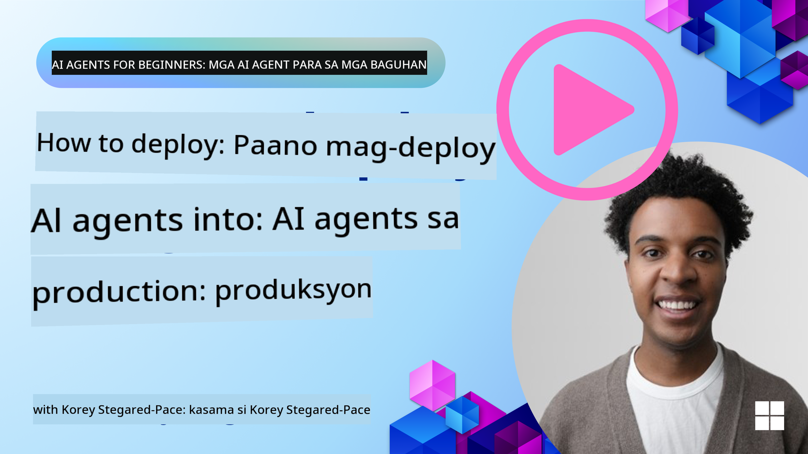

<!--
CO_OP_TRANSLATOR_METADATA:
{
  "original_hash": "1ad5de6a6388d02c145a92dd04358bab",
  "translation_date": "2025-07-12T13:40:57+00:00",
  "source_file": "10-ai-agents-production/README.md",
  "language_code": "tl"
}
-->

> _(I-click ang larawan sa itaas para mapanood ang video ng araling ito)_
# AI Agents sa Produksyon

## Panimula

Tatalakayin sa araling ito ang:

- Paano epektibong planuhin ang pag-deploy ng iyong AI Agent sa produksyon.
- Mga karaniwang pagkakamali at isyu na maaaring maranasan kapag nagde-deploy ng AI Agent sa produksyon.
- Paano pamahalaan ang gastos habang pinananatili ang performance ng iyong AI Agent.

## Mga Layunin sa Pagkatuto

Pagkatapos makumpleto ang araling ito, malalaman mo kung paano/maiintindihan mo ang:

- Mga teknik para mapabuti ang performance, gastos, at bisa ng isang production AI Agent system.
- Ano at paano susuriin ang iyong mga AI Agents.
- Paano kontrolin ang gastos kapag nagde-deploy ng AI Agents sa produksyon.

Mahalagang mag-deploy ng mga AI Agents na mapagkakatiwalaan. Tingnan din ang araling "Building Trustworthy AI Agents".

## Pagsusuri sa AI Agents

Bago, habang, at pagkatapos i-deploy ang AI Agents, mahalaga ang pagkakaroon ng tamang sistema para suriin ang iyong mga AI Agents. Titiyakin nito na ang iyong sistema ay naka-align sa iyong mga layunin at sa mga layunin ng iyong mga gumagamit.

Para masuri ang isang AI Agent, mahalagang masuri hindi lang ang output ng agent kundi pati na rin ang buong sistema kung saan ito gumagana. Kasama dito ngunit hindi limitado sa:

- Ang unang kahilingan sa modelo.
- Ang kakayahan ng agent na tukuyin ang intensyon ng gumagamit.
- Ang kakayahan ng agent na tukuyin ang tamang tool para gawin ang gawain.
- Ang tugon ng tool sa kahilingan ng agent.
- Ang kakayahan ng agent na unawain ang tugon ng tool.
- Ang feedback ng gumagamit sa tugon ng agent.

Pinapahintulutan ka nitong tuklasin ang mga bahagi na kailangang pagbutihin sa mas modular na paraan. Maaari mong subaybayan ang epekto ng mga pagbabago sa mga modelo, prompts, tools, at iba pang bahagi nang mas mahusay.

## Mga Karaniwang Isyu at Posibleng Solusyon sa AI Agents

| **Isyu**                                      | **Posibleng Solusyon**                                                                                                                                                                                                     |
| ---------------------------------------------- | -------------------------------------------------------------------------------------------------------------------------------------------------------------------------------------------------------------------------- |
| Hindi palaging nagagawa ng AI Agent ang mga gawain nang maayos     | - Pinuhin ang prompt na ibinibigay sa AI Agent; maging malinaw sa mga layunin. - Tukuyin kung saan makakatulong ang paghahati ng mga gawain sa mas maliliit na bahagi at paghawak nito ng maraming agents.                                                      |
| Paulit-ulit na loop na nararanasan ng AI Agent         | - Siguraduhing may malinaw na mga tuntunin kung kailan titigil ang proseso para malaman ng Agent kung kailan ito hihinto. - Para sa mga komplikadong gawain na nangangailangan ng pag-iisip at pagpaplano, gumamit ng mas malaking modelo na espesyalista sa mga ganitong gawain. |
| Hindi maayos ang pagganap ng mga tawag sa tool ng AI Agent    | - Subukan at patunayan ang output ng tool sa labas ng agent system. - Pinuhin ang mga tinukoy na parameter, prompts, at pangalan ng mga tools.                                                                                        |
| Hindi palaging consistent ang pagganap ng Multi-Agent system | - Pinuhin ang mga prompts na ibinibigay sa bawat agent upang matiyak na ito ay tiyak at naiiba sa isa't isa. - Gumawa ng hierarchical system gamit ang "routing" o controller agent para tukuyin kung alin ang tamang agent.         |

## Pamamahala ng Gastos

Narito ang ilang estratehiya para pamahalaan ang gastos sa pag-deploy ng AI Agents sa produksyon:

- **Caching Responses** - Tukuyin ang mga karaniwang kahilingan at gawain at ibigay ang mga sagot bago pa man dumaan sa iyong agentic system. Magandang paraan ito para mabawasan ang dami ng magkakaparehong kahilingan. Maaari ka ring magpatupad ng proseso para tukuyin kung gaano kahawig ang isang kahilingan sa iyong mga naka-cache na kahilingan gamit ang mas simpleng AI models.

- **Paggamit ng Mas Maliit na Modelo** - Ang Small Language Models (SLMs) ay maaaring mag-perform nang maayos sa ilang agentic use-cases at makakatipid nang malaki sa gastos. Tulad ng nabanggit, ang paggawa ng evaluation system para tukuyin at ikumpara ang performance laban sa mas malalaking modelo ang pinakamabisang paraan para maintindihan kung gaano kahusay ang SLM sa iyong use case.

- **Paggamit ng Router Model** - Isang katulad na estratehiya ang paggamit ng iba't ibang modelo at laki. Maaari kang gumamit ng LLM/SLM o serverless function para i-route ang mga kahilingan base sa komplikasyon sa mga pinaka-angkop na modelo. Makakatulong ito na mabawasan ang gastos habang pinapanatili ang performance sa tamang mga gawain.

## Congratulations

Ito na ang huling aralin ng "AI Agents for Beginners".

Plano naming magdagdag pa ng mga aralin base sa feedback at pagbabago sa patuloy na lumalaking industriya na ito kaya bumalik ka ulit sa malapit na hinaharap.

Kung nais mong ipagpatuloy ang iyong pag-aaral at paggawa gamit ang AI Agents, sumali sa <a href="https://discord.gg/kzRShWzttr" target="_blank">Azure AI Community Discord</a>.

Dito kami nagho-host ng mga workshop, community roundtables, at "ask me anything" sessions.

Mayroon din kaming Learn collection ng mga karagdagang materyales na makakatulong sa iyo na magsimulang bumuo ng AI Agents sa produksyon.

## Nakaraang Aralin

[Metacognition Design Pattern](../09-metacognition/README.md)

**Paalala**:  
Ang dokumentong ito ay isinalin gamit ang AI translation service na [Co-op Translator](https://github.com/Azure/co-op-translator). Bagamat nagsusumikap kami para sa katumpakan, pakatandaan na ang mga awtomatikong pagsasalin ay maaaring maglaman ng mga pagkakamali o di-tumpak na impormasyon. Ang orihinal na dokumento sa orihinal nitong wika ang dapat ituring na pangunahing sanggunian. Para sa mahahalagang impormasyon, inirerekomenda ang propesyonal na pagsasalin ng tao. Hindi kami mananagot sa anumang hindi pagkakaunawaan o maling interpretasyon na maaaring magmula sa paggamit ng pagsasaling ito.