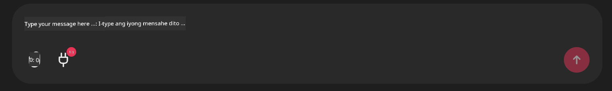

<!--
CO_OP_TRANSLATOR_METADATA:
{
  "original_hash": "9bf0395cbc541ce8db2a9699c8678dfc",
  "translation_date": "2025-07-12T14:23:58+00:00",
  "source_file": "11-mcp/code_samples/github-mcp/README.md",
  "language_code": "tl"
}
-->
# Github MCP Server Halimbawa

## Paglalarawan

Ito ay isang demo na ginawa para sa AI Agents Hackathon na inorganisa sa pamamagitan ng Microsoft Reactor.

Ginagamit ang mga tool na ito upang magrekomenda ng mga proyekto para sa hackathon base sa mga Github repos ng isang user. Ginagawa ito sa pamamagitan ng:

1. **Github Agent** - Ginagamit ang Github MCP Server para kunin ang mga repos at impormasyon tungkol sa mga ito.
2. **Hackathon Agent** - Kinukuha ang datos mula sa Github Agent at bumubuo ng mga malikhaing ideya para sa mga proyekto ng hackathon base sa mga proyekto, mga wikang ginagamit ng user, at mga project tracks para sa AI Agents hackathon.
3. **Events Agent** - Base sa mungkahi ng hackathon agent, magrerekomenda ang events agent ng mga kaugnay na events mula sa AI Agent Hackathon series.

## Pagpapatakbo ng code

### Mga Environment Variables

Gumagamit ang demo na ito ng Azure Open AI Service, Semantic Kernel, Github MCP Server, at Azure AI Search.

Siguraduhing naka-set nang tama ang mga environment variables para magamit ang mga tool na ito:

```python
AZURE_OPENAI_CHAT_DEPLOYMENT_NAME=""
AZURE_OPENAI_EMBEDDING_DEPLOYMENT_NAME=""
AZURE_OPENAI_ENDPOINT=""
AZURE_OPENAI_API_KEY=""
AZURE_OPENAI_API_VERSION=""
AZURE_SEARCH_SERVICE_ENDPOINT=""
AZURE_SEARCH_API_KEY=""
``` 

## Pagpapatakbo ng Chainlit Server

Para makakonekta sa MCP server, ginagamit ng demo na ito ang Chainlit bilang chat interface.

Para patakbuhin ang server, gamitin ang sumusunod na utos sa iyong terminal:

```bash
chainlit run app.py -w
```

Dapat nitong simulan ang iyong Chainlit server sa `localhost:8000` at sabay na punuin ang iyong Azure AI Search Index gamit ang nilalaman ng `event-descriptions.md`.

## Pagkonekta sa MCP Server

Para makakonekta sa Github MCP Server, piliin ang icon na "plug" sa ilalim ng chat box na "Type your message here..":



Mula doon, maaari mong i-click ang "Connect an MCP" para idagdag ang command na kumokonekta sa Github MCP Server:

```bash
npx -y @modelcontextprotocol/server-github --env GITHUB_PERSONAL_ACCESS_TOKEN=[YOUR PERSONAL ACCESS TOKEN]
```

Palitan ang "[YOUR PERSONAL ACCESS TOKEN]" ng iyong aktwal na Personal Access Token.

Pagkatapos makakonekta, dapat makita mo ang (1) sa tabi ng plug icon bilang kumpirmasyon na nakakonekta na ito. Kung hindi, subukang i-restart ang chainlit server gamit ang `chainlit run app.py -w`.

## Paggamit ng Demo

Para simulan ang workflow ng agent sa pagrerekomenda ng mga proyekto para sa hackathon, maaari kang mag-type ng mensahe tulad ng:

"Recommend hackathon projects for the Github user koreyspace"

Susuriin ng Router Agent ang iyong kahilingan at tutukuyin kung aling kombinasyon ng mga agent (GitHub, Hackathon, at Events) ang pinakaangkop para tugunan ang iyong query. Nagtutulungan ang mga agent upang magbigay ng komprehensibong rekomendasyon base sa pagsusuri ng Github repository, pagbuo ng ideya para sa proyekto, at mga kaugnay na tech events.

**Paalala**:  
Ang dokumentong ito ay isinalin gamit ang AI translation service na [Co-op Translator](https://github.com/Azure/co-op-translator). Bagamat nagsusumikap kami para sa katumpakan, pakatandaan na ang mga awtomatikong pagsasalin ay maaaring maglaman ng mga pagkakamali o di-tumpak na impormasyon. Ang orihinal na dokumento sa orihinal nitong wika ang dapat ituring na pangunahing sanggunian. Para sa mahahalagang impormasyon, inirerekomenda ang propesyonal na pagsasalin ng tao. Hindi kami mananagot sa anumang hindi pagkakaunawaan o maling interpretasyon na maaaring magmula sa paggamit ng pagsasaling ito.