<!--
CO_OP_TRANSLATOR_METADATA:
{
  "original_hash": "5cc6836626047aa055e8960c8484a7d0",
  "translation_date": "2025-08-21T14:49:38+00:00",
  "source_file": "11-mcp/code_samples/mcp-agents/README.md",
  "language_code": "tl"
}
-->
# Pagbuo ng Sistema ng Komunikasyon ng Agent-to-Agent gamit ang MCP

> TL;DR - Pwede bang magtayo ng Agent2Agent Communication sa MCP? Oo!

Ang MCP ay malaki ang naging pag-unlad mula sa orihinal nitong layunin na "magbigay ng konteksto sa LLMs". Sa mga kamakailang pagpapahusay tulad ng [resumable streams](https://modelcontextprotocol.io/docs/concepts/transports#resumability-and-redelivery), [elicitation](https://modelcontextprotocol.io/specification/2025-06-18/client/elicitation), [sampling](https://modelcontextprotocol.io/specification/2025-06-18/client/sampling), at mga notification ([progress](https://modelcontextprotocol.io/specification/2025-06-18/basic/utilities/progress) at [resources](https://modelcontextprotocol.io/specification/2025-06-18/schema#resourceupdatednotification)), ang MCP ay nagbibigay na ngayon ng matibay na pundasyon para sa pagbuo ng mga komplikadong sistema ng komunikasyon ng agent-to-agent.

## Ang Maling Akala Tungkol sa Agent/Tool

Habang mas maraming developer ang nag-eeksperimento sa mga tool na may agentic na pag-uugali (tumatakbo nang matagal, maaaring mangailangan ng karagdagang input habang nasa proseso, atbp.), isang karaniwang maling akala ay hindi angkop ang MCP, lalo na dahil ang mga maagang halimbawa ng tools primitive nito ay nakatuon sa simpleng request-response patterns.

Ang pananaw na ito ay lipas na. Ang MCP specification ay malaki ang naging pagpapahusay sa nakalipas na mga buwan, na nagbibigay ng kakayahan para sa pagbuo ng pangmatagalang agentic na pag-uugali:

- **Streaming at Partial Results**: Mga real-time na update sa progreso habang nasa proseso
- **Resumability**: Maaaring magpatuloy ang mga kliyente pagkatapos ng disconnection
- **Durability**: Ang mga resulta ay nananatili kahit mag-restart ang server (hal., sa pamamagitan ng resource links)
- **Multi-turn**: Interactive na input habang nasa proseso gamit ang elicitation at sampling

Ang mga kakayahang ito ay maaaring pagsamahin upang paganahin ang mga komplikadong agentic at multi-agent na aplikasyon, lahat ay nakadeploy sa MCP protocol.

Para sa sanggunian, tatawagin natin ang isang agent bilang isang "tool" na available sa isang MCP server. Ipinapahiwatig nito ang pagkakaroon ng isang host application na nagpapatupad ng MCP client na nagtatatag ng session sa MCP server at maaaring tumawag sa agent.

## Ano ang Gumagawa ng MCP Tool na "Agentic"?

Bago sumabak sa implementasyon, tukuyin muna natin kung anong mga kakayahan sa imprastraktura ang kinakailangan upang suportahan ang pangmatagalang agents.

> Tukuyin natin ang isang agent bilang isang entity na maaaring gumana nang autonomously sa mahabang panahon, na may kakayahang maghawak ng mga komplikadong gawain na maaaring mangailangan ng maraming interaksyon o pagsasaayos batay sa real-time na feedback.

### 1. Streaming at Partial Results

Hindi gumagana ang tradisyunal na request-response patterns para sa pangmatagalang gawain. Kailangang magbigay ang mga agents ng:

- Mga real-time na update sa progreso
- Mga intermediate na resulta

**Suporta ng MCP**: Ang resource update notifications ay nagbibigay-daan sa streaming ng partial results, bagaman nangangailangan ito ng maingat na disenyo upang maiwasan ang mga conflict sa 1:1 request/response model ng JSON-RPC.

| Tampok                     | Gamit                                                                                                                                                                       | Suporta ng MCP                                                                            |
| -------------------------- | -------------------------------------------------------------------------------------------------------------------------------------------------------------------------- | ---------------------------------------------------------------------------------------- |
| Real-time Progress Updates | Humiling ang user ng codebase migration task. Ang agent ay nag-stream ng progreso: "10% - Sinusuri ang dependencies... 25% - Kinoconvert ang TypeScript files... 50% - Ina-update ang imports..." | ✅ Progress notifications                                                                |
| Partial Results            | Ang "Generate a book" task ay nag-stream ng partial results, hal., 1) Story arc outline, 2) Listahan ng mga kabanata, 3) Bawat kabanata habang natatapos. Maaaring suriin, kanselahin, o i-redirect ng host sa anumang yugto. | ✅ Ang mga notification ay maaaring "palawakin" upang isama ang partial results, tingnan ang mga proposal sa PR 383, 776 |

<div align="center" style="font-style: italic; font-size: 0.95em; margin-bottom: 0.5em;">
<strong>Figure 1:</strong> Ang diagram na ito ay nagpapakita kung paano nag-stream ang isang MCP agent ng mga real-time na update sa progreso at partial results sa host application habang nasa pangmatagalang gawain, na nagbibigay-daan sa user na subaybayan ang proseso sa real time.
</div>


### 2. Resumability

Kailangang mag-handle ng mga agents ng mga network interruptions nang maayos:

- Mag-reconnect pagkatapos ng (client) disconnection
- Magpatuloy mula sa kung saan sila tumigil (message redelivery)

**Suporta ng MCP**: Ang MCP StreamableHTTP transport ay sumusuporta ngayon sa session resumption at message redelivery gamit ang session IDs at last event IDs. Ang mahalagang tandaan dito ay kailangang magpatupad ang server ng EventStore na nagbibigay-daan sa event replays sa client reconnection.  
Tandaan na mayroong community proposal (PR #975) na nag-eeksplora ng transport-agnostic resumable streams.

| Tampok        | Gamit                                                                                                                                                   | Suporta ng MCP                                                            |
| ------------- | ------------------------------------------------------------------------------------------------------------------------------------------------------- | ------------------------------------------------------------------------ |
| Resumability  | Ang client ay nag-disconnect habang nasa pangmatagalang gawain. Sa pag-reconnect, ang session ay nagpatuloy na may mga na-miss na event na na-replay, na nagpatuloy nang walang abala. | ✅ StreamableHTTP transport na may session IDs, event replay, at EventStore |

```mermaid
sequenceDiagram
    participant User
    participant Host as Host App<br/>(MCP Client)
    participant Server as MCP Server<br/>(Agent Tool)
    participant Store as Event Store

    User->>Host: Start task
    Host->>Server: Call tool [session: abc123]
    Server->>Store: Save events

    Note over Host,Server: 💥 Connection lost

    Host->>Server: Reconnect [session: abc123]
    Store-->>Server: Replay events
    Server-->>Host: Catch up + continue
    Host-->>User: ✅ Complete
```

<div align="center" style="font-style: italic; font-size: 0.95em; margin-bottom: 0.5em;">
<strong>Figure 2:</strong> Ang diagram na ito ay nagpapakita kung paano nagbibigay-daan ang StreamableHTTP transport ng MCP at event store sa seamless session resumption: kung mag-disconnect ang client, maaari itong mag-reconnect at i-replay ang mga na-miss na event, na nagpapatuloy sa gawain nang walang pagkawala ng progreso.
</div>



### 3. Durability

Kailangang magkaroon ng persistent state ang mga pangmatagalang agents:

- Ang mga resulta ay nananatili kahit mag-restart ang server
- Maaaring makuha ang status sa labas ng session
- Pagsubaybay sa progreso sa pagitan ng mga session

**Suporta ng MCP**: Ang MCP ay sumusuporta na ngayon sa Resource link return type para sa tool calls. Sa kasalukuyan, isang posibleng pattern ay magdisenyo ng tool na gumagawa ng resource at agad na nagbabalik ng resource link. Ang tool ay maaaring magpatuloy sa pag-address sa gawain sa background at i-update ang resource. Sa turn, maaaring piliin ng client na i-poll ang estado ng resource na ito upang makuha ang partial o full results (batay sa kung anong resource updates ang ibinibigay ng server) o mag-subscribe sa resource para sa update notifications.

Isang limitasyon dito ay ang pag-poll ng resources o pag-subscribe para sa updates ay maaaring gumamit ng resources na may implikasyon sa scale. Mayroong bukas na community proposal (kasama ang #992) na nag-eeksplora ng posibilidad ng pagdaragdag ng webhooks o triggers na maaaring tawagan ng server upang i-notify ang client/host application ng updates.

| Tampok      | Gamit                                                                                                                                         | Suporta ng MCP                                                    |
| ----------- | --------------------------------------------------------------------------------------------------------------------------------------------- | ---------------------------------------------------------------- |
| Durability  | Ang server ay nag-crash habang nasa data migration task. Ang mga resulta at progreso ay nananatili pagkatapos ng restart, maaaring suriin ng client ang status at magpatuloy mula sa persistent resource. | ✅ Resource links na may persistent storage at status notifications |

Sa kasalukuyan, isang karaniwang pattern ay magdisenyo ng tool na gumagawa ng resource at agad na nagbabalik ng resource link. Ang tool ay maaaring mag-address sa gawain sa background, mag-issue ng resource notifications na nagsisilbing progress updates o mag-include ng partial results, at i-update ang content sa resource kung kinakailangan.

```mermaid
sequenceDiagram
    participant User
    participant Host as Host App<br/>(MCP Client)
    participant Server as MCP Server<br/>(Agent Tool)
    participant DB as Persistent Storage

    User->>Host: Start task
    Host->>Server: Call tool
    Server->>DB: Create resource + updates
    Server-->>Host: 🔗 Resource link

    Note over Server: 💥 Server restart

    User->>Host: Check status
    Host->>Server: Get resource
    Server->>DB: Load state
    Server-->>Host: Current progress
    Server->>DB: Complete + notify
    Host-->>User: ✅ Complete
```

<div align="center" style="font-style: italic; font-size: 0.95em; margin-bottom: 0.5em;">
<strong>Figure 3:</strong> Ang diagram na ito ay nagpapakita kung paano ginagamit ng MCP agents ang persistent resources at status notifications upang matiyak na ang pangmatagalang gawain ay nananatili kahit mag-restart ang server, na nagbibigay-daan sa mga client na suriin ang progreso at makuha ang mga resulta kahit pagkatapos ng mga failure.
</div>



### 4. Multi-Turn Interactions

Kadalasan, kailangan ng mga agents ng karagdagang input habang nasa proseso:

- Paglilinaw o pag-apruba mula sa tao
- Tulong ng AI para sa mga komplikadong desisyon
- Dynamic na pagsasaayos ng parameter

**Suporta ng MCP**: Ganap na suportado sa pamamagitan ng sampling (para sa AI input) at elicitation (para sa human input).

| Tampok                 | Gamit                                                                                                                                     | Suporta ng MCP                                       |
| ---------------------- | ----------------------------------------------------------------------------------------------------------------------------------------- | --------------------------------------------------- |
| Multi-Turn Interactions | Ang travel booking agent ay humihiling ng kumpirmasyon ng presyo mula sa user, pagkatapos ay humihiling sa AI na i-summarize ang travel data bago tapusin ang booking transaction. | ✅ Elicitation para sa human input, sampling para sa AI input |

```mermaid
sequenceDiagram
    participant User
    participant Host as Host App<br/>(MCP Client)
    participant Server as MCP Server<br/>(Agent Tool)

    User->>Host: Book flight
    Host->>Server: Call travel_agent

    Server->>Host: Elicitation: "Confirm $500?"
    Note over Host: Elicitation callback (if available)
    Host->>User: 💰 Confirm price?
    User->>Host: "Yes"
    Host->>Server: Confirmed

    Server->>Host: Sampling: "Summarize data"
    Note over Host: AI callback (if available)
    Host->>Server: Report summary

    Server->>Host: ✅ Flight booked
```

<div align="center" style="font-style: italic; font-size: 0.95em; margin-bottom: 0.5em;">
<strong>Figure 4:</strong> Ang diagram na ito ay nagpapakita kung paano maaaring mag-interactively elicit ng human input o humiling ng AI assistance ang MCP agents habang nasa proseso, na sumusuporta sa mga komplikado at multi-turn na workflows tulad ng mga kumpirmasyon at dynamic na desisyon.
</div>



## Pagpapatupad ng Pangmatagalang Agents sa MCP - Code Overview

Bilang bahagi ng artikulong ito, nagbibigay kami ng [code repository](https://github.com/victordibia/ai-tutorials/tree/main/MCP%20Agents) na naglalaman ng kumpletong implementasyon ng pangmatagalang agents gamit ang MCP Python SDK na may StreamableHTTP transport para sa session resumption at message redelivery. Ang implementasyon ay nagpapakita kung paano maaaring pagsamahin ang mga kakayahan ng MCP upang paganahin ang sopistikadong agent-like behaviors.

Partikular, nagpatupad kami ng server na may dalawang pangunahing agent tools:

- **Travel Agent** - Nag-simulate ng travel booking service na may kumpirmasyon ng presyo sa pamamagitan ng elicitation
- **Research Agent** - Gumagawa ng research tasks na may AI-assisted summaries sa pamamagitan ng sampling

Parehong agents ay nagpapakita ng real-time progress updates, interactive confirmations, at full session resumption capabilities.

### Mga Pangunahing Konsepto sa Implementasyon

Ang mga sumusunod na seksyon ay nagpapakita ng server-side agent implementation at client-side host handling para sa bawat kakayahan:

#### Streaming at Progress Updates - Real-time na Status ng Gawain

Ang streaming ay nagbibigay-daan sa mga agents na magbigay ng real-time progress updates habang nasa pangmatagalang gawain, na nagpapanatili sa user na may kaalaman sa status ng gawain at intermediate results.

**Server Implementation (agent nagpapadala ng progress notifications):**

```python
# From server/server.py - Travel agent sending progress updates
for i, step in enumerate(steps):
    await ctx.session.send_progress_notification(
        progress_token=ctx.request_id,
        progress=i * 25,
        total=100,
        message=step,
        related_request_id=str(ctx.request_id)
    )
    await anyio.sleep(2)  # Simulate work

# Alternative: Log messages for detailed step-by-step updates
await ctx.session.send_log_message(
    level="info",
    data=f"Processing step {current_step}/{steps} ({progress_percent}%)",
    logger="long_running_agent",
    related_request_id=ctx.request_id,
)
```

**Client Implementation (host tumatanggap ng progress updates):**

```python
# From client/client.py - Client handling real-time notifications
async def message_handler(message) -> None:
    if isinstance(message, types.ServerNotification):
        if isinstance(message.root, types.LoggingMessageNotification):
            console.print(f"📡 [dim]{message.root.params.data}[/dim]")
        elif isinstance(message.root, types.ProgressNotification):
            progress = message.root.params
            console.print(f"🔄 [yellow]{progress.message} ({progress.progress}/{progress.total})[/yellow]")

# Register message handler when creating session
async with ClientSession(
    read_stream, write_stream,
    message_handler=message_handler
) as session:
```

#### Elicitation - Paghingi ng Input mula sa User

Ang elicitation ay nagbibigay-daan sa mga agents na humiling ng input mula sa user habang nasa proseso. Mahalaga ito para sa mga kumpirmasyon, paglilinaw, o pag-apruba sa pangmatagalang gawain.

**Server Implementation (agent humihiling ng kumpirmasyon):**

```python
# From server/server.py - Travel agent requesting price confirmation
elicit_result = await ctx.session.elicit(
    message=f"Please confirm the estimated price of $1200 for your trip to {destination}",
    requestedSchema=PriceConfirmationSchema.model_json_schema(),
    related_request_id=ctx.request_id,
)

if elicit_result and elicit_result.action == "accept":
    # Continue with booking
    logger.info(f"User confirmed price: {elicit_result.content}")
elif elicit_result and elicit_result.action == "decline":
    # Cancel the booking
    booking_cancelled = True
```

**Client Implementation (host nagbibigay ng elicitation callback):**

```python
# From client/client.py - Client handling elicitation requests
async def elicitation_callback(context, params):
    console.print(f"💬 Server is asking for confirmation:")
    console.print(f"   {params.message}")

    response = console.input("Do you accept? (y/n): ").strip().lower()

    if response in ['y', 'yes']:
        return types.ElicitResult(
            action="accept",
            content={"confirm": True, "notes": "Confirmed by user"}
        )
    else:
        return types.ElicitResult(
            action="decline",
            content={"confirm": False, "notes": "Declined by user"}
        )

# Register the callback when creating the session
async with ClientSession(
    read_stream, write_stream,
    elicitation_callback=elicitation_callback
) as session:
```

#### Sampling - Paghingi ng Tulong mula sa AI

Ang sampling ay nagbibigay-daan sa mga agents na humiling ng tulong mula sa LLM para sa mga komplikadong desisyon o content generation habang nasa proseso. Pinapagana nito ang hybrid human-AI workflows.

**Server Implementation (agent humihiling ng tulong mula sa AI):**

```python
# From server/server.py - Research agent requesting AI summary
sampling_result = await ctx.session.create_message(
    messages=[
        SamplingMessage(
            role="user",
            content=TextContent(type="text", text=f"Please summarize the key findings for research on: {topic}")
        )
    ],
    max_tokens=100,
    related_request_id=ctx.request_id,
)

if sampling_result and sampling_result.content:
    if sampling_result.content.type == "text":
        sampling_summary = sampling_result.content.text
        logger.info(f"Received sampling summary: {sampling_summary}")
```

**Client Implementation (host nagbibigay ng sampling callback):**

```python
# From client/client.py - Client handling sampling requests
async def sampling_callback(context, params):
    message_text = params.messages[0].content.text if params.messages else 'No message'
    console.print(f"🧠 Server requested sampling: {message_text}")

    # In a real application, this could call an LLM API
    # For demo purposes, we provide a mock response
    mock_response = "Based on current research, MCP has evolved significantly..."

    return types.CreateMessageResult(
        role="assistant",
        content=types.TextContent(type="text", text=mock_response),
        model="interactive-client",
        stopReason="endTurn"
    )

# Register the callback when creating the session
async with ClientSession(
    read_stream, write_stream,
    sampling_callback=sampling_callback,
    elicitation_callback=elicitation_callback
) as session:
```

#### Resumability - Pagpapatuloy ng Session sa Gitna ng Disconnections

Ang resumability ay tinitiyak na ang pangmatagalang gawain ng agent ay maaaring magpatuloy kahit mag-disconnect ang client at seamless na magpatuloy sa pag-reconnect. Ito ay ipinatupad sa pamamagitan ng event stores at resumption tokens.

**Event Store Implementation (server nagtatago ng session state):**

```python
# From server/event_store.py - Simple in-memory event store
class SimpleEventStore(EventStore):
    def __init__(self):
        self._events: list[tuple[StreamId, EventId, JSONRPCMessage]] = []
        self._event_id_counter = 0

    async def store_event(self, stream_id: StreamId, message: JSONRPCMessage) -> EventId:
        """Store an event and return its ID."""
        self._event_id_counter += 1
        event_id = str(self._event_id_counter)
        self._events.append((stream_id, event_id, message))
        return event_id

    async def replay_events_after(self, last_event_id: EventId, send_callback: EventCallback) -> StreamId | None:
        """Replay events after the specified ID for resumption."""
        # Find events after the last known event and replay them
        for _, event_id, message in self._events[start_index:]:
            await send_callback(EventMessage(message, event_id))

# From server/server.py - Passing event store to session manager
def create_server_app(event_store: Optional[EventStore] = None) -> Starlette:
    server = ResumableServer()

    # Create session manager with event store for resumption
    session_manager = StreamableHTTPSessionManager(
        app=server,
        event_store=event_store,  # Event store enables session resumption
        json_response=False,
        security_settings=security_settings,
    )

    return Starlette(routes=[Mount("/mcp", app=session_manager.handle_request)])

# Usage: Initialize with event store
event_store = SimpleEventStore()
app = create_server_app(event_store)
```

**Client Metadata with Resumption Token (client nagre-reconnect gamit ang stored state):**

```python
# From client/client.py - Client resumption with metadata
if existing_tokens and existing_tokens.get("resumption_token"):
    # Use existing resumption token to continue where we left off
    metadata = ClientMessageMetadata(
        resumption_token=existing_tokens["resumption_token"],
    )
else:
    # Create callback to save resumption token when received
    def enhanced_callback(token: str):
        protocol_version = getattr(session, 'protocol_version', None)
        token_manager.save_tokens(session_id, token, protocol_version, command, args)

    metadata = ClientMessageMetadata(
        on_resumption_token_update=enhanced_callback,
    )

# Send request with resumption metadata
result = await session.send_request(
    types.ClientRequest(
        types.CallToolRequest(
            method="tools/call",
            params=types.CallToolRequestParams(name=command, arguments=args)
        )
    ),
    types.CallToolResult,
    metadata=metadata,
)
```

Ang host application ay nagtatago ng session IDs at resumption tokens nang lokal, na nagbibigay-daan dito na mag-reconnect sa mga existing sessions nang hindi nawawala ang progreso o estado.

### Organisasyon ng Code

<div align="center" style="font-style: italic; font-size: 0.95em; margin-bottom: 0.5em;">
<strong>Figure 5:</strong> Arkitektura ng sistema ng agent na nakabase sa MCP
</div>


**Pangunahing Files:**

- **`server/server.py`** - Resumable MCP server na may travel at research agents na nagpapakita ng elicitation, sampling, at progress updates
- **`client/client.py`** - Interactive host application na may resumption support, callback handlers, at token management
- **`server/event_store.py`** - Event store implementation na nagbibigay-daan sa session resumption at message redelivery

## Pagpapalawak sa Multi-Agent Communication sa MCP

Ang implementasyon sa itaas ay maaaring palawakin sa multi-agent systems sa pamamagitan ng pagpapahusay sa intelligence at saklaw ng host application:

- **Intelligent Task Decomposition**: Sinusuri ng host ang mga komplikadong kahilingan ng user at hinahati ang mga ito sa mga subtask para sa iba't ibang specialized agents
- **Multi-Server Coordination**: Pinapanatili ng host ang koneksyon sa maraming MCP servers, bawat isa ay nag-eexpose ng iba't ibang kakayahan ng agent
- **Task State Management**: Sinusubaybayan ng host ang progreso sa maraming sabay-sabay na agent tasks, hinahandle ang dependencies at sequencing
- **Resilience & Retries**: Pinamamahalaan ng host ang mga failure, nagpapatupad ng retry logic, at nire-reroute ang mga gawain kapag hindi available ang mga agents
- **Result Synthesis**: Pinagsasama ng host ang mga output mula sa maraming agents sa coherent na final results

Ang host ay nag-evolve mula sa simpleng client patungo sa intelligent orchestrator, na nagko-coordinate ng distributed agent capabilities habang pinapanatili ang parehong pundasyon ng MCP protocol.

## Konklusyon

Ang mga pagpapahusay ng MCP - resource notifications, elicitation/sampling, resumable streams, at persistent resources - ay nagbibigay-daan sa mga komplikadong interaksyon ng agent-to-agent habang pinapanatili ang simplicity ng protocol.

## Pagsisimula

Handa ka na bang bumuo ng sarili mong agent2agent system? Sundin ang mga hakbang na ito:

### 1. Patakbuhin ang Demo

```bash
# Start the server with event store for resumption
python -m server.server --port 8006

# In another terminal, run the interactive client
python -m client.client --url http://127.0.0.1:8006/mcp
```

**Available na mga command sa interactive mode:**

- `travel_agent` - Mag-book ng travel na may kumpirmasyon ng presyo sa pamamagitan ng elicitation
- `research_agent` - Mag-research ng mga paksa na may AI-assisted summaries sa pamamagitan ng sampling
- `list` - Ipakita ang lahat ng available na tools
- `clean-tokens` - I-clear ang resumption tokens
- `help` - Ipakita ang detalyadong tulong sa command
- `quit` - Lumabas sa client

### 2. Subukan ang Resumption Capabilities

- Simulan ang pangmatagalang agent (hal., `travel_agent`)
- I-interrupt ang client habang nasa proseso (Ctrl+C)
- I-restart ang client - awtomatiko itong magpapatuloy mula sa kung saan ito tumigil

### 3. Mag-eksperimento at Magpalawak

- **Eksplorahin ang mga halimbawa**: Tingnan ang [mcp-agents](https://github.com/victordibia/ai-tutorials/tree/main/MCP%20Agents)
- **Sumali sa komunidad**: Makilahok sa mga talakayan ng MCP sa GitHub
- **Mag-eksperimento**: Magsimula sa simpleng pangmatagalang gawain at unti-unting magdagdag ng streaming, resumability, at multi-agent coordination

Ipinapakita nito kung paano pinapagana ng MCP ang intelligent agent behaviors habang pinapanatili ang simplicity ng tool-based approach.

Sa kabuuan, ang MCP protocol spec ay mabilis na umuunlad; hinihikayat ang mambabasa na suriin ang opisyal na website ng dokumentasyon para sa pinakabagong updates - https://modelcontextprotocol.io/introduction

**Paunawa**:  
Ang dokumentong ito ay isinalin gamit ang AI translation service na [Co-op Translator](https://github.com/Azure/co-op-translator). Bagama't sinisikap naming maging tumpak, pakitandaan na ang mga awtomatikong pagsasalin ay maaaring maglaman ng mga pagkakamali o hindi pagkakatugma. Ang orihinal na dokumento sa kanyang orihinal na wika ang dapat ituring na opisyal na sanggunian. Para sa mahalagang impormasyon, inirerekomenda ang propesyonal na pagsasalin ng tao. Hindi kami mananagot sa anumang hindi pagkakaunawaan o maling interpretasyon na maaaring magmula sa paggamit ng pagsasaling ito.