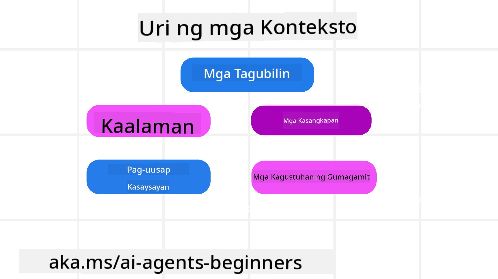
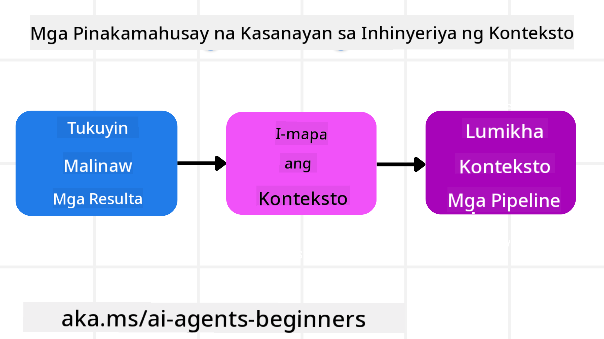

<!--
CO_OP_TRANSLATOR_METADATA:
{
  "original_hash": "cb7e50f471905ce6fdb92a30269a7a98",
  "translation_date": "2025-09-04T10:21:14+00:00",
  "source_file": "12-context-engineering/README.md",
  "language_code": "tl"
}
-->
# Context Engineering para sa AI Agents

> _(I-click ang imahe sa itaas para mapanood ang video ng araling ito)_

Mahalaga ang pag-unawa sa pagiging komplikado ng aplikasyon na ginagawa mo para sa isang AI agent upang makabuo ng maaasahang sistema. Kailangan nating bumuo ng AI Agents na epektibong namamahala ng impormasyon upang matugunan ang mas kumplikadong pangangailangan na lampas sa prompt engineering.

Sa araling ito, tatalakayin natin kung ano ang context engineering at ang papel nito sa pagbuo ng AI agents.

## Panimula

Saklaw ng araling ito ang:

• **Ano ang Context Engineering** at bakit ito naiiba sa prompt engineering.

• **Mga Estratehiya para sa Epektibong Context Engineering**, kabilang ang pagsusulat, pagpili, pag-compress, at pag-isolate ng impormasyon.

• **Karaniwang Pagkabigo sa Context** na maaaring makasira sa iyong AI agent at kung paano ito maaayos.

## Mga Layunin sa Pag-aaral

Pagkatapos makumpleto ang araling ito, mauunawaan mo kung paano:

• **Ilarawan ang context engineering** at ihiwalay ito mula sa prompt engineering.

• **Kilalanin ang mga pangunahing bahagi ng context** sa mga aplikasyon ng Large Language Model (LLM).

• **Gamitin ang mga estratehiya sa pagsusulat, pagpili, pag-compress, at pag-isolate ng context** upang mapabuti ang performance ng agent.

• **Kilalanin ang mga karaniwang pagkabigo sa context** tulad ng poisoning, distraction, confusion, at clash, at magpatupad ng mga teknik para maiwasan ito.

## Ano ang Context Engineering?

Para sa AI Agents, ang context ang nagdidikta kung paano magplano ang AI Agent upang magsagawa ng mga partikular na aksyon. Ang Context Engineering ay ang pagsasanay ng pagtiyak na ang AI Agent ay may tamang impormasyon upang makumpleto ang susunod na hakbang ng gawain. Limitado ang laki ng context window, kaya bilang mga tagabuo ng agent, kailangan nating bumuo ng mga sistema at proseso upang pamahalaan ang pagdaragdag, pag-aalis, at pag-condense ng impormasyon sa context window.

### Prompt Engineering vs Context Engineering

Ang prompt engineering ay nakatuon sa isang set ng static na mga instruksyon upang epektibong gabayan ang AI Agents gamit ang mga patakaran. Ang context engineering naman ay tungkol sa pamamahala ng dynamic na set ng impormasyon, kabilang ang paunang prompt, upang matiyak na ang AI Agent ay may kailangan nito sa paglipas ng panahon. Ang pangunahing ideya sa context engineering ay gawing maulit at maaasahan ang prosesong ito.

### Mga Uri ng Context

Mahalagang tandaan na ang context ay hindi lamang isang bagay. Ang impormasyon na kailangan ng AI Agent ay maaaring magmula sa iba't ibang pinagmulan, at nasa atin ang responsibilidad na tiyakin na may access ang agent sa mga ito:

Ang mga uri ng context na maaaring pamahalaan ng AI agent ay kinabibilangan ng:

• **Mga Instruksyon:** Ito ang "mga patakaran" ng agent – prompts, system messages, few-shot examples (pagpapakita sa AI kung paano gawin ang isang bagay), at mga deskripsyon ng mga tool na maaari nitong gamitin. Dito nagtatagpo ang focus ng prompt engineering at context engineering.

• **Kaalaman:** Saklaw nito ang mga katotohanan, impormasyon na nakuha mula sa mga database, o mga long-term memory na naipon ng agent. Kasama rito ang pag-integrate ng Retrieval Augmented Generation (RAG) system kung kailangan ng agent ng access sa iba't ibang knowledge stores at databases.

• **Mga Tool:** Ito ang mga deskripsyon ng external functions, APIs, at MCP Servers na maaaring tawagin ng agent, kasama ang feedback (mga resulta) na nakukuha nito mula sa paggamit ng mga ito.

• **Kasaysayan ng Usapan:** Ang patuloy na diyalogo sa isang user. Habang tumatagal, nagiging mas mahaba at mas kumplikado ang mga usapan, na nangangahulugang kumakain ito ng espasyo sa context window.

• **Mga Kagustuhan ng User:** Impormasyon na natutunan tungkol sa mga gusto o ayaw ng user sa paglipas ng panahon. Maaaring itago ang mga ito at tawagin kapag gumagawa ng mahahalagang desisyon upang matulungan ang user.

## Mga Estratehiya para sa Epektibong Context Engineering

### Mga Estratehiya sa Pagpaplano

Ang mahusay na context engineering ay nagsisimula sa mahusay na pagpaplano. Narito ang isang paraan upang simulan ang pag-iisip kung paano ilapat ang konsepto ng context engineering:

1. **Tukuyin ang Malinaw na Resulta** - Ang mga resulta ng mga gawain na itatalaga sa AI Agents ay dapat malinaw na tukuyin. Sagutin ang tanong - "Ano ang magiging hitsura ng mundo kapag natapos na ng AI Agent ang gawain nito?" Sa madaling salita, anong pagbabago, impormasyon, o tugon ang dapat makuha ng user pagkatapos makipag-ugnayan sa AI Agent.

2. **I-map ang Context** - Kapag natukoy mo na ang mga resulta ng AI Agent, kailangan mong sagutin ang tanong na "Anong impormasyon ang kailangan ng AI Agent upang makumpleto ang gawain na ito?" Sa ganitong paraan, maaari mong simulan ang pag-mapa ng context kung saan matatagpuan ang impormasyon.

3. **Gumawa ng Context Pipelines** - Ngayon na alam mo kung saan matatagpuan ang impormasyon, kailangan mong sagutin ang tanong "Paano makukuha ng Agent ang impormasyong ito?" Maaari itong gawin sa iba't ibang paraan kabilang ang RAG, paggamit ng MCP servers, at iba pang tools.

### Mga Praktikal na Estratehiya

Mahalaga ang pagpaplano, ngunit kapag nagsimulang dumaloy ang impormasyon sa context window ng agent, kailangan nating magkaroon ng mga praktikal na estratehiya upang pamahalaan ito:

#### Pamamahala ng Context

Habang ang ilang impormasyon ay awtomatikong idadagdag sa context window, ang context engineering ay tungkol sa mas aktibong pamamahala ng impormasyong ito na maaaring gawin sa pamamagitan ng ilang estratehiya:

1. **Agent Scratchpad**  
Pinapayagan nito ang AI Agent na magtala ng mga mahalagang impormasyon tungkol sa kasalukuyang gawain at pakikipag-ugnayan sa user sa isang session. Dapat itong umiiral sa labas ng context window sa isang file o runtime object na maaaring kunin ng agent sa session na ito kung kinakailangan.

2. **Mga Memorya**  
Ang mga scratchpad ay maganda para sa pamamahala ng impormasyon sa labas ng context window ng isang session. Ang mga memorya ay nagbibigay-daan sa mga agent na mag-imbak at mag-retrieve ng mahalagang impormasyon sa maraming session. Kasama rito ang mga buod, kagustuhan ng user, at feedback para sa mga pagpapabuti sa hinaharap.

3. **Pag-compress ng Context**  
Kapag lumalaki ang context window at malapit nang maabot ang limitasyon nito, maaaring gamitin ang mga teknik tulad ng summarization at trimming. Kasama rito ang pagpapanatili lamang ng pinaka-mahalagang impormasyon o pag-aalis ng mas lumang mga mensahe.

4. **Multi-Agent Systems**  
Ang pagbuo ng multi-agent system ay isang anyo ng context engineering dahil ang bawat agent ay may sariling context window. Ang paraan ng pagbabahagi at pagpapasa ng context sa iba't ibang agent ay isa pang bagay na dapat planuhin kapag bumubuo ng mga sistemang ito.

5. **Sandbox Environments**  
Kung kailangan ng agent na magpatakbo ng code o magproseso ng malaking dami ng impormasyon sa isang dokumento, maaaring gumamit ng maraming tokens upang iproseso ang mga resulta. Sa halip na itago ang lahat ng ito sa context window, maaaring gumamit ang agent ng sandbox environment na kayang magpatakbo ng code at basahin lamang ang mga resulta at iba pang mahalagang impormasyon.

6. **Runtime State Objects**  
Ginagawa ito sa pamamagitan ng paglikha ng mga container ng impormasyon upang pamahalaan ang mga sitwasyon kung saan kailangan ng Agent na magkaroon ng access sa partikular na impormasyon. Para sa isang komplikadong gawain, papayagan nito ang Agent na mag-imbak ng mga resulta ng bawat subtask step-by-step, na pinapanatili ang context na konektado lamang sa partikular na subtask.

### Halimbawa ng Context Engineering

Halimbawa, gusto mong sabihin sa AI agent na **"Mag-book ng biyahe papuntang Paris."**

• Ang isang simpleng agent na gumagamit lamang ng prompt engineering ay maaaring tumugon ng: **"Okay, kailan mo gustong pumunta sa Paris?"**. Pinroseso lamang nito ang direktang tanong mo sa oras na tinanong mo ito.

• Ang isang agent na gumagamit ng mga estratehiya sa context engineering na tinalakay ay gagawa ng mas marami pa. Bago pa man tumugon, maaaring:

  ◦ **Suriin ang iyong kalendaryo** para sa mga available na petsa (pagkuha ng real-time na data).

 ◦ **Alalahanin ang mga nakaraang kagustuhan sa paglalakbay** (mula sa long-term memory) tulad ng paborito mong airline, budget, o kung mas gusto mo ang direct flights.

 ◦ **Kilalanin ang mga available na tools** para sa pag-book ng flight at hotel.

- Pagkatapos, ang isang halimbawa ng tugon ay maaaring: "Hi [Pangalan Mo]! Nakikita kong libre ka sa unang linggo ng Oktubre. Gusto mo bang maghanap ako ng direct flights papuntang Paris sa [Preferred Airline] na pasok sa karaniwang budget mo na [Budget]?" Ang mas mayaman at may context na tugon na ito ay nagpapakita ng kapangyarihan ng context engineering.

## Karaniwang Pagkabigo sa Context

### Context Poisoning

**Ano ito:** Kapag ang isang hallucination (maling impormasyon na nabuo ng LLM) o error ay pumasok sa context at paulit-ulit na tinutukoy, nagiging sanhi ito ng agent na magpatuloy sa imposibleng layunin o bumuo ng walang kwentang estratehiya.

**Ano ang gagawin:** Magpatupad ng **context validation** at **quarantine**. I-validate ang impormasyon bago ito idagdag sa long-term memory. Kung may nakitang posibleng poisoning, magsimula ng bagong context threads upang maiwasan ang pagkalat ng maling impormasyon.

**Halimbawa sa Pag-book ng Biyahe:** Ang iyong agent ay nag-hallucinate ng **direct flight mula sa isang maliit na lokal na paliparan papunta sa isang malayong internasyonal na lungsod** na hindi naman talaga nag-aalok ng internasyonal na flights. Ang detalyeng ito ay nai-save sa context. Kapag humiling ka na mag-book, patuloy nitong hinahanap ang tiket para sa imposibleng ruta, na nagdudulot ng paulit-ulit na error.

**Solusyon:** Magpatupad ng hakbang na **i-validate ang pagkakaroon ng flight at mga ruta gamit ang real-time API** _bago_ idagdag ang detalyeng ito sa working context ng agent. Kung nabigo ang validation, ang maling impormasyon ay "quarantined" at hindi na ginagamit pa.

### Context Distraction

**Ano ito:** Kapag ang context ay naging sobrang laki, ang modelo ay masyadong nakatuon sa naipon na kasaysayan sa halip na gamitin ang natutunan nito sa training, na nagdudulot ng paulit-ulit o hindi kapaki-pakinabang na aksyon. Ang mga modelo ay maaaring magsimulang magkamali kahit bago pa mapuno ang context window.

**Ano ang gagawin:** Gumamit ng **context summarization**. Regular na i-compress ang naipon na impormasyon sa mas maikling buod, pinapanatili ang mahahalagang detalye habang inaalis ang mga redundant na kasaysayan. Nakakatulong ito na "i-reset" ang focus.

**Halimbawa sa Pag-book ng Biyahe:** Matagal mo nang pinag-uusapan ang iba't ibang destinasyon sa paglalakbay, kabilang ang detalyadong kwento ng iyong backpacking trip mula dalawang taon na ang nakalipas. Kapag sa wakas ay humiling ka na **"hanapan mo ako ng murang flight para sa susunod na buwan,"** ang agent ay nalilito sa mga lumang, hindi mahalagang detalye at patuloy na nagtatanong tungkol sa iyong backpacking gear o nakaraang itinerary, sa halip na tumutok sa kasalukuyang kahilingan.

**Solusyon:** Pagkatapos ng ilang turn o kapag lumaki na ang context, dapat ang agent ay **magbuod ng pinakabagong at mahalagang bahagi ng usapan** – tumutok sa iyong kasalukuyang petsa ng paglalakbay at destinasyon – at gamitin ang condensed summary na iyon para sa susunod na LLM call, inaalis ang hindi mahalagang kasaysayan ng chat.

### Context Confusion

**Ano ito:** Kapag ang hindi kinakailangang context, madalas sa anyo ng sobrang dami ng available na tools, ay nagdudulot sa modelo na bumuo ng maling tugon o tumawag ng hindi kaugnay na tools. Ang mas maliliit na modelo ay lalo nang madaling maapektuhan nito.

**Ano ang gagawin:** Magpatupad ng **tool loadout management** gamit ang RAG techniques. I-store ang mga deskripsyon ng tool sa isang vector database at piliin _lamang_ ang pinaka-kaugnay na tools para sa bawat partikular na gawain. Ipinapakita ng pananaliksik na ang limitasyon ng tool selections sa mas mababa sa 30 ay epektibo.

**Halimbawa sa Pag-book ng Biyahe:** Ang iyong agent ay may access sa dose-dosenang tools: `book_flight`, `book_hotel`, `rent_car`, `find_tours`, `currency_converter`, `weather_forecast`, `restaurant_reservations`, atbp. Humiling ka, **"Ano ang pinakamagandang paraan para makapaglibot sa Paris?"** Dahil sa dami ng tools, nalilito ang agent at sinusubukang tawagan ang `book_flight` _sa loob_ ng Paris, o `rent_car` kahit mas gusto mo ang pampublikong transportasyon, dahil maaaring mag-overlap ang mga deskripsyon ng tool o hindi nito ma-diskartehan ang pinakamahusay na gamitin.

**Solusyon:** Gumamit ng **RAG sa mga deskripsyon ng tool**. Kapag humiling ka tungkol sa paglibot sa Paris, ang sistema ay dynamic na nagre-retrieve _lamang_ ng pinaka-kaugnay na tools tulad ng `rent_car` o `public_transport_info` batay sa iyong query, na nagpapakita ng mas nakatuon na "loadout" ng tools sa LLM.

### Context Clash

**Ano ito:** Kapag may salungat na impormasyon sa loob ng context, nagdudulot ito ng hindi pare-parehong pangangatwiran o maling huling tugon. Madalas itong nangyayari kapag ang impormasyon ay dumarating sa mga yugto, at ang maagang maling assumptions ay nananatili sa context.

**Ano ang gagawin:** Gumamit ng **context pruning** at **offloading**. Ang pruning ay nangangahulugan ng pag-aalis ng luma o salungat na impormasyon habang dumarating ang mga bagong detalye. Ang offloading ay nagbibigay sa modelo ng hiwalay na "scratchpad" workspace upang iproseso ang impormasyon nang hindi nakakalat ang pangunahing context.

**Halimbawa sa Pag-book ng Biyahe:** Una mong sinabi sa iyong agent, **"Gusto kong mag-fly economy class."** Sa kalaunan ng usapan, binago mo ang isip mo at sinabi, **"Sa trip na ito, business class na lang."** Kung parehong instruksyon ay nananatili sa context, maaaring makakuha ang agent ng salungat na resulta ng paghahanap o malito kung aling kagustuhan ang uunahin.

**Solusyon:** Magpatupad ng **context pruning**. Kapag ang bagong instruksyon ay sumasalungat sa luma, ang lumang instruksyon ay inaalis o tahasang pinapalitan sa context. Bilang alternatibo, maaaring gumamit ang agent ng **scratchpad** upang pag-isahin ang salungat na mga kagustuhan bago magdesisyon, tinitiyak na ang huling, pare-parehong instruksyon ang gagabay sa mga aksyon nito.

## May Karagdagang Tanong Tungkol sa Context Engineering?

Sumali sa [Azure AI Foundry Discord](https://aka.ms/ai-agents/discord) upang makipag-ugnayan sa iba pang mga nag-aaral, dumalo sa office hours, at makuha ang sagot sa iyong mga tanong tungkol sa AI Agents.

---

**Paunawa**:  
Ang dokumentong ito ay isinalin gamit ang AI translation service na [Co-op Translator](https://github.com/Azure/co-op-translator). Bagama't sinisikap naming maging tumpak, tandaan na ang mga awtomatikong pagsasalin ay maaaring maglaman ng mga pagkakamali o hindi pagkakatugma. Ang orihinal na dokumento sa kanyang katutubong wika ang dapat ituring na opisyal na pinagmulan. Para sa mahalagang impormasyon, inirerekomenda ang propesyonal na pagsasalin ng tao. Hindi kami mananagot sa anumang hindi pagkakaunawaan o maling interpretasyon na dulot ng paggamit ng pagsasaling ito.