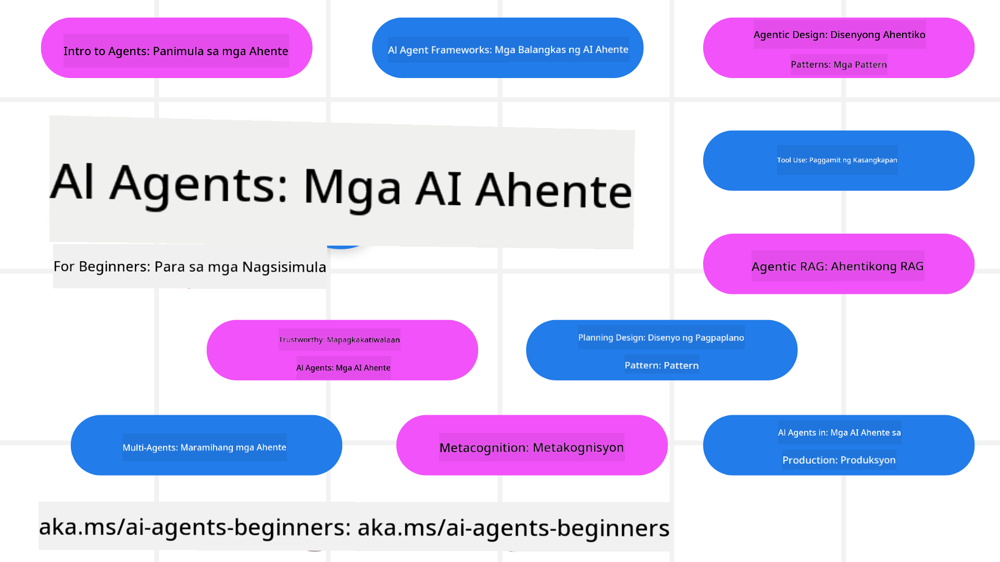

<!--
CO_OP_TRANSLATOR_METADATA:
{
  "original_hash": "6b07046397366e6f6f4524c9ddeba1e1",
  "translation_date": "2025-07-12T14:57:15+00:00",
  "source_file": "README.md",
  "language_code": "tl"
}
-->
# AI Agents para sa mga Baguhan - Isang Kurso

## 11 Aralin na nagtuturo ng lahat ng kailangan mong malaman para makapagsimula sa paggawa ng AI Agents

  
  
  
  

### 🌐 Suporta sa Maramihang Wika

#### Sinusuportahan sa pamamagitan ng GitHub Action (Awtomatiko at Palaging Napapanahon)

[French](../fr/README.md) | [Spanish](../es/README.md) | [German](../de/README.md) | [Russian](../ru/README.md) | [Arabic](../ar/README.md) | [Persian (Farsi)](../fa/README.md) | [Urdu](../ur/README.md) | [Chinese (Simplified)](../zh/README.md) | [Chinese (Traditional, Macau)](../mo/README.md) | [Chinese (Traditional, Hong Kong)](../hk/README.md) | [Chinese (Traditional, Taiwan)](../tw/README.md) | [Japanese](../ja/README.md) | [Korean](../ko/README.md) | [Hindi](../hi/README.md) | [Bengali](../bn/README.md) | [Marathi](../mr/README.md) | [Nepali](../ne/README.md) | [Punjabi (Gurmukhi)](../pa/README.md) | [Portuguese (Portugal)](../pt/README.md) | [Portuguese (Brazil)](../br/README.md) | [Italian](../it/README.md) | [Polish](../pl/README.md) | [Turkish](../tr/README.md) | [Greek](../el/README.md) | [Thai](../th/README.md) | [Swedish](../sv/README.md) | [Danish](../da/README.md) | [Norwegian](../no/README.md) | [Finnish](../fi/README.md) | [Dutch](../nl/README.md) | [Hebrew](../he/README.md) | [Vietnamese](../vi/README.md) | [Indonesian](../id/README.md) | [Malay](../ms/README.md) | [Tagalog (Filipino)](./README.md) | [Swahili](../sw/README.md) | [Hungarian](../hu/README.md) | [Czech](../cs/README.md) | [Slovak](../sk/README.md) | [Romanian](../ro/README.md) | [Bulgarian](../bg/README.md) | [Serbian (Cyrillic)](../sr/README.md) | [Croatian](../hr/README.md) | [Slovenian](../sl/README.md) | [Ukrainian](../uk/README.md) | [Burmese (Myanmar)](../my/README.md)

**Kung nais mong magkaroon ng karagdagang mga sinusuportahang wika, tingnan ang listahan [dito](https://github.com/Azure/co-op-translator/blob/main/getting_started/supported-languages.md)**

  
  

## 🌱 Pagsisimula

Ang kursong ito ay may 11 aralin na sumasaklaw sa mga pangunahing kaalaman sa paggawa ng AI Agents. Bawat aralin ay may kanya-kanyang paksa kaya maaari kang magsimula kahit saan mo gusto!

May suporta ito sa maramihang wika. Pumunta sa aming [mga available na wika dito](../..).

Kung ito ang unang beses mong gumawa gamit ang Generative AI models, tingnan ang aming [Generative AI Para sa mga Baguhan](https://aka.ms/genai-beginners) na kurso, na may 21 aralin tungkol sa paggawa gamit ang GenAI.

Huwag kalimutang [i-star (🌟) ang repo na ito](https://docs.github.com/en/get-started/exploring-projects-on-github/saving-repositories-with-stars?WT.mc_id=academic-105485-koreyst) at [i-fork ang repo na ito](https://github.com/microsoft/ai-agents-for-beginners/fork) para mapatakbo ang code.

### Ano ang Kailangan Mo

Bawat aralin sa kursong ito ay may kasamang mga halimbawa ng code, na makikita sa folder na code_samples. Maaari mong [i-fork ang repo na ito](https://github.com/microsoft/ai-agents-for-beginners/fork) para gumawa ng sarili mong kopya.

Ang mga halimbawa ng code sa mga pagsasanay na ito ay gumagamit ng Azure AI Foundry at GitHub Model Catalogs para makipag-ugnayan sa Language Models:

- [Github Models](https://aka.ms/ai-agents-beginners/github-models) - Libre / Limitado  
- [Azure AI Foundry](https://aka.ms/ai-agents-beginners/ai-foundry) - Kailangan ng Azure Account

Gumagamit din ang kursong ito ng mga sumusunod na AI Agent frameworks at serbisyo mula sa Microsoft:

- [Azure AI Agent Service](https://aka.ms/ai-agents-beginners/ai-agent-service)  
- [Semantic Kernel](https://aka.ms/ai-agents-beginners/semantic-kernel)  
- [AutoGen](https://aka.ms/ai-agents/autogen)

Para sa karagdagang impormasyon sa pagpapatakbo ng code para sa kursong ito, pumunta sa [Course Setup](./00-course-setup/README.md).

## 🙏 Gusto mo bang tumulong?

May mga suhestiyon ka ba o nakakita ng mga mali sa spelling o code? [Mag-raise ng isyu](https://github.com/microsoft/ai-agents-for-beginners/issues?WT.mc_id=academic-105485-koreyst) o [Gumawa ng pull request](https://github.com/microsoft/ai-agents-for-beginners/pulls?WT.mc_id=academic-105485-koreyst)

Kung na-stuck ka o may mga tanong tungkol sa paggawa ng AI Agents, sumali sa aming [Azure AI Foundry Community Discord](https://discord.gg/kzRShWzttr)

Kung may feedback ka tungkol sa produkto o may mga error habang gumagawa, bisitahin ang aming [Azure AI Foundry Developer Forum](https://aka.ms/azureaifoundry/forum)

## 📂 Bawat aralin ay may kasamang

- Isang nakasulat na aralin na matatagpuan sa README at isang maikling video  
- Mga halimbawa ng Python code na sumusuporta sa Azure AI Foundry at Github Models (Libre)  
- Mga link sa karagdagang mga mapagkukunan para ipagpatuloy ang iyong pag-aaral  

## 🗃️ Mga Aralin

| **Aralin**                               | **Teksto at Code**                                  | **Video**                                                  | **Karagdagang Pag-aaral**                                                             |
|------------------------------------------|----------------------------------------------------|------------------------------------------------------------|----------------------------------------------------------------------------------------|
| Intro sa AI Agents at Mga Gamit ng Agent | [Link](./01-intro-to-ai-agents/README.md)          | [Video](https://youtu.be/3zgm60bXmQk?si=z8QygFvYQv-9WtO1)  | [Link](https://aka.ms/ai-agents-beginners/collection?WT.mc_id=academic-105485-koreyst) |
| Pagsusuri sa AI Agentic Frameworks       | [Link](./02-explore-agentic-frameworks/README.md)  | [Video](https://youtu.be/ODwF-EZo_O8?si=Vawth4hzVaHv-u0H)  | [Link](https://aka.ms/ai-agents-beginners/collection?WT.mc_id=academic-105485-koreyst) |
| Pag-unawa sa AI Agentic Design Patterns  | [Link](./03-agentic-design-patterns/README.md)     | [Video](https://youtu.be/m9lM8qqoOEA?si=BIzHwzstTPL8o9GF)  | [Link](https://aka.ms/ai-agents-beginners/collection?WT.mc_id=academic-105485-koreyst) |
| Tool Use Design Pattern                   | [Link](./04-tool-use/README.md)                    | [Video](https://youtu.be/vieRiPRx-gI?si=2z6O2Xu2cu_Jz46N)  | [Link](https://aka.ms/ai-agents-beginners/collection?WT.mc_id=academic-105485-koreyst) |
| Agentic RAG                              | [Link](./05-agentic-rag/README.md)                 | [Video](https://youtu.be/WcjAARvdL7I?si=gKPWsQpKiIlDH9A3)  | [Link](https://aka.ms/ai-agents-beginners/collection?WT.mc_id=academic-105485-koreyst) |
| Paggawa ng Mapagkakatiwalaang AI Agents  | [Link](./06-building-trustworthy-agents/README.md) | [Video](https://youtu.be/iZKkMEGBCUQ?si=jZjpiMnGFOE9L8OK ) | [Link](https://aka.ms/ai-agents-beginners/collection?WT.mc_id=academic-105485-koreyst) |
| Planning Design Pattern                   | [Link](./07-planning-design/README.md)             | [Video](https://youtu.be/kPfJ2BrBCMY?si=6SC_iv_E5-mzucnC)  | [Link](https://aka.ms/ai-agents-beginners/collection?WT.mc_id=academic-105485-koreyst) |
| Multi-Agent Design Pattern                | [Link](./08-multi-agent/README.md)                 | [Video](https://youtu.be/V6HpE9hZEx0?si=rMgDhEu7wXo2uo6g)  | [Link](https://aka.ms/ai-agents-beginners/collection?WT.mc_id=academic-105485-koreyst) |
| Metacognition Design Pattern              | [Link](./09-metacognition/README.md)               | [Video](https://youtu.be/His9R6gw6Ec?si=8gck6vvdSNCt6OcF)  | [Link](https://aka.ms/ai-agents-beginners/collection?WT.mc_id=academic-105485-koreyst) |
| AI Agents sa Produksyon                   | [Link](./10-ai-agents-production/README.md)        | [Video](https://youtu.be/l4TP6IyJxmQ?si=31dnhexRo6yLRJDl)  | [Link](https://aka.ms/ai-agents-beginners/collection?WT.mc_id=academic-105485-koreyst) |
| AI Agents gamit ang MCP                    | [Link](./11-mcp/README.md)                         |                                                            | [Link](https://aka.ms/mcp-for-beginners)                                               |

## 🎒 Iba Pang Mga Kurso

Ang aming koponan ay gumagawa rin ng iba pang mga kurso! Tingnan:
- [**BAGONG** Model Context Protocol (MCP) Para sa mga Baguhan](https://github.com/microsoft/mcp-for-beginners?WT.mc_id=academic-105485-koreyst)
- [Generative AI para sa mga Baguhan gamit ang .NET](https://github.com/microsoft/Generative-AI-for-beginners-dotnet?WT.mc_id=academic-105485-koreyst)
- [Generative AI para sa mga Baguhan](https://github.com/microsoft/generative-ai-for-beginners?WT.mc_id=academic-105485-koreyst)
- [ML para sa mga Baguhan](https://aka.ms/ml-beginners?WT.mc_id=academic-105485-koreyst)
- [Data Science para sa mga Baguhan](https://aka.ms/datascience-beginners?WT.mc_id=academic-105485-koreyst)
- [AI para sa mga Baguhan](https://aka.ms/ai-beginners?WT.mc_id=academic-105485-koreyst)
- [Cybersecurity para sa mga Baguhan](https://github.com/microsoft/Security-101??WT.mc_id=academic-96948-sayoung)
- [Web Dev para sa mga Baguhan](https://aka.ms/webdev-beginners?WT.mc_id=academic-105485-koreyst)
- [IoT para sa mga Baguhan](https://aka.ms/iot-beginners?WT.mc_id=academic-105485-koreyst)
- [XR Development para sa mga Baguhan](https://github.com/microsoft/xr-development-for-beginners?WT.mc_id=academic-105485-koreyst)
- [Mastering GitHub Copilot para sa AI Paired Programming](https://aka.ms/GitHubCopilotAI?WT.mc_id=academic-105485-koreyst)
- [Mastering GitHub Copilot para sa mga C#/.NET Developers](https://github.com/microsoft/mastering-github-copilot-for-dotnet-csharp-developers?WT.mc_id=academic-105485-koreyst)
- [Piliin ang Sariling Copilot Adventure](https://github.com/microsoft/CopilotAdventures?WT.mc_id=academic-105485-koreyst)

## 🌟 Pasasalamat mula sa Komunidad

Salamat kay [Shivam Goyal](https://www.linkedin.com/in/shivam2003/) sa pagbibigay ng mahahalagang halimbawa ng code na nagpapakita ng Agentic RAG.

## Pagsali sa Proyekto

Malugod na tinatanggap ng proyektong ito ang mga kontribusyon at suhestiyon. Karamihan sa mga kontribusyon ay nangangailangan na sumang-ayon ka sa isang
Contributor License Agreement (CLA) na nagsasaad na may karapatan ka, at talagang binibigyan mo kami
ng mga karapatan na gamitin ang iyong kontribusyon. Para sa mga detalye, bisitahin ang
<https://cla.opensource.microsoft.com>.

Kapag nagsumite ka ng pull request, awtomatikong malalaman ng CLA bot kung kailangan mong magbigay ng
CLA at bibigyan ng angkop na marka ang PR (hal., status check, komento). Sundin lamang ang mga tagubiling
ibinibigay ng bot. Isang beses mo lang ito kailangang gawin para sa lahat ng repos na gumagamit ng aming CLA.

Inampon ng proyektong ito ang [Microsoft Open Source Code of Conduct](https://opensource.microsoft.com/codeofconduct/).
Para sa karagdagang impormasyon, tingnan ang [Code of Conduct FAQ](https://opensource.microsoft.com/codeofconduct/faq/) o
makipag-ugnayan sa [opencode@microsoft.com](mailto:opencode@microsoft.com) para sa anumang karagdagang tanong o komento.

## Mga Trademark

Maaaring naglalaman ang proyektong ito ng mga trademark o logo para sa mga proyekto, produkto, o serbisyo. Ang awtorisadong paggamit ng mga trademark o logo ng Microsoft ay napapailalim at dapat sumunod sa
[Microsoft's Trademark & Brand Guidelines](https://www.microsoft.com/legal/intellectualproperty/trademarks/usage/general).
Ang paggamit ng mga trademark o logo ng Microsoft sa mga binagong bersyon ng proyektong ito ay hindi dapat magdulot ng kalituhan o magpahiwatig ng pagsuporta ng Microsoft.
Anumang paggamit ng mga trademark o logo ng third-party ay napapailalim sa mga patakaran ng mga third-party na iyon.

**Paalala**:  
Ang dokumentong ito ay isinalin gamit ang AI translation service na [Co-op Translator](https://github.com/Azure/co-op-translator). Bagamat nagsusumikap kami para sa katumpakan, pakatandaan na ang mga awtomatikong pagsasalin ay maaaring maglaman ng mga pagkakamali o di-tumpak na impormasyon. Ang orihinal na dokumento sa kanyang sariling wika ang dapat ituring na pangunahing sanggunian. Para sa mahahalagang impormasyon, inirerekomenda ang propesyonal na pagsasalin ng tao. Hindi kami mananagot sa anumang hindi pagkakaunawaan o maling interpretasyon na maaaring magmula sa paggamit ng pagsasaling ito.