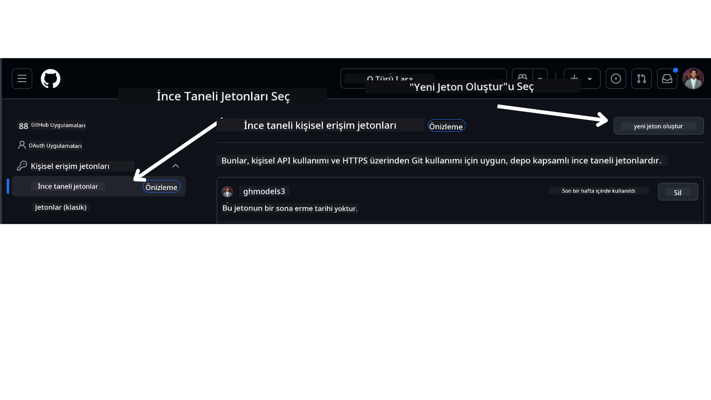

<!--
CO_OP_TRANSLATOR_METADATA:
{
  "original_hash": "76945069b52a49cd0432ae3e0b0ba22e",
  "translation_date": "2025-07-12T07:50:01+00:00",
  "source_file": "00-course-setup/README.md",
  "language_code": "tr"
}
-->
GitHub Hesabınızda.

Ekranınızın sol tarafında `Fine-grained tokens` seçeneğini seçin.

Ardından `Generate new token` seçeneğine tıklayın.



Token'ınız için bir isim girmeniz, son kullanma tarihini seçmeniz (Önerilen: 30 Gün) ve token kapsamlarını belirlemeniz istenecektir (Public Repositories).

Ayrıca bu token'ın izinlerini düzenlemeniz gerekmektedir: Permissions -> Models -> GitHub Modellerine erişime izin ver.

Yeni oluşturduğunuz token'ı kopyalayın. Şimdi bu token'ı bu kursta bulunan `.env` dosyanıza ekleyeceksiniz.

### Adım 2: `.env` Dosyanızı Oluşturun

`.env` dosyanızı oluşturmak için terminalinizde aşağıdaki komutu çalıştırın.

```bash
cp .env.example .env
```

Bu, örnek dosyayı kopyalayacak ve dizininizde bir `.env` dosyası oluşturacaktır; burada ortam değişkenlerinin değerlerini doldurabilirsiniz.

Token'ınızı kopyaladıktan sonra, favori metin düzenleyicinizde `.env` dosyasını açın ve token'ınızı `GITHUB_TOKEN` alanına yapıştırın.

Artık bu kursun kod örneklerini çalıştırabilmelisiniz.

## Azure AI Foundry ve Azure AI Agent Service Kullanarak Örnekler İçin Kurulum

### Adım 1: Azure Proje Uç Noktanızı Alın

Azure AI Foundry'de bir hub ve proje oluşturma adımlarını şu adreste bulabilirsiniz: [Hub resources overview](https://learn.microsoft.com/en-us/azure/ai-foundry/concepts/ai-resources)

Projenizi oluşturduktan sonra, proje bağlantı dizesini almanız gerekecek.

Bunu Azure AI Foundry portalındaki projenizin **Overview** sayfasına giderek yapabilirsiniz.


### Adım 2: `.env` Dosyanızı Oluşturun

`.env` dosyanızı oluşturmak için terminalinizde aşağıdaki komutu çalıştırın.

```bash
cp .env.example .env
```

Bu, örnek dosyayı kopyalayacak ve dizininizde bir `.env` dosyası oluşturacaktır; burada ortam değişkenlerinin değerlerini doldurabilirsiniz.

Token'ınızı kopyaladıktan sonra, favori metin düzenleyicinizde `.env` dosyasını açın ve token'ınızı `PROJECT_ENDPOINT` alanına yapıştırın.

### Adım 3: Azure'a Giriş Yapın

Güvenlik açısından en iyi uygulama olarak, Microsoft Entra ID ile Azure OpenAI'ye kimlik doğrulaması yapmak için [anahtarsız kimlik doğrulama](https://learn.microsoft.com/azure/developer/ai/keyless-connections?tabs=csharp%2Cazure-cli?WT.mc_id=academic-105485-koreyst) kullanacağız. Bunu yapabilmek için önce işletim sisteminiz için [Azure CLI](https://learn.microsoft.com/cli/azure/install-azure-cli?WT.mc_id=academic-105485-koreyst) kurulum talimatlarına göre Azure CLI'yı yüklemeniz gerekmektedir.

Sonra, bir terminal açın ve Azure hesabınıza giriş yapmak için `az login --use-device-code` komutunu çalıştırın.

Giriş yaptıktan sonra, terminalde aboneliğinizi seçin.

## Ek Ortam Değişkenleri - Azure Search ve Azure OpenAI

Agentic RAG Dersi - Ders 5 - için Azure Search ve Azure OpenAI kullanan örnekler bulunmaktadır.

Bu örnekleri çalıştırmak isterseniz, `.env` dosyanıza aşağıdaki ortam değişkenlerini eklemeniz gerekecektir:

### Genel Bakış Sayfası (Proje)

- `AZURE_SUBSCRIPTION_ID` - Projenizin **Overview** sayfasındaki **Project details** bölümünden kontrol edin.

- `AZURE_AI_PROJECT_NAME` - Projenizin **Overview** sayfasının üst kısmında bulunur.

- `AZURE_OPENAI_SERVICE` - **Overview** sayfasındaki **Included capabilities** sekmesinde **Azure OpenAI Service** için bulunur.

### Yönetim Merkezi

- `AZURE_OPENAI_RESOURCE_GROUP` - **Management Center**'daki **Overview** sayfasında **Project properties** bölümünde bulunur.

- `GLOBAL_LLM_SERVICE` - **Connected resources** altında **Azure AI Services** bağlantı adını bulun. Listelenmemişse, kaynak grubunuzdaki AI Services kaynak adını Azure portalında kontrol edin.

### Modeller + Uç Noktalar Sayfası

- `AZURE_OPENAI_EMBEDDING_DEPLOYMENT_NAME` - Gömme modeli seçin (örneğin, `text-embedding-ada-002`) ve model detaylarından **Deployment name**'i not edin.

- `AZURE_OPENAI_CHAT_DEPLOYMENT_NAME` - Sohbet modelini seçin (örneğin, `gpt-4o-mini`) ve model detaylarından **Deployment name**'i not edin.

### Azure Portal

- `AZURE_OPENAI_ENDPOINT` - **Azure AI services**'i bulun, tıklayın, ardından **Resource Management**, **Keys and Endpoint** bölümüne gidin, "Azure OpenAI endpoints" kısmına kaydırın ve "Language APIs" yazan uç noktayı kopyalayın.

- `AZURE_OPENAI_API_KEY` - Aynı ekrandan KEY 1 veya KEY 2'yi kopyalayın.

- `AZURE_SEARCH_SERVICE_ENDPOINT` - **Azure AI Search** kaynağınızı bulun, tıklayın ve **Overview** bölümüne bakın.

- `AZURE_SEARCH_API_KEY` - Ardından **Settings** ve **Keys** bölümüne giderek birincil veya ikincil yönetici anahtarını kopyalayın.

### Harici Web Sayfası

- `AZURE_OPENAI_API_VERSION` - [API sürüm yaşam döngüsü](https://learn.microsoft.com/en-us/azure/ai-services/openai/api-version-deprecation#latest-ga-api-release) sayfasını **Latest GA API release** altında ziyaret edin.

### Anahtarsız Kimlik Doğrulama Kurulumu

Kimlik bilgilerinizi sabit kodlamak yerine, Azure OpenAI ile anahtarsız bağlantı kullanacağız. Bunun için `DefaultAzureCredential`'ı içe aktaracağız ve daha sonra kimlik bilgisi almak için `DefaultAzureCredential` fonksiyonunu çağıracağız.

```python
from azure.identity import DefaultAzureCredential, InteractiveBrowserCredential
```

## Bir Yerde Takıldınız mı?

Bu kurulumu çalıştırırken herhangi bir sorun yaşarsanız, bizimle iletişime geçmek için

veya

.

## Sonraki Ders

Artık bu kursun kodlarını çalıştırmaya hazırsınız. AI Ajanları dünyası hakkında daha fazla öğrenirken iyi çalışmalar!

[AI Ajanlarına Giriş ve Ajan Kullanım Senaryoları](../01-intro-to-ai-agents/README.md)

**Feragatname**:  
Bu belge, AI çeviri servisi [Co-op Translator](https://github.com/Azure/co-op-translator) kullanılarak çevrilmiştir. Doğruluk için çaba göstersek de, otomatik çevirilerin hatalar veya yanlışlıklar içerebileceğini lütfen unutmayınız. Orijinal belge, kendi ana dilinde yetkili kaynak olarak kabul edilmelidir. Kritik bilgiler için profesyonel insan çevirisi önerilir. Bu çevirinin kullanımı sonucu oluşabilecek yanlış anlamalar veya yorum hatalarından sorumlu değiliz.