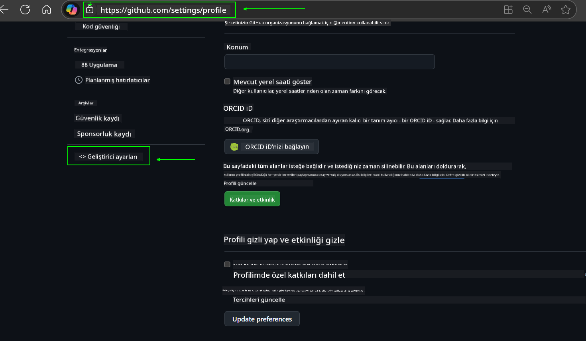
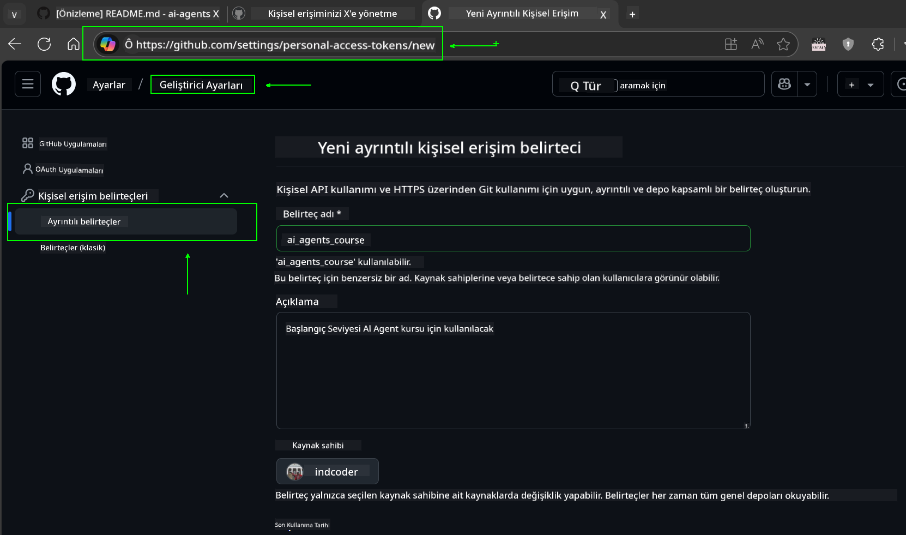
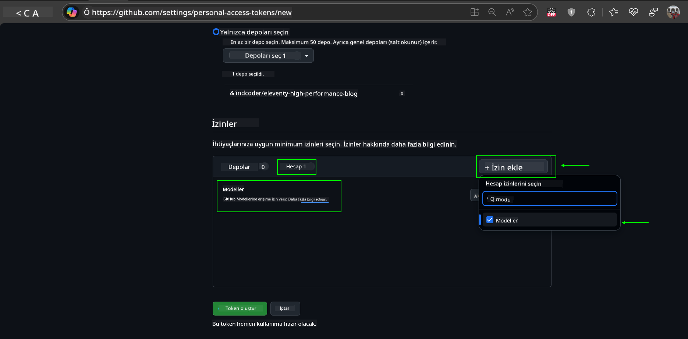
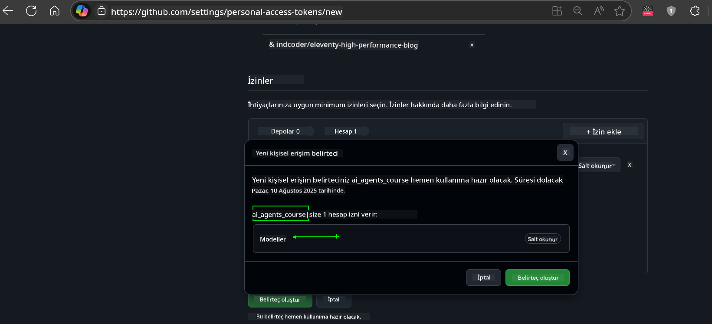
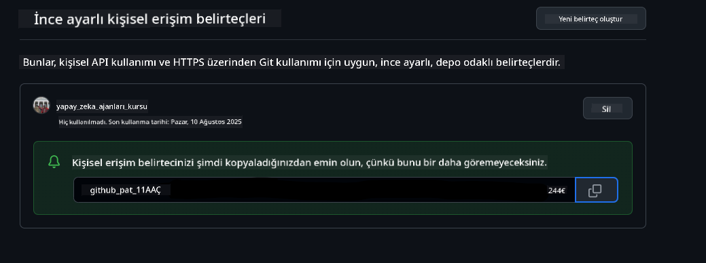
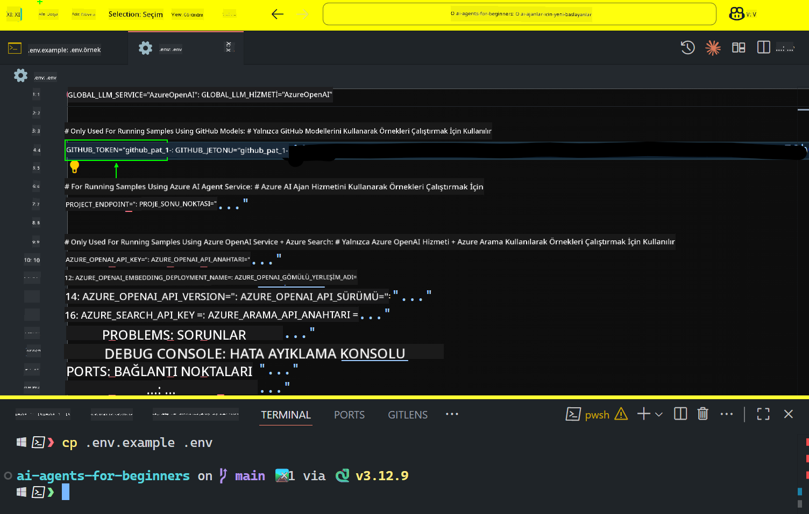

<!--
CO_OP_TRANSLATOR_METADATA:
{
  "original_hash": "c55b973b1562abf5aadf6a4028265ac5",
  "translation_date": "2025-08-29T13:13:12+00:00",
  "source_file": "00-course-setup/README.md",
  "language_code": "tr"
}
-->
# Kurs Kurulumu

## Giriş

Bu ders, kursun kod örneklerini nasıl çalıştıracağınızı ele alacaktır.

## Diğer Öğrencilerle Katılın ve Yardım Alın

Depoyu klonlamaya başlamadan önce, [AI Agents For Beginners Discord kanalı](https://aka.ms/ai-agents/discord)'na katılın. Kurulumla ilgili yardım almak, kursla ilgili sorular sormak veya diğer öğrencilerle bağlantı kurmak için bu kanalı kullanabilirsiniz.

## Bu Depoyu Klonlayın veya Çatallayın

Başlamak için lütfen GitHub Deposunu klonlayın veya çatallayın. Bu, kurs materyalinin kendi versiyonunuzu oluşturmanızı sağlar, böylece kodu çalıştırabilir, test edebilir ve üzerinde değişiklik yapabilirsiniz!

Bunu yapmak için aşağıdaki bağlantıya tıklayın:


## Kodun Çalıştırılması

Bu kurs, AI Agent'lar oluşturmayı öğrenmek için pratik yapabileceğiniz bir dizi Jupyter Notebook sunar.

Kod örnekleri şu seçenekleri kullanır:

**GitHub Hesabı Gerektirir - Ücretsiz**:

1) Semantic Kernel Agent Framework + GitHub Models Marketplace. (semantic-kernel.ipynb olarak etiketlenmiştir)
2) AutoGen Framework + GitHub Models Marketplace. (autogen.ipynb olarak etiketlenmiştir)

**Azure Aboneliği Gerektirir**:
3) Azure AI Foundry + Azure AI Agent Service. (azureaiagent.ipynb olarak etiketlenmiştir)

Üç tür örneği de denemenizi ve hangisinin sizin için en iyi çalıştığını görmenizi öneririz.

Seçtiğiniz seçenek, aşağıdaki kurulum adımlarını belirleyecektir:

## Gereksinimler

- Python 3.12+
  - **NOT**: Python3.12 yüklü değilse, lütfen yükleyin. Ardından, requirements.txt dosyasından doğru sürümlerin yüklendiğinden emin olmak için python3.12 kullanarak venv oluşturun.
- GitHub Hesabı - GitHub Models Marketplace'e erişim için
- Azure Aboneliği - Azure AI Foundry'e erişim için
- Azure AI Foundry Hesabı - Azure AI Agent Service'e erişim için

Bu depoda, kod örneklerini çalıştırmak için gerekli tüm Python paketlerini içeren bir `requirements.txt` dosyası bulunmaktadır.

Bu paketleri, depo kök dizininde terminalde aşağıdaki komutu çalıştırarak yükleyebilirsiniz:

```bash
pip install -r requirements.txt
```
Herhangi bir çakışma ve sorun yaşamamak için bir Python sanal ortamı oluşturmanızı öneririz.

## VSCode Kurulumu
VSCode'da doğru Python sürümünü kullandığınızdan emin olun.


## GitHub Modellerini Kullanarak Örnekler için Kurulum 

### Adım 1: GitHub Kişisel Erişim Jetonunuzu (PAT) Alın

Bu kurs, GitHub Models Marketplace'i kullanır ve AI Agent'lar oluşturmak için kullanacağınız Büyük Dil Modellerine (LLM'ler) ücretsiz erişim sağlar.

GitHub Modellerini kullanmak için bir [GitHub Kişisel Erişim Jetonu](https://docs.github.com/en/authentication/keeping-your-account-and-data-secure/managing-your-personal-access-tokens) oluşturmanız gerekecek.

Bunu GitHub hesabınızda yapabilirsiniz.

Lütfen jeton oluştururken [En Az Ayrıcalık İlkesi](https://docs.github.com/en/get-started/learning-to-code/storing-your-secrets-safely)'ni takip edin. Bu, jetona yalnızca bu kurstaki kod örneklerini çalıştırmak için gereken izinleri vermeniz gerektiği anlamına gelir.

1. **Geliştirici ayarları** bölümüne giderek ekranın sol tarafında `Fine-grained tokens` seçeneğini seçin.
   

   Ardından `Yeni jeton oluştur` seçeneğini seçin.

   

2. Jetonun amacını yansıtan açıklayıcı bir ad girin, böylece daha sonra kolayca tanımlayabilirsiniz.

   🔐 Jeton Süresi Önerisi

   Önerilen süre: 30 gün  
   Daha güvenli bir yaklaşım için daha kısa bir süre seçebilirsiniz—örneğin, 7 gün 🛡️  
   Bu, kişisel bir hedef belirlemek ve öğrenme ivmenizi yüksek tutarak kursu tamamlamak için harika bir yöntemdir 🚀.

   

3. Jetonun kapsamını bu deponun çatallanmış versiyonuyla sınırlayın.

   

4. Jetonun izinlerini kısıtlayın: **İzinler** altında **Hesap** sekmesine tıklayın ve "+ İzin ekle" düğmesine tıklayın. Bir açılır menü görünecektir. Lütfen **Modeller** için arama yapın ve kutuyu işaretleyin.
   

5. Jetonu oluşturmadan önce gereken izinleri doğrulayın. 

6. Jetonu oluşturmadan önce, jetonu bir şifre yöneticisi kasası gibi güvenli bir yerde saklamaya hazır olduğunuzdan emin olun, çünkü oluşturduktan sonra tekrar gösterilmeyecektir. 

Yeni oluşturduğunuz jetonu kopyalayın. Şimdi bu jetonu bu kursa dahil edilen `.env` dosyasına ekleyeceksiniz.

### Adım 2: `.env` Dosyanızı Oluşturun

`.env` dosyanızı oluşturmak için terminalde aşağıdaki komutu çalıştırın.

```bash
cp .env.example .env
```

Bu, örnek dosyayı kopyalayacak ve dizininizde bir `.env` dosyası oluşturacaktır. Çevre değişkenleri için değerleri buraya doldurabilirsiniz.

Jetonunuzu kopyaladıktan sonra, favori metin düzenleyicinizi açarak `.env` dosyasını açın ve jetonunuzu `GITHUB_TOKEN` alanına yapıştırın.  


Artık bu kursun kod örneklerini çalıştırabilirsiniz.

## Azure AI Foundry ve Azure AI Agent Service Kullanarak Örnekler için Kurulum

### Adım 1: Azure Proje Uç Noktanızı Alın

Azure AI Foundry'de bir hub ve proje oluşturma adımlarını takip edin: [Hub kaynakları genel bakış](https://learn.microsoft.com/en-us/azure/ai-foundry/concepts/ai-resources)

Projenizi oluşturduktan sonra, projenizin bağlantı dizesini almanız gerekecek.

Bunu, Azure AI Foundry portalındaki projenizin **Genel Bakış** sayfasına giderek yapabilirsiniz.


### Adım 2: `.env` Dosyanızı Oluşturun

`.env` dosyanızı oluşturmak için terminalde aşağıdaki komutu çalıştırın.

```bash
cp .env.example .env
```

Bu, örnek dosyayı kopyalayacak ve dizininizde bir `.env` dosyası oluşturacaktır. Çevre değişkenleri için değerleri buraya doldurabilirsiniz.

Jetonunuzu kopyaladıktan sonra, favori metin düzenleyicinizi açarak `.env` dosyasını açın ve jetonunuzu `PROJECT_ENDPOINT` alanına yapıştırın.

### Adım 3: Azure'a Giriş Yapın

Bir güvenlik en iyi uygulaması olarak, Microsoft Entra ID ile [anahtarsız kimlik doğrulama](https://learn.microsoft.com/azure/developer/ai/keyless-connections?tabs=csharp%2Cazure-cli?WT.mc_id=academic-105485-koreyst) kullanacağız.

Sonraki adımda, bir terminal açın ve Azure hesabınıza giriş yapmak için `az login --use-device-code` komutunu çalıştırın.

Giriş yaptıktan sonra, terminalde aboneliğinizi seçin.

## Ek Çevre Değişkenleri - Azure Search ve Azure OpenAI

Agentic RAG Dersi - Ders 5 - Azure Search ve Azure OpenAI kullanan örnekler içerir.

Bu örnekleri çalıştırmak istiyorsanız, `.env` dosyanıza aşağıdaki çevre değişkenlerini eklemeniz gerekecek:

### Genel Bakış Sayfası (Proje)

- `AZURE_SUBSCRIPTION_ID` - Projenizin **Genel Bakış** sayfasındaki **Proje detayları** bölümünü kontrol edin.

- `AZURE_AI_PROJECT_NAME` - Projenizin **Genel Bakış** sayfasının üst kısmına bakın.

- `AZURE_OPENAI_SERVICE` - **Genel Bakış** sayfasındaki **Azure OpenAI Service** için **Dahil edilen yetenekler** sekmesinde bulun.

### Yönetim Merkezi

- `AZURE_OPENAI_RESOURCE_GROUP` - **Yönetim Merkezi**'ndeki **Genel Bakış** sayfasında **Proje özellikleri** bölümüne gidin.

- `GLOBAL_LLM_SERVICE` - **Bağlı kaynaklar** altında **Azure AI Services** bağlantı adını bulun. Listelenmemişse, kaynak grubunuzdaki AI Services kaynak adını kontrol edin.

### Modeller + Uç Noktalar Sayfası

- `AZURE_OPENAI_EMBEDDING_DEPLOYMENT_NAME` - Gömme modelinizi seçin (ör. `text-embedding-ada-002`) ve model detaylarından **Dağıtım adını** not alın.

- `AZURE_OPENAI_CHAT_DEPLOYMENT_NAME` - Sohbet modelinizi seçin (ör. `gpt-4o-mini`) ve model detaylarından **Dağıtım adını** not alın.

### Azure Portalı

- `AZURE_OPENAI_ENDPOINT` - **Azure AI services**'ı bulun, üzerine tıklayın, ardından **Kaynak Yönetimi**, **Anahtarlar ve Uç Nokta**'ya gidin, "Azure OpenAI endpoints" bölümüne kadar aşağı kaydırın ve "Dil API'leri" yazan uç noktayı kopyalayın.

- `AZURE_OPENAI_API_KEY` - Aynı ekrandan, ANAHTAR 1 veya ANAHTAR 2'yi kopyalayın.

- `AZURE_SEARCH_SERVICE_ENDPOINT` - **Azure AI Search** kaynağınızı bulun, üzerine tıklayın ve **Genel Bakış** bölümünü kontrol edin.

- `AZURE_SEARCH_API_KEY` - Ardından **Ayarlar** ve **Anahtarlar** bölümüne giderek birincil veya ikincil yönetici anahtarını kopyalayın.

### Harici Web Sayfası

- `AZURE_OPENAI_API_VERSION` - [API sürüm yaşam döngüsü](https://learn.microsoft.com/en-us/azure/ai-services/openai/api-version-deprecation#latest-ga-api-release) sayfasını **En Son GA API sürümü** altında ziyaret edin.

### Anahtarsız Kimlik Doğrulama Kurulumu

Kimlik bilgilerinizi kodda sabitlemek yerine, Azure OpenAI ile anahtarsız bir bağlantı kullanacağız. Bunu yapmak için `DefaultAzureCredential`'ı içe aktaracağız ve daha sonra kimlik bilgilerini almak için `DefaultAzureCredential` fonksiyonunu çağıracağız.

```python
from azure.identity import DefaultAzureCredential, InteractiveBrowserCredential
```

## Bir Yerde Takıldınız mı?

Bu kurulumu çalıştırırken herhangi bir sorun yaşarsanız, bizimle iletişime geçmek için Discord kanalımıza katılabilirsiniz.

## Sonraki Ders

Artık bu kursun kodunu çalıştırmaya hazırsınız. AI Agent'lar dünyası hakkında daha fazla şey öğrenirken iyi eğlenceler!

[AI Agent'lara Giriş ve Agent Kullanım Durumları](../01-intro-to-ai-agents/README.md)

---

**Feragatname**:  
Bu belge, [Co-op Translator](https://github.com/Azure/co-op-translator) adlı yapay zeka çeviri hizmeti kullanılarak çevrilmiştir. Doğruluk için çaba göstersek de, otomatik çevirilerin hata veya yanlışlıklar içerebileceğini lütfen unutmayın. Orijinal belgenin kendi dilindeki hali, yetkili kaynak olarak kabul edilmelidir. Kritik bilgiler için profesyonel insan çevirisi önerilir. Bu çevirinin kullanımından kaynaklanan yanlış anlamalar veya yanlış yorumlamalar için sorumluluk kabul etmiyoruz.