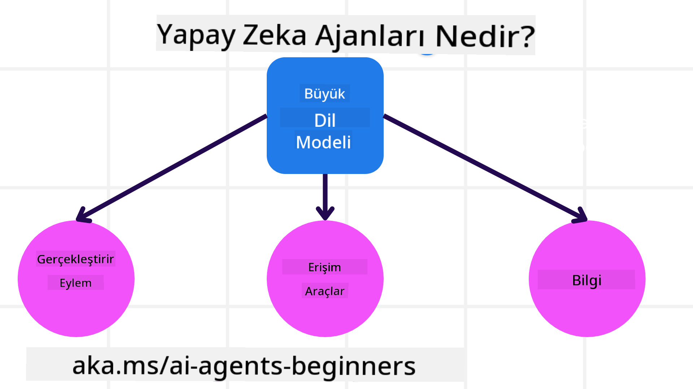
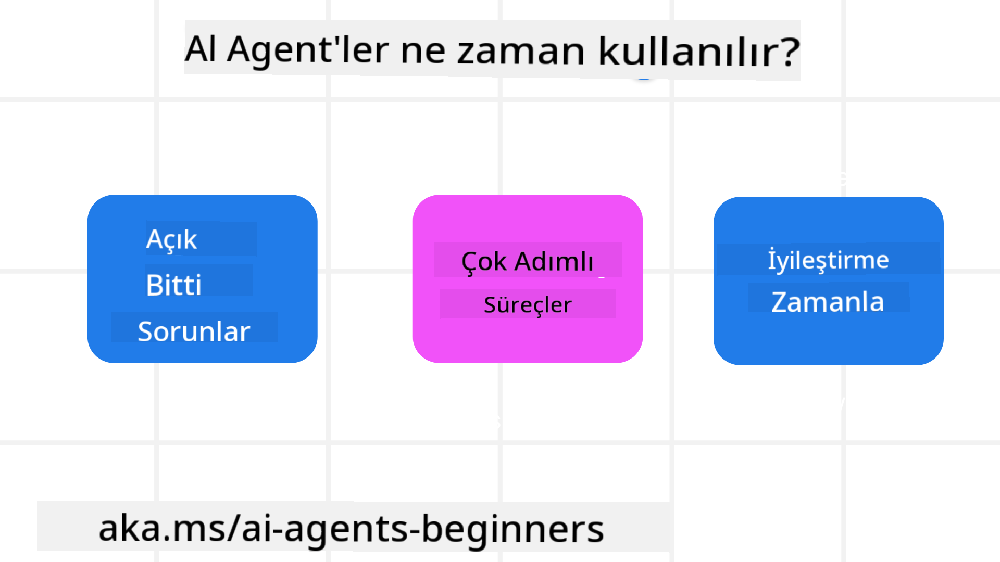

<!--
CO_OP_TRANSLATOR_METADATA:
{
  "original_hash": "d84943abc8f001ad4670418d32c2d899",
  "translation_date": "2025-07-12T08:06:41+00:00",
  "source_file": "01-intro-to-ai-agents/README.md",
  "language_code": "tr"
}
-->
diğer öğrenciler ve AI Agent Geliştiricileri ile tanışmak ve bu kursla ilgili sorularınızı sormak için katılın.

Bu kursa başlamak için, AI Agent’ların ne olduğunu ve onları oluşturduğumuz uygulamalarda ve iş akışlarında nasıl kullanabileceğimizi daha iyi anlamakla başlıyoruz.

## Giriş

Bu ders şunları kapsar:

- AI Agent’lar nedir ve farklı agent türleri nelerdir?
- AI Agent’lar için en uygun kullanım senaryoları nelerdir ve bize nasıl yardımcı olabilirler?
- Agentik Çözümler tasarlarken bazı temel yapı taşları nelerdir?

## Öğrenme Hedefleri
Bu dersi tamamladıktan sonra şunları yapabilmelisiniz:

- AI Agent kavramlarını ve diğer AI çözümlerinden nasıl farklılaştıklarını anlamak.
- AI Agent’ları en verimli şekilde uygulamak.
- Hem kullanıcılar hem de müşteriler için agentik çözümler tasarlamak.

## AI Agent’ların Tanımı ve Türleri

### AI Agent’lar nedir?

AI Agent’lar, **Büyük Dil Modelleri (LLM’ler)**’nin **araçlara** ve **bilgiye** erişim sağlayarak yeteneklerini genişletip **eylem gerçekleştirmesine** olanak tanıyan **sistemlerdir**.

Bu tanımı daha küçük parçalara ayıralım:

- **Sistem** - Agent’ları sadece tek bir bileşen olarak değil, birçok bileşenin bir araya geldiği bir sistem olarak düşünmek önemlidir. Temel seviyede, bir AI Agent’ın bileşenleri şunlardır:
  - **Ortam** - AI Agent’ın çalıştığı tanımlı alan. Örneğin, bir seyahat rezervasyon AI Agent’ımız varsa, ortam AI Agent’ın görevleri tamamlamak için kullandığı seyahat rezervasyon sistemi olabilir.
  - **Sensörler** - Ortamlar bilgi içerir ve geri bildirim sağlar. AI Agent’lar, ortamın mevcut durumu hakkında bilgi toplamak ve yorumlamak için sensörleri kullanır. Seyahat rezervasyon örneğinde, rezervasyon sistemi otel müsaitliği veya uçuş fiyatları gibi bilgileri sağlayabilir.
  - **Aktüatörler** - AI Agent ortamın mevcut durumunu aldıktan sonra, mevcut görev için ortamı değiştirmek üzere hangi eylemi yapacağına karar verir. Seyahat rezervasyon agent’ı için bu, kullanıcı için müsait bir odayı rezerve etmek olabilir.

**Büyük Dil Modelleri** - Agent kavramı LLM’ler ortaya çıkmadan önce de vardı. LLM’lerle AI Agent’lar oluşturmanın avantajı, insan dilini ve veriyi yorumlayabilme yetenekleridir. Bu yetenek, LLM’lerin çevresel bilgileri yorumlamasını ve ortamı değiştirmek için bir plan oluşturmasını sağlar.

**Eylem Gerçekleştirme** - AI Agent sistemleri dışında, LLM’ler genellikle kullanıcının verdiği komut doğrultusunda içerik veya bilgi üretmekle sınırlıdır. AI Agent sistemlerinde ise LLM’ler, kullanıcının isteğini yorumlayarak ve ortamlarında bulunan araçları kullanarak görevleri tamamlayabilir.

**Araçlara Erişim** - LLM’nin erişebileceği araçlar, 1) çalıştığı ortam ve 2) AI Agent’ın geliştiricisi tarafından belirlenir. Seyahat agent örneğinde, agent’ın araçları rezervasyon sisteminde mevcut işlemlerle sınırlıdır ve/veya geliştirici agent’ın uçuşlara erişimini kısıtlayabilir.

**Bellek+Bilgi** - Bellek, kullanıcı ile agent arasındaki konuşma bağlamında kısa süreli olabilir. Uzun vadede, ortamın sağladığı bilginin dışında, AI Agent’lar diğer sistemlerden, servislerden, araçlardan ve hatta diğer agent’lardan bilgi alabilir. Seyahat agent örneğinde, bu bilgi kullanıcının seyahat tercihleriyle ilgili müşteri veritabanındaki bilgiler olabilir.

### Farklı Agent Türleri

AI Agent’ların genel tanımını yaptıktan sonra, bazı spesifik agent türlerine ve bunların seyahat rezervasyon AI agent’ına nasıl uygulanabileceğine bakalım.

| **Agent Türü**               | **Açıklama**                                                                                                                        | **Örnek**                                                                                                                                                                                                                   |
| ---------------------------- | ---------------------------------------------------------------------------------------------------------------------------------- | --------------------------------------------------------------------------------------------------------------------------------------------------------------------------------------------------------------------------- |
| **Basit Refleks Agent’lar**  | Önceden tanımlanmış kurallara göre anında eylem gerçekleştirir.                                                                    | Seyahat agent’ı e-postanın içeriğini yorumlar ve seyahat şikayetlerini müşteri hizmetlerine iletir.                                                                                                                         |
| **Model Tabanlı Refleks Agent’lar** | Dünya modeline ve bu modeldeki değişikliklere göre eylem gerçekleştirir.                                                        | Seyahat agent’ı, geçmiş fiyat verilerine erişerek önemli fiyat değişikliklerine sahip rotaları önceliklendirir.                                                                                                            |
| **Hedef Tabanlı Agent’lar**  | Belirli hedeflere ulaşmak için planlar yapar, hedefi yorumlar ve ona ulaşmak için eylemleri belirler.                              | Seyahat agent’ı, mevcut konumdan varış noktasına kadar gerekli seyahat düzenlemelerini (araba, toplu taşıma, uçuşlar) belirleyerek yolculuk rezervasyonu yapar.                                                               |
| **Fayda Tabanlı Agent’lar**  | Tercihleri dikkate alır ve hedeflere ulaşmak için sayısal olarak takasları değerlendirir.                                          | Seyahat agent’ı, seyahat rezervasyonunda konfor ve maliyet arasında faydayı maksimize eder.                                                                                                                                  |
| **Öğrenen Agent’lar**        | Geri bildirimlere yanıt vererek ve eylemlerini ayarlayarak zamanla gelişir.                                                       | Seyahat agent’ı, yolculuk sonrası anketlerden alınan müşteri geri bildirimlerini kullanarak gelecekteki rezervasyonları iyileştirir.                                                                                        |
| **Hiyerarşik Agent’lar**     | Çok katmanlı sistemde birden fazla agent içerir; üst düzey agent’lar görevleri alt düzey agent’lara böler.                        | Seyahat agent’ı, bir seyahati iptal ederken görevi alt görevlere (örneğin, belirli rezervasyonları iptal etmek) bölerek alt düzey agent’ların tamamlamasını sağlar ve üst düzey agent’a rapor verir.                            |
| **Çoklu Agent Sistemleri (MAS)** | Agent’lar görevleri bağımsız olarak, işbirliği içinde veya rekabetçi şekilde tamamlar.                                          | İşbirliği: Birden fazla agent otel, uçuş ve eğlence gibi seyahat hizmetlerini rezerve eder. Rekabet: Birden fazla agent, paylaşılan bir otel rezervasyon takvimi üzerinde rekabet ederek müşterileri otele yerleştirir.         |

## AI Agent’lar Ne Zaman Kullanılır?

Önceki bölümde, farklı agent türlerinin seyahat rezervasyonu senaryolarında nasıl kullanılabileceğini açıklamak için Seyahat Agent kullanım örneğini kullandık. Bu uygulamayı kurs boyunca kullanmaya devam edeceğiz.

AI Agent’ların en iyi kullanıldığı senaryo türlerine bakalım:

- **Açık Uçlu Problemler** - LLM’nin bir görevi tamamlamak için gereken adımları belirlemesine izin vermek, çünkü her zaman iş akışına sert kodlanamaz.
- **Çok Adımlı Süreçler** - AI Agent’ın araçları veya bilgileri birden fazla turda kullanması gereken karmaşıklıkta görevler, tek seferlik bilgi alımından ziyade.
- **Zamanla İyileşme** - Agent’ın ortamından veya kullanıcılardan geri bildirim alarak zamanla gelişebileceği görevler, daha iyi fayda sağlamak için.

AI Agent kullanımıyla ilgili daha fazla hususu Güvenilir AI Agent’lar Oluşturma dersinde ele alıyoruz.

## Agentik Çözümlerin Temelleri

### Agent Geliştirme

Bir AI Agent sistemi tasarlamanın ilk adımı, araçları, eylemleri ve davranışları tanımlamaktır. Bu kursta, Agent’larımızı tanımlamak için **Azure AI Agent Service** kullanmaya odaklanıyoruz. Bu servis şu özellikleri sunar:

- OpenAI, Mistral ve Llama gibi Açık Modellerin seçimi
- Tripadvisor gibi sağlayıcılar aracılığıyla Lisanslı Veri kullanımı
- Standartlaştırılmış OpenAPI 3.0 araçlarının kullanımı

### Agentik Desenler

LLM’lerle iletişim, istemler (prompts) aracılığıyla gerçekleşir. AI Agent’ların yarı otonom doğası nedeniyle, ortamda bir değişiklikten sonra LLM’yi manuel olarak yeniden istemlemek her zaman mümkün veya gerekli değildir. Daha ölçeklenebilir bir şekilde LLM’yi çok adımlı olarak istememize olanak tanıyan **Agentik Desenler** kullanıyoruz.

Bu kurs, günümüzde popüler olan bazı Agentik desenlere ayrılmıştır.

### Agentik Çerçeveler

Agentik Çerçeveler, geliştiricilerin agentik desenleri kod yoluyla uygulamasına olanak tanır. Bu çerçeveler, daha iyi AI Agent işbirliği için şablonlar, eklentiler ve araçlar sunar. Bu avantajlar, AI Agent sistemlerinin daha iyi gözlemlenmesi ve sorun giderilmesini sağlar.

Bu kursta, araştırma odaklı AutoGen çerçevesi ve üretime hazır Semantic Kernel Agent çerçevesini keşfedeceğiz.

## Önceki Ders

[Course Setup](../00-course-setup/README.md)

## Sonraki Ders

[Exploring Agentic Frameworks](../02-explore-agentic-frameworks/README.md)

**Feragatname**:  
Bu belge, AI çeviri servisi [Co-op Translator](https://github.com/Azure/co-op-translator) kullanılarak çevrilmiştir. Doğruluk için çaba gösterilse de, otomatik çevirilerin hatalar veya yanlışlıklar içerebileceğini lütfen unutmayınız. Orijinal belge, kendi dilinde yetkili kaynak olarak kabul edilmelidir. Kritik bilgiler için profesyonel insan çevirisi önerilir. Bu çevirinin kullanımı sonucu oluşabilecek yanlış anlamalar veya yorum hatalarından sorumlu değiliz.