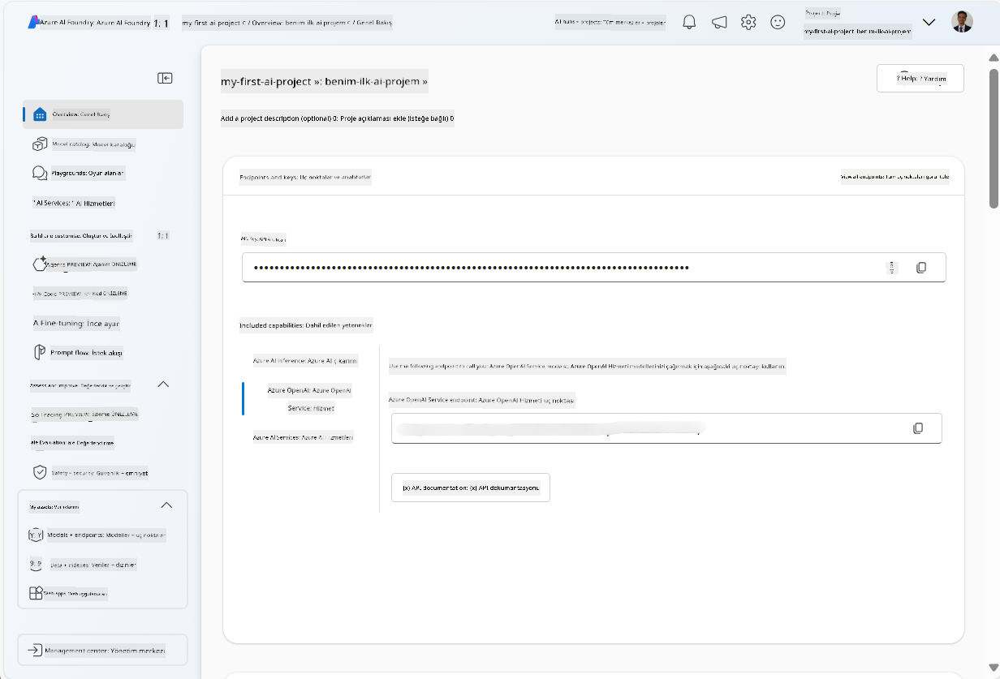
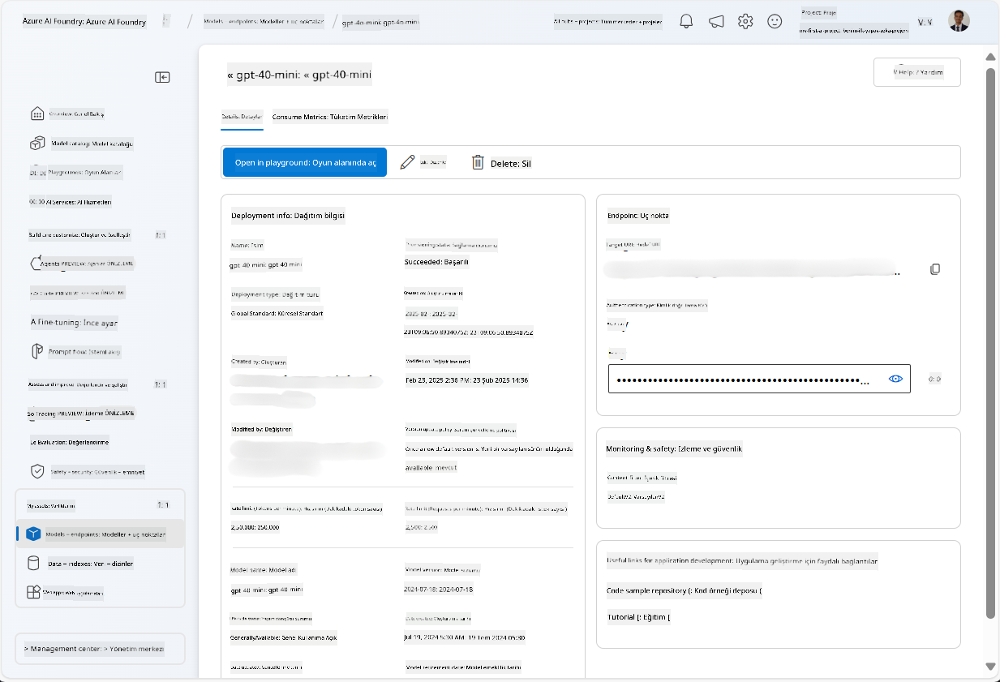
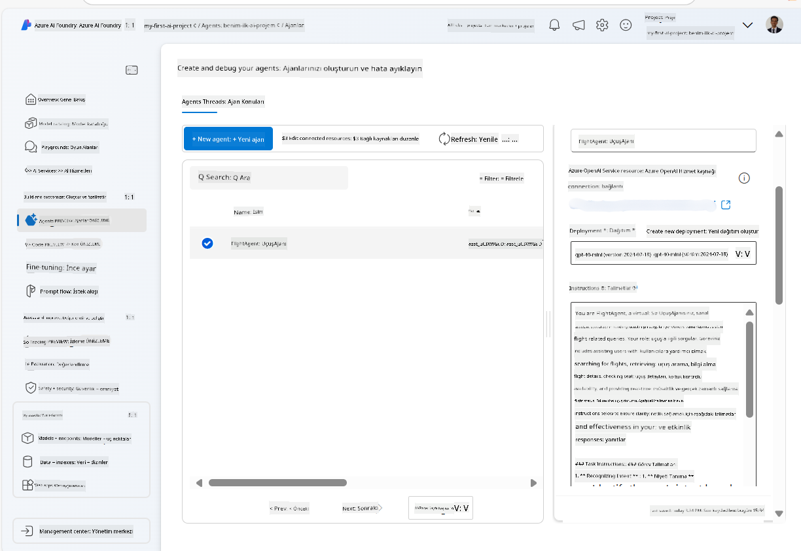
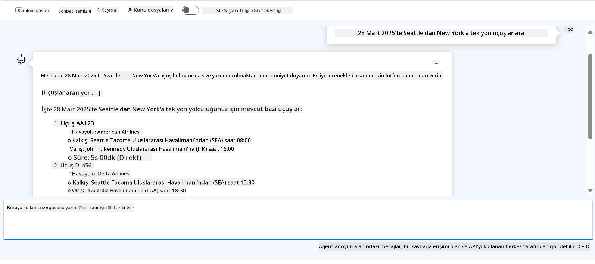

<!--
CO_OP_TRANSLATOR_METADATA:
{
  "original_hash": "7e92870dc0843e13d4dabc620c09d2d9",
  "translation_date": "2025-07-12T08:19:00+00:00",
  "source_file": "02-explore-agentic-frameworks/azure-ai-foundry-agent-creation.md",
  "language_code": "tr"
}
-->
# Azure AI Agent Hizmeti Geliştirme

Bu alıştırmada, [Azure AI Foundry portalı](https://ai.azure.com/?WT.mc_id=academic-105485-koreyst) içindeki Azure AI Agent hizmet araçlarını kullanarak Uçuş Rezervasyonu için bir ajan oluşturacaksınız. Ajan, kullanıcılarla etkileşim kurabilecek ve uçuşlar hakkında bilgi sağlayabilecektir.

## Önkoşullar

Bu alıştırmayı tamamlamak için aşağıdakilere ihtiyacınız var:
1. Aktif aboneliğe sahip bir Azure hesabı. [Ücretsiz hesap oluşturun](https://azure.microsoft.com/free/?WT.mc_id=academic-105485-koreyst).
2. Bir Azure AI Foundry hub oluşturma izninizin olması veya sizin için oluşturulmuş olması.
    - Rolünüz Contributor veya Owner ise, bu öğreticideki adımları takip edebilirsiniz.

## Azure AI Foundry hub oluşturma

> **Note:** Azure AI Foundry önceden Azure AI Studio olarak bilinmekteydi.

1. Azure AI Foundry hub oluşturmak için [Azure AI Foundry](https://learn.microsoft.com/en-us/azure/ai-studio/?WT.mc_id=academic-105485-koreyst) blog yazısındaki yönergeleri izleyin.
2. Projeniz oluşturulduğunda, gösterilen ipuçlarını kapatın ve Azure AI Foundry portalındaki proje sayfasını inceleyin. Sayfa aşağıdaki görsele benzer olmalıdır:

    

## Model dağıtma

1. Projenizin sol panelinde, **My assets** bölümünde, **Models + endpoints** sayfasını seçin.
2. **Models + endpoints** sayfasında, **Model deployments** sekmesinde, **+ Deploy model** menüsünden **Deploy base model** seçeneğini seçin.
3. Listede `gpt-4o-mini` modelini arayın, seçin ve onaylayın.

    > **Note**: TPM değerini düşürmek, kullandığınız abonelikteki kota aşımını önlemeye yardımcı olur.

    

## Ajan oluşturma

Modeli dağıttığınıza göre, artık bir ajan oluşturabilirsiniz. Ajan, kullanıcılarla etkileşim kurabilen bir sohbet AI modelidir.

1. Projenizin sol panelinde, **Build & Customize** bölümünde, **Agents** sayfasını seçin.
2. Yeni bir ajan oluşturmak için **+ Create agent** butonuna tıklayın. **Agent Setup** iletişim kutusunda:
    - Ajan için `FlightAgent` gibi bir isim girin.
    - Daha önce oluşturduğunuz `gpt-4o-mini` model dağıtımının seçili olduğundan emin olun.
    - Ajanın takip etmesini istediğiniz yönergelere göre **Instructions** bölümünü ayarlayın. İşte bir örnek:
    ```
    You are FlightAgent, a virtual assistant specialized in handling flight-related queries. Your role includes assisting users with searching for flights, retrieving flight details, checking seat availability, and providing real-time flight status. Follow the instructions below to ensure clarity and effectiveness in your responses:

    ### Task Instructions:
    1. **Recognizing Intent**:
       - Identify the user's intent based on their request, focusing on one of the following categories:
         - Searching for flights
         - Retrieving flight details using a flight ID
         - Checking seat availability for a specified flight
         - Providing real-time flight status using a flight number
       - If the intent is unclear, politely ask users to clarify or provide more details.
        
    2. **Processing Requests**:
        - Depending on the identified intent, perform the required task:
        - For flight searches: Request details such as origin, destination, departure date, and optionally return date.
        - For flight details: Request a valid flight ID.
        - For seat availability: Request the flight ID and date and validate inputs.
        - For flight status: Request a valid flight number.
        - Perform validations on provided data (e.g., formats of dates, flight numbers, or IDs). If the information is incomplete or invalid, return a friendly request for clarification.

    3. **Generating Responses**:
    - Use a tone that is friendly, concise, and supportive.
    - Provide clear and actionable suggestions based on the output of each task.
    - If no data is found or an error occurs, explain it to the user gently and offer alternative actions (e.g., refine search, try another query).
    
    ```
> [!NOTE]
> Detaylı bir prompt için, daha fazla bilgiye [bu depodan](https://github.com/ShivamGoyal03/RoamMind) ulaşabilirsiniz.
    
> Ayrıca, ajanınızın yeteneklerini artırmak ve kullanıcı taleplerine dayalı otomatik görevler gerçekleştirmek için **Knowledge Base** ve **Actions** ekleyebilirsiniz. Bu alıştırma için bu adımları atlayabilirsiniz.
    


3. Yeni bir çoklu AI ajanı oluşturmak için sadece **New Agent** butonuna tıklayın. Oluşturulan ajan, Agents sayfasında görüntülenecektir.

## Ajanı test etme

Ajanı oluşturduktan sonra, Azure AI Foundry portalındaki oyun alanında kullanıcı sorgularına nasıl yanıt verdiğini test edebilirsiniz.

1. Ajanınızın **Setup** panelinin üst kısmında, **Try in playground** seçeneğini seçin.
2. **Playground** panelinde, sohbet penceresine sorgular yazarak ajanla etkileşim kurabilirsiniz. Örneğin, ajana 28’inde Seattle’dan New York’a uçuş aramasını isteyebilirsiniz.

    > **Note**: Bu alıştırmada gerçek zamanlı veri kullanılmadığı için ajan doğru yanıtlar vermeyebilir. Amaç, ajanın verilen yönergelere göre kullanıcı sorgularını anlama ve yanıt verme yeteneğini test etmektir.

    

3. Ajanı test ettikten sonra, daha fazla niyet, eğitim verisi ve eylem ekleyerek yeteneklerini geliştirebilirsiniz.

## Kaynakları temizleme

Ajanı test etmeyi bitirdiğinizde, ek maliyet oluşmaması için silebilirsiniz.
1. [Azure portalını](https://portal.azure.com) açın ve bu alıştırmada kullandığınız hub kaynaklarının bulunduğu kaynak grubunu görüntüleyin.
2. Araç çubuğunda **Delete resource group** seçeneğini seçin.
3. Kaynak grubu adını girin ve silmek istediğinizi onaylayın.

## Kaynaklar

- [Azure AI Foundry dokümantasyonu](https://learn.microsoft.com/en-us/azure/ai-studio/?WT.mc_id=academic-105485-koreyst)
- [Azure AI Foundry portalı](https://ai.azure.com/?WT.mc_id=academic-105485-koreyst)
- [Azure AI Studio ile Başlarken](https://techcommunity.microsoft.com/blog/educatordeveloperblog/getting-started-with-azure-ai-studio/4095602?WT.mc_id=academic-105485-koreyst)
- [Azure'da AI ajanlarının temelleri](https://learn.microsoft.com/en-us/training/modules/ai-agent-fundamentals/?WT.mc_id=academic-105485-koreyst)
- [Azure AI Discord](https://aka.ms/AzureAI/Discord)

**Feragatname**:  
Bu belge, AI çeviri servisi [Co-op Translator](https://github.com/Azure/co-op-translator) kullanılarak çevrilmiştir. Doğruluk için çaba göstersek de, otomatik çevirilerin hatalar veya yanlışlıklar içerebileceğini lütfen unutmayınız. Orijinal belge, kendi dilinde yetkili kaynak olarak kabul edilmelidir. Kritik bilgiler için profesyonel insan çevirisi önerilir. Bu çevirinin kullanımı sonucu ortaya çıkabilecek yanlış anlamalar veya yorum hatalarından sorumlu değiliz.