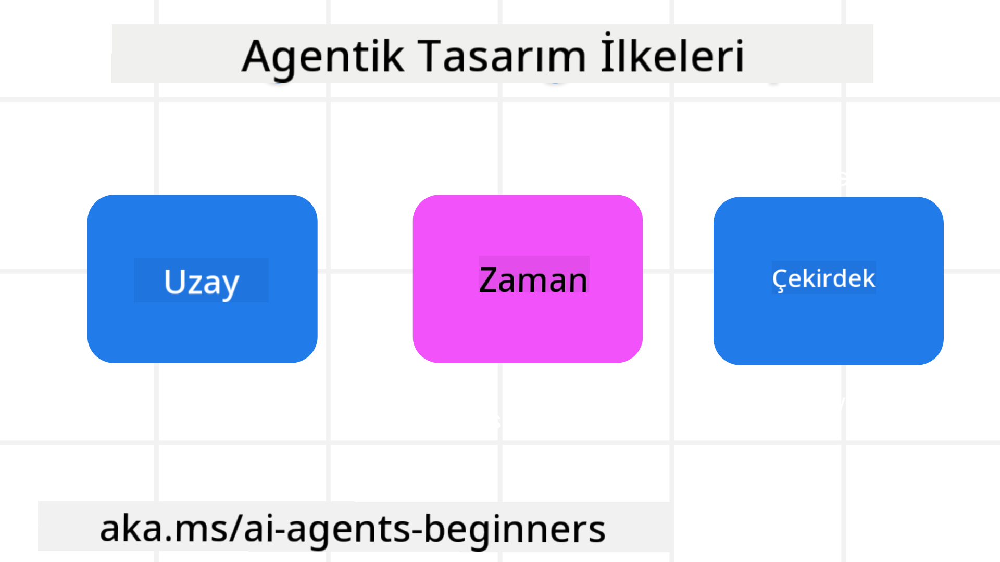

<!--
CO_OP_TRANSLATOR_METADATA:
{
  "original_hash": "4c46e4ff9e349c521e2b0b17f51afa64",
  "translation_date": "2025-08-29T13:19:27+00:00",
  "source_file": "03-agentic-design-patterns/README.md",
  "language_code": "tr"
}
-->

> _(Bu dersin videosunu izlemek için yukarıdaki görsele tıklayın)_
# AI Ajan Tasarım İlkeleri

## Giriş

AI Ajan Sistemleri oluşturmayı düşünmenin birçok yolu vardır. Generative AI tasarımında belirsizliğin bir hata değil, bir özellik olduğu göz önüne alındığında, mühendislerin nereden başlayacaklarını anlamaları bazen zor olabilir. Geliştiricilerin, iş ihtiyaçlarını çözmek için müşteri odaklı ajan sistemleri oluşturmalarını sağlamak amacıyla insan merkezli UX Tasarım İlkeleri oluşturduk. Bu tasarım ilkeleri, kesin bir mimari değil, ajan deneyimlerini tanımlayan ve geliştiren ekipler için bir başlangıç noktasıdır.

Genel olarak, ajanlar şunları yapmalıdır:

- İnsan kapasitesini genişletmek ve ölçeklendirmek (beyin fırtınası, problem çözme, otomasyon vb.)
- Bilgi boşluklarını doldurmak (bilgi alanlarında hız kazandırmak, çeviri vb.)
- Bireyler olarak başkalarıyla çalışma tercihlerimize uygun şekilde iş birliğini kolaylaştırmak ve desteklemek
- Bizi daha iyi versiyonlarımız haline getirmek (örneğin, yaşam koçu/görev yöneticisi, duygusal düzenleme ve farkındalık becerilerini öğrenmemize yardımcı olmak, dayanıklılık oluşturmak vb.)

## Bu Derste Ele Alınacaklar

- Ajan Tasarım İlkeleri nelerdir
- Bu tasarım ilkelerini uygularken izlenmesi gereken bazı yönergeler nelerdir
- Tasarım ilkelerinin kullanımına dair bazı örnekler nelerdir

## Öğrenme Hedefleri

Bu dersi tamamladıktan sonra şunları yapabileceksiniz:

1. Ajan Tasarım İlkelerinin ne olduğunu açıklamak
2. Ajan Tasarım İlkelerinin kullanımına yönelik yönergeleri açıklamak
3. Ajan Tasarım İlkelerini kullanarak bir ajan nasıl oluşturulur anlamak

## Ajan Tasarım İlkeleri

### Ajan (Mekan)

Bu, ajanın faaliyet gösterdiği ortamdır. Bu ilkeler, ajanların fiziksel ve dijital dünyalarda nasıl tasarlanacağını belirler.

- **Bağlantı kurmak, çökertmek değil** – iş birliği ve bağlantıyı sağlamak için insanları diğer insanlara, olaylara ve uygulanabilir bilgilere bağlamaya yardımcı olun.
- Ajanlar olayları, bilgileri ve insanları birbirine bağlamaya yardımcı olur.
- Ajanlar insanları birbirine yakınlaştırır. İnsanların yerini almak veya onları küçümsemek için tasarlanmamışlardır.
- **Kolay erişilebilir ama bazen görünmez** – ajan büyük ölçüde arka planda çalışır ve yalnızca ilgili ve uygun olduğunda bizi uyarır.
  - Ajan, yetkili kullanıcılar için herhangi bir cihaz veya platformda kolayca keşfedilebilir ve erişilebilir olmalıdır.
  - Ajan, çok modlu giriş ve çıkışları destekler (ses, konuşma, metin vb.).
  - Ajan, kullanıcı ihtiyaçlarını algılamasına bağlı olarak, ön plan ve arka plan arasında; proaktif ve reaktif arasında sorunsuz bir şekilde geçiş yapabilir.
  - Ajan görünmez bir biçimde çalışabilir, ancak arka plan işlem yolu ve diğer Ajanlarla iş birliği kullanıcıya şeffaf ve kontrol edilebilir olmalıdır.

### Ajan (Zaman)

Bu, ajanın zaman içinde nasıl çalıştığını ifade eder. Bu ilkeler, ajanların geçmiş, şimdi ve gelecek boyunca nasıl etkileşimde bulunacağını belirler.

- **Geçmiş**: Durum ve bağlamı içeren geçmişe yansımak.
  - Ajan, yalnızca olay, insanlar veya durumlarla sınırlı kalmayan daha zengin geçmiş verilerin analiziyle daha alakalı sonuçlar sağlar.
  - Ajan, geçmiş olaylardan bağlantılar kurar ve mevcut durumlarla etkileşimde bulunmak için hafızayı aktif olarak yansıtır.
- **Şimdi**: Bildirimden çok yönlendirme.
  - Ajan, insanlarla etkileşim kurmak için kapsamlı bir yaklaşımı benimser. Bir olay meydana geldiğinde, Ajan statik bir bildirim veya diğer statik formalitelerin ötesine geçer. Ajan, akışları basitleştirebilir veya kullanıcının dikkatini doğru anda yönlendirmek için dinamik olarak ipuçları oluşturabilir.
  - Ajan, bağlamsal çevreye, sosyal ve kültürel değişimlere dayalı ve kullanıcı niyetine uygun bilgiler sunar.
  - Ajan etkileşimi kademeli olabilir, uzun vadede kullanıcıları güçlendirmek için karmaşıklıkta gelişebilir/büyüyebilir.
- **Gelecek**: Uyum sağlama ve evrimleşme.
  - Ajan, çeşitli cihazlara, platformlara ve modlara uyum sağlar.
  - Ajan, kullanıcı davranışına, erişilebilirlik ihtiyaçlarına uyum sağlar ve serbestçe özelleştirilebilir.
  - Ajan, sürekli kullanıcı etkileşimi yoluyla şekillenir ve gelişir.

### Ajan (Çekirdek)

Bunlar, bir ajanın tasarımının temel unsurlarıdır.

- **Belirsizliği kucaklayın ama güven oluşturun**.
  - Belirli bir düzeyde Ajan belirsizliği beklenir. Belirsizlik, ajan tasarımının temel bir unsurudur.
  - Güven ve şeffaflık, Ajan tasarımının temel katmanlarıdır.
  - Ajanın açık/kapalı olduğu zamanlar insanlar tarafından kontrol edilir ve Ajan durumu her zaman açıkça görülebilir.

## Bu İlkeleri Uygulama Yönergeleri

Yukarıdaki tasarım ilkelerini kullanırken şu yönergeleri izleyin:

1. **Şeffaflık**: Kullanıcıya AI'nın dahil olduğunu, nasıl çalıştığını (geçmiş eylemler dahil) ve nasıl geri bildirim verileceğini ve sistemi nasıl değiştireceğini bildirin.
2. **Kontrol**: Kullanıcının sistemi ve özelliklerini özelleştirmesine, tercihlerini belirtmesine ve kişiselleştirmesine olanak tanıyın (unutma yeteneği dahil).
3. **Tutarlılık**: Cihazlar ve uç noktalar arasında tutarlı, çok modlu deneyimler hedefleyin. Mümkün olduğunda tanıdık UI/UX öğelerini kullanın (örneğin, sesli etkileşim için mikrofon simgesi) ve müşterinin bilişsel yükünü mümkün olduğunca azaltın (örneğin, kısa yanıtlar, görsel yardımcılar ve ‘Daha Fazla Bilgi’ içeriği hedefleyin).

## Bu İlkeler ve Yönergeler Kullanılarak Bir Seyahat Ajanı Nasıl Tasarlanır?

Bir Seyahat Ajanı tasarladığınızı hayal edin, Tasarım İlkeleri ve Yönergeleri kullanmayı şu şekilde düşünebilirsiniz:

1. **Şeffaflık** – Kullanıcıya Seyahat Ajanının bir AI destekli Ajan olduğunu bildirin. Başlamak için bazı temel talimatlar sağlayın (örneğin, bir “Merhaba” mesajı, örnek istemler). Bunu ürün sayfasında açıkça belirtin. Kullanıcının geçmişte sorduğu istemlerin listesini gösterin. Geri bildirim vermenin nasıl yapılacağını netleştirin (beğenme/beğenmeme, Geri Bildirim Gönder düğmesi vb.). Ajanın kullanım veya konu kısıtlamaları varsa bunu açıkça ifade edin.
2. **Kontrol** – Ajan oluşturulduktan sonra kullanıcının Ajanı nasıl değiştirebileceğini netleştirin, örneğin Sistem İstemi gibi. Kullanıcının Ajanın ne kadar ayrıntılı olacağını, yazı stilini ve Ajanın konuşmaması gereken konuları seçmesine olanak tanıyın. Kullanıcının ilişkili dosyaları veya verileri, istemleri ve geçmiş konuşmaları görüntülemesine ve silmesine izin verin.
3. **Tutarlılık** – İstem Paylaş, dosya veya fotoğraf ekle ve birini veya bir şeyi etiketle simgelerinin standart ve tanınabilir olduğundan emin olun. Ajan ile dosya yükleme/paylaşımı için ataş simgesini ve grafik yükleme için bir resim simgesini kullanın.

### AI Ajan Tasarım Kalıpları Hakkında Daha Fazla Sorunuz mu Var?

Diğer öğrenenlerle tanışmak, ofis saatlerine katılmak ve AI Ajanlarıyla ilgili sorularınıza yanıt almak için [Azure AI Foundry Discord](https://aka.ms/ai-agents/discord) sunucusuna katılın.

## Ek Kaynaklar

## Önceki Ders

[Agentic Çerçeveleri Keşfetmek](../02-explore-agentic-frameworks/README.md)

## Sonraki Ders

[Araç Kullanımı Tasarım Kalıbı](../04-tool-use/README.md)

---

**Feragatname**:  
Bu belge, [Co-op Translator](https://github.com/Azure/co-op-translator) adlı yapay zeka çeviri hizmeti kullanılarak çevrilmiştir. Doğruluk için çaba göstersek de, otomatik çevirilerin hata veya yanlışlıklar içerebileceğini lütfen unutmayın. Belgenin orijinal dili, yetkili kaynak olarak kabul edilmelidir. Kritik bilgiler için profesyonel insan çevirisi önerilir. Bu çevirinin kullanımından kaynaklanan yanlış anlama veya yanlış yorumlamalardan sorumlu değiliz.