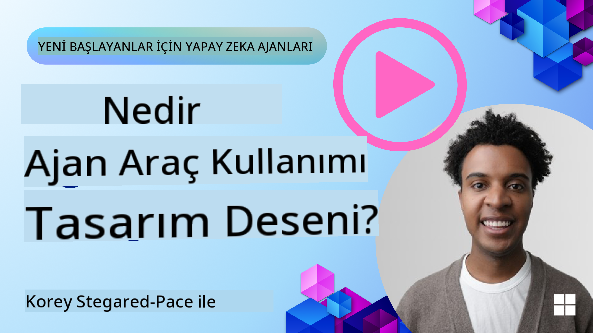
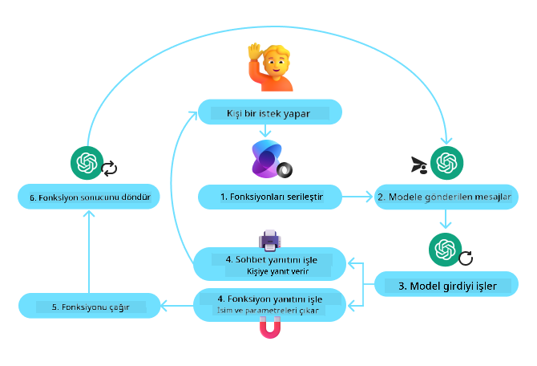
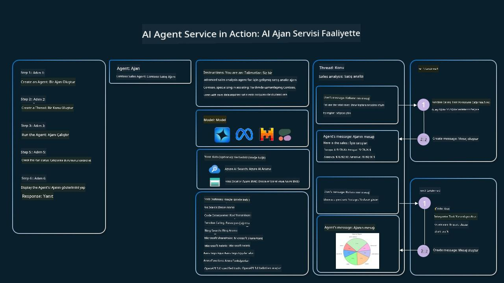

<!--
CO_OP_TRANSLATOR_METADATA:
{
  "original_hash": "88258b03f2893aa2e69eb8fb24baabbc",
  "translation_date": "2025-07-12T09:33:43+00:00",
  "source_file": "04-tool-use/README.md",
  "language_code": "tr"
}
-->
[](https://youtu.be/vieRiPRx-gI?si=cEZ8ApnT6Sus9rhn)

> _(Bu dersin videosunu izlemek için yukarıdaki görsele tıklayın)_

# Araç Kullanımı Tasarım Deseni

Araçlar ilginçtir çünkü AI ajanlarının daha geniş bir yetenek yelpazesine sahip olmasını sağlar. Ajanın gerçekleştirebileceği sınırlı bir eylem seti yerine, bir araç ekleyerek ajan artık çok çeşitli eylemler gerçekleştirebilir. Bu bölümde, AI ajanlarının hedeflerine ulaşmak için belirli araçları nasıl kullanabileceğini tanımlayan Araç Kullanımı Tasarım Deseni'ne bakacağız.

## Giriş

Bu derste aşağıdaki sorulara yanıt arıyoruz:

- Araç kullanımı tasarım deseni nedir?
- Hangi kullanım durumlarına uygulanabilir?
- Tasarım desenini uygulamak için gereken öğeler/yapı taşları nelerdir?
- Güvenilir AI ajanları oluşturmak için Araç Kullanımı Tasarım Deseni kullanırken nelere dikkat edilmelidir?

## Öğrenme Hedefleri

Bu dersi tamamladıktan sonra şunları yapabileceksiniz:

- Araç Kullanımı Tasarım Deseni’ni ve amacını tanımlamak.
- Araç Kullanımı Tasarım Deseni’nin uygulanabileceği kullanım durumlarını belirlemek.
- Tasarım desenini uygulamak için gereken temel öğeleri anlamak.
- Bu tasarım desenini kullanan AI ajanlarında güvenilirliği sağlamak için dikkat edilmesi gerekenleri fark etmek.

## Araç Kullanımı Tasarım Deseni Nedir?

**Araç Kullanımı Tasarım Deseni**, LLM’lere belirli hedeflere ulaşmak için dış araçlarla etkileşim kurma yeteneği kazandırmaya odaklanır. Araçlar, bir ajanın eylem gerçekleştirmek için çalıştırabileceği kodlardır. Bir araç, hesap makinesi gibi basit bir fonksiyon olabileceği gibi, hisse senedi fiyatı sorgulama veya hava durumu tahmini gibi üçüncü taraf bir hizmete yapılan API çağrısı da olabilir. AI ajanları bağlamında, araçlar **model tarafından oluşturulan fonksiyon çağrılarına** yanıt olarak ajanlar tarafından çalıştırılmak üzere tasarlanmıştır.

## Hangi kullanım durumlarına uygulanabilir?

AI Ajanları, karmaşık görevleri tamamlamak, bilgi almak veya karar vermek için araçlardan yararlanabilir. Araç kullanımı tasarım deseni, veritabanları, web servisleri veya kod yorumlayıcılar gibi dış sistemlerle dinamik etkileşim gerektiren senaryolarda sıklıkla kullanılır. Bu yetenek, aşağıdaki gibi çeşitli kullanım durumları için faydalıdır:

- **Dinamik Bilgi Alma:** Ajanlar, güncel verileri almak için dış API’lere veya veritabanlarına sorgu gönderebilir (örneğin, veri analizi için SQLite veritabanı sorgulama, hisse senedi fiyatları veya hava durumu bilgisi alma).
- **Kod Çalıştırma ve Yorumlama:** Ajanlar, matematiksel problemleri çözmek, raporlar oluşturmak veya simülasyonlar yapmak için kod veya betikler çalıştırabilir.
- **İş Akışı Otomasyonu:** Görev zamanlayıcılar, e-posta servisleri veya veri boru hatları gibi araçları entegre ederek tekrarlayan veya çok adımlı iş akışlarını otomatikleştirme.
- **Müşteri Desteği:** Ajanlar, CRM sistemleri, bilet platformları veya bilgi tabanları ile etkileşime girerek kullanıcı sorularını çözebilir.
- **İçerik Üretimi ve Düzenleme:** Ajanlar, dilbilgisi denetleyiciler, metin özetleyiciler veya içerik güvenliği değerlendirme araçları gibi araçlardan yararlanarak içerik oluşturma görevlerine yardımcı olabilir.

## Araç kullanımı tasarım desenini uygulamak için gereken öğeler/yapı taşları nelerdir?

Bu yapı taşları, AI ajanının çok çeşitli görevleri yerine getirmesini sağlar. Araç Kullanımı Tasarım Deseni’ni uygulamak için gereken temel öğelere bakalım:

- **Fonksiyon/Araç Şemaları**: Kullanılabilir araçların fonksiyon adı, amacı, gerekli parametreler ve beklenen çıktılar dahil olmak üzere ayrıntılı tanımları. Bu şemalar, LLM’nin hangi araçların mevcut olduğunu ve geçerli isteklerin nasıl oluşturulacağını anlamasını sağlar.

- **Fonksiyon Çalıştırma Mantığı**: Araçların ne zaman ve nasıl çağrılacağını, kullanıcının niyeti ve konuşma bağlamına göre yöneten mekanizmalar. Bu, planlayıcı modüller, yönlendirme mekanizmaları veya araç kullanımını dinamik olarak belirleyen koşullu akışları içerebilir.

- **Mesaj Yönetim Sistemi**: Kullanıcı girdileri, LLM yanıtları, araç çağrıları ve araç çıktıları arasındaki konuşma akışını yöneten bileşenler.

- **Araç Entegrasyon Çerçevesi**: Ajanı, basit fonksiyonlar veya karmaşık dış hizmetler olsun çeşitli araçlara bağlayan altyapı.

- **Hata Yönetimi ve Doğrulama**: Araç çalıştırma hatalarını ele alma, parametreleri doğrulama ve beklenmeyen yanıtları yönetme mekanizmaları.

- **Durum Yönetimi**: Çok turlu etkileşimlerde tutarlılığı sağlamak için konuşma bağlamını, önceki araç etkileşimlerini ve kalıcı verileri takip etme.

Şimdi Fonksiyon/Araç Çağrısına daha yakından bakalım.

### Fonksiyon/Araç Çağrısı

Fonksiyon çağrısı, Büyük Dil Modellerinin (LLM’ler) araçlarla etkileşim kurmasını sağlayan temel yoldur. 'Fonksiyon' ve 'Araç' terimleri sıklıkla birbirinin yerine kullanılır çünkü 'fonksiyonlar' (yeniden kullanılabilir kod blokları) ajanların görevleri yerine getirmek için kullandığı 'araçlardır'. Bir fonksiyonun kodunun çağrılabilmesi için, LLM’nin kullanıcının isteğini fonksiyonun açıklamasıyla karşılaştırması gerekir. Bunun için, mevcut tüm fonksiyonların açıklamalarını içeren bir şema LLM’ye gönderilir. LLM, göreve en uygun fonksiyonu seçer ve adını ile argümanlarını döner. Seçilen fonksiyon çağrılır, yanıtı LLM’ye gönderilir ve LLM bu bilgiyi kullanarak kullanıcının isteğine yanıt verir.

Geliştiricilerin ajanlar için fonksiyon çağrısını uygulayabilmesi için şunlara ihtiyaç vardır:

1. Fonksiyon çağrısını destekleyen bir LLM modeli
2. Fonksiyon açıklamalarını içeren bir şema
3. Açıklanan her fonksiyon için kod

Bir şehre ait güncel saati alma örneğiyle açıklayalım:

1. **Fonksiyon çağrısını destekleyen bir LLM başlatın:**

    Tüm modeller fonksiyon çağrısını desteklemez, bu yüzden kullandığınız LLM’nin desteklediğinden emin olmak önemlidir. <a href="https://learn.microsoft.com/azure/ai-services/openai/how-to/function-calling" target="_blank">Azure OpenAI</a> fonksiyon çağrısını destekler. Azure OpenAI istemcisini başlatarak başlayabiliriz.

    ```python
    # Initialize the Azure OpenAI client
    client = AzureOpenAI(
        azure_endpoint = os.getenv("AZURE_OPENAI_ENDPOINT"), 
        api_key=os.getenv("AZURE_OPENAI_API_KEY"),  
        api_version="2024-05-01-preview"
    )
    ```

1. **Bir Fonksiyon Şeması oluşturun:**

    Sonra, fonksiyon adı, fonksiyonun ne yaptığına dair açıklama ve fonksiyon parametrelerinin adları ile açıklamalarını içeren bir JSON şeması tanımlayacağız. Bu şemayı, daha önce oluşturduğumuz istemciye ve kullanıcının San Francisco’daki zamanı bulma isteğine ileteceğiz. Önemli olan, **araç çağrısının** döndürüldüğüdür, **sorunun nihai cevabı değil**. Daha önce belirtildiği gibi, LLM göreve seçtiği fonksiyonun adını ve ona iletilecek argümanları döner.

    ```python
    # Function description for the model to read
    tools = [
        {
            "type": "function",
            "function": {
                "name": "get_current_time",
                "description": "Get the current time in a given location",
                "parameters": {
                    "type": "object",
                    "properties": {
                        "location": {
                            "type": "string",
                            "description": "The city name, e.g. San Francisco",
                        },
                    },
                    "required": ["location"],
                },
            }
        }
    ]
    ```
   
    ```python
  
    # Initial user message
    messages = [{"role": "user", "content": "What's the current time in San Francisco"}] 
  
    # First API call: Ask the model to use the function
      response = client.chat.completions.create(
          model=deployment_name,
          messages=messages,
          tools=tools,
          tool_choice="auto",
      )
  
      # Process the model's response
      response_message = response.choices[0].message
      messages.append(response_message)
  
      print("Model's response:")  

      print(response_message)
  
    ```

    ```bash
    Model's response:
    ChatCompletionMessage(content=None, role='assistant', function_call=None, tool_calls=[ChatCompletionMessageToolCall(id='call_pOsKdUlqvdyttYB67MOj434b', function=Function(arguments='{"location":"San Francisco"}', name='get_current_time'), type='function')])
    ```
  
1. **Görevi yerine getirmek için gereken fonksiyon kodu:**

    LLM hangi fonksiyonun çalıştırılması gerektiğini seçtikten sonra, görevi yerine getiren kod uygulanmalı ve çalıştırılmalıdır. Python’da güncel saati alma kodunu yazabiliriz. Ayrıca, son sonucu almak için response_message’dan fonksiyon adı ve argümanları çıkarmak için kod yazmamız gerekecek.

    ```python
      def get_current_time(location):
        """Get the current time for a given location"""
        print(f"get_current_time called with location: {location}")  
        location_lower = location.lower()
        
        for key, timezone in TIMEZONE_DATA.items():
            if key in location_lower:
                print(f"Timezone found for {key}")  
                current_time = datetime.now(ZoneInfo(timezone)).strftime("%I:%M %p")
                return json.dumps({
                    "location": location,
                    "current_time": current_time
                })
      
        print(f"No timezone data found for {location_lower}")  
        return json.dumps({"location": location, "current_time": "unknown"})
    ```

    ```python
     # Handle function calls
      if response_message.tool_calls:
          for tool_call in response_message.tool_calls:
              if tool_call.function.name == "get_current_time":
     
                  function_args = json.loads(tool_call.function.arguments)
     
                  time_response = get_current_time(
                      location=function_args.get("location")
                  )
     
                  messages.append({
                      "tool_call_id": tool_call.id,
                      "role": "tool",
                      "name": "get_current_time",
                      "content": time_response,
                  })
      else:
          print("No tool calls were made by the model.")  
  
      # Second API call: Get the final response from the model
      final_response = client.chat.completions.create(
          model=deployment_name,
          messages=messages,
      )
  
      return final_response.choices[0].message.content
     ```

    ```bash
      get_current_time called with location: San Francisco
      Timezone found for san francisco
      The current time in San Francisco is 09:24 AM.
     ```

Fonksiyon Çağrısı, çoğu (hatta tümü) ajan araç kullanımı tasarımının merkezindedir, ancak sıfırdan uygulamak bazen zor olabilir. [Ders 2](../../../02-explore-agentic-frameworks)’de öğrendiğimiz gibi, ajan çerçeveleri araç kullanımını uygulamak için önceden hazırlanmış yapı taşları sağlar.

## Agentic Framework’lerle Araç Kullanımı Örnekleri

Farklı agentic framework’ler kullanarak Araç Kullanımı Tasarım Deseni’ni nasıl uygulayabileceğinize dair bazı örnekler:

### Semantic Kernel

<a href="https://learn.microsoft.com/azure/ai-services/agents/overview" target="_blank">Semantic Kernel</a>, Büyük Dil Modelleri (LLM) ile çalışan .NET, Python ve Java geliştiricileri için açık kaynaklı bir AI çerçevesidir. Fonksiyon çağrısını, fonksiyonlarınızı ve parametrelerini otomatik olarak modele açıklayan <a href="https://learn.microsoft.com/semantic-kernel/concepts/ai-services/chat-completion/function-calling/?pivots=programming-language-python#1-serializing-the-functions" target="_blank">serileştirme</a> süreciyle kolaylaştırır. Ayrıca model ile kodunuz arasındaki iletişimi yönetir. Semantic Kernel gibi bir agentic framework kullanmanın bir diğer avantajı, <a href="https://github.com/microsoft/semantic-kernel/blob/main/python/samples/getting_started_with_agents/openai_assistant/step4_assistant_tool_file_search.py" target="_blank">Dosya Arama</a> ve <a href="https://github.com/microsoft/semantic-kernel/blob/main/python/samples/getting_started_with_agents/openai_assistant/step3_assistant_tool_code_interpreter.py" target="_blank">Kod Yorumlayıcı</a> gibi önceden hazırlanmış araçlara erişim sağlamasıdır.

Aşağıdaki diyagram, Semantic Kernel ile fonksiyon çağrısı sürecini göstermektedir:



Semantic Kernel’de fonksiyonlar/araçlar <a href="https://learn.microsoft.com/semantic-kernel/concepts/plugins/?pivots=programming-language-python" target="_blank">Eklentiler</a> olarak adlandırılır. Daha önce gördüğümüz `get_current_time` fonksiyonunu, fonksiyonu içeren bir sınıfa dönüştürerek bir eklenti haline getirebiliriz. Ayrıca fonksiyon açıklamasını alan `kernel_function` dekoratörünü içe aktarabiliriz. Daha sonra GetCurrentTimePlugin ile bir kernel oluşturduğunuzda, kernel fonksiyonu ve parametrelerini otomatik olarak serileştirir ve LLM’ye gönderilecek şemayı oluşturur.

```python
from semantic_kernel.functions import kernel_function

class GetCurrentTimePlugin:
    async def __init__(self, location):
        self.location = location

    @kernel_function(
        description="Get the current time for a given location"
    )
    def get_current_time(location: str = ""):
        ...

```

```python 
from semantic_kernel import Kernel

# Create the kernel
kernel = Kernel()

# Create the plugin
get_current_time_plugin = GetCurrentTimePlugin(location)

# Add the plugin to the kernel
kernel.add_plugin(get_current_time_plugin)
```
  
### Azure AI Agent Service

<a href="https://learn.microsoft.com/azure/ai-services/agents/overview" target="_blank">Azure AI Agent Service</a>, geliştiricilerin temel hesaplama ve depolama kaynaklarını yönetmeden yüksek kaliteli, ölçeklenebilir ve genişletilebilir AI ajanları güvenli bir şekilde oluşturmasını, dağıtmasını ve yönetmesini sağlayan yeni bir agentic framework’tür. Özellikle kurumsal uygulamalar için uygundur çünkü tam yönetilen bir hizmettir ve kurumsal düzeyde güvenlik sunar.

LLM API’si ile doğrudan geliştirmeye kıyasla Azure AI Agent Service şu avantajları sağlar:

- Otomatik araç çağrısı – araç çağrısını ayrıştırmaya, aracı çağırmaya ve yanıtı işlemeye gerek yok; tümü sunucu tarafında yapılır
- Güvenli veri yönetimi – kendi konuşma durumunuzu yönetmek yerine, tüm bilgileri saklamak için thread’lere güvenebilirsiniz
- Kutudan çıkar çıkmaz araçlar – Bing, Azure AI Search ve Azure Functions gibi veri kaynaklarınızla etkileşim için kullanabileceğiniz araçlar.

Azure AI Agent Service’deki araçlar iki kategoriye ayrılır:

1. Bilgi Araçları:
    - <a href="https://learn.microsoft.com/azure/ai-services/agents/how-to/tools/bing-grounding?tabs=python&pivots=overview" target="_blank">Bing Arama ile Temellendirme</a>
    - <a href="https://learn.microsoft.com/azure/ai-services/agents/how-to/tools/file-search?tabs=python&pivots=overview" target="_blank">Dosya Arama</a>
    - <a href="https://learn.microsoft.com/azure/ai-services/agents/how-to/tools/azure-ai-search?tabs=azurecli%2Cpython&pivots=overview-azure-ai-search" target="_blank">Azure AI Search</a>

2. Eylem Araçları:
    - <a href="https://learn.microsoft.com/azure/ai-services/agents/how-to/tools/function-calling?tabs=python&pivots=overview" target="_blank">Fonksiyon Çağrısı</a>
    - <a href="https://learn.microsoft.com/azure/ai-services/agents/how-to/tools/code-interpreter?tabs=python&pivots=overview" target="_blank">Kod Yorumlayıcı</a>
    - <a href="https://learn.microsoft.com/azure/ai-services/agents/how-to/tools/openapi-spec?tabs=python&pivots=overview" target="_blank">OpenAI tanımlı araçlar</a>
    - <a href="https://learn.microsoft.com/azure/ai-services/agents/how-to/tools/azure-functions?pivots=overview" target="_blank">Azure Functions</a>

Agent Service, bu araçları bir `toolset` olarak birlikte kullanmamıza olanak tanır. Ayrıca belirli bir konuşmanın mesaj geçmişini takip eden `thread`leri kullanır.

Contoso adlı bir şirkette satış temsilcisi olduğunuzu hayal edin. Satış verilerinizle ilgili soruları yanıtlayabilen bir sohbet ajanı geliştirmek istiyorsunuz.

Aşağıdaki görsel, Azure AI Agent Service’i kullanarak satış verilerinizi nasıl analiz edebileceğinizi göstermektedir:



Bu araçlardan herhangi birini servisle kullanmak için bir istemci oluşturup bir araç veya araç seti tanımlayabiliriz. Bunu pratikte uygulamak için aşağıdaki Python kodunu kullanabiliriz. LLM, araç setine bakarak kullanıcının isteğine bağlı olarak kullanıcı tarafından oluşturulan `fetch_sales_data_using_sqlite_query` fonksiyonunu mu yoksa önceden hazırlanmış Kod Yorumlayıcı’yı mı kullanacağına karar verebilir.

```python 
import os
from azure.ai.projects import AIProjectClient
from azure.identity import DefaultAzureCredential
from fecth_sales_data_functions import fetch_sales_data_using_sqlite_query # fetch_sales_data_using_sqlite_query function which can be found in a fetch_sales_data_functions.py file.
from azure.ai.projects.models import ToolSet, FunctionTool, CodeInterpreterTool

project_client = AIProjectClient.from_connection_string(
    credential=DefaultAzureCredential(),
    conn_str=os.environ["PROJECT_CONNECTION_STRING"],
)

# Initialize function calling agent with the fetch_sales_data_using_sqlite_query function and adding it to the toolset
fetch_data_function = FunctionTool(fetch_sales_data_using_sqlite_query)
toolset = ToolSet()
toolset.add(fetch_data_function)

# Initialize Code Interpreter tool and adding it to the toolset. 
code_interpreter = code_interpreter = CodeInterpreterTool()
toolset = ToolSet()
toolset.add(code_interpreter)

agent = project_client.agents.create_agent(
    model="gpt-4o-mini", name="my-agent", instructions="You are helpful agent", 
    toolset=toolset
)
```

## Güvenilir AI ajanları oluşturmak için Araç Kullanımı Tasarım Deseni kullanırken nelere dikkat edilmelidir?

LLM’ler tarafından dinamik olarak oluşturulan SQL ile ilgili yaygın bir endişe güvenliktir; özellikle SQL enjeksiyonu veya veritabanını silme ya da değiştirme gibi kötü niyetli eylemler riski. Bu endişeler geçerli olmakla birlikte, veritabanı erişim izinlerinin doğru yapılandırılmasıyla etkili şekilde azaltılabilir. Çoğu veritabanı için bu, veritabanının salt okunur olarak yapılandırılması anlamına gelir. PostgreSQL veya Azure SQL gibi veritabanı hizmetlerinde, uygulamaya salt okunur (SELECT) rolü atanmalıdır.

Uygulamanın güvenli bir ortamda çalıştırılması korumayı daha da artırır. Kurumsal senaryolarda, veriler genellikle operasyonel sistemlerden çıkarılır ve kullanıcı dostu bir şemaya sahip salt okunur bir veritabanı veya veri ambarına dönüştürülür. Bu yaklaşım, verilerin güvenli, performans ve erişilebilirlik açısından optimize edilmiş olmasını ve uygulamanın kısıtlı, salt okunur erişime sahip olmasını sağlar.

## Ek Kaynaklar

-
<a href="https://microsoft.github.io/build-your-first-agent-with-azure-ai-agent-service-workshop/" target="_blank">
Azure AI Agents Service Atölyesi</a>
- <a href="https://github.com/Azure-Samples/contoso-creative-writer/tree/main/docs/workshop" target="_blank">Contoso Creative Writer Çoklu Ajan Atölyesi</a>
- <a href="https://learn.microsoft.com/semantic-kernel/concepts/ai-services/chat-completion/function-calling/?pivots=programming-language-python#1-serializing-the-functions" target="_blank">Semantic Kernel Fonksiyon Çağırma Eğitimi</a>
- <a href="https://github.com/microsoft/semantic-kernel/blob/main/python/samples/getting_started_with_agents/openai_assistant/step3_assistant_tool_code_interpreter.py" target="_blank">Semantic Kernel Kod Yorumlayıcı</a>
- <a href="https://microsoft.github.io/autogen/dev/user-guide/core-user-guide/components/tools.html" target="_blank">Autogen Araçları</a>

## Önceki Ders

[Agentik Tasarım Desenlerini Anlamak](../03-agentic-design-patterns/README.md)

## Sonraki Ders

[Agentik RAG](../05-agentic-rag/README.md)

**Feragatname**:  
Bu belge, AI çeviri servisi [Co-op Translator](https://github.com/Azure/co-op-translator) kullanılarak çevrilmiştir. Doğruluk için çaba gösterilse de, otomatik çevirilerin hatalar veya yanlışlıklar içerebileceğini lütfen unutmayınız. Orijinal belge, kendi dilinde yetkili kaynak olarak kabul edilmelidir. Kritik bilgiler için profesyonel insan çevirisi önerilir. Bu çevirinin kullanımı sonucu oluşabilecek yanlış anlamalar veya yorum hatalarından sorumlu değiliz.