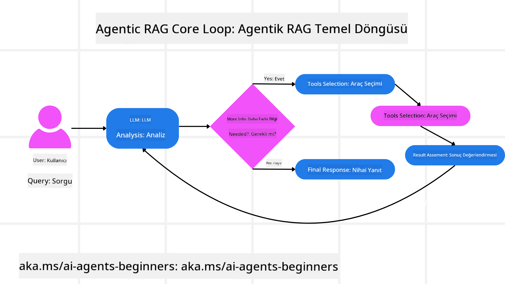
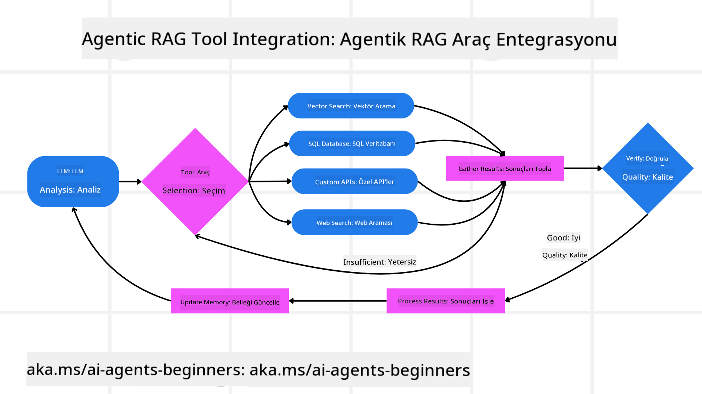
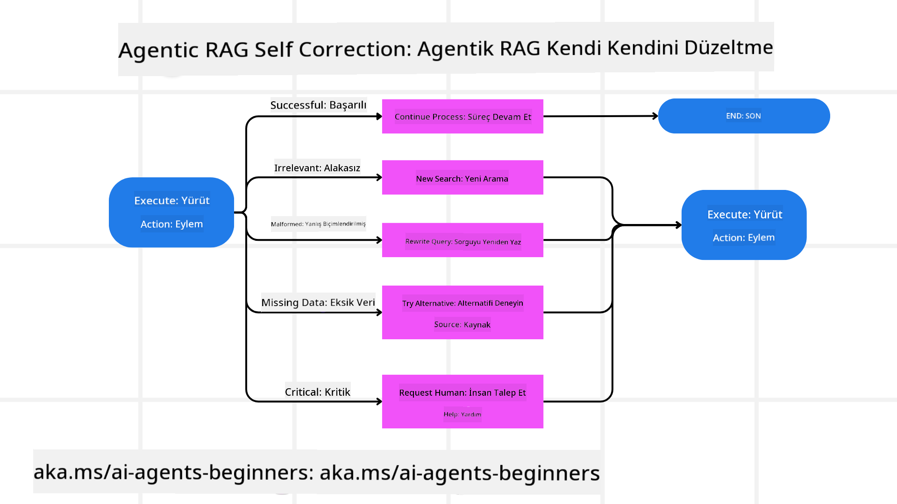
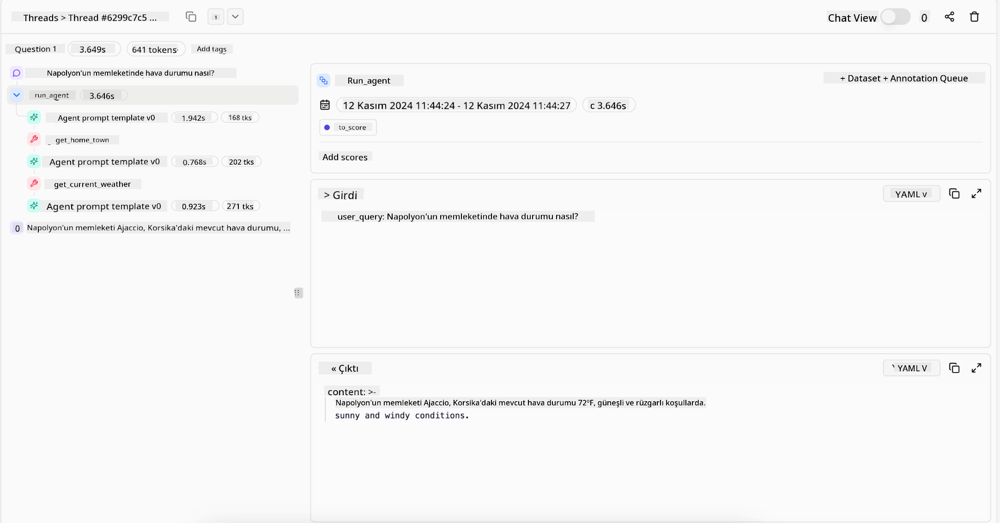
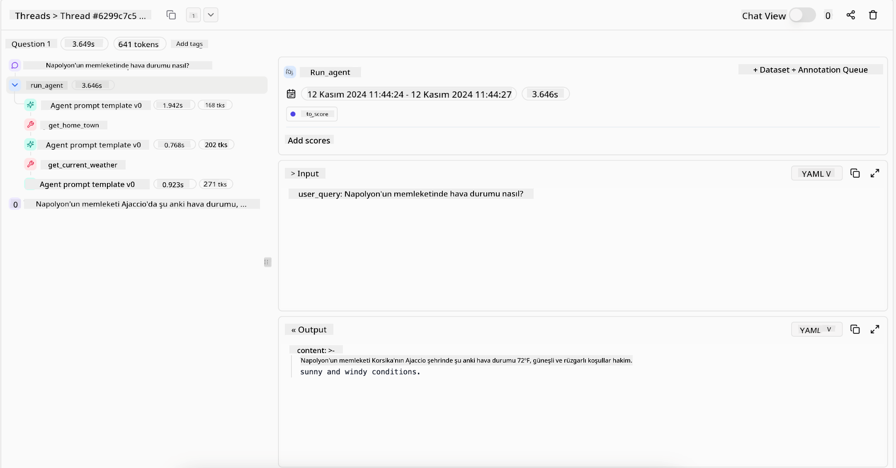

<!--
CO_OP_TRANSLATOR_METADATA:
{
  "original_hash": "7622aa72f9e676e593339f5f694ecd7d",
  "translation_date": "2025-07-12T10:01:54+00:00",
  "source_file": "05-agentic-rag/README.md",
  "language_code": "tr"
}
-->

> _(Bu dersin videosunu izlemek için yukarıdaki görsele tıklayın)_

# Agentic RAG

Bu ders, büyük dil modellerinin (LLM’ler) dış kaynaklardan bilgi çekerken kendi sonraki adımlarını özerk şekilde planladığı yeni bir yapay zeka paradigması olan Agentic Retrieval-Augmented Generation (Agentic RAG) hakkında kapsamlı bir genel bakış sunar. Statik retrieval-then-read (getir-okuma) kalıplarının aksine, Agentic RAG, araç veya fonksiyon çağrıları ve yapılandırılmış çıktılarla kesintiye uğrayan yinelemeli LLM çağrılarından oluşur. Sistem sonuçları değerlendirir, sorguları iyileştirir, gerekirse ek araçlar çağırır ve tatmin edici bir çözüm elde edilene kadar bu döngüyü sürdürür.

## Giriş

Bu derste şunlar ele alınacak:

- **Agentic RAG’i Anlamak:** Büyük dil modellerinin (LLM’ler) dış veri kaynaklarından bilgi çekerken kendi sonraki adımlarını özerk şekilde planladığı yeni yapay zeka paradigmasını öğrenin.
- **Yinelemeli Maker-Checker Tarzını Kavramak:** Doğruluğu artırmak ve hatalı sorguları yönetmek için araç veya fonksiyon çağrıları ve yapılandırılmış çıktılarla kesintiye uğrayan yinelemeli LLM çağrılarından oluşan döngüyü anlayın.
- **Pratik Uygulamaları Keşfetmek:** Agentic RAG’in doğruluk öncelikli ortamlar, karmaşık veritabanı etkileşimleri ve uzun iş akışları gibi senaryolarda nasıl öne çıktığını belirleyin.

## Öğrenme Hedefleri

Bu dersi tamamladıktan sonra şunları bilecek/anlayacaksınız:

- **Agentic RAG’i Anlamak:** Büyük dil modellerinin (LLM’ler) dış veri kaynaklarından bilgi çekerken kendi sonraki adımlarını özerk şekilde planladığı yeni yapay zeka paradigmasını öğrenmek.
- **Yinelemeli Maker-Checker Tarzı:** Doğruluğu artırmak ve hatalı sorguları yönetmek için araç veya fonksiyon çağrıları ve yapılandırılmış çıktılarla kesintiye uğrayan yinelemeli LLM çağrılarından oluşan döngü kavramını kavramak.
- **Akıl Yürütme Sürecine Sahip Olmak:** Sistemin önceden tanımlanmış yollar yerine problemleri nasıl ele alacağına karar verme yeteneğini anlamak.
- **İş Akışı:** Agentic modelin piyasa trend raporlarını bağımsız şekilde nasıl getirdiğini, rakip verileri tanımladığını, dahili satış metriklerini ilişkilendirdiğini, bulguları sentezlediğini ve stratejiyi değerlendirdiğini anlamak.
- **Yinelemeli Döngüler, Araç Entegrasyonu ve Bellek:** Sistemin durum ve belleği adımlar arasında koruyarak tekrarlayan döngülerden kaçınmasını ve bilinçli kararlar vermesini sağlayan döngüsel etkileşim modelini öğrenmek.
- **Başarısızlık Modları ve Öz-Düzeltme:** Sistemin, yineleme ve yeniden sorgulama, tanı araçları kullanma ve insan denetimine başvurma gibi sağlam öz-düzeltme mekanizmalarını keşfetmek.
- **Ajansın Sınırları:** Agentic RAG’in alan spesifik özerkliği, altyapı bağımlılığı ve koruyucu sınırların önemi gibi sınırlamalarını anlamak.
- **Pratik Kullanım Alanları ve Değeri:** Agentic RAG’in doğruluk öncelikli ortamlar, karmaşık veritabanı etkileşimleri ve uzun iş akışları gibi senaryolarda nasıl öne çıktığını belirlemek.
- **Yönetim, Şeffaflık ve Güven:** Açıklanabilir akıl yürütme, önyargı kontrolü ve insan denetimi dahil olmak üzere yönetim ve şeffaflığın önemini öğrenmek.

## Agentic RAG Nedir?

Agentic Retrieval-Augmented Generation (Agentic RAG), büyük dil modellerinin (LLM’ler) dış kaynaklardan bilgi çekerken kendi sonraki adımlarını özerk şekilde planladığı yeni bir yapay zeka paradigmasıdır. Statik retrieval-then-read kalıplarının aksine, Agentic RAG, araç veya fonksiyon çağrıları ve yapılandırılmış çıktılarla kesintiye uğrayan yinelemeli LLM çağrılarından oluşur. Sistem sonuçları değerlendirir, sorguları iyileştirir, gerekirse ek araçlar çağırır ve tatmin edici bir çözüm elde edilene kadar bu döngüyü sürdürür. Bu yinelemeli “maker-checker” tarzı, doğruluğu artırır, hatalı sorguları yönetir ve yüksek kaliteli sonuçlar sağlar.

Sistem akıl yürütme sürecine aktif olarak sahip çıkar; başarısız sorguları yeniden yazar, farklı retrieval yöntemleri seçer ve Azure AI Search’te vektör araması, SQL veritabanları veya özel API’ler gibi birden fazla aracı entegre eder. Agentic sistemin ayırt edici özelliği, akıl yürütme sürecine sahip olabilmesidir. Geleneksel RAG uygulamaları önceden tanımlanmış yollara dayanırken, agentic sistem bulduğu bilginin kalitesine göre adımların sırasını özerk şekilde belirler.

## Agentic Retrieval-Augmented Generation (Agentic RAG) Tanımı

Agentic Retrieval-Augmented Generation (Agentic RAG), LLM’lerin sadece dış veri kaynaklarından bilgi çekmekle kalmayıp aynı zamanda sonraki adımlarını özerk şekilde planladığı yeni bir yapay zeka geliştirme paradigmasıdır. Statik retrieval-then-read kalıplarından veya dikkatlice yazılmış prompt dizilerinden farklı olarak, Agentic RAG, araç veya fonksiyon çağrıları ve yapılandırılmış çıktılarla kesintiye uğrayan yinelemeli LLM çağrılarından oluşan bir döngü içerir. Sistem her adımda elde ettiği sonuçları değerlendirir, sorgularını iyileştirip iyileştirmemeye karar verir, gerekirse ek araçlar çağırır ve tatmin edici bir çözüme ulaşana kadar bu döngüyü sürdürür.

Bu yinelemeli “maker-checker” çalışma tarzı, doğruluğu artırmak, yapısal veritabanlarına yönelik hatalı sorguları (örneğin NL2SQL) yönetmek ve dengeli, yüksek kaliteli sonuçlar sağlamak için tasarlanmıştır. Sadece dikkatlice hazırlanmış prompt zincirlerine güvenmek yerine, sistem akıl yürütme sürecine aktif olarak sahip çıkar. Başarısız olan sorguları yeniden yazabilir, farklı retrieval yöntemleri seçebilir ve Azure AI Search’te vektör araması, SQL veritabanları veya özel API’ler gibi birden fazla aracı entegre edebilir. Bu, aşırı karmaşık orkestrasyon çerçevelerine olan ihtiyacı ortadan kaldırır. Bunun yerine, nispeten basit bir “LLM çağrısı → araç kullanımı → LLM çağrısı → …” döngüsü sofistike ve sağlam çıktılar üretebilir.

## Akıl Yürütme Sürecine Sahip Olmak

Bir sistemi “agentic” yapan ayırt edici özellik, akıl yürütme sürecine sahip olabilmesidir. Geleneksel RAG uygulamaları genellikle model için ne zaman ve neyi getireceğini belirten bir düşünce zincirini insanın önceden tanımlamasına dayanır. Ancak gerçek anlamda agentic bir sistem, problemi nasıl ele alacağına içsel olarak karar verir. Sadece bir betiği çalıştırmaz; bulduğu bilginin kalitesine göre adımların sırasını özerk şekilde belirler.

Örneğin, bir ürün lansman stratejisi oluşturması istendiğinde, tüm araştırma ve karar verme iş akışını açıklayan bir prompt’a tamamen bağlı kalmaz. Bunun yerine agentic model bağımsız olarak şunları yapmaya karar verir:

1. Bing Web Grounding kullanarak güncel piyasa trend raporlarını getirir.
2. Azure AI Search kullanarak ilgili rakip verilerini tanımlar.
3. Azure SQL Database kullanarak geçmiş iç satış metriklerini ilişkilendirir.
4. Azure OpenAI Service aracılığıyla bulguları bütünleşik bir stratejiye dönüştürür.
5. Stratejiyi boşluklar veya tutarsızlıklar açısından değerlendirir ve gerekirse başka bir retrieval turu başlatır.

Tüm bu adımlar — sorguları iyileştirmek, kaynakları seçmek, cevaptan “memnun” olana kadar yinelemek — model tarafından kararlaştırılır, insan tarafından önceden yazılmaz.

## Yinelemeli Döngüler, Araç Entegrasyonu ve Bellek

Agentic sistem, döngüsel bir etkileşim modeline dayanır:

- **İlk Çağrı:** Kullanıcının hedefi (yani kullanıcı prompt’u) LLM’ye sunulur.
- **Araç Çağrısı:** Model eksik bilgi veya belirsiz talimatlar tespit ederse, daha fazla bağlam toplamak için bir araç veya retrieval yöntemi seçer — örneğin vektör veritabanı sorgusu (Azure AI Search Hybrid search gibi) veya yapılandırılmış SQL çağrısı.
- **Değerlendirme ve İyileştirme:** Dönen veriyi inceledikten sonra model, bilginin yeterli olup olmadığına karar verir. Değilse, sorguyu iyileştirir, farklı bir araç dener veya yaklaşımını ayarlar.
- **Tatmin Olana Kadar Tekrarla:** Model, netlik ve kanıt elde ettiğine karar verene kadar bu döngü devam eder.
- **Bellek ve Durum:** Sistem adımlar arasında durum ve belleği koruduğu için önceki denemeleri ve sonuçlarını hatırlayabilir, tekrarlayan döngülerden kaçınır ve ilerledikçe daha bilinçli kararlar verir.

Zamanla bu, modelin karmaşık, çok adımlı görevlerde insan müdahalesi veya prompt yeniden şekillendirmesi olmadan gelişen bir anlayışa sahip olmasını sağlar.

## Başarısızlık Modları ve Öz-Düzeltme

Agentic RAG’in özerkliği aynı zamanda sağlam öz-düzeltme mekanizmalarını içerir. Sistem çıkmazlara girdiğinde — örneğin alakasız belgeler getirdiğinde veya hatalı sorgularla karşılaştığında — şunları yapabilir:

- **Yineleme ve Yeniden Sorgulama:** Düşük değerli yanıtlar vermek yerine, model yeni arama stratejileri dener, veritabanı sorgularını yeniden yazar veya alternatif veri setlerine bakar.
- **Tanı Araçları Kullanımı:** Sistem, akıl yürütme adımlarını hata ayıklamaya veya getirilen verinin doğruluğunu onaylamaya yardımcı olacak ek fonksiyonları çağırabilir. Azure AI Tracing gibi araçlar sağlam gözlemlenebilirlik ve izleme için önemli olacaktır.
- **İnsan Denetimine Başvurma:** Yüksek riskli veya tekrar eden başarısız senaryolarda model belirsizliği işaretleyip insan rehberliği isteyebilir. İnsan düzeltici geri bildirim sağladıktan sonra model bu dersi ileride kullanabilir.

Bu yinelemeli ve dinamik yaklaşım, modelin sürekli gelişmesini sağlar; böylece sadece tek seferlik değil, oturum boyunca hatalarından öğrenen bir sistem olur.

## Ajansın Sınırları

Bir görev içindeki özerkliğine rağmen, Agentic RAG Yapay Genel Zekâ ile eşdeğer değildir. “Agentic” yetenekleri, insan geliştiriciler tarafından sağlanan araçlar, veri kaynakları ve politikalara bağlıdır. Kendi araçlarını icat edemez veya belirlenen alan sınırlarının dışına çıkamaz. Bunun yerine, mevcut kaynakları dinamik şekilde organize etmede başarılıdır.

Daha gelişmiş yapay zekâ formlarından temel farkları şunlardır:

1. **Alan Spesifik Özerklik:** Agentic RAG sistemleri, bilinen bir alan içinde kullanıcı tanımlı hedeflere ulaşmaya odaklanır; sorgu yeniden yazma veya araç seçimi gibi stratejilerle sonuçları iyileştirir.
2. **Altyapıya Bağımlılık:** Sistemin yetenekleri geliştiriciler tarafından entegre edilen araçlar ve verilere bağlıdır. İnsan müdahalesi olmadan bu sınırları aşamaz.
3. **Koruyucu Sınırlara Saygı:** Etik kurallar, uyumluluk gereksinimleri ve iş politikaları çok önemlidir. Agent’in özgürlüğü her zaman güvenlik önlemleri ve denetim mekanizmalarıyla sınırlandırılır (umarız).

## Pratik Kullanım Alanları ve Değeri

Agentic RAG, yinelemeli iyileştirme ve hassasiyet gerektiren senaryolarda öne çıkar:

1. **Doğruluk Öncelikli Ortamlar:** Uyumluluk kontrolleri, düzenleyici analizler veya hukuki araştırmalarda agentic model, gerçekleri tekrar tekrar doğrulayabilir, birden fazla kaynağa danışabilir ve sorguları yeniden yazarak kapsamlıca denetlenmiş bir yanıt üretebilir.
2. **Karmaşık Veritabanı Etkileşimleri:** Sorguların sık sık başarısız olabileceği veya ayarlanması gereken yapılandırılmış verilerle çalışırken, sistem Azure SQL veya Microsoft Fabric OneLake kullanarak sorgularını özerk şekilde iyileştirebilir ve nihai retrieval’ın kullanıcı niyetiyle uyumlu olmasını sağlar.
3. **Uzun Süreli İş Akışları:** Daha uzun oturumlar yeni bilgiler ortaya çıktıkça evrilebilir. Agentic RAG, yeni verileri sürekli entegre ederek problem alanı hakkında daha fazla öğrendikçe stratejilerini değiştirebilir.

## Yönetim, Şeffaflık ve Güven

Bu sistemler akıl yürütmede daha özerk hale geldikçe, yönetim ve şeffaflık kritik hale gelir:

- **Açıklanabilir Akıl Yürütme:** Model, yaptığı sorguların, danıştığı kaynakların ve sonuca ulaşmak için izlediği akıl yürütme adımlarının denetim izini sağlayabilir. Azure AI Content Safety ve Azure AI Tracing / GenAIOps gibi araçlar şeffaflığı korumaya ve riskleri azaltmaya yardımcı olur.
- **Önyargı Kontrolü ve Dengeli Retrieval:** Geliştiriciler retrieval stratejilerini dengeli ve temsil edici veri kaynakları dikkate alacak şekilde ayarlayabilir, Azure Machine Learning kullanan gelişmiş veri bilimi organizasyonları için özel modellerle çıktıları düzenli olarak denetleyerek önyargı veya çarpıklık tespiti yapabilir.
- **İnsan Denetimi ve Uyumluluk:** Hassas görevlerde insan incelemesi hâlâ gereklidir. Agentic RAG, yüksek riskli kararlarda insan yargısını değiştirmez; daha kapsamlı denetlenmiş seçenekler sunarak destekler.

Eylemlerin net bir kaydını sağlayan araçlara sahip olmak çok önemlidir. Bunlar olmadan çok adımlı bir sürecin hata ayıklaması çok zor olabilir. Literal AI (Chainlit’in arkasındaki şirket) tarafından sağlanan aşağıdaki Agent çalıştırma örneğine bakınız:

## Sonuç

Agentic RAG, yapay zeka sistemlerinin karmaşık, veri yoğun görevleri ele alışında doğal bir evrimi temsil eder. Döngüsel etkileşim modelini benimseyerek, araçları özerk şekilde seçerek ve yüksek kaliteli sonuç elde edilene kadar sorguları iyileştirerek, sistem statik prompt takip etmenin ötesine geçip daha uyarlanabilir, bağlam farkında bir karar verici haline gelir. İnsan tanımlı altyapılar ve etik kurallarla hâlâ sınırlı olsa da, bu agentic yetenekler işletmeler ve son kullanıcılar için daha zengin, dinamik ve nihayetinde daha faydalı yapay zeka etkileşimleri sağlar.

## Ek Kaynaklar

- <a href="https://learn.microsoft.com/training/modules/use-own-data-azure-openai" target="_blank">Azure OpenAI Service ile Retrieval Augmented Generation (RAG) Uygulaması: Kendi verilerinizi Azure OpenAI Service ile nasıl kullanacağınızı öğrenin. Bu Microsoft Learn modülü, RAG uygulaması için kapsamlı bir rehber sunar.

- <a href="https://learn.microsoft.com/azure/ai-studio/concepts/evaluation-approach-gen-ai" target="_blank">Azure AI Foundry ile üretken yapay zeka uygulamalarının değerlendirilmesi: Bu makale, Agentic AI uygulamaları ve RAG mimarileri dahil olmak üzere, kamuya açık veri setleri üzerinde modellerin değerlendirilmesi ve karşılaştırılmasını ele alıyor</a>
- <a href="https://weaviate.io/blog/what-is-agentic-rag" target="_blank">Agentic RAG nedir | Weaviate</a>
- <a href="https://ragaboutit.com/agentic-rag-a-complete-guide-to-agent-based-retrieval-augmented-generation/" target="_blank">Agentic RAG: Ajan Tabanlı Retrieval Augmented Generation için Kapsamlı Rehber – Generation RAG Haberleri</a>
- <a href="https://huggingface.co/learn/cookbook/agent_rag" target="_blank">Agentic RAG: Sorgu yeniden formülasyonu ve kendi kendine sorgulama ile RAG’inizi hızlandırın! Hugging Face Açık Kaynak AI Tarif Kitabı</a>
- <a href="https://youtu.be/aQ4yQXeB1Ss?si=2HUqBzHoeB5tR04U" target="_blank">RAG’e Agentic Katmanlar Eklemek</a>
- <a href="https://www.youtube.com/watch?v=zeAyuLc_f3Q&t=244s" target="_blank">Bilgi Asistanlarının Geleceği: Jerry Liu</a>
- <a href="https://www.youtube.com/watch?v=AOSjiXP1jmQ" target="_blank">Agentic RAG Sistemleri Nasıl Kurulur</a>
- <a href="https://ignite.microsoft.com/sessions/BRK102?source=sessions" target="_blank">Azure AI Foundry Agent Servisi ile AI ajanlarınızı ölçeklendirmek</a>

### Akademik Makaleler

- <a href="https://arxiv.org/abs/2303.17651" target="_blank">2303.17651 Self-Refine: Kendi Kendine Geri Bildirimle Yinelemeli İyileştirme</a>
- <a href="https://arxiv.org/abs/2303.11366" target="_blank">2303.11366 Reflexion: Sözlü Pekiştirmeli Öğrenme ile Dil Ajanları</a>
- <a href="https://arxiv.org/abs/2305.11738" target="_blank">2305.11738 CRITIC: Büyük Dil Modelleri Araç Etkileşimli Eleştiri ile Kendi Kendini Düzeltebilir</a>
- <a href="https://arxiv.org/abs/2501.09136" target="_blank">2501.09136 Agentic Retrieval-Augmented Generation: Agentic RAG Üzerine Bir Anket</a>

## Önceki Ders

[Tool Use Design Pattern](../04-tool-use/README.md)

## Sonraki Ders

[Building Trustworthy AI Agents](../06-building-trustworthy-agents/README.md)

**Feragatname**:  
Bu belge, AI çeviri servisi [Co-op Translator](https://github.com/Azure/co-op-translator) kullanılarak çevrilmiştir. Doğruluk için çaba göstersek de, otomatik çevirilerin hatalar veya yanlışlıklar içerebileceğini lütfen unutmayınız. Orijinal belge, kendi dilinde yetkili kaynak olarak kabul edilmelidir. Kritik bilgiler için profesyonel insan çevirisi önerilir. Bu çevirinin kullanımı sonucu oluşabilecek yanlış anlamalar veya yorum hatalarından sorumlu değiliz.