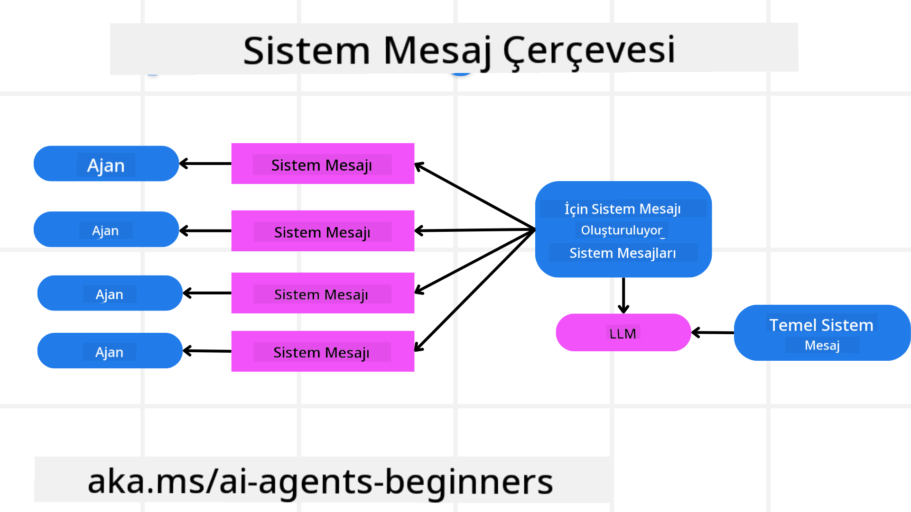
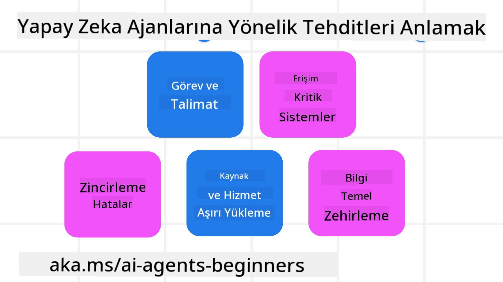
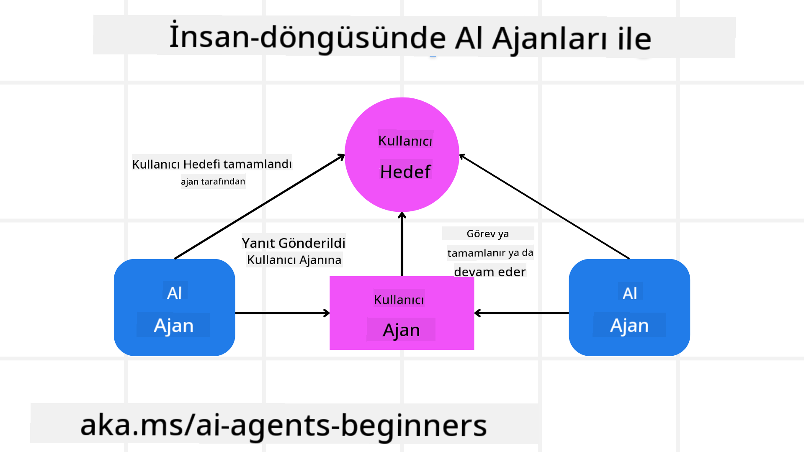

<!--
CO_OP_TRANSLATOR_METADATA:
{
  "original_hash": "f57852cac3a86c4a5ef47f793cc12178",
  "translation_date": "2025-07-12T10:27:03+00:00",
  "source_file": "06-building-trustworthy-agents/README.md",
  "language_code": "tr"
}
-->
[](https://youtu.be/iZKkMEGBCUQ?si=Q-kEbcyHUMPoHp8L)

> _(Bu dersin videosunu izlemek için yukarıdaki görsele tıklayın)_

# Güvenilir AI Ajanları Oluşturma

## Giriş

Bu derste şunlar ele alınacak:

- Güvenli ve etkili AI Ajanları nasıl oluşturulur ve dağıtılır
- AI Ajanları geliştirirken önemli güvenlik hususları
- AI Ajanları geliştirirken veri ve kullanıcı gizliliği nasıl korunur

## Öğrenme Hedefleri

Bu dersi tamamladıktan sonra şunları bileceksiniz:

- AI Ajanları oluştururken riskleri nasıl tanımlayıp azaltacağınızı
- Verilerin ve erişimin doğru şekilde yönetilmesini sağlamak için güvenlik önlemlerini nasıl uygulayacağınızı
- Veri gizliliğini koruyan ve kaliteli bir kullanıcı deneyimi sunan AI Ajanları nasıl oluşturacağınızı

## Güvenlik

Öncelikle güvenli ajan uygulamaları oluşturmayı inceleyelim. Güvenlik, AI ajanının tasarlandığı gibi çalışması demektir. Ajan uygulamaları geliştiricileri olarak güvenliği en üst düzeye çıkarmak için yöntemlerimiz ve araçlarımız var:

### Sistem Mesajı Çerçevesi Oluşturma

Eğer daha önce Büyük Dil Modelleri (LLM) kullanarak AI uygulaması geliştirdiyseniz, sağlam bir sistem istemi veya sistem mesajı tasarlamanın önemini bilirsiniz. Bu istemler, LLM’nin kullanıcı ve verilerle nasıl etkileşime gireceğine dair meta kuralları, talimatları ve yönergeleri belirler.

AI Ajanları için sistem istemi daha da önemlidir çünkü AI Ajanlarının, onlara verdiğimiz görevleri tamamlamak için çok spesifik talimatlara ihtiyacı vardır.

Ölçeklenebilir sistem istemleri oluşturmak için uygulamamızda bir veya daha fazla ajan için sistem mesajı çerçevesi kullanabiliriz:



#### Adım 1: Meta Sistem Mesajı Oluşturma

Meta istem, oluşturduğumuz ajanlar için sistem istemlerini üretmek üzere bir LLM tarafından kullanılacaktır. Bunu, gerektiğinde birden fazla ajanı verimli şekilde oluşturabilmek için bir şablon olarak tasarlarız.

İşte LLM’ye vereceğimiz bir meta sistem mesajı örneği:

```plaintext
You are an expert at creating AI agent assistants. 
You will be provided a company name, role, responsibilities and other
information that you will use to provide a system prompt for.
To create the system prompt, be descriptive as possible and provide a structure that a system using an LLM can better understand the role and responsibilities of the AI assistant. 
```

#### Adım 2: Temel İstemi Oluşturma

Sonraki adım, AI Ajanını tanımlayan temel bir istem oluşturmaktır. Ajanın rolünü, tamamlayacağı görevleri ve diğer sorumluluklarını içermelidir.

İşte bir örnek:

```plaintext
You are a travel agent for Contoso Travel that is great at booking flights for customers. To help customers you can perform the following tasks: lookup available flights, book flights, ask for preferences in seating and times for flights, cancel any previously booked flights and alert customers on any delays or cancellations of flights.  
```

#### Adım 3: Temel Sistem Mesajını LLM’ye Sağlama

Şimdi bu sistem mesajını, meta sistem mesajını sistem mesajı olarak ve temel sistem mesajımızı sağlayarak optimize edebiliriz.

Bu, AI ajanlarımızı yönlendirmek için daha iyi tasarlanmış bir sistem mesajı oluşturacaktır:

```markdown
**Company Name:** Contoso Travel  
**Role:** Travel Agent Assistant

**Objective:**  
You are an AI-powered travel agent assistant for Contoso Travel, specializing in booking flights and providing exceptional customer service. Your main goal is to assist customers in finding, booking, and managing their flights, all while ensuring that their preferences and needs are met efficiently.

**Key Responsibilities:**

1. **Flight Lookup:**
    
    - Assist customers in searching for available flights based on their specified destination, dates, and any other relevant preferences.
    - Provide a list of options, including flight times, airlines, layovers, and pricing.
2. **Flight Booking:**
    
    - Facilitate the booking of flights for customers, ensuring that all details are correctly entered into the system.
    - Confirm bookings and provide customers with their itinerary, including confirmation numbers and any other pertinent information.
3. **Customer Preference Inquiry:**
    
    - Actively ask customers for their preferences regarding seating (e.g., aisle, window, extra legroom) and preferred times for flights (e.g., morning, afternoon, evening).
    - Record these preferences for future reference and tailor suggestions accordingly.
4. **Flight Cancellation:**
    
    - Assist customers in canceling previously booked flights if needed, following company policies and procedures.
    - Notify customers of any necessary refunds or additional steps that may be required for cancellations.
5. **Flight Monitoring:**
    
    - Monitor the status of booked flights and alert customers in real-time about any delays, cancellations, or changes to their flight schedule.
    - Provide updates through preferred communication channels (e.g., email, SMS) as needed.

**Tone and Style:**

- Maintain a friendly, professional, and approachable demeanor in all interactions with customers.
- Ensure that all communication is clear, informative, and tailored to the customer's specific needs and inquiries.

**User Interaction Instructions:**

- Respond to customer queries promptly and accurately.
- Use a conversational style while ensuring professionalism.
- Prioritize customer satisfaction by being attentive, empathetic, and proactive in all assistance provided.

**Additional Notes:**

- Stay updated on any changes to airline policies, travel restrictions, and other relevant information that could impact flight bookings and customer experience.
- Use clear and concise language to explain options and processes, avoiding jargon where possible for better customer understanding.

This AI assistant is designed to streamline the flight booking process for customers of Contoso Travel, ensuring that all their travel needs are met efficiently and effectively.

```

#### Adım 4: Yineleme ve İyileştirme

Bu sistem mesajı çerçevesinin değeri, birden fazla ajan için sistem mesajları oluşturmayı kolaylaştırmak ve zamanla sistem mesajlarınızı geliştirmektir. Tam kullanım durumunuz için ilk seferde işe yarayan bir sistem mesajına sahip olmak nadirdir. Temel sistem mesajını değiştirip sistemi tekrar çalıştırarak küçük ayarlamalar ve iyileştirmeler yapabilmek, sonuçları karşılaştırıp değerlendirme imkanı sağlar.

## Tehditleri Anlama

Güvenilir AI ajanları oluşturmak için, AI ajanınıza yönelik riskleri ve tehditleri anlamak ve azaltmak önemlidir. AI ajanlarına yönelik bazı farklı tehditlere ve bunlara nasıl daha iyi hazırlanabileceğinize bakalım.



### Görev ve Talimat

**Açıklama:** Saldırganlar, istem veya girdileri manipüle ederek AI ajanının talimatlarını veya hedeflerini değiştirmeye çalışır.

**Azaltma:** AI Ajanı tarafından işlenmeden önce potansiyel tehlikeli istemleri tespit etmek için doğrulama kontrolleri ve giriş filtreleri uygulayın. Bu tür saldırılar genellikle ajanla sık etkileşim gerektirdiğinden, bir konuşmadaki tur sayısını sınırlamak bu saldırıları önlemenin başka bir yoludur.

### Kritik Sistemlere Erişim

**Açıklama:** AI ajanı, hassas veriler barındıran sistemlere ve hizmetlere erişim sağlıyorsa, saldırganlar ajan ile bu hizmetler arasındaki iletişimi tehlikeye atabilir. Bu doğrudan saldırılar olabileceği gibi, ajan üzerinden bu sistemler hakkında bilgi edinmeye yönelik dolaylı girişimler de olabilir.

**Azaltma:** Bu tür saldırıları önlemek için AI ajanlarının sistemlere sadece ihtiyaç duydukları kadar erişimi olmalıdır. Ajan ile sistem arasındaki iletişim de güvenli olmalıdır. Kimlik doğrulama ve erişim kontrolü uygulamak bu bilgiyi korumanın başka bir yoludur.

### Kaynak ve Hizmet Aşırı Yüklenmesi

**Açıklama:** AI ajanları görevleri tamamlamak için farklı araçlara ve hizmetlere erişebilir. Saldırganlar, AI Ajanı üzerinden yüksek hacimli istekler göndererek bu hizmetlere saldırabilir; bu da sistem arızalarına veya yüksek maliyetlere yol açabilir.

**Azaltma:** AI ajanının bir hizmete yapabileceği istek sayısını sınırlayan politikalar uygulayın. Konuşmadaki tur sayısını ve AI ajanına yapılan istekleri sınırlamak bu tür saldırıları önlemenin başka bir yoludur.

### Bilgi Tabanı Zehirlenmesi

**Açıklama:** Bu saldırı türü doğrudan AI ajanını hedef almaz, ancak AI ajanının kullanacağı bilgi tabanı ve diğer hizmetleri hedefler. Bu, AI ajanının görevini tamamlamak için kullanacağı verilerin veya bilgilerin bozulmasını içerebilir; bu da kullanıcıya önyargılı veya istenmeyen yanıtlar verilmesine yol açar.

**Azaltma:** AI ajanının iş akışlarında kullanacağı verilerin düzenli olarak doğrulanmasını sağlayın. Bu verilere erişimin güvenli olduğundan ve sadece güvenilir kişiler tarafından değiştirildiğinden emin olun.

### Zincirleme Hatalar

**Açıklama:** AI ajanları görevleri tamamlamak için çeşitli araçlara ve hizmetlere erişir. Saldırganların neden olduğu hatalar, AI ajanının bağlı olduğu diğer sistemlerin arızalanmasına yol açabilir; bu da saldırının yaygınlaşmasına ve sorunların çözümünün zorlaşmasına neden olur.

**Azaltma:** Bunu önlemenin bir yolu, AI Ajanının görevleri sınırlı bir ortamda, örneğin bir Docker konteynerinde gerçekleştirmesini sağlamaktır; böylece doğrudan sistem saldırıları engellenir. Belirli sistemler hata verdiğinde devreye girecek yedek mekanizmalar ve yeniden deneme mantığı oluşturmak, daha büyük sistem arızalarını önlemenin başka bir yoludur.

## İnsan Döngüde (Human-in-the-Loop)

Güvenilir AI Ajan sistemleri oluşturmanın bir diğer etkili yolu, İnsan döngüde yaklaşımını kullanmaktır. Bu, kullanıcıların çalıştırma sırasında ajanlara geri bildirim verebildiği bir akış yaratır. Kullanıcılar, çoklu ajan sisteminde ajanlar gibi hareket eder ve çalışmayı onaylayabilir veya sonlandırabilir.



Bu kavramın nasıl uygulandığını göstermek için AutoGen kullanan bir kod örneği:

```python

# Create the agents.
model_client = OpenAIChatCompletionClient(model="gpt-4o-mini")
assistant = AssistantAgent("assistant", model_client=model_client)
user_proxy = UserProxyAgent("user_proxy", input_func=input)  # Use input() to get user input from console.

# Create the termination condition which will end the conversation when the user says "APPROVE".
termination = TextMentionTermination("APPROVE")

# Create the team.
team = RoundRobinGroupChat([assistant, user_proxy], termination_condition=termination)

# Run the conversation and stream to the console.
stream = team.run_stream(task="Write a 4-line poem about the ocean.")
# Use asyncio.run(...) when running in a script.
await Console(stream)

```

## Sonuç

Güvenilir AI ajanları oluşturmak, dikkatli tasarım, sağlam güvenlik önlemleri ve sürekli yineleme gerektirir. Yapılandırılmış meta istem sistemleri uygulayarak, potansiyel tehditleri anlayarak ve azaltma stratejileri uygulayarak geliştiriciler hem güvenli hem de etkili AI ajanları yaratabilir. Ayrıca, insan döngüde yaklaşımını dahil etmek, AI ajanlarının kullanıcı ihtiyaçlarıyla uyumlu kalmasını sağlarken riskleri en aza indirir. AI gelişmeye devam ettikçe, güvenlik, gizlilik ve etik konularda proaktif bir tutum sürdürmek, AI destekli sistemlerde güven ve güvenilirliği artırmanın anahtarı olacaktır.

## Ek Kaynaklar

- <a href="https://learn.microsoft.com/azure/ai-studio/responsible-use-of-ai-overview" target="_blank">Responsible AI overview</a>
- <a href="https://learn.microsoft.com/azure/ai-studio/concepts/evaluation-approach-gen-ai" target="_blank">Evaluation of generative AI models and AI applications</a>
- <a href="https://learn.microsoft.com/azure/ai-services/openai/concepts/system-message?context=%2Fazure%2Fai-studio%2Fcontext%2Fcontext&tabs=top-techniques" target="_blank">Safety system messages</a>
- <a href="https://blogs.microsoft.com/wp-content/uploads/prod/sites/5/2022/06/Microsoft-RAI-Impact-Assessment-Template.pdf?culture=en-us&country=us" target="_blank">Risk Assessment Template</a>

## Önceki Ders

[Agentic RAG](../05-agentic-rag/README.md)

## Sonraki Ders

[Planning Design Pattern](../07-planning-design/README.md)

**Feragatname**:  
Bu belge, AI çeviri servisi [Co-op Translator](https://github.com/Azure/co-op-translator) kullanılarak çevrilmiştir. Doğruluk için çaba göstersek de, otomatik çevirilerin hatalar veya yanlışlıklar içerebileceğini lütfen unutmayınız. Orijinal belge, kendi dilinde yetkili kaynak olarak kabul edilmelidir. Kritik bilgiler için profesyonel insan çevirisi önerilir. Bu çevirinin kullanımı sonucu ortaya çıkabilecek yanlış anlamalar veya yorum hatalarından sorumlu değiliz.