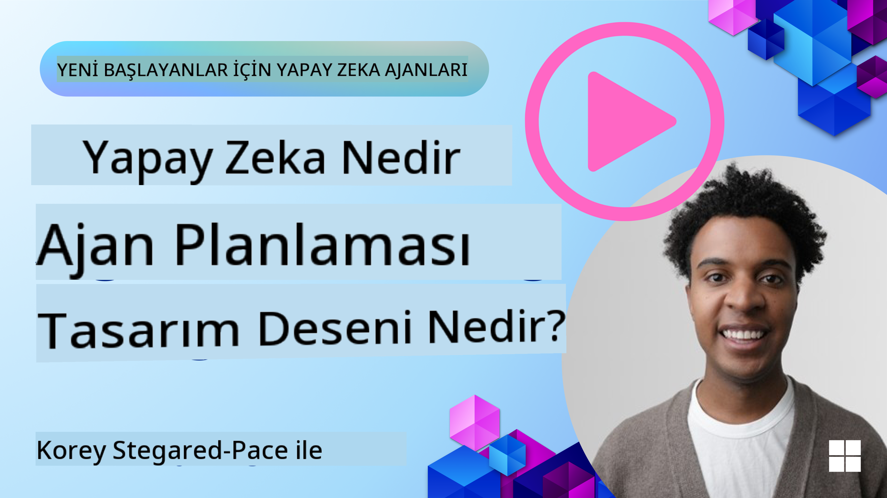
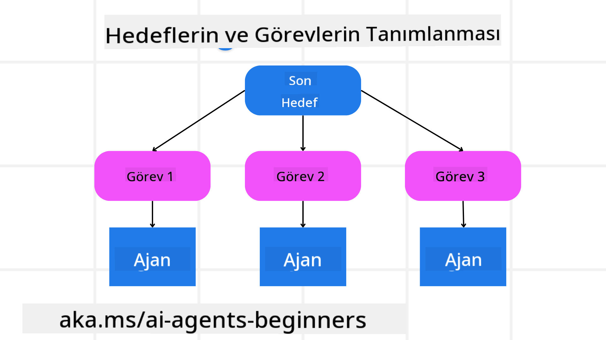

<!--
CO_OP_TRANSLATOR_METADATA:
{
  "original_hash": "a28d30590704ea13b6a08d4793cf9c2b",
  "translation_date": "2025-08-29T13:19:00+00:00",
  "source_file": "07-planning-design/README.md",
  "language_code": "tr"
}
-->
[](https://youtu.be/kPfJ2BrBCMY?si=9pYpPXp0sSbK91Dr)

> _(Bu dersin videosunu izlemek için yukarıdaki görsele tıklayın)_

# Planlama Tasarımı

## Giriş

Bu derste şunlar ele alınacaktır:

* Net bir genel hedef tanımlama ve karmaşık bir görevi yönetilebilir görevlere bölme.
* Daha güvenilir ve makine tarafından okunabilir yanıtlar için yapılandırılmış çıktılardan yararlanma.
* Dinamik görevleri ve beklenmedik girdileri ele almak için olay odaklı bir yaklaşım uygulama.

## Öğrenme Hedefleri

Bu dersi tamamladıktan sonra şunları anlayabileceksiniz:

* Bir yapay zeka ajanı için genel bir hedef belirlemek ve bu hedefin net bir şekilde neyi başarması gerektiğini tanımlamak.
* Karmaşık bir görevi yönetilebilir alt görevlere ayırmak ve bunları mantıklı bir sıraya organize etmek.
* Ajanları doğru araçlarla donatmak (ör. arama araçları veya veri analitik araçları), bu araçların ne zaman ve nasıl kullanılacağını belirlemek ve ortaya çıkan beklenmedik durumları ele almak.
* Alt görev sonuçlarını değerlendirmek, performansı ölçmek ve nihai çıktıyı iyileştirmek için eylemleri yinelemek.

## Genel Hedefi Tanımlama ve Görevi Parçalara Ayırma



Gerçek dünyadaki çoğu görev, tek bir adımda ele alınamayacak kadar karmaşıktır. Bir yapay zeka ajanının, planlamasını ve eylemlerini yönlendirecek net bir hedefe ihtiyacı vardır. Örneğin, şu hedefi ele alalım:

    "3 günlük bir seyahat planı oluştur."

Bu hedef ifade edilmesi kolay olsa da, yine de daha fazla netleştirilmesi gerekir. Hedef ne kadar net olursa, ajan (ve varsa insan işbirlikçileri) doğru sonucu elde etmeye o kadar iyi odaklanabilir. Örneğin, uçuş seçenekleri, otel önerileri ve etkinlik önerileri içeren kapsamlı bir seyahat planı oluşturmak gibi.

### Görev Parçalama

Büyük veya karmaşık görevler, daha küçük ve hedef odaklı alt görevlere bölündüğünde daha yönetilebilir hale gelir. Seyahat planı örneği için hedef şu şekilde parçalanabilir:

* Uçuş Rezervasyonu
* Otel Rezervasyonu
* Araç Kiralama
* Kişiselleştirme

Her bir alt görev, özel ajanlar veya süreçler tarafından ele alınabilir. Bir ajan en iyi uçuş fırsatlarını aramada uzmanlaşırken, bir diğeri otel rezervasyonlarına odaklanabilir. Daha sonra bir koordinatör veya “aşağı akış” ajanı, bu sonuçları bir araya getirerek son kullanıcıya sunulan bütüncül bir seyahat planı oluşturabilir.

Bu modüler yaklaşım, kademeli iyileştirmelere de olanak tanır. Örneğin, Yemek Önerileri veya Yerel Etkinlik Önerileri için özel ajanlar ekleyebilir ve zamanla seyahat planını daha da geliştirebilirsiniz.

### Yapılandırılmış Çıktı

Büyük Dil Modelleri (LLM'ler), aşağı akış ajanlarının veya hizmetlerinin daha kolay ayrıştırıp işleyebileceği yapılandırılmış çıktılar (ör. JSON) üretebilir. Bu, özellikle planlama çıktısı alındıktan sonra bu görevleri harekete geçirebileceğimiz çoklu ajan bağlamında faydalıdır. Kısa bir genel bakış için şuraya bakın:

Aşağıdaki Python kodu, bir planlama ajanının bir hedefi alt görevlere ayırmasını ve yapılandırılmış bir plan oluşturmasını gösterir:

```python
from pydantic import BaseModel
from enum import Enum
from typing import List, Optional, Union
import json
import os
from typing import Optional
from pprint import pprint
from autogen_core.models import UserMessage, SystemMessage, AssistantMessage
from autogen_ext.models.azure import AzureAIChatCompletionClient
from azure.core.credentials import AzureKeyCredential

class AgentEnum(str, Enum):
    FlightBooking = "flight_booking"
    HotelBooking = "hotel_booking"
    CarRental = "car_rental"
    ActivitiesBooking = "activities_booking"
    DestinationInfo = "destination_info"
    DefaultAgent = "default_agent"
    GroupChatManager = "group_chat_manager"

# Travel SubTask Model
class TravelSubTask(BaseModel):
    task_details: str
    assigned_agent: AgentEnum  # we want to assign the task to the agent

class TravelPlan(BaseModel):
    main_task: str
    subtasks: List[TravelSubTask]
    is_greeting: bool

client = AzureAIChatCompletionClient(
    model="gpt-4o-mini",
    endpoint="https://models.inference.ai.azure.com",
    # To authenticate with the model you will need to generate a personal access token (PAT) in your GitHub settings.
    # Create your PAT token by following instructions here: https://docs.github.com/en/authentication/keeping-your-account-and-data-secure/managing-your-personal-access-tokens
    credential=AzureKeyCredential(os.environ["GITHUB_TOKEN"]),
    model_info={
        "json_output": False,
        "function_calling": True,
        "vision": True,
        "family": "unknown",
    },
)

# Define the user message
messages = [
    SystemMessage(content="""You are an planner agent.
    Your job is to decide which agents to run based on the user's request.
                      Provide your response in JSON format with the following structure:
{'main_task': 'Plan a family trip from Singapore to Melbourne.',
 'subtasks': [{'assigned_agent': 'flight_booking',
               'task_details': 'Book round-trip flights from Singapore to '
                               'Melbourne.'}
    Below are the available agents specialised in different tasks:
    - FlightBooking: For booking flights and providing flight information
    - HotelBooking: For booking hotels and providing hotel information
    - CarRental: For booking cars and providing car rental information
    - ActivitiesBooking: For booking activities and providing activity information
    - DestinationInfo: For providing information about destinations
    - DefaultAgent: For handling general requests""", source="system"),
    UserMessage(
        content="Create a travel plan for a family of 2 kids from Singapore to Melboune", source="user"),
]

response = await client.create(messages=messages, extra_create_args={"response_format": 'json_object'})

response_content: Optional[str] = response.content if isinstance(
    response.content, str) else None
if response_content is None:
    raise ValueError("Response content is not a valid JSON string" )

pprint(json.loads(response_content))

# # Ensure the response content is a valid JSON string before loading it
# response_content: Optional[str] = response.content if isinstance(
#     response.content, str) else None
# if response_content is None:
#     raise ValueError("Response content is not a valid JSON string")

# # Print the response content after loading it as JSON
# pprint(json.loads(response_content))

# Validate the response content with the MathReasoning model
# TravelPlan.model_validate(json.loads(response_content))
```

### Çoklu Ajan Orkestrasyonu ile Planlama Ajanı

Bu örnekte, bir Semantik Yönlendirici Ajan, bir kullanıcı isteğini alır (ör. "Seyahatim için bir otel planına ihtiyacım var.").

Planlayıcı daha sonra:

* Otel Planını Alır: Planlayıcı, kullanıcının mesajını alır ve bir sistem istemine (mevcut ajan detaylarını içeren) dayanarak yapılandırılmış bir seyahat planı oluşturur.
* Ajanları ve Araçlarını Listeler: Ajan kaydı, uçuş, otel, araç kiralama ve etkinlikler gibi görevler için ajanların bir listesini ve sundukları işlevleri veya araçları içerir.
* Planı İlgili Ajanlara Yönlendirir: Alt görevlerin sayısına bağlı olarak, planlayıcı mesajı ya doğrudan özel bir ajana (tek görevli senaryolar için) gönderir ya da çoklu ajan iş birliği için bir grup sohbet yöneticisi aracılığıyla koordine eder.
* Sonucu Özetler: Son olarak, planlayıcı oluşturulan planı netlik için özetler. Aşağıdaki Python kodu bu adımları göstermektedir:

```python

from pydantic import BaseModel

from enum import Enum
from typing import List, Optional, Union

class AgentEnum(str, Enum):
    FlightBooking = "flight_booking"
    HotelBooking = "hotel_booking"
    CarRental = "car_rental"
    ActivitiesBooking = "activities_booking"
    DestinationInfo = "destination_info"
    DefaultAgent = "default_agent"
    GroupChatManager = "group_chat_manager"

# Travel SubTask Model

class TravelSubTask(BaseModel):
    task_details: str
    assigned_agent: AgentEnum # we want to assign the task to the agent

class TravelPlan(BaseModel):
    main_task: str
    subtasks: List[TravelSubTask]
    is_greeting: bool
import json
import os
from typing import Optional

from autogen_core.models import UserMessage, SystemMessage, AssistantMessage
from autogen_ext.models.openai import AzureOpenAIChatCompletionClient

# Create the client with type-checked environment variables

client = AzureOpenAIChatCompletionClient(
    azure_deployment=os.getenv("AZURE_OPENAI_DEPLOYMENT_NAME"),
    model=os.getenv("AZURE_OPENAI_DEPLOYMENT_NAME"),
    api_version=os.getenv("AZURE_OPENAI_API_VERSION"),
    azure_endpoint=os.getenv("AZURE_OPENAI_ENDPOINT"),
    api_key=os.getenv("AZURE_OPENAI_API_KEY"),
)

from pprint import pprint

# Define the user message

messages = [
    SystemMessage(content="""You are an planner agent.
    Your job is to decide which agents to run based on the user's request.
    Below are the available agents specialized in different tasks:
    - FlightBooking: For booking flights and providing flight information
    - HotelBooking: For booking hotels and providing hotel information
    - CarRental: For booking cars and providing car rental information
    - ActivitiesBooking: For booking activities and providing activity information
    - DestinationInfo: For providing information about destinations
    - DefaultAgent: For handling general requests""", source="system"),
    UserMessage(content="Create a travel plan for a family of 2 kids from Singapore to Melbourne", source="user"),
]

response = await client.create(messages=messages, extra_create_args={"response_format": TravelPlan})

# Ensure the response content is a valid JSON string before loading it

response_content: Optional[str] = response.content if isinstance(response.content, str) else None
if response_content is None:
    raise ValueError("Response content is not a valid JSON string")

# Print the response content after loading it as JSON

pprint(json.loads(response_content))
```

Yukarıdaki kodun çıktısı aşağıda verilmiştir ve bu yapılandırılmış çıktıyı `assigned_agent`'a yönlendirebilir ve seyahat planını son kullanıcıya özetleyebilirsiniz.

```json
{
    "is_greeting": "False",
    "main_task": "Plan a family trip from Singapore to Melbourne.",
    "subtasks": [
        {
            "assigned_agent": "flight_booking",
            "task_details": "Book round-trip flights from Singapore to Melbourne."
        },
        {
            "assigned_agent": "hotel_booking",
            "task_details": "Find family-friendly hotels in Melbourne."
        },
        {
            "assigned_agent": "car_rental",
            "task_details": "Arrange a car rental suitable for a family of four in Melbourne."
        },
        {
            "assigned_agent": "activities_booking",
            "task_details": "List family-friendly activities in Melbourne."
        },
        {
            "assigned_agent": "destination_info",
            "task_details": "Provide information about Melbourne as a travel destination."
        }
    ]
}
```

Önceki kod örneğiyle ilgili bir örnek defter [burada](07-autogen.ipynb) mevcuttur.

### Yinelemeli Planlama

Bazı görevler, bir alt görevin sonucu diğerini etkilediğinde ileri geri veya yeniden planlama gerektirir. Örneğin, bir ajan uçuş rezervasyonu yaparken beklenmedik bir veri formatı keşfederse, otel rezervasyonlarına geçmeden önce stratejisini uyarlaması gerekebilir.

Ayrıca, kullanıcı geri bildirimi (ör. bir insanın daha erken bir uçuşu tercih etmesi) kısmi bir yeniden planlamayı tetikleyebilir. Bu dinamik, yinelemeli yaklaşım, nihai çözümün gerçek dünya kısıtlamalarına ve gelişen kullanıcı tercihlerine uygun olmasını sağlar.

Örneğin, örnek kod:

```python
from autogen_core.models import UserMessage, SystemMessage, AssistantMessage
#.. same as previous code and pass on the user history, current plan
messages = [
    SystemMessage(content="""You are a planner agent to optimize the
    Your job is to decide which agents to run based on the user's request.
    Below are the available agents specialized in different tasks:
    - FlightBooking: For booking flights and providing flight information
    - HotelBooking: For booking hotels and providing hotel information
    - CarRental: For booking cars and providing car rental information
    - ActivitiesBooking: For booking activities and providing activity information
    - DestinationInfo: For providing information about destinations
    - DefaultAgent: For handling general requests""", source="system"),
    UserMessage(content="Create a travel plan for a family of 2 kids from Singapore to Melbourne", source="user"),
    AssistantMessage(content=f"Previous travel plan - {TravelPlan}", source="assistant")
]
# .. re-plan and send the tasks to respective agents
```

Daha kapsamlı planlama için Magnetic One'a göz atabilirsiniz.

## Özet

Bu makalede, tanımlanmış ajanları dinamik olarak seçebilen bir planlayıcı oluşturma örneğini inceledik. Planlayıcının çıktısı, görevleri parçalar ve ajanlara atar, böylece bu görevler yerine getirilebilir. Ajanların, görevi gerçekleştirmek için gereken işlevlere/araçlara erişimi olduğu varsayılmaktadır. Ajanlara ek olarak, yansıtma, özetleyici ve döngüsel sohbet gibi diğer desenleri de ekleyerek özelleştirme yapabilirsiniz.

## Ek Kaynaklar

* AutoGen Magnetic One - Karmaşık görevleri çözmek için genel bir çoklu ajan sistemi olup, birçok zorlu ajanlık ölçütünde etkileyici sonuçlar elde etmiştir. Referans:

Bu uygulamada, orkestratör görev odaklı bir plan oluşturur ve bu görevleri mevcut ajanlara devreder. Planlamanın yanı sıra, orkestratör bir izleme mekanizması kullanarak görevin ilerlemesini takip eder ve gerektiğinde yeniden planlama yapar.

### Planlama Tasarım Deseni Hakkında Daha Fazla Sorunuz mu Var?

[Azure AI Foundry Discord](https://aka.ms/ai-agents/discord) topluluğuna katılarak diğer öğrenenlerle tanışabilir, ofis saatlerine katılabilir ve AI Ajanları hakkındaki sorularınıza yanıt alabilirsiniz.

## Önceki Ders

[Güvenilir AI Ajanları Oluşturma](../06-building-trustworthy-agents/README.md)

## Sonraki Ders

[Çoklu Ajan Tasarım Deseni](../08-multi-agent/README.md)

---

**Feragatname**:  
Bu belge, AI çeviri hizmeti [Co-op Translator](https://github.com/Azure/co-op-translator) kullanılarak çevrilmiştir. Doğruluk için çaba göstersek de, otomatik çevirilerin hata veya yanlışlıklar içerebileceğini lütfen unutmayın. Belgenin orijinal dili, yetkili kaynak olarak kabul edilmelidir. Kritik bilgiler için profesyonel insan çevirisi önerilir. Bu çevirinin kullanımından kaynaklanan yanlış anlamalar veya yanlış yorumlamalar için sorumluluk kabul etmiyoruz.