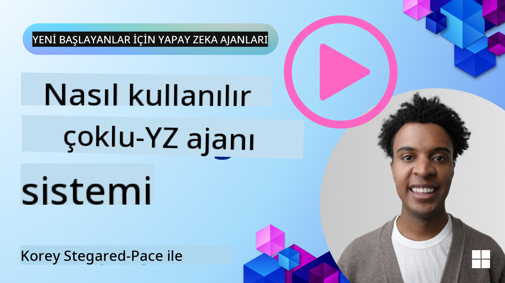
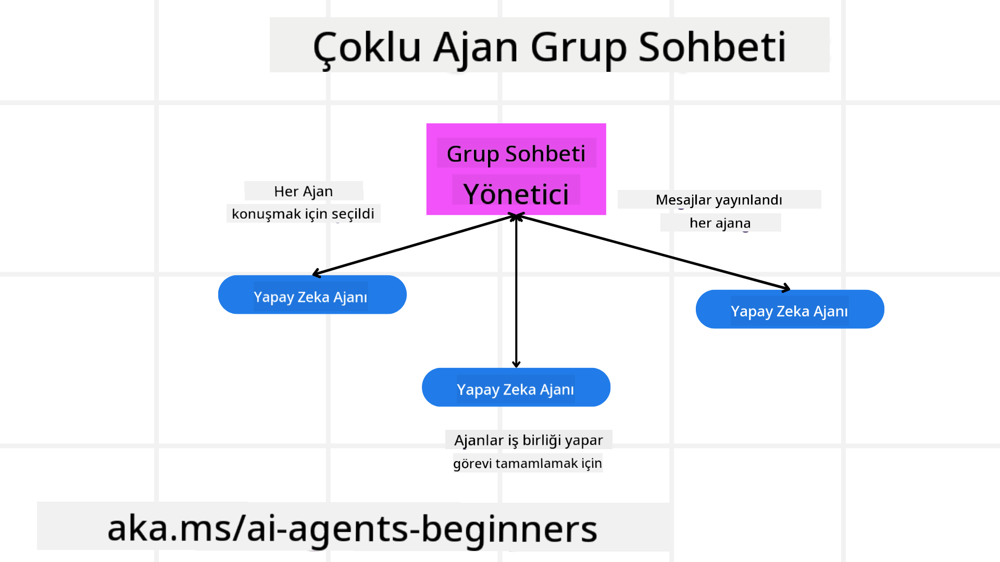
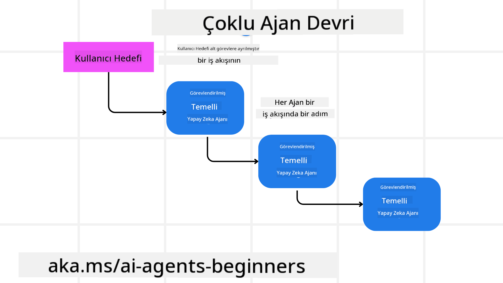
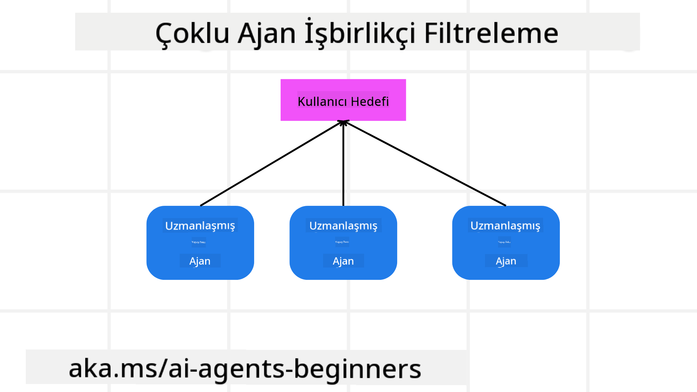

<!--
CO_OP_TRANSLATOR_METADATA:
{
  "original_hash": "c692a8975d7d5b99575a553de1c5e8a7",
  "translation_date": "2025-07-12T11:09:43+00:00",
  "source_file": "08-multi-agent/README.md",
  "language_code": "tr"
}
-->

> _(Bu dersin videosunu izlemek için yukarıdaki resme tıklayın)_

# Çoklu ajan tasarım kalıpları

Birden fazla ajan içeren bir projede çalışmaya başladığınızda, çoklu ajan tasarım kalıbını göz önünde bulundurmanız gerekir. Ancak, ne zaman çoklu ajanlara geçileceği ve avantajlarının neler olduğu hemen anlaşılmayabilir.

## Giriş

Bu derste şu sorulara yanıt arıyoruz:

- Çoklu ajanların uygulanabileceği senaryolar nelerdir?
- Tek bir ajanın birden fazla görev yapmasına kıyasla çoklu ajan kullanmanın avantajları nelerdir?
- Çoklu ajan tasarım kalıbını uygulamanın yapı taşları nelerdir?
- Birden fazla ajanın birbirleriyle nasıl etkileşimde bulunduğunu nasıl görebiliriz?

## Öğrenme Hedefleri

Bu dersten sonra şunları yapabilmelisiniz:

- Çoklu ajanların uygulanabileceği senaryoları tanımlamak
- Tek bir ajana kıyasla çoklu ajan kullanmanın avantajlarını fark etmek
- Çoklu ajan tasarım kalıbının yapı taşlarını kavramak

Büyük resim nedir?

*Çoklu ajanlar, birden fazla ajanın ortak bir hedefe ulaşmak için birlikte çalışmasını sağlayan bir tasarım kalıbıdır.*

Bu kalıp, robotik, otonom sistemler ve dağıtık bilişim gibi çeşitli alanlarda yaygın olarak kullanılır.

## Çoklu Ajanların Uygulanabileceği Senaryolar

Peki, çoklu ajan kullanımı için hangi senaryolar uygundur? Cevap, özellikle aşağıdaki durumlarda çoklu ajan kullanmanın faydalı olduğu birçok senaryo vardır:

- **Büyük iş yükleri**: Büyük iş yükleri daha küçük görevlere bölünebilir ve farklı ajanlara atanabilir, böylece paralel işlem yapılabilir ve işler daha hızlı tamamlanabilir. Bunun bir örneği büyük veri işleme görevleridir.
- **Karmaşık görevler**: Karmaşık görevler, büyük iş yüklerinde olduğu gibi, daha küçük alt görevlere ayrılabilir ve her biri görevin belirli bir yönünde uzmanlaşmış farklı ajanlara atanabilir. Örneğin, otonom araçlarda farklı ajanlar navigasyon, engel tespiti ve diğer araçlarla iletişim gibi görevleri yönetir.
- **Çeşitli uzmanlıklar**: Farklı ajanlar farklı uzmanlıklara sahip olabilir, böylece tek bir ajandan daha etkili şekilde görevin farklı yönlerini yönetebilirler. Bu duruma iyi bir örnek sağlık sektörüdür; ajanlar tanı, tedavi planları ve hasta takibi gibi alanları yönetebilir.

## Tek Bir Ajana Kıyasla Çoklu Ajan Kullanmanın Avantajları

Basit görevler için tek ajan sistemi iyi çalışabilir, ancak daha karmaşık görevlerde çoklu ajan kullanmak birkaç avantaj sağlar:

- **Uzmanlaşma**: Her ajan belirli bir görevde uzmanlaşabilir. Tek bir ajanda uzmanlık eksikliği, ajanın her şeyi yapabilmesi ama karmaşık bir görevle karşılaştığında ne yapacağını karıştırması anlamına gelir. Örneğin, en uygun olmadığı bir görevi yapmaya çalışabilir.
- **Ölçeklenebilirlik**: Sistemi ölçeklendirmek, tek bir ajanı aşırı yüklemektense daha fazla ajan eklemekle daha kolaydır.
- **Hata Toleransı**: Bir ajan başarısız olursa, diğerleri çalışmaya devam edebilir ve sistemin güvenilirliği sağlanır.

Bir örnek verelim, bir kullanıcı için seyahat rezervasyonu yapalım. Tek ajanlı bir sistem, uçuş bulmaktan otel ve araç kiralama rezervasyonuna kadar tüm süreci yönetmek zorunda kalır. Bunu tek bir ajanla başarmak için, ajanın tüm bu görevleri yapacak araçlara sahip olması gerekir. Bu da karmaşık ve bakımı zor, tek parça bir sistem ortaya çıkarır. Çoklu ajanlı bir sistemde ise, uçuş bulma, otel ve araç kiralama rezervasyonları için farklı uzmanlaşmış ajanlar olabilir. Bu sistem daha modüler, bakımı kolay ve ölçeklenebilir olur.

Bunu, tek bir kişinin yönettiği küçük bir seyahat acentesi ile franchise olarak işletilen bir seyahat acentesiyle karşılaştırabilirsiniz. Küçük acente tüm rezervasyon sürecini tek bir ajanla yönetirken, franchise farklı aşamaları farklı ajanlara devreder.

## Çoklu Ajan Tasarım Kalıbının Yapı Taşları

Çoklu ajan tasarım kalıbını uygulamadan önce, kalıbı oluşturan yapı taşlarını anlamanız gerekir.

Bunu somutlaştırmak için tekrar bir kullanıcı için seyahat rezervasyonu örneğine bakalım. Bu durumda yapı taşları şunları içerir:

- **Ajan İletişimi**: Uçuş bulma, otel ve araç kiralama ajanlarının, kullanıcının tercihleri ve kısıtlamaları hakkında bilgi paylaşmak için iletişim kurması gerekir. Bu iletişim için protokolleri ve yöntemleri belirlemelisiniz. Somut olarak, uçuş bulma ajanı, otel rezervasyon ajanıyla iletişim kurarak otelin uçuş tarihleriyle uyumlu olmasını sağlamalıdır. Bu da ajanların *hangi bilgileri paylaştığını ve nasıl paylaştığını* belirlemeniz gerektiği anlamına gelir.
- **Koordinasyon Mekanizmaları**: Ajanlar, kullanıcının tercihleri ve kısıtlamalarının karşılanmasını sağlamak için eylemlerini koordine etmelidir. Örneğin, kullanıcı havaalanına yakın bir otel isterken, araç kiralama sadece havaalanında mevcut olabilir. Bu durumda otel rezervasyon ajanı, araç kiralama ajanıyla koordinasyon sağlamalıdır. Yani, ajanların *eylemlerini nasıl koordine ettiğini* belirlemelisiniz.
- **Ajan Mimarisi**: Ajanların karar verme ve kullanıcıyla etkileşimlerinden öğrenme yeteneğine sahip iç yapıları olmalıdır. Örneğin, uçuş bulma ajanı, kullanıcının geçmiş tercihlerine göre uçuş önerileri yapmak için karar verebilmelidir. Bu da ajanların *nasıl karar verdiğini ve kullanıcı etkileşimlerinden nasıl öğrendiğini* belirlemeniz gerektiği anlamına gelir.
- **Çoklu Ajan Etkileşimlerine Görünürlük**: Birden fazla ajanın birbirleriyle nasıl etkileşimde bulunduğunu görebilmeniz gerekir. Bunun için ajan faaliyetlerini ve etkileşimlerini izlemek üzere araçlar ve teknikler kullanmalısınız. Bu, günlük kaydı ve izleme araçları, görselleştirme araçları ve performans metrikleri şeklinde olabilir.
- **Çoklu Ajan Kalıpları**: Çoklu ajan sistemleri için merkezi, merkezi olmayan ve hibrit mimariler gibi farklı kalıplar vardır. Kullanım durumunuza en uygun kalıbı seçmelisiniz.
- **İnsan müdahalesi**: Çoğu durumda, süreçte bir insan bulunur ve ajanların ne zaman insan müdahalesi isteyeceğini belirlemeniz gerekir. Bu, ajanların önerdiği otel veya uçuş dışında bir seçim yapması veya rezervasyon öncesi onay istemesi şeklinde olabilir.

## Çoklu Ajan Etkileşimlerine Görünürlük

Birden fazla ajanın birbirleriyle nasıl etkileşimde bulunduğunu görebilmeniz önemlidir. Bu görünürlük, hata ayıklama, optimizasyon ve sistemin genel etkinliğini sağlamak için gereklidir. Bunu başarmak için ajan faaliyetlerini ve etkileşimlerini izlemek üzere araçlar ve teknikler kullanmalısınız. Bu, günlük kaydı ve izleme araçları, görselleştirme araçları ve performans metrikleri şeklinde olabilir.

Örneğin, bir kullanıcı için seyahat rezervasyonu yaparken, her ajanın durumu, kullanıcının tercihleri ve kısıtlamaları ile ajanlar arasındaki etkileşimleri gösteren bir kontrol paneli olabilir. Bu panel, kullanıcının seyahat tarihlerini, uçuş ajanının önerdiği uçuşları, otel ajanının önerdiği otelleri ve araç kiralama ajanının önerdiği araçları gösterebilir. Böylece ajanların birbirleriyle nasıl etkileşimde bulunduğunu ve kullanıcının tercih ve kısıtlamalarının karşılanıp karşılanmadığını net bir şekilde görebilirsiniz.

Şimdi bu yönleri daha detaylı inceleyelim.

- **Günlük Kaydı ve İzleme Araçları**: Her ajanın yaptığı her eylem için günlük kaydı tutulmasını istersiniz. Bir günlük girdisi, eylemi yapan ajan, yapılan eylem, eylemin zamanı ve sonucu hakkında bilgi içerebilir. Bu bilgiler hata ayıklama, optimizasyon ve daha fazlası için kullanılabilir.
- **Görselleştirme Araçları**: Görselleştirme araçları, ajanlar arasındaki etkileşimleri daha sezgisel görmenize yardımcı olabilir. Örneğin, ajanlar arasındaki bilgi akışını gösteren bir grafik olabilir. Bu, sistemdeki darboğazları, verimsizlikleri ve diğer sorunları tespit etmenize yardımcı olur.
- **Performans Metrikleri**: Performans metrikleri, çoklu ajan sisteminin etkinliğini takip etmenize yardımcı olur. Örneğin, bir görevin tamamlanma süresi, birim zamanda tamamlanan görev sayısı ve ajanların yaptığı önerilerin doğruluğu izlenebilir. Bu bilgiler, iyileştirme alanlarını belirlemenize ve sistemi optimize etmenize olanak tanır.

## Çoklu Ajan Kalıpları

Çoklu ajan uygulamaları oluşturmak için kullanabileceğimiz bazı somut kalıplara bakalım. İşte dikkate değer bazı kalıplar:

### Grup sohbeti

Bu kalıp, birden fazla ajanın birbirleriyle iletişim kurabildiği bir grup sohbet uygulaması oluşturmak istediğinizde faydalıdır. Tipik kullanım alanları arasında ekip işbirliği, müşteri desteği ve sosyal ağlar bulunur.

Bu kalıpta, her ajan grup sohbetindeki bir kullanıcıyı temsil eder ve mesajlar ajanlar arasında bir mesajlaşma protokolü kullanılarak değiş tokuş edilir. Ajanlar grup sohbetine mesaj gönderebilir, grup sohbetinden mesaj alabilir ve diğer ajanların mesajlarına yanıt verebilir.

Bu kalıp, tüm mesajların merkezi bir sunucu üzerinden yönlendirildiği merkezi bir mimariyle veya mesajların doğrudan değiş tokuş edildiği merkezi olmayan bir mimariyle uygulanabilir.

### Görev devri

Bu kalıp, birden fazla ajanın görevleri birbirine devredebileceği bir uygulama oluşturmak istediğinizde faydalıdır.

Tipik kullanım alanları arasında müşteri desteği, görev yönetimi ve iş akışı otomasyonu bulunur.

Bu kalıpta, her ajan bir görev veya iş akışındaki bir adımı temsil eder ve ajanlar önceden tanımlanmış kurallara göre görevleri diğer ajanlara devredebilir.

### İşbirlikçi filtreleme

Bu kalıp, birden fazla ajanın kullanıcılar için önerilerde bulunmak üzere işbirliği yapabildiği bir uygulama oluşturmak istediğinizde faydalıdır.

Birden fazla ajanın işbirliği yapmasının nedeni, her ajanın farklı uzmanlıklara sahip olması ve öneri sürecine farklı şekillerde katkıda bulunabilmesidir.

Örneğin, bir kullanıcı borsada en iyi hisse senedini almak için öneri istiyor olsun.

- **Sektör uzmanı**: Bir ajan belirli bir sektörde uzmandır.
- **Teknik analiz**: Başka bir ajan teknik analiz konusunda uzmandır.
- **Temel analiz**: Bir diğer ajan temel analiz konusunda uzmandır. Bu ajanlar işbirliği yaparak kullanıcıya daha kapsamlı bir öneri sunabilir.

## Senaryo: İade süreci

Bir müşterinin bir ürün için iade talebinde bulunduğu bir senaryoyu düşünün, bu süreçte birçok ajan yer alabilir ancak bunları iade sürecine özgü ajanlar ve diğer süreçlerde de kullanılabilecek genel ajanlar olarak ayıralım.

**İade sürecine özgü ajanlar**:

İade sürecinde yer alabilecek bazı ajanlar şunlardır:

- **Müşteri ajanı**: Müşteriyi temsil eder ve iade sürecini başlatmaktan sorumludur.
- **Satıcı ajanı**: Satıcıyı temsil eder ve iade işlemini yürütmekle sorumludur.
- **Ödeme ajanı**: Ödeme sürecini temsil eder ve müşterinin ödemesini iade etmekle sorumludur.
- **Çözüm ajanı**: Çözüm sürecini temsil eder ve iade sürecinde ortaya çıkan sorunları çözmekle sorumludur.
- **Uyum ajanı**: Uyum sürecini temsil eder ve iade sürecinin düzenlemelere ve politikalara uygunluğunu sağlar.

**Genel ajanlar**:

Bu ajanlar işinizin diğer bölümlerinde de kullanılabilir.

- **Kargo ajanı**: Kargo sürecini temsil eder ve ürünü satıcıya geri göndermekle sorumludur. Bu ajan hem iade sürecinde hem de örneğin bir satın alma yoluyla ürünün genel kargolanmasında kullanılabilir.
- **Geri bildirim ajanı**: Geri bildirim sürecini temsil eder ve müşteriden geri bildirim toplamakla sorumludur. Geri bildirim her zaman alınabilir, sadece iade sürecinde değil.
- **Yükseltme ajanı**: Yükseltme sürecini temsil eder ve sorunları daha üst destek seviyesine taşımakla sorumludur. Bu tür ajanı herhangi bir süreçte sorun yükseltmek için kullanabilirsiniz.
- **Bildirim ajanı**: Bildirim sürecini temsil eder ve iade sürecinin çeşitli aşamalarında müşteriye bildirim göndermekle sorumludur.
- **Analitik ajanı**: Analitik sürecini temsil eder ve iade süreciyle ilgili verileri analiz etmekle sorumludur.
- **Denetim ajanı**: Denetim sürecini temsil eder ve iade sürecinin doğru şekilde yürütüldüğünü denetlemekle sorumludur.
- **Raporlama ajanı**: Raporlama sürecini temsil eder ve iade süreciyle ilgili raporlar oluşturmakla sorumludur.
- **Bilgi ajanı**: Bilgi sürecini temsil eder ve iade süreciyle ilgili bilgi tabanını yönetmekle sorumludur. Bu ajan hem iadeler hem de işinizin diğer bölümleri hakkında bilgi sahibi olabilir.
- **Güvenlik ajanı**: Güvenlik sürecini temsil eder ve iade sürecinin güvenliğini sağlamakla sorumludur.
- **Kalite ajanı**: Kalite sürecini temsil eder ve iade sürecinin kalitesini sağlamakla sorumludur.

Önceki listede, hem iade sürecine özgü hem de işinizin diğer bölümlerinde kullanılabilecek genel ajanlar olmak üzere oldukça fazla ajan yer alıyor. Umarım bu, çoklu ajan sisteminizde hangi ajanları kullanacağınıza karar verirken size bir fikir verir.

## Ödev
## Önceki Ders

[Planlama Tasarımı](../07-planning-design/README.md)

## Sonraki Ders

[Yapay Zeka Ajanlarında Üstbiliş](../09-metacognition/README.md)

**Feragatname**:  
Bu belge, AI çeviri servisi [Co-op Translator](https://github.com/Azure/co-op-translator) kullanılarak çevrilmiştir. Doğruluk için çaba göstersek de, otomatik çevirilerin hatalar veya yanlışlıklar içerebileceğini lütfen unutmayın. Orijinal belge, kendi dilinde yetkili kaynak olarak kabul edilmelidir. Kritik bilgiler için profesyonel insan çevirisi önerilir. Bu çevirinin kullanımı sonucu ortaya çıkabilecek yanlış anlamalar veya yorum hatalarından sorumlu değiliz.