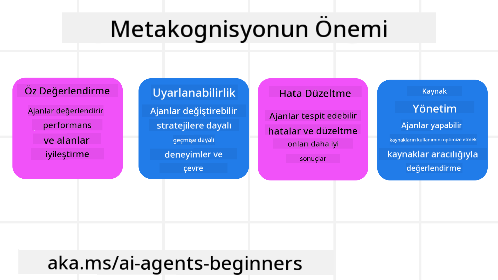
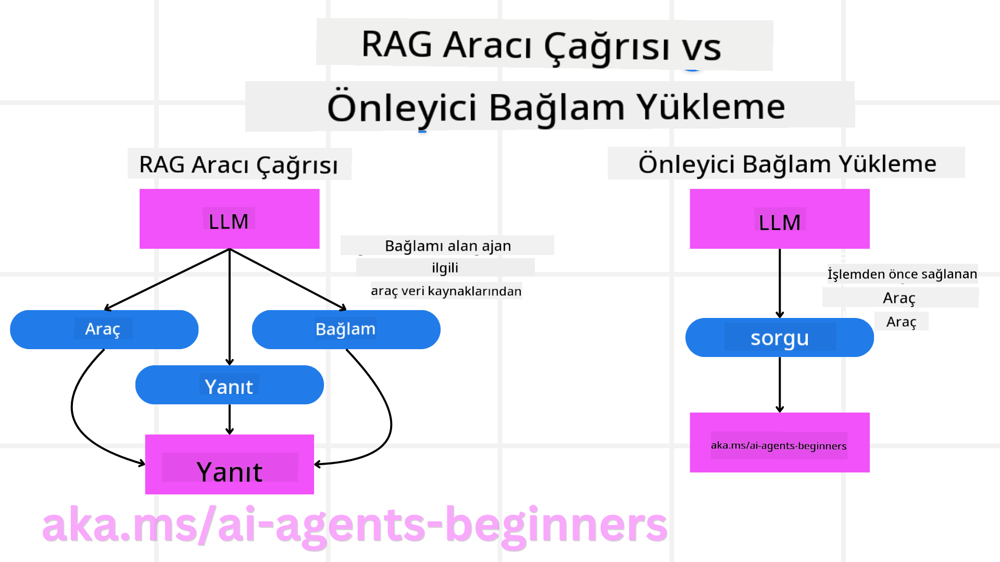

<!--
CO_OP_TRANSLATOR_METADATA:
{
  "original_hash": "8cbf460468c802c7994aa62e0e0779c9",
  "translation_date": "2025-07-12T12:34:56+00:00",
  "source_file": "09-metacognition/README.md",
  "language_code": "tr"
}
-->
[](https://youtu.be/His9R6gw6Ec?si=3_RMb8VprNvdLRhX)

> _(Bu dersin videosunu izlemek için yukarıdaki resme tıklayın)_
# Yapay Zeka Ajanlarında Metabiliş

## Giriş

Yapay zeka ajanlarında metabiliş konusuna hoş geldiniz! Bu bölüm, yapay zeka ajanlarının kendi düşünme süreçleri hakkında nasıl düşünebileceğini merak eden yeni başlayanlar için tasarlanmıştır. Bu dersin sonunda, temel kavramları anlayacak ve metabilişi yapay zeka ajan tasarımında uygulamak için pratik örneklerle donanmış olacaksınız.

## Öğrenme Hedefleri

Bu dersi tamamladıktan sonra şunları yapabileceksiniz:

1. Ajan tanımlarındaki akıl yürütme döngülerinin sonuçlarını anlamak.
2. Kendi kendini düzelten ajanlara yardımcı olmak için planlama ve değerlendirme tekniklerini kullanmak.
3. Görevleri yerine getirmek için kodu manipüle edebilen kendi ajanlarınızı oluşturmak.

## Metabilişe Giriş

Metabiliş, kişinin kendi düşünme süreçleri hakkında düşünmesini içeren üst düzey bilişsel süreçlere denir. Yapay zeka ajanları için bu, kendi farkındalıkları ve geçmiş deneyimlerine dayanarak eylemlerini değerlendirebilme ve ayarlayabilme yeteneği anlamına gelir. Metabiliş, yani "düşünme hakkında düşünme", ajan tabanlı yapay zeka sistemlerinin geliştirilmesinde önemli bir kavramdır. Bu, yapay zeka sistemlerinin kendi iç süreçlerinin farkında olması ve davranışlarını buna göre izleyip, düzenleyip, uyarlayabilmesi anlamına gelir. Tıpkı bizim ortamı okuyup bir probleme bakışımız gibi. Bu öz-farkındalık, yapay zeka sistemlerinin daha iyi kararlar vermesine, hataları tespit etmesine ve zamanla performanslarını artırmasına yardımcı olabilir — bu da Turing testi ve yapay zekanın kontrolü ele geçirip geçiremeyeceği tartışmasına tekrar bağlanır.

Ajan tabanlı yapay zeka sistemleri bağlamında, metabiliş şu zorlukların üstesinden gelmeye yardımcı olabilir:
- Şeffaflık: Yapay zeka sistemlerinin akıl yürütmelerini ve kararlarını açıklayabilmesini sağlamak.
- Akıl Yürütme: Yapay zeka sistemlerinin bilgiyi sentezleme ve sağlam kararlar alma yeteneğini geliştirmek.
- Uyarlanabilirlik: Yapay zeka sistemlerinin yeni ortamlara ve değişen koşullara uyum sağlamasına olanak tanımak.
- Algı: Yapay zeka sistemlerinin çevresinden gelen verileri tanıma ve yorumlama doğruluğunu artırmak.

### Metabiliş Nedir?

Metabiliş, yani "düşünme hakkında düşünme", kişinin bilişsel süreçlerinin öz-farkındalığı ve öz-düzenlemesini içeren üst düzey bir bilişsel süreçtir. Yapay zeka alanında metabiliş, ajanların stratejilerini ve eylemlerini değerlendirmesine ve uyarlamasına olanak tanır; bu da problem çözme ve karar verme yeteneklerini geliştirir. Metabilişi anlayarak, sadece daha zeki değil, aynı zamanda daha uyumlu ve verimli yapay zeka ajanları tasarlayabilirsiniz. Gerçek bir metabilişte, yapay zekanın kendi akıl yürütmesi hakkında açıkça düşünmesini görürsünüz.

Örnek: “Daha ucuz uçuşları önceliklendirdim çünkü… Direkt uçuşları kaçırıyor olabilirim, o yüzden tekrar kontrol edeyim.”
Belirli bir rotayı neden veya nasıl seçtiğini takip etmek.
- Önceki sefer kullanıcı tercihlerine fazla güvenip hata yaptığını fark edip, sadece son öneriyi değil karar verme stratejisini de değiştirmek.
- “Kullanıcı ‘çok kalabalık’ dediğinde sadece bazı turistik yerleri çıkarmamalıyım, aynı zamanda ‘en popüler’ sıralama yöntemimin hatalı olduğunu da düşünmeliyim” gibi kalıpları teşhis etmek.

### Yapay Zeka Ajanlarında Metabilişin Önemi

Metabiliş, yapay zeka ajan tasarımında birkaç nedenle kritik bir rol oynar:



- Öz-Yansıtma: Ajanlar kendi performanslarını değerlendirebilir ve gelişim alanlarını belirleyebilir.
- Uyarlanabilirlik: Ajanlar geçmiş deneyimlere ve değişen koşullara göre stratejilerini değiştirebilir.
- Hata Düzeltme: Ajanlar hataları kendi kendine tespit edip düzeltebilir, böylece daha doğru sonuçlar elde edilir.
- Kaynak Yönetimi: Ajanlar zaman ve hesaplama gücü gibi kaynakları planlayıp değerlendirerek optimize edebilir.

## Bir Yapay Zeka Ajanının Bileşenleri

Metabiliş süreçlerine girmeden önce, bir yapay zeka ajanının temel bileşenlerini anlamak önemlidir. Bir yapay zeka ajanı genellikle şunlardan oluşur:

- Persona: Ajanın kişiliği ve özellikleri, kullanıcılarla nasıl etkileşim kurduğunu belirler.
- Araçlar: Ajanın gerçekleştirebileceği yetenekler ve fonksiyonlar.
- Beceriler: Ajanın sahip olduğu bilgi ve uzmanlık.

Bu bileşenler birlikte belirli görevleri yerine getirebilen bir "uzmanlık birimi" oluşturur.

**Örnek**:
Sadece tatilinizi planlamakla kalmayıp, gerçek zamanlı veriler ve önceki müşteri deneyimlerine göre yolunu ayarlayan bir seyahat acentesi düşünün.

### Örnek: Seyahat Acentesi Hizmetinde Metabiliş

Yapay zeka destekli bir seyahat acentesi hizmeti tasarladığınızı hayal edin. Bu ajan, "Seyahat Acentesi", kullanıcılara tatillerini planlamada yardımcı olur. Metabilişi dahil etmek için, Seyahat Acentesi kendi farkındalığı ve geçmiş deneyimlerine dayanarak eylemlerini değerlendirmeli ve ayarlamalıdır. İşte metabilişin rolü:

#### Mevcut Görev

Kullanıcının Paris’e bir gezi planlamasına yardımcı olmak.

#### Görevi Tamamlamak İçin Adımlar

1. **Kullanıcı Tercihlerini Toplama**: Kullanıcıya seyahat tarihleri, bütçe, ilgi alanları (örneğin müzeler, mutfak, alışveriş) ve özel gereksinimler hakkında sorular sorma.
2. **Bilgi Toplama**: Kullanıcının tercihlerine uygun uçuş seçenekleri, konaklama, gezilecek yerler ve restoranları arama.
3. **Öneriler Oluşturma**: Uçuş detayları, otel rezervasyonları ve önerilen aktivitelerle kişiselleştirilmiş bir program sunma.
4. **Geri Bildirime Göre Ayarlama**: Kullanıcıdan öneriler hakkında geri bildirim alıp gerekli düzenlemeleri yapma.

#### Gerekli Kaynaklar

- Uçuş ve otel rezervasyon veritabanlarına erişim.
- Paris’teki turistik yerler ve restoranlar hakkında bilgi.
- Önceki etkileşimlerden kullanıcı geri bildirim verileri.

#### Deneyim ve Öz-Yansıtma

Seyahat Acentesi, performansını değerlendirmek ve geçmiş deneyimlerden öğrenmek için metabilişi kullanır. Örneğin:

1. **Kullanıcı Geri Bildirimlerini Analiz Etme**: Hangi önerilerin beğenildiğini ve hangilerinin beğenilmediğini inceleyip gelecekteki önerilerini buna göre ayarlar.
2. **Uyarlanabilirlik**: Kullanıcı daha önce kalabalık yerlerden hoşlanmadığını belirtmişse, Seyahat Acentesi gelecekte yoğun saatlerde popüler turistik yerleri önermemeye çalışır.
3. **Hata Düzeltme**: Daha önce tam dolu bir oteli önerdiği bir hata varsa, rezervasyon yapmadan önce müsaitliği daha sıkı kontrol etmeyi öğrenir.

#### Pratik Geliştirici Örneği

İşte Seyahat Acentesi kodunun metabilişi dahil ettiğinde nasıl görünebileceğine dair basitleştirilmiş bir örnek:

```python
class Travel_Agent:
    def __init__(self):
        self.user_preferences = {}
        self.experience_data = []

    def gather_preferences(self, preferences):
        self.user_preferences = preferences

    def retrieve_information(self):
        # Search for flights, hotels, and attractions based on preferences
        flights = search_flights(self.user_preferences)
        hotels = search_hotels(self.user_preferences)
        attractions = search_attractions(self.user_preferences)
        return flights, hotels, attractions

    def generate_recommendations(self):
        flights, hotels, attractions = self.retrieve_information()
        itinerary = create_itinerary(flights, hotels, attractions)
        return itinerary

    def adjust_based_on_feedback(self, feedback):
        self.experience_data.append(feedback)
        # Analyze feedback and adjust future recommendations
        self.user_preferences = adjust_preferences(self.user_preferences, feedback)

# Example usage
travel_agent = Travel_Agent()
preferences = {
    "destination": "Paris",
    "dates": "2025-04-01 to 2025-04-10",
    "budget": "moderate",
    "interests": ["museums", "cuisine"]
}
travel_agent.gather_preferences(preferences)
itinerary = travel_agent.generate_recommendations()
print("Suggested Itinerary:", itinerary)
feedback = {"liked": ["Louvre Museum"], "disliked": ["Eiffel Tower (too crowded)"]}
travel_agent.adjust_based_on_feedback(feedback)
```

#### Metabilişin Önemi

- **Öz-Yansıtma**: Ajanlar performanslarını analiz edip gelişim alanlarını belirleyebilir.
- **Uyarlanabilirlik**: Geri bildirim ve değişen koşullara göre stratejilerini değiştirebilirler.
- **Hata Düzeltme**: Hataları kendi kendine tespit edip düzeltebilirler.
- **Kaynak Yönetimi**: Zaman ve hesaplama gücü gibi kaynakları optimize edebilirler.

Metabilişi dahil ederek, Seyahat Acentesi daha kişiselleştirilmiş ve doğru seyahat önerileri sunabilir, böylece genel kullanıcı deneyimini artırır.

---

## 2. Ajanlarda Planlama

Planlama, yapay zeka ajan davranışının kritik bir bileşenidir. Bir hedefe ulaşmak için gereken adımları, mevcut durumu, kaynakları ve olası engelleri göz önünde bulundurarak belirlemeyi içerir.

### Planlamanın Unsurları

- **Mevcut Görev**: Görevi net bir şekilde tanımlayın.
- **Görevi Tamamlamak İçin Adımlar**: Görevi yönetilebilir adımlara bölün.
- **Gerekli Kaynaklar**: Gerekli kaynakları belirleyin.
- **Deneyim**: Planlamayı bilinen deneyimlerle destekleyin.

**Örnek**:
Seyahat Acentesi’nin bir kullanıcının seyahatini etkili şekilde planlamasına yardımcı olmak için atması gereken adımlar şunlardır:

### Seyahat Acentesi İçin Adımlar

1. **Kullanıcı Tercihlerini Toplama**
   - Kullanıcıdan seyahat tarihleri, bütçe, ilgi alanları ve özel gereksinimler hakkında bilgi alın.
   - Örnekler: "Seyahatinizi ne zaman planlıyorsunuz?" "Bütçe aralığınız nedir?" "Tatilinizde hangi aktiviteleri seviyorsunuz?"

2. **Bilgi Toplama**
   - Kullanıcı tercihleri doğrultusunda uygun seyahat seçeneklerini arayın.
   - **Uçuşlar**: Kullanıcının bütçesine ve tercih ettiği seyahat tarihlerine uygun uçuşları bulun.
   - **Konaklama**: Kullanıcının konum, fiyat ve olanak tercihine uygun otel veya kiralık yerler bulun.
   - **Gezilecek Yerler ve Restoranlar**: Kullanıcının ilgi alanlarına uygun popüler yerleri ve yemek seçeneklerini belirleyin.

3. **Öneriler Oluşturma**
   - Toplanan bilgileri kişiselleştirilmiş bir program haline getirin.
   - Uçuş seçenekleri, otel rezervasyonları ve önerilen aktiviteler gibi detayları kullanıcının tercihlerine göre sunun.

4. **Programı Kullanıcıya Sunma**
   - Önerilen programı kullanıcının incelemesi için paylaşın.
   - Örnek: "Paris seyahatiniz için önerilen program burada. Uçuş detayları, otel rezervasyonları ve önerilen aktiviteler listelenmiştir. Görüşlerinizi paylaşın!"

5. **Geri Bildirim Toplama**
   - Kullanıcıdan öneriler hakkında geri bildirim isteyin.
   - Örnekler: "Uçuş seçeneklerini beğendiniz mi?" "Otel ihtiyaçlarınıza uygun mu?" "Eklemek veya çıkarmak istediğiniz aktiviteler var mı?"

6. **Geri Bildirime Göre Ayarlama**
   - Kullanıcının geri bildirimine göre programda değişiklik yapın.
   - Uçuş, konaklama ve aktivite önerilerini kullanıcının tercihlerine daha uygun hale getirin.

7. **Son Onay**
   - Güncellenen programı kullanıcının son onayı için sunun.
   - Örnek: "Geri bildiriminiz doğrultusunda düzenlemeleri yaptım. Güncellenmiş program burada. Her şey uygun mu?"

8. **Rezervasyonları Yapma ve Onaylama**
   - Kullanıcı onayladıktan sonra uçuş, konaklama ve önceden planlanmış aktiviteleri rezerve edin.
   - Onay detaylarını kullanıcıya gönderin.

9. **Sürekli Destek Sağlama**
   - Seyahat öncesi ve sırasında kullanıcının değişiklik veya ek taleplerine yardımcı olmak için hazır olun.
   - Örnek: "Seyahatiniz sırasında herhangi bir yardıma ihtiyacınız olursa, istediğiniz zaman bana ulaşabilirsiniz!"

### Örnek Etkileşim

```python
class Travel_Agent:
    def __init__(self):
        self.user_preferences = {}
        self.experience_data = []

    def gather_preferences(self, preferences):
        self.user_preferences = preferences

    def retrieve_information(self):
        flights = search_flights(self.user_preferences)
        hotels = search_hotels(self.user_preferences)
        attractions = search_attractions(self.user_preferences)
        return flights, hotels, attractions

    def generate_recommendations(self):
        flights, hotels, attractions = self.retrieve_information()
        itinerary = create_itinerary(flights, hotels, attractions)
        return itinerary

    def adjust_based_on_feedback(self, feedback):
        self.experience_data.append(feedback)
        self.user_preferences = adjust_preferences(self.user_preferences, feedback)

# Example usage within a booing request
travel_agent = Travel_Agent()
preferences = {
    "destination": "Paris",
    "dates": "2025-04-01 to 2025-04-10",
    "budget": "moderate",
    "interests": ["museums", "cuisine"]
}
travel_agent.gather_preferences(preferences)
itinerary = travel_agent.generate_recommendations()
print("Suggested Itinerary:", itinerary)
feedback = {"liked": ["Louvre Museum"], "disliked": ["Eiffel Tower (too crowded)"]}
travel_agent.adjust_based_on_feedback(feedback)
```

## 3. Düzeltici RAG Sistemi

Öncelikle RAG Aracı ile Önleyici Bağlam Yükleme arasındaki farkı anlamaya başlayalım.



### Retrieval-Augmented Generation (RAG)

RAG, bir arama sistemi ile üretici modeli birleştirir. Bir sorgu yapıldığında, arama sistemi dış bir kaynaktan ilgili belgeleri veya verileri getirir ve bu alınan bilgiler üretici modele eklenir. Bu, modelin daha doğru ve bağlama uygun yanıtlar üretmesine yardımcı olur.

Bir RAG sisteminde, ajan bilgi tabanından ilgili bilgileri alır ve uygun yanıtlar veya eylemler üretmek için kullanır.

### Düzeltici RAG Yaklaşımı

Düzeltici RAG yaklaşımı, RAG tekniklerini kullanarak hataları düzeltmeye ve yapay zeka ajanlarının doğruluğunu artırmaya odaklanır. Bu şunları içerir:

1. **Yönlendirme Tekniği**: Ajanı ilgili bilgileri getirmesi için özel yönlendirmeler kullanmak.
2. **Araç**: Ajanın getirilen bilgilerin alaka düzeyini değerlendirmesini ve doğru yanıtlar üretmesini sağlayan algoritmalar ve mekanizmalar uygulamak.
3. **Değerlendirme**: Ajanın performansını sürekli izleyip doğruluğunu ve verimliliğini artırmak için ayarlamalar yapmak.

#### Örnek: Arama Ajanında Düzeltici RAG

Web’den bilgi getiren bir arama ajanını düşünün. Düzeltici RAG yaklaşımı şunları içerebilir:

1. **Yönlendirme Tekniği**: Kullanıcının girdisine göre arama sorguları oluşturmak.
2. **Araç**: Doğal dil işleme ve makine öğrenimi algoritmaları kullanarak arama sonuçlarını sıralamak ve filtrelemek.
3. **Değerlendirme**: Kullanıcı geri bildirimlerini analiz ederek getirilen bilgideki yanlışları tespit edip düzeltmek.

### Seyahat Acentesinde Düzeltici RAG

Düzeltici RAG (Retrieval-Augmented Generation), yapay zekanın bilgi getirme ve üretme yeteneğini geliştirirken hataları da düzeltmesini sağlar. Seyahat Acentesi’nin daha doğru ve ilgili seyahat önerileri sunmak için Düzeltici RAG yaklaşımını nasıl kullanabileceğine bakalım.

Bu şunları içerir:

- **Yönlendirme Tekniği:** Ajanı ilgili bilgileri getirmesi için özel yönlendirmeler kullanmak.
- **Araç:** Ajanın getirilen bilgilerin alaka düzeyini değerlendirmesini ve doğru yanıtlar üretmesini sağlayan algoritmalar ve mekanizmalar uygulamak.
- **Değerlendirme:** Ajanın performansını sürekli izleyip doğruluğunu ve verimliliğini artırmak için ayarlamalar yapmak.

#### Seyahat Acentesinde Düzeltici RAG Uygulama Adımları

1. **İlk Kullanıcı Etkileşimi**
   - Seyahat Acentesi, kullanıcıdan hedef, seyahat tarihleri, bütçe ve ilgi alanları gibi ilk tercihleri toplar.
   - Örnek:

     ```python
     preferences = {
         "destination": "Paris",
         "dates": "2025-04-01 to 2025-04-10",
         "budget": "moderate",
         "interests": ["museums", "cuisine"]
     }
     ```

2. **Bilgi Getirme**
   - Seyahat Acentesi, kullanıcı tercihleri doğrultusunda uçuşlar, konaklama, gezilecek yerler ve restoranlar hakkında bilgi toplar.
   - Örnek:

     ```python
     flights = search_flights(preferences)
     hotels = search_hotels(preferences)
     attractions = search_attractions(preferences)
     ```

3. **İlk Önerileri Oluşturma**
   - Seyahat Acentesi, toplanan bilgileri kullanarak kişiselleştirilmiş bir program oluşturur.
   - Örnek:

     ```python
     itinerary = create_itinerary(flights, hotels, attractions)
     print("Suggested Itinerary:", itinerary)
     ```

4. **Kullanıcı Geri Bildirimi Toplama**
   - Seyahat Acentesi, ilk öneriler hakkında kullanıcıdan geri bildirim ister.
   - Örnek:

     ```python
     feedback = {
         "liked": ["Louvre Museum"],
         "disliked": ["Eiffel Tower (too crowded)"]
     }
     ```

5. **Düzeltici RAG Süreci**
   - **Yönlendirme Tekniği**: Seyahat Acentesi, kullanıcı geri bildirimine göre yeni arama sorguları oluşturur.
     - Örnek:

       ```python
       if "disliked" in feedback:
           preferences["avoid"] = feedback["disliked"]
       ```

   - **Araç**: Seyahat Acentesi, yeni arama sonuçlarını sıralamak ve filtrelemek için algoritmalar kullanır, kullanıcı geri bildirimine göre alaka düzeyini önceliklendirir.
     - Örnek:

       ```python
       new_attractions = search_attractions(preferences)
       new_itinerary = create_itinerary(flights, hotels, new_attractions)
       print("Updated Itinerary:", new_itinerary)
       ```

   - **Değerlendirme**: Seyahat Acentesi, önerilerinin alaka düzeyini ve doğruluğunu kullanıcı geri bildirimlerini analiz ederek sürekli değerlendirir ve gerekli ayarlamaları yapar.
     - Örnek:

       ```python
       def adjust_preferences(preferences, feedback):
           if "liked" in feedback:
               preferences["favorites"] = feedback["liked"]
           if "disliked" in feedback:
               preferences["avoid"] = feedback["disliked"]
           return preferences

       preferences = adjust_preferences(preferences, feedback)
       ```

#### Pratik Örnek

İşte Seyahat Acentesi’nde Düzeltici RAG yaklaşımını içeren basitleştirilmiş bir Python kod örneği:
### Önceden Bağlam Yükleme

Önceden Bağlam Yükleme, bir sorgu işlenmeden önce modele ilgili bağlam veya arka plan bilgisinin yüklenmesini içerir. Bu, modelin sürecin başından itibaren bu bilgilere erişimi olduğu anlamına gelir ve böylece ek veri getirmeye gerek kalmadan daha bilinçli yanıtlar üretmesine yardımcı olur.

İşte bir seyahat acentesi uygulaması için Python’da önceden bağlam yüklemenin basitleştirilmiş bir örneği:

#### Açıklama

1. **Başlatma (`__init__` metodu)**: `TravelAgent` sınıfı, Paris, Tokyo, New York ve Sydney gibi popüler destinasyonlar hakkında ülke, para birimi, dil ve önemli turistik yerler gibi bilgileri içeren bir sözlüğü önceden yükler.

2. **Bilgi Getirme (`get_destination_info` metodu)**: Kullanıcı belirli bir destinasyon hakkında sorgu yaptığında, `get_destination_info` metodu önceden yüklenmiş bağlam sözlüğünden ilgili bilgileri getirir.

Bağlamı önceden yükleyerek, seyahat acentesi uygulaması kullanıcı sorgularına gerçek zamanlı olarak dış bir kaynaktan bilgi almak zorunda kalmadan hızlı yanıt verebilir. Bu da uygulamanın daha verimli ve hızlı olmasını sağlar.

### Hedefle Planı Başlatıp Sonra İterasyon Yapmak

Bir planı hedefle başlatmak, net bir amaç veya hedef sonuç belirleyerek sürece başlamayı ifade eder. Bu hedef önceden tanımlandığında, model iteratif süreç boyunca bunu rehber olarak kullanabilir. Böylece her iterasyon istenen sonuca daha yakın olur ve süreç daha odaklı ve verimli hale gelir.

İşte bir seyahat acentesi için Python’da hedefle planı başlatıp sonra iterasyon yapmaya dair bir örnek:

### Senaryo

Bir seyahat acentesi, müşterisi için kişiselleştirilmiş bir tatil planı yapmak istiyor. Amaç, müşterinin tercihleri ve bütçesine göre memnuniyetini en üst düzeye çıkaran bir seyahat programı oluşturmaktır.

### Adımlar

1. Müşterinin tercihlerini ve bütçesini tanımlayın.
2. Bu tercihlere göre ilk planı başlatın.
3. Planı müşteri memnuniyetini optimize etmek için iteratif olarak geliştirin.

#### Python Kodu

#### Kod Açıklaması

1. **Başlatma (`__init__` metodu)**: `TravelAgent` sınıfı, isim, maliyet ve aktivite türü gibi özelliklere sahip potansiyel destinasyonların bir listesi ile başlatılır.

2. **Planı Başlatma (`bootstrap_plan` metodu)**: Bu metod, müşterinin tercihleri ve bütçesine göre ilk seyahat planını oluşturur. Destinasyonlar listesinde gezinir ve müşterinin tercihlerine uyuyorsa ve bütçeye uygunsa planına ekler.

3. **Tercihleri Eşleştirme (`match_preferences` metodu)**: Bir destinasyonun müşterinin tercihleriyle uyup uymadığını kontrol eder.

4. **Planı İterasyonla Geliştirme (`iterate_plan` metodu)**: İlk planı, müşterinin tercihleri ve bütçe kısıtlamalarını göz önünde bulundurarak daha iyi eşleşen destinasyonlarla değiştirmeye çalışarak iyileştirir.

5. **Maliyeti Hesaplama (`calculate_cost` metodu)**: Mevcut planın toplam maliyetini, potansiyel yeni bir destinasyon dahil olmak üzere hesaplar.

#### Örnek Kullanım

- **İlk Plan**: Seyahat acentesi, müşterinin gezi tercihleri ve 2000$ bütçesine göre ilk planı oluşturur.
- **Geliştirilmiş Plan**: Seyahat acentesi, planı iteratif olarak geliştirir ve müşterinin tercihleri ile bütçesine göre optimize eder.

Planı net bir hedefle (örneğin müşteri memnuniyetini maksimize etmek) başlatıp iterasyonla geliştirerek, seyahat acentesi müşteriye özel ve optimize edilmiş bir seyahat programı oluşturabilir. Bu yöntem, seyahat planının baştan itibaren müşterinin tercihleri ve bütçesiyle uyumlu olmasını sağlar ve her iterasyonda iyileşir.

### Yeniden Sıralama ve Puanlama için LLM’den Yararlanma

Büyük Dil Modelleri (LLM’ler), getirilen belgelerin veya oluşturulan yanıtların alaka düzeyini ve kalitesini değerlendirerek yeniden sıralama ve puanlama için kullanılabilir. İşleyişi şu şekildedir:

**Getirme:** İlk getirme adımı, sorguya dayalı olarak aday belgeler veya yanıtlar seti getirir.

**Yeniden Sıralama:** LLM, bu adayları değerlendirir ve alaka düzeyi ile kaliteye göre yeniden sıralar. Bu adım, en alakalı ve kaliteli bilgilerin önce sunulmasını sağlar.

**Puanlama:** LLM, her adaya alaka ve kaliteyi yansıtan puanlar verir. Bu, kullanıcı için en iyi yanıt veya belgeyi seçmeye yardımcı olur.

LLM’leri yeniden sıralama ve puanlama için kullanarak, sistem daha doğru ve bağlama uygun bilgiler sunabilir, böylece genel kullanıcı deneyimini iyileştirir.

İşte bir seyahat acentesinin kullanıcı tercihleri doğrultusunda seyahat destinasyonlarını yeniden sıralamak ve puanlamak için Azure OpenAI Hizmetlerini nasıl kullanabileceğine dair Python örneği:

#### Senaryo - Tercihlere Göre Seyahat

Bir seyahat acentesi, müşterinin tercihleri doğrultusunda en iyi seyahat destinasyonlarını önermek istiyor. LLM, destinasyonları yeniden sıralayıp puanlayarak en uygun seçeneklerin sunulmasını sağlar.

#### Adımlar:

1. Kullanıcı tercihlerini topla.
2. Potansiyel seyahat destinasyonları listesini getir.
3. LLM’yi kullanarak destinasyonları kullanıcı tercihlerine göre yeniden sırala ve puanla.

Azure OpenAI Hizmetlerini kullanmak için önceki örneği şu şekilde güncelleyebilirsiniz:

#### Gereksinimler

1. Bir Azure aboneliğiniz olmalı.
2. Azure OpenAI kaynağı oluşturup API anahtarınızı alın.

#### Python Örneği

#### Kod Açıklaması - Tercih Rezervasyonu

1. **Başlatma**: `TravelAgent` sınıfı, isim ve açıklama gibi özelliklere sahip potansiyel seyahat destinasyonları listesi ile başlatılır.

2. **Öneri Alma (`get_recommendations` metodu)**: Bu metod, kullanıcının tercihleri temelinde Azure OpenAI servisi için bir prompt oluşturur ve Azure OpenAI API’sine HTTP POST isteği yaparak yeniden sıralanmış ve puanlanmış destinasyonları alır.

3. **Prompt Oluşturma (`generate_prompt` metodu)**: Kullanıcının tercihleri ve destinasyon listesi dahil edilerek Azure OpenAI için bir prompt hazırlar. Prompt, modelin destinasyonları verilen tercihlere göre yeniden sıralayıp puanlamasını sağlar.

4. **API Çağrısı**: `requests` kütüphanesi kullanılarak Azure OpenAI API uç noktasına HTTP POST isteği yapılır. Yanıt, yeniden sıralanmış ve puanlanmış destinasyonları içerir.

5. **Örnek Kullanım**: Seyahat acentesi, kullanıcı tercihlerini (örneğin gezi ve çeşitli kültürlere ilgi) toplar ve Azure OpenAI servisini kullanarak yeniden sıralanmış ve puanlanmış seyahat önerileri alır.

`your_azure_openai_api_key` kısmını gerçek Azure OpenAI API anahtarınızla ve `https://your-endpoint.com/...` kısmını Azure OpenAI dağıtımınızın gerçek uç nokta URL’si ile değiştirin.

LLM’den yeniden sıralama ve puanlama için yararlanarak, seyahat acentesi müşterilere daha kişiselleştirilmiş ve ilgili seyahat önerileri sunabilir, böylece genel deneyimi artırır.

### RAG: Promptlama Tekniği vs Araç

Retrieval-Augmented Generation (RAG), AI ajanlarının geliştirilmesinde hem bir promptlama tekniği hem de bir araç olarak kullanılabilir. İkisi arasındaki farkı anlamak, RAG’i projelerinizde daha etkili kullanmanıza yardımcı olur.

#### RAG Bir Promptlama Tekniği Olarak

**Nedir?**

- Bir promptlama tekniği olarak RAG, büyük bir veri kümesinden veya veritabanından ilgili bilgileri getirmek için belirli sorgular veya promptlar oluşturmayı içerir. Bu bilgiler daha sonra yanıt veya işlem üretmek için kullanılır.

**Nasıl çalışır?**

1. **Promptlar Oluşturma**: Görev veya kullanıcı girdisine göre iyi yapılandırılmış promptlar veya sorgular oluşturulur.
2. **Bilgi Getirme**: Promptlar kullanılarak önceden var olan bilgi tabanından ilgili veriler aranır.
3. **Yanıt Üretme**: Getirilen bilgiler, üretken AI modelleriyle birleştirilerek kapsamlı ve tutarlı yanıtlar oluşturulur.

**Seyahat Acentesi Örneği**:

- Kullanıcı Girdisi: "Paris’teki müzeleri ziyaret etmek istiyorum."
- Prompt: "Paris’teki en iyi müzeleri bul."
- Getirilen Bilgi: Louvre Müzesi, Musée d'Orsay vb. hakkında detaylar.
- Üretilen Yanıt: "Paris’teki bazı önemli müzeler şunlardır: Louvre Müzesi, Musée d'Orsay ve Centre Pompidou."

#### RAG Bir Araç Olarak

**Nedir?**

- Bir araç olarak RAG, getirme ve üretme sürecini otomatikleştiren entegre bir sistemdir. Geliştiricilerin her sorgu için manuel prompt yazmadan karmaşık AI işlevlerini kolayca uygulamasını sağlar.

**Nasıl çalışır?**

1. **Entegrasyon**: RAG, AI ajanının mimarisine gömülür ve getirme ile üretme görevlerini otomatik olarak yönetir.
2. **Otomasyon**: Kullanıcı girdisini alır, getirme ve üretme işlemlerini otomatik yapar, her adım için ayrı prompt gerektirmez.
3. **Verimlilik**: Getirme ve üretme sürecini hızlandırır ve doğruluğu artırır.

**Seyahat Acentesi Örneği**:

- Kullanıcı Girdisi: "Paris’teki müzeleri ziyaret etmek istiyorum."
- RAG Aracı: Otomatik olarak müzeler hakkında bilgi getirir ve yanıt oluşturur.
- Üretilen Yanıt: "Paris’teki bazı önemli müzeler şunlardır: Louvre Müzesi, Musée d'Orsay ve Centre Pompidou."

### Karşılaştırma

| Özellik                | Promptlama Tekniği                                         | Araç                                                   |
|------------------------|------------------------------------------------------------|--------------------------------------------------------|
| **Manuel vs Otomatik** | Her sorgu için manuel prompt oluşturma.                    | Getirme ve üretme işlemlerini otomatikleştirir.        |
| **Kontrol**            | Getirme süreci üzerinde daha fazla kontrol sağlar.         | Getirme ve üretme süreçlerini kolaylaştırır ve otomatikleştirir. |
| **Esneklik**           | Belirli ihtiyaçlara göre özelleştirilmiş promptlar oluşturulabilir. | Büyük ölçekli uygulamalar için daha verimlidir.         |
| **Karmaşıklık**        | Promptların hazırlanması ve ayarlanması gerekir.            | AI ajan mimarisine kolayca entegre edilir.              |

### Pratik Örnekler

**Promptlama Tekniği Örneği:**

**Araç Örneği:**

### Alaka Değerlendirmesi

Alaka değerlendirmesi, AI ajanlarının performansında kritik bir unsurdur. Ajanın getirdiği ve oluşturduğu bilgilerin kullanıcı için uygun, doğru ve faydalı olmasını sağlar. AI ajanlarında alaka değerlendirmesinin nasıl yapılacağını, pratik örnekler ve tekniklerle inceleyelim.

#### Alaka Değerlendirmede Temel Kavramlar

1. **Bağlam Farkındalığı**:
   - Ajan, kullanıcının sorgusunun bağlamını anlamalı ve buna göre ilgili bilgileri getirmeli ve üretmelidir.
   - Örnek: Kullanıcı "Paris’teki en iyi restoranlar" dediğinde, ajanın kullanıcının tercihleri (örneğin mutfak türü, bütçe) gibi faktörleri dikkate alması gerekir.

2. **Doğruluk**:
   - Ajanın sağladığı bilgi doğru ve güncel olmalıdır.
   - Örnek: Güncel olarak açık ve iyi yorumlar almış restoranları önermek, eski veya kapanmış yerleri değil.

3. **Kullanıcı Niyeti**:
   - Ajan, kullanıcının sorgusunun arkasındaki niyeti anlamalıdır.
   - Örnek: "Bütçe dostu oteller" diyen kullanıcı için uygun fiyatlı seçeneklere öncelik vermek.

4. **Geri Bildirim Döngüsü**:
   - Kullanıcı geri bildirimleri toplanıp analiz edilerek alaka değerlendirme süreci iyileştirilir.
   - Örnek: Önceki önerilere verilen kullanıcı puanları ve yorumları gelecekteki yanıtları geliştirmek için kullanılır.

#### Alaka Değerlendirmede Pratik Teknikler

1. **Alaka Puanlama**:
   - Her getirilen öğeye, kullanıcının sorgusu ve tercihleriyle ne kadar uyumlu olduğuna göre bir alaka puanı verilir.
   - Örnek:

2. **Filtreleme ve Sıralama**:
   - Alakasız öğeler elenir ve kalanlar alaka puanlarına göre sıralanır.
   - Örnek:

3. **Doğal Dil İşleme (NLP)**:
   - Kullanıcının sorgusunu anlamak ve ilgili bilgileri getirmek için NLP teknikleri kullanılır.
   - Örnek:

4. **Kullanıcı Geri Bildirimi Entegrasyonu**:
   - Sağlanan önerilerle ilgili kullanıcı geri bildirimleri toplanır ve gelecekteki alaka değerlendirmeleri için kullanılır.
   - Örnek:

#### Örnek: Seyahat Acentesinde Alaka Değerlendirmesi

İşte Travel Agent’in seyahat önerilerinin alakasını nasıl değerlendirebileceğine dair pratik bir örnek:

### Niyetle Arama

Niyetle arama, kullanıcının sorgusunun altında yatan amaç veya hedefi anlayıp yorumlayarak en alakalı ve faydalı bilgileri getirmeyi ve üretmeyi içerir. Bu yaklaşım, sadece anahtar kelimeleri eşleştirmekten öteye geçer ve kullanıcının gerçek ihtiyaçlarını ve bağlamını kavramaya odaklanır.

#### Niyetle Aramada Temel Kavramlar

1. **Kullanıcı Niyetini Anlama**:
   - Kullanıcı niyeti üç ana kategoriye ayrılabilir: bilgi edinme, gezinme ve işlem yapma.
     - **Bilgi Edinme Niyeti**: Kullanıcı bir konu hakkında bilgi arar (örneğin, "Paris’teki en iyi müzeler nelerdir?").
     - **Gezinme Niyeti**: Kullanıcı belirli bir web sitesi veya sayfaya gitmek ister (örneğin, "Louvre Müzesi resmi sitesi").
     - **İşlem Niyeti**: Kullanıcı bir işlem yapmak ister, örneğin uçak bileti rezervasyonu veya satın alma (örneğin, "Paris’e uçak bileti rezervasyonu yap").

2. **Bağlam Farkındalığı**:
   - Kullanıcının sorgusunun bağlamını analiz etmek, niyetini doğru belirlemeye yardımcı olur. Bu, önceki etkileşimler, kullanıcı tercihleri ve mevcut sorgunun detaylarını içerir.

3. **Doğal Dil İşleme (NLP)**:
   - Kullanıcıların doğal dildeki sorgularını anlamak ve yorumlamak için NLP teknikleri kullanılır. Bu, varlık tanıma, duygu analizi ve sorgu ayrıştırma gibi görevleri kapsar.

4. **Kişiselleştirme**:
   - Kullanıcının geçmişi, tercihleri ve geri bildirimlerine göre arama sonuçlarını kişiselleştirmek, getirilen bilgilerin alakasını artırır.
#### Pratik Örnek: Seyahat Acentesinde Niyetle Arama

Niyetle aramanın nasıl uygulanabileceğini görmek için Seyahat Acentesi örneğini ele alalım.

1. **Kullanıcı Tercihlerini Toplama**

   ```python
   class Travel_Agent:
       def __init__(self):
           self.user_preferences = {}

       def gather_preferences(self, preferences):
           self.user_preferences = preferences
   ```

2. **Kullanıcı Niyetini Anlama**

   ```python
   def identify_intent(query):
       if "book" in query or "purchase" in query:
           return "transactional"
       elif "website" in query or "official" in query:
           return "navigational"
       else:
           return "informational"
   ```

3. **Bağlam Farkındalığı**

   ```python
   def analyze_context(query, user_history):
       # Combine current query with user history to understand context
       context = {
           "current_query": query,
           "user_history": user_history
       }
       return context
   ```

4. **Arama ve Sonuçları Kişiselleştirme**

   ```python
   def search_with_intent(query, preferences, user_history):
       intent = identify_intent(query)
       context = analyze_context(query, user_history)
       if intent == "informational":
           search_results = search_information(query, preferences)
       elif intent == "navigational":
           search_results = search_navigation(query)
       elif intent == "transactional":
           search_results = search_transaction(query, preferences)
       personalized_results = personalize_results(search_results, user_history)
       return personalized_results

   def search_information(query, preferences):
       # Example search logic for informational intent
       results = search_web(f"best {preferences['interests']} in {preferences['destination']}")
       return results

   def search_navigation(query):
       # Example search logic for navigational intent
       results = search_web(query)
       return results

   def search_transaction(query, preferences):
       # Example search logic for transactional intent
       results = search_web(f"book {query} to {preferences['destination']}")
       return results

   def personalize_results(results, user_history):
       # Example personalization logic
       personalized = [result for result in results if result not in user_history]
       return personalized[:10]  # Return top 10 personalized results
   ```

5. **Örnek Kullanım**

   ```python
   travel_agent = Travel_Agent()
   preferences = {
       "destination": "Paris",
       "interests": ["museums", "cuisine"]
   }
   travel_agent.gather_preferences(preferences)
   user_history = ["Louvre Museum website", "Book flight to Paris"]
   query = "best museums in Paris"
   results = search_with_intent(query, preferences, user_history)
   print("Search Results:", results)
   ```

---

## 4. Araç Olarak Kod Üretme

Kod üreten ajanlar, karmaşık problemleri çözmek ve görevleri otomatikleştirmek için AI modellerini kullanarak kod yazar ve çalıştırır.

### Kod Üreten Ajanlar

Kod üreten ajanlar, kod yazmak ve çalıştırmak için üretken AI modellerini kullanır. Bu ajanlar, çeşitli programlama dillerinde kod üreterek ve çalıştırarak karmaşık problemleri çözebilir, görevleri otomatikleştirebilir ve değerli içgörüler sağlayabilir.

#### Pratik Uygulamalar

1. **Otomatik Kod Üretimi**: Veri analizi, web kazıma veya makine öğrenimi gibi belirli görevler için kod parçacıkları oluşturma.
2. **SQL’i RAG Olarak Kullanma**: Veritabanlarından veri almak ve manipüle etmek için SQL sorguları kullanma.
3. **Problem Çözme**: Algoritmaları optimize etmek veya verileri analiz etmek gibi belirli problemleri çözmek için kod oluşturma ve çalıştırma.

#### Örnek: Veri Analizi İçin Kod Üreten Ajan

Bir kod üreten ajan tasarladığınızı hayal edin. İşleyişi şöyle olabilir:

1. **Görev**: Bir veri setini analiz ederek eğilimleri ve kalıpları belirlemek.
2. **Adımlar**:
   - Veri setini bir veri analiz aracına yüklemek.
   - Veriyi filtrelemek ve toplamak için SQL sorguları oluşturmak.
   - Sorguları çalıştırmak ve sonuçları almak.
   - Sonuçları kullanarak görselleştirmeler ve içgörüler oluşturmak.
3. **Gerekli Kaynaklar**: Veri setine erişim, veri analiz araçları ve SQL yetenekleri.
4. **Deneyim**: Geçmiş analiz sonuçlarını kullanarak gelecekteki analizlerin doğruluğunu ve alaka düzeyini artırmak.

### Örnek: Seyahat Acentesi İçin Kod Üreten Ajan

Bu örnekte, kullanıcıların seyahat planlamasına yardımcı olmak için kod üreten bir ajan, Seyahat Acentesi tasarlayacağız. Bu ajan, seyahat seçeneklerini getirme, sonuçları filtreleme ve üretken AI kullanarak bir seyahat programı oluşturma gibi görevleri yerine getirebilir.

#### Kod Üreten Ajanın Genel Bakışı

1. **Kullanıcı Tercihlerini Toplama**: Kullanıcının varış yeri, seyahat tarihleri, bütçe ve ilgi alanları gibi bilgilerini toplar.
2. **Veri Getirmek İçin Kod Üretme**: Uçuşlar, oteller ve gezilecek yerler hakkında veri almak için kod parçacıkları oluşturur.
3. **Üretilen Kodu Çalıştırma**: Gerçek zamanlı bilgi almak için oluşturulan kodu çalıştırır.
4. **Seyahat Programı Oluşturma**: Alınan verileri kişiselleştirilmiş bir seyahat planına dönüştürür.
5. **Geri Bildirime Göre Ayarlama**: Kullanıcı geri bildirimlerini alır ve gerekirse sonuçları iyileştirmek için kodu yeniden üretir.

#### Adım Adım Uygulama

1. **Kullanıcı Tercihlerini Toplama**

   ```python
   class Travel_Agent:
       def __init__(self):
           self.user_preferences = {}

       def gather_preferences(self, preferences):
           self.user_preferences = preferences
   ```

2. **Veri Getirmek İçin Kod Üretme**

   ```python
   def generate_code_to_fetch_data(preferences):
       # Example: Generate code to search for flights based on user preferences
       code = f"""
       def search_flights():
           import requests
           response = requests.get('https://api.example.com/flights', params={preferences})
           return response.json()
       """
       return code

   def generate_code_to_fetch_hotels(preferences):
       # Example: Generate code to search for hotels
       code = f"""
       def search_hotels():
           import requests
           response = requests.get('https://api.example.com/hotels', params={preferences})
           return response.json()
       """
       return code
   ```

3. **Üretilen Kodu Çalıştırma**

   ```python
   def execute_code(code):
       # Execute the generated code using exec
       exec(code)
       result = locals()
       return result

   travel_agent = Travel_Agent()
   preferences = {
       "destination": "Paris",
       "dates": "2025-04-01 to 2025-04-10",
       "budget": "moderate",
       "interests": ["museums", "cuisine"]
   }
   travel_agent.gather_preferences(preferences)
   
   flight_code = generate_code_to_fetch_data(preferences)
   hotel_code = generate_code_to_fetch_hotels(preferences)
   
   flights = execute_code(flight_code)
   hotels = execute_code(hotel_code)

   print("Flight Options:", flights)
   print("Hotel Options:", hotels)
   ```

4. **Seyahat Programı Oluşturma**

   ```python
   def generate_itinerary(flights, hotels, attractions):
       itinerary = {
           "flights": flights,
           "hotels": hotels,
           "attractions": attractions
       }
       return itinerary

   attractions = search_attractions(preferences)
   itinerary = generate_itinerary(flights, hotels, attractions)
   print("Suggested Itinerary:", itinerary)
   ```

5. **Geri Bildirime Göre Ayarlama**

   ```python
   def adjust_based_on_feedback(feedback, preferences):
       # Adjust preferences based on user feedback
       if "liked" in feedback:
           preferences["favorites"] = feedback["liked"]
       if "disliked" in feedback:
           preferences["avoid"] = feedback["disliked"]
       return preferences

   feedback = {"liked": ["Louvre Museum"], "disliked": ["Eiffel Tower (too crowded)"]}
   updated_preferences = adjust_based_on_feedback(feedback, preferences)
   
   # Regenerate and execute code with updated preferences
   updated_flight_code = generate_code_to_fetch_data(updated_preferences)
   updated_hotel_code = generate_code_to_fetch_hotels(updated_preferences)
   
   updated_flights = execute_code(updated_flight_code)
   updated_hotels = execute_code(updated_hotel_code)
   
   updated_itinerary = generate_itinerary(updated_flights, updated_hotels, attractions)
   print("Updated Itinerary:", updated_itinerary)
   ```

### Çevresel Farkındalık ve Akıl Yürütmeden Yararlanma

Tablonun şemasına dayalı olarak, çevresel farkındalık ve akıl yürütmeden yararlanmak sorgu oluşturma sürecini gerçekten geliştirebilir.

Bunun nasıl yapılabileceğine dair bir örnek:

1. **Şemayı Anlama**: Sistem, tablonun şemasını anlayacak ve bu bilgiyi sorgu oluşturmayı temellendirmek için kullanacak.
2. **Geri Bildirime Göre Ayarlama**: Sistem, kullanıcı tercihlerini geri bildirimlere göre ayarlayacak ve şemadaki hangi alanların güncellenmesi gerektiği hakkında akıl yürütecek.
3. **Sorguları Oluşturma ve Çalıştırma**: Sistem, yeni tercihlere göre güncellenmiş uçuş ve otel verilerini almak için sorgular oluşturacak ve çalıştıracak.

İşte bu kavramları içeren güncellenmiş bir Python kod örneği:

```python
def adjust_based_on_feedback(feedback, preferences, schema):
    # Adjust preferences based on user feedback
    if "liked" in feedback:
        preferences["favorites"] = feedback["liked"]
    if "disliked" in feedback:
        preferences["avoid"] = feedback["disliked"]
    # Reasoning based on schema to adjust other related preferences
    for field in schema:
        if field in preferences:
            preferences[field] = adjust_based_on_environment(feedback, field, schema)
    return preferences

def adjust_based_on_environment(feedback, field, schema):
    # Custom logic to adjust preferences based on schema and feedback
    if field in feedback["liked"]:
        return schema[field]["positive_adjustment"]
    elif field in feedback["disliked"]:
        return schema[field]["negative_adjustment"]
    return schema[field]["default"]

def generate_code_to_fetch_data(preferences):
    # Generate code to fetch flight data based on updated preferences
    return f"fetch_flights(preferences={preferences})"

def generate_code_to_fetch_hotels(preferences):
    # Generate code to fetch hotel data based on updated preferences
    return f"fetch_hotels(preferences={preferences})"

def execute_code(code):
    # Simulate execution of code and return mock data
    return {"data": f"Executed: {code}"}

def generate_itinerary(flights, hotels, attractions):
    # Generate itinerary based on flights, hotels, and attractions
    return {"flights": flights, "hotels": hotels, "attractions": attractions}

# Example schema
schema = {
    "favorites": {"positive_adjustment": "increase", "negative_adjustment": "decrease", "default": "neutral"},
    "avoid": {"positive_adjustment": "decrease", "negative_adjustment": "increase", "default": "neutral"}
}

# Example usage
preferences = {"favorites": "sightseeing", "avoid": "crowded places"}
feedback = {"liked": ["Louvre Museum"], "disliked": ["Eiffel Tower (too crowded)"]}
updated_preferences = adjust_based_on_feedback(feedback, preferences, schema)

# Regenerate and execute code with updated preferences
updated_flight_code = generate_code_to_fetch_data(updated_preferences)
updated_hotel_code = generate_code_to_fetch_hotels(updated_preferences)

updated_flights = execute_code(updated_flight_code)
updated_hotels = execute_code(updated_hotel_code)

updated_itinerary = generate_itinerary(updated_flights, updated_hotels, feedback["liked"])
print("Updated Itinerary:", updated_itinerary)
```

#### Açıklama - Geri Bildirime Dayalı Rezervasyon

1. **Şema Farkındalığı**: `schema` sözlüğü, geri bildirimlere göre tercihlerin nasıl ayarlanacağını tanımlar. `favorites` ve `avoid` gibi alanları ve karşılık gelen ayarlamaları içerir.
2. **Tercihleri Ayarlama (`adjust_based_on_feedback` metodu)**: Bu metot, kullanıcı geri bildirimlerine ve şemaya göre tercihleri ayarlar.
3. **Çevreye Dayalı Ayarlamalar (`adjust_based_on_environment` metodu)**: Bu metot, şema ve geri bildirimlere göre ayarlamaları özelleştirir.
4. **Sorguları Oluşturma ve Çalıştırma**: Sistem, ayarlanmış tercihlere göre güncellenmiş uçuş ve otel verilerini almak için kod üretir ve bu sorguların çalıştırılmasını simüle eder.
5. **Seyahat Programı Oluşturma**: Sistem, yeni uçuş, otel ve gezilecek yer verilerine dayanarak güncellenmiş bir seyahat programı oluşturur.

Sistemi çevresel farkındalıklı ve şemaya dayalı akıl yürütme yeteneğiyle donatarak, daha doğru ve ilgili sorgular oluşturabilir, böylece daha iyi seyahat önerileri ve daha kişiselleştirilmiş bir kullanıcı deneyimi sunabilir.

### SQL’i Retrieval-Augmented Generation (RAG) Tekniği Olarak Kullanma

SQL (Yapılandırılmış Sorgu Dili), veritabanlarıyla etkileşim için güçlü bir araçtır. Retrieval-Augmented Generation (RAG) yaklaşımının bir parçası olarak kullanıldığında, SQL veritabanlarından ilgili verileri alarak AI ajanlarının yanıtlarını veya eylemlerini bilgilendirmek ve oluşturmak için kullanılabilir. Seyahat Acentesi bağlamında SQL’in RAG tekniği olarak nasıl kullanılabileceğine bakalım.

#### Temel Kavramlar

1. **Veritabanı Etkileşimi**:
   - SQL, veritabanlarını sorgulamak, ilgili bilgileri almak ve veriyi manipüle etmek için kullanılır.
   - Örnek: Seyahat veritabanından uçuş detayları, otel bilgileri ve gezilecek yerleri çekmek.

2. **RAG ile Entegrasyon**:
   - SQL sorguları, kullanıcı girdisi ve tercihlerine göre oluşturulur.
   - Alınan veriler, kişiselleştirilmiş öneriler veya eylemler oluşturmak için kullanılır.

3. **Dinamik Sorgu Oluşturma**:
   - AI ajanı, bağlama ve kullanıcı ihtiyaçlarına göre dinamik SQL sorguları üretir.
   - Örnek: Bütçe, tarihler ve ilgi alanlarına göre sonuçları filtrelemek için SQL sorgularını özelleştirmek.

#### Uygulamalar

- **Otomatik Kod Üretimi**: Belirli görevler için kod parçacıkları oluşturma.
- **SQL’i RAG Olarak Kullanma**: Veriyi manipüle etmek için SQL sorguları kullanma.
- **Problem Çözme**: Problemleri çözmek için kod oluşturma ve çalıştırma.

**Örnek**: Bir veri analiz ajanı:

1. **Görev**: Bir veri setinde eğilimleri bulmak.
2. **Adımlar**:
   - Veri setini yüklemek.
   - Veriyi filtrelemek için SQL sorguları oluşturmak.
   - Sorguları çalıştırmak ve sonuçları almak.
   - Görselleştirmeler ve içgörüler oluşturmak.
3. **Kaynaklar**: Veri seti erişimi, SQL yetenekleri.
4. **Deneyim**: Geçmiş sonuçları kullanarak gelecekteki analizleri geliştirmek.

#### Pratik Örnek: Seyahat Acentesinde SQL Kullanımı

1. **Kullanıcı Tercihlerini Toplama**

   ```python
   class Travel_Agent:
       def __init__(self):
           self.user_preferences = {}

       def gather_preferences(self, preferences):
           self.user_preferences = preferences
   ```

2. **SQL Sorguları Oluşturma**

   ```python
   def generate_sql_query(table, preferences):
       query = f"SELECT * FROM {table} WHERE "
       conditions = []
       for key, value in preferences.items():
           conditions.append(f"{key}='{value}'")
       query += " AND ".join(conditions)
       return query
   ```

3. **SQL Sorgularını Çalıştırma**

   ```python
   import sqlite3

   def execute_sql_query(query, database="travel.db"):
       connection = sqlite3.connect(database)
       cursor = connection.cursor()
       cursor.execute(query)
       results = cursor.fetchall()
       connection.close()
       return results
   ```

4. **Öneriler Oluşturma**

   ```python
   def generate_recommendations(preferences):
       flight_query = generate_sql_query("flights", preferences)
       hotel_query = generate_sql_query("hotels", preferences)
       attraction_query = generate_sql_query("attractions", preferences)
       
       flights = execute_sql_query(flight_query)
       hotels = execute_sql_query(hotel_query)
       attractions = execute_sql_query(attraction_query)
       
       itinerary = {
           "flights": flights,
           "hotels": hotels,
           "attractions": attractions
       }
       return itinerary

   travel_agent = Travel_Agent()
   preferences = {
       "destination": "Paris",
       "dates": "2025-04-01 to 2025-04-10",
       "budget": "moderate",
       "interests": ["museums", "cuisine"]
   }
   travel_agent.gather_preferences(preferences)
   itinerary = generate_recommendations(preferences)
   print("Suggested Itinerary:", itinerary)
   ```

#### Örnek SQL Sorguları

1. **Uçuş Sorgusu**

   ```sql
   SELECT * FROM flights WHERE destination='Paris' AND dates='2025-04-01 to 2025-04-10' AND budget='moderate';
   ```

2. **Otel Sorgusu**

   ```sql
   SELECT * FROM hotels WHERE destination='Paris' AND budget='moderate';
   ```

3. **Gezilecek Yer Sorgusu**

   ```sql
   SELECT * FROM attractions WHERE destination='Paris' AND interests='museums, cuisine';
   ```

SQL’i Retrieval-Augmented Generation (RAG) tekniğinin bir parçası olarak kullanarak, Seyahat Acentesi gibi AI ajanları, ilgili verileri dinamik olarak alabilir ve kullanarak doğru ve kişiselleştirilmiş öneriler sunabilir.

### Metabiliş Örneği

Metabiliş uygulamasını göstermek için, bir problemi çözerken *kendi karar verme sürecini değerlendiren* basit bir ajan oluşturalım. Bu örnekte, ajan otel seçimini optimize etmeye çalışacak, ancak hatalar veya optimal olmayan seçimler yaptığında kendi akıl yürütmesini değerlendirecek ve stratejisini ayarlayacak.

Bunu, ajanın fiyat ve kalite kombinasyonuna göre otel seçtiği, ancak kararlarını "yansıtıp" buna göre ayarladığı basit bir örnekle simüle edeceğiz.

#### Bu, metabilişi nasıl gösterir:

1. **İlk Karar**: Ajan, kalite etkisini anlamadan en ucuz oteli seçer.
2. **Yansıtma ve Değerlendirme**: İlk seçimden sonra, kullanıcı geri bildirimiyle otelin "kötü" bir seçim olup olmadığını kontrol eder. Otelin kalitesi çok düşükse, akıl yürütmesini değerlendirir.
3. **Stratejiyi Ayarlama**: Ajan, yansıtmasına dayanarak stratejisini değiştirir; "en ucuz"dan "en yüksek kalite"ye geçer ve böylece gelecekteki karar alma sürecini geliştirir.

İşte bir örnek:

```python
class HotelRecommendationAgent:
    def __init__(self):
        self.previous_choices = []  # Stores the hotels chosen previously
        self.corrected_choices = []  # Stores the corrected choices
        self.recommendation_strategies = ['cheapest', 'highest_quality']  # Available strategies

    def recommend_hotel(self, hotels, strategy):
        """
        Recommend a hotel based on the chosen strategy.
        The strategy can either be 'cheapest' or 'highest_quality'.
        """
        if strategy == 'cheapest':
            recommended = min(hotels, key=lambda x: x['price'])
        elif strategy == 'highest_quality':
            recommended = max(hotels, key=lambda x: x['quality'])
        else:
            recommended = None
        self.previous_choices.append((strategy, recommended))
        return recommended

    def reflect_on_choice(self):
        """
        Reflect on the last choice made and decide if the agent should adjust its strategy.
        The agent considers if the previous choice led to a poor outcome.
        """
        if not self.previous_choices:
            return "No choices made yet."

        last_choice_strategy, last_choice = self.previous_choices[-1]
        # Let's assume we have some user feedback that tells us whether the last choice was good or not
        user_feedback = self.get_user_feedback(last_choice)

        if user_feedback == "bad":
            # Adjust strategy if the previous choice was unsatisfactory
            new_strategy = 'highest_quality' if last_choice_strategy == 'cheapest' else 'cheapest'
            self.corrected_choices.append((new_strategy, last_choice))
            return f"Reflecting on choice. Adjusting strategy to {new_strategy}."
        else:
            return "The choice was good. No need to adjust."

    def get_user_feedback(self, hotel):
        """
        Simulate user feedback based on hotel attributes.
        For simplicity, assume if the hotel is too cheap, the feedback is "bad".
        If the hotel has quality less than 7, feedback is "bad".
        """
        if hotel['price'] < 100 or hotel['quality'] < 7:
            return "bad"
        return "good"

# Simulate a list of hotels (price and quality)
hotels = [
    {'name': 'Budget Inn', 'price': 80, 'quality': 6},
    {'name': 'Comfort Suites', 'price': 120, 'quality': 8},
    {'name': 'Luxury Stay', 'price': 200, 'quality': 9}
]

# Create an agent
agent = HotelRecommendationAgent()

# Step 1: The agent recommends a hotel using the "cheapest" strategy
recommended_hotel = agent.recommend_hotel(hotels, 'cheapest')
print(f"Recommended hotel (cheapest): {recommended_hotel['name']}")

# Step 2: The agent reflects on the choice and adjusts strategy if necessary
reflection_result = agent.reflect_on_choice()
print(reflection_result)

# Step 3: The agent recommends again, this time using the adjusted strategy
adjusted_recommendation = agent.recommend_hotel(hotels, 'highest_quality')
print(f"Adjusted hotel recommendation (highest_quality): {adjusted_recommendation['name']}")
```

#### Ajanların Metabiliş Yetkinlikleri

Buradaki anahtar, ajanın:
- Önceki seçimlerini ve karar alma sürecini değerlendirebilme,
- Bu değerlendirmeye dayanarak stratejisini ayarlayabilme yani metabilişi uygulayabilme yeteneğidir.

Bu, sistemin iç geri bildirimlere dayanarak akıl yürütme sürecini ayarlayabildiği basit bir metabiliş biçimidir.

### Sonuç

Metabiliş, AI ajanlarının yeteneklerini önemli ölçüde artırabilecek güçlü bir araçtır. Metabiliş süreçlerini dahil ederek, daha zeki, uyumlu ve verimli ajanlar tasarlayabilirsiniz. Ek kaynakları kullanarak AI ajanlarında metabilişin büyüleyici dünyasını daha derinlemesine keşfedebilirsiniz.

## Önceki Ders

[Multi-Agent Design Pattern](../08-multi-agent/README.md)

## Sonraki Ders

[AI Agents in Production](../10-ai-agents-production/README.md)

**Feragatname**:  
Bu belge, AI çeviri servisi [Co-op Translator](https://github.com/Azure/co-op-translator) kullanılarak çevrilmiştir. Doğruluk için çaba göstersek de, otomatik çevirilerin hatalar veya yanlışlıklar içerebileceğini lütfen unutmayın. Orijinal belge, kendi dilinde yetkili kaynak olarak kabul edilmelidir. Kritik bilgiler için profesyonel insan çevirisi önerilir. Bu çevirinin kullanımı sonucu ortaya çıkabilecek yanlış anlamalar veya yorum hatalarından sorumlu değiliz.