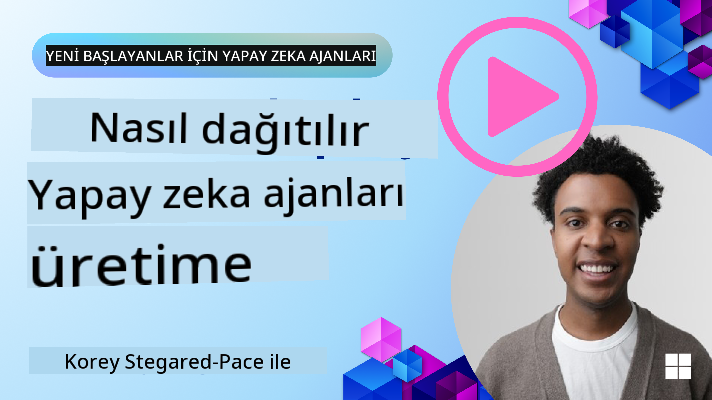

<!--
CO_OP_TRANSLATOR_METADATA:
{
  "original_hash": "1ad5de6a6388d02c145a92dd04358bab",
  "translation_date": "2025-07-12T13:38:34+00:00",
  "source_file": "10-ai-agents-production/README.md",
  "language_code": "tr"
}
-->

> _(Bu dersin videosunu izlemek için yukarıdaki görsele tıklayın)_
# Üretimde AI Ajanları

## Giriş

Bu derste şunlar ele alınacak:

- AI Ajanınızı üretime etkili bir şekilde nasıl dağıtacağınızı planlamak.
- AI Ajanınızı üretime dağıtırken karşılaşabileceğiniz yaygın hatalar ve sorunlar.
- AI Ajanınızın performansını korurken maliyetleri nasıl yönetebileceğiniz.

## Öğrenme Hedefleri

Bu dersi tamamladıktan sonra şunları bilecek/anlayacaksınız:

- Üretim ortamındaki bir AI Ajan sisteminin performansını, maliyetlerini ve etkinliğini artırma teknikleri.
- AI Ajanlarınızı ne şekilde ve nasıl değerlendireceğiniz.
- AI Ajanları üretime dağıtırken maliyetleri nasıl kontrol edeceğiniz.

Güvenilir AI Ajanları dağıtmak önemlidir. Ayrıca "Güvenilir AI Ajanları Oluşturma" dersine de göz atın.

## AI Ajanlarını Değerlendirme

AI Ajanlarını dağıtmadan önce, dağıtım sırasında ve sonrasında, AI Ajanlarınızı doğru şekilde değerlendirebileceğiniz bir sisteme sahip olmak kritik öneme sahiptir. Bu, sisteminizin sizin ve kullanıcılarınızın hedefleriyle uyumlu olmasını sağlar.

Bir AI Ajanı değerlendirmek için sadece ajanın çıktısını değil, aynı zamanda AI Ajanınızın çalıştığı tüm sistemi değerlendirebilme yeteneğine sahip olmak önemlidir. Bu şunları içerir ancak bunlarla sınırlı değildir:

- İlk model isteği.
- Ajanın kullanıcının niyetini tanıma yeteneği.
- Ajanın görevi yerine getirmek için doğru aracı seçme yeteneği.
- Aracın ajanın isteğine verdiği yanıt.
- Ajanın aracın yanıtını yorumlama yeteneği.
- Kullanıcının ajanın yanıtına verdiği geri bildirim.

Bu, iyileştirme alanlarını daha modüler bir şekilde belirlemenizi sağlar. Böylece modellerde, istemlerde, araçlarda ve diğer bileşenlerde yapılan değişikliklerin etkisini daha verimli bir şekilde izleyebilirsiniz.

## AI Ajanlarıyla İlgili Yaygın Sorunlar ve Olası Çözümler

| **Sorun**                                      | **Olası Çözüm**                                                                                                                                                                                                             |
| ---------------------------------------------- | ---------------------------------------------------------------------------------------------------------------------------------------------------------------------------------------------------------------------------- |
| AI Ajanı görevleri tutarlı şekilde yerine getirmiyor | - AI Ajanına verilen istemi (prompt) netleştirin; hedefleri açıkça belirtin. - Görevleri alt görevlere bölüp birden fazla ajanla yönetmenin faydalı olabileceği yerleri belirleyin.                                      |
| AI Ajanı sürekli döngülere giriyor             | - Ajanın süreci ne zaman durduracağını bilmesi için net sonlandırma şartları belirleyin. - Muhakeme ve planlama gerektiren karmaşık görevler için muhakeme konusunda uzmanlaşmış daha büyük bir model kullanın.               |
| AI Ajanı araç çağrıları iyi çalışmıyor         | - Aracın çıktısını ajan sisteminin dışında test edin ve doğrulayın. - Tanımlanan parametreleri, istemleri ve araç isimlendirmelerini iyileştirin.                                                                           |
| Çoklu Ajan sistemi tutarlı çalışmıyor          | - Her ajana verilen istemleri daha spesifik ve birbirinden farklı olacak şekilde iyileştirin. - Hangi ajanın doğru olduğunu belirlemek için "yönlendirme" veya kontrolör ajanı kullanarak hiyerarşik bir sistem kurun.       |

## Maliyet Yönetimi

AI Ajanlarını üretime dağıtırken maliyetleri yönetmek için bazı stratejiler:

- **Yanıtları Önbelleğe Alma** - Yaygın istekleri ve görevleri belirleyip, yanıtları ajan sisteminizden geçmeden önce sağlamak, benzer isteklerin hacmini azaltmanın iyi bir yoludur. Daha temel AI modelleri kullanarak bir isteğin önbellekteki isteklere ne kadar benzediğini belirleyen bir akış bile oluşturabilirsiniz.

- **Daha Küçük Modeller Kullanma** - Küçük Dil Modelleri (SLM'ler) belirli ajan kullanım durumlarında iyi performans gösterebilir ve maliyetleri önemli ölçüde düşürür. Daha önce belirtildiği gibi, performansı daha büyük modellerle karşılaştırmak için bir değerlendirme sistemi kurmak, SLM'nin kullanım durumunuzda ne kadar iyi performans göstereceğini anlamanın en iyi yoludur.

- **Yönlendirici Model Kullanma** - Benzer bir strateji olarak, farklı model ve boyut çeşitliliği kullanabilirsiniz. Karmaşıklığa göre istekleri en uygun modellere yönlendirmek için bir LLM/SLM veya sunucusuz fonksiyon kullanabilirsiniz. Bu, maliyetleri düşürürken doğru görevlerde performansı da garanti eder.

## Tebrikler

Bu, şu anda "Yeni Başlayanlar için AI Ajanları" derslerinin sonuncusudur.

Bu hızla büyüyen sektörde geri bildirimler ve değişikliklere bağlı olarak yeni dersler eklemeye devam etmeyi planlıyoruz, bu yüzden yakın zamanda tekrar uğrayın.

AI Ajanları ile öğrenmeye ve geliştirmeye devam etmek isterseniz, <a href="https://discord.gg/kzRShWzttr" target="_blank">Azure AI Community Discord</a>'a katılabilirsiniz.

Orada atölyeler, topluluk yuvarlak masa toplantıları ve "her şeyi sor" oturumları düzenliyoruz.

Ayrıca, üretimde AI Ajanları geliştirmeye başlamanıza yardımcı olacak ek materyallerden oluşan bir Learn koleksiyonumuz da var.

## Önceki Ders

[Metacognition Design Pattern](../09-metacognition/README.md)

**Feragatname**:  
Bu belge, AI çeviri servisi [Co-op Translator](https://github.com/Azure/co-op-translator) kullanılarak çevrilmiştir. Doğruluk için çaba göstersek de, otomatik çevirilerin hatalar veya yanlışlıklar içerebileceğini lütfen unutmayın. Orijinal belge, kendi dilinde yetkili kaynak olarak kabul edilmelidir. Kritik bilgiler için profesyonel insan çevirisi önerilir. Bu çevirinin kullanımı sonucu oluşabilecek yanlış anlamalar veya yorum hatalarından sorumlu değiliz.