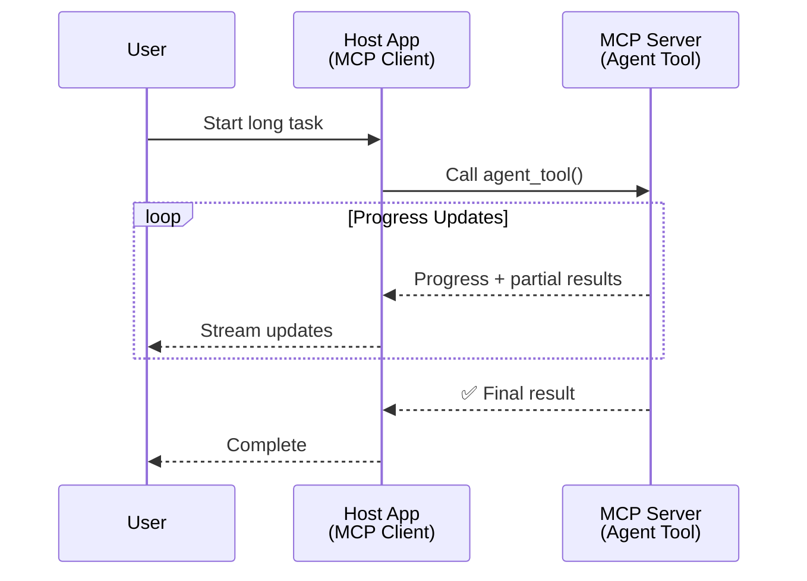
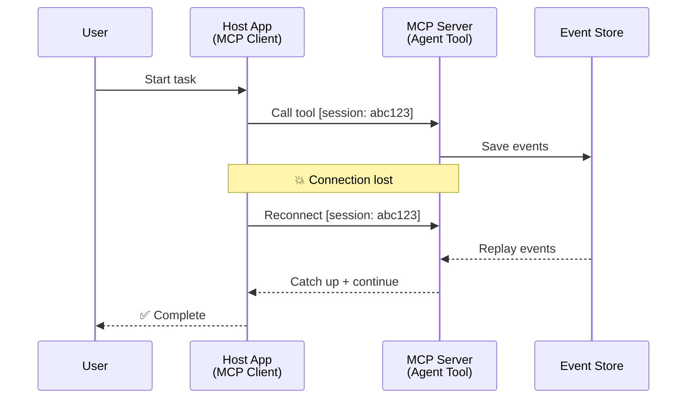
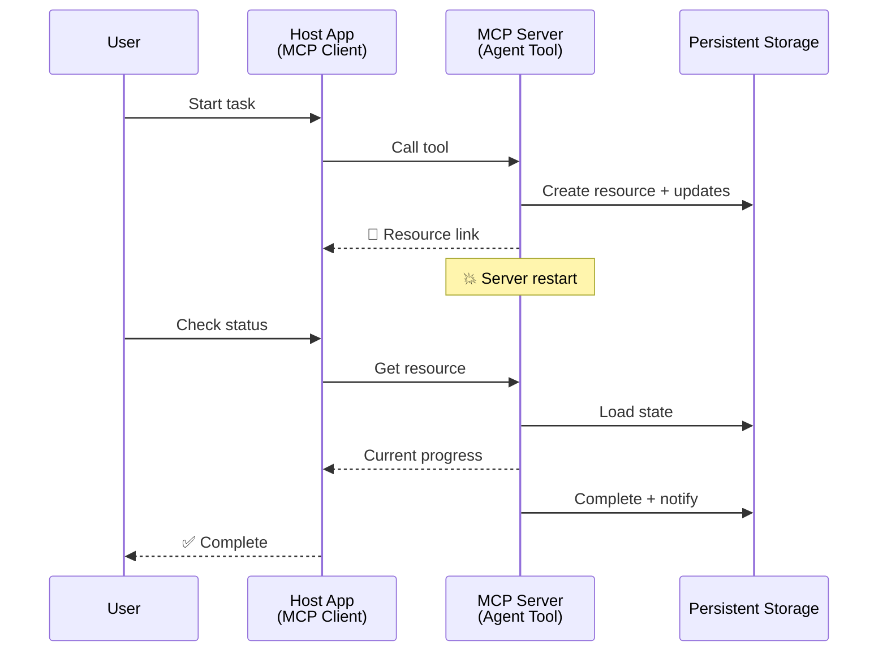
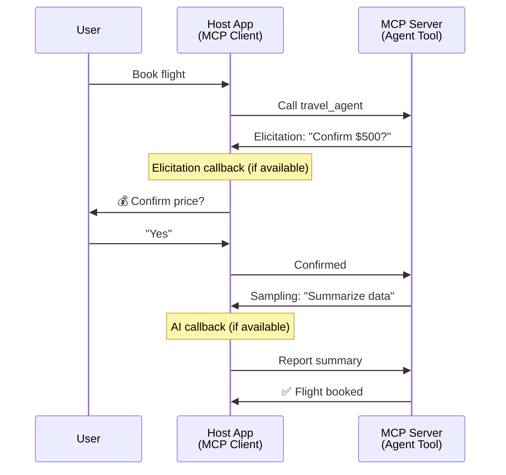
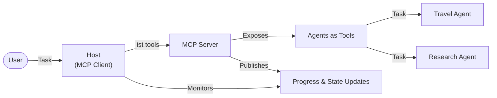

<!--
CO_OP_TRANSLATOR_METADATA:
{
  "original_hash": "5cc6836626047aa055e8960c8484a7d0",
  "translation_date": "2025-08-29T13:29:12+00:00",
  "source_file": "11-agentic-protocols/code_samples/mcp-agents/README.md",
  "language_code": "tr"
}
-->
# MCP ile Agent-to-Agent İletişim Sistemleri Kurma

> TL;DR - MCP üzerinde Agent2Agent İletişimi Kurabilir misiniz? Evet!

MCP, "LLM'lere bağlam sağlama" olan orijinal hedefinin ötesinde önemli ölçüde gelişti. [Devam edebilir akışlar](https://modelcontextprotocol.io/docs/concepts/transports#resumability-and-redelivery), [bilgi toplama](https://modelcontextprotocol.io/specification/2025-06-18/client/elicitation), [örnekleme](https://modelcontextprotocol.io/specification/2025-06-18/client/sampling) ve bildirimler ([ilerleme](https://modelcontextprotocol.io/specification/2025-06-18/basic/utilities/progress) ve [kaynaklar](https://modelcontextprotocol.io/specification/2025-06-18/schema#resourceupdatednotification)) gibi son geliştirmelerle MCP, karmaşık agent-to-agent iletişim sistemleri oluşturmak için sağlam bir temel sağlar.

## Agent/Tool Yanılgısı

Agentik davranışlara sahip araçları (uzun süre çalışır, yürütme sırasında ek girdilere ihtiyaç duyabilir, vb.) keşfeden daha fazla geliştiriciyle birlikte, yaygın bir yanılgı MCP'nin uygun olmadığıdır. Bunun nedeni, MCP'nin araç ilkelinin erken örneklerinin basit istek-yanıt kalıplarına odaklanmasıdır.

Bu algı artık geçerli değil. MCP spesifikasyonu, uzun süreli agentik davranışlar oluşturma boşluğunu kapatan özelliklerle son birkaç ayda önemli ölçüde geliştirildi:

- **Akış ve Kısmi Sonuçlar**: Yürütme sırasında gerçek zamanlı ilerleme güncellemeleri
- **Devamlılık**: Bağlantı kesildikten sonra istemciler yeniden bağlanabilir ve devam edebilir
- **Dayanıklılık**: Sonuçlar sunucu yeniden başlatmalarından sonra korunur (örneğin, kaynak bağlantıları aracılığıyla)
- **Çoklu dönüş**: Yürütme sırasında etkileşimli girişler bilgi toplama ve örnekleme yoluyla

Bu özellikler, MCP protokolü üzerinde konuşlandırılan karmaşık agentik ve çoklu agent uygulamalarını mümkün kılmak için birleştirilebilir.

Referans olarak, bir agenti MCP sunucusunda mevcut olan bir "araç" olarak adlandıracağız. Bu, bir MCP istemcisini uygulayan ve MCP sunucusuyla bir oturum kuran ve agenti çağırabilen bir ana uygulamanın varlığını ima eder.

## MCP Araçlarını "Agentik" Yapan Nedir?

Uygulamaya geçmeden önce, uzun süreli agentleri desteklemek için gereken altyapı yeteneklerini belirleyelim.

> Bir agenti, uzun süre boyunca bağımsız olarak çalışabilen, birden fazla etkileşim veya gerçek zamanlı geri bildirimlere dayalı ayarlamalar gerektirebilecek karmaşık görevleri yerine getirebilen bir varlık olarak tanımlayacağız.

### 1. Akış ve Kısmi Sonuçlar

Geleneksel istek-yanıt kalıpları uzun süreli görevler için işe yaramaz. Agentlerin şunları sağlaması gerekir:

- Gerçek zamanlı ilerleme güncellemeleri
- Ara sonuçlar

**MCP Desteği**: Kaynak güncelleme bildirimleri kısmi sonuçların akışını sağlar, ancak bu, JSON-RPC'nin 1:1 istek/yanıt modeliyle çakışmaları önlemek için dikkatli bir tasarım gerektirir.

| Özellik                    | Kullanım Durumu                                                                                                                                                                       | MCP Desteği                                                                                |
| -------------------------- | ------------------------------------------------------------------------------------------------------------------------------------------------------------------------------------- | ------------------------------------------------------------------------------------------ |
| Gerçek zamanlı İlerleme Güncellemeleri | Kullanıcı bir kod tabanı geçiş görevi talep eder. Agent ilerlemeyi akış olarak iletir: "10% - Bağımlılıkları analiz ediyor... 25% - TypeScript dosyalarını dönüştürüyor... 50% - İthalatları güncelliyor..."          | ✅ İlerleme bildirimleri                                                                  |
| Kısmi Sonuçlar            | "Bir kitap oluştur" görevi kısmi sonuçları akış olarak iletir, örneğin: 1) Hikaye yayının taslağı, 2) Bölüm listesi, 3) Tamamlanan her bölüm. Ana bilgisayar herhangi bir aşamada inceleyebilir, iptal edebilir veya yönlendirebilir. | ✅ Bildirimler "genişletilebilir" ve kısmi sonuçları içerebilir, PR 383, 776 önerilerine bakın |

<div align="center" style="font-style: italic; font-size: 0.95em; margin-bottom: 0.5em;">
<strong>Şekil 1:</strong> Bu diyagram, bir MCP agentinin uzun süreli bir görev sırasında ana uygulamaya gerçek zamanlı ilerleme güncellemeleri ve kısmi sonuçları nasıl akış olarak ilettiğini, kullanıcının yürütmeyi gerçek zamanlı olarak izlemesini sağladığını göstermektedir.
</div>



### 2. Devamlılık

Agentler ağ kesintilerini sorunsuz bir şekilde yönetmelidir:

- (İstemci) bağlantı kesildikten sonra yeniden bağlanma
- Kaldıkları yerden devam etme (mesaj yeniden iletimi)

**MCP Desteği**: MCP StreamableHTTP taşıma bugün oturum kimlikleri ve son olay kimlikleri ile oturum devamlılığı ve mesaj yeniden iletimi destekler. Burada önemli olan, sunucunun istemci yeniden bağlandığında olay tekrarlarını etkinleştiren bir EventStore uygulaması gerektiğidir.  
Topluluk önerisi (PR #975) taşıma bağımsız devam edebilir akışları keşfetmektedir.

| Özellik      | Kullanım Durumu                                                                                                                                                   | MCP Desteği                                                                |
| ------------ | ------------------------------------------------------------------------------------------------------------------------------------------------------------------ | -------------------------------------------------------------------------- |
| Devamlılık | Uzun süreli görev sırasında istemci bağlantısı kesilir. Yeniden bağlandığında, oturum kaçırılan olaylar yeniden oynatılarak sorunsuz bir şekilde kaldığı yerden devam eder. | ✅ StreamableHTTP taşıma oturum kimlikleri, olay tekrarları ve EventStore ile |

<div align="center" style="font-style: italic; font-size: 0.95em; margin-bottom: 0.5em;">
<strong>Şekil 2:</strong> Bu diyagram, MCP'nin StreamableHTTP taşıma ve olay deposunun oturum devamlılığını nasıl sağladığını gösterir: istemci bağlantısı kesilirse, yeniden bağlanabilir ve kaçırılan olayları yeniden oynatabilir, görevi ilerleme kaybı olmadan sürdürebilir.
</div>



### 3. Dayanıklılık

Uzun süreli agentlerin kalıcı duruma ihtiyacı vardır:

- Sonuçlar sunucu yeniden başlatmalarından sonra korunur
- Durum dış bantta alınabilir
- Oturumlar arasında ilerleme takibi

**MCP Desteği**: MCP artık araç çağrıları için bir Kaynak bağlantı dönüş türünü desteklemektedir. Bugün, bir araç tasarlamak ve hemen bir kaynak bağlantısı döndürmek için bir araç tasarlamak yaygın bir modeldir. Araç, arka planda görevi ele alabilir ve kaynağı güncelleyebilir. Buna karşılık, istemci bu kaynağın durumunu kontrol etmeyi (sunucunun sağladığı kaynak güncellemelerine bağlı olarak kısmi veya tam sonuçlar almak için) veya güncelleme bildirimleri için kaynağa abone olmayı seçebilir.

Buradaki bir sınırlama, kaynakları kontrol etmenin veya güncellemeler için abone olmanın ölçekle ilgili etkileri olan kaynakları tüketebilmesidir. Sunucunun istemci/ana uygulamayı güncellemeler hakkında bilgilendirmek için çağırabileceği webhook'lar veya tetikleyiciler ekleme olasılığını keşfeden açık bir topluluk önerisi (992 dahil) bulunmaktadır.

| Özellik    | Kullanım Durumu                                                                                                                                        | MCP Desteği                                                        |
| ---------- | ----------------------------------------------------------------------------------------------------------------------------------------------------- | ------------------------------------------------------------------ |
| Dayanıklılık | Veri geçiş görevi sırasında sunucu çöküyor. Sonuçlar ve ilerleme yeniden başlatmadan sonra korunur, istemci durumu kontrol edebilir ve kalıcı kaynaktan devam edebilir. | ✅ Kalıcı depolama ve durum bildirimleri ile kaynak bağlantıları |

Bugün, bir araç tasarlamak ve hemen bir kaynak bağlantısı döndürmek yaygın bir modeldir. Araç, arka planda görevi ele alabilir, ilerleme güncellemeleri olarak hizmet eden veya kısmi sonuçlar içeren kaynak bildirimleri yayınlayabilir ve gerektiği gibi kaynaktaki içeriği güncelleyebilir.

<div align="center" style="font-style: italic; font-size: 0.95em; margin-bottom: 0.5em;">
<strong>Şekil 3:</strong> Bu diyagram, MCP agentlerinin kalıcı kaynakları ve durum bildirimlerini kullanarak uzun süreli görevlerin sunucu yeniden başlatmalarından sonra hayatta kalmasını nasıl sağladığını, istemcilerin ilerlemeyi kontrol etmesine ve hatalardan sonra sonuçları almasına olanak tanıdığını göstermektedir.
</div>



### 4. Çoklu Dönüş Etkileşimleri

Agentler genellikle yürütme sırasında ek girdilere ihtiyaç duyar:

- İnsan açıklaması veya onayı
- Karmaşık kararlar için AI yardımı
- Dinamik parametre ayarlamaları

**MCP Desteği**: Örnekleme (AI girdisi için) ve bilgi toplama (insan girdisi için) aracılığıyla tamamen desteklenir.

| Özellik                 | Kullanım Durumu                                                                                                                                     | MCP Desteği                                           |
| ----------------------- | -------------------------------------------------------------------------------------------------------------------------------------------------- | ----------------------------------------------------- |
| Çoklu Dönüş Etkileşimleri | Seyahat rezervasyonu agenti kullanıcıdan fiyat onayı ister, ardından rezervasyon işlemini tamamlamadan önce seyahat verilerini özetlemek için AI'dan yardım ister. | ✅ İnsan girdisi için bilgi toplama, AI girdisi için örnekleme |

<div align="center" style="font-style: italic; font-size: 0.95em; margin-bottom: 0.5em;">
<strong>Şekil 4:</strong> Bu diyagram, MCP agentlerinin yürütme sırasında insan girdisini etkileşimli olarak toplayabileceğini veya AI yardımı isteyebileceğini, onaylar ve dinamik karar verme gibi karmaşık, çoklu dönüş iş akışlarını desteklediğini göstermektedir.
</div>



## MCP'de Uzun Süreli Agentler Uygulama - Kod Genel Bakış

Bu makale kapsamında, StreamableHTTP taşıma ile oturum devamlılığı ve mesaj yeniden iletimi için MCP Python SDK kullanılarak uzun süreli agentlerin tam bir uygulamasını içeren bir [kod deposu](https://github.com/victordibia/ai-tutorials/tree/main/MCP%20Agents) sağlıyoruz. Uygulama, MCP yeteneklerinin agent benzeri davranışları etkinleştirmek için nasıl birleştirilebileceğini göstermektedir.

Özellikle, iki ana agent aracı içeren bir sunucu uyguluyoruz:

- **Seyahat Agenti** - Bilgi toplama yoluyla fiyat onayı simüle eden bir seyahat rezervasyon hizmeti
- **Araştırma Agenti** - Örnekleme yoluyla AI destekli özetlerle araştırma görevleri gerçekleştirir

Her iki agent de gerçek zamanlı ilerleme güncellemelerini, etkileşimli onayları ve tam oturum devamlılığı yeteneklerini gösterir.

### Temel Uygulama Kavramları

Aşağıdaki bölümler, her yetenek için sunucu tarafı agent uygulamasını ve istemci tarafı ana bilgisayar işlemesini göstermektedir:

#### Akış ve İlerleme Güncellemeleri - Gerçek Zamanlı Görev Durumu

Akış, agentlerin uzun süreli görevler sırasında gerçek zamanlı ilerleme güncellemeleri sağlamasına olanak tanır, kullanıcıları görev durumu ve ara sonuçlar hakkında bilgilendirir.

**Sunucu Uygulaması (agent ilerleme bildirimleri gönderir):**

```python
# From server/server.py - Travel agent sending progress updates
for i, step in enumerate(steps):
    await ctx.session.send_progress_notification(
        progress_token=ctx.request_id,
        progress=i * 25,
        total=100,
        message=step,
        related_request_id=str(ctx.request_id)
    )
    await anyio.sleep(2)  # Simulate work

# Alternative: Log messages for detailed step-by-step updates
await ctx.session.send_log_message(
    level="info",
    data=f"Processing step {current_step}/{steps} ({progress_percent}%)",
    logger="long_running_agent",
    related_request_id=ctx.request_id,
)
```

**İstemci Uygulaması (ana bilgisayar ilerleme güncellemelerini alır):**

```python
# From client/client.py - Client handling real-time notifications
async def message_handler(message) -> None:
    if isinstance(message, types.ServerNotification):
        if isinstance(message.root, types.LoggingMessageNotification):
            console.print(f"📡 [dim]{message.root.params.data}[/dim]")
        elif isinstance(message.root, types.ProgressNotification):
            progress = message.root.params
            console.print(f"🔄 [yellow]{progress.message} ({progress.progress}/{progress.total})[/yellow]")

# Register message handler when creating session
async with ClientSession(
    read_stream, write_stream,
    message_handler=message_handler
) as session:
```

#### Bilgi Toplama - Kullanıcı Girdisi İsteme

Bilgi toplama, agentlerin yürütme sırasında kullanıcı girdisi istemesine olanak tanır. Bu, uzun süreli görevler sırasında onaylar, açıklamalar veya onaylar için gereklidir.

**Sunucu Uygulaması (agent onay ister):**

```python
# From server/server.py - Travel agent requesting price confirmation
elicit_result = await ctx.session.elicit(
    message=f"Please confirm the estimated price of $1200 for your trip to {destination}",
    requestedSchema=PriceConfirmationSchema.model_json_schema(),
    related_request_id=ctx.request_id,
)

if elicit_result and elicit_result.action == "accept":
    # Continue with booking
    logger.info(f"User confirmed price: {elicit_result.content}")
elif elicit_result and elicit_result.action == "decline":
    # Cancel the booking
    booking_cancelled = True
```

**İstemci Uygulaması (ana bilgisayar bilgi toplama geri çağrısı sağlar):**

```python
# From client/client.py - Client handling elicitation requests
async def elicitation_callback(context, params):
    console.print(f"💬 Server is asking for confirmation:")
    console.print(f"   {params.message}")

    response = console.input("Do you accept? (y/n): ").strip().lower()

    if response in ['y', 'yes']:
        return types.ElicitResult(
            action="accept",
            content={"confirm": True, "notes": "Confirmed by user"}
        )
    else:
        return types.ElicitResult(
            action="decline",
            content={"confirm": False, "notes": "Declined by user"}
        )

# Register the callback when creating the session
async with ClientSession(
    read_stream, write_stream,
    elicitation_callback=elicitation_callback
) as session:
```

#### Örnekleme - AI Yardımı İsteme

Örnekleme, agentlerin yürütme sırasında karmaşık kararlar veya içerik oluşturma için LLM yardımı istemesine olanak tanır. Bu, hibrit insan-AI iş akışlarını mümkün kılar.

**Sunucu Uygulaması (agent AI yardımı ister):**

```python
# From server/server.py - Research agent requesting AI summary
sampling_result = await ctx.session.create_message(
    messages=[
        SamplingMessage(
            role="user",
            content=TextContent(type="text", text=f"Please summarize the key findings for research on: {topic}")
        )
    ],
    max_tokens=100,
    related_request_id=ctx.request_id,
)

if sampling_result and sampling_result.content:
    if sampling_result.content.type == "text":
        sampling_summary = sampling_result.content.text
        logger.info(f"Received sampling summary: {sampling_summary}")
```

**İstemci Uygulaması (ana bilgisayar örnekleme geri çağrısı sağlar):**

```python
# From client/client.py - Client handling sampling requests
async def sampling_callback(context, params):
    message_text = params.messages[0].content.text if params.messages else 'No message'
    console.print(f"🧠 Server requested sampling: {message_text}")

    # In a real application, this could call an LLM API
    # For demo purposes, we provide a mock response
    mock_response = "Based on current research, MCP has evolved significantly..."

    return types.CreateMessageResult(
        role="assistant",
        content=types.TextContent(type="text", text=mock_response),
        model="interactive-client",
        stopReason="endTurn"
    )

# Register the callback when creating the session
async with ClientSession(
    read_stream, write_stream,
    sampling_callback=sampling_callback,
    elicitation_callback=elicitation_callback
) as session:
```

#### Devamlılık - Kesintiler Arasında Oturum Sürekliliği

Devamlılık, uzun süreli agent görevlerinin istemci bağlantı kesilmelerini hayatta kalmasını ve yeniden bağlanma sırasında sorunsuz bir şekilde devam etmesini sağlar. Bu, olay depoları ve devamlılık belirteçleri aracılığıyla uygulanır.

**Olay Deposu Uygulaması (sunucu oturum durumunu tutar):**

```python
# From server/event_store.py - Simple in-memory event store
class SimpleEventStore(EventStore):
    def __init__(self):
        self._events: list[tuple[StreamId, EventId, JSONRPCMessage]] = []
        self._event_id_counter = 0

    async def store_event(self, stream_id: StreamId, message: JSONRPCMessage) -> EventId:
        """Store an event and return its ID."""
        self._event_id_counter += 1
        event_id = str(self._event_id_counter)
        self._events.append((stream_id, event_id, message))
        return event_id

    async def replay_events_after(self, last_event_id: EventId, send_callback: EventCallback) -> StreamId | None:
        """Replay events after the specified ID for resumption."""
        # Find events after the last known event and replay them
        for _, event_id, message in self._events[start_index:]:
            await send_callback(EventMessage(message, event_id))

# From server/server.py - Passing event store to session manager
def create_server_app(event_store: Optional[EventStore] = None) -> Starlette:
    server = ResumableServer()

    # Create session manager with event store for resumption
    session_manager = StreamableHTTPSessionManager(
        app=server,
        event_store=event_store,  # Event store enables session resumption
        json_response=False,
        security_settings=security_settings,
    )

    return Starlette(routes=[Mount("/mcp", app=session_manager.handle_request)])

# Usage: Initialize with event store
event_store = SimpleEventStore()
app = create_server_app(event_store)
```

**İstemci Meta Verileri ile Devamlılık Belirteci (istemci depolanan durumu kullanarak yeniden bağlanır):**

```python
# From client/client.py - Client resumption with metadata
if existing_tokens and existing_tokens.get("resumption_token"):
    # Use existing resumption token to continue where we left off
    metadata = ClientMessageMetadata(
        resumption_token=existing_tokens["resumption_token"],
    )
else:
    # Create callback to save resumption token when received
    def enhanced_callback(token: str):
        protocol_version = getattr(session, 'protocol_version', None)
        token_manager.save_tokens(session_id, token, protocol_version, command, args)

    metadata = ClientMessageMetadata(
        on_resumption_token_update=enhanced_callback,
    )

# Send request with resumption metadata
result = await session.send_request(
    types.ClientRequest(
        types.CallToolRequest(
            method="tools/call",
            params=types.CallToolRequestParams(name=command, arguments=args)
        )
    ),
    types.CallToolResult,
    metadata=metadata,
)
```

Ana uygulama, oturum kimliklerini ve devamlılık belirteçlerini yerel olarak tutar, mevcut oturumlara ilerleme veya durum kaybı olmadan yeniden bağlanmasını sağlar.

### Kod Organizasyonu

<div align="center" style="font-style: italic; font-size: 0.95em; margin-bottom: 0.5em;">
<strong>Şekil 5:</strong> MCP tabanlı agent sistem mimarisi
</div>



**Temel Dosyalar:**

- **`server/server.py`** - Seyahat ve araştırma agentlerini bilgi toplama, örnekleme ve ilerleme güncellemeleri ile gösteren devamlı MCP sunucusu
- **`client/client.py`** - Devamlılık desteği, geri çağrı işleyicileri ve belirteç yönetimi ile etkileşimli ana uygulama
- **`server/event_store.py`** - Oturum devamlılığı ve mesaj yeniden iletimi sağlayan olay deposu uygulaması

## MCP'de Çoklu Agent İletişimine Genişletme

Yukarıdaki uygulama, ana uygulamanın zekasını ve kapsamını artırarak çoklu agent sistemlerine genişletilebilir:

- **Akıllı Görev Ayrıştırma**: Ana bilgisayar karmaşık kullanıcı isteklerini analiz eder ve bunları farklı uzmanlaşmış agentler için alt görevlere böler
- **Çoklu Sunucu Koordinasyonu**: Ana bilgisayar, farklı agent yeteneklerini ortaya çıkaran birden fazla MCP sunucusuna bağlantıları sürdürür
- **Görev Durumu Yönetimi**: Ana bilgisayar, birden fazla eşzamanlı agent görevi arasında ilerlemeyi takip eder, bağımlılıkları ve sıralamayı yönetir
- **Dayanıklılık ve Yeniden Denemeler**: Ana bilgisayar hataları yönetir, yeniden deneme mantığını uygular ve agentler kullanılamaz hale geldiğinde görevleri yeniden yönlendirir
- **Sonuç Sentezi**: Ana bilgisayar, birden fazla agentten gelen çıktıları tutarlı nihai sonuçlara birleştirir

Ana bilgisayar, basit bir istemciden, dağıtılmış agent yeteneklerini koordine eden ve aynı MCP protokolü temelini koruyan akıllı bir düzenleyiciye dönüşür.

## Sonuç

MCP'nin geliştirilmiş yetenekleri - kaynak bildirimleri, bilgi toplama/örnekleme, devam edebilir akışlar ve kalıcı kaynaklar - protokol basitliğini korurken karmaşık agent-to-agent etkileşimlerini mümkün kılar.

## Başlarken

Kendi agent2agent sisteminizi kurmaya hazır mısınız? İşte adımlar:

### 1. Demoyu Çalıştırın

```bash
# Start the server with event store for resumption
python -m server.server --port 8006

# In another terminal, run the interactive client
python -m client.client --url http://127.0.0.1:8006/mcp
```

**Etkileşimli modda kullanılabilir komutlar:**

- `travel_agent` - Bilgi toplama yoluyla fiyat onayı ile seyahat rezervasyonu yapın
- `research_agent` - Örnekleme yoluyla AI destekli özetlerle konuları araştırın
- `list` - Tüm mevcut araçları göster
- `clean-tokens` - Devamlılık belirteçlerini temizle
- `help` - Ayrıntılı komut yardımını göster
- `quit` - İstemciden çık

### 2. Devamlılık Yeteneklerini Test Edin

- Uzun süreli bir agent başlatın (örneğin, `travel_agent`)
- Yürütme sırasında istemciyi durdurun (Ctrl+C)
- İstemciyi yeniden başlatın - kaldığı yerden otomatik olarak devam edecektir

### 3. Keşfedin ve Genişletin

- **Örnekleri keşfedin**: Bu [mcp-agents](https://github.com/victordibia/ai-tutorials/tree/main/MCP%20Agents) örneklerine göz atın
- **Topluluğa katılın**: GitHub'daki MCP tartışmalarına katılın
- **Deney yapın**: Basit bir uzun süreli görevle başlayın ve yavaş yavaş akış, devamlılık ve çoklu agent koordinasyonu ekleyin

Bu, MCP'nin araç tabanlı basitliği korurken akıllı agent davranışlarını nasıl mümkün kıldığını göstermektedir.

Genel olarak, MCP protokol spesifikasyonu hızla gelişiyor; okuy

---

**Feragatname**:  
Bu belge, [Co-op Translator](https://github.com/Azure/co-op-translator) adlı yapay zeka çeviri hizmeti kullanılarak çevrilmiştir. Doğruluk için çaba göstersek de, otomatik çevirilerin hata veya yanlışlıklar içerebileceğini lütfen unutmayın. Belgenin orijinal dili, yetkili kaynak olarak kabul edilmelidir. Kritik bilgiler için profesyonel insan çevirisi önerilir. Bu çevirinin kullanımından kaynaklanan yanlış anlamalar veya yanlış yorumlamalardan sorumlu değiliz.