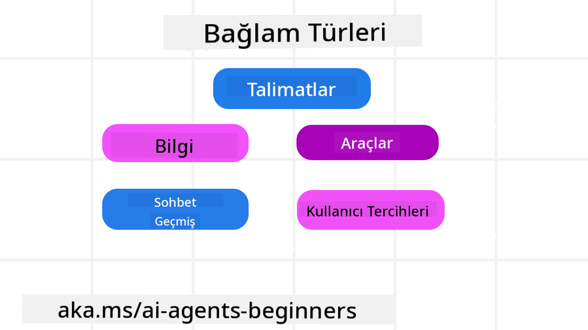
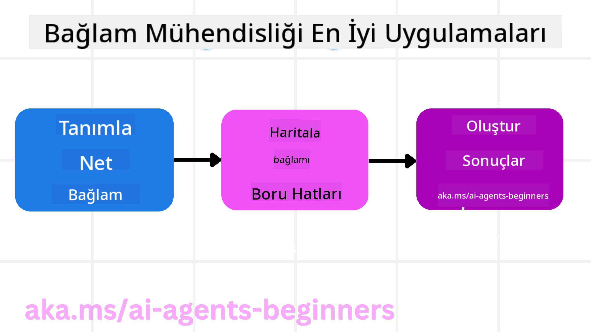

<!--
CO_OP_TRANSLATOR_METADATA:
{
  "original_hash": "cb7e50f471905ce6fdb92a30269a7a98",
  "translation_date": "2025-09-04T10:04:47+00:00",
  "source_file": "12-context-engineering/README.md",
  "language_code": "tr"
}
-->
# AI Ajanları için Bağlam Mühendisliği

> _(Bu dersin videosunu izlemek için yukarıdaki görsele tıklayın)_

Bir AI ajanı geliştirdiğiniz uygulamanın karmaşıklığını anlamak, güvenilir bir ajan oluşturmak için önemlidir. AI ajanlarının, yalnızca istem mühendisliğinin ötesinde karmaşık ihtiyaçları karşılamak için bilgiyi etkili bir şekilde yönetmesi gerekir.

Bu derste, bağlam mühendisliğinin ne olduğunu ve AI ajanları oluşturmadaki rolünü inceleyeceğiz.

## Giriş

Bu derste şunları ele alacağız:

• **Bağlam Mühendisliği nedir** ve neden istem mühendisliğinden farklıdır.

• **Etkili Bağlam Mühendisliği için stratejiler**, bağlamı nasıl yazacağımız, seçeceğimiz, sıkıştıracağımız ve izole edeceğimiz dahil.

• **Yaygın Bağlam Hataları** ve bunların AI ajanınızı nasıl raydan çıkarabileceği ile bunları düzeltme yolları.

## Öğrenme Hedefleri

Bu dersi tamamladıktan sonra şunları anlayacaksınız:

• **Bağlam mühendisliğini tanımlayın** ve istem mühendisliğinden nasıl farklılaştığını açıklayın.

• **Büyük Dil Modeli (LLM) uygulamalarında bağlamın temel bileşenlerini belirleyin.**

• **Bağlam yazma, seçme, sıkıştırma ve izole etme stratejilerini uygulayın** ve ajan performansını artırın.

• **Bağlam zehirlenmesi, dikkat dağınıklığı, kafa karışıklığı ve çakışma gibi yaygın bağlam hatalarını tanıyın** ve bunları önlemek için teknikler geliştirin.

## Bağlam Mühendisliği Nedir?

AI ajanları için bağlam, bir AI ajanının belirli eylemleri planlamasını yönlendiren unsurdur. Bağlam mühendisliği, AI ajanının bir görevin bir sonraki adımını tamamlamak için doğru bilgiye sahip olmasını sağlamaya yönelik bir uygulamadır. Bağlam penceresi boyut olarak sınırlıdır, bu nedenle ajan geliştiricileri olarak bağlam penceresine bilgi ekleme, çıkarma ve sıkıştırma süreçlerini yönetmek için sistemler ve süreçler geliştirmemiz gerekir.

### İstem Mühendisliği ve Bağlam Mühendisliği

İstem mühendisliği, AI ajanlarını bir dizi kural ile etkili bir şekilde yönlendirmek için sabit bir talimat setine odaklanır. Bağlam mühendisliği ise, AI ajanının zaman içinde ihtiyaç duyduğu dinamik bir bilgi setini, başlangıç istemi de dahil olmak üzere, nasıl yöneteceğine odaklanır. Bağlam mühendisliğinin temel fikri, bu süreci tekrarlanabilir ve güvenilir hale getirmektir.

### Bağlam Türleri

Bağlamın tek bir şey olmadığını unutmamak önemlidir. AI ajanının ihtiyaç duyduğu bilgi, çeşitli kaynaklardan gelebilir ve bu kaynaklara erişimi sağlamak bizim sorumluluğumuzdadır:

AI ajanının yönetmesi gereken bağlam türleri şunları içerebilir:

• **Talimatlar:** Bunlar, ajanın "kuralları" gibidir – istemler, sistem mesajları, birkaç örnekle gösterimler (AI'ya bir şeyi nasıl yapacağını gösterme) ve kullanabileceği araçların tanımları. Bu, istem mühendisliğinin bağlam mühendisliğiyle birleştiği yerdir.

• **Bilgi:** Veritabanlarından alınan gerçekler, bilgiler veya ajanın biriktirdiği uzun vadeli anılar. Bu, bir ajan farklı bilgi depolarına ve veritabanlarına erişim gerektiriyorsa, Bilgi Geri Çağırma Destekli Üretim (RAG) sistemini entegre etmeyi içerir.

• **Araçlar:** Bunlar, ajanın çağırabileceği harici işlevlerin, API'lerin ve MCP Sunucularının tanımları ve bunları kullanarak elde ettiği geri bildirimlerdir (sonuçlar).

• **Konuşma Geçmişi:** Kullanıcıyla devam eden diyalog. Zamanla bu konuşmalar uzar ve daha karmaşık hale gelir, bu da bağlam penceresinde yer kaplar.

• **Kullanıcı Tercihleri:** Zamanla bir kullanıcının beğenileri veya beğenmedikleri hakkında öğrenilen bilgiler. Bu bilgiler, kullanıcıya yardımcı olmak için önemli kararlar alırken kullanılabilir.

## Etkili Bağlam Mühendisliği Stratejileri

### Planlama Stratejileri

İyi bağlam mühendisliği, iyi bir planlamayla başlar. İşte bağlam mühendisliği kavramını nasıl uygulayacağınızı düşünmeye başlamanıza yardımcı olacak bir yaklaşım:

1. **Net Sonuçlar Tanımlayın** - AI ajanlarına atanacak görevlerin sonuçları açıkça tanımlanmalıdır. Şu soruyu yanıtlayın: "AI ajanı görevini tamamladığında dünya nasıl görünecek?" Başka bir deyişle, kullanıcı AI ajanıyla etkileşimde bulunduktan sonra hangi değişiklik, bilgi veya yanıtı almalıdır?

2. **Bağlamı Haritalayın** - AI ajanının sonuçlarını tanımladıktan sonra, "AI ajanının bu görevi tamamlamak için hangi bilgilere ihtiyacı var?" sorusunu yanıtlamanız gerekir. Bu şekilde, bu bilginin nerede bulunabileceğini haritalamaya başlayabilirsiniz.

3. **Bağlam Boru Hatları Oluşturun** - Artık bilginin nerede olduğunu bildiğinize göre, "Ajan bu bilgiyi nasıl alacak?" sorusunu yanıtlamanız gerekir. Bu, RAG, MCP sunucularının kullanımı ve diğer araçlar dahil olmak üzere çeşitli yollarla yapılabilir.

### Pratik Stratejiler

Planlama önemlidir, ancak bilgi ajanınızın bağlam penceresine akmaya başladığında, bunu yönetmek için pratik stratejilere ihtiyacımız vardır:

#### Bağlamı Yönetme

Bazı bilgiler bağlam penceresine otomatik olarak eklenirken, bağlam mühendisliği bu bilgiyi daha aktif bir şekilde yönetmeyi içerir. Bu, birkaç stratejiyle yapılabilir:

1. **Ajan Not Defteri**  
   Bu, bir AI ajanının tek bir oturum sırasında mevcut görevler ve kullanıcı etkileşimleri hakkında ilgili bilgileri not almasını sağlar. Bu, bağlam penceresi dışında, bir dosyada veya çalışma zamanı nesnesinde bulunmalı ve gerekirse bu oturum sırasında geri çağrılabilir.

2. **Anılar**  
   Not defterleri, tek bir oturumun bağlam penceresi dışındaki bilgileri yönetmek için iyidir. Anılar, ajanların birden fazla oturum boyunca ilgili bilgileri saklamasına ve geri çağırmasına olanak tanır. Bu, özetleri, kullanıcı tercihlerini ve gelecekteki iyileştirmeler için geri bildirimleri içerebilir.

3. **Bağlamı Sıkıştırma**  
   Bağlam penceresi büyüyüp sınırına yaklaştığında, özetleme ve kırpma gibi teknikler kullanılabilir. Bu, yalnızca en alakalı bilgilerin tutulmasını veya eski mesajların kaldırılmasını içerir.

4. **Çoklu Ajan Sistemleri**  
   Çoklu ajan sistemi geliştirmek, bir bağlam mühendisliği biçimidir çünkü her ajanın kendi bağlam penceresi vardır. Bu bağlamın nasıl paylaşıldığı ve farklı ajanlara nasıl aktarıldığı, bu sistemleri oluştururken planlanması gereken başka bir şeydir.

5. **Korumalı Alan Ortamları**  
   Bir ajan, bir kod çalıştırması veya bir belgede büyük miktarda bilgiyi işlemesi gerektiğinde, bu sonuçları işlemek için büyük miktarda token gerekebilir. Bunun yerine, tüm bunların bağlam penceresinde saklanması yerine, ajan bu kodu çalıştırabilen ve yalnızca sonuçları ve diğer ilgili bilgileri okuyabilen bir korumalı alan ortamı kullanabilir.

6. **Çalışma Zamanı Durum Nesneleri**  
   Bu, ajanın belirli bilgilere erişmesi gerektiğinde bilgi kapsayıcıları oluşturarak yapılır. Karmaşık bir görev için, bu, ajanın her bir alt görev adımının sonuçlarını adım adım saklamasına olanak tanır ve bağlamın yalnızca o belirli alt göreve bağlı kalmasını sağlar.

### Bağlam Mühendisliği Örneği

Diyelim ki bir AI ajanından **"Bana Paris'e bir gezi ayarla."** demesini istiyorsunuz.

• Sadece istem mühendisliği kullanan basit bir ajan şu şekilde yanıt verebilir: **"Tamam, Paris'e ne zaman gitmek istersiniz?"**. Bu, yalnızca kullanıcının sorduğu anda doğrudan soruyu işler.

• Bağlam mühendisliği stratejilerini kullanan bir ajan ise çok daha fazlasını yapar. Yanıt vermeden önce, sistemi şunları yapabilir:

  ◦ **Takviminizi kontrol eder** ve uygun tarihleri bulur (gerçek zamanlı veri alımı).  
  ◦ **Geçmiş seyahat tercihlerinizi hatırlar** (uzun vadeli hafızadan) – tercih ettiğiniz havayolu, bütçe veya direkt uçuşları tercih edip etmediğiniz gibi.  
  ◦ **Uygun araçları belirler** – uçuş ve otel rezervasyonu için kullanılabilecek araçlar.  

- Ardından, örnek bir yanıt şu şekilde olabilir: "Merhaba [Adınız]! İlk hafta ekim ayında müsait olduğunuzu görüyorum. [Tercih Edilen Havayolu] ile [Bütçe] dahilinde direkt uçuşlar aramamı ister misiniz?" Bu daha zengin, bağlam farkındalığına sahip yanıt, bağlam mühendisliğinin gücünü gösterir.

## Yaygın Bağlam Hataları

### Bağlam Zehirlenmesi

**Nedir:** LLM tarafından üretilen yanlış bilgi (halüsinasyon) veya bir hata bağlama girip tekrar tekrar referans alındığında, ajanın imkansız hedefler peşinde koşmasına veya saçma stratejiler geliştirmesine neden olur.

**Ne Yapmalı:** **Bağlam doğrulama** ve **karantina** uygulayın. Bilgi uzun vadeli hafızaya eklenmeden önce doğrulanmalıdır. Potansiyel bir zehirlenme tespit edilirse, kötü bilginin yayılmasını önlemek için yeni bağlam dizileri başlatın.

**Seyahat Rezervasyonu Örneği:** Ajanınız, **küçük bir yerel havaalanından uzak bir uluslararası şehre direkt uçuş** olduğunu hayal eder (aslında böyle bir uçuş yoktur). Bu var olmayan uçuş detayı bağlama kaydedilir. Daha sonra ajan, bu imkansız rotaya bilet bulmaya çalışır ve sürekli hatalar yapar.

**Çözüm:** **Uçuş varlığını ve rotalarını gerçek zamanlı bir API ile doğrulayan bir adım uygulayın**. Doğrulama başarısız olursa, yanlış bilgi "karantinaya alınır" ve daha fazla kullanılmaz.

### Bağlam Dikkat Dağınıklığı

**Nedir:** Bağlam o kadar büyür ki model, eğitim sırasında öğrendiklerini kullanmak yerine biriken geçmişe çok fazla odaklanır ve tekrarlayan veya yararsız eylemler yapar. Modeller, bağlam penceresi dolmadan önce bile hata yapmaya başlayabilir.

**Ne Yapmalı:** **Bağlam özetleme** kullanın. Biriken bilgileri periyodik olarak daha kısa özetlere sıkıştırarak önemli ayrıntıları koruyun ve gereksiz geçmişi kaldırın. Bu, odağı "sıfırlamaya" yardımcı olur.

**Seyahat Rezervasyonu Örneği:** Uzun bir süre boyunca çeşitli hayalinizdeki seyahat destinasyonlarını tartıştınız, iki yıl önceki sırt çantalı seyahatinizin ayrıntılı bir anlatımı da dahil. Sonunda **"gelecek ay için ucuz bir uçuş bul"** dediğinizde, ajan eski, alakasız ayrıntılara takılır ve sırt çantalı ekipmanınız veya önceki güzergahlarınız hakkında sorular sormaya devam eder, mevcut isteğinizi ihmal eder.

**Çözüm:** Belirli bir dönüş sayısından sonra veya bağlam çok büyüdüğünde, ajan **en son ve en alakalı konuşma bölümlerini özetlemeli** – mevcut seyahat tarihleriniz ve destinasyonunuza odaklanarak – ve bu yoğunlaştırılmış özeti bir sonraki LLM çağrısı için kullanmalı, daha az alakalı geçmiş sohbeti atmalıdır.

### Bağlam Kafa Karışıklığı

**Nedir:** Çok fazla kullanılabilir araç olduğunda gereksiz bağlam, modelin kötü yanıtlar üretmesine veya alakasız araçları çağırmasına neden olur. Daha küçük modeller buna özellikle yatkındır.

**Ne Yapmalı:** **Araç yükü yönetimi** uygulayın ve RAG tekniklerini kullanın. Araç açıklamalarını bir vektör veritabanında saklayın ve her görev için yalnızca en alakalı araçları seçin. Araştırmalar, araç seçimlerini 30'dan azıyla sınırlamanın etkili olduğunu göstermektedir.

**Seyahat Rezervasyonu Örneği:** Ajanınızın onlarca araca erişimi var: `uçuş_rezervasyonu`, `otel_rezervasyonu`, `araba_kiralama`, `turlar_bulma`, `döviz_çevirici`, `hava_durumu_tahmini`, `restoran_rezervasyonları` vb. Siz, **"Paris'te nasıl dolaşabilirim?"** diye soruyorsunuz. Araçların çokluğu nedeniyle ajan kafası karışır ve Paris içinde `uçuş_rezervasyonu` yapmaya çalışır veya toplu taşımayı tercih etmenize rağmen `araba_kiralama`yı önerir, çünkü araç açıklamaları örtüşebilir veya en iyisini ayırt edemeyebilir.

**Çözüm:** **Araç açıklamaları üzerinde RAG kullanın.** Paris'te dolaşma hakkında sorduğunuzda, sistem sorgunuza göre dinamik olarak yalnızca en alakalı araçları (`araba_kiralama` veya `toplu_taşıma_bilgisi` gibi) alır ve LLM'ye odaklanmış bir "araç yükü" sunar.

### Bağlam Çakışması

**Nedir:** Bağlam içinde çelişkili bilgiler olduğunda, bu tutarsız akıl yürütmeye veya kötü nihai yanıtlara yol açar. Bu genellikle bilgiler aşamalı olarak geldiğinde ve erken, yanlış varsayımlar bağlamda kaldığında olur.

**Ne Yapmalı:** **Bağlam budama** ve **dışa aktarma** kullanın. Budama, yeni ayrıntılar geldikçe eski veya çelişkili bilgilerin kaldırılmasını ifade eder. Dışa aktarma, modelin ana bağlamı karıştırmadan bilgiyi işlemesi için ayrı bir "not defteri" çalışma alanı sağlar.

**Seyahat Rezervasyonu Örneği:** Başlangıçta ajana, **"Ekonomi sınıfında uçmak istiyorum."** dediniz. Daha sonra fikrinizi değiştirip, **"Aslında, bu seyahat için business class tercih edelim."** dediniz. Her iki talimat bağlamda kalırsa, ajan çelişkili arama sonuçları alabilir veya hangi tercihi önceliklendireceği konusunda kafası karışabilir.

**Çözüm:** **Bağlam budama** uygulayın. Yeni bir talimat eski bir talimatla çeliştiğinde, eski talimat bağlamdan kaldırılır veya açıkça geçersiz kılınır. Alternatif olarak, ajan çelişkili tercihleri uzlaştırmak için bir **not defteri** kullanabilir ve yalnızca nihai, tutarlı talimatların eylemlerini yönlendirmesini sağlar.

## Bağlam Mühendisliği Hakkında Daha Fazla Sorunuz mu Var?

[Azure AI Foundry Discord](https://aka.ms/ai-agents/discord) topluluğuna katılın, diğer öğrenenlerle tanışın, ofis saatlerine katılın ve AI ajanlarıyla ilgili sorularınıza yanıt bulun.

---

**Feragatname**:  
Bu belge, [Co-op Translator](https://github.com/Azure/co-op-translator) adlı bir yapay zeka çeviri hizmeti kullanılarak çevrilmiştir. Doğruluk için çaba göstersek de, otomatik çevirilerin hata veya yanlışlıklar içerebileceğini lütfen unutmayın. Orijinal belgenin kendi dilindeki hali, yetkili kaynak olarak kabul edilmelidir. Kritik bilgiler için profesyonel bir insan çevirisi önerilir. Bu çevirinin kullanımından kaynaklanan yanlış anlamalar veya yanlış yorumlamalar için sorumluluk kabul etmiyoruz.