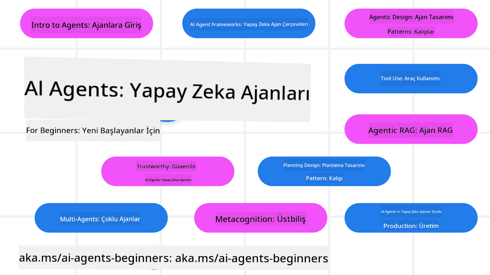

<!--
CO_OP_TRANSLATOR_METADATA:
{
  "original_hash": "6b07046397366e6f6f4524c9ddeba1e1",
  "translation_date": "2025-07-12T14:50:53+00:00",
  "source_file": "README.md",
  "language_code": "tr"
}
-->
# Yeni Başlayanlar için AI Ajanları - Bir Kurs

## AI Ajanları geliştirmeye başlamak için bilmeniz gereken her şeyi öğreten 11 Ders

  
  
  
  

### 🌐 Çok Dilli Destek

#### GitHub Action ile desteklenmektedir (Otomatik ve Her Zaman Güncel)

[Fransızca](../fr/README.md) | [İspanyolca](../es/README.md) | [Almanca](../de/README.md) | [Rusça](../ru/README.md) | [Arapça](../ar/README.md) | [Farsça (Persian)](../fa/README.md) | [Urduca](../ur/README.md) | [Çince (Basitleştirilmiş)](../zh/README.md) | [Çince (Geleneksel, Makao)](../mo/README.md) | [Çince (Geleneksel, Hong Kong)](../hk/README.md) | [Çince (Geleneksel, Tayvan)](../tw/README.md) | [Japonca](../ja/README.md) | [Korece](../ko/README.md) | [Hintçe](../hi/README.md) | [Bengalce](../bn/README.md) | [Marathi](../mr/README.md) | [Nepalce](../ne/README.md) | [Pencapça (Gurmukhi)](../pa/README.md) | [Portekizce (Portekiz)](../pt/README.md) | [Portekizce (Brezilya)](../br/README.md) | [İtalyanca](../it/README.md) | [Lehçe](../pl/README.md) | [Türkçe](./README.md) | [Yunanca](../el/README.md) | [Tayca](../th/README.md) | [İsveççe](../sv/README.md) | [Danca](../da/README.md) | [Norveççe](../no/README.md) | [Fince](../fi/README.md) | [Flemenkçe](../nl/README.md) | [İbranice](../he/README.md) | [Vietnamca](../vi/README.md) | [Endonezce](../id/README.md) | [Malayca](../ms/README.md) | [Tagalog (Filipince)](../tl/README.md) | [Svahili](../sw/README.md) | [Macarca](../hu/README.md) | [Çekçe](../cs/README.md) | [Slovakça](../sk/README.md) | [Rumence](../ro/README.md) | [Bulgarca](../bg/README.md) | [Sırpça (Kiril)](../sr/README.md) | [Hırvatça](../hr/README.md) | [Slovence](../sl/README.md) | [Ukraynaca](../uk/README.md) | [Birmanca (Myanmar)](../my/README.md)

**Ek dil desteği isterseniz, desteklenen diller listesi [burada](https://github.com/Azure/co-op-translator/blob/main/getting_started/supported-languages.md) bulunabilir**

  
  

## 🌱 Başlarken

Bu kurs, AI Ajanları oluşturmanın temellerini kapsayan 11 dersten oluşmaktadır. Her ders kendi konusunu ele alır, istediğiniz yerden başlayabilirsiniz!

Bu kurs için çoklu dil desteği mevcuttur. Mevcut diller için [buraya](../..) bakabilirsiniz.

Eğer Üretken AI modelleri ile ilk kez çalışıyorsanız, 21 ders içeren [Yeni Başlayanlar için Üretken AI](https://aka.ms/genai-beginners) kursumuza göz atın.

Kodu çalıştırmak için bu depoyu [yıldızlamayı (🌟)](https://docs.github.com/en/get-started/exploring-projects-on-github/saving-repositories-with-stars?WT.mc_id=academic-105485-koreyst) ve [çatallamayı](https://github.com/microsoft/ai-agents-for-beginners/fork) unutmayın.

### İhtiyacınız Olanlar

Bu kurstaki her ders, code_samples klasöründe bulunan kod örneklerini içerir. Kendi kopyanızı oluşturmak için [bu depoyu çatallayabilirsiniz](https://github.com/microsoft/ai-agents-for-beginners/fork).

Bu egzersizlerdeki kod örnekleri, Dil Modelleri ile etkileşim için Azure AI Foundry ve GitHub Model Kataloglarını kullanır:

- [Github Modelleri](https://aka.ms/ai-agents-beginners/github-models) - Ücretsiz / Sınırlı  
- [Azure AI Foundry](https://aka.ms/ai-agents-beginners/ai-foundry) - Azure Hesabı Gereklidir

Bu kurs ayrıca Microsoft’un aşağıdaki AI Ajan çerçevelerini ve servislerini kullanır:

- [Azure AI Agent Service](https://aka.ms/ai-agents-beginners/ai-agent-service)  
- [Semantic Kernel](https://aka.ms/ai-agents-beginners/semantic-kernel)  
- [AutoGen](https://aka.ms/ai-agents/autogen)

Kursun kodlarını çalıştırmak için daha fazla bilgiye [Course Setup](./00-course-setup/README.md) sayfasından ulaşabilirsiniz.

## 🙏 Yardım etmek ister misiniz?

Önerileriniz veya yazım ya da kod hataları bulduysanız, [bir issue açın](https://github.com/microsoft/ai-agents-for-beginners/issues?WT.mc_id=academic-105485-koreyst) veya [pull request oluşturun](https://github.com/microsoft/ai-agents-for-beginners/pulls?WT.mc_id=academic-105485-koreyst).

AI Ajanları geliştirme konusunda takılırsanız veya sorularınız olursa, [Azure AI Foundry Community Discord](https://discord.gg/kzRShWzttr) kanalımıza katılabilirsiniz.

Ürün geri bildirimi veya geliştirme sırasında karşılaştığınız hatalar için [Azure AI Foundry Developer Forum](https://aka.ms/azureaifoundry/forum) adresini ziyaret edin.

## 📂 Her ders şunları içerir

- README dosyasında yazılı ders ve kısa bir video  
- Azure AI Foundry ve Github Modellerini destekleyen Python kod örnekleri (Ücretsiz)  
- Öğrenmeye devam etmeniz için ek kaynak bağlantıları

## 🗃️ Dersler

| **Ders**                                | **Metin & Kod**                                     | **Video**                                                  | **Ek Öğrenme**                                                                         |
|----------------------------------------|----------------------------------------------------|------------------------------------------------------------|----------------------------------------------------------------------------------------|
| AI Ajanlarına Giriş ve Ajan Kullanım Alanları | [Link](./01-intro-to-ai-agents/README.md)          | [Video](https://youtu.be/3zgm60bXmQk?si=z8QygFvYQv-9WtO1)  | [Link](https://aka.ms/ai-agents-beginners/collection?WT.mc_id=academic-105485-koreyst) |
| AI Ajanik Çerçeveleri Keşfetmek        | [Link](./02-explore-agentic-frameworks/README.md)  | [Video](https://youtu.be/ODwF-EZo_O8?si=Vawth4hzVaHv-u0H)  | [Link](https://aka.ms/ai-agents-beginners/collection?WT.mc_id=academic-105485-koreyst) |
| AI Ajanik Tasarım Kalıplarını Anlamak | [Link](./03-agentic-design-patterns/README.md)     | [Video](https://youtu.be/m9lM8qqoOEA?si=BIzHwzstTPL8o9GF)  | [Link](https://aka.ms/ai-agents-beginners/collection?WT.mc_id=academic-105485-koreyst) |
| Araç Kullanım Tasarım Kalıbı           | [Link](./04-tool-use/README.md)                    | [Video](https://youtu.be/vieRiPRx-gI?si=2z6O2Xu2cu_Jz46N)  | [Link](https://aka.ms/ai-agents-beginners/collection?WT.mc_id=academic-105485-koreyst) |
| Ajanik RAG                            | [Link](./05-agentic-rag/README.md)                 | [Video](https://youtu.be/WcjAARvdL7I?si=gKPWsQpKiIlDH9A3)  | [Link](https://aka.ms/ai-agents-beginners/collection?WT.mc_id=academic-105485-koreyst) |
| Güvenilir AI Ajanları İnşa Etmek       | [Link](./06-building-trustworthy-agents/README.md) | [Video](https://youtu.be/iZKkMEGBCUQ?si=jZjpiMnGFOE9L8OK ) | [Link](https://aka.ms/ai-agents-beginners/collection?WT.mc_id=academic-105485-koreyst) |
| Planlama Tasarım Kalıbı                | [Link](./07-planning-design/README.md)             | [Video](https://youtu.be/kPfJ2BrBCMY?si=6SC_iv_E5-mzucnC)  | [Link](https://aka.ms/ai-agents-beginners/collection?WT.mc_id=academic-105485-koreyst) |
| Çoklu Ajan Tasarım Kalıbı              | [Link](./08-multi-agent/README.md)                 | [Video](https://youtu.be/V6HpE9hZEx0?si=rMgDhEu7wXo2uo6g)  | [Link](https://aka.ms/ai-agents-beginners/collection?WT.mc_id=academic-105485-koreyst) |
| Metakognisyon Tasarım Kalıbı           | [Link](./09-metacognition/README.md)               | [Video](https://youtu.be/His9R6gw6Ec?si=8gck6vvdSNCt6OcF)  | [Link](https://aka.ms/ai-agents-beginners/collection?WT.mc_id=academic-105485-koreyst) |
| Üretimde AI Ajanları                   | [Link](./10-ai-agents-production/README.md)        | [Video](https://youtu.be/l4TP6IyJxmQ?si=31dnhexRo6yLRJDl)  | [Link](https://aka.ms/ai-agents-beginners/collection?WT.mc_id=academic-105485-koreyst) |
| MCP ile AI Ajanları                    | [Link](./11-mcp/README.md)                         |                                                            | [Link](https://aka.ms/mcp-for-beginners)                                               |

## 🎒 Diğer Kurslar

Ekibimiz başka kurslar da üretiyor! Göz atın:
- [**YENİ** Model Context Protocol (MCP) Yeni Başlayanlar İçin](https://github.com/microsoft/mcp-for-beginners?WT.mc_id=academic-105485-koreyst)
- [.NET Kullanarak Yeni Başlayanlar İçin Üretken AI](https://github.com/microsoft/Generative-AI-for-beginners-dotnet?WT.mc_id=academic-105485-koreyst)
- [Yeni Başlayanlar İçin Üretken AI](https://github.com/microsoft/generative-ai-for-beginners?WT.mc_id=academic-105485-koreyst)
- [Yeni Başlayanlar İçin ML](https://aka.ms/ml-beginners?WT.mc_id=academic-105485-koreyst)
- [Yeni Başlayanlar İçin Veri Bilimi](https://aka.ms/datascience-beginners?WT.mc_id=academic-105485-koreyst)
- [Yeni Başlayanlar İçin AI](https://aka.ms/ai-beginners?WT.mc_id=academic-105485-koreyst)
- [Yeni Başlayanlar İçin Siber Güvenlik](https://github.com/microsoft/Security-101??WT.mc_id=academic-96948-sayoung)
- [Yeni Başlayanlar İçin Web Geliştirme](https://aka.ms/webdev-beginners?WT.mc_id=academic-105485-koreyst)
- [Yeni Başlayanlar İçin IoT](https://aka.ms/iot-beginners?WT.mc_id=academic-105485-koreyst)
- [Yeni Başlayanlar İçin XR Geliştirme](https://github.com/microsoft/xr-development-for-beginners?WT.mc_id=academic-105485-koreyst)
- [AI Eşli Programlama İçin GitHub Copilot’u Ustalaştırma](https://aka.ms/GitHubCopilotAI?WT.mc_id=academic-105485-koreyst)
- [C#/.NET Geliştiricileri İçin GitHub Copilot’u Ustalaştırma](https://github.com/microsoft/mastering-github-copilot-for-dotnet-csharp-developers?WT.mc_id=academic-105485-koreyst)
- [Kendi Copilot Maceranı Seç](https://github.com/microsoft/CopilotAdventures?WT.mc_id=academic-105485-koreyst)

## 🌟 Topluluk Teşekkürü

Agentic RAG’i gösteren önemli kod örnekleri için [Shivam Goyal](https://www.linkedin.com/in/shivam2003/)'a teşekkür ederiz.

## Katkıda Bulunma

Bu proje katkı ve önerilere açıktır. Çoğu katkı için, katkınızı kullanma hakkını size ait olduğunu ve gerçekten bu hakkı bize verdiğinizi beyan eden bir
Contributor License Agreement (CLA) kabul etmeniz gerekir. Detaylar için 
<https://cla.opensource.microsoft.com>'u ziyaret edin.

Bir pull request gönderdiğinizde, bir CLA botu otomatik olarak CLA sağlamanız gerekip gerekmediğini belirler ve PR’ı uygun şekilde işaretler (örneğin, durum kontrolü, yorum). Botun verdiği talimatları takip etmeniz yeterlidir. CLA’yı kullanan tüm depolarda bunu sadece bir kez yapmanız gerekir.

Bu proje [Microsoft Açık Kaynak Davranış Kuralları](https://opensource.microsoft.com/codeofconduct/)’nı benimsemiştir.
Daha fazla bilgi için [Davranış Kuralları SSS](https://opensource.microsoft.com/codeofconduct/faq/) sayfasına bakabilir veya
ek sorularınız ya da yorumlarınız için [opencode@microsoft.com](mailto:opencode@microsoft.com) adresiyle iletişime geçebilirsiniz.

## Ticari Markalar

Bu proje, projeler, ürünler veya hizmetler için ticari markalar veya logolar içerebilir. Microsoft ticari markalarının veya logolarının yetkili kullanımı,
[Microsoft’un Ticari Marka ve Marka Kılavuzları](https://www.microsoft.com/legal/intellectualproperty/trademarks/usage/general)’na tabidir ve bu kurallara uyulmalıdır.
Bu projenin değiştirilmiş sürümlerinde Microsoft ticari markalarının veya logolarının kullanımı karışıklığa yol açmamalı veya Microsoft sponsorluğunu ima etmemelidir.
Üçüncü taraf ticari markalarının veya logolarının kullanımı ise ilgili üçüncü tarafların politikalarına tabidir.

**Feragatname**:  
Bu belge, AI çeviri servisi [Co-op Translator](https://github.com/Azure/co-op-translator) kullanılarak çevrilmiştir. Doğruluk için çaba göstersek de, otomatik çevirilerin hatalar veya yanlışlıklar içerebileceğini lütfen unutmayınız. Orijinal belge, kendi dilinde yetkili kaynak olarak kabul edilmelidir. Kritik bilgiler için profesyonel insan çevirisi önerilir. Bu çevirinin kullanımı sonucu oluşabilecek yanlış anlamalar veya yorum hatalarından sorumlu değiliz.