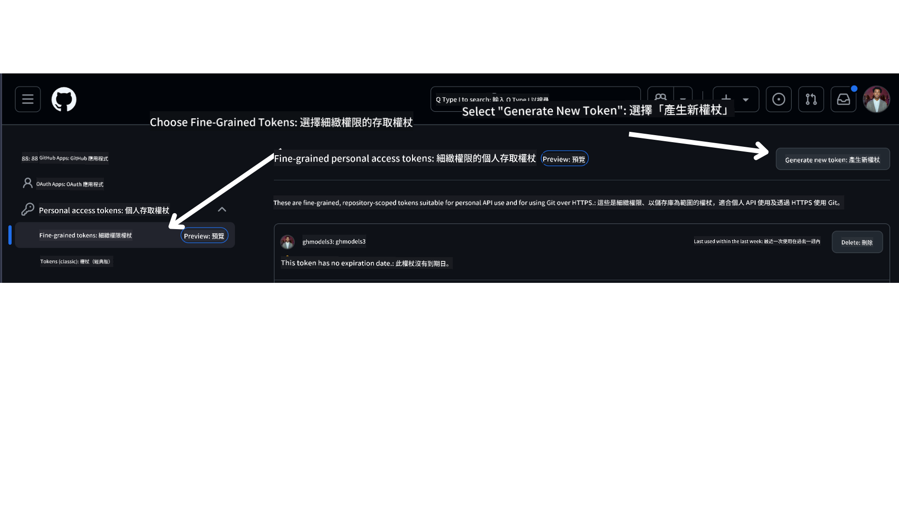
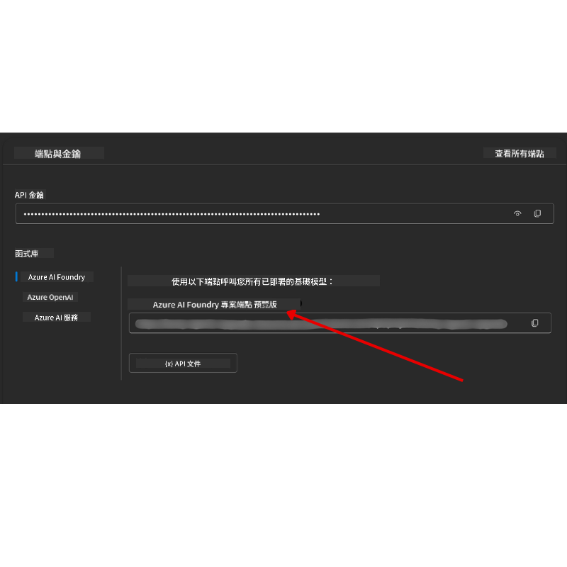

<!--
CO_OP_TRANSLATOR_METADATA:
{
  "original_hash": "76945069b52a49cd0432ae3e0b0ba22e",
  "translation_date": "2025-07-12T07:45:52+00:00",
  "source_file": "00-course-setup/README.md",
  "language_code": "tw"
}
-->
在您的 GitHub 帳戶中。

在畫面左側選擇 `Fine-grained tokens` 選項。

接著選擇 `Generate new token`。



系統會提示您輸入此 token 的名稱，選擇過期日期（建議：30 天），並選擇 token 的權限範圍（Public Repositories）。

同時，您需要編輯此 token 的權限：Permissions -> Models -> 允許存取 GitHub Models。

複製您剛剛建立的新 token，接著將它加入本課程附帶的 `.env` 檔案中。

### 步驟 2：建立您的 `.env` 檔案

在終端機中執行以下指令來建立 `.env` 檔案。

```bash
cp .env.example .env
```

此指令會複製範例檔案並在您的目錄中建立 `.env`，您可以在其中填入環境變數的值。

複製好 token 後，使用您喜愛的文字編輯器打開 `.env` 檔案，並將 token 貼到 `GITHUB_TOKEN` 欄位。

現在您應該可以執行本課程的程式碼範例了。

## 使用 Azure AI Foundry 和 Azure AI Agent Service 的範例設定

### 步驟 1：取得您的 Azure 專案端點

請依照此處說明建立 Azure AI Foundry 的 hub 和專案：[Hub resources overview](https://learn.microsoft.com/en-us/azure/ai-foundry/concepts/ai-resources)

建立專案後，您需要取得專案的連接字串。

可在 Azure AI Foundry 入口網站中，前往專案的 **Overview** 頁面取得。



### 步驟 2：建立您的 `.env` 檔案

在終端機中執行以下指令來建立 `.env` 檔案。

```bash
cp .env.example .env
```

此指令會複製範例檔案並在您的目錄中建立 `.env`，您可以在其中填入環境變數的值。

複製好連接字串後，使用您喜愛的文字編輯器打開 `.env` 檔案，並將連接字串貼到 `PROJECT_ENDPOINT` 欄位。

### 步驟 3：登入 Azure

作為安全最佳實踐，我們將使用 [無金鑰認證](https://learn.microsoft.com/azure/developer/ai/keyless-connections?tabs=csharp%2Cazure-cli?WT.mc_id=academic-105485-koreyst) 透過 Microsoft Entra ID 來驗證 Azure OpenAI。您需要先依照您的作業系統，安裝 **Azure CLI**，詳細安裝說明請參考 [安裝指引](https://learn.microsoft.com/cli/azure/install-azure-cli?WT.mc_id=academic-105485-koreyst)。

接著，打開終端機並執行 `az login --use-device-code` 以登入您的 Azure 帳戶。

登入後，在終端機中選擇您的訂閱。

## 額外環境變數 - Azure Search 與 Azure OpenAI

在 Agentic RAG 課程（第 5 課）中，有使用 Azure Search 與 Azure OpenAI 的範例。

若您想執行這些範例，需將以下環境變數加入您的 `.env` 檔案：

### 專案總覽頁面

- `AZURE_SUBSCRIPTION_ID` - 在專案的 **Overview** 頁面中查看 **Project details**。

- `AZURE_AI_PROJECT_NAME` - 在專案 **Overview** 頁面頂端查看。

- `AZURE_OPENAI_SERVICE` - 在 **Overview** 頁面的 **Included capabilities** 標籤中找到 **Azure OpenAI Service**。

### 管理中心

- `AZURE_OPENAI_RESOURCE_GROUP` - 在 **Management Center** 的 **Overview** 頁面中查看 **Project properties**。

- `GLOBAL_LLM_SERVICE` - 在 **Connected resources** 中找到 **Azure AI Services** 連線名稱。若未列出，請至 Azure 入口網站中您的資源群組查看 AI Services 資源名稱。

### 模型與端點頁面

- `AZURE_OPENAI_EMBEDDING_DEPLOYMENT_NAME` - 選擇您的嵌入模型（例如 `text-embedding-ada-002`），並記下模型詳細資訊中的 **Deployment name**。

- `AZURE_OPENAI_CHAT_DEPLOYMENT_NAME` - 選擇您的聊天模型（例如 `gpt-4o-mini`），並記下模型詳細資訊中的 **Deployment name**。

### Azure 入口網站

- `AZURE_OPENAI_ENDPOINT` - 找到 **Azure AI services**，點擊後前往 **Resource Management** -> **Keys and Endpoint**，向下捲動至「Azure OpenAI endpoints」，複製標示為「Language APIs」的端點。

- `AZURE_OPENAI_API_KEY` - 同一頁面複製 KEY 1 或 KEY 2。

- `AZURE_SEARCH_SERVICE_ENDPOINT` - 找到您的 **Azure AI Search** 資源，點擊後查看 **Overview**。

- `AZURE_SEARCH_API_KEY` - 前往 **Settings** -> **Keys**，複製主要或次要管理金鑰。

### 外部網頁

- `AZURE_OPENAI_API_VERSION` - 參考 [API 版本生命週期](https://learn.microsoft.com/en-us/azure/ai-services/openai/api-version-deprecation#latest-ga-api-release) 頁面中的 **Latest GA API release**。

### 設定無金鑰認證

為避免硬編碼您的憑證，我們將使用 Azure OpenAI 的無金鑰連線。為此，我們會匯入 `DefaultAzureCredential`，並在稍後呼叫 `DefaultAzureCredential` 函式以取得憑證。

```python
from azure.identity import DefaultAzureCredential, InteractiveBrowserCredential
```

## 卡關了嗎？

如果您在設定過程中遇到任何問題，歡迎加入我們的

或

。

## 下一課

您現在已準備好執行本課程的程式碼。祝您在 AI Agents 的世界中學習愉快！

[AI Agents 介紹與應用案例](../01-intro-to-ai-agents/README.md)

**免責聲明**：  
本文件係使用 AI 翻譯服務 [Co-op Translator](https://github.com/Azure/co-op-translator) 進行翻譯。雖然我們力求準確，但請注意，自動翻譯可能包含錯誤或不準確之處。原始文件的母語版本應視為權威來源。對於重要資訊，建議採用專業人工翻譯。我們不對因使用本翻譯而產生的任何誤解或誤譯負責。