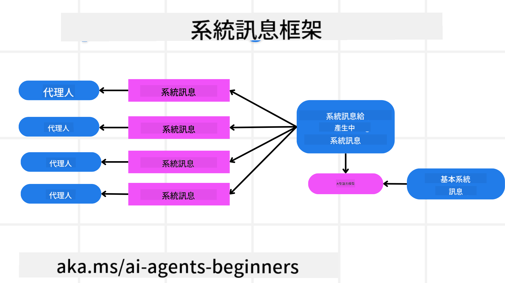
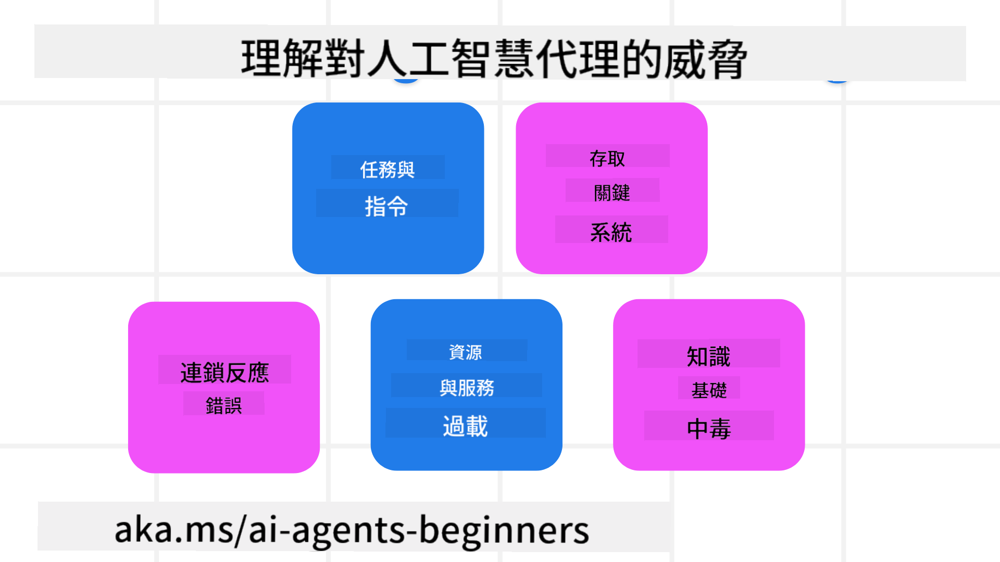
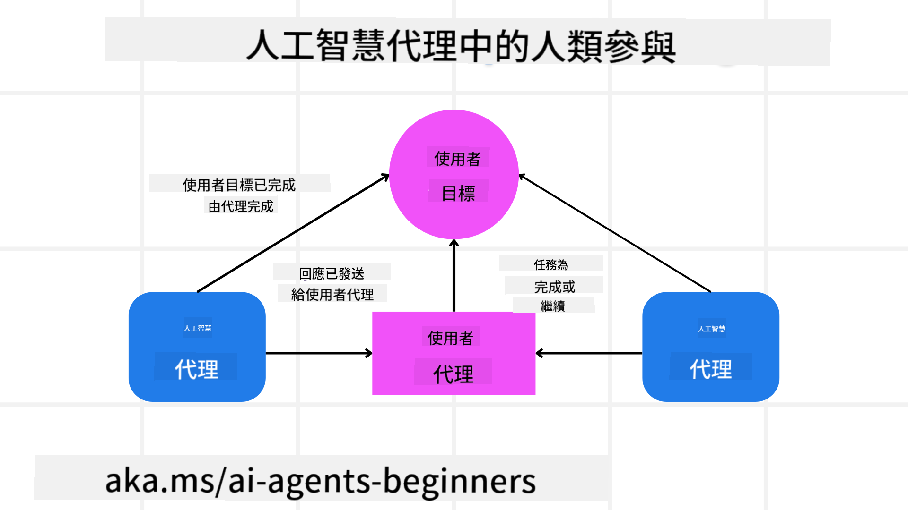

<!--
CO_OP_TRANSLATOR_METADATA:
{
  "original_hash": "498802b4c3c3cc486b86f27a12cebb34",
  "translation_date": "2025-08-28T09:19:07+00:00",
  "source_file": "06-building-trustworthy-agents/README.md",
  "language_code": "tw"
}
-->
[](https://youtu.be/iZKkMEGBCUQ?si=Q-kEbcyHUMPoHp8L)

> _(點擊上方圖片觀看本課程影片)_

# 建立可信的 AI 代理

## 簡介

本課程將涵蓋：

- 如何建立並部署安全且有效的 AI 代理。
- 開發 AI 代理時的重要安全考量。
- 如何在開發 AI 代理時維護數據和用戶隱私。

## 學習目標

完成本課程後，您將能夠：

- 識別並減輕創建 AI 代理時的風險。
- 實施安全措施以確保數據和訪問權限得到妥善管理。
- 創建能維護數據隱私並提供高品質用戶體驗的 AI 代理。

## 安全性

首先，我們來探討如何建立安全的代理應用程式。安全性意味著 AI 代理能按照設計執行。作為代理應用程式的開發者，我們有方法和工具來最大化安全性：

### 建立系統訊息框架

如果您曾使用大型語言模型 (LLMs) 建立 AI 應用程式，您會知道設計一個穩健的系統提示或系統訊息的重要性。這些提示建立了 LLM 與用戶和數據互動的元規則、指令和指導方針。

對於 AI 代理來說，系統提示更為重要，因為 AI 代理需要非常具體的指令來完成我們為其設計的任務。

為了創建可擴展的系統提示，我們可以使用系統訊息框架來為應用程式中的一個或多個代理建立提示：



#### 步驟 1：創建元系統訊息

元提示將由 LLM 用於生成我們創建的代理的系統提示。我們將其設計為模板，以便在需要時高效地創建多個代理。

以下是一個我們會提供給 LLM 的元系統訊息範例：

```plaintext
You are an expert at creating AI agent assistants. 
You will be provided a company name, role, responsibilities and other
information that you will use to provide a system prompt for.
To create the system prompt, be descriptive as possible and provide a structure that a system using an LLM can better understand the role and responsibilities of the AI assistant. 
```

#### 步驟 2：創建基本提示

下一步是創建一個基本提示來描述 AI 代理。您應該包括代理的角色、代理將完成的任務以及代理的其他責任。

以下是一個範例：

```plaintext
You are a travel agent for Contoso Travel that is great at booking flights for customers. To help customers you can perform the following tasks: lookup available flights, book flights, ask for preferences in seating and times for flights, cancel any previously booked flights and alert customers on any delays or cancellations of flights.  
```

#### 步驟 3：向 LLM 提供基本系統訊息

現在，我們可以通過將元系統訊息作為系統訊息，並添加我們的基本系統訊息來優化這個系統訊息。

這將生成一個更適合指導我們 AI 代理的系統訊息：

```markdown
**Company Name:** Contoso Travel  
**Role:** Travel Agent Assistant

**Objective:**  
You are an AI-powered travel agent assistant for Contoso Travel, specializing in booking flights and providing exceptional customer service. Your main goal is to assist customers in finding, booking, and managing their flights, all while ensuring that their preferences and needs are met efficiently.

**Key Responsibilities:**

1. **Flight Lookup:**
    
    - Assist customers in searching for available flights based on their specified destination, dates, and any other relevant preferences.
    - Provide a list of options, including flight times, airlines, layovers, and pricing.
2. **Flight Booking:**
    
    - Facilitate the booking of flights for customers, ensuring that all details are correctly entered into the system.
    - Confirm bookings and provide customers with their itinerary, including confirmation numbers and any other pertinent information.
3. **Customer Preference Inquiry:**
    
    - Actively ask customers for their preferences regarding seating (e.g., aisle, window, extra legroom) and preferred times for flights (e.g., morning, afternoon, evening).
    - Record these preferences for future reference and tailor suggestions accordingly.
4. **Flight Cancellation:**
    
    - Assist customers in canceling previously booked flights if needed, following company policies and procedures.
    - Notify customers of any necessary refunds or additional steps that may be required for cancellations.
5. **Flight Monitoring:**
    
    - Monitor the status of booked flights and alert customers in real-time about any delays, cancellations, or changes to their flight schedule.
    - Provide updates through preferred communication channels (e.g., email, SMS) as needed.

**Tone and Style:**

- Maintain a friendly, professional, and approachable demeanor in all interactions with customers.
- Ensure that all communication is clear, informative, and tailored to the customer's specific needs and inquiries.

**User Interaction Instructions:**

- Respond to customer queries promptly and accurately.
- Use a conversational style while ensuring professionalism.
- Prioritize customer satisfaction by being attentive, empathetic, and proactive in all assistance provided.

**Additional Notes:**

- Stay updated on any changes to airline policies, travel restrictions, and other relevant information that could impact flight bookings and customer experience.
- Use clear and concise language to explain options and processes, avoiding jargon where possible for better customer understanding.

This AI assistant is designed to streamline the flight booking process for customers of Contoso Travel, ensuring that all their travel needs are met efficiently and effectively.

```

#### 步驟 4：迭代與改進

這個系統訊息框架的價值在於能夠更輕鬆地為多個代理創建系統訊息，並隨著時間的推移改進您的系統訊息。很少有系統訊息能在第一次就完全適用於您的使用案例。通過更改基本系統訊息並運行它來進行小幅調整和改進，您可以比較和評估結果。

## 理解威脅

為了建立可信的 AI 代理，理解並減輕對 AI 代理的風險和威脅至關重要。讓我們來看看一些常見的威脅以及如何更好地計劃和應對它們。



### 任務與指令

**描述：** 攻擊者試圖通過提示或操縱輸入來更改 AI 代理的指令或目標。

**緩解措施：** 執行驗證檢查和輸入過濾器，以在 AI 代理處理之前檢測潛在的危險提示。由於這些攻擊通常需要與代理頻繁互動，限制對話輪次也是防止此類攻擊的一種方法。

### 訪問關鍵系統

**描述：** 如果 AI 代理能訪問存儲敏感數據的系統和服務，攻擊者可能會破壞代理與這些服務之間的通信。這些可能是直接攻擊，也可能是通過代理獲取這些系統信息的間接嘗試。

**緩解措施：** AI 代理應僅在需要時訪問系統，以防止此類攻擊。代理與系統之間的通信也應保持安全。實施身份驗證和訪問控制是保護此類信息的另一種方法。

### 資源與服務過載

**描述：** AI 代理可以訪問不同的工具和服務來完成任務。攻擊者可能利用這一點，通過 AI 代理向這些服務發送大量請求，導致系統故障或高昂的成本。

**緩解措施：** 實施政策限制 AI 代理對服務的請求數量。限制與 AI 代理的對話輪次和請求數量也是防止此類攻擊的一種方法。

### 知識庫污染

**描述：** 此類攻擊並不直接針對 AI 代理，而是針對代理將使用的知識庫和其他服務。這可能涉及破壞代理用於完成任務的數據或信息，導致對用戶的回應出現偏差或意外結果。

**緩解措施：** 定期驗證 AI 代理將在工作流程中使用的數據。確保對此數據的訪問是安全的，並且僅由可信任的人員更改，以避免此類攻擊。

### 錯誤連鎖

**描述：** AI 代理訪問各種工具和服務來完成任務。由攻擊者引發的錯誤可能導致其他系統的故障，進而使攻擊範圍擴大且更難排查。

**緩解措施：** 一種避免此問題的方法是讓 AI 代理在受限環境中運行，例如在 Docker 容器中執行任務，以防止直接系統攻擊。當某些系統回應錯誤時，創建回退機制和重試邏輯也是防止更大系統故障的方法之一。

## 人類介入

另一種建立可信 AI 代理系統的有效方法是引入人類介入。這創建了一個流程，允許用戶在代理運行過程中提供反饋。用戶本質上充當多代理系統中的代理，通過批准或終止運行過程來參與。



以下是一段使用 AutoGen 展示此概念實現的程式碼範例：

```python

# Create the agents.
model_client = OpenAIChatCompletionClient(model="gpt-4o-mini")
assistant = AssistantAgent("assistant", model_client=model_client)
user_proxy = UserProxyAgent("user_proxy", input_func=input)  # Use input() to get user input from console.

# Create the termination condition which will end the conversation when the user says "APPROVE".
termination = TextMentionTermination("APPROVE")

# Create the team.
team = RoundRobinGroupChat([assistant, user_proxy], termination_condition=termination)

# Run the conversation and stream to the console.
stream = team.run_stream(task="Write a 4-line poem about the ocean.")
# Use asyncio.run(...) when running in a script.
await Console(stream)

```

## 結論

建立可信的 AI 代理需要謹慎的設計、穩健的安全措施以及持續的迭代。通過實施結構化的元提示系統、理解潛在威脅並採取緩解策略，開發者可以創建既安全又有效的 AI 代理。此外，結合人類介入的方法，能確保 AI 代理與用戶需求保持一致，同時將風險降至最低。隨著 AI 的不斷發展，對安全性、隱私和倫理考量保持積極態度，將是促進 AI 驅動系統信任與可靠性的關鍵。

### 對建立可信 AI 代理有更多疑問？

加入 [Azure AI Foundry Discord](https://aka.ms/ai-agents/discord)，與其他學習者交流，參加辦公時間並解答您的 AI 代理相關問題。

## 其他資源

- <a href="https://learn.microsoft.com/azure/ai-studio/responsible-use-of-ai-overview" target="_blank">負責任 AI 概述</a>
- <a href="https://learn.microsoft.com/azure/ai-studio/concepts/evaluation-approach-gen-ai" target="_blank">生成式 AI 模型與應用的評估方法</a>
- <a href="https://learn.microsoft.com/azure/ai-services/openai/concepts/system-message?context=%2Fazure%2Fai-studio%2Fcontext%2Fcontext&tabs=top-techniques" target="_blank">安全系統訊息</a>
- <a href="https://blogs.microsoft.com/wp-content/uploads/prod/sites/5/2022/06/Microsoft-RAI-Impact-Assessment-Template.pdf?culture=en-us&country=us" target="_blank">風險評估模板</a>

## 上一課程

[Agentic RAG](../05-agentic-rag/README.md)

## 下一課程

[規劃設計模式](../07-planning-design/README.md)

---

**免責聲明**：  
本文件使用 AI 翻譯服務 [Co-op Translator](https://github.com/Azure/co-op-translator) 進行翻譯。我們致力於提供準確的翻譯，但請注意，自動翻譯可能包含錯誤或不準確之處。應以原始語言的文件作為權威來源。對於關鍵資訊，建議尋求專業人工翻譯。我們對因使用此翻譯而產生的任何誤解或錯誤解讀概不負責。