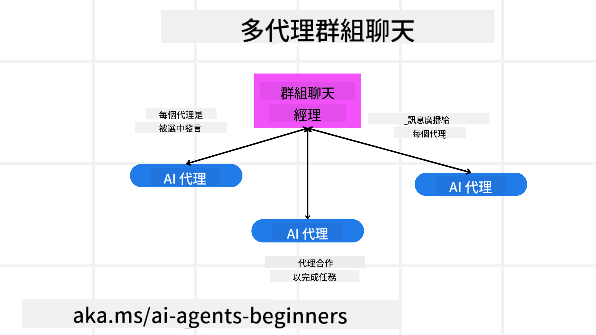
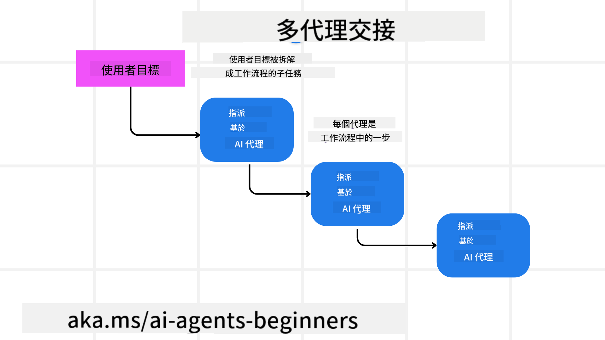

<!--
CO_OP_TRANSLATOR_METADATA:
{
  "original_hash": "1a008c204051cba8d0e253b75f261c41",
  "translation_date": "2025-08-28T09:18:21+00:00",
  "source_file": "08-multi-agent/README.md",
  "language_code": "tw"
}
-->

> _(點擊上方圖片觀看本課程的影片)_

# 多代理設計模式

當你開始處理涉及多個代理的專案時，就需要考慮多代理設計模式。然而，何時切換到多代理模式以及其優勢可能並不立即明顯。

## 簡介

在本課程中，我們將回答以下問題：

- 哪些情境適合使用多代理？
- 使用多代理相較於單一代理執行多項任務有何優勢？
- 實現多代理設計模式的基本構件是什麼？
- 我們如何掌握多個代理之間的互動情況？

## 學習目標

完成本課程後，你應該能夠：

- 辨識適合使用多代理的情境
- 認識使用多代理相較於單一代理的優勢
- 理解實現多代理設計模式的基本構件

更大的圖景是什麼？

*多代理是一種設計模式，允許多個代理協作以實現共同目標*。

這種模式廣泛應用於各種領域，包括機器人技術、自主系統和分散式計算。

## 適合使用多代理的情境

那麼，哪些情境適合使用多代理呢？答案是，有許多情境特別適合採用多代理，尤其是在以下情況：

- **大量工作負載**：大量工作負載可以被分解為較小的任務並分配給不同的代理，從而實現平行處理並加快完成速度。例如，大型數據處理任務。
- **複雜任務**：複雜任務可以像大量工作負載一樣被分解為較小的子任務，並分配給不同的代理，每個代理專注於任務的特定方面。例如，自主車輛中，不同的代理負責導航、障礙物檢測以及與其他車輛的通信。
- **多樣化專業知識**：不同的代理可以擁有多樣化的專業知識，使其能比單一代理更有效地處理任務的不同方面。例如，在醫療領域，代理可以負責診斷、治療計劃和病患監控。

## 使用多代理相較於單一代理的優勢

單一代理系統可能適合簡單任務，但對於更複雜的任務，使用多代理可以帶來多項優勢：

- **專業化**：每個代理可以專注於特定任務。單一代理缺乏專業化，可能在面對複雜任務時感到困惑。例如，它可能執行一項並非其最佳擅長的任務。
- **可擴展性**：通過增加更多代理來擴展系統比過度負載單一代理更容易。
- **容錯性**：如果一個代理失效，其他代理仍能繼續運作，確保系統的可靠性。

舉例來說，假設為用戶預訂一次旅行。單一代理系統需要處理旅行預訂過程的所有方面，從搜尋航班到預訂酒店和租車。為了實現這一點，單一代理需要具備處理所有這些任務的工具。這可能導致一個複雜且難以維護和擴展的單體系統。而多代理系統則可以有不同的代理專注於搜尋航班、預訂酒店和租車。這使得系統更加模組化、易於維護且可擴展。

這可以類比為一個家庭經營的旅行社與連鎖經營的旅行社的對比。家庭經營的旅行社由單一代理處理旅行預訂過程的所有方面，而連鎖經營的旅行社則有不同的代理負責不同的部分。

## 實現多代理設計模式的基本構件

在實現多代理設計模式之前，你需要了解構成該模式的基本構件。

讓我們再次以為用戶預訂旅行的例子來具體說明。在這種情況下，基本構件包括：

- **代理通信**：負責搜尋航班、預訂酒店和租車的代理需要進行通信並分享用戶的偏好和限制。你需要決定通信的協議和方法。具體來說，搜尋航班的代理需要與預訂酒店的代理通信，以確保酒店的預訂日期與航班一致。這意味著代理需要分享用戶的旅行日期，因此你需要決定*哪些代理共享資訊以及如何共享資訊*。
- **協調機制**：代理需要協調其行動，以確保滿足用戶的偏好和限制。例如，用戶可能偏好靠近機場的酒店，而限制可能是租車僅在機場提供。這意味著預訂酒店的代理需要與租車代理協調，以確保滿足用戶的偏好和限制。因此，你需要決定*代理如何協調其行動*。
- **代理架構**：代理需要具備內部結構來做出決策並從與用戶的互動中學習。例如，搜尋航班的代理需要具備內部結構來決定向用戶推薦哪些航班。因此，你需要決定*代理如何做出決策並從與用戶的互動中學習*。例如，搜尋航班的代理可以使用機器學習模型，根據用戶的過去偏好推薦航班。
- **多代理互動的可見性**：你需要掌握多個代理之間的互動情況。這意味著你需要有工具和技術來追蹤代理的活動和互動，例如日誌記錄和監控工具、可視化工具以及效能指標。
- **多代理模式**：有不同的模式可以用來實現多代理系統，例如集中式、分散式和混合式架構。你需要選擇最適合你的使用情境的模式。
- **人類介入**：在大多數情況下，你會有一個人類介入的環節，並需要指導代理何時尋求人類的干預。例如，用戶可能要求特定的酒店或航班，或者在預訂航班或酒店之前要求確認。

## 多代理互動的可見性

掌握多個代理之間的互動情況非常重要。這種可見性對於除錯、優化以及確保整體系統的效能至關重要。為了實現這一點，你需要有工具和技術來追蹤代理的活動和互動，例如日誌記錄和監控工具、可視化工具以及效能指標。

例如，在為用戶預訂旅行的情境中，你可以設置一個儀表板，顯示每個代理的狀態、用戶的偏好和限制，以及代理之間的互動。這個儀表板可以顯示用戶的旅行日期、航班代理推薦的航班、酒店代理推薦的酒店以及租車代理推薦的租車選項。這將使你清楚了解代理之間的互動情況，以及用戶的偏好和限制是否得到滿足。

讓我們更詳細地探討這些方面：

- **日誌記錄和監控工具**：你需要為每個代理的行動進行日誌記錄。一條日誌記錄可以包含執行行動的代理、執行的行動、執行行動的時間以及行動的結果。這些資訊可以用於除錯、優化等。
- **可視化工具**：可視化工具可以幫助你以更直觀的方式查看代理之間的互動。例如，你可以建立一個圖表，顯示代理之間的資訊流動。這可以幫助你識別系統中的瓶頸、低效問題等。
- **效能指標**：效能指標可以幫助你追蹤多代理系統的效能。例如，你可以追蹤完成任務所需的時間、每單位時間完成的任務數量，以及代理推薦的準確性。這些資訊可以幫助你識別改進的空間並優化系統。

## 多代理模式

讓我們深入探討一些可以用來創建多代理應用的具體模式。以下是一些值得考慮的有趣模式：

### 群組聊天

此模式適用於需要創建一個群組聊天應用的情境，讓多個代理可以彼此通信。典型的使用情境包括團隊協作、客戶支持和社交網絡。

在此模式中，每個代理代表群組聊天中的一個用戶，並通過消息協議交換消息。代理可以向群組聊天發送消息、接收來自群組聊天的消息，並回應其他代理的消息。

此模式可以通過集中式架構（所有消息通過中央伺服器路由）或分散式架構（消息直接交換）來實現。

### 任務交接

此模式適用於需要創建一個應用，讓多個代理可以彼此交接任務的情境。

典型的使用情境包括客戶支持、任務管理和工作流程自動化。

在此模式中，每個代理代表一個任務或工作流程中的一個步驟，代理可以根據預定規則將任務交接給其他代理。

### 協作過濾

此模式適用於需要創建一個應用，讓多個代理可以協作向用戶提供推薦的情境。

為什麼需要多個代理協作？因為每個代理可以擁有不同的專業知識，並以不同的方式為推薦過程做出貢獻。

舉例來說，假設用戶希望獲得有關購買股票的推薦：

- **行業專家**：一個代理可以是某個特定行業的專家。
- **技術分析**：另一個代理可以是技術分析的專家。
- **基本面分析**：還有一個代理可以是基本面分析的專家。通過協作，這些代理可以為用戶提供更全面的推薦。

## 情境：退款流程

考慮一個情境，客戶試圖為某產品申請退款，這個過程中可能涉及許多代理，但我們可以將其分為專屬於此流程的代理和可用於其他流程的通用代理。

**專屬於退款流程的代理**：

以下是一些可能參與退款流程的代理：

- **客戶代理**：代表客戶，負責啟動退款流程。
- **賣家代理**：代表賣家，負責處理退款。
- **支付代理**：代表支付流程，負責退還客戶的款項。
- **解決代理**：代表解決流程，負責解決退款過程中出現的任何問題。
- **合規代理**：代表合規流程，負責確保退款流程符合規範和政策。

**通用代理**：

這些代理可以用於業務的其他部分。

- **運輸代理**：代表運輸流程，負責將產品退回給賣家。此代理既可用於退款流程，也可用於一般的產品運輸。
- **反饋代理**：代表反饋流程，負責收集客戶的反饋。反饋可以在任何時候進行，而不僅限於退款流程。
- **升級代理**：代表升級流程，負責將問題升級到更高層級的支持。此類代理可用於任何需要升級問題的流程。
- **通知代理**：代表通知流程，負責在退款流程的各個階段向客戶發送通知。
- **分析代理**：代表分析流程，負責分析與退款流程相關的數據。
- **審計代理**：代表審計流程，負責審核退款流程以確保其正確執行。
- **報告代理**：代表報告流程，負責生成有關退款流程的報告。
- **知識代理**：代表知識流程，負責維護與退款流程相關的知識庫。此代理可以同時了解退款和業務的其他部分。
- **安全代理**：代表安全流程，負責確保退款流程的安全性。
- **質量代理**：代表質量流程，負責確保退款流程的質量。

以上列出了許多代理，既包括專屬於退款流程的代理，也包括可用於業務其他部分的通用代理。希望這能幫助你了解如何決定在多代理系統中使用哪些代理。

## 作業
設計一個多代理系統來處理客戶支援流程。識別流程中涉及的代理、它們的角色與職責，以及它們之間如何互動。同時考慮專門針對客戶支援流程的代理以及可用於業務其他部分的一般代理。

> 在閱讀以下解決方案之前，先思考一下，您可能需要的代理比您想像的更多。

> TIP: 想想客戶支援流程的不同階段，還有系統中可能需要的代理。

## 解決方案

[解決方案](./solution/solution.md)

## 知識檢查

問題：什麼時候應該考慮使用多代理？

- [ ] A1: 當工作量小且任務簡單時。
- [ ] A2: 當工作量大時。
- [ ] A3: 當任務簡單時。

[解決方案測驗](./solution/solution-quiz.md)

## 總結

在本課中，我們探討了多代理設計模式，包括多代理適用的場景、使用多代理相較於單一代理的優勢、實現多代理設計模式的構建模塊，以及如何了解多個代理之間的互動情況。

### 對多代理設計模式有更多疑問嗎？

加入 [Azure AI Foundry Discord](https://aka.ms/ai-agents/discord)，與其他學習者交流，參加辦公時間，並解答您對 AI 代理的疑問。

## 其他資源

- ## 上一課

[規劃設計](../07-planning-design/README.md)

## 下一課

[AI 代理的元認知](../09-metacognition/README.md)

---

**免責聲明**：  
本文件已使用 AI 翻譯服務 [Co-op Translator](https://github.com/Azure/co-op-translator) 進行翻譯。我們致力於提供準確的翻譯，但請注意，自動翻譯可能包含錯誤或不準確之處。應以原始語言的文件作為權威來源。對於關鍵資訊，建議尋求專業人工翻譯。我們對因使用此翻譯而產生的任何誤解或錯誤解讀概不負責。