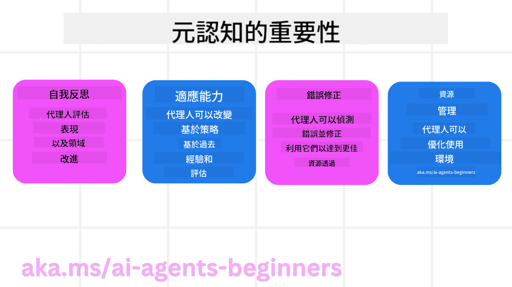
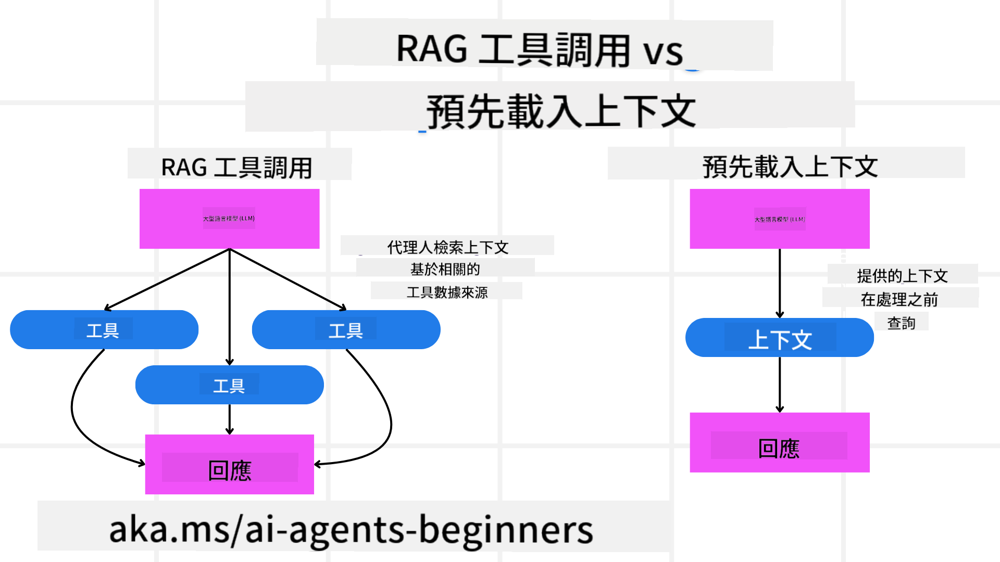

<!--
CO_OP_TRANSLATOR_METADATA:
{
  "original_hash": "5f0deef171fc3a68d5d3d770a8bfb03d",
  "translation_date": "2025-08-28T09:14:19+00:00",
  "source_file": "09-metacognition/README.md",
  "language_code": "tw"
}
-->
[](https://youtu.be/His9R6gw6Ec?si=3_RMb8VprNvdLRhX)

> _(點擊上方圖片觀看本課程的影片)_
# AI代理的後設認知

## 簡介

歡迎來到AI代理後設認知的課程！本章節專為對AI代理如何思考自身思維過程感到好奇的初學者設計。完成本課程後，您將理解關鍵概念，並掌握應用後設認知於AI代理設計中的實用範例。

## 學習目標

完成本課程後，您將能夠：

1. 理解代理定義中推理循環的影響。
2. 使用規劃與評估技術來幫助代理自我修正。
3. 創建能夠操作程式碼以完成任務的代理。

## 後設認知簡介

後設認知是指涉及思考自身思維的高階認知過程。對於AI代理而言，這意味著能夠根據自我意識和過去經驗來評估和調整其行動。後設認知，或稱「思考思維」，是開發具代理性AI系統的重要概念。它涉及AI系統對自身內部過程的認識，並能夠監控、調節和適應其行為。就像我們在觀察環境或解決問題時所做的一樣。這種自我意識能幫助AI系統做出更好的決策、識別錯誤，並隨著時間推進提升其性能——這再次與圖靈測試以及AI是否會接管的辯論相關。

在代理性AI系統的背景下，後設認知能幫助解決多種挑戰，例如：
- 透明性：確保AI系統能解釋其推理和決策。
- 推理能力：增強AI系統綜合資訊並做出合理決策的能力。
- 適應性：使AI系統能適應新環境和變化的條件。
- 感知能力：提升AI系統從環境中識別和解釋數據的準確性。

### 什麼是後設認知？

後設認知，或稱「思考思維」，是一種高階認知過程，涉及對自身認知過程的自我意識與自我調節。在AI領域，後設認知賦予代理評估和調整其策略與行動的能力，從而提升問題解決與決策能力。透過理解後設認知，您可以設計出更智能、更具適應性且更高效的AI代理。在真正的後設認知中，您會看到AI明確地對其自身推理進行推理。

範例：「我優先選擇了便宜的航班，因為……我可能錯過了直飛航班，所以讓我重新檢查一下。」
記錄它如何或為何選擇了某條路徑。
- 注意到它犯錯是因為過度依賴上次的用戶偏好，因此它不僅修改最終建議，還調整了其決策策略。
- 診斷模式，例如：「每當我看到用戶提到‘太擁擠’，我不僅應該移除某些景點，還應反思如果我總是按受歡迎程度排序，那麼我的‘熱門景點’選擇方法就是有缺陷的。」

### 後設認知在AI代理中的重要性

後設認知在AI代理設計中扮演著至關重要的角色，原因如下：



- 自我反思：代理可以評估自身表現並找出需要改進的地方。
- 適應性：代理可以根據過去經驗和變化的環境調整其策略。
- 錯誤修正：代理可以自主檢測並修正錯誤，從而產生更準確的結果。
- 資源管理：代理可以通過規劃和評估行動來優化資源使用，例如時間和計算能力。

## AI代理的組成部分

在深入探討後設認知過程之前，了解AI代理的基本組成部分是必要的。AI代理通常由以下部分組成：

- 人格：代理的個性和特徵，定義了它如何與用戶互動。
- 工具：代理可以執行的功能和能力。
- 技能：代理擁有的知識和專業能力。

這些組成部分共同構成了一個「專業單元」，能執行特定任務。

**範例**：
考慮一個旅遊代理服務，它不僅能規劃您的假期，還能根據實時數據和過去的客戶旅程經驗調整路徑。

### 範例：旅遊代理服務中的後設認知

假設您正在設計一個由AI驅動的旅遊代理服務。這個代理「旅遊代理」幫助用戶規劃假期。為了融入後設認知，旅遊代理需要根據自我意識和過去經驗來評估和調整其行動。以下是後設認知可能發揮作用的方式：

#### 當前任務

當前任務是幫助用戶規劃巴黎之旅。

#### 完成任務的步驟

1. **收集用戶偏好**：詢問用戶關於旅行日期、預算、興趣（如博物館、美食、購物）以及任何具體需求。
2. **檢索資訊**：搜索符合用戶偏好的航班選項、住宿、景點和餐廳。
3. **生成建議**：提供包含航班詳情、酒店預訂和建議活動的個性化行程。
4. **根據反饋調整**：詢問用戶對建議的反饋並進行必要的調整。

#### 所需資源

- 訪問航班和酒店預訂數據庫。
- 關於巴黎景點和餐廳的資訊。
- 來自先前互動的用戶反饋數據。

#### 經驗與自我反思

旅遊代理利用後設認知來評估其表現並從過去經驗中學習。例如：

1. **分析用戶反饋**：旅遊代理審查用戶反饋，以確定哪些建議受到好評，哪些不受歡迎，並相應地調整其未來建議。
2. **適應性**：如果用戶之前提到不喜歡擁擠的地方，旅遊代理將避免在未來推薦高峰時段的熱門旅遊景點。
3. **錯誤修正**：如果旅遊代理在過去的預訂中出現錯誤，例如建議了一家已滿房的酒店，它會學習在提出建議之前更嚴格地檢查可用性。

#### 實用開發者範例

以下是一個簡化的旅遊代理程式碼範例，展示如何融入後設認知：

```python
class Travel_Agent:
    def __init__(self):
        self.user_preferences = {}
        self.experience_data = []

    def gather_preferences(self, preferences):
        self.user_preferences = preferences

    def retrieve_information(self):
        # Search for flights, hotels, and attractions based on preferences
        flights = search_flights(self.user_preferences)
        hotels = search_hotels(self.user_preferences)
        attractions = search_attractions(self.user_preferences)
        return flights, hotels, attractions

    def generate_recommendations(self):
        flights, hotels, attractions = self.retrieve_information()
        itinerary = create_itinerary(flights, hotels, attractions)
        return itinerary

    def adjust_based_on_feedback(self, feedback):
        self.experience_data.append(feedback)
        # Analyze feedback and adjust future recommendations
        self.user_preferences = adjust_preferences(self.user_preferences, feedback)

# Example usage
travel_agent = Travel_Agent()
preferences = {
    "destination": "Paris",
    "dates": "2025-04-01 to 2025-04-10",
    "budget": "moderate",
    "interests": ["museums", "cuisine"]
}
travel_agent.gather_preferences(preferences)
itinerary = travel_agent.generate_recommendations()
print("Suggested Itinerary:", itinerary)
feedback = {"liked": ["Louvre Museum"], "disliked": ["Eiffel Tower (too crowded)"]}
travel_agent.adjust_based_on_feedback(feedback)
```

#### 為什麼後設認知很重要

- **自我反思**：代理可以分析其表現並找出需要改進的地方。
- **適應性**：代理可以根據反饋和變化的條件調整策略。
- **錯誤修正**：代理可以自主檢測並修正錯誤。
- **資源管理**：代理可以優化資源使用，例如時間和計算能力。

通過融入後設認知，旅遊代理可以提供更個性化且準確的旅遊建議，提升整體用戶體驗。

---

## 2. 代理中的規劃

規劃是AI代理行為中的關鍵組成部分。它涉及明確目標、考慮當前狀態、資源和可能的障礙，並制定完成目標的步驟。

### 規劃的要素

- **當前任務**：清楚地定義任務。
- **完成任務的步驟**：將任務分解為可管理的步驟。
- **所需資源**：確定必要的資源。
- **經驗**：利用過去的經驗來指導規劃。

**範例**：
以下是旅遊代理需要採取的步驟，以有效地幫助用戶規劃旅行：

### 旅遊代理的步驟

1. **收集用戶偏好**
   - 詢問用戶有關旅行日期、預算、興趣和任何具體需求的詳細資訊。
   - 範例：「您計劃什麼時候旅行？」、「您的預算範圍是多少？」、「您在假期中喜歡哪些活動？」

2. **檢索資訊**
   - 根據用戶偏好搜索相關的旅行選項。
   - **航班**：查找符合用戶預算和偏好的航班。
   - **住宿**：尋找符合用戶對地點、價格和設施偏好的酒店或租賃房。
   - **景點和餐廳**：識別符合用戶興趣的熱門景點、活動和餐飲選擇。

3. **生成建議**
   - 將檢索到的資訊編譯成個性化行程。
   - 提供航班選項、酒店預訂和建議活動的詳細資訊，確保建議符合用戶偏好。

4. **向用戶展示行程**
   - 與用戶分享建議的行程以供審查。
   - 範例：「這是您巴黎之旅的建議行程，包括航班詳情、酒店預訂以及推薦的活動和餐廳。請告訴我您的想法！」

5. **收集反饋**
   - 詢問用戶對建議行程的反饋。
   - 範例：「您喜歡這些航班選項嗎？」、「這家酒店是否符合您的需求？」、「有沒有您想添加或刪除的活動？」

6. **根據反饋調整**
   - 根據用戶反饋修改行程。
   - 對航班、住宿和活動建議進行必要的更改，以更好地符合用戶偏好。

7. **最終確認**
   - 向用戶展示更新後的行程以供最終確認。
   - 範例：「我根據您的反饋進行了調整。這是更新後的行程。看起來一切都符合您的需求嗎？」

8. **預訂並確認預約**
   - 在用戶批准行程後，進行航班、住宿和任何預先計劃活動的預訂。
   - 向用戶發送確認詳情。

9. **提供持續支持**
   - 在旅行前和旅行期間隨時為用戶提供幫助。
   - 範例：「如果您在旅行期間需要任何進一步的幫助，隨時與我聯繫！」

### 範例互動

```python
class Travel_Agent:
    def __init__(self):
        self.user_preferences = {}
        self.experience_data = []

    def gather_preferences(self, preferences):
        self.user_preferences = preferences

    def retrieve_information(self):
        flights = search_flights(self.user_preferences)
        hotels = search_hotels(self.user_preferences)
        attractions = search_attractions(self.user_preferences)
        return flights, hotels, attractions

    def generate_recommendations(self):
        flights, hotels, attractions = self.retrieve_information()
        itinerary = create_itinerary(flights, hotels, attractions)
        return itinerary

    def adjust_based_on_feedback(self, feedback):
        self.experience_data.append(feedback)
        self.user_preferences = adjust_preferences(self.user_preferences, feedback)

# Example usage within a booing request
travel_agent = Travel_Agent()
preferences = {
    "destination": "Paris",
    "dates": "2025-04-01 to 2025-04-10",
    "budget": "moderate",
    "interests": ["museums", "cuisine"]
}
travel_agent.gather_preferences(preferences)
itinerary = travel_agent.generate_recommendations()
print("Suggested Itinerary:", itinerary)
feedback = {"liked": ["Louvre Museum"], "disliked": ["Eiffel Tower (too crowded)"]}
travel_agent.adjust_based_on_feedback(feedback)
```

## 3. 修正型RAG系統

首先，讓我們了解RAG工具與預先上下文加載的區別。



### 檢索增強生成（RAG）

RAG將檢索系統與生成模型結合。當提出查詢時，檢索系統從外部來源獲取相關文件或數據，這些檢索到的資訊用於增強生成模型的輸入。這有助於模型生成更準確且上下文相關的回應。

在RAG系統中，代理從知識庫中檢索相關資訊，並利用這些資訊生成適當的回應或行動。

### 修正型RAG方法

修正型RAG方法專注於使用RAG技術來修正錯誤並提升AI代理的準確性。這包括：

1. **提示技術**：使用特定提示來引導代理檢索相關資訊。
2. **工具**：實施算法和機制，使代理能夠評估檢索資訊的相關性並生成準確的回應。
3. **評估**：持續評估代理的表現，並進行調整以提升其準確性和效率。

#### 範例：搜索代理中的修正型RAG

考慮一個從網路檢索資訊以回答用戶查詢的搜索代理。修正型RAG方法可能包括：

1. **提示技術**：根據用戶輸入制定搜索查詢。
2. **工具**：使用自然語言處理和機器學習算法對搜索結果進行排序和篩選。
3. **評估**：分析用戶反饋以識別並修正檢索資訊中的不準確之處。

### 修正型RAG在旅遊代理中的應用

修正型RAG（檢索增強生成）提升了AI檢索和生成資訊的能力，同時修正任何不準確之處。讓我們看看旅遊代理如何利用修正型RAG方法提供更準確且相關的旅遊建議。

這包括：

- **提示技術**：使用特定提示來引導代理檢索相關資訊。
- **工具**：實施算法和機制，使代理能夠評估檢索資訊的相關性並生成準確的回應。
- **評估**：持續評估代理的表現，並進行調整以提升其準確性和效率。

#### 在旅遊代理中實施修正型RAG的步驟

1. **初始用戶互動**
   - 旅遊代理收集用戶的初始偏好，例如目的地、旅行日期、預算和興趣。
   - 範例：

     ```python
     preferences = {
         "destination": "Paris",
         "dates": "2025-04-01 to 2025-04-10",
         "budget": "moderate",
         "interests": ["museums", "cuisine"]
     }
     ```

2. **資訊檢索**
   - 旅遊代理根據用戶偏好檢索有關航班、住宿、景點和餐廳的資訊。
   - 範例：

     ```python
     flights = search_flights(preferences)
     hotels = search_hotels(preferences)
     attractions = search_attractions(preferences)
     ```

3. **生成初步建議**
   - 旅遊代理利用檢索到的資訊生成個性化行程。
   - 範例：

     ```python
     itinerary = create_itinerary(flights, hotels, attractions)
     print("Suggested Itinerary:", itinerary)
     ```

4. **收集用戶反饋**
   - 旅遊代理詢問用戶對初步建議的反饋。
   - 範例：

     ```python
     feedback = {
         "liked": ["Louvre Museum"],
         "disliked": ["Eiffel Tower (too crowded)"]
     }
     ```

5. **修正型RAG過程**
   - **提示技術**：旅遊代理根據用戶反饋制定新的搜索查詢。
     - 範例：

       ```python
       if "disliked" in feedback:
           preferences["avoid"] = feedback["disliked"]
       ```

   - **工具**：旅遊代理使用算法對新的搜索結果進行排序和篩選，強調基於用戶反饋的相關性。
     - 範例：

       ```python
       new_attractions = search_attractions(preferences)
       new_itinerary = create_itinerary(flights, hotels, new_attractions)
       print("Updated Itinerary:", new_itinerary)
       ```

   - **評估**：旅遊代理通過分析用戶反饋持續評估建議的相關性和準確性，並進行必要的調整。
     - 範例：

       ```python
       def adjust_preferences(preferences, feedback):
           if "liked" in feedback:
               preferences["favorites"] = feedback["liked"]
           if "disliked" in feedback:
               preferences["avoid"] = feedback["disliked"]
           return preferences

       preferences = adjust_preferences(preferences, feedback)
       ```

#### 實用範例

以下是一個簡化的Python程式碼範例，展示如何在旅遊代理中融入修正型RAG方法：
```python
class Travel_Agent:
    def __init__(self):
        self.user_preferences = {}
        self.experience_data = []

    def gather_preferences(self, preferences):
        self.user_preferences = preferences

    def retrieve_information(self):
        flights = search_flights(self.user_preferences)
        hotels = search_hotels(self.user_preferences)
        attractions = search_attractions(self.user_preferences)
        return flights, hotels, attractions

    def generate_recommendations(self):
        flights, hotels, attractions = self.retrieve_information()
        itinerary = create_itinerary(flights, hotels, attractions)
        return itinerary

    def adjust_based_on_feedback(self, feedback):
        self.experience_data.append(feedback)
        self.user_preferences = adjust_preferences(self.user_preferences, feedback)
        new_itinerary = self.generate_recommendations()
        return new_itinerary

# Example usage
travel_agent = Travel_Agent()
preferences = {
    "destination": "Paris",
    "dates": "2025-04-01 to 2025-04-10",
    "budget": "moderate",
    "interests": ["museums", "cuisine"]
}
travel_agent.gather_preferences(preferences)
itinerary = travel_agent.generate_recommendations()
print("Suggested Itinerary:", itinerary)
feedback = {"liked": ["Louvre Museum"], "disliked": ["Eiffel Tower (too crowded)"]}
new_itinerary = travel_agent.adjust_based_on_feedback(feedback)
print("Updated Itinerary:", new_itinerary)
```

### 預先載入上下文

預先載入上下文指的是在處理查詢之前，先將相關的上下文或背景資訊載入模型。這意味著模型從一開始就能夠存取這些資訊，從而幫助它生成更具資訊性的回應，而無需在過程中額外檢索資料。

以下是一個簡化的範例，展示如何在 Python 中為旅行代理應用程式進行預先載入上下文：

```python
class TravelAgent:
    def __init__(self):
        # Pre-load popular destinations and their information
        self.context = {
            "Paris": {"country": "France", "currency": "Euro", "language": "French", "attractions": ["Eiffel Tower", "Louvre Museum"]},
            "Tokyo": {"country": "Japan", "currency": "Yen", "language": "Japanese", "attractions": ["Tokyo Tower", "Shibuya Crossing"]},
            "New York": {"country": "USA", "currency": "Dollar", "language": "English", "attractions": ["Statue of Liberty", "Times Square"]},
            "Sydney": {"country": "Australia", "currency": "Dollar", "language": "English", "attractions": ["Sydney Opera House", "Bondi Beach"]}
        }

    def get_destination_info(self, destination):
        # Fetch destination information from pre-loaded context
        info = self.context.get(destination)
        if info:
            return f"{destination}:\nCountry: {info['country']}\nCurrency: {info['currency']}\nLanguage: {info['language']}\nAttractions: {', '.join(info['attractions'])}"
        else:
            return f"Sorry, we don't have information on {destination}."

# Example usage
travel_agent = TravelAgent()
print(travel_agent.get_destination_info("Paris"))
print(travel_agent.get_destination_info("Tokyo"))
```

#### 說明

1. **初始化（`__init__` 方法）**：`TravelAgent` 類別預先載入了一個字典，包含有關熱門目的地（如巴黎、東京、紐約和雪梨）的資訊。這個字典包括每個目的地的國家、貨幣、語言以及主要景點等詳細資料。

2. **檢索資訊（`get_destination_info` 方法）**：當使用者查詢特定目的地時，`get_destination_info` 方法會從預載的上下文字典中提取相關資訊。

透過預先載入上下文，旅行代理應用程式可以快速回應使用者查詢，而無需即時從外部來源檢索資訊。這使得應用程式更加高效且反應迅速。

### 在迭代前以目標啟動計劃

以目標啟動計劃指的是在開始時就設定明確的目標或期望結果。透過事先定義這個目標，模型可以在整個迭代過程中以此作為指導原則。這有助於確保每次迭代都更接近達成期望結果，使過程更加高效且專注。

以下是一個範例，展示如何在 Python 中為旅行代理應用程式在迭代前以目標啟動旅行計劃：

### 情境

旅行代理希望為客戶規劃一個量身定制的假期。目標是根據客戶的偏好和預算，創建一個能最大化客戶滿意度的旅行行程。

### 步驟

1. 定義客戶的偏好和預算。
2. 根據這些偏好啟動初始計劃。
3. 迭代以優化計劃，提升客戶的滿意度。

#### Python 程式碼

```python
class TravelAgent:
    def __init__(self, destinations):
        self.destinations = destinations

    def bootstrap_plan(self, preferences, budget):
        plan = []
        total_cost = 0

        for destination in self.destinations:
            if total_cost + destination['cost'] <= budget and self.match_preferences(destination, preferences):
                plan.append(destination)
                total_cost += destination['cost']

        return plan

    def match_preferences(self, destination, preferences):
        for key, value in preferences.items():
            if destination.get(key) != value:
                return False
        return True

    def iterate_plan(self, plan, preferences, budget):
        for i in range(len(plan)):
            for destination in self.destinations:
                if destination not in plan and self.match_preferences(destination, preferences) and self.calculate_cost(plan, destination) <= budget:
                    plan[i] = destination
                    break
        return plan

    def calculate_cost(self, plan, new_destination):
        return sum(destination['cost'] for destination in plan) + new_destination['cost']

# Example usage
destinations = [
    {"name": "Paris", "cost": 1000, "activity": "sightseeing"},
    {"name": "Tokyo", "cost": 1200, "activity": "shopping"},
    {"name": "New York", "cost": 900, "activity": "sightseeing"},
    {"name": "Sydney", "cost": 1100, "activity": "beach"},
]

preferences = {"activity": "sightseeing"}
budget = 2000

travel_agent = TravelAgent(destinations)
initial_plan = travel_agent.bootstrap_plan(preferences, budget)
print("Initial Plan:", initial_plan)

refined_plan = travel_agent.iterate_plan(initial_plan, preferences, budget)
print("Refined Plan:", refined_plan)
```

#### 程式碼說明

1. **初始化（`__init__` 方法）**：`TravelAgent` 類別初始化時包含一個潛在目的地的清單，每個目的地都有名稱、成本和活動類型等屬性。

2. **啟動計劃（`bootstrap_plan` 方法）**：此方法根據客戶的偏好和預算創建初始旅行計劃。它會遍歷目的地清單，並將符合客戶偏好且在預算範圍內的目的地加入計劃。

3. **匹配偏好（`match_preferences` 方法）**：此方法檢查某個目的地是否符合客戶的偏好。

4. **迭代計劃（`iterate_plan` 方法）**：此方法透過嘗試用更符合客戶偏好的目的地替換計劃中的每個目的地，來優化初始計劃，同時考慮預算限制。

5. **計算成本（`calculate_cost` 方法）**：此方法計算當前計劃的總成本，包括可能新增的目的地。

#### 使用範例

- **初始計劃**：旅行代理根據客戶對觀光的偏好和 $2000 的預算創建初始計劃。
- **優化計劃**：旅行代理迭代計劃，根據客戶的偏好和預算進行優化。

透過以明確目標（例如最大化客戶滿意度）啟動計劃並迭代以優化計劃，旅行代理可以為客戶創建量身定制且優化的旅行行程。這種方法確保旅行計劃從一開始就符合客戶的偏好和預算，並在每次迭代中持續改進。

### 利用 LLM 進行重新排序和評分

大型語言模型（LLM）可以用於重新排序和評分，透過評估檢索到的文件或生成的回應的相關性和品質來實現。以下是其工作原理：

**檢索**：初始檢索步驟根據查詢獲取一組候選文件或回應。

**重新排序**：LLM 評估這些候選項，根據其相關性和品質進行重新排序。此步驟確保最相關且高品質的資訊優先呈現。

**評分**：LLM 為每個候選項分配分數，反映其相關性和品質。這有助於選擇最佳的回應或文件提供給使用者。

透過利用 LLM 進行重新排序和評分，系統可以提供更準確且具上下文相關性的資訊，提升整體使用者體驗。

以下是一個範例，展示旅行代理如何使用大型語言模型（LLM）根據使用者偏好重新排序和評分旅行目的地的 Python 程式碼：

#### 情境 - 根據偏好旅行

旅行代理希望根據客戶的偏好推薦最佳旅行目的地。LLM 將幫助重新排序和評分目的地，以確保呈現最相關的選項。

#### 步驟：

1. 收集使用者偏好。
2. 檢索潛在旅行目的地清單。
3. 使用 LLM 根據使用者偏好重新排序和評分目的地。

以下是如何使用 Azure OpenAI Services 更新前述範例：

#### 要求

1. 您需要擁有 Azure 訂閱。
2. 建立 Azure OpenAI 資源並獲取您的 API 金鑰。

#### Python 程式碼範例

```python
import requests
import json

class TravelAgent:
    def __init__(self, destinations):
        self.destinations = destinations

    def get_recommendations(self, preferences, api_key, endpoint):
        # Generate a prompt for the Azure OpenAI
        prompt = self.generate_prompt(preferences)
        
        # Define headers and payload for the request
        headers = {
            'Content-Type': 'application/json',
            'Authorization': f'Bearer {api_key}'
        }
        payload = {
            "prompt": prompt,
            "max_tokens": 150,
            "temperature": 0.7
        }
        
        # Call the Azure OpenAI API to get the re-ranked and scored destinations
        response = requests.post(endpoint, headers=headers, json=payload)
        response_data = response.json()
        
        # Extract and return the recommendations
        recommendations = response_data['choices'][0]['text'].strip().split('\n')
        return recommendations

    def generate_prompt(self, preferences):
        prompt = "Here are the travel destinations ranked and scored based on the following user preferences:\n"
        for key, value in preferences.items():
            prompt += f"{key}: {value}\n"
        prompt += "\nDestinations:\n"
        for destination in self.destinations:
            prompt += f"- {destination['name']}: {destination['description']}\n"
        return prompt

# Example usage
destinations = [
    {"name": "Paris", "description": "City of lights, known for its art, fashion, and culture."},
    {"name": "Tokyo", "description": "Vibrant city, famous for its modernity and traditional temples."},
    {"name": "New York", "description": "The city that never sleeps, with iconic landmarks and diverse culture."},
    {"name": "Sydney", "description": "Beautiful harbour city, known for its opera house and stunning beaches."},
]

preferences = {"activity": "sightseeing", "culture": "diverse"}
api_key = 'your_azure_openai_api_key'
endpoint = 'https://your-endpoint.com/openai/deployments/your-deployment-name/completions?api-version=2022-12-01'

travel_agent = TravelAgent(destinations)
recommendations = travel_agent.get_recommendations(preferences, api_key, endpoint)
print("Recommended Destinations:")
for rec in recommendations:
    print(rec)
```

#### 程式碼說明 - 偏好推薦

1. **初始化**：`TravelAgent` 類別初始化時包含一個潛在旅行目的地的清單，每個目的地都有名稱和描述等屬性。

2. **獲取推薦（`get_recommendations` 方法）**：此方法根據使用者偏好生成 Azure OpenAI 服務的提示，並向 Azure OpenAI API 發送 HTTP POST 請求以獲取重新排序和評分的目的地。

3. **生成提示（`generate_prompt` 方法）**：此方法構建一個提示，包含使用者偏好和目的地清單。提示引導模型根據提供的偏好重新排序和評分目的地。

4. **API 呼叫**：使用 `requests` 庫向 Azure OpenAI API 端點發送 HTTP POST 請求。回應包含重新排序和評分的目的地。

5. **使用範例**：旅行代理收集使用者偏好（例如對觀光和多元文化的興趣），並使用 Azure OpenAI 服務獲取重新排序和評分的旅行目的地推薦。

請確保將 `your_azure_openai_api_key` 替換為您的實際 Azure OpenAI API 金鑰，並將 `https://your-endpoint.com/...` 替換為您的 Azure OpenAI 部署的實際端點 URL。

透過利用 LLM 進行重新排序和評分，旅行代理可以為客戶提供更個性化且相關的旅行推薦，提升整體體驗。

### RAG：提示技術與工具

檢索增強生成（RAG）既可以作為提示技術，也可以作為開發 AI 代理的工具。理解兩者的區別有助於您在專案中更有效地利用 RAG。

#### RAG 作為提示技術

**什麼是提示技術？**

- 作為提示技術，RAG 涉及制定特定的查詢或提示，以引導從大型語料庫或資料庫中檢索相關資訊。這些資訊隨後用於生成回應或執行操作。

**如何運作：**

1. **制定提示**：根據任務或使用者輸入創建結構良好的提示或查詢。
2. **檢索資訊**：使用提示從預先存在的知識庫或資料集中搜尋相關資料。
3. **生成回應**：結合檢索到的資訊與生成式 AI 模型，生成全面且連貫的回應。

**旅行代理中的範例**：

- 使用者輸入：「我想參觀巴黎的博物館。」
- 提示：「尋找巴黎的頂級博物館。」
- 檢索資訊：有關羅浮宮博物館、奧賽博物館等的詳細資料。
- 生成回應：「以下是巴黎的一些頂級博物館：羅浮宮博物館、奧賽博物館和龐畢度中心。」

#### RAG 作為工具

**什麼是工具？**

- 作為工具，RAG 是一個整合系統，能自動化檢索和生成過程，使開發者能更輕鬆地實現複雜的 AI 功能，而無需為每個查詢手動編寫提示。

**如何運作：**

1. **整合**：將 RAG 嵌入 AI 代理的架構中，使其能自動處理檢索和生成任務。
2. **自動化**：工具管理整個過程，從接收使用者輸入到生成最終回應，無需為每個步驟顯式提示。
3. **效率**：透過簡化檢索和生成過程，提升代理的性能，實現更快速且更準確的回應。

**旅行代理中的範例**：

- 使用者輸入：「我想參觀巴黎的博物館。」
- RAG 工具：自動檢索有關博物館的資訊並生成回應。
- 生成回應：「以下是巴黎的一些頂級博物館：羅浮宮博物館、奧賽博物館和龐畢度中心。」

### 比較

| **方面**              | **提示技術**                                              | **工具**                                                |
|------------------------|----------------------------------------------------------|---------------------------------------------------------|
| **手動 vs 自動化**    | 每個查詢需手動制定提示。                                  | 檢索和生成過程自動化。                                  |
| **控制**              | 提供更多檢索過程的控制。                                  | 簡化並自動化檢索和生成。                                |
| **靈活性**            | 可根據特定需求定制提示。                                  | 更適合大規模實施。                                      |
| **複雜性**            | 需要編寫和調整提示。                                      | 更容易嵌入 AI 代理的架構中。                            |

### 實際範例

**提示技術範例：**

```python
def search_museums_in_paris():
    prompt = "Find top museums in Paris"
    search_results = search_web(prompt)
    return search_results

museums = search_museums_in_paris()
print("Top Museums in Paris:", museums)
```

**工具範例：**

```python
class Travel_Agent:
    def __init__(self):
        self.rag_tool = RAGTool()

    def get_museums_in_paris(self):
        user_input = "I want to visit museums in Paris."
        response = self.rag_tool.retrieve_and_generate(user_input)
        return response

travel_agent = Travel_Agent()
museums = travel_agent.get_museums_in_paris()
print("Top Museums in Paris:", museums)
```

### 評估相關性

評估相關性是 AI 代理性能的重要方面。它確保代理檢索和生成的資訊對使用者而言是適當、準確且有用的。以下是如何評估 AI 代理的相關性，包括實際範例和技術。

#### 評估相關性的關鍵概念

1. **上下文意識**：
   - 代理必須理解使用者查詢的上下文，以檢索和生成相關資訊。
   - 範例：如果使用者詢問「巴黎的最佳餐廳」，代理應考慮使用者的偏好，例如菜系類型和預算。

2. **準確性**：
   - 代理提供的資訊應事實正確且最新。
   - 範例：推薦目前營業且評價良好的餐廳，而非過時或已關閉的選項。

3. **使用者意圖**：
   - 代理應推斷使用者查詢背後的意圖，以提供最相關的資訊。
   - 範例：如果使用者詢問「經濟型酒店」，代理應優先推薦價格實惠的選項。

4. **回饋循環**：
   - 持續收集和分析使用者回饋，有助於代理改進其相關性評估過程。
   - 範例：整合使用者對先前推薦的評分和回饋，以改進未來的回應。

#### 評估相關性的實際技術

1. **相關性評分**：
   - 根據與使用者查詢和偏好的匹配程度，為每個檢索項分配相關性分數。
   - 範例：

     ```python
     def relevance_score(item, query):
         score = 0
         if item['category'] in query['interests']:
             score += 1
         if item['price'] <= query['budget']:
             score += 1
         if item['location'] == query['destination']:
             score += 1
         return score
     ```

2. **篩選和排序**：
   - 篩選掉不相關的項目，並根據相關性分數對剩餘項目進行排序。
   - 範例：

     ```python
     def filter_and_rank(items, query):
         ranked_items = sorted(items, key=lambda item: relevance_score(item, query), reverse=True)
         return ranked_items[:10]  # Return top 10 relevant items
     ```

3. **自然語言處理（NLP）**：
   - 使用 NLP 技術理解使用者查詢並檢索相關資訊。
   - 範例：

     ```python
     def process_query(query):
         # Use NLP to extract key information from the user's query
         processed_query = nlp(query)
         return processed_query
     ```

4. **使用者回饋整合**：
   - 收集使用者對推薦的回饋，並用於調整未來的相關性評估。
   - 範例：

     ```python
     def adjust_based_on_feedback(feedback, items):
         for item in items:
             if item['name'] in feedback['liked']:
                 item['relevance'] += 1
             if item['name'] in feedback['disliked']:
                 item['relevance'] -= 1
         return items
     ```

#### 範例：旅行代理中的相關性評估

以下是一個實際範例，展示旅行代理如何評估旅行推薦的相關性：

```python
class Travel_Agent:
    def __init__(self):
        self.user_preferences = {}
        self.experience_data = []

    def gather_preferences(self, preferences):
        self.user_preferences = preferences

    def retrieve_information(self):
        flights = search_flights(self.user_preferences)
        hotels = search_hotels(self.user_preferences)
        attractions = search_attractions(self.user_preferences)
        return flights, hotels, attractions

    def generate_recommendations(self):
        flights, hotels, attractions = self.retrieve_information()
        ranked_hotels = self.filter_and_rank(hotels, self.user_preferences)
        itinerary = create_itinerary(flights, ranked_hotels, attractions)
        return itinerary

    def filter_and_rank(self, items, query):
        ranked_items = sorted(items, key=lambda item: self.relevance_score(item, query), reverse=True)
        return ranked_items[:10]  # Return top 10 relevant items

    def relevance_score(self, item, query):
        score = 0
        if item['category'] in query['interests']:
            score += 1
        if item['price'] <= query['budget']:
            score += 1
        if item['location'] == query['destination']:
            score += 1
        return score

    def adjust_based_on_feedback(self, feedback, items):
        for item in items:
            if item['name'] in feedback['liked']:
                item['relevance'] += 1
            if item['name'] in feedback['disliked']:
                item['relevance'] -= 1
        return items

# Example usage
travel_agent = Travel_Agent()
preferences = {
    "destination": "Paris",
    "dates": "2025-04-01 to 2025-04-10",
    "budget": "moderate",
    "interests": ["museums", "cuisine"]
}
travel_agent.gather_preferences(preferences)
itinerary = travel_agent.generate_recommendations()
print("Suggested Itinerary:", itinerary)
feedback = {"liked": ["Louvre Museum"], "disliked": ["Eiffel Tower (too crowded)"]}
updated_items = travel_agent.adjust_based_on_feedback(feedback, itinerary['hotels'])
print("Updated Itinerary with Feedback:", updated_items)
```

### 意圖導向的搜尋

意圖導向的搜尋涉及理解和解釋使用者查詢背後的目的或目標，以檢索和生成最相關且有用的資訊。這種方法超越了簡單的關鍵字匹配，專注於掌握使用者的實際需求和上下文。

#### 意圖導向的搜尋的關鍵概念

1. **理解使用者意圖**：
   - 使用者意圖可分為三種主要類型：資訊型、導航型和交易型。
     - **資訊型意圖**：使用者尋求有關某個主題的資訊（例如：「巴黎的最佳博物館有哪些？」）。
     - **導航型意圖**：使用者希望導航到特定網站或頁面（例如：「羅浮宮博物館官方網站」）。
     - **交易型意圖**：使用者希望執行交易，例如預訂航班或進行購買（例如：「預訂飛往巴黎的航班」）。

2. **上下文意識**：
   - 分析使用者查詢的上下文有助於準確識別其意圖。這包括考慮先前的互動、使用者偏好以及當前查詢的具體細節。

3. **自然語言處理（NLP）**：
   - 使用 NLP 技術理解和解釋使用者提供的自然語言查詢。這包括實體識別、情感分析和查詢解析等任務。

4. **個性化**：
   - 根據使用者的歷史、偏好和回饋進行個性化搜尋結果，提升檢索資訊的相關性。
#### 實際範例：在旅遊代理中以意圖進行搜尋

讓我們以旅遊代理為例，看看如何實現基於意圖的搜尋。

1. **收集使用者偏好**

   ```python
   class Travel_Agent:
       def __init__(self):
           self.user_preferences = {}

       def gather_preferences(self, preferences):
           self.user_preferences = preferences
   ```

2. **理解使用者意圖**

   ```python
   def identify_intent(query):
       if "book" in query or "purchase" in query:
           return "transactional"
       elif "website" in query or "official" in query:
           return "navigational"
       else:
           return "informational"
   ```

3. **情境感知**

   ```python
   def analyze_context(query, user_history):
       # Combine current query with user history to understand context
       context = {
           "current_query": query,
           "user_history": user_history
       }
       return context
   ```

4. **搜尋並個性化結果**

   ```python
   def search_with_intent(query, preferences, user_history):
       intent = identify_intent(query)
       context = analyze_context(query, user_history)
       if intent == "informational":
           search_results = search_information(query, preferences)
       elif intent == "navigational":
           search_results = search_navigation(query)
       elif intent == "transactional":
           search_results = search_transaction(query, preferences)
       personalized_results = personalize_results(search_results, user_history)
       return personalized_results

   def search_information(query, preferences):
       # Example search logic for informational intent
       results = search_web(f"best {preferences['interests']} in {preferences['destination']}")
       return results

   def search_navigation(query):
       # Example search logic for navigational intent
       results = search_web(query)
       return results

   def search_transaction(query, preferences):
       # Example search logic for transactional intent
       results = search_web(f"book {query} to {preferences['destination']}")
       return results

   def personalize_results(results, user_history):
       # Example personalization logic
       personalized = [result for result in results if result not in user_history]
       return personalized[:10]  # Return top 10 personalized results
   ```

5. **範例使用**

   ```python
   travel_agent = Travel_Agent()
   preferences = {
       "destination": "Paris",
       "interests": ["museums", "cuisine"]
   }
   travel_agent.gather_preferences(preferences)
   user_history = ["Louvre Museum website", "Book flight to Paris"]
   query = "best museums in Paris"
   results = search_with_intent(query, preferences, user_history)
   print("Search Results:", results)
   ```

---

## 4. 作為工具的程式碼生成

程式碼生成代理使用 AI 模型來撰寫和執行程式碼，解決複雜問題並自動化任務。

### 程式碼生成代理

程式碼生成代理利用生成式 AI 模型來撰寫和執行程式碼。這些代理可以解決複雜問題、自動化任務，並通過生成和執行多種程式語言的程式碼提供有價值的見解。

#### 實際應用

1. **自動化程式碼生成**：為特定任務生成程式碼片段，例如數據分析、網頁爬取或機器學習。
2. **SQL 作為 RAG**：使用 SQL 查詢從資料庫中檢索和操作數據。
3. **問題解決**：撰寫並執行程式碼以解決特定問題，例如優化算法或分析數據。

#### 範例：用於數據分析的程式碼生成代理

假設您正在設計一個程式碼生成代理。以下是其工作方式：

1. **任務**：分析數據集以識別趨勢和模式。
2. **步驟**：
   - 將數據集載入數據分析工具。
   - 生成 SQL 查詢以篩選和聚合數據。
   - 執行查詢並檢索結果。
   - 使用結果生成可視化和見解。
3. **所需資源**：訪問數據集、數據分析工具和 SQL 功能。
4. **經驗**：利用過去的分析結果來提高未來分析的準確性和相關性。

### 範例：用於旅遊代理的程式碼生成代理

在此範例中，我們將設計一個程式碼生成代理「旅遊代理」，通過生成和執行程式碼來協助使用者規劃旅行。該代理可以處理如獲取旅遊選項、篩選結果以及使用生成式 AI 編制行程等任務。

#### 程式碼生成代理概述

1. **收集使用者偏好**：收集使用者輸入，例如目的地、旅行日期、預算和興趣。
2. **生成程式碼以獲取數據**：生成程式碼片段以檢索有關航班、酒店和景點的數據。
3. **執行生成的程式碼**：運行生成的程式碼以獲取實時信息。
4. **生成行程**：將獲取的數據編制成個性化的旅行計劃。
5. **根據反饋進行調整**：接收使用者反饋，必要時重新生成程式碼以優化結果。

#### 分步實現

1. **收集使用者偏好**

   ```python
   class Travel_Agent:
       def __init__(self):
           self.user_preferences = {}

       def gather_preferences(self, preferences):
           self.user_preferences = preferences
   ```

2. **生成程式碼以獲取數據**

   ```python
   def generate_code_to_fetch_data(preferences):
       # Example: Generate code to search for flights based on user preferences
       code = f"""
       def search_flights():
           import requests
           response = requests.get('https://api.example.com/flights', params={preferences})
           return response.json()
       """
       return code

   def generate_code_to_fetch_hotels(preferences):
       # Example: Generate code to search for hotels
       code = f"""
       def search_hotels():
           import requests
           response = requests.get('https://api.example.com/hotels', params={preferences})
           return response.json()
       """
       return code
   ```

3. **執行生成的程式碼**

   ```python
   def execute_code(code):
       # Execute the generated code using exec
       exec(code)
       result = locals()
       return result

   travel_agent = Travel_Agent()
   preferences = {
       "destination": "Paris",
       "dates": "2025-04-01 to 2025-04-10",
       "budget": "moderate",
       "interests": ["museums", "cuisine"]
   }
   travel_agent.gather_preferences(preferences)
   
   flight_code = generate_code_to_fetch_data(preferences)
   hotel_code = generate_code_to_fetch_hotels(preferences)
   
   flights = execute_code(flight_code)
   hotels = execute_code(hotel_code)

   print("Flight Options:", flights)
   print("Hotel Options:", hotels)
   ```

4. **生成行程**

   ```python
   def generate_itinerary(flights, hotels, attractions):
       itinerary = {
           "flights": flights,
           "hotels": hotels,
           "attractions": attractions
       }
       return itinerary

   attractions = search_attractions(preferences)
   itinerary = generate_itinerary(flights, hotels, attractions)
   print("Suggested Itinerary:", itinerary)
   ```

5. **根據反饋進行調整**

   ```python
   def adjust_based_on_feedback(feedback, preferences):
       # Adjust preferences based on user feedback
       if "liked" in feedback:
           preferences["favorites"] = feedback["liked"]
       if "disliked" in feedback:
           preferences["avoid"] = feedback["disliked"]
       return preferences

   feedback = {"liked": ["Louvre Museum"], "disliked": ["Eiffel Tower (too crowded)"]}
   updated_preferences = adjust_based_on_feedback(feedback, preferences)
   
   # Regenerate and execute code with updated preferences
   updated_flight_code = generate_code_to_fetch_data(updated_preferences)
   updated_hotel_code = generate_code_to_fetch_hotels(updated_preferences)
   
   updated_flights = execute_code(updated_flight_code)
   updated_hotels = execute_code(updated_hotel_code)
   
   updated_itinerary = generate_itinerary(updated_flights, updated_hotels, attractions)
   print("Updated Itinerary:", updated_itinerary)
   ```

### 利用環境感知和推理

基於表格的結構可以通過利用環境感知和推理來增強查詢生成過程。

以下是一個範例：

1. **理解結構**：系統將理解表格的結構，並利用此信息來支持查詢生成。
2. **根據反饋進行調整**：系統將根據反饋調整使用者偏好，並推斷需要更新結構中的哪些字段。
3. **生成並執行查詢**：系統將生成並執行查詢，以根據新偏好獲取更新的航班和酒店數據。

以下是一個包含這些概念的更新 Python 程式碼範例：

```python
def adjust_based_on_feedback(feedback, preferences, schema):
    # Adjust preferences based on user feedback
    if "liked" in feedback:
        preferences["favorites"] = feedback["liked"]
    if "disliked" in feedback:
        preferences["avoid"] = feedback["disliked"]
    # Reasoning based on schema to adjust other related preferences
    for field in schema:
        if field in preferences:
            preferences[field] = adjust_based_on_environment(feedback, field, schema)
    return preferences

def adjust_based_on_environment(feedback, field, schema):
    # Custom logic to adjust preferences based on schema and feedback
    if field in feedback["liked"]:
        return schema[field]["positive_adjustment"]
    elif field in feedback["disliked"]:
        return schema[field]["negative_adjustment"]
    return schema[field]["default"]

def generate_code_to_fetch_data(preferences):
    # Generate code to fetch flight data based on updated preferences
    return f"fetch_flights(preferences={preferences})"

def generate_code_to_fetch_hotels(preferences):
    # Generate code to fetch hotel data based on updated preferences
    return f"fetch_hotels(preferences={preferences})"

def execute_code(code):
    # Simulate execution of code and return mock data
    return {"data": f"Executed: {code}"}

def generate_itinerary(flights, hotels, attractions):
    # Generate itinerary based on flights, hotels, and attractions
    return {"flights": flights, "hotels": hotels, "attractions": attractions}

# Example schema
schema = {
    "favorites": {"positive_adjustment": "increase", "negative_adjustment": "decrease", "default": "neutral"},
    "avoid": {"positive_adjustment": "decrease", "negative_adjustment": "increase", "default": "neutral"}
}

# Example usage
preferences = {"favorites": "sightseeing", "avoid": "crowded places"}
feedback = {"liked": ["Louvre Museum"], "disliked": ["Eiffel Tower (too crowded)"]}
updated_preferences = adjust_based_on_feedback(feedback, preferences, schema)

# Regenerate and execute code with updated preferences
updated_flight_code = generate_code_to_fetch_data(updated_preferences)
updated_hotel_code = generate_code_to_fetch_hotels(updated_preferences)

updated_flights = execute_code(updated_flight_code)
updated_hotels = execute_code(updated_hotel_code)

updated_itinerary = generate_itinerary(updated_flights, updated_hotels, feedback["liked"])
print("Updated Itinerary:", updated_itinerary)
```

#### 解釋 - 根據反饋進行預訂

1. **結構感知**：`schema` 字典定義了如何根據反饋調整偏好。它包括如 `favorites` 和 `avoid` 等字段及其對應的調整。
2. **調整偏好（`adjust_based_on_feedback` 方法）**：此方法根據使用者反饋和結構調整偏好。
3. **基於環境的調整（`adjust_based_on_environment` 方法）**：此方法根據結構和反饋自定義調整。
4. **生成並執行查詢**：系統生成程式碼以根據調整後的偏好獲取更新的航班和酒店數據，並模擬執行這些查詢。
5. **生成行程**：系統根據新的航班、酒店和景點數據創建更新的行程。

通過使系統具備環境感知能力並基於結構進行推理，它可以生成更準確和相關的查詢，從而提供更好的旅行建議和更個性化的使用者體驗。

### 使用 SQL 作為檢索增強生成（RAG）技術

SQL（結構化查詢語言）是一種與資料庫交互的強大工具。當作為檢索增強生成（RAG）方法的一部分使用時，SQL 可以從資料庫中檢索相關數據，以在 AI 代理中生成回應或執行操作。讓我們探討如何在旅遊代理的背景下使用 SQL 作為 RAG 技術。

#### 關鍵概念

1. **資料庫交互**：
   - 使用 SQL 查詢資料庫，檢索相關信息並操作數據。
   - 範例：從旅遊資料庫中獲取航班詳情、酒店信息和景點資料。

2. **與 RAG 的整合**：
   - 根據使用者輸入和偏好生成 SQL 查詢。
   - 使用檢索到的數據生成個性化建議或操作。

3. **動態查詢生成**：
   - AI 代理根據上下文和使用者需求生成動態 SQL 查詢。
   - 範例：自定義 SQL 查詢以根據預算、日期和興趣篩選結果。

#### 應用

- **自動化程式碼生成**：生成特定任務的程式碼片段。
- **SQL 作為 RAG**：使用 SQL 查詢操作數據。
- **問題解決**：撰寫並執行程式碼以解決問題。

**範例**：
一個數據分析代理：

1. **任務**：分析數據集以發現趨勢。
2. **步驟**：
   - 載入數據集。
   - 生成 SQL 查詢以篩選數據。
   - 執行查詢並檢索結果。
   - 生成可視化和見解。
3. **資源**：數據集訪問權限、SQL 功能。
4. **經驗**：利用過去的結果改進未來分析。

#### 實際範例：在旅遊代理中使用 SQL

1. **收集使用者偏好**

   ```python
   class Travel_Agent:
       def __init__(self):
           self.user_preferences = {}

       def gather_preferences(self, preferences):
           self.user_preferences = preferences
   ```

2. **生成 SQL 查詢**

   ```python
   def generate_sql_query(table, preferences):
       query = f"SELECT * FROM {table} WHERE "
       conditions = []
       for key, value in preferences.items():
           conditions.append(f"{key}='{value}'")
       query += " AND ".join(conditions)
       return query
   ```

3. **執行 SQL 查詢**

   ```python
   import sqlite3

   def execute_sql_query(query, database="travel.db"):
       connection = sqlite3.connect(database)
       cursor = connection.cursor()
       cursor.execute(query)
       results = cursor.fetchall()
       connection.close()
       return results
   ```

4. **生成建議**

   ```python
   def generate_recommendations(preferences):
       flight_query = generate_sql_query("flights", preferences)
       hotel_query = generate_sql_query("hotels", preferences)
       attraction_query = generate_sql_query("attractions", preferences)
       
       flights = execute_sql_query(flight_query)
       hotels = execute_sql_query(hotel_query)
       attractions = execute_sql_query(attraction_query)
       
       itinerary = {
           "flights": flights,
           "hotels": hotels,
           "attractions": attractions
       }
       return itinerary

   travel_agent = Travel_Agent()
   preferences = {
       "destination": "Paris",
       "dates": "2025-04-01 to 2025-04-10",
       "budget": "moderate",
       "interests": ["museums", "cuisine"]
   }
   travel_agent.gather_preferences(preferences)
   itinerary = generate_recommendations(preferences)
   print("Suggested Itinerary:", itinerary)
   ```

#### 範例 SQL 查詢

1. **航班查詢**

   ```sql
   SELECT * FROM flights WHERE destination='Paris' AND dates='2025-04-01 to 2025-04-10' AND budget='moderate';
   ```

2. **酒店查詢**

   ```sql
   SELECT * FROM hotels WHERE destination='Paris' AND budget='moderate';
   ```

3. **景點查詢**

   ```sql
   SELECT * FROM attractions WHERE destination='Paris' AND interests='museums, cuisine';
   ```

通過將 SQL 作為檢索增強生成（RAG）技術的一部分，像旅遊代理這樣的 AI 代理可以動態檢索並利用相關數據，提供準確且個性化的建議。

### 元認知的範例

為了展示元認知的實現，我們來創建一個簡單的代理，該代理在解決問題時「反思其決策過程」。在這個範例中，我們將構建一個系統，該代理試圖優化酒店選擇，但在做出錯誤或次優選擇時會評估自己的推理並調整策略。

我們將通過一個基本範例來模擬，代理根據價格和品質的組合選擇酒店，並在「反思」其決策後進行調整。

#### 如何體現元認知：

1. **初始決策**：代理將選擇最便宜的酒店，而不考慮品質的影響。
2. **反思與評估**：在初始選擇後，代理將檢查該酒店是否是一個「糟糕」的選擇，根據使用者反饋進行評估。如果發現酒店品質過低，它會反思其推理。
3. **調整策略**：代理根據反思調整策略，從「最便宜」切換到「最高品質」，從而在未來的迭代中改進其決策過程。

以下是一個範例：

```python
class HotelRecommendationAgent:
    def __init__(self):
        self.previous_choices = []  # Stores the hotels chosen previously
        self.corrected_choices = []  # Stores the corrected choices
        self.recommendation_strategies = ['cheapest', 'highest_quality']  # Available strategies

    def recommend_hotel(self, hotels, strategy):
        """
        Recommend a hotel based on the chosen strategy.
        The strategy can either be 'cheapest' or 'highest_quality'.
        """
        if strategy == 'cheapest':
            recommended = min(hotels, key=lambda x: x['price'])
        elif strategy == 'highest_quality':
            recommended = max(hotels, key=lambda x: x['quality'])
        else:
            recommended = None
        self.previous_choices.append((strategy, recommended))
        return recommended

    def reflect_on_choice(self):
        """
        Reflect on the last choice made and decide if the agent should adjust its strategy.
        The agent considers if the previous choice led to a poor outcome.
        """
        if not self.previous_choices:
            return "No choices made yet."

        last_choice_strategy, last_choice = self.previous_choices[-1]
        # Let's assume we have some user feedback that tells us whether the last choice was good or not
        user_feedback = self.get_user_feedback(last_choice)

        if user_feedback == "bad":
            # Adjust strategy if the previous choice was unsatisfactory
            new_strategy = 'highest_quality' if last_choice_strategy == 'cheapest' else 'cheapest'
            self.corrected_choices.append((new_strategy, last_choice))
            return f"Reflecting on choice. Adjusting strategy to {new_strategy}."
        else:
            return "The choice was good. No need to adjust."

    def get_user_feedback(self, hotel):
        """
        Simulate user feedback based on hotel attributes.
        For simplicity, assume if the hotel is too cheap, the feedback is "bad".
        If the hotel has quality less than 7, feedback is "bad".
        """
        if hotel['price'] < 100 or hotel['quality'] < 7:
            return "bad"
        return "good"

# Simulate a list of hotels (price and quality)
hotels = [
    {'name': 'Budget Inn', 'price': 80, 'quality': 6},
    {'name': 'Comfort Suites', 'price': 120, 'quality': 8},
    {'name': 'Luxury Stay', 'price': 200, 'quality': 9}
]

# Create an agent
agent = HotelRecommendationAgent()

# Step 1: The agent recommends a hotel using the "cheapest" strategy
recommended_hotel = agent.recommend_hotel(hotels, 'cheapest')
print(f"Recommended hotel (cheapest): {recommended_hotel['name']}")

# Step 2: The agent reflects on the choice and adjusts strategy if necessary
reflection_result = agent.reflect_on_choice()
print(reflection_result)

# Step 3: The agent recommends again, this time using the adjusted strategy
adjusted_recommendation = agent.recommend_hotel(hotels, 'highest_quality')
print(f"Adjusted hotel recommendation (highest_quality): {adjusted_recommendation['name']}")
```

#### 代理的元認知能力

關鍵在於代理能夠：
- 評估其先前的選擇和決策過程。
- 根據反思調整其策略，即元認知的實際應用。

這是一種簡單的元認知形式，系統能夠根據內部反饋調整其推理過程。

### 結論

元認知是一種強大的工具，可以顯著提升 AI 代理的能力。通過整合元認知過程，您可以設計出更智能、更具適應性和更高效的代理。利用額外的資源進一步探索 AI 代理中元認知的迷人世界。

### 對元認知設計模式有更多問題嗎？

加入 [Azure AI Foundry Discord](https://aka.ms/ai-agents/discord)，與其他學習者交流，參加辦公時間並解答您的 AI 代理問題。

## 上一課

[多代理設計模式](../08-multi-agent/README.md)

## 下一課

[生產中的 AI 代理](../10-ai-agents-production/README.md)

---

**免責聲明**：  
本文件使用 AI 翻譯服務 [Co-op Translator](https://github.com/Azure/co-op-translator) 進行翻譯。我們致力於提供準確的翻譯，但請注意，自動翻譯可能包含錯誤或不準確之處。應以原始語言的文件作為權威來源。對於關鍵資訊，建議尋求專業人工翻譯。我們對因使用此翻譯而產生的任何誤解或錯誤解讀概不負責。