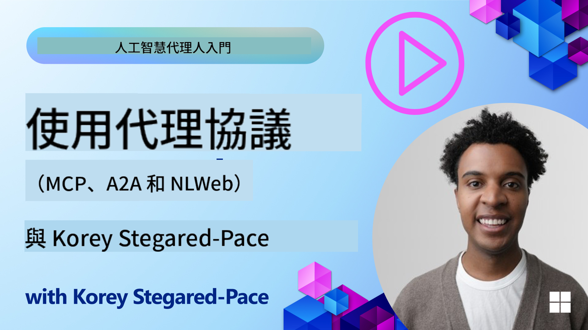
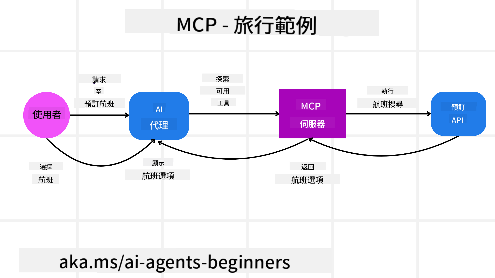
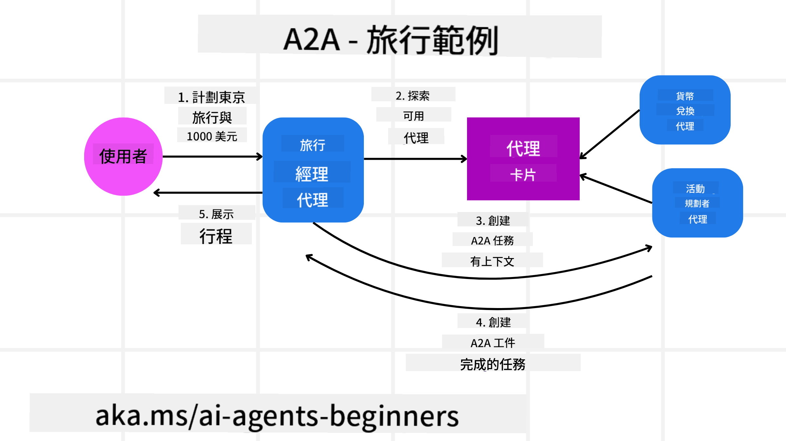

<!--
CO_OP_TRANSLATOR_METADATA:
{
  "original_hash": "5c05bcdfb163dfa2493db39dfb45ad9a",
  "translation_date": "2025-09-04T07:49:17+00:00",
  "source_file": "11-agentic-protocols/README.md",
  "language_code": "tw"
}
-->
# 使用 Agentic Protocols（MCP、A2A 和 NLWeb）

隨著 AI 代理的使用日益增長，確保標準化、安全性以及支持開放創新的協議需求也隨之增加。在本課程中，我們將介紹三種旨在滿足這些需求的協議——模型上下文協議（Model Context Protocol, MCP）、代理對代理協議（Agent to Agent, A2A）以及自然語言網絡協議（Natural Language Web, NLWeb）。

## 簡介

在本課程中，我們將探討：

• **MCP** 如何讓 AI 代理訪問外部工具和數據以完成用戶任務。

• **A2A** 如何實現不同 AI 代理之間的通信與協作。

• **NLWeb** 如何為任何網站提供自然語言界面，使 AI 代理能夠發現並與內容互動。

## 學習目標

• **識別** MCP、A2A 和 NLWeb 在 AI 代理背景下的核心目的和優勢。

• **解釋** 每種協議如何促進 LLM、工具和其他代理之間的通信與交互。

• **理解** 每種協議在構建複雜代理系統中所扮演的不同角色。

## 模型上下文協議

**模型上下文協議（MCP）** 是一種開放標準，為應用程序提供了一種標準化方式，讓它們能向 LLM 提供上下文和工具。這使得 AI 代理能以一致的方式連接到不同的數據源和工具，成為一種“通用適配器”。

接下來，我們將探討 MCP 的組成部分、與直接使用 API 的比較優勢，以及 AI 代理如何使用 MCP 服務器的示例。

### MCP 核心組成部分

MCP 基於 **客戶端-服務器架構**，其核心組成部分包括：

• **主機（Hosts）**：LLM 應用程序（例如像 VSCode 這樣的代碼編輯器），負責啟動與 MCP 服務器的連接。

• **客戶端（Clients）**：主機應用程序中的組件，維護與服務器的一對一連接。

• **服務器（Servers）**：輕量級程序，負責提供特定功能。

協議中包含三個核心原語，這些是 MCP 服務器的功能：

• **工具（Tools）**：這些是 AI 代理可以調用以執行操作的離散功能。例如，天氣服務可能提供一個“獲取天氣”的工具，或者電子商務服務器可能提供一個“購買產品”的工具。MCP 服務器會在其功能列表中廣告每個工具的名稱、描述以及輸入/輸出結構。

• **資源（Resources）**：這些是 MCP 服務器可以提供的只讀數據項或文檔，客戶端可以按需檢索它們。例如文件內容、數據庫記錄或日誌文件。資源可以是文本（如代碼或 JSON）或二進制文件（如圖像或 PDF）。

• **提示（Prompts）**：這些是預定義的模板，提供建議的提示，允許更複雜的工作流程。

### MCP 的優勢

MCP 為 AI 代理提供了顯著的優勢：

• **動態工具發現**：代理可以動態接收服務器提供的工具列表以及它們的描述。這與傳統 API 不同，後者通常需要靜態編碼進行集成，任何 API 的更改都需要更新代碼。MCP 提供了一種“僅需集成一次”的方法，從而提高了適應性。

• **跨 LLM 的互操作性**：MCP 可用於不同的 LLM，提供靈活性以切換核心模型以評估更好的性能。

• **標準化的安全性**：MCP 包含一種標準的身份驗證方法，當添加對其他 MCP 服務器的訪問時，這種方法提高了可擴展性。這比管理不同的傳統 API 密鑰和身份驗證類型更簡單。

### MCP 示例

假設用戶希望使用基於 MCP 的 AI 助手預訂航班。

1. **連接**：AI 助手（MCP 客戶端）連接到航空公司的 MCP 服務器。

2. **工具發現**：客戶端詢問航空公司的 MCP 服務器，“你有哪些可用的工具？”服務器回應提供如“搜索航班”和“預訂航班”等工具。

3. **工具調用**：然後你對 AI 助手說，“請幫我搜索從波特蘭到檀香山的航班。”AI 助手使用其 LLM 確定需要調用“搜索航班”工具，並將相關參數（出發地、目的地）傳遞給 MCP 服務器。

4. **執行與回應**：MCP 服務器作為包裝器，實際調用航空公司的內部預訂 API。然後，它接收航班信息（例如 JSON 數據），並將其發送回 AI 助手。

5. **進一步交互**：AI 助手展示航班選項。一旦你選擇了一個航班，助手可能會調用同一 MCP 服務器上的“預訂航班”工具，完成預訂。

## 代理對代理協議（A2A）

雖然 MCP 專注於將 LLM 連接到工具，但 **代理對代理協議（A2A）** 更進一步，實現了不同 AI 代理之間的通信與協作。A2A 將來自不同組織、環境和技術棧的 AI 代理連接起來，以完成共享任務。

我們將探討 A2A 的組成部分和優勢，以及它如何應用於我們的旅行應用程序示例。

### A2A 核心組成部分

A2A 專注於實現代理之間的通信，讓它們協作完成用戶的子任務。協議的每個組成部分都為此作出貢獻：

#### 代理卡片（Agent Card）

類似於 MCP 服務器共享工具列表，代理卡片包含：

- 代理的名稱。
- **描述代理完成的一般任務**。
- **具體技能列表**，附帶描述，幫助其他代理（甚至人類用戶）了解何時以及為什麼需要調用該代理。
- 代理的**當前端點 URL**。
- 代理的**版本**和**功能**，例如流式響應和推送通知。

#### 代理執行器（Agent Executor）

代理執行器負責**將用戶聊天的上下文傳遞給遠程代理**，遠程代理需要這些上下文來理解需要完成的任務。在 A2A 服務器中，代理使用其自己的大型語言模型（LLM）來解析傳入請求，並使用其內部工具執行任務。

#### 工件（Artifact）

一旦遠程代理完成請求的任務，其工作成果會以工件的形式創建。工件**包含代理完成工作的結果**、**完成的描述**以及通過協議傳遞的**文本上下文**。工件發送後，與遠程代理的連接將關閉，直到再次需要它。

#### 事件隊列（Event Queue）

此組件用於**處理更新和傳遞消息**。在生產環境中，這對於代理系統尤為重要，以防止代理之間的連接在任務完成之前被關閉，特別是當任務完成時間較長時。

### A2A 的優勢

• **增強協作**：它使來自不同供應商和平台的代理能夠交互、共享上下文並協作工作，促進了傳統上分離系統之間的無縫自動化。

• **模型選擇靈活性**：每個 A2A 代理可以決定使用哪個 LLM 來處理其請求，允許每個代理根據需要優化或微調模型，這與某些 MCP 場景中的單一 LLM 連接不同。

• **內置身份驗證**：身份驗證直接集成到 A2A 協議中，為代理交互提供了強大的安全框架。

### A2A 示例

讓我們擴展旅行預訂場景，但這次使用 A2A。

1. **用戶向多代理發出請求**：用戶與“旅行代理”A2A 客戶端/代理交互，可能說：“請幫我預訂下周去檀香山的整個行程，包括航班、酒店和租車。”

2. **旅行代理進行編排**：旅行代理收到這個複雜請求。它使用其 LLM 推理任務，並確定需要與其他專業代理交互。

3. **代理間通信**：旅行代理然後使用 A2A 協議連接到下游代理，例如由不同公司創建的“航空代理”、“酒店代理”和“租車代理”。

4. **委派任務執行**：旅行代理向這些專業代理發送具體任務（例如，“查找飛往檀香山的航班”、“預訂酒店”、“租車”）。每個專業代理運行自己的 LLM 並使用自己的工具（這些工具本身可能是 MCP 服務器），執行其特定部分的預訂。

5. **綜合回應**：一旦所有下游代理完成任務，旅行代理匯總結果（航班詳情、酒店確認、租車預訂），並將綜合的聊天式回應發送回用戶。

## 自然語言網絡（NLWeb）

長期以來，網站一直是用戶訪問互聯網上信息和數據的主要方式。

接下來，我們將探討 NLWeb 的不同組成部分、NLWeb 的優勢，以及通過我們的旅行應用程序示例來了解 NLWeb 的工作方式。

### NLWeb 的組成部分

- **NLWeb 應用程序（核心服務代碼）**：處理自然語言問題的系統。它連接平台的不同部分以生成回應。你可以將其視為網站自然語言功能的**引擎**。

- **NLWeb 協議**：這是一組**與網站進行自然語言交互的基本規則**。它以 JSON 格式（通常使用 Schema.org）返回回應。其目的是為“AI 網絡”創建一個簡單的基礎，就像 HTML 使在線共享文檔成為可能一樣。

- **MCP 服務器（模型上下文協議端點）**：每個 NLWeb 設置也作為一個**MCP 服務器**。這意味著它可以與其他 AI 系統**共享工具（如“ask”方法）和數據**。實際上，這使得網站的內容和功能可供 AI 代理使用，讓網站成為更廣泛“代理生態系統”的一部分。

- **嵌入模型（Embedding Models）**：這些模型用於**將網站內容轉換為稱為向量的數字表示**（嵌入）。這些向量以計算機可以比較和搜索的方式捕捉含義。它們存儲在一個特殊的數據庫中，用戶可以選擇使用哪個嵌入模型。

- **向量數據庫（檢索機制）**：此數據庫**存儲網站內容的嵌入**。當有人提出問題時，NLWeb 會檢查向量數據庫以快速找到最相關的信息。它提供一個按相似度排序的快速答案列表。NLWeb 支持不同的向量存儲系統，如 Qdrant、Snowflake、Milvus、Azure AI Search 和 Elasticsearch。

### NLWeb 示例

考慮我們的旅行預訂網站，但這次由 NLWeb 提供支持。

1. **數據攝取**：旅行網站現有的產品目錄（例如航班列表、酒店描述、旅遊套餐）使用 Schema.org 格式化或通過 RSS 提要加載。NLWeb 的工具攝取這些結構化數據，創建嵌入，並將它們存儲在本地或遠程向量數據庫中。

2. **自然語言查詢（人類）**：用戶訪問網站，並在聊天界面中輸入：“幫我找一間下周在檀香山有游泳池的適合家庭入住的酒店。”

3. **NLWeb 處理**：NLWeb 應用程序接收該查詢。它將查詢發送到 LLM 進行理解，同時搜索其向量數據庫以查找相關的酒店列表。

4. **準確結果**：LLM 幫助解釋數據庫的搜索結果，根據“適合家庭”、“游泳池”和“檀香山”標準識別最佳匹配，然後格式化自然語言回應。關鍵是，回應引用網站目錄中的實際酒店，避免虛構信息。

5. **AI 代理交互**：由於 NLWeb 作為 MCP 服務器運行，外部 AI 旅行代理也可以連接到該網站的 NLWeb 實例。AI 代理可以使用 `ask` MCP 方法直接查詢網站：`ask("檀香山地區有沒有酒店推薦的素食餐廳？")`。NLWeb 實例會處理該查詢，利用其數據庫中的餐廳信息（如果已加載），並返回結構化的 JSON 回應。

### 對 MCP/A2A/NLWeb 有更多問題？

加入 [Azure AI Foundry Discord](https://aka.ms/ai-agents/discord)，與其他學習者交流，參加辦公時間，並獲得有關 AI 代理的問題解答。

## 資源

- [MCP 初學者指南](https://aka.ms/mcp-for-beginners)  
- [MCP 文檔](https://github.com/microsoft/semantic-kernel/tree/main/python/semantic-kernel/semantic_kernel/connectors/mcp)
- [NLWeb 資源庫](https://github.com/nlweb-ai/NLWeb)
- [Semantic Kernel 指南](https://learn.microsoft.com/semantic-kernel/)

---

**免責聲明**：  
本文件已使用 AI 翻譯服務 [Co-op Translator](https://github.com/Azure/co-op-translator) 進行翻譯。我們致力於提供準確的翻譯，但請注意，自動翻譯可能包含錯誤或不準確之處。應以原始語言的文件作為權威來源。對於關鍵資訊，建議尋求專業人工翻譯。我們對因使用此翻譯而產生的任何誤解或錯誤解讀概不負責。