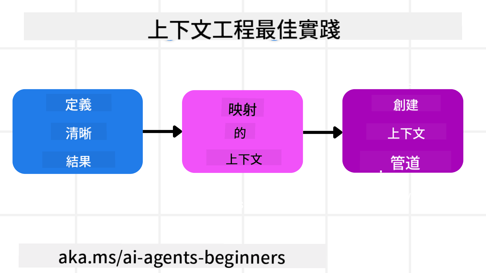

<!--
CO_OP_TRANSLATOR_METADATA:
{
  "original_hash": "cb7e50f471905ce6fdb92a30269a7a98",
  "translation_date": "2025-09-04T09:52:12+00:00",
  "source_file": "12-context-engineering/README.md",
  "language_code": "tw"
}
-->
# 為 AI 代理設計上下文工程

> _(點擊上方圖片觀看本課程影片)_

了解您正在為其構建 AI 代理的應用程序的複雜性，對於構建可靠的代理至關重要。我們需要構建能夠有效管理信息的 AI 代理，以應對超越提示工程的複雜需求。

在本課程中，我們將探討什麼是上下文工程，以及它在構建 AI 代理中的角色。

## 課程介紹

本課程將涵蓋：

• **什麼是上下文工程**，以及它與提示工程的不同之處。

• **有效上下文工程的策略**，包括如何撰寫、選擇、壓縮和隔離信息。

• **常見的上下文失敗**，這些失敗可能會使您的 AI 代理偏離正軌，以及如何修復它們。

## 學習目標

完成本課程後，您將能夠：

• **定義上下文工程**，並將其與提示工程區分開來。

• **識別大型語言模型 (LLM) 應用中的上下文關鍵組成部分**。

• **應用撰寫、選擇、壓縮和隔離上下文的策略**，以提升代理性能。

• **識別常見的上下文失敗**，如中毒、分心、混淆和衝突，並實施緩解技術。

## 什麼是上下文工程？

對於 AI 代理來說，上下文是驅動 AI 代理規劃採取某些行動的關鍵。上下文工程是確保 AI 代理擁有完成任務下一步所需正確信息的實踐。由於上下文窗口的大小有限，作為代理構建者，我們需要構建系統和流程來管理上下文窗口中的信息添加、刪除和壓縮。

### 提示工程與上下文工程

提示工程專注於一組靜態指令，以一組規則有效地指導 AI 代理。而上下文工程則是管理一組動態信息（包括初始提示），以確保 AI 代理隨時間擁有所需的信息。上下文工程的核心理念是使這一過程可重複且可靠。

### 上下文的類型

需要記住的是，上下文並非單一的事物。AI 代理所需的信息可能來自多種不同來源，我們的責任是確保代理能夠訪問這些來源：

AI 代理可能需要管理的上下文類型包括：

• **指令：** 這些就像代理的「規則」——提示、系統消息、少量示例（向 AI 展示如何完成某事）以及它可以使用的工具描述。這是提示工程與上下文工程結合的地方。

• **知識：** 包括事實、從數據庫檢索的信息或代理積累的長期記憶。這包括在代理需要訪問不同知識庫和數據庫時，整合檢索增強生成 (RAG) 系統。

• **工具：** 包括代理可以調用的外部函數、API 和 MCP 服務器的定義，以及使用這些工具獲得的反饋（結果）。

• **對話歷史：** 與用戶的持續對話。隨著時間的推移，這些對話變得越來越長且複雜，佔據上下文窗口的空間。

• **用戶偏好：** 隨著時間推移學到的用戶喜好或厭惡信息。這些信息可以在做出關鍵決策時調用，以幫助用戶。

## 有效上下文工程的策略

### 規劃策略

良好的上下文工程始於良好的規劃。以下是幫助您開始思考如何應用上下文工程概念的方法：

1. **定義清晰的結果** - 應明確定義 AI 代理將被分配的任務結果。回答這個問題——「當 AI 代理完成任務時，世界會是什麼樣子？」換句話說，用戶在與 AI 代理互動後應該獲得什麼變化、信息或回應。

2. **繪製上下文地圖** - 一旦定義了 AI 代理的結果，您需要回答「AI 代理需要哪些信息來完成這項任務？」這樣您就可以開始繪製這些信息的來源地圖。

3. **創建上下文管道** - 現在您知道了信息的來源，您需要回答「代理將如何獲取這些信息？」這可以通過多種方式實現，包括 RAG、使用 MCP 服務器和其他工具。

### 實用策略

規劃很重要，但一旦信息開始流入代理的上下文窗口，我們需要有實用的策略來管理它：

#### 管理上下文

雖然某些信息會自動添加到上下文窗口中，但上下文工程是對這些信息採取更主動的管理方式，可以通過以下幾種策略實現：

1. **代理便簽本**  
   這允許 AI 代理在單次會話期間記錄當前任務和用戶交互的相關信息。這些信息應存在於上下文窗口之外，例如文件或運行時對象中，代理可以在需要時檢索。

2. **記憶**  
   便簽本適合管理單次會話上下文窗口之外的信息，而記憶則使代理能夠在多次會話中存儲和檢索相關信息。這可能包括摘要、用戶偏好和改進的反饋。

3. **壓縮上下文**  
   當上下文窗口增長並接近其限制時，可以使用摘要和修剪等技術。這包括僅保留最相關的信息或刪除較舊的消息。

4. **多代理系統**  
   開發多代理系統是一種上下文工程形式，因為每個代理都有自己的上下文窗口。如何在不同代理之間共享和傳遞上下文是構建這些系統時需要規劃的另一個方面。

5. **沙盒環境**  
   如果代理需要運行一些代碼或處理文檔中的大量信息，這可能會佔用大量的 token。與其將這些信息全部存儲在上下文窗口中，代理可以使用沙盒環境運行代碼，僅讀取結果和其他相關信息。

6. **運行時狀態對象**  
   通過創建信息容器來管理代理需要訪問某些信息的情況。對於複雜任務，這使代理能夠逐步存儲每個子任務的結果，從而使上下文僅與該特定子任務相關聯。

### 上下文工程示例

假設我們希望一個 AI 代理 **「幫我預訂去巴黎的旅行。」**

• 僅使用提示工程的簡單代理可能只會回應：**「好的，您想什麼時候去巴黎？」** 它僅處理了用戶當時提出的直接問題。

• 使用我們所涵蓋的上下文工程策略的代理則會做得更多。在回應之前，它的系統可能會：

  ◦ **檢查您的日曆** 以獲取可用日期（檢索實時數據）。

  ◦ **回憶過去的旅行偏好**（來自長期記憶），例如您偏好的航空公司、預算，或者您是否更喜歡直飛航班。

  ◦ **識別可用工具** 用於航班和酒店預訂。

- 然後，一個示例回應可能是：**「嗨 [您的名字]！我看到您在十月的第一周有空。我是否應該幫您查找 [偏好航空公司] 的直飛巴黎航班，並控制在您的預算 [預算] 範圍內？」** 這種更豐富、更具上下文意識的回應展示了上下文工程的威力。

## 常見的上下文失敗

### 上下文中毒

**定義：** 當 LLM 生成的幻覺（虛假信息）或錯誤進入上下文並被反覆引用，導致代理追求不可能的目標或制定荒謬的策略。

**解決方法：** 實施 **上下文驗證** 和 **隔離**。在將信息添加到長期記憶之前進行驗證。如果檢測到潛在的中毒，啟動新的上下文線程以防止錯誤信息擴散。

**旅行預訂示例：** 您的代理幻覺出現了一個 **從小型地方機場直飛遠程國際城市** 的航班，但該機場實際上並不提供國際航班。這個不存在的航班細節被保存到上下文中。稍後，當您要求代理預訂時，它不斷嘗試為這條不可能的路線尋找票，導致反覆出錯。

**解決方案：** 實施一個步驟，**在將航班細節添加到代理的工作上下文之前，通過實時 API 驗證航班的存在和路線**。如果驗證失敗，錯誤信息將被「隔離」，不再進一步使用。

### 上下文分心

**定義：** 當上下文變得過於龐大，模型過於專注於累積的歷史，而不是利用訓練期間學到的知識，導致重複或無用的行為。即使在上下文窗口未滿之前，模型也可能開始犯錯。

**解決方法：** 使用 **上下文摘要**。定期將累積的信息壓縮為更短的摘要，保留重要細節，同時刪除冗餘的歷史記錄，幫助「重置」焦點。

**旅行預訂示例：** 您長時間討論了各種夢想中的旅行目的地，包括詳細回憶了兩年前的背包旅行。當您最終要求 **「幫我找下個月的便宜航班」** 時，代理陷入了舊的、不相關的細節中，不斷詢問您的背包裝備或過去的行程，而忽略了您當前的請求。

**解決方案：** 在一定回合數後或上下文過大時，代理應該 **總結最近且相關的對話部分**——專注於您當前的旅行日期和目的地——並使用該壓縮摘要進行下一次 LLM 調用，丟棄不相關的歷史聊天。

### 上下文混淆

**定義：** 當上下文中存在過多不必要的信息（通常是過多的可用工具）時，導致模型生成錯誤回應或調用不相關的工具。小型模型尤其容易出現這種情況。

**解決方法：** 使用 **工具負載管理** 和 RAG 技術。將工具描述存儲在向量數據庫中，並為每個具體任務僅選擇最相關的工具。研究表明，將工具選擇限制在少於 30 個效果更佳。

**旅行預訂示例：** 您的代理可以訪問數十種工具：`book_flight`、`book_hotel`、`rent_car`、`find_tours`、`currency_converter`、`weather_forecast`、`restaurant_reservations` 等。您詢問 **「在巴黎最好的出行方式是什麼？」** 由於工具數量過多，代理感到困惑，試圖在巴黎內部調用 `book_flight`，或者調用 `rent_car`，即使您更喜歡公共交通，因為工具描述可能重疊，或者代理無法分辨最佳選擇。

**解決方案：** 使用 **RAG 工具描述**。當您詢問巴黎的出行方式時，系統動態檢索僅與您的查詢最相關的工具，如 `rent_car` 或 `public_transport_info`，向 LLM 提供一個專注的「工具負載」。

### 上下文衝突

**定義：** 當上下文中存在矛盾信息時，導致推理不一致或最終回應錯誤。這通常發生在信息分階段到達時，早期的錯誤假設仍然保留在上下文中。

**解決方法：** 使用 **上下文修剪** 和 **卸載**。修剪意味著在新細節到達時移除過時或矛盾的信息。卸載則為模型提供一個單獨的「便簽本」工作區，用於處理信息，而不會使主上下文混亂。

**旅行預訂示例：** 您最初告訴代理，**「我想坐經濟艙。」** 稍後在對話中，您改變主意並說，**「其實這次旅行我們坐商務艙吧。」** 如果這兩條指令都保留在上下文中，代理可能會收到矛盾的搜索結果，或者對應優先級感到困惑。

**解決方案：** 實施 **上下文修剪**。當新指令與舊指令矛盾時，舊指令將被移除或在上下文中明確覆蓋。或者，代理可以使用 **便簽本** 來調和矛盾的偏好，確保只有最終、一致的指令指導其行動。

## 對上下文工程有更多疑問嗎？

加入 [Azure AI Foundry Discord](https://aka.ms/ai-agents/discord)，與其他學習者交流，參加辦公時間，並獲得有關 AI 代理的問題解答。

---

**免責聲明**：  
本文件使用 AI 翻譯服務 [Co-op Translator](https://github.com/Azure/co-op-translator) 進行翻譯。我們致力於提供準確的翻譯，但請注意，自動翻譯可能包含錯誤或不準確之處。應以原始語言的文件作為權威來源。對於關鍵資訊，建議尋求專業人工翻譯。我們對因使用此翻譯而產生的任何誤解或錯誤解讀概不負責。