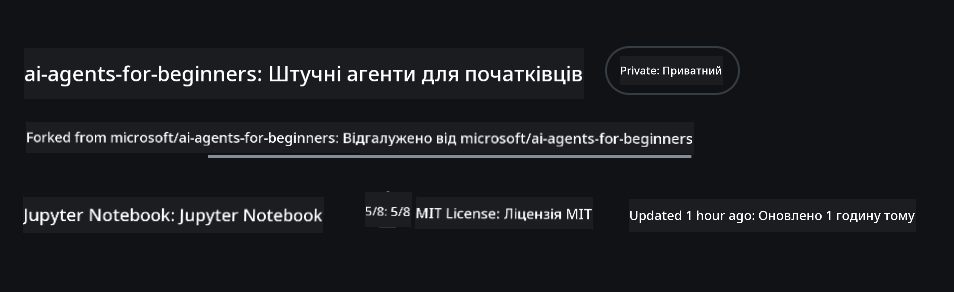
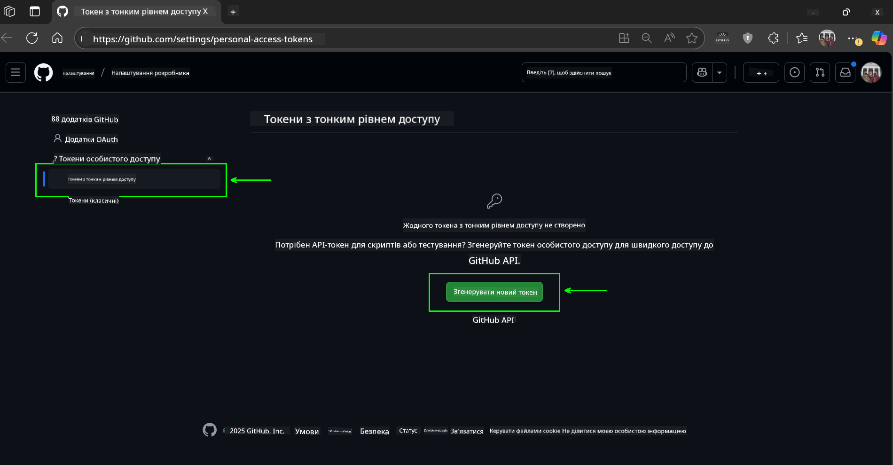
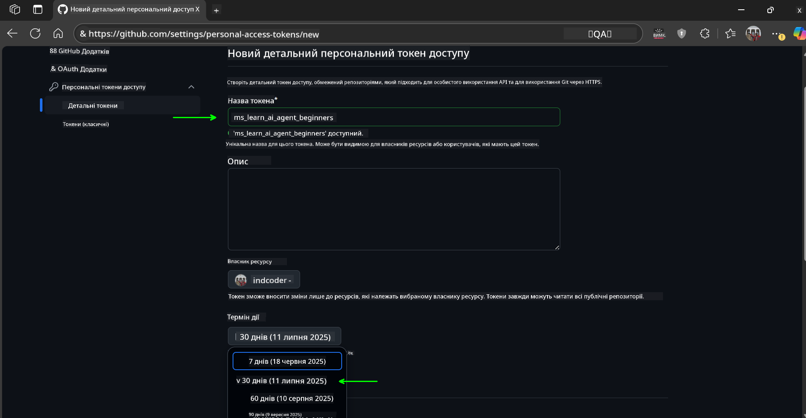
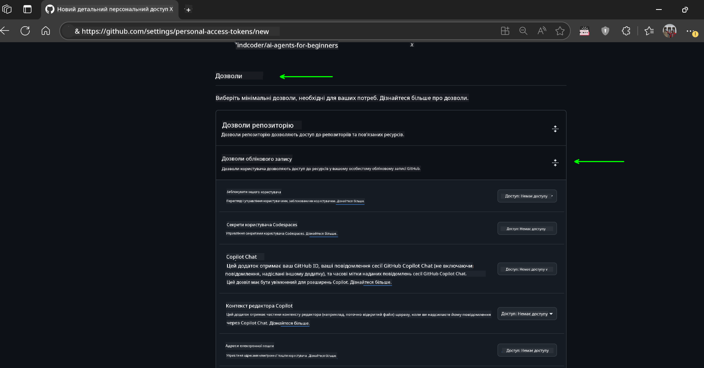
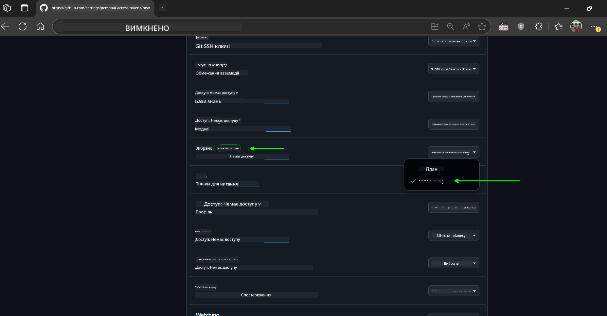
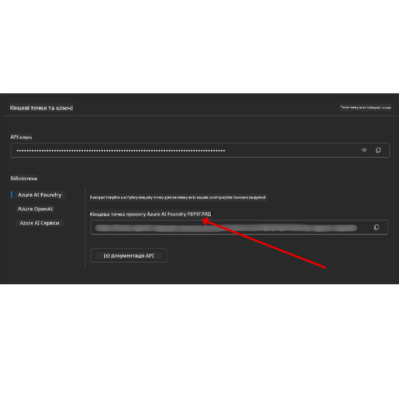

<!--
CO_OP_TRANSLATOR_METADATA:
{
  "original_hash": "c6a79c8f2b56a80370ff7e447765524f",
  "translation_date": "2025-07-23T09:22:07+00:00",
  "source_file": "00-course-setup/README.md",
  "language_code": "uk"
}
-->
# Налаштування курсу

## Вступ

У цьому уроці ми розглянемо, як запускати приклади коду цього курсу.

## Клонування або форк цього репозиторію

Для початку, будь ласка, клонувати або форкнути репозиторій GitHub. Це створить вашу власну версію матеріалів курсу, щоб ви могли запускати, тестувати та змінювати код!

Це можна зробити, натиснувши на посилання

Ви тепер повинні мати власну форкнуту версію цього курсу за наступним посиланням:



## Запуск коду

Цей курс пропонує серію Jupyter Notebook, які ви можете запускати, щоб отримати практичний досвід створення AI-агентів.

Приклади коду використовують:

**Потрібен обліковий запис GitHub - безкоштовно**:

1) Semantic Kernel Agent Framework + GitHub Models Marketplace. Позначено як (semantic-kernel.ipynb)  
2) AutoGen Framework + GitHub Models Marketplace. Позначено як (autogen.ipynb)  

**Потрібна підписка Azure**:  
3) Azure AI Foundry + Azure AI Agent Service. Позначено як (azureaiagent.ipynb)  

Ми рекомендуємо спробувати всі три типи прикладів, щоб зрозуміти, який з них найкраще підходить для вас.

Вибір одного з варіантів визначить, які кроки налаштування вам потрібно виконати нижче:

## Вимоги

- Python 3.12+  
  - **NOTE**: Якщо у вас не встановлено Python 3.12, переконайтеся, що ви його встановили. Потім створіть свій venv, використовуючи python3.12, щоб забезпечити встановлення правильних версій з файлу requirements.txt.  
- Обліковий запис GitHub - для доступу до GitHub Models Marketplace  
- Підписка Azure - для доступу до Azure AI Foundry  
- Обліковий запис Azure AI Foundry - для доступу до Azure AI Agent Service  

Ми включили файл `requirements.txt` у кореневу папку цього репозиторію, який містить усі необхідні Python-пакети для запуску прикладів коду.

Ви можете встановити їх, виконавши наступну команду у вашому терміналі в кореневій папці репозиторію:

```bash
pip install -r requirements.txt
```  
Ми рекомендуємо створити віртуальне середовище Python, щоб уникнути конфліктів і проблем.

## Налаштування VSCode

Переконайтеся, що ви використовуєте правильну версію Python у VSCode.


## Налаштування для прикладів з використанням GitHub Models

### Крок 1: Отримання вашого GitHub Personal Access Token (PAT)

Цей курс використовує GitHub Models Marketplace, що надає безкоштовний доступ до великих мовних моделей (LLMs), які ви будете використовувати для створення AI-агентів.

Щоб використовувати GitHub Models, вам потрібно створити [GitHub Personal Access Token](https://docs.github.com/en/authentication/keeping-your-account-and-data-secure/managing-your-personal-access-tokens).

Це можна зробити, перейшовши у ваш обліковий запис GitHub.

Будь ласка, дотримуйтесь [Принципу найменших привілеїв](https://docs.github.com/en/get-started/learning-to-code/storing-your-secrets-safely) при створенні вашого токена. Це означає, що ви повинні надати токену лише ті дозволи, які потрібні для запуску прикладів коду цього курсу.

1. Виберіть опцію `Fine-grained tokens` на лівій стороні екрана.

    Потім виберіть `Generate new token`.

    

1. Введіть описову назву для вашого токена, яка відображає його призначення, щоб його було легко ідентифікувати пізніше. Встановіть дату закінчення терміну дії (рекомендується: 30 днів; ви можете вибрати коротший період, наприклад, 7 днів, якщо віддаєте перевагу більш безпечному підходу).

    

1. Обмежте область дії токена вашим форком цього репозиторію.

    

1. Обмежте дозволи токена: у розділі **Permissions** увімкніть **Account Permissions**, перейдіть до **Models** і увімкніть лише доступ для читання, необхідний для GitHub Models.

    

    

Скопіюйте ваш новий токен, який ви щойно створили. Тепер ви додасте його до вашого `.env` файлу, включеного в цей курс.

### Крок 2: Створення вашого `.env` файлу

Щоб створити ваш `.env` файл, виконайте наступну команду у вашому терміналі.

```bash
cp .env.example .env
```

Це скопіює приклад файлу і створить `.env` у вашій директорії, де ви заповните значення для змінних середовища.

Скопіювавши ваш токен, відкрийте `.env` файл у вашому улюбленому текстовому редакторі і вставте ваш токен у поле `GITHUB_TOKEN`.

Тепер ви повинні бути готові до запуску прикладів коду цього курсу.

## Налаштування для прикладів з використанням Azure AI Foundry та Azure AI Agent Service

### Крок 1: Отримання вашого Azure Project Endpoint

Виконайте кроки для створення хабу та проекту в Azure AI Foundry, описані тут: [Hub resources overview](https://learn.microsoft.com/en-us/azure/ai-foundry/concepts/ai-resources)

Після створення проекту вам потрібно буде отримати рядок підключення для вашого проекту.

Це можна зробити, перейшовши на сторінку **Overview** вашого проекту в порталі Azure AI Foundry.



### Крок 2: Створення вашого `.env` файлу

Щоб створити ваш `.env` файл, виконайте наступну команду у вашому терміналі.

```bash
cp .env.example .env
```

Це скопіює приклад файлу і створить `.env` у вашій директорії, де ви заповните значення для змінних середовища.

Скопіювавши ваш токен, відкрийте `.env` файл у вашому улюбленому текстовому редакторі і вставте ваш токен у поле `PROJECT_ENDPOINT`.

### Крок 3: Вхід в Azure

Як найкращу практику безпеки, ми будемо використовувати [автентифікацію без ключів](https://learn.microsoft.com/azure/developer/ai/keyless-connections?tabs=csharp%2Cazure-cli?WT.mc_id=academic-105485-koreyst) для автентифікації в Azure OpenAI за допомогою Microsoft Entra ID.

Далі відкрийте термінал і виконайте `az login --use-device-code`, щоб увійти у ваш обліковий запис Azure.

Після входу виберіть вашу підписку в терміналі.

## Додаткові змінні середовища - Azure Search та Azure OpenAI

Для уроку Agentic RAG - Урок 5 - є приклади, які використовують Azure Search та Azure OpenAI.

Якщо ви хочете запустити ці приклади, вам потрібно буде додати наступні змінні середовища до вашого `.env` файлу:

### Сторінка огляду (Проект)

- `AZURE_SUBSCRIPTION_ID` - Перевірте **Project details** на сторінці **Overview** вашого проекту.

- `AZURE_AI_PROJECT_NAME` - Подивіться у верхній частині сторінки **Overview** вашого проекту.

- `AZURE_OPENAI_SERVICE` - Знайдіть це на вкладці **Included capabilities** для **Azure OpenAI Service** на сторінці **Overview**.

### Центр управління

- `AZURE_OPENAI_RESOURCE_GROUP` - Перейдіть до **Project properties** на сторінці **Overview** у **Management Center**.

- `GLOBAL_LLM_SERVICE` - У розділі **Connected resources** знайдіть назву підключення **Azure AI Services**. Якщо не вказано, перевірте **Azure portal** у вашій групі ресурсів для назви ресурсу AI Services.

### Сторінка моделей + кінцевих точок

- `AZURE_OPENAI_EMBEDDING_DEPLOYMENT_NAME` - Виберіть вашу модель вбудовування (наприклад, `text-embedding-ada-002`) і запишіть **Deployment name** з деталей моделі.

- `AZURE_OPENAI_CHAT_DEPLOYMENT_NAME` - Виберіть вашу модель чату (наприклад, `gpt-4o-mini`) і запишіть **Deployment name** з деталей моделі.

### Azure Portal

- `AZURE_OPENAI_ENDPOINT` - Знайдіть **Azure AI services**, натисніть на нього, потім перейдіть до **Resource Management**, **Keys and Endpoint**, прокрутіть вниз до "Azure OpenAI endpoints" і скопіюйте той, що позначений "Language APIs".

- `AZURE_OPENAI_API_KEY` - З того ж екрану скопіюйте KEY 1 або KEY 2.

- `AZURE_SEARCH_SERVICE_ENDPOINT` - Знайдіть ваш ресурс **Azure AI Search**, натисніть на нього і перегляньте **Overview**.

- `AZURE_SEARCH_API_KEY` - Потім перейдіть до **Settings**, а потім **Keys**, щоб скопіювати основний або вторинний адміністративний ключ.

### Зовнішня веб-сторінка

- `AZURE_OPENAI_API_VERSION` - Відвідайте сторінку [API version lifecycle](https://learn.microsoft.com/en-us/azure/ai-services/openai/api-version-deprecation#latest-ga-api-release) у розділі **Latest GA API release**.

### Налаштування автентифікації без ключів

Замість того, щоб жорстко кодувати ваші облікові дані, ми будемо використовувати підключення без ключів з Azure OpenAI. Для цього ми імпортуємо `DefaultAzureCredential`, а потім викличемо функцію `DefaultAzureCredential`, щоб отримати облікові дані.

```python
from azure.identity import DefaultAzureCredential, InteractiveBrowserCredential
```

## Застрягли десь?

Якщо у вас виникли проблеми з виконанням цього налаштування, приєднуйтесь до нашого

## Наступний урок

Тепер ви готові запускати код цього курсу. Бажаємо успіхів у вивченні світу AI-агентів!

[Вступ до AI-агентів та їх використання](../01-intro-to-ai-agents/README.md)

**Відмова від відповідальності**:  
Цей документ було перекладено за допомогою сервісу автоматичного перекладу [Co-op Translator](https://github.com/Azure/co-op-translator). Хоча ми прагнемо до точності, звертаємо вашу увагу, що автоматичні переклади можуть містити помилки або неточності. Оригінальний документ мовою оригіналу слід вважати авторитетним джерелом. Для критично важливої інформації рекомендується професійний переклад людиною. Ми не несемо відповідальності за будь-які непорозуміння або неправильні тлумачення, що виникли внаслідок використання цього перекладу.