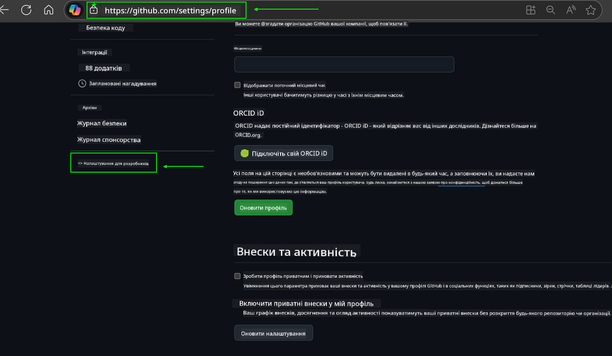
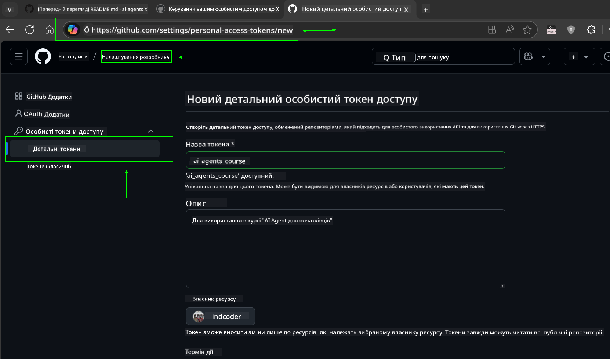
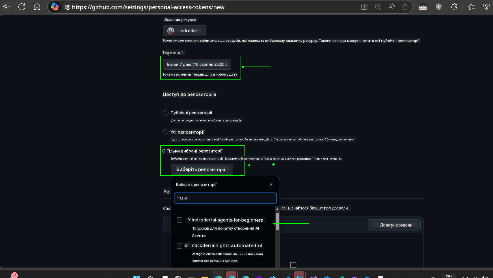
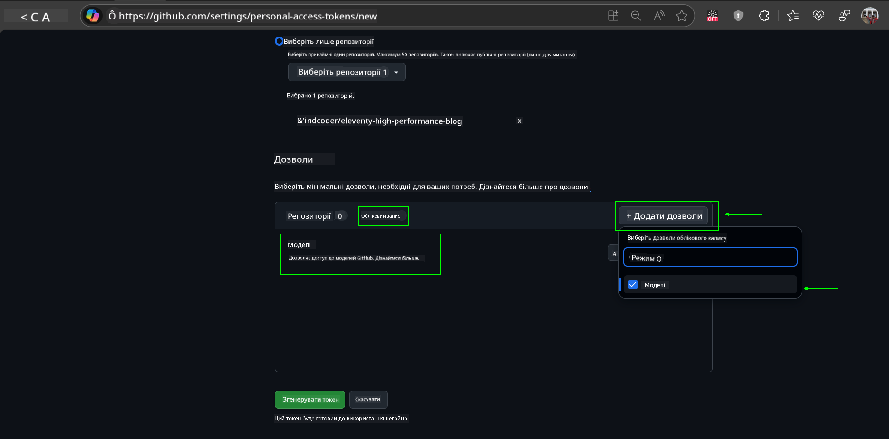
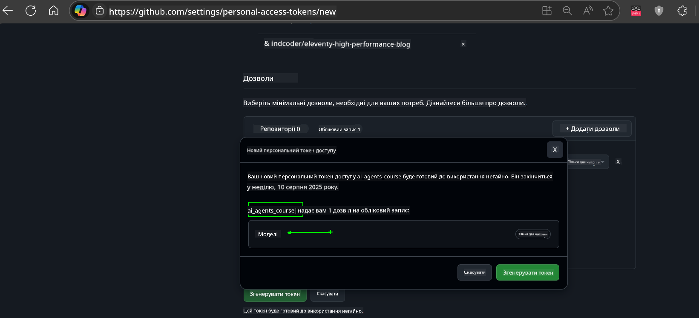
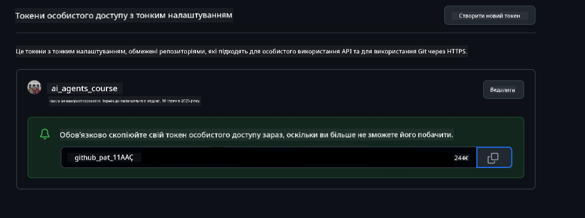
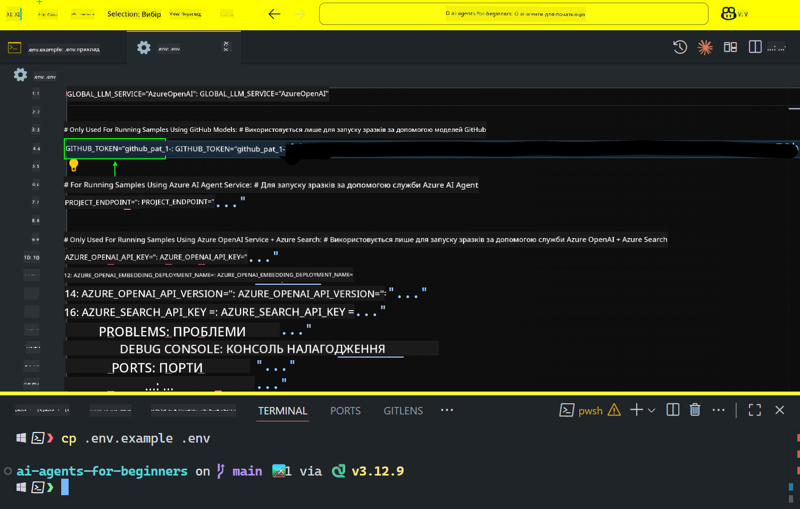

<!--
CO_OP_TRANSLATOR_METADATA:
{
  "original_hash": "c55b973b1562abf5aadf6a4028265ac5",
  "translation_date": "2025-08-29T23:42:26+00:00",
  "source_file": "00-course-setup/README.md",
  "language_code": "uk"
}
-->
# Налаштування курсу

## Вступ

У цьому уроці ми розглянемо, як запускати приклади коду цього курсу.

## Приєднуйтесь до інших учасників і отримуйте допомогу

Перед тим як клонувати репозиторій, приєднайтеся до [каналу Discord для початківців AI Agents](https://aka.ms/ai-agents/discord), щоб отримати допомогу з налаштуванням, поставити запитання щодо курсу або поспілкуватися з іншими учасниками.

## Клонування або форк репозиторію

Для початку, будь ласка, клонувати або форкнути репозиторій GitHub. Це дозволить створити власну версію матеріалів курсу, щоб ви могли запускати, тестувати та змінювати код!

Це можна зробити, натиснувши на посилання.

Ви тепер повинні мати власну форкнуту версію цього курсу за наступним посиланням:


## Запуск коду

Цей курс пропонує серію Jupyter Notebook, які ви можете запускати, щоб отримати практичний досвід створення AI-агентів.

Приклади коду використовують:

**Потрібен обліковий запис GitHub - безкоштовно**:

1) Semantic Kernel Agent Framework + GitHub Models Marketplace. Позначено як (semantic-kernel.ipynb)  
2) AutoGen Framework + GitHub Models Marketplace. Позначено як (autogen.ipynb)

**Потрібна підписка Azure**:  
3) Azure AI Foundry + Azure AI Agent Service. Позначено як (azureaiagent.ipynb)

Ми рекомендуємо спробувати всі три типи прикладів, щоб зрозуміти, який з них найкраще підходить для вас.

Вибір одного з варіантів визначить, які кроки налаштування вам потрібно виконати нижче:

## Вимоги

- Python 3.12+  
  - **NOTE**: Якщо у вас не встановлено Python 3.12, переконайтеся, що ви його встановили. Потім створіть віртуальне середовище (venv) за допомогою python3.12, щоб забезпечити встановлення правильних версій з файлу requirements.txt.
- Обліковий запис GitHub - для доступу до GitHub Models Marketplace
- Підписка Azure - для доступу до Azure AI Foundry
- Обліковий запис Azure AI Foundry - для доступу до Azure AI Agent Service

Ми включили файл `requirements.txt` у кореневу папку цього репозиторію, який містить усі необхідні Python-пакети для запуску прикладів коду.

Ви можете встановити їх, виконавши наступну команду в терміналі в кореневій папці репозиторію:

```bash
pip install -r requirements.txt
```

Ми рекомендуємо створити віртуальне середовище Python, щоб уникнути конфліктів і проблем.

## Налаштування VSCode

Переконайтеся, що ви використовуєте правильну версію Python у VSCode.


## Налаштування для прикладів з використанням GitHub Models

### Крок 1: Отримання вашого GitHub Personal Access Token (PAT)

Цей курс використовує GitHub Models Marketplace, що надає безкоштовний доступ до великих мовних моделей (LLMs), які ви будете використовувати для створення AI-агентів.

Щоб використовувати GitHub Models, вам потрібно створити [GitHub Personal Access Token](https://docs.github.com/en/authentication/keeping-your-account-and-data-secure/managing-your-personal-access-tokens).

Це можна зробити, перейшовши до вашого облікового запису GitHub.

Будь ласка, дотримуйтесь [принципу найменших привілеїв](https://docs.github.com/en/get-started/learning-to-code/storing-your-secrets-safely) при створенні токена. Це означає, що ви повинні надавати токену лише ті дозволи, які необхідні для запуску прикладів коду цього курсу.

1. Виберіть опцію `Fine-grained tokens` на лівій стороні екрана, перейшовши до **Developer settings**.  
   

   Потім виберіть `Generate new token`.

   

2. Введіть описову назву для вашого токена, яка відображає його призначення, щоб його було легко ідентифікувати пізніше.

    🔐 Рекомендація щодо тривалості токена

    Рекомендована тривалість: 30 днів  
    Для більшої безпеки ви можете вибрати коротший період — наприклад, 7 днів 🛡️  
    Це чудовий спосіб поставити собі особисту мету і завершити курс, поки ваш навчальний ентузіазм високий 🚀.

    

3. Обмежте область дії токена вашим форком цього репозиторію.

    

4. Обмежте дозволи токена: У розділі **Permissions** натисніть вкладку **Account** і натисніть кнопку "+ Add permissions". З'явиться випадаюче меню. Будь ласка, знайдіть **Models** і поставте галочку.

    

5. Перевірте необхідні дозволи перед створенням токена.  
   

6. Перед створенням токена переконайтеся, що ви готові зберегти токен у безпечному місці, наприклад, у сховищі паролів, оскільки він більше не буде показаний після створення.  
   

Скопіюйте ваш новий токен, який ви щойно створили. Тепер ви додасте його до вашого `.env` файлу, включеного в цей курс.

### Крок 2: Створення вашого `.env` файлу

Щоб створити `.env` файл, виконайте наступну команду в терміналі:

```bash
cp .env.example .env
```

Це скопіює приклад файлу і створить `.env` у вашій директорії, де ви заповните значення для змінних середовища.

Скопіювавши ваш токен, відкрийте `.env` файл у вашому улюбленому текстовому редакторі і вставте ваш токен у поле `GITHUB_TOKEN`.  


Тепер ви повинні бути готові до запуску прикладів коду цього курсу.

## Налаштування для прикладів з використанням Azure AI Foundry та Azure AI Agent Service

### Крок 1: Отримання вашого Azure Project Endpoint

Дотримуйтесь інструкцій зі створення хаба і проекту в Azure AI Foundry, які можна знайти тут: [Огляд ресурсів хаба](https://learn.microsoft.com/en-us/azure/ai-foundry/concepts/ai-resources).

Після створення проекту вам потрібно буде отримати рядок підключення для вашого проекту.

Це можна зробити, перейшовши на сторінку **Overview** вашого проекту в порталі Azure AI Foundry.


### Крок 2: Створення вашого `.env` файлу

Щоб створити `.env` файл, виконайте наступну команду в терміналі:

```bash
cp .env.example .env
```

Це скопіює приклад файлу і створить `.env` у вашій директорії, де ви заповните значення для змінних середовища.

Скопіювавши ваш токен, відкрийте `.env` файл у вашому улюбленому текстовому редакторі і вставте ваш токен у поле `PROJECT_ENDPOINT`.

### Крок 3: Вхід до Azure

Як найкращу практику безпеки, ми будемо використовувати [автентифікацію без ключів](https://learn.microsoft.com/azure/developer/ai/keyless-connections?tabs=csharp%2Cazure-cli?WT.mc_id=academic-105485-koreyst) для автентифікації в Azure OpenAI за допомогою Microsoft Entra ID.

Далі відкрийте термінал і виконайте команду `az login --use-device-code`, щоб увійти до вашого облікового запису Azure.

Після входу виберіть вашу підписку в терміналі.

## Додаткові змінні середовища - Azure Search та Azure OpenAI

Для уроку Agentic RAG - Урок 5 - є приклади, які використовують Azure Search та Azure OpenAI.

Якщо ви хочете запустити ці приклади, вам потрібно буде додати наступні змінні середовища до вашого `.env` файлу:

### Сторінка огляду (Проект)

- `AZURE_SUBSCRIPTION_ID` - Перевірте **Project details** на сторінці **Overview** вашого проекту.
- `AZURE_AI_PROJECT_NAME` - Подивіться у верхній частині сторінки **Overview** вашого проекту.
- `AZURE_OPENAI_SERVICE` - Знайдіть це у вкладці **Included capabilities** для **Azure OpenAI Service** на сторінці **Overview**.

### Центр управління

- `AZURE_OPENAI_RESOURCE_GROUP` - Перейдіть до **Project properties** на сторінці **Overview** Центру управління.
- `GLOBAL_LLM_SERVICE` - У розділі **Connected resources** знайдіть ім'я підключення **Azure AI Services**. Якщо не вказано, перевірте **Azure portal** у вашій групі ресурсів для імені ресурсу AI Services.

### Сторінка моделей + кінцевих точок

- `AZURE_OPENAI_EMBEDDING_DEPLOYMENT_NAME` - Виберіть вашу модель вбудовування (наприклад, `text-embedding-ada-002`) і запишіть **Deployment name** з деталей моделі.
- `AZURE_OPENAI_CHAT_DEPLOYMENT_NAME` - Виберіть вашу модель чату (наприклад, `gpt-4o-mini`) і запишіть **Deployment name** з деталей моделі.

### Azure Portal

- `AZURE_OPENAI_ENDPOINT` - Знайдіть **Azure AI services**, натисніть на нього, потім перейдіть до **Resource Management**, **Keys and Endpoint**, прокрутіть вниз до "Azure OpenAI endpoints" і скопіюйте той, що позначений як "Language APIs".
- `AZURE_OPENAI_API_KEY` - З тієї ж сторінки скопіюйте KEY 1 або KEY 2.
- `AZURE_SEARCH_SERVICE_ENDPOINT` - Знайдіть ваш ресурс **Azure AI Search**, натисніть на нього і подивіться **Overview**.
- `AZURE_SEARCH_API_KEY` - Потім перейдіть до **Settings** і **Keys**, щоб скопіювати основний або вторинний адміністративний ключ.

### Зовнішня сторінка

- `AZURE_OPENAI_API_VERSION` - Відвідайте сторінку [API version lifecycle](https://learn.microsoft.com/en-us/azure/ai-services/openai/api-version-deprecation#latest-ga-api-release) у розділі **Latest GA API release**.

### Налаштування автентифікації без ключів

Замість того, щоб жорстко кодувати ваші облікові дані, ми будемо використовувати підключення без ключів до Azure OpenAI. Для цього ми імпортуємо `DefaultAzureCredential` і пізніше викличемо функцію `DefaultAzureCredential`, щоб отримати облікові дані.

```python
from azure.identity import DefaultAzureCredential, InteractiveBrowserCredential
```

## Застрягли десь?

Якщо у вас виникли будь-які проблеми з налаштуванням, приєднуйтесь до нашого...

## Наступний урок

Тепер ви готові запускати код цього курсу. Бажаємо успіхів у вивченні світу AI-агентів!

[Вступ до AI-агентів та їх використання](../01-intro-to-ai-agents/README.md)

---

**Відмова від відповідальності**:  
Цей документ було перекладено за допомогою сервісу автоматичного перекладу [Co-op Translator](https://github.com/Azure/co-op-translator). Хоча ми прагнемо до точності, будь ласка, майте на увазі, що автоматичні переклади можуть містити помилки або неточності. Оригінальний документ на його рідній мові слід вважати авторитетним джерелом. Для критично важливої інформації рекомендується професійний людський переклад. Ми не несемо відповідальності за будь-які непорозуміння або неправильні тлумачення, що виникають у результаті використання цього перекладу.