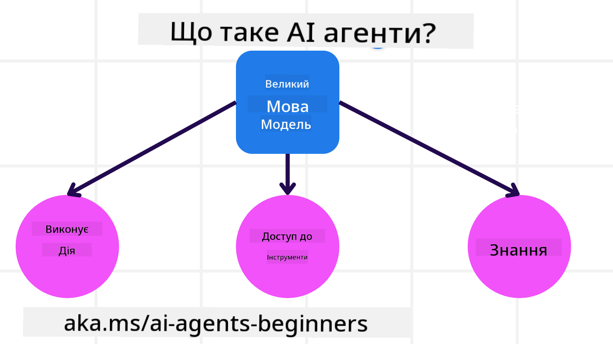
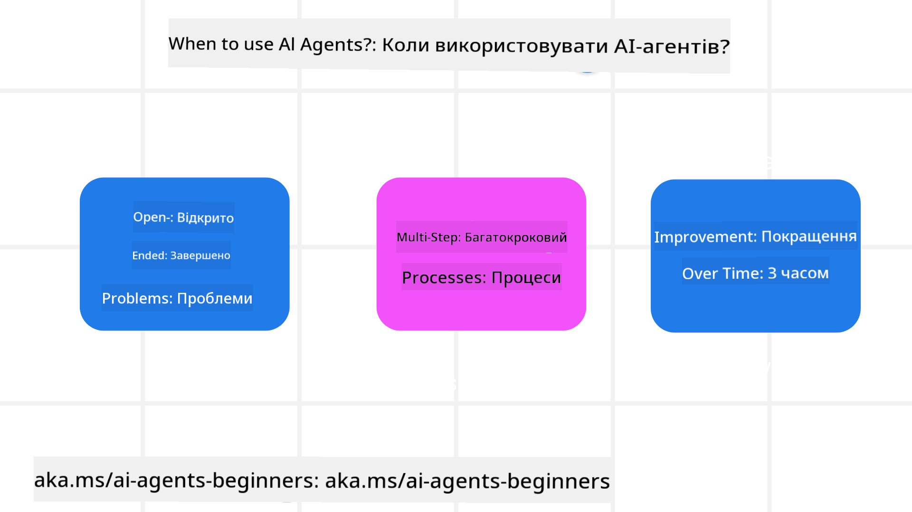

<!--
CO_OP_TRANSLATOR_METADATA:
{
  "original_hash": "d84943abc8f001ad4670418d32c2d899",
  "translation_date": "2025-07-12T08:14:06+00:00",
  "source_file": "01-intro-to-ai-agents/README.md",
  "language_code": "uk"
}
-->
щоб познайомитися з іншими учнями та розробниками AI агентів і поставити будь-які питання щодо цього курсу.

Щоб розпочати цей курс, ми спочатку краще зрозуміємо, що таке AI агенти і як ми можемо їх використовувати у додатках та робочих процесах, які створюємо.

## Вступ

У цьому уроці розглядаються:

- Що таке AI агенти і які існують типи агентів?
- Для яких випадків використання AI агенти підходять найкраще і як вони можуть нам допомогти?
- Які основні складові слід враховувати при проєктуванні агентних рішень?

## Цілі навчання
Після завершення цього уроку ви зможете:

- Розуміти концепції AI агентів і чим вони відрізняються від інших AI рішень.
- Найефективніше застосовувати AI агентів.
- Продуктивно проєктувати агентні рішення як для користувачів, так і для клієнтів.

## Визначення AI агентів та типи AI агентів

### Що таке AI агенти?

AI агенти — це **системи**, які дозволяють **великим мовним моделям (LLMs)** **виконувати дії**, розширюючи їх можливості шляхом надання LLM доступу до **інструментів** та **знань**.

Розберемо це визначення на частини:

- **Система** — важливо розглядати агентів не як окремий компонент, а як систему з багатьох компонентів. На базовому рівні компоненти AI агента такі:
  - **Середовище** — визначений простір, у якому працює AI агент. Наприклад, якщо у нас є AI агент для бронювання подорожей, середовищем може бути система бронювання, яку агент використовує для виконання завдань.
  - **Датчики** — середовища містять інформацію і надають зворотний зв’язок. AI агенти використовують датчики для збору та інтерпретації інформації про поточний стан середовища. У прикладі з агентом бронювання подорожей система може надавати інформацію про наявність готелів або ціни на авіаквитки.
  - **Актуатори** — отримавши поточний стан середовища, агент визначає, яку дію виконати для зміни середовища. Для агента бронювання це може бути бронювання доступного номера для користувача.

**Великі мовні моделі** — концепція агентів існувала ще до появи LLM. Перевага створення AI агентів на основі LLM полягає в їх здатності інтерпретувати людську мову та дані. Це дозволяє LLM інтерпретувати інформацію про середовище і формувати план для його зміни.

**Виконання дій** — поза системами AI агентів LLM обмежені ситуаціями, де дія полягає у генерації контенту або інформації на основі запиту користувача. У системах AI агентів LLM можуть виконувати завдання, інтерпретуючи запит користувача і використовуючи інструменти, доступні у їхньому середовищі.

**Доступ до інструментів** — які інструменти доступні LLM визначається 1) середовищем, у якому він працює, та 2) розробником AI агента. У прикладі з агентом подорожей інструменти агента обмежені операціями, доступними у системі бронювання, і/або розробник може обмежити доступ агента лише до бронювання авіаквитків.

**Пам’ять і знання** — пам’ять може бути короткостроковою у контексті розмови між користувачем і агентом. У довгостроковій перспективі, окрім інформації, наданої середовищем, AI агенти можуть також отримувати знання з інших систем, сервісів, інструментів і навіть інших агентів. У прикладі з агентом подорожей це можуть бути дані про переваги користувача, що зберігаються у базі даних клієнтів.

### Різні типи агентів

Тепер, коли ми маємо загальне визначення AI агентів, розглянемо деякі конкретні типи агентів і як вони застосовуються у агенті для бронювання подорожей.

| **Тип агента**                | **Опис**                                                                                                                           | **Приклад**                                                                                                                                                                                                                   |
| ----------------------------- | --------------------------------------------------------------------------------------------------------------------------------- | ----------------------------------------------------------------------------------------------------------------------------------------------------------------------------------------------------------------------------- |
| **Прості рефлексні агенти**   | Виконують негайні дії на основі заздалегідь визначених правил.                                                                    | Агент подорожей інтерпретує контекст електронного листа і пересилає скарги на подорожі до служби підтримки клієнтів.                                                                                                          |
| **Рефлексні агенти на основі моделі** | Виконують дії на основі моделі світу та змін у цій моделі.                                                                       | Агент подорожей пріоритезує маршрути з суттєвими змінами цін, використовуючи доступ до історичних даних про ціни.                                                                                                             |
| **Агенти, орієнтовані на ціль** | Створюють плани для досягнення конкретних цілей, інтерпретуючи ціль і визначаючи дії для її досягнення.                            | Агент подорожей бронює поїздку, визначаючи необхідні транспортні засоби (авто, громадський транспорт, авіарейси) від поточного місця до пункту призначення.                                                                    |
| **Агенти, орієнтовані на корисність** | Враховують переваги і чисельно зважують компроміси для визначення способу досягнення цілей.                                      | Агент подорожей максимізує корисність, зважуючи зручність і вартість при бронюванні подорожі.                                                                                                                                  |
| **Навчаючі агенти**           | Покращуються з часом, реагуючи на зворотний зв’язок і відповідно коригуючи дії.                                                   | Агент подорожей покращується, використовуючи відгуки клієнтів з опитувань після поїздки для коригування майбутніх бронювань.                                                                                                   |
| **Ієрархічні агенти**         | Містять кілька агентів у багаторівневій системі, де агенти вищого рівня розбивають завдання на підзавдання для агентів нижчого рівня. | Агент подорожей скасовує поїздку, розбиваючи завдання на підзавдання (наприклад, скасування конкретних бронювань) і делегуючи їх агентам нижчого рівня, які звітують вищому агенту.                                               |
| **Системи з кількома агентами (MAS)** | Агенти виконують завдання незалежно, співпрацюючи або конкуруючи.                                                               | Співпраця: кілька агентів бронюють різні послуги, такі як готелі, авіарейси та розваги. Конкуренція: кілька агентів керують і конкурують за спільний календар бронювання готелю, щоб розмістити клієнтів.                      |

## Коли використовувати AI агентів

У попередньому розділі ми використали приклад агента подорожей, щоб пояснити, як різні типи агентів можуть застосовуватися у різних сценаріях бронювання. Ми продовжимо використовувати цей приклад протягом усього курсу.

Розглянемо типи випадків використання, для яких AI агенти підходять найкраще:

- **Відкриті проблеми** — дозволяють LLM визначати необхідні кроки для виконання завдання, оскільки їх не завжди можна жорстко закодувати у робочому процесі.
- **Багатокрокові процеси** — завдання, що вимагають складності, коли AI агенту потрібно використовувати інструменти або інформацію протягом кількох кроків, а не одноразово.
- **Покращення з часом** — завдання, де агент може покращуватися, отримуючи зворотний зв’язок від середовища або користувачів для надання кращої корисності.

Більше про особливості використання AI агентів ми розглянемо у уроці "Створення надійних AI агентів".

## Основи агентних рішень

### Розробка агентів

Перший крок у проєктуванні системи AI агента — визначити інструменти, дії та поведінку. У цьому курсі ми зосереджуємося на використанні **Azure AI Agent Service** для визначення наших агентів. Він пропонує такі можливості:

- Вибір відкритих моделей, таких як OpenAI, Mistral і Llama
- Використання ліцензованих даних від провайдерів, наприклад Tripadvisor
- Використання стандартизованих інструментів OpenAPI 3.0

### Агентні патерни

Спілкування з LLM відбувається через підказки (prompts). Через напівавтономний характер AI агентів не завжди можливо або потрібно вручну повторно надсилати підказки LLM після зміни середовища. Ми використовуємо **агентні патерни**, які дозволяють масштабовано надсилати підказки LLM протягом кількох кроків.

Цей курс поділений на деякі з популярних на сьогодні агентних патернів.

### Агентні фреймворки

Агентні фреймворки дозволяють розробникам реалізовувати агентні патерни через код. Ці фреймворки пропонують шаблони, плагіни та інструменти для кращої співпраці AI агентів. Це забезпечує кращу спостережуваність і налагодження систем AI агентів.

У цьому курсі ми дослідимо дослідницький фреймворк AutoGen і готовий до виробництва Agent фреймворк від Semantic Kernel.

## Попередній урок

[Налаштування курсу](../00-course-setup/README.md)

## Наступний урок

[Огляд агентних фреймворків](../02-explore-agentic-frameworks/README.md)

**Відмова від відповідальності**:  
Цей документ було перекладено за допомогою сервісу автоматичного перекладу [Co-op Translator](https://github.com/Azure/co-op-translator). Хоча ми прагнемо до точності, будь ласка, майте на увазі, що автоматичні переклади можуть містити помилки або неточності. Оригінальний документ рідною мовою слід вважати авторитетним джерелом. Для критично важливої інформації рекомендується звертатися до професійного людського перекладу. Ми не несемо відповідальності за будь-які непорозуміння або неправильні тлумачення, що виникли внаслідок використання цього перекладу.