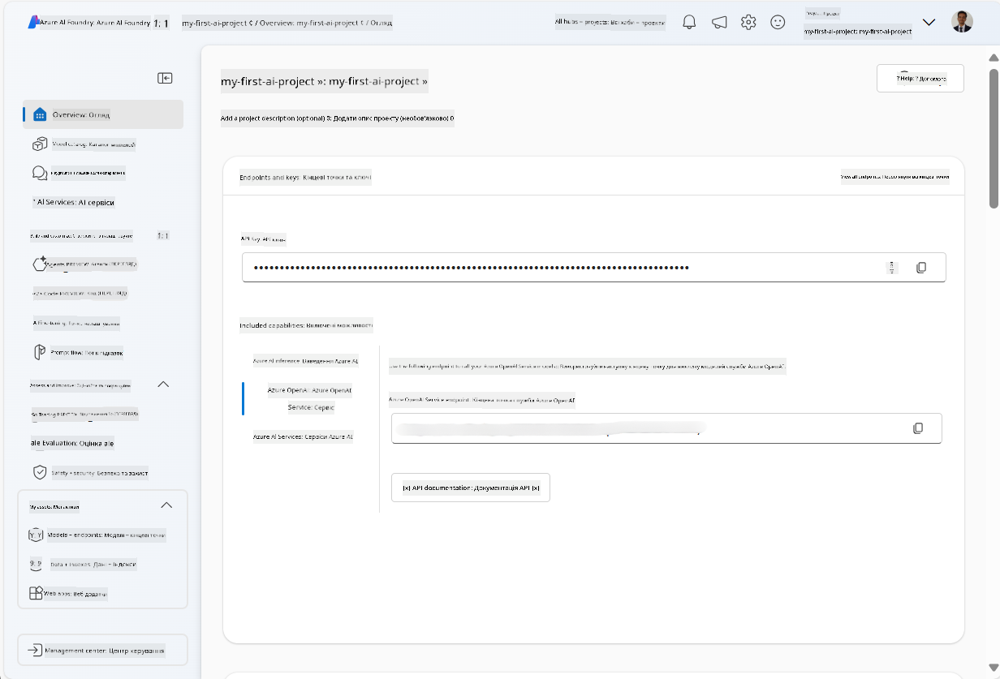
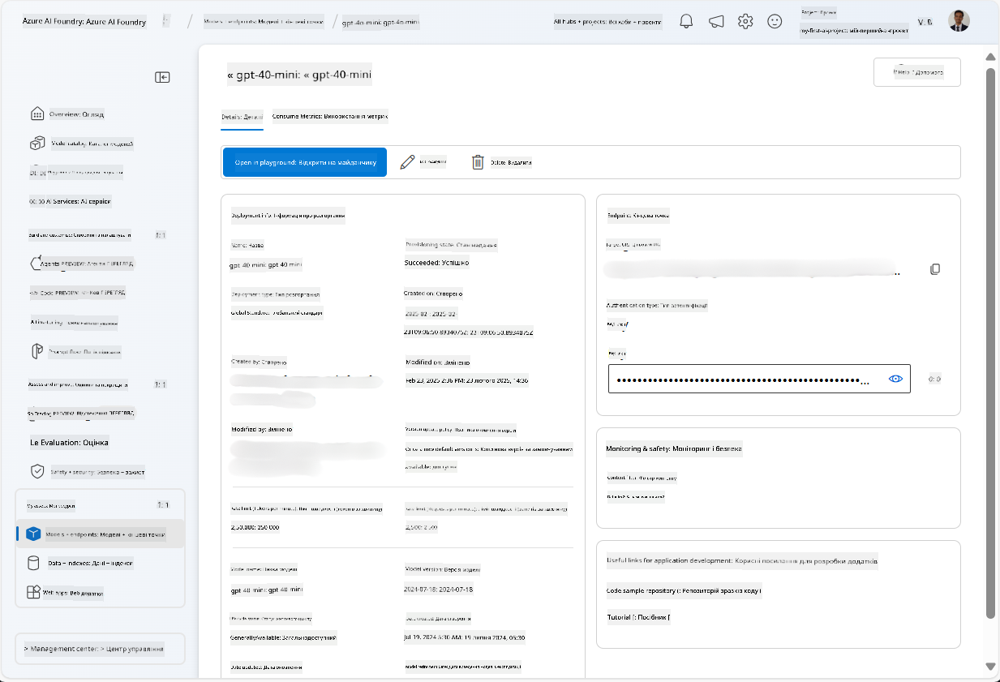
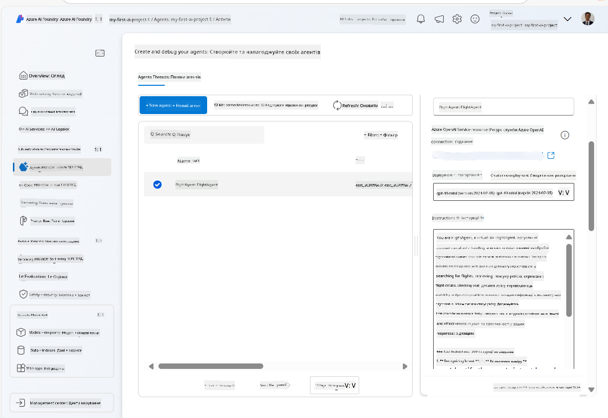
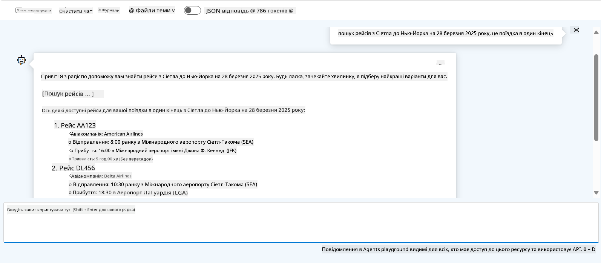

<!--
CO_OP_TRANSLATOR_METADATA:
{
  "original_hash": "7e92870dc0843e13d4dabc620c09d2d9",
  "translation_date": "2025-07-12T08:23:41+00:00",
  "source_file": "02-explore-agentic-frameworks/azure-ai-foundry-agent-creation.md",
  "language_code": "uk"
}
-->
# Розробка сервісу Azure AI Agent

У цьому завданні ви використовуєте інструменти сервісу Azure AI Agent у [порталі Azure AI Foundry](https://ai.azure.com/?WT.mc_id=academic-105485-koreyst) для створення агента для бронювання авіарейсів. Агент зможе взаємодіяти з користувачами та надавати інформацію про рейси.

## Необхідні умови

Для виконання цього завдання вам знадобиться:
1. Обліковий запис Azure з активною підпискою. [Створіть обліковий запис безкоштовно](https://azure.microsoft.com/free/?WT.mc_id=academic-105485-koreyst).
2. Права для створення Azure AI Foundry hub або наявність вже створеного для вас.
    - Якщо ваша роль — Contributor або Owner, ви можете слідувати крокам цього посібника.

## Створення Azure AI Foundry hub

> **Note:** Azure AI Foundry раніше називався Azure AI Studio.

1. Дотримуйтесь інструкцій із [блогу Azure AI Foundry](https://learn.microsoft.com/en-us/azure/ai-studio/?WT.mc_id=academic-105485-koreyst) для створення Azure AI Foundry hub.
2. Коли ваш проєкт буде створено, закрийте всі підказки, що з’являться, і перегляньте сторінку проєкту в порталі Azure AI Foundry, яка має виглядати приблизно так:

    

## Розгортання моделі

1. У лівій панелі вашого проєкту в розділі **My assets** виберіть сторінку **Models + endpoints**.
2. На сторінці **Models + endpoints** у вкладці **Model deployments** у меню **+ Deploy model** виберіть **Deploy base model**.
3. Знайдіть у списку модель `gpt-4o-mini`, виберіть її та підтвердіть.

    > **Note**: Зменшення TPM допомагає уникнути перевищення квоти, доступної у вашій підписці.

    

## Створення агента

Тепер, коли модель розгорнута, можна створити агента. Агент — це модель розмовного штучного інтелекту, яка може взаємодіяти з користувачами.

1. У лівій панелі вашого проєкту в розділі **Build & Customize** виберіть сторінку **Agents**.
2. Натисніть **+ Create agent** для створення нового агента. У діалоговому вікні **Agent Setup**:
    - Введіть ім’я агента, наприклад `FlightAgent`.
    - Переконайтеся, що вибрана модель розгортання `gpt-4o-mini`, створена раніше.
    - Встановіть **Instructions** відповідно до підказки, якій агент має слідувати. Ось приклад:
    ```
    You are FlightAgent, a virtual assistant specialized in handling flight-related queries. Your role includes assisting users with searching for flights, retrieving flight details, checking seat availability, and providing real-time flight status. Follow the instructions below to ensure clarity and effectiveness in your responses:

    ### Task Instructions:
    1. **Recognizing Intent**:
       - Identify the user's intent based on their request, focusing on one of the following categories:
         - Searching for flights
         - Retrieving flight details using a flight ID
         - Checking seat availability for a specified flight
         - Providing real-time flight status using a flight number
       - If the intent is unclear, politely ask users to clarify or provide more details.
        
    2. **Processing Requests**:
        - Depending on the identified intent, perform the required task:
        - For flight searches: Request details such as origin, destination, departure date, and optionally return date.
        - For flight details: Request a valid flight ID.
        - For seat availability: Request the flight ID and date and validate inputs.
        - For flight status: Request a valid flight number.
        - Perform validations on provided data (e.g., formats of dates, flight numbers, or IDs). If the information is incomplete or invalid, return a friendly request for clarification.

    3. **Generating Responses**:
    - Use a tone that is friendly, concise, and supportive.
    - Provide clear and actionable suggestions based on the output of each task.
    - If no data is found or an error occurs, explain it to the user gently and offer alternative actions (e.g., refine search, try another query).
    
    ```
> [!NOTE]
> Для детальної підказки ви можете переглянути [цей репозиторій](https://github.com/ShivamGoyal03/RoamMind) для додаткової інформації.
    
> Крім того, ви можете додати **Knowledge Base** та **Actions**, щоб розширити можливості агента, надаючи більше інформації та виконуючи автоматизовані завдання на основі запитів користувачів. Для цього завдання ці кроки можна пропустити.
    


3. Щоб створити нового мульти-ШІ агента, просто натисніть **New Agent**. Новостворений агент з’явиться на сторінці Agents.

## Тестування агента

Після створення агента ви можете протестувати його, щоб побачити, як він відповідає на запити користувачів у середовищі Azure AI Foundry portal playground.

1. У верхній частині панелі **Setup** для вашого агента виберіть **Try in playground**.
2. У панелі **Playground** ви можете взаємодіяти з агентом, вводячи запити у вікні чату. Наприклад, можна попросити агента знайти рейси з Сіетла до Нью-Йорка на 28 число.

    > **Note**: Агент може не надавати точних відповідей, оскільки в цьому завданні не використовується актуальна інформація в реальному часі. Мета — перевірити здатність агента розуміти та відповідати на запити користувачів на основі заданих інструкцій.

    

3. Після тестування агента ви можете додатково налаштувати його, додаючи більше намірів, тренувальних даних та дій для розширення його можливостей.

## Очищення ресурсів

Після завершення тестування агента ви можете видалити його, щоб уникнути додаткових витрат.
1. Відкрийте [Azure портал](https://portal.azure.com) і перегляньте вміст групи ресурсів, де ви розгорнули ресурси hub, використані в цьому завданні.
2. На панелі інструментів виберіть **Delete resource group**.
3. Введіть назву групи ресурсів і підтвердіть її видалення.

## Ресурси

- [Документація Azure AI Foundry](https://learn.microsoft.com/en-us/azure/ai-studio/?WT.mc_id=academic-105485-koreyst)
- [Портал Azure AI Foundry](https://ai.azure.com/?WT.mc_id=academic-105485-koreyst)
- [Початок роботи з Azure AI Studio](https://techcommunity.microsoft.com/blog/educatordeveloperblog/getting-started-with-azure-ai-studio/4095602?WT.mc_id=academic-105485-koreyst)
- [Основи AI агентів на Azure](https://learn.microsoft.com/en-us/training/modules/ai-agent-fundamentals/?WT.mc_id=academic-105485-koreyst)
- [Azure AI Discord](https://aka.ms/AzureAI/Discord)

**Відмова від відповідальності**:  
Цей документ було перекладено за допомогою сервісу автоматичного перекладу [Co-op Translator](https://github.com/Azure/co-op-translator). Хоча ми прагнемо до точності, будь ласка, майте на увазі, що автоматичні переклади можуть містити помилки або неточності. Оригінальний документ рідною мовою слід вважати авторитетним джерелом. Для критично важливої інформації рекомендується звертатися до професійного людського перекладу. Ми не несемо відповідальності за будь-які непорозуміння або неправильні тлумачення, що виникли внаслідок використання цього перекладу.