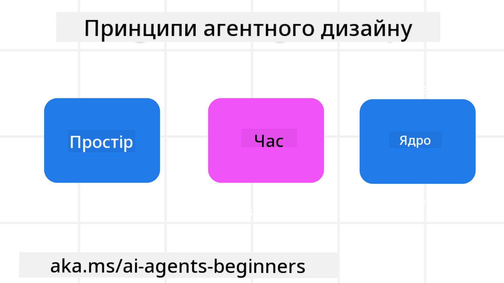

<!--
CO_OP_TRANSLATOR_METADATA:
{
  "original_hash": "4c46e4ff9e349c521e2b0b17f51afa64",
  "translation_date": "2025-08-29T23:48:06+00:00",
  "source_file": "03-agentic-design-patterns/README.md",
  "language_code": "uk"
}
-->

> _(Натисніть на зображення вище, щоб переглянути відео цього уроку)_
# Принципи дизайну агентів штучного інтелекту

## Вступ

Існує багато способів мислення про створення агентних систем штучного інтелекту. Оскільки неоднозначність є особливістю, а не недоліком у дизайні генеративного штучного інтелекту, інженерам іноді важко зрозуміти, з чого почати. Ми створили набір принципів дизайну UX, орієнтованих на людину, щоб допомогти розробникам створювати агентні системи, орієнтовані на клієнта, для вирішення їхніх бізнес-завдань. Ці принципи дизайну не є обов’язковою архітектурою, а скоріше відправною точкою для команд, які визначають і створюють досвід взаємодії з агентами.

Загалом, агенти повинні:

- Розширювати та масштабувати людські можливості (генерація ідей, вирішення проблем, автоматизація тощо)
- Заповнювати прогалини в знаннях (допомагати швидко освоювати нові знання, переклад тощо)
- Сприяти та підтримувати співпрацю у спосіб, який відповідає нашим індивідуальним уподобанням у роботі з іншими
- Робити нас кращими версіями самих себе (наприклад, коуч із життя/майстер завдань, допомога у навчанні навичкам емоційної регуляції та усвідомленості, розвиток стійкості тощо)

## Цей урок охоплює

- Що таке принципи дизайну агентів
- Які рекомендації слід враховувати під час впровадження цих принципів дизайну
- Приклади використання принципів дизайну

## Цілі навчання

Після завершення цього уроку ви зможете:

1. Пояснити, що таке принципи дизайну агентів
2. Пояснити рекомендації щодо використання принципів дизайну агентів
3. Зрозуміти, як створити агента, використовуючи принципи дизайну агентів

## Принципи дизайну агентів

### Агент (Простір)

Це середовище, в якому працює агент. Ці принципи визначають, як ми проектуємо агентів для взаємодії у фізичних і цифрових світах.

- **З’єднувати, а не руйнувати** – допомагати людям з’єднуватися з іншими людьми, подіями та корисними знаннями для сприяння співпраці та зв’язку.
  - Агенти допомагають з’єднувати події, знання та людей.
  - Агенти зближують людей. Вони не призначені для заміни чи приниження людей.
- **Легко доступні, але іноді невидимі** – агент здебільшого працює у фоновому режимі та лише нагадує про себе, коли це доречно та актуально.
  - Агент легко доступний для авторизованих користувачів на будь-якому пристрої чи платформі.
  - Агент підтримує мультимодальні введення та виведення (звук, голос, текст тощо).
  - Агент може безперешкодно переходити між переднім і фоновим режимами; між проактивним і реактивним, залежно від потреб користувача.
  - Агент може працювати у невидимій формі, але його фоновий процес і співпраця з іншими агентами є прозорими та контрольованими користувачем.

### Агент (Час)

Це те, як агент працює з часом. Ці принципи визначають, як ми проектуємо агентів для взаємодії з минулим, теперішнім і майбутнім.

- **Минуле**: Рефлексія на історію, яка включає як стан, так і контекст.
  - Агент надає більш релевантні результати на основі аналізу багатших історичних даних, а не лише подій, людей чи станів.
  - Агент створює зв’язки з минулими подіями та активно рефлексує на пам’ять, щоб взаємодіяти з поточними ситуаціями.
- **Теперішнє**: Підштовхування, а не просто сповіщення.
  - Агент втілює комплексний підхід до взаємодії з людьми. Коли відбувається подія, агент виходить за межі статичного сповіщення чи іншої формальності. Агент може спрощувати процеси або динамічно генерувати підказки, щоб привернути увагу користувача в потрібний момент.
  - Агент надає інформацію на основі контексту, соціальних і культурних змін, адаптуючи її до намірів користувача.
  - Взаємодія з агентом може бути поступовою, розвиваючись/зростаючи в складності, щоб довгостроково розширювати можливості користувачів.
- **Майбутнє**: Адаптація та еволюція.
  - Агент адаптується до різних пристроїв, платформ і модальностей.
  - Агент адаптується до поведінки користувача, потреб у доступності та є вільно налаштовуваним.
  - Агент формується та еволюціонує через постійну взаємодію з користувачем.

### Агент (Ядро)

Це ключові елементи в основі дизайну агента.

- **Приймати невизначеність, але встановлювати довіру**.
  - Очікується певний рівень невизначеності агента. Невизначеність є ключовим елементом дизайну агента.
  - Довіра та прозорість є фундаментальними шарами дизайну агента.
  - Люди контролюють, коли агент увімкнений/вимкнений, і статус агента завжди чітко видно.

## Рекомендації щодо впровадження цих принципів

Коли ви використовуєте наведені вище принципи дизайну, дотримуйтесь наступних рекомендацій:

1. **Прозорість**: Інформуйте користувача про те, що залучений штучний інтелект, як він функціонує (включаючи минулі дії), як надати зворотний зв’язок і змінити систему.
2. **Контроль**: Дозвольте користувачеві налаштовувати, вказувати уподобання та персоналізувати, а також контролювати систему та її атрибути (включаючи можливість забути).
3. **Послідовність**: Створюйте послідовний, мультимодальний досвід на різних пристроях і точках доступу. Використовуйте знайомі елементи UI/UX, де це можливо (наприклад, значок мікрофона для голосової взаємодії) і максимально зменшуйте когнітивне навантаження користувача (наприклад, прагніть до стислих відповідей, візуальних підказок і контенту «Дізнатися більше»).

## Як створити туристичного агента, використовуючи ці принципи та рекомендації

Уявіть, що ви створюєте туристичного агента, ось як ви могли б подумати про використання принципів дизайну та рекомендацій:

1. **Прозорість** – Повідомте користувача, що туристичний агент є агентом, керованим штучним інтелектом. Надати базові інструкції щодо початку роботи (наприклад, повідомлення «Привіт», зразки підказок). Чітко задокументуйте це на сторінці продукту. Показуйте список підказок, які користувач задавав у минулому. Зробіть зрозумілим, як надати зворотний зв’язок (палець вгору і вниз, кнопка «Надіслати відгук» тощо). Чітко поясніть, чи є у агента обмеження щодо використання або тем.
2. **Контроль** – Переконайтеся, що зрозуміло, як користувач може змінити агента після його створення, наприклад, за допомогою системного підказки. Дозвольте користувачеві вибирати, наскільки детальним буде агент, його стиль написання та будь-які застереження щодо того, про що агент не повинен говорити. Дозвольте користувачеві переглядати та видаляти будь-які пов’язані файли чи дані, підказки та минулі розмови.
3. **Послідовність** – Переконайтеся, що значки для спільного використання підказки, додавання файлу чи фото та позначення когось або чогось є стандартними та впізнаваними. Використовуйте значок скріпки, щоб позначити завантаження/обмін файлами з агентом, і значок зображення, щоб позначити завантаження графіки.

### Є додаткові запитання щодо шаблонів дизайну агентів штучного інтелекту?

Приєднуйтесь до [Azure AI Foundry Discord](https://aka.ms/ai-agents/discord), щоб зустрітися з іншими учнями, відвідати години консультацій і отримати відповіді на ваші запитання щодо агентів штучного інтелекту.

## Додаткові ресурси

## Попередній урок

[Дослідження агентних фреймворків](../02-explore-agentic-frameworks/README.md)

## Наступний урок

[Шаблон дизайну використання інструментів](../04-tool-use/README.md)

---

**Відмова від відповідальності**:  
Цей документ був перекладений за допомогою сервісу автоматичного перекладу [Co-op Translator](https://github.com/Azure/co-op-translator). Хоча ми прагнемо до точності, будь ласка, майте на увазі, що автоматичні переклади можуть містити помилки або неточності. Оригінальний документ на його рідній мові слід вважати авторитетним джерелом. Для критичної інформації рекомендується професійний людський переклад. Ми не несемо відповідальності за будь-які непорозуміння або неправильні тлумачення, що виникають внаслідок використання цього перекладу.