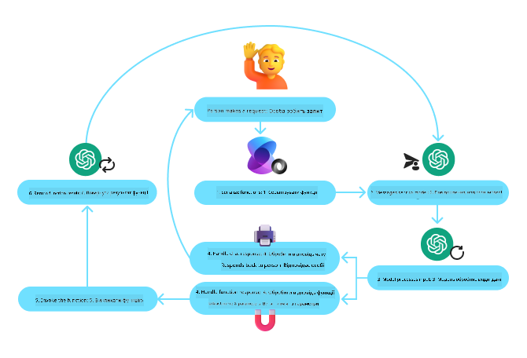
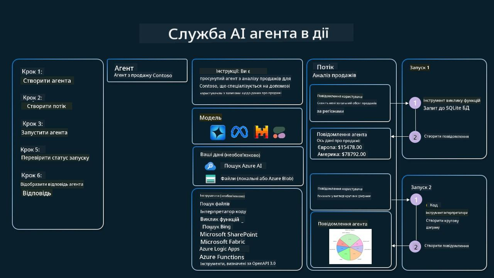

<!--
CO_OP_TRANSLATOR_METADATA:
{
  "original_hash": "88258b03f2893aa2e69eb8fb24baabbc",
  "translation_date": "2025-07-12T09:47:56+00:00",
  "source_file": "04-tool-use/README.md",
  "language_code": "uk"
}
-->
[](https://youtu.be/vieRiPRx-gI?si=cEZ8ApnT6Sus9rhn)

> _(Натисніть на зображення вище, щоб переглянути відео цього уроку)_

# Патерн дизайну використання інструментів

Інструменти цікаві тим, що дозволяють AI-агентам мати ширший спектр можливостей. Замість того, щоб агент мав обмежений набір дій, які він може виконувати, додавання інструменту дає змогу агенту виконувати широкий спектр дій. У цій главі ми розглянемо патерн дизайну використання інструментів, який описує, як AI-агенти можуть використовувати конкретні інструменти для досягнення своїх цілей.

## Вступ

У цьому уроці ми прагнемо відповісти на такі питання:

- Що таке патерн дизайну використання інструментів?
- Для яких випадків його можна застосовувати?
- Які елементи/будівельні блоки потрібні для реалізації цього патерну?
- Які особливі моменти слід враховувати при використанні патерну дизайну використання інструментів для створення надійних AI-агентів?

## Цілі навчання

Після проходження цього уроку ви зможете:

- Визначити патерн дизайну використання інструментів та його призначення.
- Виявляти випадки, де застосовується патерн дизайну використання інструментів.
- Розуміти ключові елементи, необхідні для реалізації патерну.
- Визначати особливості, що забезпечують надійність AI-агентів, які використовують цей патерн.

## Що таке патерн дизайну використання інструментів?

**Патерн дизайну використання інструментів** зосереджений на наданні LLM можливості взаємодіяти з зовнішніми інструментами для досягнення конкретних цілей. Інструменти — це код, який агент може виконувати для здійснення дій. Інструментом може бути проста функція, наприклад калькулятор, або виклик API стороннього сервісу, наприклад, для отримання цін на акції чи прогнозу погоди. У контексті AI-агентів інструменти розроблені так, щоб їх можна було виконувати у відповідь на **виклики функцій, згенеровані моделлю**.

## Для яких випадків його можна застосовувати?

AI-агенти можуть використовувати інструменти для виконання складних завдань, отримання інформації або прийняття рішень. Патерн дизайну використання інструментів часто застосовується у сценаріях, що потребують динамічної взаємодії із зовнішніми системами, такими як бази даних, веб-сервіси або інтерпретатори коду. Ця можливість корисна для різних випадків, зокрема:

- **Динамічне отримання інформації:** агенти можуть звертатися до зовнішніх API або баз даних для отримання актуальних даних (наприклад, запити до бази SQLite для аналізу даних, отримання цін на акції чи інформації про погоду).
- **Виконання та інтерпретація коду:** агенти можуть запускати код або скрипти для розв’язання математичних задач, створення звітів або проведення симуляцій.
- **Автоматизація робочих процесів:** автоматизація повторюваних або багатокрокових процесів за допомогою інтеграції інструментів, таких як планувальники завдань, сервіси електронної пошти або конвеєри обробки даних.
- **Підтримка клієнтів:** агенти можуть взаємодіяти з CRM-системами, платформами для обробки заявок або базами знань для вирішення запитів користувачів.
- **Генерація та редагування контенту:** агенти можуть використовувати інструменти, такі як перевірка граматики, підсумовувачі тексту або оцінювачі безпеки контенту, щоб допомагати у створенні матеріалів.

## Які елементи/будівельні блоки потрібні для реалізації патерну використання інструментів?

Ці будівельні блоки дозволяють AI-агенту виконувати широкий спектр завдань. Розглянемо ключові елементи, необхідні для реалізації патерну дизайну використання інструментів:

- **Схеми функцій/інструментів**: детальні описи доступних інструментів, включно з назвою функції, призначенням, необхідними параметрами та очікуваними результатами. Ці схеми допомагають LLM розуміти, які інструменти доступні і як формувати коректні запити.

- **Логіка виконання функцій**: визначає, як і коли викликати інструменти на основі намірів користувача та контексту розмови. Це може включати модулі планування, механізми маршрутизації або умовні потоки, які динамічно визначають використання інструментів.

- **Система обробки повідомлень**: компоненти, що керують потоком розмови між введеннями користувача, відповідями LLM, викликами інструментів та їх результатами.

- **Фреймворк інтеграції інструментів**: інфраструктура, що з’єднує агента з різними інструментами, будь то прості функції чи складні зовнішні сервіси.

- **Обробка помилок та валідація**: механізми для обробки збоїв при виконанні інструментів, перевірки параметрів і керування несподіваними відповідями.

- **Управління станом**: відстеження контексту розмови, попередніх взаємодій з інструментами та збережених даних для забезпечення послідовності у багатокрокових діалогах.

Далі розглянемо детальніше виклик функцій/інструментів.

### Виклик функцій/інструментів

Виклик функцій — це основний спосіб, яким ми дозволяємо великим мовним моделям (LLM) взаємодіяти з інструментами. Часто терміни «функція» та «інструмент» використовуються як синоніми, оскільки «функції» (блоки повторно використовуваного коду) є «інструментами», які агенти застосовують для виконання завдань. Щоб викликати код функції, LLM має порівняти запит користувача з описом функції. Для цього LLM отримує схему, що містить описи всіх доступних функцій. Потім LLM обирає найбільш відповідну функцію для завдання і повертає її назву та аргументи. Обрана функція виконується, її відповідь надсилається назад до LLM, який використовує цю інформацію для відповіді на запит користувача.

Розробникам для реалізації виклику функцій для агентів потрібні:

1. Модель LLM, що підтримує виклик функцій
2. Схема з описами функцій
3. Код для кожної описаної функції

Розглянемо приклад отримання поточного часу в місті:

1. **Ініціалізувати LLM, що підтримує виклик функцій:**

    Не всі моделі підтримують виклик функцій, тому важливо перевірити, чи підтримує це ваша модель. <a href="https://learn.microsoft.com/azure/ai-services/openai/how-to/function-calling" target="_blank">Azure OpenAI</a> підтримує виклик функцій. Почнемо з ініціалізації клієнта Azure OpenAI.

    ```python
    # Initialize the Azure OpenAI client
    client = AzureOpenAI(
        azure_endpoint = os.getenv("AZURE_OPENAI_ENDPOINT"), 
        api_key=os.getenv("AZURE_OPENAI_API_KEY"),  
        api_version="2024-05-01-preview"
    )
    ```

1. **Створити схему функції:**

    Далі визначимо JSON-схему, що містить назву функції, опис її призначення та назви й описи параметрів функції. Потім передамо цю схему клієнту разом із запитом користувача на визначення часу в Сан-Франциско. Важливо зауважити, що повертається **виклик інструменту**, а **не** остаточна відповідь на запит. Як було сказано раніше, LLM повертає назву обраної функції та аргументи, які будуть передані.

    ```python
    # Function description for the model to read
    tools = [
        {
            "type": "function",
            "function": {
                "name": "get_current_time",
                "description": "Get the current time in a given location",
                "parameters": {
                    "type": "object",
                    "properties": {
                        "location": {
                            "type": "string",
                            "description": "The city name, e.g. San Francisco",
                        },
                    },
                    "required": ["location"],
                },
            }
        }
    ]
    ```
   
    ```python
  
    # Initial user message
    messages = [{"role": "user", "content": "What's the current time in San Francisco"}] 
  
    # First API call: Ask the model to use the function
      response = client.chat.completions.create(
          model=deployment_name,
          messages=messages,
          tools=tools,
          tool_choice="auto",
      )
  
      # Process the model's response
      response_message = response.choices[0].message
      messages.append(response_message)
  
      print("Model's response:")  

      print(response_message)
  
    ```

    ```bash
    Model's response:
    ChatCompletionMessage(content=None, role='assistant', function_call=None, tool_calls=[ChatCompletionMessageToolCall(id='call_pOsKdUlqvdyttYB67MOj434b', function=Function(arguments='{"location":"San Francisco"}', name='get_current_time'), type='function')])
    ```
  
1. **Код функції для виконання завдання:**

    Тепер, коли LLM вибрав функцію, яку потрібно виконати, необхідно реалізувати та запустити код, що виконує завдання. Ми можемо реалізувати код для отримання поточного часу на Python. Також потрібно написати код для вилучення назви функції та аргументів із response_message, щоб отримати кінцевий результат.

    ```python
      def get_current_time(location):
        """Get the current time for a given location"""
        print(f"get_current_time called with location: {location}")  
        location_lower = location.lower()
        
        for key, timezone in TIMEZONE_DATA.items():
            if key in location_lower:
                print(f"Timezone found for {key}")  
                current_time = datetime.now(ZoneInfo(timezone)).strftime("%I:%M %p")
                return json.dumps({
                    "location": location,
                    "current_time": current_time
                })
      
        print(f"No timezone data found for {location_lower}")  
        return json.dumps({"location": location, "current_time": "unknown"})
    ```

    ```python
     # Handle function calls
      if response_message.tool_calls:
          for tool_call in response_message.tool_calls:
              if tool_call.function.name == "get_current_time":
     
                  function_args = json.loads(tool_call.function.arguments)
     
                  time_response = get_current_time(
                      location=function_args.get("location")
                  )
     
                  messages.append({
                      "tool_call_id": tool_call.id,
                      "role": "tool",
                      "name": "get_current_time",
                      "content": time_response,
                  })
      else:
          print("No tool calls were made by the model.")  
  
      # Second API call: Get the final response from the model
      final_response = client.chat.completions.create(
          model=deployment_name,
          messages=messages,
      )
  
      return final_response.choices[0].message.content
     ```

    ```bash
      get_current_time called with location: San Francisco
      Timezone found for san francisco
      The current time in San Francisco is 09:24 AM.
     ```

Виклик функцій є серцем більшості, якщо не всіх, патернів використання інструментів агентами, проте реалізувати його з нуля іноді буває складно. Як ми дізналися в [Уроці 2](../../../02-explore-agentic-frameworks), агентські фреймворки надають готові будівельні блоки для реалізації використання інструментів.

## Приклади використання інструментів з агентськими фреймворками

Ось кілька прикладів, як можна реалізувати патерн дизайну використання інструментів за допомогою різних агентських фреймворків:

### Semantic Kernel

<a href="https://learn.microsoft.com/azure/ai-services/agents/overview" target="_blank">Semantic Kernel</a> — це відкритий AI-фреймворк для розробників на .NET, Python та Java, які працюють з великими мовними моделями (LLM). Він спрощує процес використання виклику функцій, автоматично описуючи ваші функції та їх параметри моделі через процес, який називається <a href="https://learn.microsoft.com/semantic-kernel/concepts/ai-services/chat-completion/function-calling/?pivots=programming-language-python#1-serializing-the-functions" target="_blank">серіалізацією</a>. Також він керує двонаправленою комунікацією між моделлю та вашим кодом. Ще одна перевага використання агентського фреймворку, як Semantic Kernel, полягає в тому, що він дає доступ до готових інструментів, таких як <a href="https://github.com/microsoft/semantic-kernel/blob/main/python/samples/getting_started_with_agents/openai_assistant/step4_assistant_tool_file_search.py" target="_blank">Пошук файлів</a> та <a href="https://github.com/microsoft/semantic-kernel/blob/main/python/samples/getting_started_with_agents/openai_assistant/step3_assistant_tool_code_interpreter.py" target="_blank">Інтерпретатор коду</a>.

Наступна діаграма ілюструє процес виклику функцій у Semantic Kernel:



У Semantic Kernel функції/інструменти називаються <a href="https://learn.microsoft.com/semantic-kernel/concepts/plugins/?pivots=programming-language-python" target="_blank">плагінами</a>. Ми можемо перетворити функцію `get_current_time`, яку бачили раніше, на плагін, зробивши її класом із цією функцією всередині. Також можна імпортувати декоратор `kernel_function`, який приймає опис функції. Коли ви створюєте kernel з GetCurrentTimePlugin, kernel автоматично серіалізує функцію та її параметри, створюючи схему для надсилання LLM.

```python
from semantic_kernel.functions import kernel_function

class GetCurrentTimePlugin:
    async def __init__(self, location):
        self.location = location

    @kernel_function(
        description="Get the current time for a given location"
    )
    def get_current_time(location: str = ""):
        ...

```

```python 
from semantic_kernel import Kernel

# Create the kernel
kernel = Kernel()

# Create the plugin
get_current_time_plugin = GetCurrentTimePlugin(location)

# Add the plugin to the kernel
kernel.add_plugin(get_current_time_plugin)
```
  
### Azure AI Agent Service

<a href="https://learn.microsoft.com/azure/ai-services/agents/overview" target="_blank">Azure AI Agent Service</a> — це новіший агентський фреймворк, створений для того, щоб розробники могли безпечно будувати, розгортати та масштабувати високоякісних і розширюваних AI-агентів без необхідності керувати обчислювальними та сховищними ресурсами. Він особливо корисний для корпоративних застосунків, оскільки є повністю керованим сервісом із корпоративним рівнем безпеки.

Порівняно з розробкою безпосередньо через API LLM, Azure AI Agent Service має кілька переваг, зокрема:

- Автоматичний виклик інструментів — немає потреби розбирати виклик інструменту, запускати його та обробляти відповідь; усе це тепер виконується на сервері
- Безпечно керовані дані — замість управління власним станом розмови можна покладатися на threads, які зберігають усю необхідну інформацію
- Інструменти з коробки — інструменти для взаємодії з джерелами даних, такими як Bing, Azure AI Search та Azure Functions.

Інструменти, доступні в Azure AI Agent Service, можна поділити на дві категорії:

1. Інструменти знань:
    - <a href="https://learn.microsoft.com/azure/ai-services/agents/how-to/tools/bing-grounding?tabs=python&pivots=overview" target="_blank">Пошук Bing</a>
    - <a href="https://learn.microsoft.com/azure/ai-services/agents/how-to/tools/file-search?tabs=python&pivots=overview" target="_blank">Пошук файлів</a>
    - <a href="https://learn.microsoft.com/azure/ai-services/agents/how-to/tools/azure-ai-search?tabs=azurecli%2Cpython&pivots=overview-azure-ai-search" target="_blank">Azure AI Search</a>

2. Інструменти дій:
    - <a href="https://learn.microsoft.com/azure/ai-services/agents/how-to/tools/function-calling?tabs=python&pivots=overview" target="_blank">Виклик функцій</a>
    - <a href="https://learn.microsoft.com/azure/ai-services/agents/how-to/tools/code-interpreter?tabs=python&pivots=overview" target="_blank">Інтерпретатор коду</a>
    - <a href="https://learn.microsoft.com/azure/ai-services/agents/how-to/tools/openapi-spec?tabs=python&pivots=overview" target="_blank">Інструменти, визначені OpenAI</a>
    - <a href="https://learn.microsoft.com/azure/ai-services/agents/how-to/tools/azure-functions?pivots=overview" target="_blank">Azure Functions</a>

Agent Service дозволяє використовувати ці інструменти разом як `toolset`. Він також використовує `threads`, які відстежують історію повідомлень конкретної розмови.

Уявіть, що ви торговий агент у компанії Contoso. Ви хочете розробити розмовного агента, який зможе відповідати на питання про ваші дані продажів.

Наступне зображення ілюструє, як можна використати Azure AI Agent Service для аналізу даних продажів:



Щоб використовувати будь-який із цих інструментів із сервісом, ми можемо створити клієнта та визначити інструмент або набір інструментів. Для практичної реалізації можна використати наступний код на Python. LLM зможе переглянути toolset і вирішити, чи використовувати створену користувачем функцію `fetch_sales_data_using_sqlite_query`, чи вбудований Інтерпретатор коду залежно від запиту користувача.

```python 
import os
from azure.ai.projects import AIProjectClient
from azure.identity import DefaultAzureCredential
from fecth_sales_data_functions import fetch_sales_data_using_sqlite_query # fetch_sales_data_using_sqlite_query function which can be found in a fetch_sales_data_functions.py file.
from azure.ai.projects.models import ToolSet, FunctionTool, CodeInterpreterTool

project_client = AIProjectClient.from_connection_string(
    credential=DefaultAzureCredential(),
    conn_str=os.environ["PROJECT_CONNECTION_STRING"],
)

# Initialize function calling agent with the fetch_sales_data_using_sqlite_query function and adding it to the toolset
fetch_data_function = FunctionTool(fetch_sales_data_using_sqlite_query)
toolset = ToolSet()
toolset.add(fetch_data_function)

# Initialize Code Interpreter tool and adding it to the toolset. 
code_interpreter = code_interpreter = CodeInterpreterTool()
toolset = ToolSet()
toolset.add(code_interpreter)

agent = project_client.agents.create_agent(
    model="gpt-4o-mini", name="my-agent", instructions="You are helpful agent", 
    toolset=toolset
)
```

## Які особливі моменти слід враховувати при використанні патерну дизайну використання інструментів для створення надійних AI-агентів?

Поширена проблема з динамічно згенерованим SQL від LLM — це безпека, зокрема ризик SQL-ін’єкцій або шкідливих дій, таких як видалення чи пошкодження бази даних. Хоча ці побоювання обґрунтовані, їх можна ефективно зменшити, правильно налаштувавши права доступу до бази даних. Для більшості баз даних це означає налаштування бази у режимі лише для читання. Для сервісів баз даних, таких як PostgreSQL або Azure SQL, додатку слід призначити роль лише для читання (SELECT).

Запуск додатку у безпечному середовищі додатково підвищує захист. У корпоративних сценаріях дані зазвичай витягують і трансформують з операційних систем у базу даних або сховище даних лише для читання з дружньою схемою. Такий підхід гарантує, що дані захищені, оптимізовані для продуктивності та доступності, а додаток має обмежений доступ лише для читання

Azure AI Agents Service Workshop</a>
- <a href="https://github.com/Azure-Samples/contoso-creative-writer/tree/main/docs/workshop" target="_blank">Майстер-клас Contoso Creative Writer з багатофункціональними агентами</a>
- <a href="https://learn.microsoft.com/semantic-kernel/concepts/ai-services/chat-completion/function-calling/?pivots=programming-language-python#1-serializing-the-functions" target="_blank">Посібник з виклику функцій Semantic Kernel</a>
- <a href="https://github.com/microsoft/semantic-kernel/blob/main/python/samples/getting_started_with_agents/openai_assistant/step3_assistant_tool_code_interpreter.py" target="_blank">Інтерпретатор коду Semantic Kernel</a>
- <a href="https://microsoft.github.io/autogen/dev/user-guide/core-user-guide/components/tools.html" target="_blank">Інструменти Autogen</a>

## Попередній урок

[Розуміння агентних шаблонів проектування](../03-agentic-design-patterns/README.md)

## Наступний урок

[Agentic RAG](../05-agentic-rag/README.md)

**Відмова від відповідальності**:  
Цей документ було перекладено за допомогою сервісу автоматичного перекладу [Co-op Translator](https://github.com/Azure/co-op-translator). Хоча ми прагнемо до точності, будь ласка, майте на увазі, що автоматичні переклади можуть містити помилки або неточності. Оригінальний документ рідною мовою слід вважати авторитетним джерелом. Для критично важливої інформації рекомендується звертатися до професійного людського перекладу. Ми не несемо відповідальності за будь-які непорозуміння або неправильні тлумачення, що виникли внаслідок використання цього перекладу.