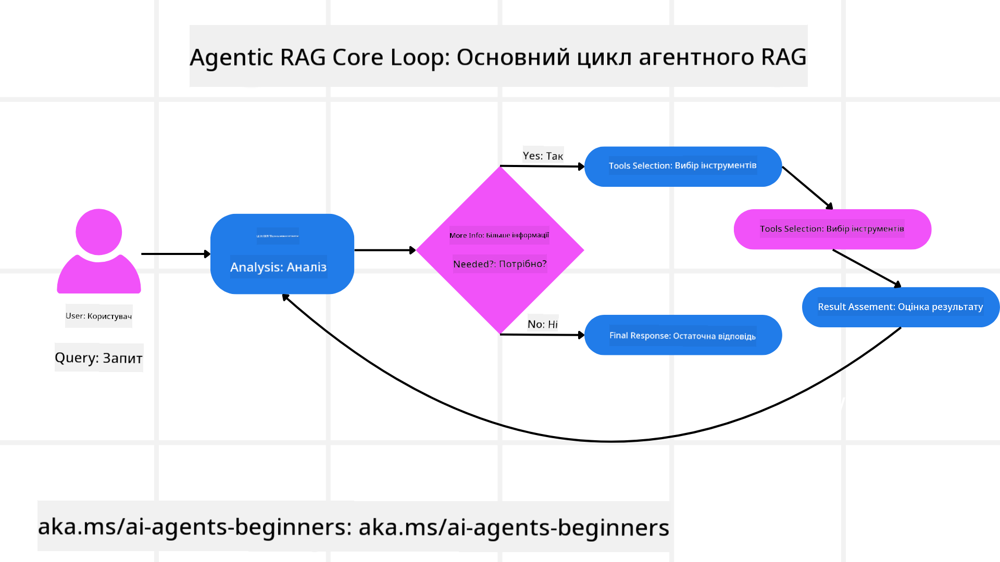
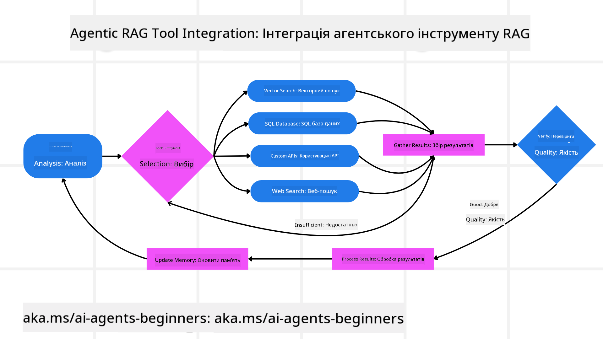

<!--
CO_OP_TRANSLATOR_METADATA:
{
  "original_hash": "7622aa72f9e676e593339f5f694ecd7d",
  "translation_date": "2025-07-12T10:16:27+00:00",
  "source_file": "05-agentic-rag/README.md",
  "language_code": "uk"
}
-->

> _(Натисніть на зображення вище, щоб переглянути відео цього уроку)_

# Agentic RAG

Цей урок надає всебічний огляд Agentic Retrieval-Augmented Generation (Agentic RAG) — нової парадигми штучного інтелекту, де великі мовні моделі (LLM) автономно планують свої наступні кроки, одночасно отримуючи інформацію з зовнішніх джерел. На відміну від статичних схем «отримати — прочитати», Agentic RAG передбачає ітеративні виклики LLM, що чергуються з викликами інструментів або функцій та структурованими результатами. Система оцінює результати, уточнює запити, за потреби викликає додаткові інструменти і продовжує цей цикл, доки не буде досягнуто задовільного рішення.

## Вступ

У цьому уроці ви дізнаєтесь:

- **Розуміння Agentic RAG:** Ознайомлення з новою парадигмою в ШІ, де великі мовні моделі (LLM) автономно планують свої наступні кроки, отримуючи інформацію з зовнішніх джерел даних.
- **Засвоєння ітеративного стилю Maker-Checker:** Розуміння циклу ітеративних викликів LLM, що чергуються з викликами інструментів або функцій та структурованими результатами, спрямованого на підвищення точності та обробку некоректних запитів.
- **Огляд практичних застосувань:** Визначення сценаріїв, де Agentic RAG демонструє найкращі результати, таких як середовища з пріоритетом на точність, складні взаємодії з базами даних та розширені робочі процеси.

## Цілі навчання

Після проходження цього уроку ви знатимете/розумітимете:

- **Розуміння Agentic RAG:** Ознайомлення з новою парадигмою в ШІ, де великі мовні моделі (LLM) автономно планують свої наступні кроки, отримуючи інформацію з зовнішніх джерел даних.
- **Ітеративний стиль Maker-Checker:** Засвоєння концепції циклу ітеративних викликів LLM, що чергуються з викликами інструментів або функцій та структурованими результатами, спрямованого на підвищення точності та обробку некоректних запитів.
- **Володіння процесом міркування:** Розуміння здатності системи контролювати власний процес міркування, приймаючи рішення щодо підходу до розв’язання проблем без опори на заздалегідь визначені шляхи.
- **Робочий процес:** Розуміння, як агентна модель самостійно приймає рішення щодо отримання звітів про ринкові тенденції, ідентифікації даних конкурентів, кореляції внутрішніх показників продажів, синтезу висновків та оцінки стратегії.
- **Ітеративні цикли, інтеграція інструментів і пам’ять:** Ознайомлення з циклічним патерном взаємодії системи, що підтримує стан і пам’ять між кроками, щоб уникати повторень і приймати обґрунтовані рішення.
- **Обробка помилок і самокорекція:** Вивчення надійних механізмів самокорекції системи, включно з ітераціями та повторними запитами, використанням діагностичних інструментів і залученням людського контролю.
- **Обмеження агентності:** Розуміння меж Agentic RAG, зосереджуючись на автономії в межах домену, залежності від інфраструктури та дотриманні обмежень.
- **Практичні випадки використання та цінність:** Визначення сценаріїв, де Agentic RAG демонструє найкращі результати, таких як середовища з пріоритетом на точність, складні взаємодії з базами даних та розширені робочі процеси.
- **Управління, прозорість і довіра:** Ознайомлення з важливістю управління та прозорості, включно з пояснюваним міркуванням, контролем упереджень і людським наглядом.

## Що таке Agentic RAG?

Agentic Retrieval-Augmented Generation (Agentic RAG) — це нова парадигма в ШІ, де великі мовні моделі (LLM) автономно планують свої наступні кроки, отримуючи інформацію з зовнішніх джерел. На відміну від статичних схем «отримати — прочитати», Agentic RAG передбачає ітеративні виклики LLM, що чергуються з викликами інструментів або функцій та структурованими результатами. Система оцінює результати, уточнює запити, за потреби викликає додаткові інструменти і продовжує цей цикл, доки не буде досягнуто задовільного рішення. Цей ітеративний стиль «maker-checker» підвищує точність, обробляє некоректні запити та забезпечує високоякісні результати.

Система активно контролює власний процес міркування, переписуючи невдалі запити, обираючи різні методи пошуку та інтегруючи кілька інструментів — таких як векторний пошук у Azure AI Search, SQL-бази даних або кастомні API — перед остаточним формуванням відповіді. Відмінною рисою агентної системи є її здатність контролювати процес міркування. Традиційні реалізації RAG покладаються на заздалегідь визначені шляхи, тоді як агентна система автономно визначає послідовність кроків залежно від якості знайденої інформації.

## Визначення Agentic Retrieval-Augmented Generation (Agentic RAG)

Agentic Retrieval-Augmented Generation (Agentic RAG) — це нова парадигма в розвитку ШІ, де LLM не лише отримують інформацію з зовнішніх джерел даних, а й автономно планують свої наступні кроки. На відміну від статичних схем «отримати — прочитати» або ретельно прописаних послідовностей запитів, Agentic RAG передбачає цикл ітеративних викликів LLM, що чергуються з викликами інструментів або функцій та структурованими результатами. На кожному кроці система оцінює отримані результати, вирішує, чи потрібно уточнити запити, за потреби викликає додаткові інструменти і продовжує цей цикл, доки не досягне задовільного рішення.

Цей ітеративний стиль роботи «maker-checker» спрямований на підвищення точності, обробку некоректних запитів до структурованих баз даних (наприклад, NL2SQL) та забезпечення збалансованих, високоякісних результатів. Замість того, щоб покладатися виключно на ретельно розроблені ланцюжки запитів, система активно контролює власний процес міркування. Вона може переписувати невдалі запити, обирати різні методи пошуку та інтегрувати кілька інструментів — таких як векторний пошук у Azure AI Search, SQL-бази даних або кастомні API — перед остаточним формуванням відповіді. Це усуває потребу у надто складних оркестраційних фреймворках. Натомість відносно простий цикл «виклик LLM → використання інструменту → виклик LLM → …» може давати складні та ґрунтовні результати.

## Контроль процесу міркування

Відмінною рисою, що робить систему «агентною», є її здатність контролювати власний процес міркування. Традиційні реалізації RAG часто залежать від того, що люди заздалегідь визначають шлях для моделі: ланцюжок думок, який окреслює, що і коли потрібно отримувати.
Але коли система справді агентна, вона внутрішньо вирішує, як підходити до проблеми. Вона не просто виконує скрипт; вона автономно визначає послідовність кроків залежно від якості знайденої інформації.
Наприклад, якщо її просять створити стратегію запуску продукту, вона не покладається виключно на запит, який описує весь процес дослідження та прийняття рішень. Натомість агентна модель самостійно вирішує:

1. Отримати актуальні звіти про ринкові тенденції за допомогою Bing Web Grounding
2. Визначити релевантні дані конкурентів за допомогою Azure AI Search.
3. Корелювати історичні внутрішні показники продажів за допомогою Azure SQL Database.
4. Синтезувати висновки у цілісну стратегію, організовану через Azure OpenAI Service.
5. Оцінити стратегію на наявність прогалин або невідповідностей, за потреби ініціювати ще один цикл отримання даних.
Усі ці кроки — уточнення запитів, вибір джерел, ітерації до досягнення «задоволення» відповіддю — приймаються моделлю, а не прописані людиною заздалегідь.

## Ітеративні цикли, інтеграція інструментів і пам’ять

Агентна система базується на циклічному патерні взаємодії:

- **Початковий виклик:** Мета користувача (т. зв. запит користувача) подається до LLM.
- **Виклик інструменту:** Якщо модель виявляє відсутність інформації або неоднозначні інструкції, вона обирає інструмент або метод пошуку — наприклад, запит до векторної бази даних (наприклад, гібридний пошук Azure AI Search по приватних даних) або структурований SQL-запит — щоб зібрати більше контексту.
- **Оцінка та уточнення:** Після перегляду отриманих даних модель вирішує, чи достатньо інформації. Якщо ні, вона уточнює запит, пробує інший інструмент або коригує підхід.
- **Повторювати, доки не буде задоволено:** Цикл триває, доки модель не визначить, що має достатньо ясності та доказів для надання остаточної, добре обґрунтованої відповіді.
- **Пам’ять і стан:** Оскільки система підтримує стан і пам’ять між кроками, вона може згадувати попередні спроби та їх результати, уникаючи повторень і приймаючи більш обґрунтовані рішення в процесі.

З часом це створює відчуття поступового розуміння, що дозволяє моделі виконувати складні багатокрокові завдання без постійного втручання людини або зміни запиту.

## Обробка помилок і самокорекція

Автономність Agentic RAG також включає надійні механізми самокорекції. Коли система натрапляє на глухий кут — наприклад, отримує нерелевантні документи або стикається з некоректними запитами — вона може:

- **Ітерувати та повторно запитувати:** Замість того, щоб повертати низькоцінні відповіді, модель пробує нові стратегії пошуку, переписує запити до баз даних або звертається до альтернативних наборів даних.
- **Використовувати діагностичні інструменти:** Система може викликати додаткові функції, призначені для допомоги у налагодженні кроків міркування або підтвердженні правильності отриманих даних. Інструменти на кшталт Azure AI Tracing будуть важливими для забезпечення надійної спостережуваності та моніторингу.
- **Звертатися до людського контролю:** Для критичних або повторно невдалих сценаріїв модель може позначати невизначеність і запитувати людське керівництво. Після отримання коригувального зворотного зв’язку модель може враховувати цей досвід у подальшій роботі.

Такий ітеративний і динамічний підхід дозволяє моделі постійно вдосконалюватися, забезпечуючи, що вона не є одноразовою системою, а навчається на власних помилках під час сесії.

## Межі агентності

Незважаючи на автономність у межах завдання, Agentic RAG не є аналогом штучного загального інтелекту. Його «агентні» можливості обмежені інструментами, джерелами даних і політиками, наданими розробниками. Він не може винаходити власні інструменти або виходити за межі встановлених доменних обмежень. Натомість він відмінно справляється з динамічною організацією наявних ресурсів.
Ключові відмінності від більш просунутих форм ШІ включають:

1. **Автономія в межах домену:** Системи Agentic RAG зосереджені на досягненні цілей, визначених користувачем, у відомому домені, застосовуючи стратегії на кшталт переписування запитів або вибору інструментів для покращення результатів.
2. **Залежність від інфраструктури:** Можливості системи залежать від інструментів і даних, інтегрованих розробниками. Вона не може перевищувати ці межі без людського втручання.
3. **Дотримання обмежень:** Етичні норми, правила відповідності та бізнес-політики залишаються надзвичайно важливими. Свобода агента завжди обмежена заходами безпеки та механізмами нагляду (сподіваємось).

## Практичні випадки використання та цінність

Agentic RAG демонструє найкращі результати у сценаріях, що потребують ітеративного уточнення та точності:

1. **Середовища з пріоритетом на точність:** У перевірках відповідності, регуляторному аналізі або юридичних дослідженнях агентна модель може багаторазово перевіряти факти, консультуватися з кількома джерелами та переписувати запити, доки не отримає ретельно перевірену відповідь.
2. **Складні взаємодії з базами даних:** При роботі зі структурованими даними, де запити часто можуть не спрацьовувати або потребувати корекції, система може автономно уточнювати запити за допомогою Azure SQL або Microsoft Fabric OneLake, забезпечуючи відповідність кінцевого результату намірам користувача.
3. **Розширені робочі процеси:** Тривалі сесії можуть розвиватися у міру появи нової інформації. Agentic RAG може безперервно інтегрувати нові дані, змінюючи стратегії у міру поглиблення розуміння проблемної області.

## Управління, прозорість і довіра

Оскільки ці системи стають більш автономними у своїх міркуваннях, управління та прозорість набувають ключового значення:

- **Пояснюване міркування:** Модель може надати аудиторський слід запитів, які вона зробила, джерел, до яких зверталася, та кроків міркування, які вона виконала для досягнення висновку. Інструменти на кшталт Azure AI Content Safety та Azure AI Tracing / GenAIOps допомагають підтримувати прозорість і знижувати ризики.
- **Контроль упереджень і збалансований пошук:** Розробники можуть налаштовувати стратегії пошуку, щоб враховувати збалансовані, репрезентативні джерела даних, а також регулярно перевіряти результати на наявність упереджень або викривлень, використовуючи кастомні моделі для просунутих організацій з аналізу даних на базі Azure Machine Learning.
- **Людський нагляд і відповідність:** Для чутливих завдань людський перегляд залишається необхідним. Agentic RAG не замінює людський суд у критичних рішеннях — він доповнює його, надаючи

- <a href="https://learn.microsoft.com/azure/ai-studio/concepts/evaluation-approach-gen-ai" target="_blank">Оцінка застосунків генеративного ШІ з Azure AI Foundry: У цій статті розглядається оцінка та порівняння моделей на публічно доступних наборах даних, включно з агентними застосунками ШІ та архітектурами RAG</a>
- <a href="https://weaviate.io/blog/what-is-agentic-rag" target="_blank">Що таке Agentic RAG | Weaviate</a>
- <a href="https://ragaboutit.com/agentic-rag-a-complete-guide-to-agent-based-retrieval-augmented-generation/" target="_blank">Agentic RAG: Повний посібник з агентно-орієнтованого генеративного пошуку – Новини від generation RAG</a>
- <a href="https://huggingface.co/learn/cookbook/agent_rag" target="_blank">Agentic RAG: прискорте свій RAG за допомогою переформулювання запитів і самозапитів! Відкритий AI посібник Hugging Face</a>
- <a href="https://youtu.be/aQ4yQXeB1Ss?si=2HUqBzHoeB5tR04U" target="_blank">Додавання агентних шарів до RAG</a>
- <a href="https://www.youtube.com/watch?v=zeAyuLc_f3Q&t=244s" target="_blank">Майбутнє помічників знань: Джеррі Лю</a>
- <a href="https://www.youtube.com/watch?v=AOSjiXP1jmQ" target="_blank">Як створити агентні системи RAG</a>
- <a href="https://ignite.microsoft.com/sessions/BRK102?source=sessions" target="_blank">Використання Azure AI Foundry Agent Service для масштабування ваших AI агентів</a>

### Академічні статті

- <a href="https://arxiv.org/abs/2303.17651" target="_blank">2303.17651 Self-Refine: Ітеративне вдосконалення з самозворотним зв’язком</a>
- <a href="https://arxiv.org/abs/2303.11366" target="_blank">2303.11366 Reflexion: Мовні агенти з вербальним підкріплювальним навчанням</a>
- <a href="https://arxiv.org/abs/2305.11738" target="_blank">2305.11738 CRITIC: Великі мовні моделі можуть самостійно виправлятися за допомогою інтерактивної критики інструментів</a>
- <a href="https://arxiv.org/abs/2501.09136" target="_blank">2501.09136 Agentic Retrieval-Augmented Generation: Огляд Agentic RAG</a>

## Попередній урок

[Патерн використання інструментів](../04-tool-use/README.md)

## Наступний урок

[Створення надійних AI агентів](../06-building-trustworthy-agents/README.md)

**Відмова від відповідальності**:  
Цей документ було перекладено за допомогою сервісу автоматичного перекладу [Co-op Translator](https://github.com/Azure/co-op-translator). Хоча ми прагнемо до точності, будь ласка, майте на увазі, що автоматичні переклади можуть містити помилки або неточності. Оригінальний документ рідною мовою слід вважати авторитетним джерелом. Для критично важливої інформації рекомендується звертатися до професійного людського перекладу. Ми не несемо відповідальності за будь-які непорозуміння або неправильні тлумачення, що виникли внаслідок використання цього перекладу.