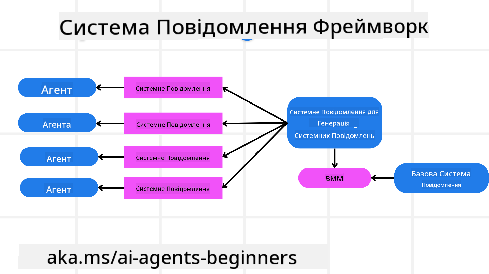
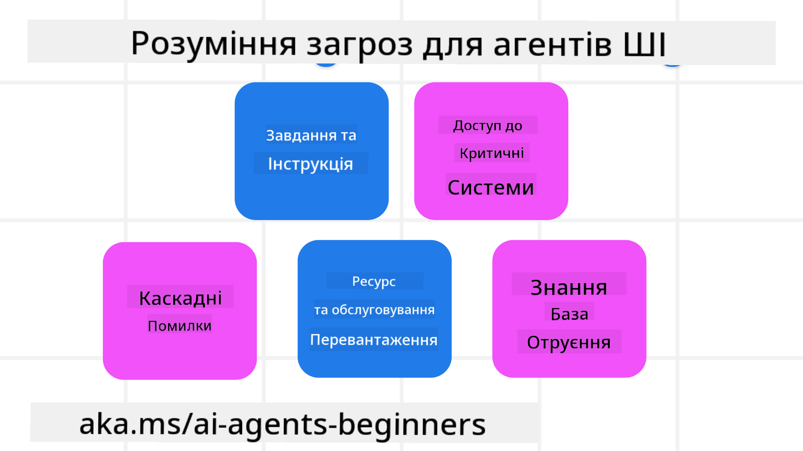
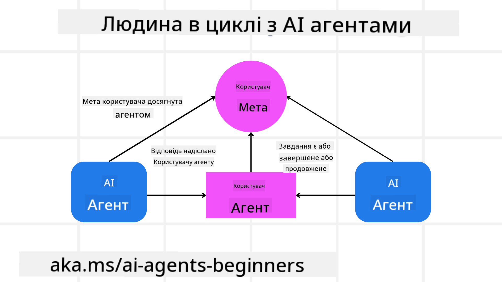

<!--
CO_OP_TRANSLATOR_METADATA:
{
  "original_hash": "f57852cac3a86c4a5ef47f793cc12178",
  "translation_date": "2025-07-12T10:34:14+00:00",
  "source_file": "06-building-trustworthy-agents/README.md",
  "language_code": "uk"
}
-->
[](https://youtu.be/iZKkMEGBCUQ?si=Q-kEbcyHUMPoHp8L)

> _(Натисніть на зображення вище, щоб переглянути відео цього уроку)_

# Створення надійних AI агентів

## Вступ

У цьому уроці ми розглянемо:

- Як створювати та впроваджувати безпечних і ефективних AI агентів
- Важливі аспекти безпеки при розробці AI агентів
- Як забезпечити конфіденційність даних і користувачів під час розробки AI агентів

## Цілі навчання

Після проходження цього уроку ви знатимете, як:

- Виявляти та зменшувати ризики при створенні AI агентів
- Впроваджувати заходи безпеки для належного управління даними та доступом
- Створювати AI агентів, які зберігають конфіденційність даних і забезпечують якісний користувацький досвід

## Безпека

Спочатку розглянемо, як створювати безпечні агентні додатки. Безпека означає, що AI агент працює відповідно до задуму. Як розробники агентних додатків, ми маємо методи та інструменти для максимізації безпеки:

### Створення системи повідомлень

Якщо ви коли-небудь створювали AI додаток з використанням великих мовних моделей (LLM), ви знаєте, наскільки важливо розробити надійний системний запит або системне повідомлення. Ці запити встановлюють метаправила, інструкції та керівництво щодо того, як LLM взаємодіятиме з користувачем і даними.

Для AI агентів системний запит ще важливіший, оскільки AI агенти потребують дуже конкретних інструкцій для виконання поставлених завдань.

Щоб створювати масштабовані системні запити, ми можемо використовувати каркас системних повідомлень для побудови одного або кількох агентів у нашому додатку:



#### Крок 1: Створіть мета-системне повідомлення

Мета-запит буде використовуватися LLM для генерації системних запитів для агентів, яких ми створюємо. Ми розробляємо його як шаблон, щоб ефективно створювати кілька агентів за потреби.

Ось приклад мета-системного повідомлення, яке ми передамо LLM:

```plaintext
You are an expert at creating AI agent assistants. 
You will be provided a company name, role, responsibilities and other
information that you will use to provide a system prompt for.
To create the system prompt, be descriptive as possible and provide a structure that a system using an LLM can better understand the role and responsibilities of the AI assistant. 
```

#### Крок 2: Створіть базовий запит

Наступний крок — створити базовий запит, який описує AI агента. Ви повинні включити роль агента, завдання, які він виконуватиме, та інші обов’язки агента.

Ось приклад:

```plaintext
You are a travel agent for Contoso Travel that is great at booking flights for customers. To help customers you can perform the following tasks: lookup available flights, book flights, ask for preferences in seating and times for flights, cancel any previously booked flights and alert customers on any delays or cancellations of flights.  
```

#### Крок 3: Надати базове системне повідомлення LLM

Тепер ми можемо оптимізувати це системне повідомлення, надаючи мета-системне повідомлення як системне повідомлення разом із нашим базовим системним повідомленням.

Це створить системне повідомлення, краще пристосоване для керування нашими AI агентами:

```markdown
**Company Name:** Contoso Travel  
**Role:** Travel Agent Assistant

**Objective:**  
You are an AI-powered travel agent assistant for Contoso Travel, specializing in booking flights and providing exceptional customer service. Your main goal is to assist customers in finding, booking, and managing their flights, all while ensuring that their preferences and needs are met efficiently.

**Key Responsibilities:**

1. **Flight Lookup:**
    
    - Assist customers in searching for available flights based on their specified destination, dates, and any other relevant preferences.
    - Provide a list of options, including flight times, airlines, layovers, and pricing.
2. **Flight Booking:**
    
    - Facilitate the booking of flights for customers, ensuring that all details are correctly entered into the system.
    - Confirm bookings and provide customers with their itinerary, including confirmation numbers and any other pertinent information.
3. **Customer Preference Inquiry:**
    
    - Actively ask customers for their preferences regarding seating (e.g., aisle, window, extra legroom) and preferred times for flights (e.g., morning, afternoon, evening).
    - Record these preferences for future reference and tailor suggestions accordingly.
4. **Flight Cancellation:**
    
    - Assist customers in canceling previously booked flights if needed, following company policies and procedures.
    - Notify customers of any necessary refunds or additional steps that may be required for cancellations.
5. **Flight Monitoring:**
    
    - Monitor the status of booked flights and alert customers in real-time about any delays, cancellations, or changes to their flight schedule.
    - Provide updates through preferred communication channels (e.g., email, SMS) as needed.

**Tone and Style:**

- Maintain a friendly, professional, and approachable demeanor in all interactions with customers.
- Ensure that all communication is clear, informative, and tailored to the customer's specific needs and inquiries.

**User Interaction Instructions:**

- Respond to customer queries promptly and accurately.
- Use a conversational style while ensuring professionalism.
- Prioritize customer satisfaction by being attentive, empathetic, and proactive in all assistance provided.

**Additional Notes:**

- Stay updated on any changes to airline policies, travel restrictions, and other relevant information that could impact flight bookings and customer experience.
- Use clear and concise language to explain options and processes, avoiding jargon where possible for better customer understanding.

This AI assistant is designed to streamline the flight booking process for customers of Contoso Travel, ensuring that all their travel needs are met efficiently and effectively.

```

#### Крок 4: Ітерації та покращення

Цінність цього каркасу системних повідомлень полягає в тому, що він дозволяє масштабувати створення системних повідомлень для кількох агентів, а також покращувати їх з часом. Рідко буває, що системне повідомлення працює ідеально з першої спроби для вашого повного випадку використання. Можливість вносити невеликі зміни та покращення, змінюючи базове системне повідомлення і пропускаючи його через систему, дозволить порівнювати та оцінювати результати.

## Розуміння загроз

Щоб створити надійних AI агентів, важливо розуміти та зменшувати ризики і загрози для вашого AI агента. Розглянемо деякі з різних загроз AI агентам і як краще планувати та готуватися до них.



### Завдання та інструкції

**Опис:** Зловмисники намагаються змінити інструкції або цілі AI агента через підказки або маніпуляції вхідними даними.

**Зменшення ризику:** Виконуйте перевірки валідації та фільтри вхідних даних, щоб виявляти потенційно небезпечні підказки до того, як їх обробить AI агент. Оскільки такі атаки зазвичай вимагають частої взаємодії з агентом, обмеження кількості ходів у розмові — ще один спосіб запобігти таким атакам.

### Доступ до критичних систем

**Опис:** Якщо AI агент має доступ до систем і сервісів, які зберігають конфіденційні дані, зловмисники можуть скомпрометувати зв’язок між агентом і цими сервісами. Це можуть бути прямі атаки або непрямі спроби отримати інформацію про ці системи через агента.

**Зменшення ризику:** AI агенти повинні мати доступ до систем лише за необхідністю, щоб запобігти такого роду атакам. Зв’язок між агентом і системою також має бути захищеним. Впровадження автентифікації та контролю доступу — ще один спосіб захистити цю інформацію.

### Перевантаження ресурсів і сервісів

**Опис:** AI агенти можуть використовувати різні інструменти та сервіси для виконання завдань. Зловмисники можуть скористатися цією можливістю, надсилаючи велику кількість запитів через AI агента, що може призвести до збоїв системи або високих витрат.

**Зменшення ризику:** Впровадьте політики, які обмежують кількість запитів, які AI агент може робити до сервісу. Обмеження кількості ходів у розмові та запитів до вашого AI агента — ще один спосіб запобігти таким атакам.

### Отруєння бази знань

**Опис:** Цей тип атаки не спрямований безпосередньо на AI агента, а на базу знань та інші сервіси, які AI агент використовує. Це може включати пошкодження даних або інформації, яку AI агент використовує для виконання завдань, що призводить до упереджених або небажаних відповідей користувачу.

**Зменшення ризику:** Регулярно перевіряйте дані, які AI агент використовує у своїх робочих процесах. Забезпечте безпечний доступ до цих даних і дозвольте змінювати їх лише довіреним особам, щоб уникнути такого роду атак.

### Каскадні помилки

**Опис:** AI агенти використовують різні інструменти та сервіси для виконання завдань. Помилки, спричинені зловмисниками, можуть призвести до збоїв інших систем, до яких підключений AI агент, що робить атаку більш масштабною і складнішою для усунення.

**Зменшення ризику:** Один із способів уникнути цього — запускати AI агента в обмеженому середовищі, наприклад, виконуючи завдання в Docker-контейнері, щоб запобігти прямим атакам на систему. Створення механізмів відновлення та логіки повторних спроб при отриманні помилок від певних систем — ще один спосіб уникнути масштабних збоїв.

## Людина в циклі

Ще один ефективний спосіб створення надійних систем AI агентів — використання підходу "Людина в циклі". Це створює процес, у якому користувачі можуть надавати зворотний зв’язок агентам під час їх роботи. Користувачі фактично виступають агентами в мультиагентній системі, надаючи схвалення або припиняючи виконання процесу.



Ось фрагмент коду з використанням AutoGen, який демонструє, як реалізується ця концепція:

```python

# Create the agents.
model_client = OpenAIChatCompletionClient(model="gpt-4o-mini")
assistant = AssistantAgent("assistant", model_client=model_client)
user_proxy = UserProxyAgent("user_proxy", input_func=input)  # Use input() to get user input from console.

# Create the termination condition which will end the conversation when the user says "APPROVE".
termination = TextMentionTermination("APPROVE")

# Create the team.
team = RoundRobinGroupChat([assistant, user_proxy], termination_condition=termination)

# Run the conversation and stream to the console.
stream = team.run_stream(task="Write a 4-line poem about the ocean.")
# Use asyncio.run(...) when running in a script.
await Console(stream)

```

## Висновок

Створення надійних AI агентів вимагає ретельного проєктування, надійних заходів безпеки та постійного вдосконалення. Впроваджуючи структуровані системи мета-запитів, розуміючи потенційні загрози та застосовуючи стратегії їх зменшення, розробники можуть створювати AI агентів, які є безпечними та ефективними. Крім того, інтеграція підходу "Людина в циклі" гарантує, що AI агенти залишаються орієнтованими на потреби користувачів і мінімізують ризики. Оскільки AI продовжує розвиватися, проактивний підхід до безпеки, конфіденційності та етичних аспектів буде ключем до формування довіри та надійності в системах на основі AI.

## Додаткові ресурси

- <a href="https://learn.microsoft.com/azure/ai-studio/responsible-use-of-ai-overview" target="_blank">Огляд відповідального використання AI</a>
- <a href="https://learn.microsoft.com/azure/ai-studio/concepts/evaluation-approach-gen-ai" target="_blank">Оцінка генеративних моделей AI та AI додатків</a>
- <a href="https://learn.microsoft.com/azure/ai-services/openai/concepts/system-message?context=%2Fazure%2Fai-studio%2Fcontext%2Fcontext&tabs=top-techniques" target="_blank">Системні повідомлення безпеки</a>
- <a href="https://blogs.microsoft.com/wp-content/uploads/prod/sites/5/2022/06/Microsoft-RAI-Impact-Assessment-Template.pdf?culture=en-us&country=us" target="_blank">Шаблон оцінки ризиків</a>

## Попередній урок

[Agentic RAG](../05-agentic-rag/README.md)

## Наступний урок

[Planning Design Pattern](../07-planning-design/README.md)

**Відмова від відповідальності**:  
Цей документ було перекладено за допомогою сервісу автоматичного перекладу [Co-op Translator](https://github.com/Azure/co-op-translator). Хоча ми прагнемо до точності, будь ласка, майте на увазі, що автоматичні переклади можуть містити помилки або неточності. Оригінальний документ рідною мовою слід вважати авторитетним джерелом. Для критично важливої інформації рекомендується звертатися до професійного людського перекладу. Ми не несемо відповідальності за будь-які непорозуміння або неправильні тлумачення, що виникли внаслідок використання цього перекладу.