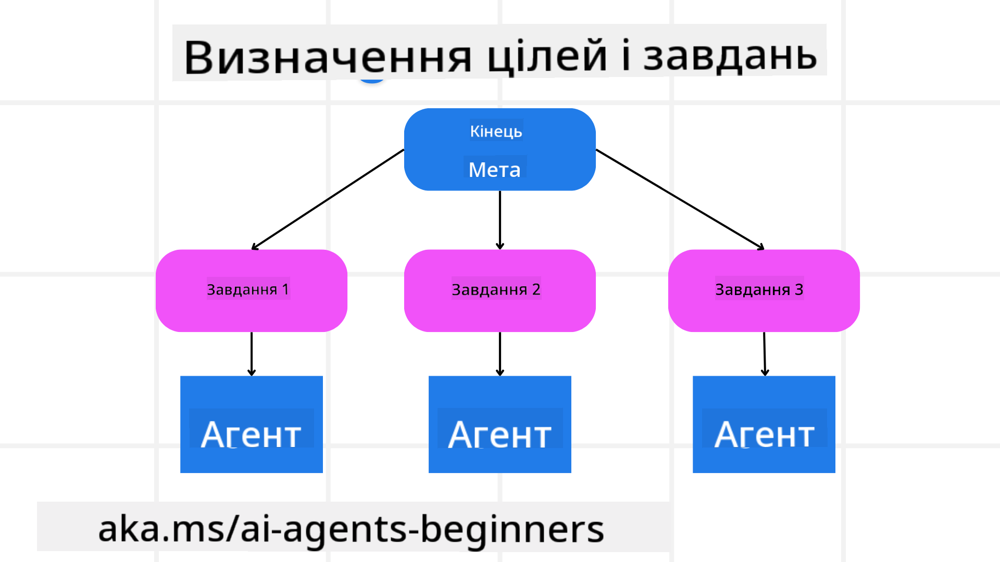

<!--
CO_OP_TRANSLATOR_METADATA:
{
  "original_hash": "a28d30590704ea13b6a08d4793cf9c2b",
  "translation_date": "2025-08-29T23:47:44+00:00",
  "source_file": "07-planning-design/README.md",
  "language_code": "uk"
}
-->
[](https://youtu.be/kPfJ2BrBCMY?si=9pYpPXp0sSbK91Dr)

> _(Натисніть на зображення вище, щоб переглянути відео цього уроку)_

# Планування дизайну

## Вступ

Цей урок охоплює:

* Визначення чіткої загальної мети та розбиття складного завдання на керовані частини.
* Використання структурованого виводу для більш надійних і машинозчитуваних відповідей.
* Застосування підходу, орієнтованого на події, для обробки динамічних завдань і несподіваних вводів.

## Цілі навчання

Після завершення цього уроку ви зрозумієте:

* Як визначити та встановити загальну мету для AI-агента, забезпечуючи чітке розуміння того, що потрібно досягти.
* Як розбити складне завдання на керовані підзадачі та організувати їх у логічну послідовність.
* Як забезпечити агентів необхідними інструментами (наприклад, інструментами пошуку або аналізу даних), вирішити, коли і як їх використовувати, та впоратися з несподіваними ситуаціями.
* Як оцінювати результати підзадач, вимірювати продуктивність і вдосконалювати дії для покращення кінцевого результату.

## Визначення загальної мети та розбиття завдання



Більшість завдань у реальному світі занадто складні, щоб вирішувати їх одним кроком. AI-агенту потрібна чітка мета, яка буде направляти його планування та дії. Наприклад, розглянемо мету:

    "Створити триденний туристичний маршрут."

Хоча це просто сформульовано, мета потребує уточнення. Чим чіткіше визначена мета, тим краще агент (і будь-які людські співробітники) зможуть зосередитися на досягненні правильного результату, наприклад, створенні комплексного маршруту з варіантами авіаперельотів, рекомендаціями готелів і пропозиціями активностей.

### Розбиття завдання

Великі або складні завдання стають більш керованими, коли їх розбивають на менші, орієнтовані на мету підзадачі. Для прикладу туристичного маршруту можна розбити мету на:

* Бронювання авіарейсів
* Бронювання готелів
* Оренда автомобіля
* Персоналізація

Кожну підзадачу можна вирішувати за допомогою спеціалізованих агентів або процесів. Один агент може спеціалізуватися на пошуку найкращих пропозицій авіарейсів, інший — на бронюванні готелів тощо. Координуючий або "низхідний" агент може об'єднати ці результати в один узгоджений маршрут для кінцевого користувача.

Такий модульний підхід також дозволяє поступово вдосконалюватися. Наприклад, можна додати спеціалізованих агентів для рекомендацій їжі або місцевих активностей і вдосконалювати маршрут з часом.

### Структурований вивід

Великі мовні моделі (LLMs) можуть генерувати структурований вивід (наприклад, JSON), який легше аналізувати та обробляти наступним агентам або сервісам. Це особливо корисно в контексті багатозадачності, де можна виконувати ці завдання після отримання результатів планування. Для швидкого огляду.

Наступний фрагмент коду на Python демонструє простого агента планування, який розбиває мету на підзадачі та генерує структурований план:

```python
from pydantic import BaseModel
from enum import Enum
from typing import List, Optional, Union
import json
import os
from typing import Optional
from pprint import pprint
from autogen_core.models import UserMessage, SystemMessage, AssistantMessage
from autogen_ext.models.azure import AzureAIChatCompletionClient
from azure.core.credentials import AzureKeyCredential

class AgentEnum(str, Enum):
    FlightBooking = "flight_booking"
    HotelBooking = "hotel_booking"
    CarRental = "car_rental"
    ActivitiesBooking = "activities_booking"
    DestinationInfo = "destination_info"
    DefaultAgent = "default_agent"
    GroupChatManager = "group_chat_manager"

# Travel SubTask Model
class TravelSubTask(BaseModel):
    task_details: str
    assigned_agent: AgentEnum  # we want to assign the task to the agent

class TravelPlan(BaseModel):
    main_task: str
    subtasks: List[TravelSubTask]
    is_greeting: bool

client = AzureAIChatCompletionClient(
    model="gpt-4o-mini",
    endpoint="https://models.inference.ai.azure.com",
    # To authenticate with the model you will need to generate a personal access token (PAT) in your GitHub settings.
    # Create your PAT token by following instructions here: https://docs.github.com/en/authentication/keeping-your-account-and-data-secure/managing-your-personal-access-tokens
    credential=AzureKeyCredential(os.environ["GITHUB_TOKEN"]),
    model_info={
        "json_output": False,
        "function_calling": True,
        "vision": True,
        "family": "unknown",
    },
)

# Define the user message
messages = [
    SystemMessage(content="""You are an planner agent.
    Your job is to decide which agents to run based on the user's request.
                      Provide your response in JSON format with the following structure:
{'main_task': 'Plan a family trip from Singapore to Melbourne.',
 'subtasks': [{'assigned_agent': 'flight_booking',
               'task_details': 'Book round-trip flights from Singapore to '
                               'Melbourne.'}
    Below are the available agents specialised in different tasks:
    - FlightBooking: For booking flights and providing flight information
    - HotelBooking: For booking hotels and providing hotel information
    - CarRental: For booking cars and providing car rental information
    - ActivitiesBooking: For booking activities and providing activity information
    - DestinationInfo: For providing information about destinations
    - DefaultAgent: For handling general requests""", source="system"),
    UserMessage(
        content="Create a travel plan for a family of 2 kids from Singapore to Melboune", source="user"),
]

response = await client.create(messages=messages, extra_create_args={"response_format": 'json_object'})

response_content: Optional[str] = response.content if isinstance(
    response.content, str) else None
if response_content is None:
    raise ValueError("Response content is not a valid JSON string" )

pprint(json.loads(response_content))

# # Ensure the response content is a valid JSON string before loading it
# response_content: Optional[str] = response.content if isinstance(
#     response.content, str) else None
# if response_content is None:
#     raise ValueError("Response content is not a valid JSON string")

# # Print the response content after loading it as JSON
# pprint(json.loads(response_content))

# Validate the response content with the MathReasoning model
# TravelPlan.model_validate(json.loads(response_content))
```

### Агент планування з багатозадачною оркестрацією

У цьому прикладі агент Semantic Router отримує запит користувача (наприклад, "Мені потрібен план готелю для моєї подорожі.").

Планувальник виконує наступне:

* Отримує план готелю: Планувальник бере повідомлення користувача і, на основі системного запиту (включаючи деталі доступних агентів), генерує структурований план подорожі.
* Перераховує агентів та їх інструменти: Реєстр агентів містить список агентів (наприклад, для авіарейсів, готелів, оренди автомобілів і активностей) разом із функціями або інструментами, які вони пропонують.
* Направляє план відповідним агентам: Залежно від кількості підзадач, планувальник або надсилає повідомлення безпосередньо спеціалізованому агенту (для одноразових завдань), або координує через менеджер групового чату для багатозадачної співпраці.
* Підсумовує результат: Нарешті, планувальник підсумовує створений план для ясності.

Наступний фрагмент коду на Python ілюструє ці кроки:

```python

from pydantic import BaseModel

from enum import Enum
from typing import List, Optional, Union

class AgentEnum(str, Enum):
    FlightBooking = "flight_booking"
    HotelBooking = "hotel_booking"
    CarRental = "car_rental"
    ActivitiesBooking = "activities_booking"
    DestinationInfo = "destination_info"
    DefaultAgent = "default_agent"
    GroupChatManager = "group_chat_manager"

# Travel SubTask Model

class TravelSubTask(BaseModel):
    task_details: str
    assigned_agent: AgentEnum # we want to assign the task to the agent

class TravelPlan(BaseModel):
    main_task: str
    subtasks: List[TravelSubTask]
    is_greeting: bool
import json
import os
from typing import Optional

from autogen_core.models import UserMessage, SystemMessage, AssistantMessage
from autogen_ext.models.openai import AzureOpenAIChatCompletionClient

# Create the client with type-checked environment variables

client = AzureOpenAIChatCompletionClient(
    azure_deployment=os.getenv("AZURE_OPENAI_DEPLOYMENT_NAME"),
    model=os.getenv("AZURE_OPENAI_DEPLOYMENT_NAME"),
    api_version=os.getenv("AZURE_OPENAI_API_VERSION"),
    azure_endpoint=os.getenv("AZURE_OPENAI_ENDPOINT"),
    api_key=os.getenv("AZURE_OPENAI_API_KEY"),
)

from pprint import pprint

# Define the user message

messages = [
    SystemMessage(content="""You are an planner agent.
    Your job is to decide which agents to run based on the user's request.
    Below are the available agents specialized in different tasks:
    - FlightBooking: For booking flights and providing flight information
    - HotelBooking: For booking hotels and providing hotel information
    - CarRental: For booking cars and providing car rental information
    - ActivitiesBooking: For booking activities and providing activity information
    - DestinationInfo: For providing information about destinations
    - DefaultAgent: For handling general requests""", source="system"),
    UserMessage(content="Create a travel plan for a family of 2 kids from Singapore to Melbourne", source="user"),
]

response = await client.create(messages=messages, extra_create_args={"response_format": TravelPlan})

# Ensure the response content is a valid JSON string before loading it

response_content: Optional[str] = response.content if isinstance(response.content, str) else None
if response_content is None:
    raise ValueError("Response content is not a valid JSON string")

# Print the response content after loading it as JSON

pprint(json.loads(response_content))
```

Результат попереднього коду можна використовувати для маршрутизації до `assigned_agent` і підсумовування плану подорожі для кінцевого користувача.

```json
{
    "is_greeting": "False",
    "main_task": "Plan a family trip from Singapore to Melbourne.",
    "subtasks": [
        {
            "assigned_agent": "flight_booking",
            "task_details": "Book round-trip flights from Singapore to Melbourne."
        },
        {
            "assigned_agent": "hotel_booking",
            "task_details": "Find family-friendly hotels in Melbourne."
        },
        {
            "assigned_agent": "car_rental",
            "task_details": "Arrange a car rental suitable for a family of four in Melbourne."
        },
        {
            "assigned_agent": "activities_booking",
            "task_details": "List family-friendly activities in Melbourne."
        },
        {
            "assigned_agent": "destination_info",
            "task_details": "Provide information about Melbourne as a travel destination."
        }
    ]
}
```

Приклад блокнота з попереднім фрагментом коду доступний [тут](07-autogen.ipynb).

### Ітеративне планування

Деякі завдання потребують зворотного зв'язку або перепланування, коли результат однієї підзадачі впливає на наступну. Наприклад, якщо агент виявляє несподіваний формат даних під час бронювання авіарейсів, йому може знадобитися адаптувати свою стратегію перед переходом до бронювання готелів.

Крім того, зворотний зв'язок від користувача (наприклад, рішення людини про те, що вона віддає перевагу більш ранньому рейсу) може викликати часткове перепланування. Такий динамічний, ітеративний підхід забезпечує, що кінцеве рішення відповідає реальним обмеженням і змінним уподобанням користувача.

Наприклад, код:

```python
from autogen_core.models import UserMessage, SystemMessage, AssistantMessage
#.. same as previous code and pass on the user history, current plan
messages = [
    SystemMessage(content="""You are a planner agent to optimize the
    Your job is to decide which agents to run based on the user's request.
    Below are the available agents specialized in different tasks:
    - FlightBooking: For booking flights and providing flight information
    - HotelBooking: For booking hotels and providing hotel information
    - CarRental: For booking cars and providing car rental information
    - ActivitiesBooking: For booking activities and providing activity information
    - DestinationInfo: For providing information about destinations
    - DefaultAgent: For handling general requests""", source="system"),
    UserMessage(content="Create a travel plan for a family of 2 kids from Singapore to Melbourne", source="user"),
    AssistantMessage(content=f"Previous travel plan - {TravelPlan}", source="assistant")
]
# .. re-plan and send the tasks to respective agents
```

Для більш комплексного планування ознайомтеся з Magnetic One для вирішення складних завдань.

## Підсумок

У цій статті ми розглянули приклад того, як можна створити планувальник, який динамічно вибирає доступних агентів, визначених у системі. Вивід планувальника розбиває завдання та призначає агентів для їх виконання. Передбачається, що агенти мають доступ до функцій/інструментів, необхідних для виконання завдання. Крім агентів, ви можете включити інші шаблони, такі як рефлексія, підсумовування та круговий чат, для додаткової кастомізації.

## Додаткові ресурси

* AutoGen Magnetic One - Універсальна багатозадачна система для вирішення складних завдань, яка досягла вражаючих результатів на багатьох складних тестах для агентів. Посилання:

. У цій реалізації оркестратор створює план, специфічний для завдання, і делегує ці завдання доступним агентам. Крім планування, оркестратор також використовує механізм відстеження для моніторингу прогресу завдання та перепланування за необхідності.

### Є питання щодо шаблону дизайну планування?

Приєднуйтесь до [Azure AI Foundry Discord](https://aka.ms/ai-agents/discord), щоб зустрітися з іншими учнями, відвідати години консультацій і отримати відповіді на ваші запитання щодо AI-агентів.

## Попередній урок

[Створення надійних AI-агентів](../06-building-trustworthy-agents/README.md)

## Наступний урок

[Шаблон дизайну багатозадачності](../08-multi-agent/README.md)

---

**Відмова від відповідальності**:  
Цей документ був перекладений за допомогою сервісу автоматичного перекладу [Co-op Translator](https://github.com/Azure/co-op-translator). Хоча ми прагнемо до точності, будь ласка, майте на увазі, що автоматичні переклади можуть містити помилки або неточності. Оригінальний документ на його рідній мові слід вважати авторитетним джерелом. Для критичної інформації рекомендується професійний людський переклад. Ми не несемо відповідальності за будь-які непорозуміння або неправильні тлумачення, що виникають внаслідок використання цього перекладу.