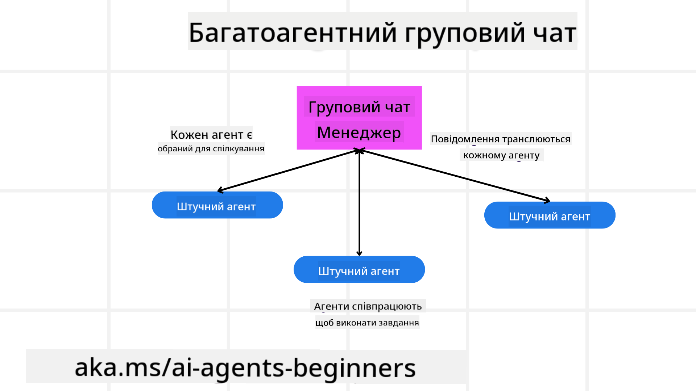
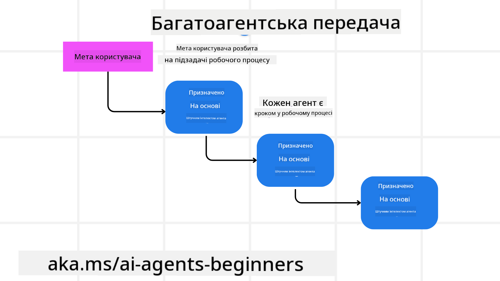
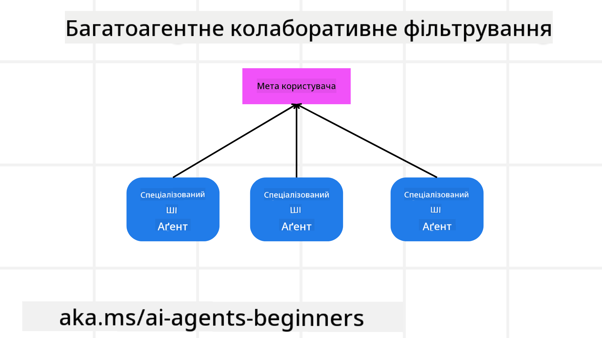

<!--
CO_OP_TRANSLATOR_METADATA:
{
  "original_hash": "c692a8975d7d5b99575a553de1c5e8a7",
  "translation_date": "2025-07-12T11:32:37+00:00",
  "source_file": "08-multi-agent/README.md",
  "language_code": "uk"
}
-->

> _(Натисніть на зображення вище, щоб переглянути відео цього уроку)_

# Шаблони проектування мультиагентних систем

Як тільки ви починаєте працювати над проєктом, що включає кілька агентів, вам потрібно врахувати шаблон проектування мультиагентної системи. Однак не завжди одразу зрозуміло, коли варто перейти до мультиагентної архітектури і які переваги це дає.

## Вступ

У цьому уроці ми прагнемо відповісти на такі питання:

- У яких сценаріях застосовуються мультиагенти?
- Які переваги використання мультиагентів порівняно з одним агентом, який виконує кілька завдань?
- Які складові потрібні для реалізації шаблону мультиагентного проектування?
- Як отримати уявлення про взаємодію між кількома агентами?

## Цілі навчання

Після цього уроку ви зможете:

- Визначати сценарії, де застосовуються мультиагенти
- Усвідомлювати переваги використання мультиагентів порівняно з одним агентом
- Розуміти складові реалізації шаблону мультиагентного проектування

Яка загальна ідея?

*Мультиагенти — це шаблон проектування, який дозволяє кільком агентам працювати разом для досягнення спільної мети*.

Цей шаблон широко використовується в різних сферах, включаючи робототехніку, автономні системи та розподілені обчислення.

## Сценарії, де застосовуються мультиагенти

Отже, у яких випадках доцільно використовувати мультиагенти? Відповідь полягає в тому, що існує багато сценаріїв, де застосування кількох агентів є корисним, особливо у таких випадках:

- **Великі обсяги роботи**: Великі завдання можна розбити на менші частини і призначити різним агентам, що дозволяє паралельну обробку і швидше виконання. Прикладом є обробка великих обсягів даних.
- **Складні завдання**: Складні завдання, як і великі обсяги роботи, можна розділити на підзавдання і призначити різним агентам, кожен з яких спеціалізується на певному аспекті. Хороший приклад — автономні транспортні засоби, де різні агенти відповідають за навігацію, виявлення перешкод і зв’язок з іншими автомобілями.
- **Різноманітна експертиза**: Різні агенти можуть мати різну експертизу, що дозволяє їм ефективніше виконувати різні аспекти завдання, ніж один агент. Прикладом є сфера охорони здоров’я, де агенти можуть відповідати за діагностику, плани лікування та моніторинг пацієнтів.

## Переваги використання мультиагентів порівняно з одним агентом

Система з одним агентом може добре працювати для простих завдань, але для складніших завдань використання кількох агентів дає кілька переваг:

- **Спеціалізація**: Кожен агент може спеціалізуватися на конкретному завданні. Відсутність спеціалізації в одному агенті означає, що він може виконувати все, але може заплутатися при складних завданнях і виконувати не найкращі дії.
- **Масштабованість**: Легше масштабувати систему, додаючи нових агентів, ніж перевантажувати одного.
- **Відмовостійкість**: Якщо один агент виходить з ладу, інші можуть продовжувати працювати, забезпечуючи надійність системи.

Розглянемо приклад: забронювати поїздку для користувача. Система з одним агентом мала б обробляти всі аспекти бронювання — від пошуку рейсів до бронювання готелів і оренди авто. Для цього агенту потрібні інструменти для всіх цих завдань, що може призвести до складної і монолітної системи, яку важко підтримувати і масштабувати. Мультиагентна система, навпаки, може мати різних агентів, які спеціалізуються на пошуку рейсів, бронюванні готелів і оренді авто. Це робить систему більш модульною, легкою у підтримці та масштабуванні.

Порівняйте це з туристичним бюро, яке працює як сімейний магазин, і туристичним бюро, що працює як франшиза. У сімейному магазині один агент обробляє всі аспекти бронювання, а у франшизі — різні агенти відповідають за різні частини процесу.

## Складові реалізації шаблону мультиагентного проектування

Перш ніж реалізувати шаблон мультиагентного проектування, потрібно зрозуміти його складові.

Знову розглянемо приклад бронювання поїздки для користувача. У цьому випадку складові включають:

- **Комунікація агентів**: Агенти, що шукають рейси, бронюють готелі та орендують авто, повинні обмінюватися інформацією про вподобання та обмеження користувача. Потрібно визначити протоколи і методи цієї комунікації. Наприклад, агент, що шукає рейси, має спілкуватися з агентом, що бронює готелі, щоб переконатися, що готель заброньований на ті ж дати, що й рейс. Це означає, що агенти повинні обмінюватися інформацією про дати подорожі користувача, тобто потрібно вирішити *які агенти обмінюються інформацією і як саме*.
- **Механізми координації**: Агенти повинні координувати свої дії, щоб врахувати вподобання та обмеження користувача. Наприклад, користувач хоче готель поблизу аеропорту, а оренда авто доступна лише в аеропорту. Тоді агент бронювання готелів має координуватися з агентом оренди авто, щоб задовольнити ці умови. Потрібно визначити *як агенти координують свої дії*.
- **Архітектура агента**: Агенти повинні мати внутрішню структуру для прийняття рішень і навчання на основі взаємодії з користувачем. Наприклад, агент пошуку рейсів повинен мати механізми для вибору рейсів, які рекомендувати користувачу. Потрібно визначити *як агенти приймають рішення і навчаються на взаємодії з користувачем*. Прикладом може бути використання машинного навчання для рекомендації рейсів на основі попередніх вподобань користувача.
- **Видимість взаємодії мультиагентів**: Потрібно мати можливість бачити, як агенти взаємодіють між собою. Для цього потрібні інструменти і методи відстеження активності і взаємодії агентів. Це можуть бути інструменти логування, моніторингу, візуалізації та метрики продуктивності.
- **Шаблони мультиагентних систем**: Існують різні шаблони реалізації мультиагентних систем, такі як централізовані, децентралізовані та гібридні архітектури. Потрібно обрати той, що найкраще підходить для вашого випадку.
- **Людина в циклі**: У більшості випадків у процесі бере участь людина, і потрібно визначити, коли агенти мають звертатися за її втручанням. Наприклад, користувач може попросити конкретний готель або рейс, які агенти не рекомендували, або підтвердження перед бронюванням.

## Видимість взаємодії мультиагентів

Важливо мати уявлення про те, як кілька агентів взаємодіють між собою. Це необхідно для налагодження, оптимізації та забезпечення ефективності системи. Для цього потрібні інструменти і методи відстеження активності і взаємодії агентів. Це можуть бути інструменти логування, моніторингу, візуалізації та метрики продуктивності.

Наприклад, у випадку бронювання поїздки можна мати панель керування, яка показує статус кожного агента, вподобання і обмеження користувача, а також взаємодію між агентами. Ця панель може відображати дати подорожі користувача, рейси, рекомендовані агентом пошуку рейсів, готелі, рекомендовані агентом бронювання готелів, і авто, рекомендовані агентом оренди. Це дасть чітке уявлення про взаємодію агентів і чи враховуються вподобання та обмеження користувача.

Розглянемо кожен аспект детальніше.

- **Інструменти логування і моніторингу**: Потрібно вести лог кожної дії агента. Запис у журналі може містити інформацію про агента, який виконав дію, саму дію, час її виконання та результат. Ці дані можна використовувати для налагодження, оптимізації тощо.

- **Інструменти візуалізації**: Візуалізація допомагає краще розуміти взаємодію агентів. Наприклад, можна створити граф, що показує потік інформації між агентами. Це допоможе виявити вузькі місця, неефективність та інші проблеми.

- **Метрики продуктивності**: Метрики допомагають відстежувати ефективність мультиагентної системи. Наприклад, можна вимірювати час виконання завдання, кількість виконаних завдань за одиницю часу, точність рекомендацій агентів. Ці дані допоможуть визначити напрямки для покращення і оптимізації системи.

## Шаблони мультиагентних систем

Розглянемо конкретні шаблони, які можна використовувати для створення мультиагентних додатків. Ось кілька цікавих шаблонів, які варто розглянути:

### Груповий чат

Цей шаблон корисний, коли потрібно створити додаток для групового чату, де кілька агентів можуть спілкуватися між собою. Типові випадки використання — командна співпраця, підтримка клієнтів, соціальні мережі.

У цьому шаблоні кожен агент представляє користувача в груповому чаті, а повідомлення обмінюються між агентами за допомогою протоколу обміну повідомленнями. Агенти можуть надсилати повідомлення в чат, отримувати повідомлення з чату і відповідати іншим агентам.

Цей шаблон можна реалізувати за централізованою архітектурою, де всі повідомлення проходять через центральний сервер, або за децентралізованою, де повідомлення обмінюються безпосередньо.

### Передача завдань

Цей шаблон корисний, коли потрібно створити додаток, де кілька агентів можуть передавати завдання один одному.

Типові випадки використання — підтримка клієнтів, управління завданнями, автоматизація робочих процесів.

У цьому шаблоні кожен агент представляє завдання або крок у робочому процесі, і агенти можуть передавати завдання іншим агентам на основі заздалегідь визначених правил.

### Спільна фільтрація

Цей шаблон корисний, коли потрібно створити додаток, де кілька агентів співпрацюють для надання рекомендацій користувачам.

Причина, чому варто залучати кілька агентів, полягає в тому, що кожен агент має різну експертизу і може по-різному впливати на процес рекомендації.

Розглянемо приклад, коли користувач хоче отримати рекомендацію щодо найкращої акції для купівлі на фондовому ринку.

- **Експерт з галузі**: Один агент може бути експертом у певній галузі.
- **Технічний аналіз**: Інший агент може спеціалізуватися на технічному аналізі.
- **Фундаментальний аналіз**: Ще один агент може бути експертом з фундаментального аналізу. Спільна робота цих агентів дозволяє надати користувачу більш комплексну рекомендацію.

## Сценарій: процес повернення коштів

Розглянемо сценарій, коли клієнт намагається отримати повернення коштів за товар. У цьому процесі може бути задіяно багато агентів, але розділимо їх на специфічних для цього процесу і загальних, які можна використовувати в інших процесах.

**Агенти, специфічні для процесу повернення коштів**:

Ось деякі агенти, які можуть брати участь у процесі повернення:

- **Агент клієнта**: Представляє клієнта і відповідає за ініціювання процесу повернення.
- **Агент продавця**: Представляє продавця і відповідає за обробку повернення.
- **Агент платежів**: Відповідає за повернення коштів клієнту.
- **Агент вирішення проблем**: Відповідає за розв’язання будь-яких питань, що виникають під час процесу повернення.
- **Агент відповідності**: Забезпечує відповідність процесу повернення нормативам і політикам.

**Загальні агенти**:

Ці агенти можуть використовуватися в інших частинах вашого бізнесу.

- **Агент доставки**: Відповідає за повернення товару продавцю. Може використовуватися як у процесі повернення, так і для загальної доставки товарів.
- **Агент зворотного зв’язку**: Відповідає за збір відгуків від клієнтів. Збір відгуків може відбуватися у будь-який час, не лише під час повернення.
- **Агент ескалації**: Відповідає за передачу проблем на вищий рівень підтримки. Можна використовувати для будь-яких процесів, де потрібна ескалація.
- **Агент сповіщень**: Відповідає за надсилання сповіщень клієнту на різних етапах процесу повернення.
- **Агент аналітики**: Відповідає за аналіз даних, пов’язаних з процесом повернення.
- **Агент аудиту**: Відповідає за перевірку правильності виконання процесу повернення.
- **Агент звітності**: Відповідає за формування звітів щодо процесу повернення.
- **Агент знань**: Відповідає за підтримку бази знань, пов’язаної з процесом повернення. Може бути обізнаний як у питаннях повернень, так і в інших сферах бізнесу.
- **Агент безпеки**: Відповідає за забезпечення безпеки процесу повернення.
- **Агент якості**: Відповідає за контроль якості процесу повернення.

Перелічено досить багато агентів як для специфічного процесу повернення, так і для загальних, які можна використовувати в інших частинах бізнесу. Сподіваюся, це дає уявлення про те, як можна обирати агентів для мультиагентної системи.

## Завдання
## Попередній урок

[Планування дизайну](../07-planning-design/README.md)

## Наступний урок

[Метакогніція в AI-агентах](../09-metacognition/README.md)

**Відмова від відповідальності**:  
Цей документ було перекладено за допомогою сервісу автоматичного перекладу [Co-op Translator](https://github.com/Azure/co-op-translator). Хоча ми прагнемо до точності, будь ласка, майте на увазі, що автоматичні переклади можуть містити помилки або неточності. Оригінальний документ рідною мовою слід вважати авторитетним джерелом. Для критично важливої інформації рекомендується звертатися до професійного людського перекладу. Ми не несемо відповідальності за будь-які непорозуміння або неправильні тлумачення, що виникли внаслідок використання цього перекладу.