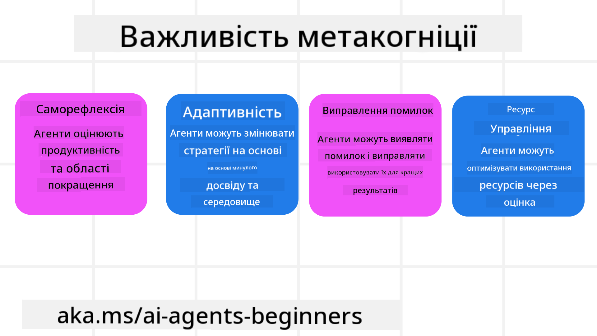

<!--
CO_OP_TRANSLATOR_METADATA:
{
  "original_hash": "8cbf460468c802c7994aa62e0e0779c9",
  "translation_date": "2025-07-12T13:32:52+00:00",
  "source_file": "09-metacognition/README.md",
  "language_code": "uk"
}
-->
[](https://youtu.be/His9R6gw6Ec?si=3_RMb8VprNvdLRhX)

> _(Натисніть на зображення вище, щоб переглянути відео цього уроку)_
# Метакогніція в AI-агентах

## Вступ

Ласкаво просимо до уроку про метакогніцію в AI-агентах! Цей розділ призначений для початківців, які цікавляться тим, як AI-агенти можуть мислити про власні процеси мислення. Наприкінці уроку ви зрозумієте ключові поняття та отримаєте практичні приклади застосування метакогніції у проєктуванні AI-агентів.

## Цілі навчання

Після проходження цього уроку ви зможете:

1. Розуміти наслідки циклів міркувань у визначеннях агентів.
2. Використовувати техніки планування та оцінки для допомоги агентам, що самокоригуються.
3. Створювати власних агентів, здатних маніпулювати кодом для виконання завдань.

## Вступ до метакогніції

Метакогніція — це вищий рівень когнітивних процесів, що включає мислення про власне мислення. Для AI-агентів це означає здатність оцінювати та коригувати свої дії на основі самосвідомості та минулого досвіду. Метакогніція, або «мислення про мислення», є важливою концепцією у розвитку агентних AI-систем. Вона передбачає, що AI-системи усвідомлюють власні внутрішні процеси та можуть контролювати, регулювати і адаптувати свою поведінку відповідно. Подібно до того, як ми оцінюємо обстановку або аналізуємо проблему. Ця самосвідомість допомагає AI-системам приймати кращі рішення, виявляти помилки та покращувати свою продуктивність з часом — що знову ж таки пов’язано з тестом Тьюринга та дискусією про те, чи захопить AI світ.

У контексті агентних AI-систем метакогніція допомагає вирішувати кілька викликів, таких як:
- Прозорість: Забезпечення здатності AI-систем пояснювати свої міркування та рішення.
- Міркування: Покращення здатності AI-систем синтезувати інформацію та приймати обґрунтовані рішення.
- Адаптація: Дозволяє AI-системам пристосовуватися до нових умов і змін.
- Сприйняття: Підвищення точності розпізнавання та інтерпретації даних із навколишнього середовища.

### Що таке метакогніція?

Метакогніція, або «мислення про мислення», — це вищий когнітивний процес, що включає самосвідомість і саморегуляцію власних когнітивних процесів. У сфері AI метакогніція дає агентам змогу оцінювати та адаптувати свої стратегії й дії, що призводить до покращення розв’язання проблем і прийняття рішень. Розуміючи метакогніцію, ви зможете створювати AI-агентів, які не лише розумніші, а й більш адаптивні та ефективні. У справжній метакогніції AI явно міркує про власне міркування.

Приклад: «Я обрав дешевші рейси, бо… можливо, пропускаю прямі рейси, тож перевірю ще раз.»
Відстеження, як і чому було обрано певний маршрут.
- Помічання, що були помилки через надмірну довіру до уподобань користувача з минулого разу, тому агент змінює не лише кінцеву рекомендацію, а й стратегію прийняття рішень.
- Виявлення закономірностей, наприклад: «Коли користувач каже „занадто людно“, я повинен не лише виключати певні атракції, а й усвідомлювати, що мій метод вибору „топ атракцій“ хибний, якщо я завжди ранжую за популярністю.»

### Важливість метакогніції в AI-агентах

Метакогніція відіграє ключову роль у проєктуванні AI-агентів з кількох причин:



- Саморефлексія: Агенти можуть оцінювати власну продуктивність і визначати сфери для покращення.
- Адаптивність: Агенти можуть змінювати стратегії на основі минулого досвіду та змін у середовищі.
- Корекція помилок: Агенти можуть самостійно виявляти та виправляти помилки, що призводить до точніших результатів.
- Управління ресурсами: Агенти можуть оптимізувати використання ресурсів, таких як час і обчислювальна потужність, плануючи та оцінюючи свої дії.

## Компоненти AI-агента

Перед тим, як заглиблюватися в метакогнітивні процеси, важливо розуміти базові компоненти AI-агента. Зазвичай AI-агент складається з:

- Персона: Особистість і характеристики агента, що визначають, як він взаємодіє з користувачами.
- Інструменти: Можливості та функції, які агент може виконувати.
- Навички: Знання та експертиза, якими володіє агент.

Ці компоненти працюють разом, створюючи «одиницю експертизи», здатну виконувати конкретні завдання.

**Приклад**:
Уявіть туристичного агента, сервіс якого не лише планує вашу відпустку, а й коригує маршрут на основі актуальних даних і минулого досвіду клієнтів.

### Приклад: Метакогніція в сервісі туристичного агента

Уявіть, що ви створюєте сервіс туристичного агента на базі AI. Цей агент, «Travel Agent», допомагає користувачам планувати відпустки. Щоб впровадити метакогніцію, Travel Agent повинен оцінювати та коригувати свої дії на основі самосвідомості та минулого досвіду. Ось як метакогніція може проявлятися:

#### Поточне завдання

Допомогти користувачу спланувати поїздку до Парижа.

#### Кроки для виконання завдання

1. **Збір уподобань користувача**: Запитати про дати подорожі, бюджет, інтереси (наприклад, музеї, кухня, шопінг) та особливі вимоги.
2. **Отримання інформації**: Пошук варіантів перельотів, проживання, атракцій і ресторанів, що відповідають уподобанням користувача.
3. **Формування рекомендацій**: Надати персоналізований маршрут із деталями перельотів, бронюванням готелів і запропонованими активностями.
4. **Коригування на основі відгуків**: Запитати відгуки користувача про рекомендації та внести необхідні зміни.

#### Необхідні ресурси

- Доступ до баз даних бронювання авіаквитків і готелів.
- Інформація про паризькі атракції та ресторани.
- Дані відгуків користувачів із попередніх взаємодій.

#### Досвід і саморефлексія

Travel Agent використовує метакогніцію для оцінки своєї роботи та навчання на минулому досвіді. Наприклад:

1. **Аналіз відгуків користувачів**: Travel Agent переглядає відгуки, щоб визначити, які рекомендації були вдалі, а які — ні, і відповідно коригує майбутні пропозиції.
2. **Адаптивність**: Якщо користувач раніше зазначав, що не любить людні місця, Travel Agent уникатиме популярних туристичних локацій у години пік.
3. **Корекція помилок**: Якщо Travel Agent раніше припустився помилки, наприклад, запропонував готель, який був повністю заброньований, він навчиться ретельніше перевіряти наявність перед рекомендацією.

#### Практичний приклад для розробника

Ось спрощений приклад коду Travel Agent із впровадженням метакогніції:

```python
class Travel_Agent:
    def __init__(self):
        self.user_preferences = {}
        self.experience_data = []

    def gather_preferences(self, preferences):
        self.user_preferences = preferences

    def retrieve_information(self):
        # Search for flights, hotels, and attractions based on preferences
        flights = search_flights(self.user_preferences)
        hotels = search_hotels(self.user_preferences)
        attractions = search_attractions(self.user_preferences)
        return flights, hotels, attractions

    def generate_recommendations(self):
        flights, hotels, attractions = self.retrieve_information()
        itinerary = create_itinerary(flights, hotels, attractions)
        return itinerary

    def adjust_based_on_feedback(self, feedback):
        self.experience_data.append(feedback)
        # Analyze feedback and adjust future recommendations
        self.user_preferences = adjust_preferences(self.user_preferences, feedback)

# Example usage
travel_agent = Travel_Agent()
preferences = {
    "destination": "Paris",
    "dates": "2025-04-01 to 2025-04-10",
    "budget": "moderate",
    "interests": ["museums", "cuisine"]
}
travel_agent.gather_preferences(preferences)
itinerary = travel_agent.generate_recommendations()
print("Suggested Itinerary:", itinerary)
feedback = {"liked": ["Louvre Museum"], "disliked": ["Eiffel Tower (too crowded)"]}
travel_agent.adjust_based_on_feedback(feedback)
```

#### Чому метакогніція важлива

- **Саморефлексія**: Агенти можуть аналізувати свою роботу і визначати, що потрібно покращити.
- **Адаптивність**: Агенти можуть змінювати стратегії на основі відгуків і змін у середовищі.
- **Корекція помилок**: Агенти можуть самостійно виявляти і виправляти помилки.
- **Управління ресурсами**: Агенти можуть оптимізувати використання ресурсів, таких як час і обчислювальна потужність.

Завдяки метакогніції Travel Agent може надавати більш персоналізовані та точні рекомендації, покращуючи загальний досвід користувача.

---

## 2. Планування в агентах

Планування — це критично важливий компонент поведінки AI-агента. Воно включає визначення кроків, необхідних для досягнення мети, з урахуванням поточного стану, ресурсів і можливих перешкод.

### Елементи планування

- **Поточне завдання**: Чітко визначити завдання.
- **Кроки для виконання завдання**: Розбити завдання на керовані етапи.
- **Необхідні ресурси**: Визначити потрібні ресурси.
- **Досвід**: Використовувати минулий досвід для планування.

**Приклад**:
Ось кроки, які Travel Agent має виконати, щоб ефективно допомогти користувачу спланувати поїздку:

### Кроки для Travel Agent

1. **Збір уподобань користувача**
   - Запитати у користувача деталі про дати подорожі, бюджет, інтереси та особливі вимоги.
   - Приклади: «Коли ви плануєте подорож?» «Який у вас бюджет?» «Які активності вам подобаються під час відпустки?»

2. **Отримання інформації**
   - Пошук відповідних варіантів подорожі на основі уподобань користувача.
   - **Перельоти**: Пошук доступних рейсів у межах бюджету та бажаних дат.
   - **Проживання**: Пошук готелів або орендованого житла, що відповідають уподобанням щодо локації, ціни та зручностей.
   - **Атракції та ресторани**: Визначення популярних місць, активностей і закладів харчування, що відповідають інтересам користувача.

3. **Формування рекомендацій**
   - Складання персоналізованого маршруту.
   - Надання деталей про рейси, бронювання готелів і запропоновані активності, адаптуючи рекомендації під уподобання користувача.

4. **Представлення маршруту користувачу**
   - Надати користувачу запропонований маршрут для ознайомлення.
   - Приклад: «Ось запропонований маршрут для вашої поїздки до Парижа. Він включає деталі рейсів, бронювання готелів і список рекомендованих активностей та ресторанів. Поділіться своїми думками!»

5. **Збір відгуків**
   - Запитати користувача про враження від запропонованого маршруту.
   - Приклади: «Чи подобаються вам варіанти рейсів?» «Чи підходить готель?» «Чи хочете додати або виключити якісь активності?»

6. **Коригування на основі відгуків**
   - Внести зміни до маршруту відповідно до побажань користувача.
   - Відкоригувати рекомендації щодо перельотів, проживання та активностей.

7. **Остаточне підтвердження**
   - Надати оновлений маршрут користувачу для остаточного затвердження.
   - Приклад: «Я врахував ваші побажання. Ось оновлений маршрут. Чи все вас влаштовує?»

8. **Бронювання та підтвердження**
   - Після затвердження користувачем здійснити бронювання перельотів, проживання та запланованих активностей.
   - Надіслати користувачу підтвердження.

9. **Надання підтримки**
   - Бути доступним для допомоги з будь-якими змінами або додатковими запитами до і під час поїздки.
   - Приклад: «Якщо вам знадобиться допомога під час поїздки, звертайтеся в будь-який час!»

### Приклад взаємодії

```python
class Travel_Agent:
    def __init__(self):
        self.user_preferences = {}
        self.experience_data = []

    def gather_preferences(self, preferences):
        self.user_preferences = preferences

    def retrieve_information(self):
        flights = search_flights(self.user_preferences)
        hotels = search_hotels(self.user_preferences)
        attractions = search_attractions(self.user_preferences)
        return flights, hotels, attractions

    def generate_recommendations(self):
        flights, hotels, attractions = self.retrieve_information()
        itinerary = create_itinerary(flights, hotels, attractions)
        return itinerary

    def adjust_based_on_feedback(self, feedback):
        self.experience_data.append(feedback)
        self.user_preferences = adjust_preferences(self.user_preferences, feedback)

# Example usage within a booing request
travel_agent = Travel_Agent()
preferences = {
    "destination": "Paris",
    "dates": "2025-04-01 to 2025-04-10",
    "budget": "moderate",
    "interests": ["museums", "cuisine"]
}
travel_agent.gather_preferences(preferences)
itinerary = travel_agent.generate_recommendations()
print("Suggested Itinerary:", itinerary)
feedback = {"liked": ["Louvre Museum"], "disliked": ["Eiffel Tower (too crowded)"]}
travel_agent.adjust_based_on_feedback(feedback)
```

## 3. Коригувальна система RAG

Спершу давайте розберемо різницю між RAG Tool і Pre-emptive Context Load


### Retrieval-Augmented Generation (RAG)

RAG поєднує систему пошуку з генеративною моделлю. Коли надходить запит, система пошуку витягує релевантні документи або дані з зовнішнього джерела, і ця інформація використовується для доповнення вхідних даних генеративної моделі. Це допомагає моделі генерувати більш точні та контекстуально релевантні відповіді.

У системі RAG агент отримує релевантну інформацію з бази знань і використовує її для формування відповідей або дій.

### Коригувальний підхід RAG

Коригувальний підхід RAG зосереджений на використанні технік RAG для виправлення помилок і підвищення точності AI-агентів. Це включає:

1. **Техніка підказок**: Використання конкретних підказок для спрямування агента у пошуку релевантної інформації.
2. **Інструмент**: Впровадження алгоритмів і механізмів, які дозволяють агенту оцінювати релевантність отриманої інформації та генерувати точні відповіді.
3. **Оцінка**: Постійне оцінювання продуктивності агента і внесення коригувань для підвищення точності та ефективності.

#### Приклад: Коригувальний RAG у пошуковому агенті

Розглянемо пошукового агента, який отримує інформацію з інтернету для відповіді на запити користувачів. Коригувальний підхід RAG може включати:

1. **Техніка підказок**: Формування пошукових запитів на основі введення користувача.
2. **Інструмент**: Використання алгоритмів обробки природної мови та машинного навчання для ранжування і фільтрації результатів пошуку.
3. **Оцінка**: Аналіз відгуків користувачів для виявлення і виправлення неточностей у отриманій інформації.

### Коригувальний RAG у Travel Agent

Коригувальний RAG (Retrieval-Augmented Generation) покращує здатність AI отримувати і генерувати інформацію, одночасно виправляючи неточності. Розглянемо, як Travel Agent може використовувати цей підхід для надання більш точних і релевантних рекомендацій.

Це включає:

- **Техніка підказок:** Використання конкретних підказок для спрямування агента у пошуку релевантної інформації.
- **Інструмент:** Впровадження алгоритмів і механізмів, які дозволяють агенту оцінювати релевантність отриманої інформації та генерувати точні відповіді.
- **Оцінка:** Постійне оцінювання продуктивності агента і внесення коригувань для підвищення точності та ефективності.

#### Кроки впровадження коригувального RAG у Travel Agent

1. **Початкова взаємодія з користувачем**
   - Travel Agent збирає початкові уподобання користувача: напрямок, дати подорожі, бюджет, інтереси.
   - Приклад:

     ```python
     preferences = {
         "destination": "Paris",
         "dates": "2025-04-01 to 2025-04-10",
         "budget": "moderate",
         "interests": ["museums", "cuisine"]
     }
     ```

2. **Отримання інформації**
   - Travel Agent отримує дані про рейси, проживання, атракції та ресторани на основі уподобань користувача.
   - Приклад:

     ```python
     flights = search_flights(preferences)
     hotels = search_hotels(preferences)
     attractions = search_attractions(preferences)
     ```

3. **Формування початкових рекомендацій**
   - Travel Agent використовує отриману інформацію
### Попереднє завантаження контексту

Попереднє завантаження контексту означає завантаження релевантної інформації або фону в модель перед обробкою запиту. Це дає змогу моделі мати доступ до цієї інформації з самого початку, що допомагає генерувати більш обґрунтовані відповіді без необхідності додаткового пошуку даних під час процесу.

Ось спрощений приклад того, як може виглядати попереднє завантаження контексту для застосунку туристичного агента на Python:

```python
class TravelAgent:
    def __init__(self):
        # Pre-load popular destinations and their information
        self.context = {
            "Paris": {"country": "France", "currency": "Euro", "language": "French", "attractions": ["Eiffel Tower", "Louvre Museum"]},
            "Tokyo": {"country": "Japan", "currency": "Yen", "language": "Japanese", "attractions": ["Tokyo Tower", "Shibuya Crossing"]},
            "New York": {"country": "USA", "currency": "Dollar", "language": "English", "attractions": ["Statue of Liberty", "Times Square"]},
            "Sydney": {"country": "Australia", "currency": "Dollar", "language": "English", "attractions": ["Sydney Opera House", "Bondi Beach"]}
        }

    def get_destination_info(self, destination):
        # Fetch destination information from pre-loaded context
        info = self.context.get(destination)
        if info:
            return f"{destination}:\nCountry: {info['country']}\nCurrency: {info['currency']}\nLanguage: {info['language']}\nAttractions: {', '.join(info['attractions'])}"
        else:
            return f"Sorry, we don't have information on {destination}."

# Example usage
travel_agent = TravelAgent()
print(travel_agent.get_destination_info("Paris"))
print(travel_agent.get_destination_info("Tokyo"))
```

#### Пояснення

1. **Ініціалізація (метод `__init__`)**: Клас `TravelAgent` попередньо завантажує словник з інформацією про популярні напрямки, такі як Париж, Токіо, Нью-Йорк і Сідней. Цей словник містить деталі, як країна, валюта, мова та основні визначні пам’ятки для кожного напрямку.

2. **Отримання інформації (метод `get_destination_info`)**: Коли користувач запитує про конкретний напрямок, метод `get_destination_info` отримує відповідну інформацію зі словника попередньо завантаженого контексту.

Завдяки попередньому завантаженню контексту застосунок туристичного агента може швидко відповідати на запити користувачів без необхідності звертатися до зовнішніх джерел у реальному часі. Це робить застосунок більш ефективним і швидким.

### Ініціалізація плану з метою перед ітерацією

Ініціалізація плану з метою означає початок з чітко визначеної цілі або бажаного результату. Визначивши цю мету наперед, модель може використовувати її як орієнтир протягом усього ітеративного процесу. Це допомагає гарантувати, що кожна ітерація наближає до досягнення бажаного результату, роблячи процес більш ефективним і сфокусованим.

Ось приклад, як можна ініціалізувати план подорожі з метою перед ітерацією для туристичного агента на Python:

### Сценарій

Туристичний агент хоче спланувати індивідуальну відпустку для клієнта. Мета — створити маршрут подорожі, який максимально задовольнить клієнта, враховуючи його вподобання та бюджет.

### Кроки

1. Визначити вподобання клієнта та бюджет.
2. Ініціалізувати початковий план на основі цих вподобань.
3. Ітерувати для вдосконалення плану, оптимізуючи задоволення клієнта.

#### Код на Python

```python
class TravelAgent:
    def __init__(self, destinations):
        self.destinations = destinations

    def bootstrap_plan(self, preferences, budget):
        plan = []
        total_cost = 0

        for destination in self.destinations:
            if total_cost + destination['cost'] <= budget and self.match_preferences(destination, preferences):
                plan.append(destination)
                total_cost += destination['cost']

        return plan

    def match_preferences(self, destination, preferences):
        for key, value in preferences.items():
            if destination.get(key) != value:
                return False
        return True

    def iterate_plan(self, plan, preferences, budget):
        for i in range(len(plan)):
            for destination in self.destinations:
                if destination not in plan and self.match_preferences(destination, preferences) and self.calculate_cost(plan, destination) <= budget:
                    plan[i] = destination
                    break
        return plan

    def calculate_cost(self, plan, new_destination):
        return sum(destination['cost'] for destination in plan) + new_destination['cost']

# Example usage
destinations = [
    {"name": "Paris", "cost": 1000, "activity": "sightseeing"},
    {"name": "Tokyo", "cost": 1200, "activity": "shopping"},
    {"name": "New York", "cost": 900, "activity": "sightseeing"},
    {"name": "Sydney", "cost": 1100, "activity": "beach"},
]

preferences = {"activity": "sightseeing"}
budget = 2000

travel_agent = TravelAgent(destinations)
initial_plan = travel_agent.bootstrap_plan(preferences, budget)
print("Initial Plan:", initial_plan)

refined_plan = travel_agent.iterate_plan(initial_plan, preferences, budget)
print("Refined Plan:", refined_plan)
```

#### Пояснення коду

1. **Ініціалізація (метод `__init__`)**: Клас `TravelAgent` ініціалізується списком потенційних напрямків, кожен з яких має атрибути, як назва, вартість і тип активності.

2. **Ініціалізація плану (метод `bootstrap_plan`)**: Цей метод створює початковий план подорожі на основі вподобань клієнта та бюджету. Він проходить по списку напрямків і додає їх до плану, якщо вони відповідають вподобанням клієнта і вкладаються в бюджет.

3. **Перевірка відповідності вподобань (метод `match_preferences`)**: Цей метод перевіряє, чи відповідає напрямок вподобанням клієнта.

4. **Ітерація плану (метод `iterate_plan`)**: Цей метод вдосконалює початковий план, намагаючись замінити кожен напрямок у плані на кращий варіант, враховуючи вподобання клієнта та бюджетні обмеження.

5. **Обчислення вартості (метод `calculate_cost`)**: Цей метод обчислює загальну вартість поточного плану, включно з потенційно новим напрямком.

#### Приклад використання

- **Початковий план**: Туристичний агент створює початковий план на основі вподобань клієнта щодо огляду пам’яток і бюджету $2000.
- **Вдосконалений план**: Туристичний агент ітерує план, оптимізуючи його під вподобання та бюджет клієнта.

Ініціалізуючи план з чіткою метою (наприклад, максимізувати задоволення клієнта) і ітеруючи для його вдосконалення, туристичний агент може створити індивідуальний та оптимізований маршрут подорожі для клієнта. Такий підхід гарантує, що план подорожі відповідає вподобанням і бюджету клієнта з самого початку і покращується з кожною ітерацією.

### Використання LLM для повторного ранжування та оцінювання

Великі мовні моделі (LLM) можна використовувати для повторного ранжування та оцінювання, оцінюючи релевантність і якість отриманих документів або згенерованих відповідей. Ось як це працює:

**Пошук:** Початковий етап пошуку отримує набір кандидатів — документів або відповідей — на основі запиту.

**Повторне ранжування:** LLM оцінює цих кандидатів і переставляє їх у порядку релевантності та якості. Цей крок гарантує, що найрелевантніша і найякісніша інформація буде представлена першою.

**Оцінювання:** LLM присвоює кожному кандидату оцінку, що відображає їх релевантність і якість. Це допомагає вибрати найкращу відповідь або документ для користувача.

Використовуючи LLM для повторного ранжування та оцінювання, система може надавати більш точну та контекстуально релевантну інформацію, покращуючи загальний досвід користувача.

Ось приклад, як туристичний агент може використовувати Велику Мовну Модель (LLM) для повторного ранжування та оцінювання напрямків подорожей на основі вподобань користувача на Python:

#### Сценарій — Подорожі на основі вподобань

Туристичний агент хоче рекомендувати найкращі напрямки подорожей клієнту, враховуючи його вподобання. LLM допоможе повторно ранжувати та оцінювати напрямки, щоб представити найбільш релевантні варіанти.

#### Кроки:

1. Зібрати вподобання користувача.
2. Отримати список потенційних напрямків подорожей.
3. Використати LLM для повторного ранжування та оцінювання напрямків на основі вподобань користувача.

Ось як можна оновити попередній приклад для використання Azure OpenAI Services:

#### Вимоги

1. Потрібна підписка Azure.
2. Створити ресурс Azure OpenAI і отримати API-ключ.

#### Приклад коду на Python

```python
import requests
import json

class TravelAgent:
    def __init__(self, destinations):
        self.destinations = destinations

    def get_recommendations(self, preferences, api_key, endpoint):
        # Generate a prompt for the Azure OpenAI
        prompt = self.generate_prompt(preferences)
        
        # Define headers and payload for the request
        headers = {
            'Content-Type': 'application/json',
            'Authorization': f'Bearer {api_key}'
        }
        payload = {
            "prompt": prompt,
            "max_tokens": 150,
            "temperature": 0.7
        }
        
        # Call the Azure OpenAI API to get the re-ranked and scored destinations
        response = requests.post(endpoint, headers=headers, json=payload)
        response_data = response.json()
        
        # Extract and return the recommendations
        recommendations = response_data['choices'][0]['text'].strip().split('\n')
        return recommendations

    def generate_prompt(self, preferences):
        prompt = "Here are the travel destinations ranked and scored based on the following user preferences:\n"
        for key, value in preferences.items():
            prompt += f"{key}: {value}\n"
        prompt += "\nDestinations:\n"
        for destination in self.destinations:
            prompt += f"- {destination['name']}: {destination['description']}\n"
        return prompt

# Example usage
destinations = [
    {"name": "Paris", "description": "City of lights, known for its art, fashion, and culture."},
    {"name": "Tokyo", "description": "Vibrant city, famous for its modernity and traditional temples."},
    {"name": "New York", "description": "The city that never sleeps, with iconic landmarks and diverse culture."},
    {"name": "Sydney", "description": "Beautiful harbour city, known for its opera house and stunning beaches."},
]

preferences = {"activity": "sightseeing", "culture": "diverse"}
api_key = 'your_azure_openai_api_key'
endpoint = 'https://your-endpoint.com/openai/deployments/your-deployment-name/completions?api-version=2022-12-01'

travel_agent = TravelAgent(destinations)
recommendations = travel_agent.get_recommendations(preferences, api_key, endpoint)
print("Recommended Destinations:")
for rec in recommendations:
    print(rec)
```

#### Пояснення коду — Preference Booker

1. **Ініціалізація**: Клас `TravelAgent` ініціалізується списком потенційних напрямків подорожей, кожен з яких має атрибути, як назва та опис.

2. **Отримання рекомендацій (метод `get_recommendations`)**: Цей метод генерує запит для сервісу Azure OpenAI на основі вподобань користувача і робить HTTP POST-запит до API Azure OpenAI, щоб отримати повторно ранжовані та оцінені напрямки.

3. **Генерація запиту (метод `generate_prompt`)**: Цей метод формує запит для Azure OpenAI, включаючи вподобання користувача та список напрямків. Запит спрямовує модель на повторне ранжування та оцінювання напрямків на основі наданих вподобань.

4. **Виклик API**: Для HTTP POST-запиту до кінцевої точки Azure OpenAI використовується бібліотека `requests`. У відповіді містяться повторно ранжовані та оцінені напрямки.

5. **Приклад використання**: Туристичний агент збирає вподобання користувача (наприклад, інтерес до огляду пам’яток і різноманітної культури) і використовує сервіс Azure OpenAI для отримання повторно ранжованих і оцінених рекомендацій щодо напрямків подорожей.

Не забудьте замінити `your_azure_openai_api_key` на ваш реальний API-ключ Azure OpenAI і `https://your-endpoint.com/...` на фактичну URL-адресу вашого розгортання Azure OpenAI.

Використовуючи LLM для повторного ранжування та оцінювання, туристичний агент може надавати більш персоналізовані та релевантні рекомендації клієнтам, покращуючи їхній загальний досвід.

### RAG: Техніка підказок проти інструменту

Retrieval-Augmented Generation (RAG) може бути як технікою підказок, так і інструментом у розробці AI-агентів. Розуміння різниці між ними допоможе ефективніше використовувати RAG у ваших проєктах.

#### RAG як техніка підказок

**Що це?**

- Як техніка підказок, RAG передбачає формулювання конкретних запитів або підказок для керування пошуком релевантної інформації з великого корпусу або бази даних. Ця інформація потім використовується для генерації відповідей або дій.

**Як це працює:**

1. **Формулювання підказок**: Створення чітких і структурованих підказок або запитів на основі завдання або вводу користувача.
2. **Пошук інформації**: Використання підказок для пошуку релевантних даних у наявній базі знань або наборі даних.
3. **Генерація відповіді**: Поєднання отриманої інформації з генеративними AI-моделями для створення повної та послідовної відповіді.

**Приклад у туристичному агенті**:

- Ввід користувача: "Я хочу відвідати музеї в Парижі."
- Підказка: "Знайди найкращі музеї в Парижі."
- Отримана інформація: Деталі про Лувр, Музей Орсе тощо.
- Згенерована відповідь: "Ось кілька найкращих музеїв у Парижі: Лувр, Музей Орсе та Центр Помпіду."

#### RAG як інструмент

**Що це?**

- Як інструмент, RAG — це інтегрована система, яка автоматизує процес пошуку та генерації, полегшуючи розробникам впровадження складних AI-функцій без ручного створення підказок для кожного запиту.

**Як це працює:**

1. **Інтеграція**: Вбудовування RAG у архітектуру AI-агента, що дозволяє автоматично обробляти завдання пошуку та генерації.
2. **Автоматизація**: Інструмент керує всім процесом — від отримання вводу користувача до генерації кінцевої відповіді — без потреби у явних підказках на кожному кроці.
3. **Ефективність**: Покращує продуктивність агента, оптимізуючи процес пошуку та генерації, забезпечуючи швидші та точніші відповіді.

**Приклад у туристичному агенті**:

- Ввід користувача: "Я хочу відвідати музеї в Парижі."
- Інструмент RAG: Автоматично шукає інформацію про музеї і генерує відповідь.
- Згенерована відповідь: "Ось кілька найкращих музеїв у Парижі: Лувр, Музей Орсе та Центр Помпіду."

### Порівняння

| Аспект                 | Техніка підказок                                         | Інструмент                                             |
|------------------------|----------------------------------------------------------|--------------------------------------------------------|
| **Ручне чи автоматичне**| Ручне формулювання підказок для кожного запиту.          | Автоматизований процес пошуку та генерації.            |
| **Контроль**            | Більше контролю над процесом пошуку.                      | Оптимізує і автоматизує процес пошуку та генерації.    |
| **Гнучкість**           | Дозволяє створювати підказки під конкретні потреби.       | Ефективніший для масштабних впроваджень.                |
| **Складність**          | Потребує створення і налаштування підказок.               | Легше інтегрувати в архітектуру AI-агента.              |

### Практичні приклади

**Приклад техніки підказок:**

```python
def search_museums_in_paris():
    prompt = "Find top museums in Paris"
    search_results = search_web(prompt)
    return search_results

museums = search_museums_in_paris()
print("Top Museums in Paris:", museums)
```

**Приклад інструменту:**

```python
class Travel_Agent:
    def __init__(self):
        self.rag_tool = RAGTool()

    def get_museums_in_paris(self):
        user_input = "I want to visit museums in Paris."
        response = self.rag_tool.retrieve_and_generate(user_input)
        return response

travel_agent = Travel_Agent()
museums = travel_agent.get_museums_in_paris()
print("Top Museums in Paris:", museums)
```

### Оцінка релевантності

Оцінка релевантності — це ключовий аспект продуктивності AI-агента. Вона гарантує, що інформація, отримана та згенерована агентом, є доречною, точною та корисною для користувача. Розглянемо, як оцінювати релевантність у AI-агентах, включно з практичними прикладами та методами.

#### Основні поняття оцінки релевантності

1. **Урахування контексту**:
   - Агент повинен розуміти контекст запиту користувача, щоб отримувати і генерувати релевантну інформацію.
   - Приклад: Якщо користувач запитує "кращі ресторани в Парижі", агент має врахувати вподобання користувача, як тип кухні та бюджет.

2. **Точність**:
   - Надана агентом інформація має бути фактично правильною та актуальною.
   - Приклад: Рекомендувати ресторани, які наразі відкриті і мають хороші відгуки, а не застарілі або закриті.

3. **Намір користувача**:
   - Агент повинен розуміти намір користувача за запитом, щоб надати найбільш релевантну інформацію.
   - Приклад: Якщо користувач запитує "готелі з бюджетом", агент має пріоритетно показувати доступні варіанти.

4. **Зворотний зв’язок**:
   - Постійний збір і аналіз відгуків користувачів допомагає агенту вдосконалювати процес оцінки релевантності.
   - Приклад: Врахування оцінок і відгуків користувачів про попередні рекомендації для покращення майбутніх відповідей.

#### Практичні методи оцінки релевантності

1. **Оцінка релевантності (Relevance Scoring)**:
   - Присвоєння кожному отриманому елементу оцінки релевантності на основі того, наскільки він відповідає запиту та вподобанням користувача.
   - Приклад:

     ```python
     def relevance_score(item, query):
         score = 0
         if item['category'] in query['interests']:
             score += 1
         if item['price'] <= query['budget']:
             score += 1
         if item['location'] == query['destination']:
             score += 1
         return score
     ```

2. **Фільтрація та ранжування**:
   - Відсіювання нерелевантних елементів і ранжування решти за оцінками релевантності.
   - Приклад:

     ```python
     def filter_and_rank(items, query):
         ranked_items = sorted(items, key=lambda item: relevance_score(item, query), reverse=True)
         return ranked_items[:10]  # Return top 10 relevant items
     ```

3. **Обробка природної мови (NLP)**:
   - Використання NLP-технік для розуміння запиту користувача і пошуку релевантної інформації.
   - Приклад:

     ```python
     def process_query(query):
         # Use NLP to extract key information from the user's query
         processed_query = nlp(query)
         return processed_query
     ```

4. **Інтеграція зворотного зв’язку користувача**:
   - Збір відгуків користувачів про надані рекомендації і використання їх для коригування майбутньої оцінки релевантності.
   - Приклад:

     ```python
     def adjust_based_on_feedback(feedback, items):
         for item in items:
             if item['name'] in feedback['liked']:
                 item['relevance'] += 1
             if item['name'] in feedback['disliked']:
                 item['relevance'] -= 1
         return items
     ```

#### Приклад: Оцінка релевантності у туристичного агента

Ось практичний приклад, як Travel Agent може оцінювати релевантність рекомендацій подорожей:

```python
class Travel_Agent:
    def __init__(self):
        self.user_preferences = {}
        self.experience_data = []

    def gather_preferences(self, preferences):
        self.user_preferences = preferences

    def retrieve_information(self):
        flights = search_flights(self.user_preferences)
        hotels = search_hotels(self.user_preferences)
        attractions = search_attractions(self.user_preferences)
        return flights, hotels, attractions

    def generate_recommendations(self):
        flights, hotels, attractions = self.retrieve_information()
        ranked_hotels = self.filter_and_rank(hotels, self.user_preferences)
        itinerary = create_itinerary(flights, ranked_hotels, attractions)
        return itinerary

    def filter_and_rank(self, items, query):
        ranked_items = sorted(items, key=lambda item: self.relevance_score(item, query), reverse=True)
        return ranked_items[:10]  # Return top 10 relevant items

    def relevance_score(self, item, query):
        score = 0
        if item['category'] in query['interests']:
            score += 1
        if item['price'] <= query['budget']:
            score += 1
        if item['location'] == query['destination']:
            score += 1
        return score

    def adjust_based_on_feedback(self, feedback, items):
        for item in items:
            if item['name'] in feedback['liked']:
                item['relevance'] += 1
            if item['name'] in feedback['disliked']:
                item['relevance'] -= 1
        return items

# Example usage
travel_agent = Travel_Agent()
preferences = {
    "destination": "Paris",
    "dates": "2025-04-01 to 2025-04-10",
    "budget": "moderate",
    "interests": ["museums", "cuisine"]
}
travel_agent.gather_preferences(preferences)
itinerary = travel_agent.generate_recommendations()
print("Suggested Itinerary:", itinerary)
feedback = {"liked": ["Louvre Museum"], "disliked": ["Eiffel Tower (too crowded)"]}
updated_items = travel_agent.adjust_based_on_feedback(feedback, itinerary['hotels'])
print("Updated Itinerary with Feedback:", updated_items)
```

### Пошук з урахуванням наміру

Пошук з урахуванням наміру передбачає розуміння і інтерпретацію основної мети або цілі запиту користувача для отримання і генерації найбільш релевантної та корисної інформації. Цей підхід виходить за межі простого співпадіння ключових слів і зосереджується на розумінні реальних потреб і контексту користувача.

#### Основні поняття пошуку з урахуванням наміру

1. **Розуміння наміру користувача**:
   - Намір користувача можна поділити на три основні типи: інформаційний, навігаційний і транзакційний.
     - **Інформаційний намір**: користувач шукає інформацію про тему (наприклад, "Які найкращі музеї в Парижі?").
     -
#### Практичний приклад: Пошук із урахуванням наміру в Travel Agent

Візьмемо Travel Agent як приклад, щоб побачити, як можна реалізувати пошук із урахуванням наміру.

1. **Збір уподобань користувача**

   ```python
   class Travel_Agent:
       def __init__(self):
           self.user_preferences = {}

       def gather_preferences(self, preferences):
           self.user_preferences = preferences
   ```

2. **Розуміння наміру користувача**

   ```python
   def identify_intent(query):
       if "book" in query or "purchase" in query:
           return "transactional"
       elif "website" in query or "official" in query:
           return "navigational"
       else:
           return "informational"
   ```

3. **Обізнаність про контекст**

   ```python
   def analyze_context(query, user_history):
       # Combine current query with user history to understand context
       context = {
           "current_query": query,
           "user_history": user_history
       }
       return context
   ```

4. **Пошук і персоналізація результатів**

   ```python
   def search_with_intent(query, preferences, user_history):
       intent = identify_intent(query)
       context = analyze_context(query, user_history)
       if intent == "informational":
           search_results = search_information(query, preferences)
       elif intent == "navigational":
           search_results = search_navigation(query)
       elif intent == "transactional":
           search_results = search_transaction(query, preferences)
       personalized_results = personalize_results(search_results, user_history)
       return personalized_results

   def search_information(query, preferences):
       # Example search logic for informational intent
       results = search_web(f"best {preferences['interests']} in {preferences['destination']}")
       return results

   def search_navigation(query):
       # Example search logic for navigational intent
       results = search_web(query)
       return results

   def search_transaction(query, preferences):
       # Example search logic for transactional intent
       results = search_web(f"book {query} to {preferences['destination']}")
       return results

   def personalize_results(results, user_history):
       # Example personalization logic
       personalized = [result for result in results if result not in user_history]
       return personalized[:10]  # Return top 10 personalized results
   ```

5. **Приклад використання**

   ```python
   travel_agent = Travel_Agent()
   preferences = {
       "destination": "Paris",
       "interests": ["museums", "cuisine"]
   }
   travel_agent.gather_preferences(preferences)
   user_history = ["Louvre Museum website", "Book flight to Paris"]
   query = "best museums in Paris"
   results = search_with_intent(query, preferences, user_history)
   print("Search Results:", results)
   ```

---

## 4. Генерація коду як інструмент

Агенти, що генерують код, використовують AI-моделі для написання та виконання коду, розв’язуючи складні задачі та автоматизуючи процеси.

### Агенти, що генерують код

Агенти, що генерують код, застосовують генеративні AI-моделі для написання та виконання коду. Вони можуть розв’язувати складні проблеми, автоматизувати завдання та надавати цінні інсайти, генеруючи та виконуючи код різними мовами програмування.

#### Практичні застосування

1. **Автоматична генерація коду**: Створення фрагментів коду для конкретних завдань, наприклад, аналізу даних, веб-скрапінгу або машинного навчання.
2. **SQL як RAG**: Використання SQL-запитів для отримання та обробки даних із баз даних.
3. **Розв’язання проблем**: Створення та виконання коду для розв’язання конкретних задач, наприклад, оптимізації алгоритмів або аналізу даних.

#### Приклад: Агент для аналізу даних, що генерує код

Уявімо, що ви розробляєте агента, який генерує код. Ось як це може працювати:

1. **Завдання**: Проаналізувати набір даних, щоб виявити тренди та закономірності.
2. **Кроки**:
   - Завантажити набір даних у інструмент для аналізу.
   - Згенерувати SQL-запити для фільтрації та агрегації даних.
   - Виконати запити та отримати результати.
   - Використати результати для створення візуалізацій та інсайтів.
3. **Необхідні ресурси**: Доступ до набору даних, інструменти для аналізу та можливості SQL.
4. **Досвід**: Використовувати попередні результати аналізу для підвищення точності та релевантності майбутніх досліджень.

### Приклад: Агент, що генерує код для Travel Agent

У цьому прикладі ми розробимо агента, Travel Agent, який допомагатиме користувачам планувати подорожі, генеруючи та виконуючи код. Цей агент може виконувати завдання, такі як пошук варіантів подорожей, фільтрація результатів і складання маршруту за допомогою генеративного AI.

#### Огляд агента, що генерує код

1. **Збір уподобань користувача**: Збирає інформацію від користувача, таку як пункт призначення, дати подорожі, бюджет і інтереси.
2. **Генерація коду для отримання даних**: Створює фрагменти коду для отримання інформації про рейси, готелі та визначні місця.
3. **Виконання згенерованого коду**: Запускає згенерований код для отримання актуальної інформації.
4. **Генерація маршруту**: Формує персоналізований план подорожі на основі отриманих даних.
5. **Коригування на основі відгуків**: Отримує відгуки користувача і за потреби генерує код заново для уточнення результатів.

#### Покрокова реалізація

1. **Збір уподобань користувача**

   ```python
   class Travel_Agent:
       def __init__(self):
           self.user_preferences = {}

       def gather_preferences(self, preferences):
           self.user_preferences = preferences
   ```

2. **Генерація коду для отримання даних**

   ```python
   def generate_code_to_fetch_data(preferences):
       # Example: Generate code to search for flights based on user preferences
       code = f"""
       def search_flights():
           import requests
           response = requests.get('https://api.example.com/flights', params={preferences})
           return response.json()
       """
       return code

   def generate_code_to_fetch_hotels(preferences):
       # Example: Generate code to search for hotels
       code = f"""
       def search_hotels():
           import requests
           response = requests.get('https://api.example.com/hotels', params={preferences})
           return response.json()
       """
       return code
   ```

3. **Виконання згенерованого коду**

   ```python
   def execute_code(code):
       # Execute the generated code using exec
       exec(code)
       result = locals()
       return result

   travel_agent = Travel_Agent()
   preferences = {
       "destination": "Paris",
       "dates": "2025-04-01 to 2025-04-10",
       "budget": "moderate",
       "interests": ["museums", "cuisine"]
   }
   travel_agent.gather_preferences(preferences)
   
   flight_code = generate_code_to_fetch_data(preferences)
   hotel_code = generate_code_to_fetch_hotels(preferences)
   
   flights = execute_code(flight_code)
   hotels = execute_code(hotel_code)

   print("Flight Options:", flights)
   print("Hotel Options:", hotels)
   ```

4. **Генерація маршруту**

   ```python
   def generate_itinerary(flights, hotels, attractions):
       itinerary = {
           "flights": flights,
           "hotels": hotels,
           "attractions": attractions
       }
       return itinerary

   attractions = search_attractions(preferences)
   itinerary = generate_itinerary(flights, hotels, attractions)
   print("Suggested Itinerary:", itinerary)
   ```

5. **Коригування на основі відгуків**

   ```python
   def adjust_based_on_feedback(feedback, preferences):
       # Adjust preferences based on user feedback
       if "liked" in feedback:
           preferences["favorites"] = feedback["liked"]
       if "disliked" in feedback:
           preferences["avoid"] = feedback["disliked"]
       return preferences

   feedback = {"liked": ["Louvre Museum"], "disliked": ["Eiffel Tower (too crowded)"]}
   updated_preferences = adjust_based_on_feedback(feedback, preferences)
   
   # Regenerate and execute code with updated preferences
   updated_flight_code = generate_code_to_fetch_data(updated_preferences)
   updated_hotel_code = generate_code_to_fetch_hotels(updated_preferences)
   
   updated_flights = execute_code(updated_flight_code)
   updated_hotels = execute_code(updated_hotel_code)
   
   updated_itinerary = generate_itinerary(updated_flights, updated_hotels, attractions)
   print("Updated Itinerary:", updated_itinerary)
   ```

### Використання обізнаності про середовище та логічного мислення

Врахування схеми таблиці може значно покращити процес генерації запитів, використовуючи обізнаність про середовище та логічне мислення.

Ось приклад, як це можна реалізувати:

1. **Розуміння схеми**: Система розуміє структуру таблиці і використовує цю інформацію для формування запитів.
2. **Коригування на основі відгуків**: Система коригує уподобання користувача, аналізуючи відгуки, і визначає, які поля в схемі потрібно оновити.
3. **Генерація та виконання запитів**: Система генерує та виконує запити для отримання оновлених даних про рейси та готелі на основі нових уподобань.

Ось оновлений приклад коду на Python, який включає ці концепції:

```python
def adjust_based_on_feedback(feedback, preferences, schema):
    # Adjust preferences based on user feedback
    if "liked" in feedback:
        preferences["favorites"] = feedback["liked"]
    if "disliked" in feedback:
        preferences["avoid"] = feedback["disliked"]
    # Reasoning based on schema to adjust other related preferences
    for field in schema:
        if field in preferences:
            preferences[field] = adjust_based_on_environment(feedback, field, schema)
    return preferences

def adjust_based_on_environment(feedback, field, schema):
    # Custom logic to adjust preferences based on schema and feedback
    if field in feedback["liked"]:
        return schema[field]["positive_adjustment"]
    elif field in feedback["disliked"]:
        return schema[field]["negative_adjustment"]
    return schema[field]["default"]

def generate_code_to_fetch_data(preferences):
    # Generate code to fetch flight data based on updated preferences
    return f"fetch_flights(preferences={preferences})"

def generate_code_to_fetch_hotels(preferences):
    # Generate code to fetch hotel data based on updated preferences
    return f"fetch_hotels(preferences={preferences})"

def execute_code(code):
    # Simulate execution of code and return mock data
    return {"data": f"Executed: {code}"}

def generate_itinerary(flights, hotels, attractions):
    # Generate itinerary based on flights, hotels, and attractions
    return {"flights": flights, "hotels": hotels, "attractions": attractions}

# Example schema
schema = {
    "favorites": {"positive_adjustment": "increase", "negative_adjustment": "decrease", "default": "neutral"},
    "avoid": {"positive_adjustment": "decrease", "negative_adjustment": "increase", "default": "neutral"}
}

# Example usage
preferences = {"favorites": "sightseeing", "avoid": "crowded places"}
feedback = {"liked": ["Louvre Museum"], "disliked": ["Eiffel Tower (too crowded)"]}
updated_preferences = adjust_based_on_feedback(feedback, preferences, schema)

# Regenerate and execute code with updated preferences
updated_flight_code = generate_code_to_fetch_data(updated_preferences)
updated_hotel_code = generate_code_to_fetch_hotels(updated_preferences)

updated_flights = execute_code(updated_flight_code)
updated_hotels = execute_code(updated_hotel_code)

updated_itinerary = generate_itinerary(updated_flights, updated_hotels, feedback["liked"])
print("Updated Itinerary:", updated_itinerary)
```

#### Пояснення — Бронювання на основі відгуків

1. **Обізнаність про схему**: Словник `schema` визначає, як слід коригувати уподобання на основі відгуків. Він містить поля, такі як `favorites` і `avoid`, з відповідними налаштуваннями.
2. **Коригування уподобань (`adjust_based_on_feedback` метод)**: Цей метод змінює уподобання залежно від відгуків користувача та схеми.
3. **Коригування на основі середовища (`adjust_based_on_environment` метод)**: Цей метод налаштовує коригування, враховуючи схему та відгуки.
4. **Генерація та виконання запитів**: Система генерує код для отримання оновлених даних про рейси та готелі на основі скоригованих уподобань і імітує виконання цих запитів.
5. **Генерація маршруту**: Система створює оновлений маршрут на основі нових даних про рейси, готелі та визначні місця.

Завдяки обізнаності про середовище та логічному мисленню на основі схеми, система може генерувати більш точні та релевантні запити, що призводить до кращих рекомендацій і більш персоналізованого досвіду користувача.

### Використання SQL як техніки Retrieval-Augmented Generation (RAG)

SQL (Structured Query Language) — потужний інструмент для роботи з базами даних. У поєднанні з підходом Retrieval-Augmented Generation (RAG) SQL може отримувати релевантні дані з баз даних для формування відповідей або дій AI-агентів. Розглянемо, як SQL використовується як RAG у контексті Travel Agent.

#### Ключові поняття

1. **Взаємодія з базою даних**:
   - SQL використовується для запитів до баз даних, отримання потрібної інформації та обробки даних.
   - Приклад: Отримання інформації про рейси, готелі та визначні місця з туристичної бази даних.

2. **Інтеграція з RAG**:
   - SQL-запити генеруються на основі введених користувачем даних та уподобань.
   - Отримані дані використовуються для створення персоналізованих рекомендацій або дій.

3. **Динамічна генерація запитів**:
   - AI-агент створює динамічні SQL-запити, враховуючи контекст і потреби користувача.
   - Приклад: Налаштування SQL-запитів для фільтрації результатів за бюджетом, датами та інтересами.

#### Застосування

- **Автоматична генерація коду**: Створення фрагментів коду для конкретних завдань.
- **SQL як RAG**: Використання SQL-запитів для обробки даних.
- **Розв’язання проблем**: Створення та виконання коду для розв’язання задач.

**Приклад**: Агент для аналізу даних:

1. **Завдання**: Проаналізувати набір даних для виявлення трендів.
2. **Кроки**:
   - Завантажити набір даних.
   - Згенерувати SQL-запити для фільтрації даних.
   - Виконати запити та отримати результати.
   - Створити візуалізації та інсайти.
3. **Ресурси**: Доступ до набору даних, можливості SQL.
4. **Досвід**: Використовувати попередні результати для покращення майбутніх аналізів.

#### Практичний приклад: Використання SQL у Travel Agent

1. **Збір уподобань користувача**

   ```python
   class Travel_Agent:
       def __init__(self):
           self.user_preferences = {}

       def gather_preferences(self, preferences):
           self.user_preferences = preferences
   ```

2. **Генерація SQL-запитів**

   ```python
   def generate_sql_query(table, preferences):
       query = f"SELECT * FROM {table} WHERE "
       conditions = []
       for key, value in preferences.items():
           conditions.append(f"{key}='{value}'")
       query += " AND ".join(conditions)
       return query
   ```

3. **Виконання SQL-запитів**

   ```python
   import sqlite3

   def execute_sql_query(query, database="travel.db"):
       connection = sqlite3.connect(database)
       cursor = connection.cursor()
       cursor.execute(query)
       results = cursor.fetchall()
       connection.close()
       return results
   ```

4. **Генерація рекомендацій**

   ```python
   def generate_recommendations(preferences):
       flight_query = generate_sql_query("flights", preferences)
       hotel_query = generate_sql_query("hotels", preferences)
       attraction_query = generate_sql_query("attractions", preferences)
       
       flights = execute_sql_query(flight_query)
       hotels = execute_sql_query(hotel_query)
       attractions = execute_sql_query(attraction_query)
       
       itinerary = {
           "flights": flights,
           "hotels": hotels,
           "attractions": attractions
       }
       return itinerary

   travel_agent = Travel_Agent()
   preferences = {
       "destination": "Paris",
       "dates": "2025-04-01 to 2025-04-10",
       "budget": "moderate",
       "interests": ["museums", "cuisine"]
   }
   travel_agent.gather_preferences(preferences)
   itinerary = generate_recommendations(preferences)
   print("Suggested Itinerary:", itinerary)
   ```

#### Приклади SQL-запитів

1. **Запит на рейси**

   ```sql
   SELECT * FROM flights WHERE destination='Paris' AND dates='2025-04-01 to 2025-04-10' AND budget='moderate';
   ```

2. **Запит на готелі**

   ```sql
   SELECT * FROM hotels WHERE destination='Paris' AND budget='moderate';
   ```

3. **Запит на визначні місця**

   ```sql
   SELECT * FROM attractions WHERE destination='Paris' AND interests='museums, cuisine';
   ```

Використовуючи SQL як частину техніки Retrieval-Augmented Generation (RAG), AI-агенти на кшталт Travel Agent можуть динамічно отримувати та використовувати релевантні дані для надання точних і персоналізованих рекомендацій.

### Приклад метакогніції

Щоб продемонструвати реалізацію метакогніції, створимо простого агента, який *аналізує власний процес прийняття рішень* під час розв’язання задачі. У цьому прикладі агент намагається оптимізувати вибір готелю, а потім оцінює власне мислення і коригує стратегію, якщо робить помилки або приймає неоптимальні рішення.

Ми змоделюємо це на простому прикладі, де агент обирає готелі, враховуючи ціну та якість, але при цьому "рефлексує" над своїми рішеннями і відповідно коригує їх.

#### Як це ілюструє метакогніцію:

1. **Початкове рішення**: Агент обирає найдешевший готель, не враховуючи якість.
2. **Рефлексія та оцінка**: Після початкового вибору агент перевіряє, чи був готель "поганим" вибором, використовуючи відгуки користувача. Якщо якість готелю виявляється занизькою, агент аналізує своє мислення.
3. **Коригування стратегії**: Агент змінює стратегію на основі рефлексії, переходячи від вибору "найдешевшого" до "найвищої якості", покращуючи процес прийняття рішень у майбутньому.

Ось приклад:

```python
class HotelRecommendationAgent:
    def __init__(self):
        self.previous_choices = []  # Stores the hotels chosen previously
        self.corrected_choices = []  # Stores the corrected choices
        self.recommendation_strategies = ['cheapest', 'highest_quality']  # Available strategies

    def recommend_hotel(self, hotels, strategy):
        """
        Recommend a hotel based on the chosen strategy.
        The strategy can either be 'cheapest' or 'highest_quality'.
        """
        if strategy == 'cheapest':
            recommended = min(hotels, key=lambda x: x['price'])
        elif strategy == 'highest_quality':
            recommended = max(hotels, key=lambda x: x['quality'])
        else:
            recommended = None
        self.previous_choices.append((strategy, recommended))
        return recommended

    def reflect_on_choice(self):
        """
        Reflect on the last choice made and decide if the agent should adjust its strategy.
        The agent considers if the previous choice led to a poor outcome.
        """
        if not self.previous_choices:
            return "No choices made yet."

        last_choice_strategy, last_choice = self.previous_choices[-1]
        # Let's assume we have some user feedback that tells us whether the last choice was good or not
        user_feedback = self.get_user_feedback(last_choice)

        if user_feedback == "bad":
            # Adjust strategy if the previous choice was unsatisfactory
            new_strategy = 'highest_quality' if last_choice_strategy == 'cheapest' else 'cheapest'
            self.corrected_choices.append((new_strategy, last_choice))
            return f"Reflecting on choice. Adjusting strategy to {new_strategy}."
        else:
            return "The choice was good. No need to adjust."

    def get_user_feedback(self, hotel):
        """
        Simulate user feedback based on hotel attributes.
        For simplicity, assume if the hotel is too cheap, the feedback is "bad".
        If the hotel has quality less than 7, feedback is "bad".
        """
        if hotel['price'] < 100 or hotel['quality'] < 7:
            return "bad"
        return "good"

# Simulate a list of hotels (price and quality)
hotels = [
    {'name': 'Budget Inn', 'price': 80, 'quality': 6},
    {'name': 'Comfort Suites', 'price': 120, 'quality': 8},
    {'name': 'Luxury Stay', 'price': 200, 'quality': 9}
]

# Create an agent
agent = HotelRecommendationAgent()

# Step 1: The agent recommends a hotel using the "cheapest" strategy
recommended_hotel = agent.recommend_hotel(hotels, 'cheapest')
print(f"Recommended hotel (cheapest): {recommended_hotel['name']}")

# Step 2: The agent reflects on the choice and adjusts strategy if necessary
reflection_result = agent.reflect_on_choice()
print(reflection_result)

# Step 3: The agent recommends again, this time using the adjusted strategy
adjusted_recommendation = agent.recommend_hotel(hotels, 'highest_quality')
print(f"Adjusted hotel recommendation (highest_quality): {adjusted_recommendation['name']}")
```

#### Метакогнітивні здібності агента

Головне тут — здатність агента:
- Оцінювати свої попередні вибори та процес прийняття рішень.
- Коригувати стратегію на основі цієї рефлексії, тобто реалізовувати метакогніцію на практиці.

Це проста форма метакогніції, коли система може коригувати власне мислення на основі внутрішнього зворотного зв’язку.

### Висновок

Метакогніція — потужний інструмент, який може значно розширити можливості AI-агентів. Впроваджуючи метакогнітивні процеси, ви можете створювати агентів, які є більш розумними, адаптивними та ефективними. Використовуйте додаткові ресурси, щоб глибше дослідити захопливий світ метакогніції в AI-агентах.

## Попередній урок

[Multi-Agent Design Pattern](../08-multi-agent/README.md)

## Наступний урок

[AI Agents in Production](../10-ai-agents-production/README.md)

**Відмова від відповідальності**:  
Цей документ було перекладено за допомогою сервісу автоматичного перекладу [Co-op Translator](https://github.com/Azure/co-op-translator). Хоча ми прагнемо до точності, будь ласка, майте на увазі, що автоматичні переклади можуть містити помилки або неточності. Оригінальний документ рідною мовою слід вважати авторитетним джерелом. Для критично важливої інформації рекомендується звертатися до професійного людського перекладу. Ми не несемо відповідальності за будь-які непорозуміння або неправильні тлумачення, що виникли внаслідок використання цього перекладу.