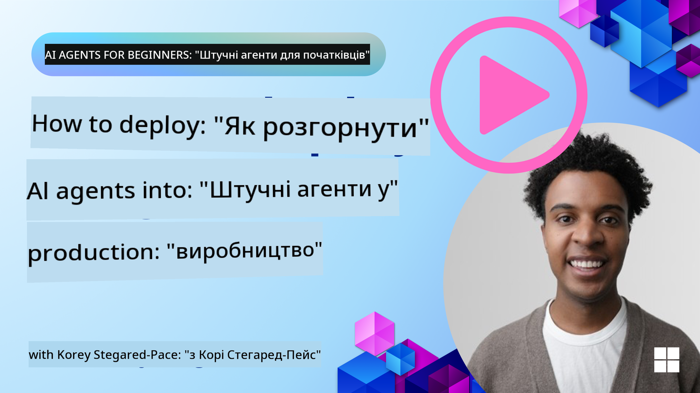

<!--
CO_OP_TRANSLATOR_METADATA:
{
  "original_hash": "1ad5de6a6388d02c145a92dd04358bab",
  "translation_date": "2025-07-12T13:43:27+00:00",
  "source_file": "10-ai-agents-production/README.md",
  "language_code": "uk"
}
-->

> _(Натисніть на зображення вище, щоб переглянути відео цього уроку)_
# AI Agents у виробництві

## Вступ

У цьому уроці ми розглянемо:

- Як ефективно планувати розгортання вашого AI Agent у виробничому середовищі.
- Типові помилки та проблеми, з якими ви можете зіткнутися під час розгортання AI Agent у виробництві.
- Як контролювати витрати, зберігаючи при цьому продуктивність вашого AI Agent.

## Цілі навчання

Після проходження цього уроку ви знатимете/розумітимете:

- Техніки покращення продуктивності, вартості та ефективності системи AI Agent у виробництві.
- Що і як оцінювати у ваших AI Agents.
- Як контролювати витрати при розгортанні AI Agents у виробництві.

Важливо розгортати AI Agents, яким можна довіряти. Також ознайомтеся з уроком "Building Trustworthy AI Agents".

## Оцінка AI Agents

До, під час і після розгортання AI Agents критично важливо мати належну систему оцінки ваших AI Agents. Це гарантує, що ваша система відповідає вашим цілям та цілям користувачів.

Для оцінки AI Agent важливо мати можливість оцінювати не лише вихідні дані агента, а й всю систему, в якій працює ваш AI Agent. Це включає, але не обмежується:

- Початковим запитом до моделі.
- Здатністю агента визначати наміри користувача.
- Здатністю агента вибирати правильний інструмент для виконання завдання.
- Відповіддю інструменту на запит агента.
- Здатністю агента інтерпретувати відповідь інструменту.
- Зворотним зв’язком користувача на відповідь агента.

Це дозволяє виявляти області для покращення більш модульно. Ви зможете ефективніше відстежувати вплив змін у моделях, підказках, інструментах та інших компонентах.

## Типові проблеми та можливі рішення з AI Agents

| **Проблема**                                   | **Можливе рішення**                                                                                                                                                                                                       |
| ---------------------------------------------- | -------------------------------------------------------------------------------------------------------------------------------------------------------------------------------------------------------------------------- |
| AI Agent не виконує завдання послідовно        | - Уточніть підказку, яку даєте AI Agent; будьте чіткими щодо цілей. - Визначте, де розподіл завдань на підзавдання і їх обробка кількома агентами може допомогти.                                                        |
| AI Agent потрапляє у безкінечні цикли          | - Переконайтеся, що є чіткі умови завершення, щоб агент знав, коли зупинити процес. - Для складних завдань, що потребують логіки та планування, використовуйте більшу модель, спеціалізовану на таких завданнях.          |
| Виклики інструментів AI Agent працюють погано  | - Тестуйте та перевіряйте вихідні дані інструменту поза системою агента. - Уточніть параметри, підказки та назви інструментів.                                                                                          |
| Система з кількома агентами працює нестабільно | - Уточніть підказки для кожного агента, щоб вони були конкретними та відрізнялися один від одного. - Побудуйте ієрархічну систему з "маршрутизуючим" або контролюючим агентом, який визначатиме, який агент підходить. |

## Управління витратами

Ось кілька стратегій для контролю витрат при розгортанні AI Agents у виробництві:

- **Кешування відповідей** — Визначення поширених запитів і завдань та надання відповідей до того, як вони потраплять у вашу агентську систему, допомагає зменшити обсяг схожих запитів. Ви навіть можете реалізувати механізм, який визначатиме схожість запиту з кешованими за допомогою простіших AI моделей.

- **Використання менших моделей** — Малі мовні моделі (SLMs) можуть добре справлятися з певними агентськими завданнями і значно знизити витрати. Як уже згадувалося, найкращий спосіб оцінити, наскільки добре SLM підходить для вашого випадку, — це побудувати систему оцінки для порівняння продуктивності з більшими моделями.

- **Використання маршрутизуючої моделі** — Схожа стратегія полягає у використанні різноманітних моделей і розмірів. Ви можете застосувати LLM/SLM або безсерверну функцію для маршрутизації запитів залежно від складності до найбільш підходящих моделей. Це допоможе знизити витрати і забезпечити продуктивність на потрібних завданнях.

## Вітаємо

Це наразі останній урок курсу "AI Agents for Beginners".

Ми плануємо додавати нові уроки на основі відгуків і змін у цій швидкозростаючій галузі, тож заходьте знову найближчим часом.

Якщо хочете продовжити навчання та розробку з AI Agents, приєднуйтесь до <a href="https://discord.gg/kzRShWzttr" target="_blank">Azure AI Community Discord</a>.

Там ми проводимо воркшопи, круглі столи спільноти та сесії "запитай мене про що завгодно".

Також у нас є колекція Learn з додатковими матеріалами, які допоможуть вам почати створювати AI Agents у виробництві.

## Попередній урок

[Metacognition Design Pattern](../09-metacognition/README.md)

**Відмова від відповідальності**:  
Цей документ було перекладено за допомогою сервісу автоматичного перекладу [Co-op Translator](https://github.com/Azure/co-op-translator). Хоча ми прагнемо до точності, будь ласка, майте на увазі, що автоматичні переклади можуть містити помилки або неточності. Оригінальний документ рідною мовою слід вважати авторитетним джерелом. Для критично важливої інформації рекомендується звертатися до професійного людського перекладу. Ми не несемо відповідальності за будь-які непорозуміння або неправильні тлумачення, що виникли внаслідок використання цього перекладу.