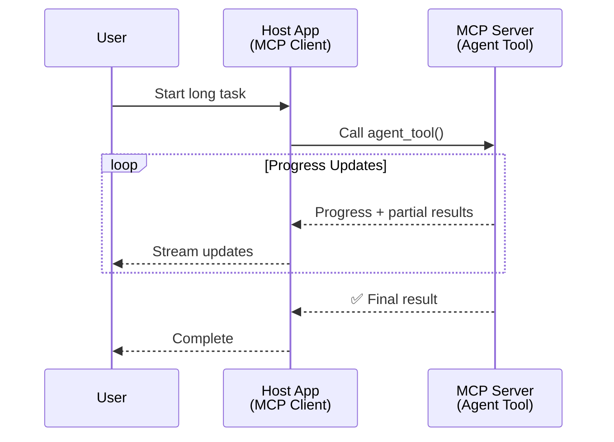
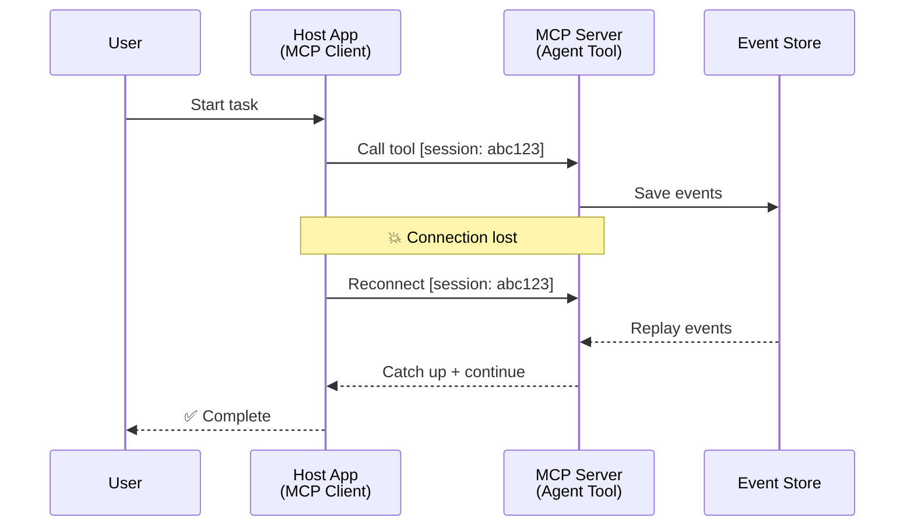
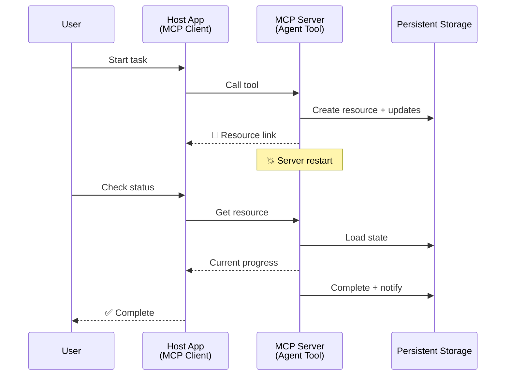
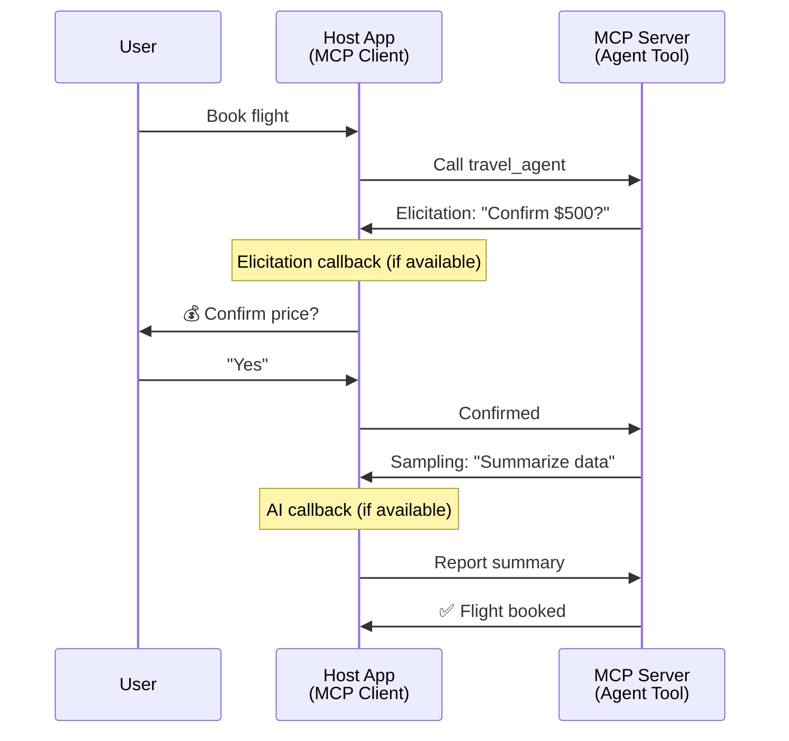

<!--
CO_OP_TRANSLATOR_METADATA:
{
  "original_hash": "5cc6836626047aa055e8960c8484a7d0",
  "translation_date": "2025-08-21T15:02:37+00:00",
  "source_file": "11-mcp/code_samples/mcp-agents/README.md",
  "language_code": "uk"
}
-->
# Побудова систем комунікації між агентами за допомогою MCP

> Коротко - Чи можна створити комунікацію між агентами на MCP? Так!

MCP значно розвинувся від своєї початкової мети "надання контексту для LLM". Завдяки останнім вдосконаленням, таким як [відновлювані потоки](https://modelcontextprotocol.io/docs/concepts/transports#resumability-and-redelivery), [запити на уточнення](https://modelcontextprotocol.io/specification/2025-06-18/client/elicitation), [вибірки](https://modelcontextprotocol.io/specification/2025-06-18/client/sampling) і сповіщення ([прогрес](https://modelcontextprotocol.io/specification/2025-06-18/basic/utilities/progress) та [ресурси](https://modelcontextprotocol.io/specification/2025-06-18/schema#resourceupdatednotification)), MCP тепер забезпечує надійну основу для створення складних систем комунікації між агентами.

## Неправильне уявлення про агента/інструмент

Зі зростанням інтересу розробників до інструментів із агентською поведінкою (тривала робота, необхідність додаткового вводу під час виконання тощо) поширюється хибне уявлення, що MCP не підходить для цього, оскільки ранні приклади його інструментів зосереджувалися на простих шаблонах запит-відповідь.

Це уявлення застаріле. Специфікація MCP значно вдосконалена за останні місяці, що дозволяє створювати тривалі агентські процеси:

- **Потокова передача та часткові результати**: Оновлення прогресу в реальному часі під час виконання
- **Відновлюваність**: Клієнти можуть відновлювати з'єднання після розриву
- **Стійкість**: Результати зберігаються після перезапуску сервера (наприклад, через посилання на ресурси)
- **Багатокроковість**: Інтерактивний ввід під час виконання через запити на уточнення та вибірки

Ці функції можна комбінувати для створення складних агентських і мультиагентських додатків, які працюють на основі протоколу MCP.

Для довідки, ми будемо називати агента "інструментом", доступним на сервері MCP. Це передбачає існування хост-додатка, який реалізує клієнт MCP, встановлює сесію із сервером MCP і може викликати агента.

## Що робить інструмент MCP "агентським"?

Перш ніж перейти до реалізації, визначимо, які інфраструктурні можливості потрібні для підтримки тривалих агентів.

> Ми визначимо агента як сутність, здатну працювати автономно протягом тривалого часу, виконуючи складні завдання, які можуть вимагати багаторазових взаємодій або коригувань на основі зворотного зв'язку в реальному часі.

### 1. Потокова передача та часткові результати

Традиційні шаблони запит-відповідь не підходять для тривалих завдань. Агенти повинні забезпечувати:

- Оновлення прогресу в реальному часі
- Проміжні результати

**Підтримка MCP**: Сповіщення про оновлення ресурсів дозволяють передавати часткові результати, хоча це вимагає ретельного проєктування, щоб уникнути конфліктів із моделлю 1:1 запит/відповідь JSON-RPC.

| Функція                     | Використання                                                                                                                                                                       | Підтримка MCP                                                                               |
| --------------------------- | ---------------------------------------------------------------------------------------------------------------------------------------------------------------------------------- | ------------------------------------------------------------------------------------------ |
| Оновлення прогресу в реальному часі | Користувач запитує завдання з міграції кодової бази. Агент передає прогрес: "10% - Аналіз залежностей... 25% - Конвертація файлів TypeScript... 50% - Оновлення імпортів..." | ✅ Сповіщення про прогрес                                                                   |
| Часткові результати         | Завдання "Створити книгу" передає часткові результати, наприклад: 1) План сюжету, 2) Список розділів, 3) Кожен завершений розділ. Хост може перевірити, скасувати або перенаправити на будь-якому етапі. | ✅ Сповіщення можуть бути "розширені", щоб включати часткові результати, див. пропозиції PR 383, 776 |

<strong>Рисунок 1:</strong> Ця діаграма ілюструє, як агент MCP передає оновлення прогресу в реальному часі та часткові результати хост-додатку під час тривалого завдання, дозволяючи користувачеві відстежувати виконання в реальному часі.

### 2. Відновлюваність

Агенти повинні обробляти переривання мережі без втрати даних:

- Відновлення після розриву з'єднання (з боку клієнта)
- Продовження з того місця, де зупинилися (повторна доставка повідомлень)

**Підтримка MCP**: Транспорт StreamableHTTP у MCP підтримує відновлення сесій і повторну доставку повідомлень за допомогою ідентифікаторів сесій і останніх ідентифікаторів подій. Важливо, щоб сервер реалізував EventStore, який дозволяє відтворювати події при повторному підключенні клієнта.  
Зазначимо, що існує пропозиція спільноти (PR #975), яка досліджує транспортно-незалежні відновлювані потоки.

| Функція       | Використання                                                                                                                                                   | Підтримка MCP                                                                |
| ------------- | -------------------------------------------------------------------------------------------------------------------------------------------------------------- | -------------------------------------------------------------------------- |
| Відновлюваність | Клієнт розриває з'єднання під час тривалого завдання. Після повторного підключення сесія відновлюється з відтворенням пропущених подій, продовжуючи без втрати прогресу. | ✅ Транспорт StreamableHTTP з ідентифікаторами сесій, відтворенням подій і EventStore |

<strong>Рисунок 2:</strong> Ця діаграма показує, як транспорт StreamableHTTP і EventStore у MCP забезпечують безперервне відновлення сесій: якщо клієнт розриває з'єднання, він може повторно підключитися і відтворити пропущені події, продовжуючи завдання без втрати прогресу.

### 3. Стійкість

Тривалі агенти потребують збереження стану:

- Результати зберігаються після перезапуску сервера
- Статус можна отримати поза сесією
- Відстеження прогресу між сесіями

**Підтримка MCP**: MCP тепер підтримує тип повернення Resource link для викликів інструментів. Сьогодні можливою схемою є проєктування інструменту, який створює ресурс і негайно повертає посилання на нього. Інструмент може продовжувати виконувати завдання у фоновому режимі та оновлювати ресурс. У свою чергу, клієнт може вибрати опитування стану цього ресурсу для отримання часткових або повних результатів (залежно від оновлень ресурсу, які надає сервер) або підписатися на ресурс для отримання сповіщень про оновлення.

Одним із обмежень є те, що опитування ресурсів або підписка на оновлення можуть споживати ресурси, що має наслідки для масштабування. Існує відкрита пропозиція спільноти (включаючи #992), яка досліджує можливість включення вебхуків або тригерів, які сервер може викликати для сповіщення клієнта/хост-додатку про оновлення.

| Функція     | Використання                                                                                                                                        | Підтримка MCP                                                        |
| ----------- | --------------------------------------------------------------------------------------------------------------------------------------------------- | ------------------------------------------------------------------ |
| Стійкість   | Сервер аварійно завершує роботу під час завдання з міграції даних. Результати та прогрес зберігаються після перезапуску, клієнт може перевірити статус і продовжити збережений ресурс. | ✅ Посилання на ресурси з постійним зберіганням і сповіщеннями про статус |

Сьогодні поширеним шаблоном є проєктування інструменту, який створює ресурс і негайно повертає посилання на нього. Інструмент може у фоновому режимі виконувати завдання, видавати сповіщення про ресурс, які слугують оновленнями прогресу або включають часткові результати, і оновлювати вміст у ресурсі за потреби.

<strong>Рисунок 3:</strong> Ця діаграма демонструє, як агенти MCP використовують постійні ресурси та сповіщення про статус для забезпечення того, щоб тривалі завдання зберігалися після перезапуску сервера, дозволяючи клієнтам перевіряти прогрес і отримувати результати навіть після збоїв.

### 4. Багатокрокові взаємодії

Агенти часто потребують додаткового вводу під час виконання:

- Уточнення або підтвердження від людини
- Допомога ШІ для складних рішень
- Динамічне налаштування параметрів

**Підтримка MCP**: Повністю підтримується через вибірки (для вводу ШІ) і запити на уточнення (для вводу людини).

| Функція                 | Використання                                                                                                                                     | Підтримка MCP                                           |
| ----------------------- | -------------------------------------------------------------------------------------------------------------------------------------------- | ----------------------------------------------------- |
| Багатокрокові взаємодії | Агент з бронювання подорожей запитує підтвердження ціни у користувача, потім просить ШІ підсумувати дані про подорож перед завершенням транзакції. | ✅ Запити на уточнення для вводу людини, вибірки для вводу ШІ |

<strong>Рисунок 4:</strong> Ця діаграма показує, як агенти MCP можуть інтерактивно запитувати ввід людини або ШІ під час виконання, підтримуючи складні багатокрокові робочі процеси, такі як підтвердження та динамічне прийняття рішень.

...

**Відмова від відповідальності**:  
Цей документ було перекладено за допомогою сервісу автоматичного перекладу [Co-op Translator](https://github.com/Azure/co-op-translator). Хоча ми прагнемо до точності, будь ласка, майте на увазі, що автоматичні переклади можуть містити помилки або неточності. Оригінальний документ на його рідній мові слід вважати авторитетним джерелом. Для критично важливої інформації рекомендується професійний людський переклад. Ми не несемо відповідальності за будь-які непорозуміння або неправильне тлумачення, що виникли внаслідок використання цього перекладу.