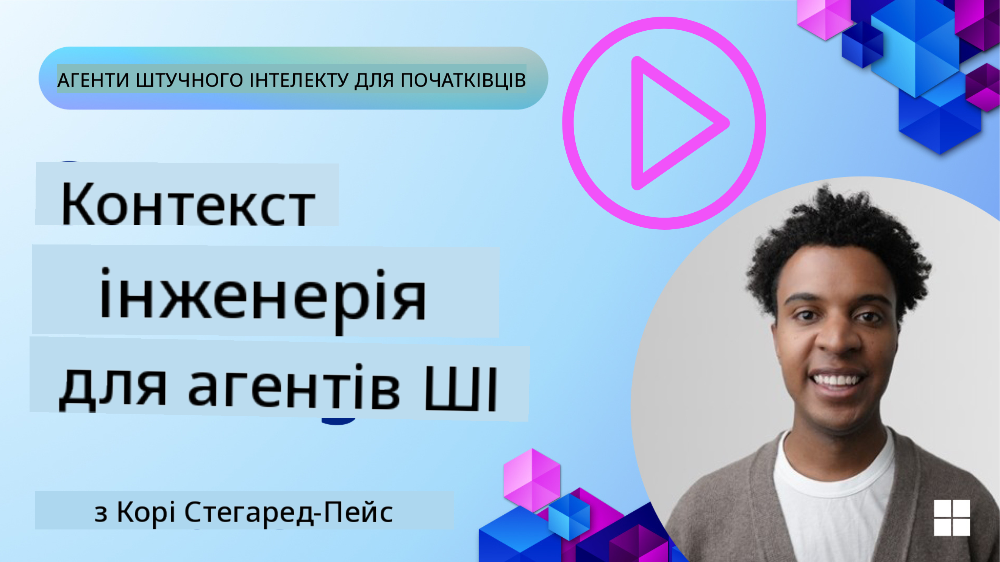
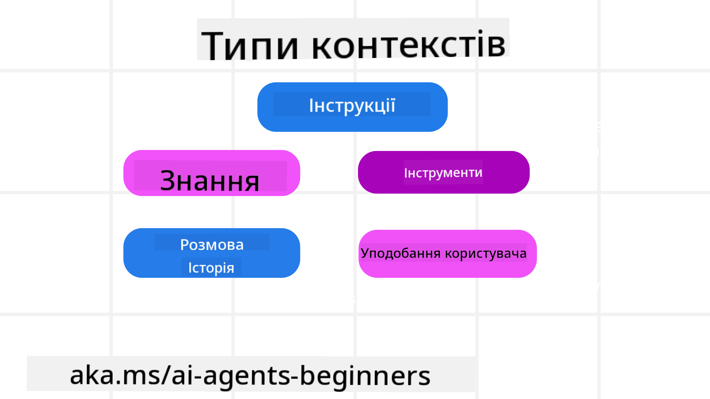
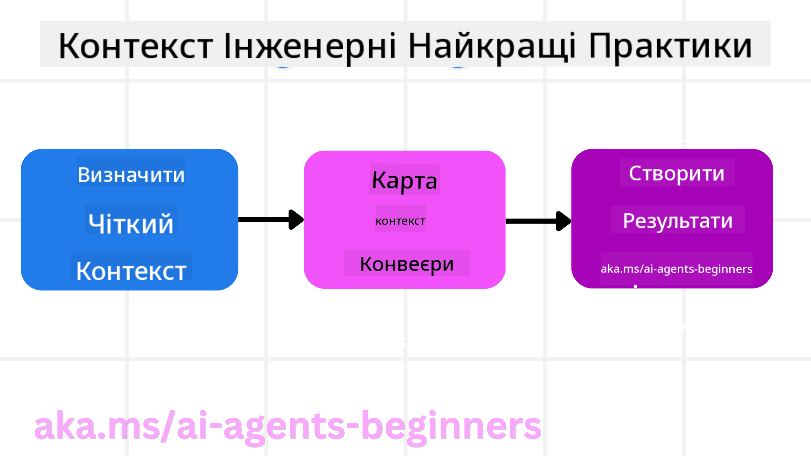

<!--
CO_OP_TRANSLATOR_METADATA:
{
  "original_hash": "cb7e50f471905ce6fdb92a30269a7a98",
  "translation_date": "2025-09-04T10:34:16+00:00",
  "source_file": "12-context-engineering/README.md",
  "language_code": "uk"
}
-->
# Інженерія контексту для AI-агентів

> _(Натисніть на зображення вище, щоб переглянути відео цього уроку)_

Розуміння складності застосунку, для якого ви створюєте AI-агента, є важливим для забезпечення його надійності. Нам потрібно створювати AI-агентів, які ефективно управляють інформацією для вирішення складних завдань, що виходять за межі простого налаштування підказок.

У цьому уроці ми розглянемо, що таке інженерія контексту і яку роль вона відіграє у створенні AI-агентів.

## Вступ

Цей урок охоплює:

• **Що таке інженерія контексту** і чим вона відрізняється від інженерії підказок.

• **Стратегії ефективної інженерії контексту**, включаючи написання, вибір, стиснення та ізоляцію інформації.

• **Поширені помилки контексту**, які можуть завадити роботі вашого AI-агента, і способи їх виправлення.

## Цілі навчання

Після завершення цього уроку ви зможете:

• **Дати визначення інженерії контексту** і відрізнити її від інженерії підказок.

• **Визначати ключові компоненти контексту** у застосунках з використанням великих мовних моделей (LLM).

• **Застосовувати стратегії написання, вибору, стиснення та ізоляції контексту** для покращення продуктивності агентів.

• **Розпізнавати поширені помилки контексту**, такі як отруєння, відволікання, плутанина та конфлікти, і впроваджувати методи їх усунення.

## Що таке інженерія контексту?

Для AI-агентів контекст є основою для планування дій, які агент має виконати. Інженерія контексту — це практика забезпечення того, щоб AI-агент мав правильну інформацію для виконання наступного кроку завдання. Вікно контексту має обмежений розмір, тому розробникам агентів потрібно створювати системи та процеси для управління додаванням, видаленням і стисненням інформації у вікні контексту.

### Інженерія підказок vs Інженерія контексту

Інженерія підказок зосереджена на створенні статичного набору інструкцій для ефективного керування AI-агентами за допомогою правил. Інженерія контексту стосується управління динамічним набором інформації, включаючи початкову підказку, щоб забезпечити наявність необхідних даних у агента з часом. Основна ідея інженерії контексту полягає в тому, щоб зробити цей процес повторюваним і надійним.

### Типи контексту

Важливо пам’ятати, що контекст — це не щось одне. Інформація, яка потрібна AI-агенту, може надходити з різних джерел, і саме ми маємо забезпечити доступ агента до цих джерел:

Типи контексту, які AI-агент може потребувати для управління, включають:

• **Інструкції:** Це "правила" агента – підказки, системні повідомлення, приклади few-shot (показують AI, як виконувати завдання) і описи інструментів, які він може використовувати. Тут інженерія підказок поєднується з інженерією контексту.

• **Знання:** Це факти, інформація, отримана з баз даних, або довготривалі спогади, які накопичив агент. Це включає інтеграцію системи RAG (Retrieval Augmented Generation), якщо агенту потрібен доступ до різних сховищ знань і баз даних.

• **Інструменти:** Це визначення зовнішніх функцій, API та MCP-серверів, які агент може викликати, а також зворотний зв’язок (результати), який він отримує від їх використання.

• **Історія розмов:** Поточний діалог із користувачем. З часом ці розмови стають довшими та складнішими, що означає, що вони займають більше місця у вікні контексту.

• **Уподобання користувача:** Інформація, отримана про вподобання чи невподобання користувача з часом. Її можна зберігати та використовувати для прийняття ключових рішень, які допоможуть користувачеві.

## Стратегії ефективної інженерії контексту

### Стратегії планування

Ефективна інженерія контексту починається з ретельного планування. Ось підхід, який допоможе вам почати застосовувати концепцію інженерії контексту:

1. **Визначте чіткі результати** – Результати завдань, які будуть призначені AI-агентам, мають бути чітко визначені. Відповідайте на запитання: "Як виглядатиме світ, коли AI-агент завершить своє завдання?" Іншими словами, яку зміну, інформацію чи відповідь має отримати користувач після взаємодії з AI-агентом.

2. **Складіть карту контексту** – Після визначення результатів AI-агента потрібно відповісти на запитання: "Яка інформація потрібна AI-агенту для виконання цього завдання?" Таким чином ви зможете скласти карту контексту, де знаходиться ця інформація.

3. **Створіть контекстні конвеєри** – Тепер, коли ви знаєте, де знаходиться інформація, потрібно відповісти на запитання: "Як агент отримає цю інформацію?" Це можна зробити різними способами, включаючи RAG, використання MCP-серверів та інших інструментів.

### Практичні стратегії

Планування важливе, але коли інформація починає надходити у вікно контексту агента, потрібно мати практичні стратегії для її управління:

#### Управління контекстом

Хоча деяка інформація буде додаватися до вікна контексту автоматично, інженерія контексту передбачає більш активну роль у цьому процесі, що можна зробити за допомогою кількох стратегій:

1. **Чернетка агента**  
Це дозволяє AI-агенту робити нотатки про релевантну інформацію щодо поточних завдань і взаємодій із користувачем під час однієї сесії. Ці нотатки мають зберігатися поза вікном контексту у файлі або об’єкті виконання, до якого агент може звернутися пізніше під час цієї сесії, якщо це потрібно.

2. **Спогади**  
Чернетки добре підходять для управління інформацією поза вікном контексту однієї сесії. Спогади дозволяють агентам зберігати та отримувати релевантну інформацію між кількома сесіями. Це може включати резюме, уподобання користувача та відгуки для покращення в майбутньому.

3. **Стиснення контексту**  
Коли вікно контексту заповнюється і наближається до свого ліміту, можна використовувати такі техніки, як узагальнення та обрізання. Це включає збереження лише найрелевантнішої інформації або видалення старих повідомлень.

4. **Системи з кількома агентами**  
Розробка системи з кількома агентами є формою інженерії контексту, оскільки кожен агент має своє вікно контексту. Планування того, як цей контекст буде передаватися між агентами, є ще одним важливим аспектом.

5. **Пісочниці**  
Якщо агенту потрібно виконати код або обробити великі обсяги інформації з документа, це може зайняти багато токенів для обробки результатів. Замість того, щоб зберігати все це у вікні контексту, агент може використовувати пісочницю, яка виконує цей код і зчитує лише результати та іншу релевантну інформацію.

6. **Об’єкти стану виконання**  
Це створення контейнерів інформації для управління ситуаціями, коли агенту потрібен доступ до певної інформації. Для складного завдання це дозволяє агенту зберігати результати кожного підзавдання крок за кроком, зберігаючи контекст, пов’язаний лише з цим підзавданням.

### Приклад інженерії контексту

Припустимо, ми хочемо, щоб AI-агент **"Забронював мені подорож до Парижа."**

• Простий агент, який використовує лише інженерію підказок, може просто відповісти: **"Добре, коли ви хочете поїхати до Парижа?"** Він обробляє лише ваше пряме запитання в момент, коли ви його задали.

• Агент, який використовує стратегії інженерії контексту, розглянуті вище, зробить набагато більше. Перед тим, як відповісти, його система може:

  ◦ **Перевірити ваш календар** на наявність вільних дат (отримуючи дані в реальному часі).

  ◦ **Згадати попередні вподобання щодо подорожей** (з довготривалої пам’яті), наприклад, вашу улюблену авіакомпанію, бюджет або перевагу прямих рейсів.

  ◦ **Визначити доступні інструменти** для бронювання рейсів і готелів.

- Потім приклад відповіді може бути таким: "Привіт, [Ваше ім’я]! Я бачу, що ви вільні на першому тижні жовтня. Чи шукати прямі рейси до Парижа на [Улюблена авіакомпанія] у межах вашого звичного бюджету [Бюджет]?" Ця багатша, контекстно-обізнана відповідь демонструє силу інженерії контексту.

## Поширені помилки контексту

### Отруєння контексту

**Що це:** Коли галюцинація (хибна інформація, згенерована LLM) або помилка потрапляє в контекст і постійно використовується, змушуючи агента переслідувати неможливі цілі або розробляти безглузді стратегії.

**Що робити:** Впроваджуйте **перевірку контексту** та **карантин**. Перевіряйте інформацію перед її додаванням до довготривалої пам’яті. Якщо виявлено потенційне отруєння, починайте нові контекстні потоки, щоб запобігти поширенню хибної інформації.

**Приклад бронювання подорожі:** Ваш агент галюцинує **прямий рейс із невеликого місцевого аеропорту до далекого міжнародного міста**, який насправді не пропонує міжнародних рейсів. Ця неіснуюча деталь рейсу зберігається в контексті. Пізніше, коли ви просите агента забронювати квиток, він продовжує шукати квитки на цей неможливий маршрут, що призводить до повторюваних помилок.

**Рішення:** Впровадьте крок, який **перевіряє існування рейсу та маршрут через API в реальному часі** _перед_ додаванням деталей рейсу до робочого контексту агента. Якщо перевірка не вдається, хибна інформація "карантинується" і більше не використовується.

### Відволікання контексту

**Що це:** Коли контекст стає настільки великим, що модель надто зосереджується на накопиченій історії, замість використання того, що вона навчилася під час тренування, що призводить до повторюваних або некорисних дій. Моделі можуть почати робити помилки навіть до того, як вікно контексту заповниться.

**Що робити:** Використовуйте **узагальнення контексту**. Періодично стискайте накопичену інформацію в коротші резюме, зберігаючи важливі деталі та видаляючи зайву історію. Це допомагає "перезавантажити" фокус.

**Приклад бронювання подорожі:** Ви довго обговорювали різні мрії про подорожі, включаючи детальний опис вашої подорожі з рюкзаком два роки тому. Коли ви нарешті просите **"знайти мені дешевий рейс на наступний місяць"**, агент заплутується в старих, нерелевантних деталях і продовжує запитувати про ваше спорядження для рюкзака або минулі маршрути, ігноруючи ваш поточний запит.

**Рішення:** Після певної кількості обертів або коли контекст стає занадто великим, агент має **узагальнити найновіші та найрелевантніші частини розмови** – зосереджуючись на ваших поточних датах подорожі та пункті призначення – і використовувати це стисле резюме для наступного виклику LLM, відкидаючи менш релевантну історичну розмову.

### Плутанина контексту

**Що це:** Коли зайвий контекст, часто у вигляді занадто великої кількості доступних інструментів, змушує модель генерувати погані відповіді або викликати нерелевантні інструменти. Особливо схильні до цього менші моделі.

**Що робити:** Впроваджуйте **управління завантаженням інструментів** за допомогою технік RAG. Зберігайте описи інструментів у векторній базі даних і вибирайте _лише_ найрелевантніші інструменти для кожного конкретного завдання. Дослідження показують, що обмеження вибору інструментів до менше ніж 30 є ефективним.

**Приклад бронювання подорожі:** Ваш агент має доступ до десятків інструментів: `book_flight`, `book_hotel`, `rent_car`, `find_tours`, `currency_converter`, `weather_forecast`, `restaurant_reservations` тощо. Ви запитуєте: **"Який найкращий спосіб пересуватися Парижем?"** Через велику кількість інструментів агент плутається і намагається викликати `book_flight` _всередині_ Парижа або `rent_car`, хоча ви віддаєте перевагу громадському транспорту, оскільки описи інструментів можуть перекриватися або агент просто не може визначити найкращий.

**Рішення:** Використовуйте **RAG для описів інструментів**. Коли ви запитуєте про пересування Парижем, система динамічно отримує _лише_ найрелевантніші інструменти, такі як `rent_car` або `public_transport_info`, на основі вашого запиту, представляючи сфокусований "набір" інструментів для LLM.

### Конфлікт контексту

**Що це:** Коли в контексті існує суперечлива інформація, що призводить до непослідовного мислення або поганих фінальних відповідей. Це часто трапляється, коли інформація надходить поетапно, і ранні, неправильні припущення залишаються в контексті.

**Що робити:** Використовуйте **обрізання контексту** та **вивантаження**. Обрізання означає видалення застарілої або суперечливої інформації, коли надходять нові деталі. Вивантаження дозволяє моделі мати окремий "робочий простір" для обробки інформації без захаращення основного контексту.

**Приклад бронювання подорожі:** Спочатку ви кажете своєму агенту: **"Я хочу летіти економ-класом."** Пізніше в розмові ви змінюєте свою думку і кажете: **"Насправді, для цієї подорожі давайте оберемо бізнес-клас

---

**Відмова від відповідальності**:  
Цей документ було перекладено за допомогою сервісу автоматичного перекладу [Co-op Translator](https://github.com/Azure/co-op-translator). Хоча ми прагнемо до точності, зверніть увагу, що автоматичні переклади можуть містити помилки або неточності. Оригінальний документ мовою оригіналу слід вважати авторитетним джерелом. Для критично важливої інформації рекомендується професійний людський переклад. Ми не несемо відповідальності за будь-які непорозуміння або неправильні тлумачення, що виникли внаслідок використання цього перекладу.