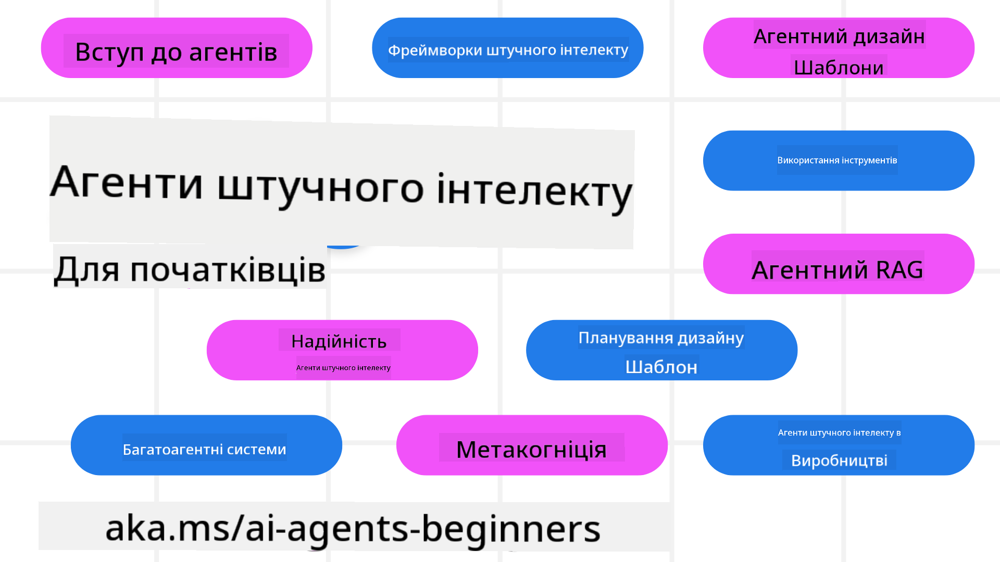

<!--
CO_OP_TRANSLATOR_METADATA:
{
  "original_hash": "6b07046397366e6f6f4524c9ddeba1e1",
  "translation_date": "2025-07-12T15:03:16+00:00",
  "source_file": "README.md",
  "language_code": "uk"
}
-->
# AI Агенти для початківців - Курс

## 11 уроків, які навчать всьому необхідному для початку створення AI Агентів

### 🌐 Підтримка кількох мов

#### Підтримується через GitHub Action (Автоматично та завжди актуально)

[French](../fr/README.md) | [Spanish](../es/README.md) | [German](../de/README.md) | [Russian](../ru/README.md) | [Arabic](../ar/README.md) | [Persian (Farsi)](../fa/README.md) | [Urdu](../ur/README.md) | [Chinese (Simplified)](../zh/README.md) | [Chinese (Traditional, Macau)](../mo/README.md) | [Chinese (Traditional, Hong Kong)](../hk/README.md) | [Chinese (Traditional, Taiwan)](../tw/README.md) | [Japanese](../ja/README.md) | [Korean](../ko/README.md) | [Hindi](../hi/README.md) | [Bengali](../bn/README.md) | [Marathi](../mr/README.md) | [Nepali](../ne/README.md) | [Punjabi (Gurmukhi)](../pa/README.md) | [Portuguese (Portugal)](../pt/README.md) | [Portuguese (Brazil)](../br/README.md) | [Italian](../it/README.md) | [Polish](../pl/README.md) | [Turkish](../tr/README.md) | [Greek](../el/README.md) | [Thai](../th/README.md) | [Swedish](../sv/README.md) | [Danish](../da/README.md) | [Norwegian](../no/README.md) | [Finnish](../fi/README.md) | [Dutch](../nl/README.md) | [Hebrew](../he/README.md) | [Vietnamese](../vi/README.md) | [Indonesian](../id/README.md) | [Malay](../ms/README.md) | [Tagalog (Filipino)](../tl/README.md) | [Swahili](../sw/README.md) | [Hungarian](../hu/README.md) | [Czech](../cs/README.md) | [Slovak](../sk/README.md) | [Romanian](../ro/README.md) | [Bulgarian](../bg/README.md) | [Serbian (Cyrillic)](../sr/README.md) | [Croatian](../hr/README.md) | [Slovenian](../sl/README.md) | [Ukrainian](./README.md) | [Burmese (Myanmar)](../my/README.md)

**Якщо ви хочете, щоб додаткові мови перекладу були підтримані, вони перелічені [тут](https://github.com/Azure/co-op-translator/blob/main/getting_started/supported-languages.md)**

## 🌱 Початок роботи

Цей курс складається з 11 уроків, які охоплюють основи створення AI Агентів. Кожен урок присвячений окремій темі, тож починайте з будь-якого, який вам до вподоби!

Для цього курсу доступна підтримка кількох мов. Перегляньте [доступні мови тут](../..).

Якщо ви вперше працюєте з моделями Generative AI, ознайомтеся з нашим курсом [Generative AI For Beginners](https://aka.ms/genai-beginners), який містить 21 урок зі створення на базі GenAI.

Не забудьте [поставити зірочку (🌟) цьому репозиторію](https://docs.github.com/en/get-started/exploring-projects-on-github/saving-repositories-with-stars?WT.mc_id=academic-105485-koreyst) та [форкнути цей репозиторій](https://github.com/microsoft/ai-agents-for-beginners/fork), щоб запускати код.

### Що вам потрібно

Кожен урок цього курсу містить приклади коду, які можна знайти у папці code_samples. Ви можете [форкнути цей репозиторій](https://github.com/microsoft/ai-agents-for-beginners/fork), щоб створити власну копію.

Приклади коду в цих вправах використовують Azure AI Foundry та GitHub Model Catalogs для взаємодії з мовними моделями:

- [Github Models](https://aka.ms/ai-agents-beginners/github-models) - Безкоштовно / Обмежено
- [Azure AI Foundry](https://aka.ms/ai-agents-beginners/ai-foundry) - Потрібен обліковий запис Azure

Цей курс також використовує наступні фреймворки та сервіси AI Агентів від Microsoft:

- [Azure AI Agent Service](https://aka.ms/ai-agents-beginners/ai-agent-service)
- [Semantic Kernel](https://aka.ms/ai-agents-beginners/semantic-kernel)
- [AutoGen](https://aka.ms/ai-agents/autogen)

Для отримання додаткової інформації про запуск коду для цього курсу перейдіть до [Course Setup](./00-course-setup/README.md).

## 🙏 Хочете допомогти?

Маєте пропозиції або знайшли помилки у тексті чи коді? [Створіть issue](https://github.com/microsoft/ai-agents-for-beginners/issues?WT.mc_id=academic-105485-koreyst) або [запропонуйте pull request](https://github.com/microsoft/ai-agents-for-beginners/pulls?WT.mc_id=academic-105485-koreyst).

Якщо у вас виникли труднощі або є питання щодо створення AI Агентів, приєднуйтесь до нашого [Azure AI Foundry Community Discord](https://discord.gg/kzRShWzttr).

Якщо у вас є відгуки про продукт або помилки під час розробки, відвідайте наш [Azure AI Foundry Developer Forum](https://aka.ms/azureaifoundry/forum).

## 📂 Кожен урок включає

- Текстовий урок у README та коротке відео
- Приклади коду на Python, що підтримують Azure AI Foundry та Github Models (безкоштовно)
- Посилання на додаткові ресурси для подальшого навчання

## 🗃️ Уроки

| **Урок**                                | **Текст і код**                                    | **Відео**                                                  | **Додаткове навчання**                                                                 |
|-----------------------------------------|----------------------------------------------------|------------------------------------------------------------|----------------------------------------------------------------------------------------|
| Вступ до AI Агентів та їх застосування  | [Посилання](./01-intro-to-ai-agents/README.md)     | [Відео](https://youtu.be/3zgm60bXmQk?si=z8QygFvYQv-9WtO1)  | [Посилання](https://aka.ms/ai-agents-beginners/collection?WT.mc_id=academic-105485-koreyst) |
| Огляд AI агентських фреймворків          | [Посилання](./02-explore-agentic-frameworks/README.md) | [Відео](https://youtu.be/ODwF-EZo_O8?si=Vawth4hzVaHv-u0H)  | [Посилання](https://aka.ms/ai-agents-beginners/collection?WT.mc_id=academic-105485-koreyst) |
| Розуміння патернів дизайну AI агентів   | [Посилання](./03-agentic-design-patterns/README.md) | [Відео](https://youtu.be/m9lM8qqoOEA?si=BIzHwzstTPL8o9GF)  | [Посилання](https://aka.ms/ai-agents-beginners/collection?WT.mc_id=academic-105485-koreyst) |
| Патерн використання інструментів         | [Посилання](./04-tool-use/README.md)               | [Відео](https://youtu.be/vieRiPRx-gI?si=2z6O2Xu2cu_Jz46N)  | [Посилання](https://aka.ms/ai-agents-beginners/collection?WT.mc_id=academic-105485-koreyst) |
| Agentic RAG                             | [Посилання](./05-agentic-rag/README.md)            | [Відео](https://youtu.be/WcjAARvdL7I?si=gKPWsQpKiIlDH9A3)  | [Посилання](https://aka.ms/ai-agents-beginners/collection?WT.mc_id=academic-105485-koreyst) |
| Створення надійних AI Агентів            | [Посилання](./06-building-trustworthy-agents/README.md) | [Відео](https://youtu.be/iZKkMEGBCUQ?si=jZjpiMnGFOE9L8OK ) | [Посилання](https://aka.ms/ai-agents-beginners/collection?WT.mc_id=academic-105485-koreyst) |
| Патерн планування                       | [Посилання](./07-planning-design/README.md)        | [Відео](https://youtu.be/kPfJ2BrBCMY?si=6SC_iv_E5-mzucnC)  | [Посилання](https://aka.ms/ai-agents-beginners/collection?WT.mc_id=academic-105485-koreyst) |
| Патерн мультиагентної системи           | [Посилання](./08-multi-agent/README.md)            | [Відео](https://youtu.be/V6HpE9hZEx0?si=rMgDhEu7wXo2uo6g)  | [Посилання](https://aka.ms/ai-agents-beginners/collection?WT.mc_id=academic-105485-koreyst) |
| Патерн метакогніції                    | [Посилання](./09-metacognition/README.md)          | [Відео](https://youtu.be/His9R6gw6Ec?si=8gck6vvdSNCt6OcF)  | [Посилання](https://aka.ms/ai-agents-beginners/collection?WT.mc_id=academic-105485-koreyst) |
| AI Агенти у продакшені                  | [Посилання](./10-ai-agents-production/README.md)   | [Відео](https://youtu.be/l4TP6IyJxmQ?si=31dnhexRo6yLRJDl)  | [Посилання](https://aka.ms/ai-agents-beginners/collection?WT.mc_id=academic-105485-koreyst) |
| AI Агенти з MCP                        | [Посилання](./11-mcp/README.md)                     |                                                            | [Посилання](https://aka.ms/mcp-for-beginners)                                           |

## 🎒 Інші курси

Наша команда створює й інші курси! Перегляньте:
- [**НОВИЙ** Протокол контексту моделі (MCP) для початківців](https://github.com/microsoft/mcp-for-beginners?WT.mc_id=academic-105485-koreyst)
- [Генеративний ШІ для початківців з використанням .NET](https://github.com/microsoft/Generative-AI-for-beginners-dotnet?WT.mc_id=academic-105485-koreyst)
- [Генеративний ШІ для початківців](https://github.com/microsoft/generative-ai-for-beginners?WT.mc_id=academic-105485-koreyst)
- [Машинне навчання для початківців](https://aka.ms/ml-beginners?WT.mc_id=academic-105485-koreyst)
- [Наука про дані для початківців](https://aka.ms/datascience-beginners?WT.mc_id=academic-105485-koreyst)
- [ШІ для початківців](https://aka.ms/ai-beginners?WT.mc_id=academic-105485-koreyst)
- [Кібербезпека для початківців](https://github.com/microsoft/Security-101??WT.mc_id=academic-96948-sayoung)
- [Веб-розробка для початківців](https://aka.ms/webdev-beginners?WT.mc_id=academic-105485-koreyst)
- [Інтернет речей для початківців](https://aka.ms/iot-beginners?WT.mc_id=academic-105485-koreyst)
- [Розробка XR для початківців](https://github.com/microsoft/xr-development-for-beginners?WT.mc_id=academic-105485-koreyst)
- [Опановування GitHub Copilot для парного програмування з ШІ](https://aka.ms/GitHubCopilotAI?WT.mc_id=academic-105485-koreyst)
- [Опановування GitHub Copilot для розробників C#/.NET](https://github.com/microsoft/mastering-github-copilot-for-dotnet-csharp-developers?WT.mc_id=academic-105485-koreyst)
- [Обери свою пригоду з Copilot](https://github.com/microsoft/CopilotAdventures?WT.mc_id=academic-105485-koreyst)

## 🌟 Подяка спільноті

Дякуємо [Shivam Goyal](https://www.linkedin.com/in/shivam2003/) за внесок важливих прикладів коду, що демонструють Agentic RAG.

## Внесок у проєкт

Цей проєкт відкритий для внесків і пропозицій. Більшість внесків вимагають вашої згоди з
Contributor License Agreement (CLA), що підтверджує ваше право і фактичне надання нам
прав на використання вашого внеску. Детальніше дивіться на 
<https://cla.opensource.microsoft.com>.

Коли ви надсилаєте pull request, CLA-бот автоматично визначить, чи потрібно вам надати
CLA, і відповідно позначить PR (наприклад, перевірка статусу, коментар). Просто дотримуйтесь інструкцій,
які надасть бот. Вам потрібно буде зробити це лише один раз для всіх репозиторіїв, що використовують наш CLA.

Цей проєкт прийняв [Microsoft Open Source Code of Conduct](https://opensource.microsoft.com/codeofconduct/).
Для додаткової інформації дивіться [Поширені запитання щодо Кодексу поведінки](https://opensource.microsoft.com/codeofconduct/faq/) або
зв’яжіться з [opencode@microsoft.com](mailto:opencode@microsoft.com) з будь-якими питаннями чи коментарями.

## Торгові марки

Цей проєкт може містити торгові марки або логотипи проєктів, продуктів чи послуг. Авторизоване використання торгових марок або логотипів Microsoft підпорядковується і має відповідати
[Microsoft's Trademark & Brand Guidelines](https://www.microsoft.com/legal/intellectualproperty/trademarks/usage/general).
Використання торгових марок або логотипів Microsoft у змінених версіях цього проєкту не повинно викликати плутанину або створювати враження спонсорства Microsoft.
Використання торгових марок або логотипів третіх сторін підпорядковується політикам цих третіх сторін.

**Відмова від відповідальності**:  
Цей документ було перекладено за допомогою сервісу автоматичного перекладу [Co-op Translator](https://github.com/Azure/co-op-translator). Хоча ми прагнемо до точності, будь ласка, майте на увазі, що автоматичні переклади можуть містити помилки або неточності. Оригінальний документ рідною мовою слід вважати авторитетним джерелом. Для критично важливої інформації рекомендується звертатися до професійного людського перекладу. Ми не несемо відповідальності за будь-які непорозуміння або неправильні тлумачення, що виникли внаслідок використання цього перекладу.