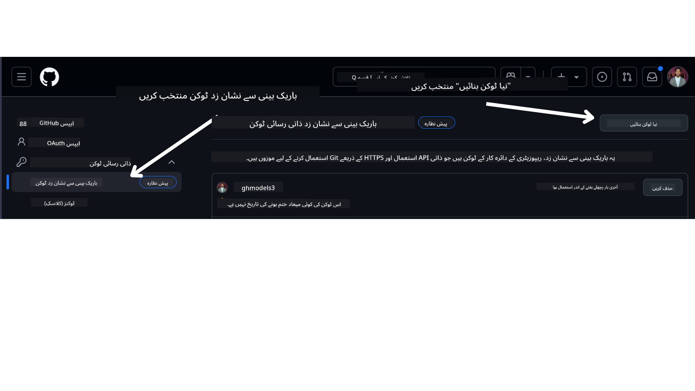

<!--
CO_OP_TRANSLATOR_METADATA:
{
  "original_hash": "76945069b52a49cd0432ae3e0b0ba22e",
  "translation_date": "2025-07-12T07:44:23+00:00",
  "source_file": "00-course-setup/README.md",
  "language_code": "ur"
}
-->
اپنے GitHub اکاؤنٹ میں جائیں۔

اپنی اسکرین کے بائیں جانب `Fine-grained tokens` کا انتخاب کریں۔

پھر `Generate new token` کو منتخب کریں۔



آپ سے ٹوکن کے لیے نام درج کرنے، میعاد ختم ہونے کی تاریخ منتخب کرنے (تجویز کردہ: 30 دن)، اور ٹوکن کے دائرہ کار (Public Repositories) منتخب کرنے کو کہا جائے گا۔

اس ٹوکن کی اجازتوں میں ترمیم کرنا بھی ضروری ہے: Permissions -> Models -> GitHub Models تک رسائی کی اجازت دیتا ہے۔

اپنا نیا ٹوکن کاپی کریں جو آپ نے ابھی بنایا ہے۔ اب آپ اسے اس کورس میں شامل `.env` فائل میں شامل کریں گے۔


### مرحلہ 2: اپنی `.env` فائل بنائیں

اپنی `.env` فائل بنانے کے لیے اپنے ٹرمینل میں درج ذیل کمانڈ چلائیں۔

```bash
cp .env.example .env
```

یہ مثال فائل کو کاپی کرے گا اور آپ کے ڈائریکٹری میں `.env` فائل بنائے گا جہاں آپ ماحولیاتی متغیرات کی قدریں بھر سکیں گے۔

اپنا ٹوکن کاپی کرنے کے بعد، `.env` فائل کو اپنے پسندیدہ ٹیکسٹ ایڈیٹر میں کھولیں اور `GITHUB_TOKEN` فیلڈ میں اپنا ٹوکن پیسٹ کریں۔

اب آپ اس کورس کے کوڈ نمونے چلا سکیں گے۔

## Azure AI Foundry اور Azure AI Agent Service استعمال کرنے والے نمونوں کے لیے سیٹ اپ

### مرحلہ 1: اپنا Azure پروجیکٹ اینڈپوائنٹ حاصل کریں

Azure AI Foundry میں ہب اور پروجیکٹ بنانے کے لیے درج ذیل ہدایات پر عمل کریں: [Hub resources overview](https://learn.microsoft.com/en-us/azure/ai-foundry/concepts/ai-resources)

پروجیکٹ بنانے کے بعد، آپ کو اپنے پروجیکٹ کے کنکشن سٹرنگ کی ضرورت ہوگی۔

یہ Azure AI Foundry پورٹل میں اپنے پروجیکٹ کے **Overview** صفحے پر جا کر حاصل کیا جا سکتا ہے۔


### مرحلہ 2: اپنی `.env` فائل بنائیں

اپنی `.env` فائل بنانے کے لیے اپنے ٹرمینل میں درج ذیل کمانڈ چلائیں۔

```bash
cp .env.example .env
```

یہ مثال فائل کو کاپی کرے گا اور آپ کے ڈائریکٹری میں `.env` فائل بنائے گا جہاں آپ ماحولیاتی متغیرات کی قدریں بھر سکیں گے۔

اپنا ٹوکن کاپی کرنے کے بعد، `.env` فائل کو اپنے پسندیدہ ٹیکسٹ ایڈیٹر میں کھولیں اور `PROJECT_ENDPOINT` فیلڈ میں اپنا ٹوکن پیسٹ کریں۔

### مرحلہ 3: Azure میں سائن ان کریں

سیکیورٹی کی بہترین مشق کے طور پر، ہم Microsoft Entra ID کے ساتھ Azure OpenAI کی تصدیق کے لیے [keyless authentication](https://learn.microsoft.com/azure/developer/ai/keyless-connections?tabs=csharp%2Cazure-cli?WT.mc_id=academic-105485-koreyst) استعمال کریں گے۔ اس سے پہلے کہ آپ ایسا کریں، آپ کو اپنے آپریٹنگ سسٹم کے لیے [انسٹالیشن ہدایات](https://learn.microsoft.com/cli/azure/install-azure-cli?WT.mc_id=academic-105485-koreyst) کے مطابق **Azure CLI** انسٹال کرنا ہوگا۔

اس کے بعد، ایک ٹرمینل کھولیں اور `az login --use-device-code` کمانڈ چلائیں تاکہ آپ اپنے Azure اکاؤنٹ میں سائن ان کر سکیں۔

سائن ان ہونے کے بعد، ٹرمینل میں اپنی سبسکرپشن منتخب کریں۔


## اضافی ماحولیاتی متغیرات - Azure Search اور Azure OpenAI

Agentic RAG سبق - سبق 5 - میں ایسے نمونے شامل ہیں جو Azure Search اور Azure OpenAI استعمال کرتے ہیں۔

اگر آپ یہ نمونے چلانا چاہتے ہیں، تو آپ کو اپنی `.env` فائل میں درج ذیل ماحولیاتی متغیرات شامل کرنے ہوں گے:

### اوورویو صفحہ (پروجیکٹ)

- `AZURE_SUBSCRIPTION_ID` - اپنے پروجیکٹ کے **Overview** صفحے پر **Project details** چیک کریں۔

- `AZURE_AI_PROJECT_NAME` - اپنے پروجیکٹ کے **Overview** صفحے کے اوپر دیکھیں۔

- `AZURE_OPENAI_SERVICE` - **Overview** صفحے پر **Included capabilities** ٹیب میں **Azure OpenAI Service** تلاش کریں۔

### مینجمنٹ سینٹر

- `AZURE_OPENAI_RESOURCE_GROUP` - **Management Center** کے **Overview** صفحے پر **Project properties** میں جائیں۔

- `GLOBAL_LLM_SERVICE` - **Connected resources** کے تحت **Azure AI Services** کنکشن کا نام تلاش کریں۔ اگر نہیں ملا تو اپنے ریسورس گروپ میں Azure پورٹل میں AI Services ریسورس کا نام چیک کریں۔

### ماڈلز + اینڈپوائنٹس صفحہ

- `AZURE_OPENAI_EMBEDDING_DEPLOYMENT_NAME` - اپنا ایمبیڈنگ ماڈل منتخب کریں (مثلاً `text-embedding-ada-002`) اور ماڈل کی تفصیلات سے **Deployment name** نوٹ کریں۔

- `AZURE_OPENAI_CHAT_DEPLOYMENT_NAME` - اپنا چیٹ ماڈل منتخب کریں (مثلاً `gpt-4o-mini`) اور ماڈل کی تفصیلات سے **Deployment name** نوٹ کریں۔

### Azure پورٹل

- `AZURE_OPENAI_ENDPOINT` - **Azure AI services** تلاش کریں، اس پر کلک کریں، پھر **Resource Management**، **Keys and Endpoint** میں جائیں، نیچے سکرول کریں "Azure OpenAI endpoints" تک، اور "Language APIs" والا اینڈپوائنٹ کاپی کریں۔

- `AZURE_OPENAI_API_KEY` - اسی اسکرین سے KEY 1 یا KEY 2 کاپی کریں۔

- `AZURE_SEARCH_SERVICE_ENDPOINT` - اپنا **Azure AI Search** ریسورس تلاش کریں، اس پر کلک کریں، اور **Overview** دیکھیں۔

- `AZURE_SEARCH_API_KEY` - پھر **Settings** میں جائیں اور **Keys** سے پرائمری یا سیکنڈری ایڈمن کی کاپی کریں۔

### بیرونی ویب پیج

- `AZURE_OPENAI_API_VERSION` - [API version lifecycle](https://learn.microsoft.com/en-us/azure/ai-services/openai/api-version-deprecation#latest-ga-api-release) صفحہ پر **Latest GA API release** کے تحت دیکھیں۔

### keyless authentication سیٹ اپ کریں

اپنے اسناد کو ہارڈ کوڈ کرنے کے بجائے، ہم Azure OpenAI کے ساتھ keyless کنکشن استعمال کریں گے۔ ایسا کرنے کے لیے، ہم `DefaultAzureCredential` کو امپورٹ کریں گے اور بعد میں `DefaultAzureCredential` فنکشن کو کال کریں گے تاکہ اسناد حاصل کی جا سکیں۔

```python
from azure.identity import DefaultAzureCredential, InteractiveBrowserCredential
```

## کہیں پھنس گئے ہیں؟

اگر آپ کو اس سیٹ اپ کو چلانے میں کوئی مسئلہ ہو، تو ہمارے ساتھ شامل ہوں۔ 


یا


.

## اگلا سبق

اب آپ اس کورس کے کوڈ کو چلانے کے لیے تیار ہیں۔ AI ایجنٹس کی دنیا کے بارے میں مزید جاننے کے لیے خوش آمدید!

[AI ایجنٹس اور ایجنٹ کے استعمال کے کیسز کا تعارف](../01-intro-to-ai-agents/README.md)

**دستخطی دستبرداری**:  
یہ دستاویز AI ترجمہ سروس [Co-op Translator](https://github.com/Azure/co-op-translator) کے ذریعے ترجمہ کی گئی ہے۔ اگرچہ ہم درستگی کے لیے کوشاں ہیں، براہ کرم آگاہ رہیں کہ خودکار ترجمے میں غلطیاں یا عدم درستیاں ہو سکتی ہیں۔ اصل دستاویز اپنی مادری زبان میں ہی معتبر ماخذ سمجھی جانی چاہیے۔ اہم معلومات کے لیے پیشہ ور انسانی ترجمہ کی سفارش کی جاتی ہے۔ اس ترجمے کے استعمال سے پیدا ہونے والی کسی بھی غلط فہمی یا غلط تشریح کی ذمہ داری ہم پر عائد نہیں ہوتی۔