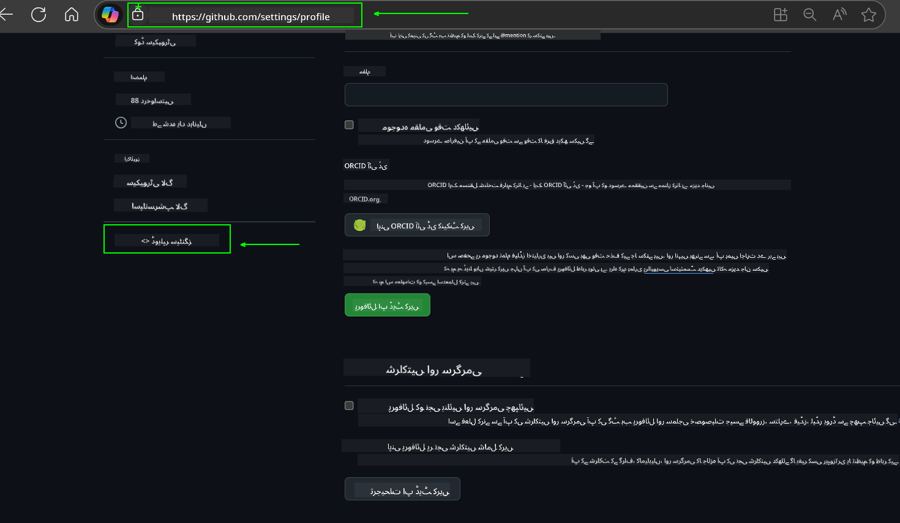
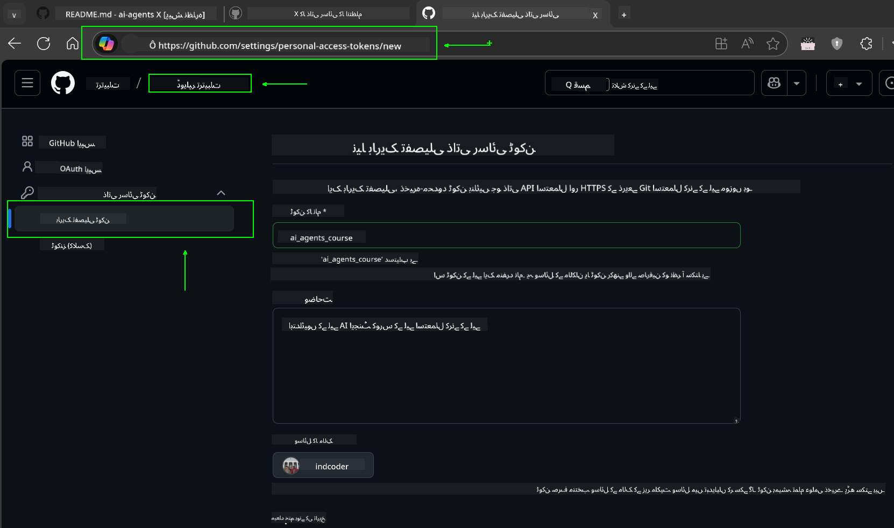
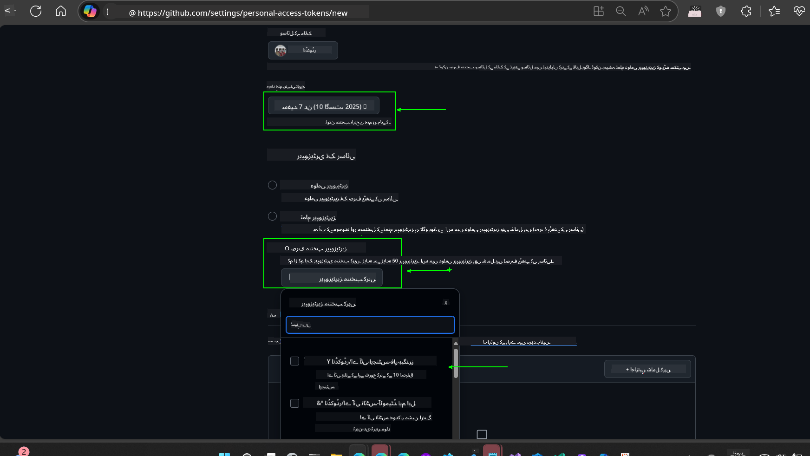
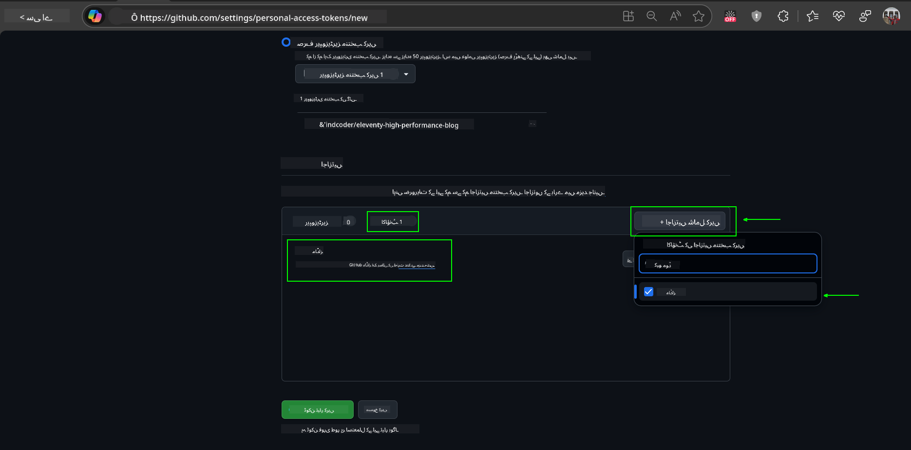
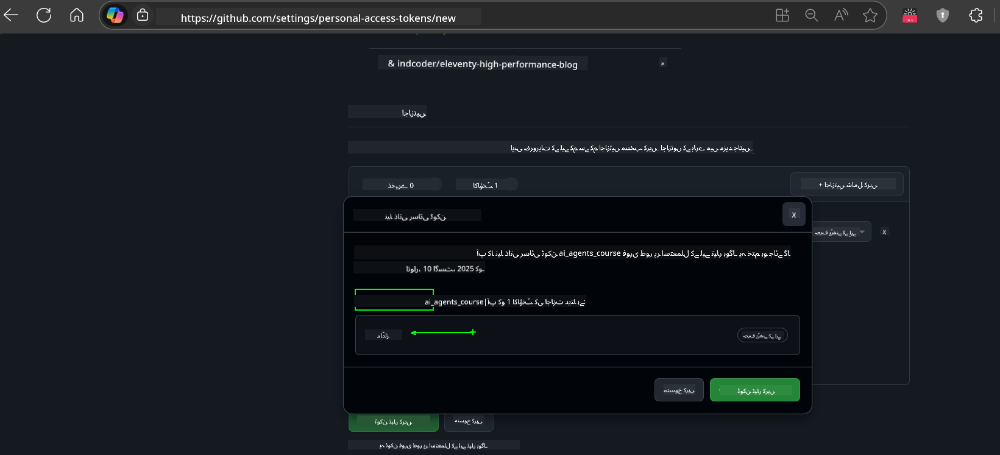
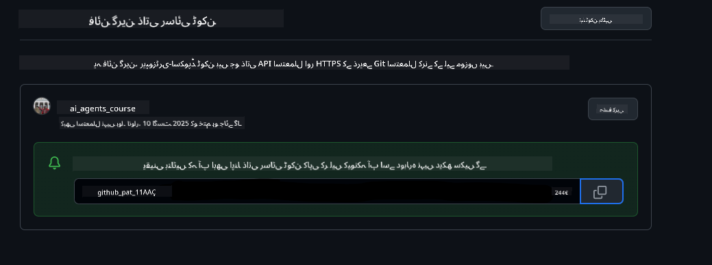

<!--
CO_OP_TRANSLATOR_METADATA:
{
  "original_hash": "8693a24942b670e3cb8def77f92513f9",
  "translation_date": "2025-08-21T12:19:14+00:00",
  "source_file": "00-course-setup/README.md",
  "language_code": "ur"
}
-->
# کورس سیٹ اپ

## تعارف

اس سبق میں ہم اس کورس کے کوڈ نمونوں کو چلانے کے طریقے پر بات کریں گے۔

## اس ریپو کو کلون یا فورک کریں

شروع کرنے کے لیے، براہ کرم GitHub ریپوزٹری کو کلون یا فورک کریں۔ اس سے آپ کے پاس کورس مواد کا اپنا ورژن ہوگا تاکہ آپ کوڈ کو چلا سکیں، ٹیسٹ کر سکیں، اور اس میں تبدیلی کر سکیں!

یہ لنک پر کلک کر کے کیا جا سکتا ہے۔


## کوڈ چلانا

یہ کورس Jupyter Notebooks کی ایک سیریز پیش کرتا ہے جسے آپ AI ایجنٹس بنانے کا عملی تجربہ حاصل کرنے کے لیے چلا سکتے ہیں۔

کوڈ نمونے درج ذیل استعمال کرتے ہیں:

**GitHub اکاؤنٹ درکار ہے - مفت**:

1) Semantic Kernel Agent Framework + GitHub Models Marketplace۔ لیبل کردہ (semantic-kernel.ipynb)
2) AutoGen Framework + GitHub Models Marketplace۔ لیبل کردہ (autogen.ipynb)

**Azure سبسکرپشن درکار ہے**:
3) Azure AI Foundry + Azure AI Agent Service۔ لیبل کردہ (azureaiagent.ipynb)

ہم آپ کو تینوں قسم کے نمونوں کو آزمانے کی ترغیب دیتے ہیں تاکہ آپ دیکھ سکیں کہ آپ کے لیے کون سا بہترین کام کرتا ہے۔

جو بھی آپشن آپ منتخب کریں، وہ نیچے دیے گئے سیٹ اپ کے مراحل کا تعین کرے گا:

## ضروریات

- Python 3.12+
  - **نوٹ**: اگر آپ کے پاس Python3.12 انسٹال نہیں ہے، تو یقینی بنائیں کہ آپ اسے انسٹال کریں۔ پھر python3.12 کا استعمال کرتے ہوئے اپنا venv بنائیں تاکہ requirements.txt فائل سے صحیح ورژن انسٹال ہو سکیں۔
- GitHub اکاؤنٹ - GitHub Models Marketplace تک رسائی کے لیے
- Azure سبسکرپشن - Azure AI Foundry تک رسائی کے لیے
- Azure AI Foundry اکاؤنٹ - Azure AI Agent Service تک رسائی کے لیے

ہم نے اس ریپوزٹری کی جڑ میں ایک `requirements.txt` فائل شامل کی ہے جس میں کوڈ نمونوں کو چلانے کے لیے تمام مطلوبہ Python پیکجز شامل ہیں۔

آپ انہیں اپنی ٹرمینل میں ریپوزٹری کی جڑ پر درج ذیل کمانڈ چلا کر انسٹال کر سکتے ہیں:

```bash
pip install -r requirements.txt
```
ہم کسی بھی تنازعات اور مسائل سے بچنے کے لیے Python ورچوئل ماحول بنانے کی تجویز دیتے ہیں۔

## VSCode سیٹ اپ کریں
یقینی بنائیں کہ آپ VSCode میں Python کا صحیح ورژن استعمال کر رہے ہیں۔


## GitHub Models کے نمونوں کے لیے سیٹ اپ کریں 

### مرحلہ 1: اپنا GitHub Personal Access Token (PAT) حاصل کریں

یہ کورس GitHub Models Marketplace کا استعمال کرتا ہے، جو آپ کو مفت رسائی فراہم کرتا ہے Large Language Models (LLMs) تک جنہیں آپ AI ایجنٹس بنانے کے لیے استعمال کریں گے۔

GitHub Models استعمال کرنے کے لیے، آپ کو ایک [GitHub Personal Access Token](https://docs.github.com/en/authentication/keeping-your-account-and-data-secure/managing-your-personal-access-tokens) بنانا ہوگا۔

یہ آپ کے GitHub اکاؤنٹ میں جا کر کیا جا سکتا ہے۔

براہ کرم [Principle of Least Privilege](https://docs.github.com/en/get-started/learning-to-code/storing-your-secrets-safely) پر عمل کریں جب آپ اپنا ٹوکن بنا رہے ہوں۔ اس کا مطلب ہے کہ آپ کو ٹوکن کو صرف وہی اجازت دینی چاہیے جو اس کورس کے کوڈ نمونوں کو چلانے کے لیے ضروری ہو۔

1. **Developer settings** میں جا کر بائیں جانب `Fine-grained tokens` آپشن منتخب کریں۔
   

    پھر `Generate new token` منتخب کریں۔

    

2. اپنے ٹوکن کے لیے ایک وضاحتی نام درج کریں جو اس کے مقصد کی عکاسی کرے، تاکہ بعد میں اسے پہچاننا آسان ہو۔

    🔐 ٹوکن کی مدت کی سفارش

    تجویز کردہ مدت: 30 دن
    زیادہ محفوظ طریقہ کے لیے، آپ مختصر مدت کا انتخاب کر سکتے ہیں—جیسے 7 دن 🛡️
    یہ ایک ذاتی ہدف مقرر کرنے اور کورس مکمل کرنے کا بہترین طریقہ ہے جب آپ کی سیکھنے کی رفتار زیادہ ہو 🚀۔

    

3. ٹوکن کے دائرہ کار کو اس ریپوزٹری کے فورک تک محدود کریں۔

    

4. ٹوکن کی اجازتوں کو محدود کریں: **Permissions** کے تحت، **Account** ٹیب پر کلک کریں، اور "+ Add permissions" بٹن پر کلک کریں۔ ایک ڈراپ ڈاؤن ظاہر ہوگا۔ براہ کرم **Models** تلاش کریں اور اس کے لیے باکس کو چیک کریں۔
    

5. ٹوکن بنانے سے پہلے مطلوبہ اجازتوں کی تصدیق کریں۔ 

6. ٹوکن بنانے سے پہلے، یقینی بنائیں کہ آپ ٹوکن کو محفوظ جگہ جیسے پاس ورڈ مینیجر والٹ میں محفوظ کرنے کے لیے تیار ہیں، کیونکہ یہ آپ کے بنائے جانے کے بعد دوبارہ نہیں دکھایا جائے گا۔ 

اپنا نیا ٹوکن کاپی کریں جو آپ نے ابھی بنایا ہے۔ آپ اسے اس کورس میں شامل `.env` فائل میں شامل کریں گے۔

### مرحلہ 2: اپنی `.env` فائل بنائیں

اپنی `.env` فائل بنانے کے لیے اپنی ٹرمینل میں درج ذیل کمانڈ چلائیں۔

```bash
cp .env.example .env
```

یہ مثال فائل کو کاپی کرے گا اور آپ کی ڈائریکٹری میں `.env` بنائے گا جہاں آپ ماحول کے متغیرات کے لیے اقدار بھریں گے۔

اپنا ٹوکن کاپی کرنے کے بعد، اپنی پسندیدہ ٹیکسٹ ایڈیٹر میں `.env` فائل کھولیں اور اپنا ٹوکن `GITHUB_TOKEN` فیلڈ میں پیسٹ کریں۔


آپ کو اب اس کورس کے کوڈ نمونوں کو چلانے کے قابل ہونا چاہیے۔

## Azure AI Foundry اور Azure AI Agent Service کے نمونوں کے لیے سیٹ اپ کریں

### مرحلہ 1: اپنا Azure پروجیکٹ اینڈپوائنٹ حاصل کریں

Azure AI Foundry میں ہب اور پروجیکٹ بنانے کے مراحل پر عمل کریں: [Hub resources overview](https://learn.microsoft.com/en-us/azure/ai-foundry/concepts/ai-resources)

جب آپ نے اپنا پروجیکٹ بنا لیا ہو، تو آپ کو اپنے پروجیکٹ کے لیے کنکشن اسٹرنگ حاصل کرنے کی ضرورت ہوگی۔

یہ Azure AI Foundry پورٹل میں اپنے پروجیکٹ کے **Overview** صفحے پر جا کر کیا جا سکتا ہے۔


### مرحلہ 2: اپنی `.env` فائل بنائیں

اپنی `.env` فائل بنانے کے لیے اپنی ٹرمینل میں درج ذیل کمانڈ چلائیں۔

```bash
cp .env.example .env
```

یہ مثال فائل کو کاپی کرے گا اور آپ کی ڈائریکٹری میں `.env` بنائے گا جہاں آپ ماحول کے متغیرات کے لیے اقدار بھریں گے۔

اپنا ٹوکن کاپی کرنے کے بعد، اپنی پسندیدہ ٹیکسٹ ایڈیٹر میں `.env` فائل کھولیں اور اپنا ٹوکن `PROJECT_ENDPOINT` فیلڈ میں پیسٹ کریں۔

### مرحلہ 3: Azure میں سائن ان کریں

سیکیورٹی کے بہترین طریقے کے طور پر، ہم [keyless authentication](https://learn.microsoft.com/azure/developer/ai/keyless-connections?tabs=csharp%2Cazure-cli?WT.mc_id=academic-105485-koreyst) کا استعمال کریں گے تاکہ Microsoft Entra ID کے ساتھ Azure OpenAI میں تصدیق کی جا سکے۔

اگلے مرحلے میں، ایک ٹرمینل کھولیں اور `az login --use-device-code` کمانڈ چلائیں تاکہ اپنے Azure اکاؤنٹ میں سائن ان کریں۔

جب آپ لاگ ان ہو جائیں، تو اپنی سبسکرپشن کو ٹرمینل میں منتخب کریں۔

## اضافی ماحول کے متغیرات - Azure Search اور Azure OpenAI 

Agentic RAG سبق - سبق 5 - میں ایسے نمونے شامل ہیں جو Azure Search اور Azure OpenAI استعمال کرتے ہیں۔

اگر آپ ان نمونوں کو چلانا چاہتے ہیں، تو آپ کو اپنی `.env` فائل میں درج ذیل ماحول کے متغیرات شامل کرنے کی ضرورت ہوگی:

### Overview صفحہ (پروجیکٹ)

- `AZURE_SUBSCRIPTION_ID` - اپنے پروجیکٹ کے **Overview** صفحے پر **Project details** چیک کریں۔

- `AZURE_AI_PROJECT_NAME` - اپنے پروجیکٹ کے **Overview** صفحے کے اوپر دیکھیں۔

- `AZURE_OPENAI_SERVICE` - **Overview** صفحے پر **Azure OpenAI Service** کے لیے **Included capabilities** ٹیب میں دیکھیں۔

### Management Center

- `AZURE_OPENAI_RESOURCE_GROUP` - **Management Center** کے **Overview** صفحے پر **Project properties** پر جائیں۔

- `GLOBAL_LLM_SERVICE` - **Connected resources** کے تحت، **Azure AI Services** کنکشن کا نام تلاش کریں۔ اگر درج نہیں ہے، تو اپنے ریسورس گروپ کے تحت Azure پورٹل میں AI Services ریسورس کا نام چیک کریں۔

### Models + Endpoints صفحہ

- `AZURE_OPENAI_EMBEDDING_DEPLOYMENT_NAME` - اپنا ایمبیڈنگ ماڈل منتخب کریں (مثلاً، `text-embedding-ada-002`) اور ماڈل کی تفصیلات سے **Deployment name** نوٹ کریں۔

- `AZURE_OPENAI_CHAT_DEPLOYMENT_NAME` - اپنا چیٹ ماڈل منتخب کریں (مثلاً، `gpt-4o-mini`) اور ماڈل کی تفصیلات سے **Deployment name** نوٹ کریں۔

### Azure پورٹل

- `AZURE_OPENAI_ENDPOINT` - **Azure AI services** تلاش کریں، اس پر کلک کریں، پھر **Resource Management**، **Keys and Endpoint** پر جائیں، "Azure OpenAI endpoints" تک نیچے سکرول کریں، اور وہ کاپی کریں جو "Language APIs" کہتا ہے۔

- `AZURE_OPENAI_API_KEY` - اسی اسکرین سے، KEY 1 یا KEY 2 کاپی کریں۔

- `AZURE_SEARCH_SERVICE_ENDPOINT` - اپنی **Azure AI Search** ریسورس تلاش کریں، اس پر کلک کریں، اور **Overview** دیکھیں۔

- `AZURE_SEARCH_API_KEY` - پھر **Settings** پر جائیں اور **Keys** پر جا کر پرائمری یا سیکنڈری ایڈمن کی کو کاپی کریں۔

### بیرونی ویب صفحہ

- `AZURE_OPENAI_API_VERSION` - [API version lifecycle](https://learn.microsoft.com/en-us/azure/ai-services/openai/api-version-deprecation#latest-ga-api-release) صفحے پر **Latest GA API release** کے تحت دیکھیں۔

### keyless authentication سیٹ اپ کریں

اپنی اسناد کو ہارڈ کوڈ کرنے کے بجائے، ہم Azure OpenAI کے ساتھ keyless کنکشن استعمال کریں گے۔ ایسا کرنے کے لیے، ہم `DefaultAzureCredential` کو درآمد کریں گے اور بعد میں `DefaultAzureCredential` فنکشن کو کال کریں گے تاکہ اسناد حاصل کی جا سکیں۔

```python
from azure.identity import DefaultAzureCredential, InteractiveBrowserCredential
```

## کہیں پھنس گئے؟

اگر آپ کو اس سیٹ اپ کو چلانے میں کوئی مسئلہ ہو، تو ہمارے ساتھ رابطہ کریں۔

## اگلا سبق

آپ اب اس کورس کے کوڈ کو چلانے کے لیے تیار ہیں۔ AI ایجنٹس کی دنیا کے بارے میں مزید سیکھنے کا لطف اٹھائیں! 

[AI ایجنٹس اور ایجنٹ کے استعمال کے کیسز کا تعارف](../01-intro-to-ai-agents/README.md)

**ڈسکلیمر**:  
یہ دستاویز AI ترجمہ سروس [Co-op Translator](https://github.com/Azure/co-op-translator) کا استعمال کرتے ہوئے ترجمہ کی گئی ہے۔ ہم درستگی کے لیے کوشش کرتے ہیں، لیکن براہ کرم آگاہ رہیں کہ خودکار ترجمے میں غلطیاں یا خامیاں ہو سکتی ہیں۔ اصل دستاویز، جو اس کی اصل زبان میں ہے، کو مستند ذریعہ سمجھا جانا چاہیے۔ اہم معلومات کے لیے، پیشہ ور انسانی ترجمہ کی سفارش کی جاتی ہے۔ اس ترجمے کے استعمال سے پیدا ہونے والی کسی بھی غلط فہمی یا غلط تشریح کے لیے ہم ذمہ دار نہیں ہیں۔